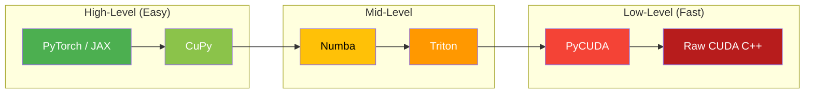
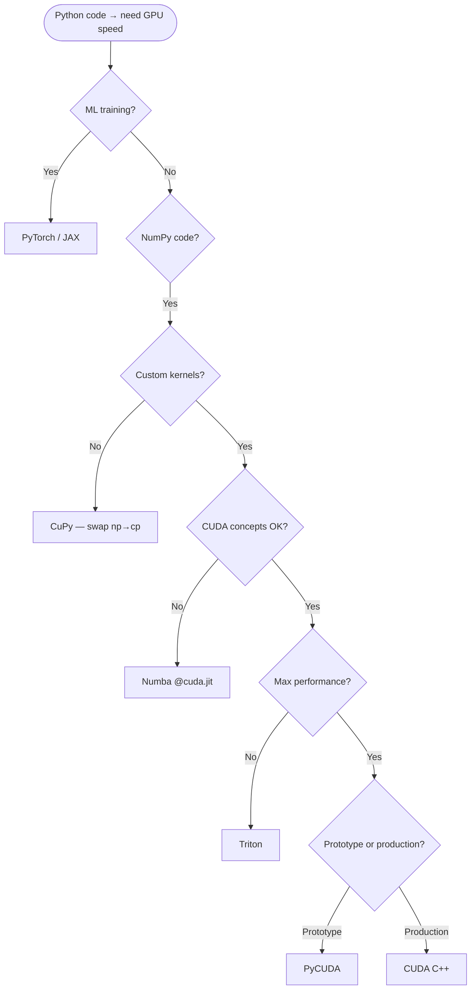

# Appendix K — Python-CUDA Guide: GPU Programming Without C++

> For Python developers who want GPU speed without writing C++/CUDA.
> Complete, runnable code for every framework. Same matrix-multiply benchmark across all.

---

## 1. The Python-CUDA Landscape



### Decision Flowchart



| You want to…                          | Use this     |
|---------------------------------------|--------------|
| Speed up NumPy with zero code changes | CuPy         |
| Write GPU kernels in Python syntax    | Numba        |
| Write high-performance ML kernels     | Triton       |
| Prototype CUDA C kernels quickly      | PyCUDA       |
| Train neural networks on GPU          | PyTorch/JAX  |
| GPU-accelerate pandas / scikit-learn  | RAPIDS       |

---

## 2. CuPy — Drop-in NumPy Replacement for GPU

CuPy mirrors the NumPy API — swap one import and your code runs on GPU.

```bash
pip install cupy-cuda12x   # For CUDA 12.x
```

### Matrix Multiply + FFT + Custom Kernel

This example shows CuPy's three levels of GPU programming: high-level operations (matrix multiply, FFT) that use optimized CUDA libraries under the hood, and a custom `ElementwiseKernel` that lets you write CUDA C expressions directly in Python for element-wise operations.

```python
import cupy as cp, numpy as np, time

N = 4096
A_gpu = cp.random.randn(N, N, dtype=cp.float32)
B_gpu = cp.random.randn(N, N, dtype=cp.float32)

# Matrix multiply — uses cuBLAS under the hood
cp.cuda.Device(0).synchronize()
start = time.perf_counter()
C_gpu = A_gpu @ B_gpu
cp.cuda.Device(0).synchronize()
cupy_time = time.perf_counter() - start

# NumPy comparison
A_cpu, B_cpu = cp.asnumpy(A_gpu), cp.asnumpy(B_gpu)
start = time.perf_counter()
C_cpu = A_cpu @ B_cpu
numpy_time = time.perf_counter() - start
print(f"CuPy: {cupy_time*1000:.1f}ms | NumPy: {numpy_time*1000:.1f}ms | {numpy_time/cupy_time:.0f}x")

# FFT — uses cuFFT
spectrum = cp.fft.fft(cp.random.randn(1_000_000, dtype=cp.float32))

# Custom ElementwiseKernel — CUDA C inside Python
relu = cp.ElementwiseKernel('float32 x', 'float32 y', 'y = x > 0 ? x : 0', 'relu')
print(relu(cp.array([-1, 0, 1, 2, -3], dtype=cp.float32)))  # [0. 0. 1. 2. 0.]
```

### CuPy RawKernel — Full CUDA C in Python

CuPy's `RawKernel` lets you write a full CUDA C kernel as a Python string, compile it at runtime, and launch it with explicit grid/block dimensions. This is useful for prototyping CUDA algorithms before porting them to C++.

```python
import cupy as cp

kernel = cp.RawKernel(r'''
extern "C" __global__
void matmul(const float* A, const float* B, float* C, int M, int N, int K) {
    int row = blockIdx.y * blockDim.y + threadIdx.y;
    int col = blockIdx.x * blockDim.x + threadIdx.x;
    if (row < M && col < N) {
        float sum = 0.0f;
        for (int k = 0; k < K; k++) sum += A[row*K+k] * B[k*N+col];
        C[row*N+col] = sum;
    }
}
''', 'matmul')

M = N = K = 1024
A = cp.random.randn(M, K, dtype=cp.float32)
B = cp.random.randn(K, N, dtype=cp.float32)
C = cp.zeros((M, N), dtype=cp.float32)
kernel(((N+15)//16, (M+15)//16), (16, 16), (A, B, C, M, N, K))
assert cp.allclose(C, A @ B, atol=1e-2)
print("RawKernel matmul verified ✓")
```

### Performance: NumPy vs CuPy (A100 GPU, EPYC CPU)

| Operation           | NumPy   | CuPy   | Speedup |
|---------------------|---------|--------|---------|
| MatMul 4096²        | 850 ms  | 12 ms  | ~70x    |
| FFT 1M points       | 45 ms   | 0.8 ms | ~55x    |
| Elementwise 100M    | 320 ms  | 4.5 ms | ~70x    |
| SVD 2048²           | 4200 ms | 180 ms | ~23x    |
| Sort 100M floats    | 9200 ms | 110 ms | ~84x    |

**CuPy is enough** when your code is NumPy-shaped. **You need more** when you need
shared memory, warp shuffles, or custom training kernels.

---

## 3. Numba — JIT-Compiled CUDA Kernels in Python

Write CUDA kernels in pure Python syntax with `@cuda.jit`.

```bash
pip install numba
```

### Vector Addition

This shows Numba's `@cuda.jit` decorator which compiles a Python function into a GPU kernel. The `cuda.grid(1)` helper computes the global thread index. Data is explicitly transferred to/from the GPU using `cuda.to_device` and `copy_to_host`.

```python
from numba import cuda
import numpy as np, math

@cuda.jit
def vector_add(a, b, c, n):
    tid = cuda.grid(1)  # threadIdx.x + blockIdx.x * blockDim.x
    if tid < n:
        c[tid] = a[tid] + b[tid]

N = 10_000_000
a, b = np.random.randn(N).astype(np.float32), np.random.randn(N).astype(np.float32)
d_a, d_b, d_c = cuda.to_device(a), cuda.to_device(b), cuda.device_array(N, np.float32)
vector_add[math.ceil(N/256), 256](d_a, d_b, d_c, N)
assert np.allclose(d_c.copy_to_host(), a + b)
print("Vector addition verified ✓")
```

### Matrix Multiply with Shared Memory Tiling

This Numba kernel implements matrix multiplication with shared memory tiling — the same optimization used in CUDA C. Each block loads tiles of A and B into `cuda.shared.array`, synchronizes with `cuda.syncthreads()`, and accumulates partial dot products.

```python
from numba import cuda, float32
import numpy as np, math

TILE = 16

@cuda.jit
def matmul_shared(A, B, C, M, N, K):
    sA = cuda.shared.array((TILE, TILE), float32)
    sB = cuda.shared.array((TILE, TILE), float32)
    tx, ty = cuda.threadIdx.x, cuda.threadIdx.y
    row = cuda.blockIdx.y * TILE + ty
    col = cuda.blockIdx.x * TILE + tx
    acc = float32(0.0)

    for t in range(math.ceil(K / TILE)):
        ac = t * TILE + tx
        br = t * TILE + ty
        sA[ty, tx] = A[row, ac] if (row < M and ac < K) else 0.0
        sB[ty, tx] = B[br, col] if (br < K and col < N) else 0.0
        cuda.syncthreads()
        for k in range(TILE):
            acc += sA[ty, k] * sB[k, tx]
        cuda.syncthreads()

    if row < M and col < N:
        C[row, col] = acc

M = N = K = 1024
A, B = np.random.randn(M, K).astype(np.float32), np.random.randn(K, N).astype(np.float32)
d_A, d_B = cuda.to_device(A), cuda.to_device(B)
d_C = cuda.device_array((M, N), np.float32)
matmul_shared[(math.ceil(N/TILE), math.ceil(M/TILE)), (TILE, TILE)](d_A, d_B, d_C, M, N, K)
assert np.allclose(d_C.copy_to_host(), A @ B, atol=1e-1)
print("Shared-memory matmul verified ✓")
```

### Parallel Reduction (Sum)

This implements parallel reduction (summing an array) in Numba. Each block reduces its chunk in shared memory using a tree-based algorithm, then writes one partial sum per block. The host sums the partial results for the final answer.

```python
from numba import cuda, float32
import numpy as np

@cuda.jit
def parallel_sum(data, partial):
    sdata = cuda.shared.array(256, float32)
    tid, gid = cuda.threadIdx.x, cuda.grid(1)
    sdata[tid] = data[gid] if gid < data.shape[0] else 0.0
    cuda.syncthreads()
    s = 128
    while s > 0:
        if tid < s: sdata[tid] += sdata[tid + s]
        cuda.syncthreads()
        s //= 2
    if tid == 0: partial[cuda.blockIdx.x] = sdata[0]

N, T = 1_000_000, 256
d_data = cuda.to_device(np.random.randn(N).astype(np.float32))
blocks = (N + T - 1) // T
d_partial = cuda.device_array(blocks, np.float32)
parallel_sum[blocks, T](d_data, d_partial)
print(f"GPU sum: {d_partial.copy_to_host().sum():.2f}")
```

### Numba Limitations & Performance

| Feature             | Supported | Workaround            |
|---------------------|-----------|------------------------|
| Shared memory       | ✅        | —                      |
| Atomic ops          | ✅        | `cuda.atomic.add()`    |
| Warp shuffle        | ❌        | Use shared memory      |
| Tensor Cores        | ❌        | Use CuPy/Triton       |
| Full Python (dicts) | ❌        | Numeric subset only    |

| Kernel              | Numba  | CuPy built-in | Raw CUDA |
|---------------------|--------|----------------|----------|
| Vector add 100M     | 3.2 ms | 3.1 ms         | 3.0 ms   |
| MatMul 1024 (tiled) | 8.5 ms | 1.2 ms (cuBLAS)| 7.8 ms   |
| Reduction 10M       | 1.8 ms | 0.4 ms (CUB)  | 0.35 ms  |

---

## 4. Triton — OpenAI's GPU Programming Language

**Block-based** programming: you think about blocks of data, not individual threads.
Triton's compiler handles thread mapping, shared memory, and coalescing automatically.

```bash
pip install triton   # Ships its own CUDA compiler
```

### Vector Addition

This Triton kernel adds two vectors using block-level programming. Instead of thinking per-thread like CUDA, you think per-block: `tl.arange` creates a range of offsets, `tl.load/tl.store` handle vectorized memory access, and `mask` prevents out-of-bounds access.

```python
import torch, triton, triton.language as tl

@triton.jit
def vec_add_kernel(a_ptr, b_ptr, c_ptr, N, BS: tl.constexpr):
    pid = tl.program_id(0)
    off = pid * BS + tl.arange(0, BS)
    mask = off < N
    tl.store(c_ptr + off, tl.load(a_ptr + off, mask=mask) + tl.load(b_ptr + off, mask=mask), mask=mask)

N = 10_000_000
a = torch.randn(N, device='cuda')
b = torch.randn(N, device='cuda')
c = torch.empty(N, device='cuda')
vec_add_kernel[((N+1023)//1024,)](a, b, c, N, BS=1024)
assert torch.allclose(c, a + b)
print("Triton vector add verified ✓")
```

### Matrix Multiply (Tiled, with Autotuning)

This Triton matrix multiplication uses `@triton.autotune` to automatically test multiple tile size configurations and pick the fastest one. The `tl.dot` operation maps to hardware matrix multiply (including Tensor Cores on supported GPUs), achieving near-cuBLAS performance.

```python
import torch, triton, triton.language as tl

@triton.autotune(
    configs=[
        triton.Config({'BM': 128, 'BN': 128, 'BK': 32}, num_warps=8),
        triton.Config({'BM': 64,  'BN': 128, 'BK': 32}, num_warps=4),
        triton.Config({'BM': 64,  'BN': 64,  'BK': 64}, num_warps=4),
    ],
    key=['M', 'N', 'K'],
)
@triton.jit
def matmul_kernel(A, B, C, M, N, K,
                  sa0, sa1, sb0, sb1, sc0, sc1,
                  BM: tl.constexpr, BN: tl.constexpr, BK: tl.constexpr):
    pm, pn = tl.program_id(0), tl.program_id(1)
    rm = pm * BM + tl.arange(0, BM)
    rn = pn * BN + tl.arange(0, BN)
    acc = tl.zeros((BM, BN), dtype=tl.float32)
    for k in range(0, K, BK):
        rk = k + tl.arange(0, BK)
        a = tl.load(A + rm[:, None]*sa0 + rk[None, :]*sa1,
                    mask=(rm[:, None] < M) & (rk[None, :] < K), other=0.0)
        b = tl.load(B + rk[:, None]*sb0 + rn[None, :]*sb1,
                    mask=(rk[:, None] < K) & (rn[None, :] < N), other=0.0)
        acc += tl.dot(a, b)
    tl.store(C + rm[:, None]*sc0 + rn[None, :]*sc1, acc,
             mask=(rm[:, None] < M) & (rn[None, :] < N))

def triton_matmul(A, B):
    M, K = A.shape; _, N = B.shape
    C = torch.empty((M, N), device=A.device, dtype=torch.float32)
    grid = lambda m: (triton.cdiv(M, m['BM']), triton.cdiv(N, m['BN']))
    matmul_kernel[grid](A, B, C, M, N, K,
                        A.stride(0), A.stride(1), B.stride(0), B.stride(1),
                        C.stride(0), C.stride(1))
    return C

A = torch.randn(1024, 1024, device='cuda')
B = torch.randn(1024, 1024, device='cuda')
assert torch.allclose(triton_matmul(A, B), A @ B, atol=1e-1)
print("Triton matmul verified ✓")
```

### Fused Softmax

This Triton kernel computes softmax row-by-row in a single fused pass: load the row, subtract the max for numerical stability, exponentiate, normalize by the sum. Fusing all operations into one kernel avoids multiple memory round-trips.

```python
import torch, triton, triton.language as tl

@triton.jit
def softmax_kernel(inp, out, n_cols, stride, BS: tl.constexpr):
    row = tl.program_id(0)
    off = tl.arange(0, BS)
    mask = off < n_cols
    x = tl.load(inp + row * stride + off, mask=mask, other=float('-inf'))
    x = x - tl.max(x, axis=0)
    num = tl.exp(x)
    tl.store(out + row * stride + off, num / tl.sum(num, axis=0), mask=mask)

x = torch.randn(128, 512, device='cuda')
out = torch.empty_like(x)
softmax_kernel[(128,)](x, out, 512, x.stride(0), BS=triton.next_power_of_2(512))
assert torch.allclose(out, torch.softmax(x, dim=-1), atol=1e-5)
print("Triton fused softmax verified ✓")
```

### Triton vs cuBLAS vs Raw CUDA

| Kernel            | Triton  | cuBLAS  | Raw CUDA |
|-------------------|---------|---------|----------|
| MatMul 4096²      | 14.2 ms | 12.8 ms | 13.1 ms  |
| Fused Softmax     | 0.42 ms | N/A     | 0.38 ms  |
| Flash Attention   | 2.1 ms  | N/A     | 1.9 ms   |

Triton reaches **90-95% of hand-tuned CUDA** with ~50% less code. You still need
raw CUDA for explicit warp primitives, custom Tensor Core MMA, or persistent kernels.

---

## 5. PyCUDA — Direct CUDA from Python

Write raw CUDA C kernel strings, compile at runtime, execute from Python.

```bash
pip install pycuda
```

This example writes a full tiled matrix-multiply kernel in CUDA C as a Python string, compiles it at runtime via `SourceModule`, and launches it—demonstrating PyCUDA's compile-and-run workflow.

```python
import pycuda.autoinit
import pycuda.driver as drv
from pycuda.compiler import SourceModule
import numpy as np

mod = SourceModule("""
__global__ void matmul(float *A, float *B, float *C, int M, int N, int K) {
    __shared__ float sA[16][16], sB[16][16];
    int row = blockIdx.y*16 + threadIdx.y, col = blockIdx.x*16 + threadIdx.x;
    float sum = 0.0f;
    for (int t = 0; t < (K+15)/16; t++) {
        int ac = t*16+threadIdx.x, br = t*16+threadIdx.y;
        sA[threadIdx.y][threadIdx.x] = (row<M && ac<K) ? A[row*K+ac] : 0;
        sB[threadIdx.y][threadIdx.x] = (br<K && col<N) ? B[br*N+col] : 0;
        __syncthreads();
        for (int k = 0; k < 16; k++) sum += sA[threadIdx.y][k] * sB[k][threadIdx.x];
        __syncthreads();
    }
    if (row < M && col < N) C[row*N+col] = sum;
}
""")

matmul = mod.get_function("matmul")
M = N = K = 1024
A = np.random.randn(M, K).astype(np.float32)
B = np.random.randn(K, N).astype(np.float32)
C = np.zeros((M, N), np.float32)
matmul(drv.In(A), drv.In(B), drv.Out(C), np.int32(M), np.int32(N), np.int32(K),
       block=(16,16,1), grid=((N+15)//16, (M+15)//16, 1))
assert np.allclose(C, A @ B, atol=1e-1)
print("PyCUDA matmul verified ✓")
```

**Use case:** Prototyping CUDA kernels before porting to C++. Write in a string →
iterate in a REPL → copy the kernel into a `.cu` file when ready.

---

## 6. PyTorch CUDA Operations

PyTorch tensors placed on `'cuda'` automatically dispatch to GPU-optimized libraries (cuBLAS for linear algebra, cuDNN for neural-net primitives) with no explicit kernel calls needed.

```python
import torch

# Tensors on GPU — all operations use cuBLAS/cuDNN automatically
A = torch.randn(1024, 1024, device='cuda')
C = A @ A                           # cuBLAS
D = torch.nn.functional.softmax(A, dim=-1)  # fused GPU kernel
```

### Proper GPU Timing

GPU timing requires CUDA events because Python's `time.time()` doesn't account for asynchronous GPU execution. Events are recorded into the GPU command stream and `synchronize` waits for completion before measuring elapsed time.

```python
start = torch.cuda.Event(enable_timing=True)
end = torch.cuda.Event(enable_timing=True)
start.record()
for _ in range(100): C = A @ A
end.record()
torch.cuda.synchronize()
print(f"{start.elapsed_time(end)/100:.2f} ms per matmul")
```

### Custom CUDA Extension (inline)

PyTorch's `load_inline` compiles a CUDA C kernel and makes it callable from Python as a regular function. This lets you write custom GPU operations (like this GELU activation) without creating a separate build system.

```python
from torch.utils.cpp_extension import load_inline

cuda_src = """
__global__ void gelu_k(const float* x, float* y, int n) {
    int i = blockIdx.x * blockDim.x + threadIdx.x;
    if (i < n) {
        float v = x[i];
        y[i] = v * 0.5f * (1.0f + tanhf(0.7978845608f * (v + 0.044715f*v*v*v)));
    }
}
torch::Tensor fast_gelu(torch::Tensor x) {
    auto y = torch::empty_like(x);
    int n = x.numel();
    gelu_k<<<(n+255)/256, 256>>>(x.data_ptr<float>(), y.data_ptr<float>(), n);
    return y;
}
"""
mod = load_inline('gelu', "torch::Tensor fast_gelu(torch::Tensor x);",
                  cuda_sources=cuda_src, functions=['fast_gelu'])
print(f"Max diff: {(mod.fast_gelu(A) - torch.nn.functional.gelu(A)).abs().max():.6f}")
```

### torch.compile

`torch.compile` applies the TorchDynamo JIT compiler to automatically fuse operations, optimize memory access patterns, and generate efficient GPU code from standard PyTorch model definitions.

```python
model = torch.nn.Sequential(
    torch.nn.Linear(1024, 2048), torch.nn.ReLU(), torch.nn.Linear(2048, 1024)
).cuda()
compiled = torch.compile(model)  # Fuses ops, optimizes memory access
```

---

## 7. JAX — GPU-Accelerated NumPy with XLA

JAX provides four core transforms that compose: `jit` compiles functions to GPU via XLA, `vmap` automatically vectorizes over batch dimensions, `grad` computes gradients via automatic differentiation, and `pmap` distributes computation across multiple GPUs.

```bash
pip install jax[cuda12]
```

JAX combines a NumPy-like API with XLA compilation. The decorators below show its four core transforms: `jit` (compile to GPU), `vmap` (auto-vectorize over batch dims), `grad` (automatic differentiation), and `pmap` (multi-GPU parallelism).

```python
import jax, jax.numpy as jnp

# jit — compile to GPU
@jax.jit
def matmul(A, B): return A @ B
C = matmul(jnp.ones((1024, 1024)), jnp.ones((1024, 1024)))

# vmap — automatic vectorization (no manual batch dims)
def loss(W, x): return jnp.sum((W @ x - 1) ** 2)
batched_loss = jax.vmap(loss, in_axes=(None, 0))

# grad — automatic differentiation
grad_fn = jax.grad(loss)

# pmap — multi-GPU parallelism
@jax.pmap
def parallel_matmul(A, B): return A @ B
```

### Custom Kernels with Pallas (JAX's Triton-like DSL)

Pallas is JAX's low-level kernel DSL (similar to Triton) that lets you write custom GPU kernels using block-based programming. You define a kernel function that operates on block references, and Pallas handles the grid mapping and memory management.

```python
from jax.experimental import pallas as pl

def add_kernel(x_ref, y_ref, o_ref):
    o_ref[...] = x_ref[...] + y_ref[...]

@jax.jit
def pallas_add(x, y):
    return pl.pallas_call(
        add_kernel,
        out_shape=jax.ShapeDtypeStruct(x.shape, x.dtype),
        grid=(x.shape[0] // 128,),
        in_specs=[pl.BlockSpec((128,), lambda i: (i,)),
                  pl.BlockSpec((128,), lambda i: (i,))],
        out_specs=pl.BlockSpec((128,), lambda i: (i,)),
    )(x, y)
```

---

## 8. RAPIDS — GPU Data Science

GPU-accelerated pandas (cuDF), scikit-learn (cuML), and NetworkX (cuGraph).

```bash
conda install -c rapidsai -c conda-forge cudf cuml cugraph cuda-version=12.0
```

This snippet loads a CSV with cuDF (GPU-accelerated pandas), engineers a feature column, and trains a random forest entirely on the GPU using cuML—no data ever leaves device memory.

```python
import cudf
from cuml.ensemble import RandomForestClassifier

df = cudf.read_csv('data.csv')           # GPU CSV parsing
df['ratio'] = df['a'] / (df['b'] + 1e-8) # GPU compute
X, y = df[['a','b','ratio']].values, df['label'].values

clf = RandomForestClassifier(n_estimators=100, max_depth=16)
clf.fit(X, y)  # Entire pipeline on GPU
```

| Scenario               | pandas+sklearn | RAPIDS | Speedup |
|------------------------|----------------|--------|---------|
| Load 10GB CSV          | 120 s          | 8 s    | ~15x    |
| GroupBy 1B rows        | 45 s           | 1.2 s  | ~37x    |
| Random Forest 1M rows  | 180 s          | 4 s    | ~45x    |

---

## 9. Comparison Table

| Framework   | Level   | Learning Curve | Perf vs CUDA | Best Use Case               |
|-------------|---------|----------------|--------------|------------------------------|
| PyTorch/JAX | Highest | Easy           | ~90%         | ML training & inference      |
| CuPy        | High    | Very Easy      | ~85%         | Drop-in NumPy replacement    |
| RAPIDS      | High    | Easy           | ~85%         | GPU pandas / scikit-learn    |
| Numba       | Medium  | Moderate       | ~80%         | Custom GPU kernels in Python |
| Triton      | Medium  | Moderate       | ~95%         | Custom ML kernels            |
| PyCUDA      | Low     | Hard           | ~95%         | Prototyping CUDA C           |
| CUDA C++    | Lowest  | Hardest        | 100%         | Maximum performance          |

### Same Operation (MatMul 1024²) Across All Frameworks

```
Framework          Time     Lines  Difficulty
────────────────   ──────   ─────  ──────────
NumPy (CPU)        85.0 ms     1   Trivial
CuPy                1.2 ms     1   Trivial
PyTorch             1.1 ms     1   Trivial
JAX                 1.1 ms     1   Trivial
Numba (tiled)       8.5 ms    35   Moderate
Triton (autotuned)  1.8 ms    45   Moderate
PyCUDA (tiled)      7.8 ms    30   Hard
CUDA C++ (cuBLAS)   1.0 ms     5   Easy (API)
CUDA C++ (custom)   1.3 ms    80   Hard
```

### Feature Matrix

| Feature             | CuPy | Numba | Triton | PyCUDA | PyTorch | JAX |
|---------------------|------|-------|--------|--------|---------|-----|
| Drop-in NumPy       | ✅   | ❌    | ❌     | ❌     | ❌      | ✅  |
| Custom kernels      | ✅   | ✅    | ✅     | ✅     | ✅      | ✅  |
| Shared memory       | ✅   | ✅    | Auto   | ✅     | ✅      | Auto|
| Warp shuffles       | ✅   | ❌    | ❌     | ✅     | ✅      | ❌  |
| Tensor Cores        | ✅   | ❌    | ✅     | ✅     | ✅      | ✅  |
| Autograd            | ❌   | ❌    | ❌     | ❌     | ✅      | ✅  |
| Multi-GPU           | ✅   | ❌    | ❌     | ✅     | ✅      | ✅  |
| Autotuning          | ❌   | ❌    | ✅     | ❌     | ❌      | ❌  |

---

## 10. When to Graduate to C++ CUDA

### Signs You've Outgrown Python GPU

| Signal                               | Why C++ is needed                    |
|--------------------------------------|--------------------------------------|
| Need warp-level primitives           | `__shfl_sync`, `__ballot_sync`       |
| Need direct Tensor Core access       | WMMA / MMA PTX instructions         |
| Sub-microsecond launch overhead      | Python adds ~10-50 μs per launch     |
| Building production inference engine | TensorRT / custom C++ runtime        |
| Custom multi-GPU communication       | NCCL primitives, custom all-reduce   |
| Persistent kernels                   | Not expressible in Python frameworks |

### The Graduation Path

```
Stage 1: CuPy         → swap np→cp, get 10-100x speedup
Stage 2: Numba         → custom kernels in Python syntax
Stage 3: Triton        → high-perf ML kernels, autotuning
Stage 4: PyCUDA        → prototype real CUDA C in Python
Stage 5: CUDA C++      → full hardware access
```

### The Pragmatic Rule

> **80% of GPU work can stay in Python.** The 20% that needs C++ is usually the
> innermost kernel of a training loop, a production inference server, or something
> touching Tensor Cores at the register level.
>
> Start in Python. Profile. Port **only the bottleneck kernel** to C++.

### The Hybrid Approach

This hybrid approach keeps most of the model in Python (using PyTorch for standard layers) while calling a custom C++ CUDA kernel for the performance-critical attention operation. This gives you the best of both worlds: Python productivity plus C++ performance where it matters.

```python
import torch
from my_cuda_ext import fast_attention  # C++ CUDA kernel

class MyModel(torch.nn.Module):
    def forward(self, x):
        x = self.layernorm(x)            # PyTorch (Python) — fine
        x = fast_attention(x, self.W)     # C++ CUDA — the hot 1%
        return self.output(x)
```

Build with:

This `setup.py` file uses PyTorch's `CUDAExtension` build system to compile your `.cu` files into a Python-importable module. The `extra_compile_args` pass optimization flags to `nvcc`.

```python
# setup.py
from setuptools import setup
from torch.utils.cpp_extension import BuildExtension, CUDAExtension

setup(
    name='my_cuda_ext',
    ext_modules=[CUDAExtension('my_cuda_ext', ['fast_attention.cu'],
                               extra_compile_args={'nvcc': ['-O3', '--use_fast_math']})],
    cmdclass={'build_ext': BuildExtension},
)
```

---

> **Next:** When you're ready for full C++ CUDA, start with
> [Chapter 01 — CUDA Fundamentals](../01_CUDA_Fundamentals/README.md).
