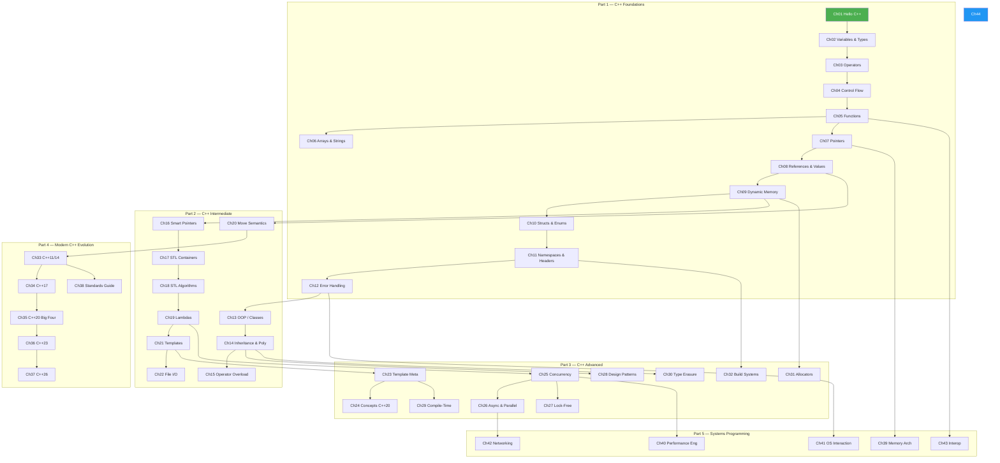
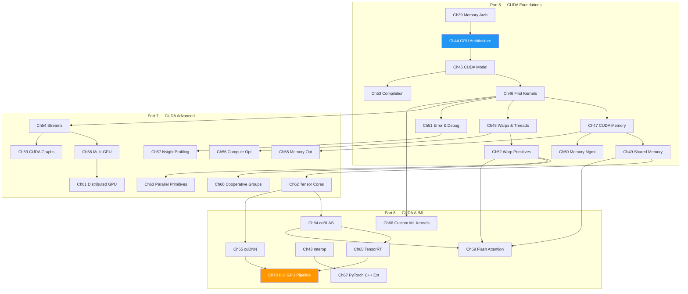
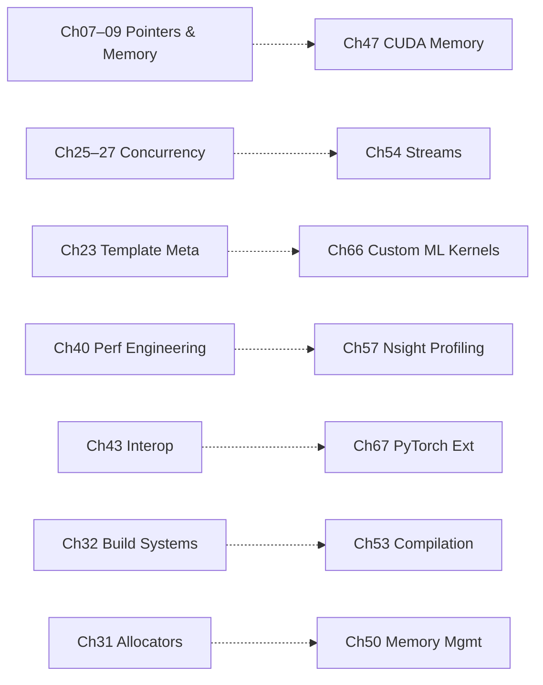
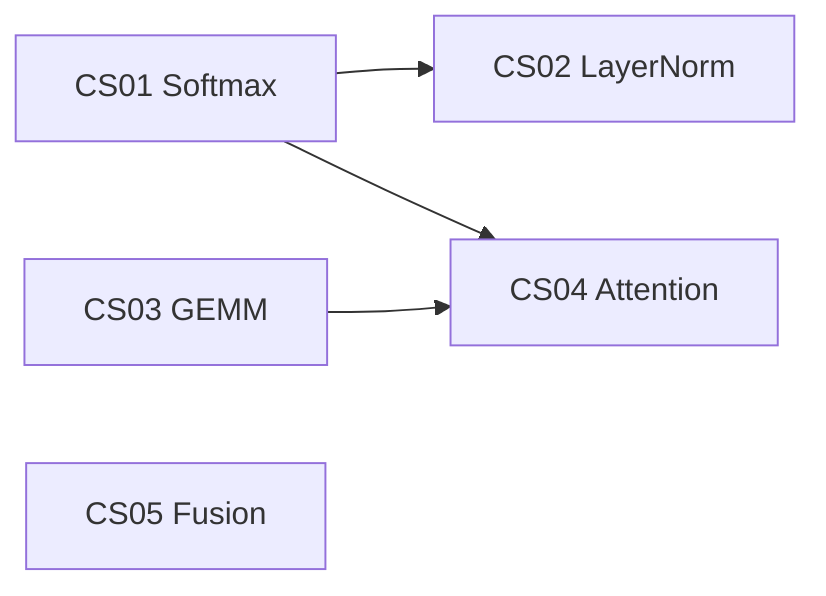

# Appendix M — Cross-Reference Map

> **Navigate the entire repo at a glance.** This map shows how all 70 chapters, 10 labs,
> 17 projects, 5 case studies, and supporting resources interconnect.
> Use it to plan your learning path, find prerequisites, or jump to related material.

---

## 1. Concept Dependency Graph

### C++ Track



### CUDA Track



### Cross-Track Bridges



---

## 2. Topic-to-Chapter Map

*"I want to learn about X → read these chapters."*

| Topic | Primary Chapter | Also See |
|-------|----------------|----------|
| **Algorithms (STL)** | Ch18 STL Algorithms | Ch19 Lambdas, Ch40 Performance |
| **Allocators** | Ch31 Custom Allocators | Ch09 Dynamic Memory, Ch50 CUDA Mem Mgmt |
| **Arrays** | Ch06 Arrays & Strings | Ch17 STL Containers |
| **Async** | Ch26 Async & Parallel | Ch54 CUDA Streams, Ch35 C++20 (Coroutines) |
| **Atomics** | Ch25 Concurrency | Ch27 Lock-Free, Ch52 Warp Primitives |
| **Attention** | Ch69 Flash Attention | CS04 Attention Opt, Lab10 GEMM |
| **Bank Conflicts** | Ch49 Shared Memory | Lab04, Anti-Patterns §3 |
| **Build Systems** | Ch32 Build Systems | Ch53 CUDA Compilation, App C CMake |
| **C Interop** | Ch43 Interop | Ch06 C-Style Legacy, Ch07 Pointers |
| **Caching** | Ch39 Memory Architecture | Ch47 CUDA Memory, Ch55 Memory Opt |
| **Classes** | Ch13 OOP / Classes | Ch14 Inheritance, Ch28 Design Patterns |
| **CMake** | Ch32 Build Systems | App C CMake Cookbook, Ch53 Compilation |
| **Coalescing** | Ch47 CUDA Memory | Ch55 Memory Opt, Lab07, Anti-Patterns §1 |
| **Compile-Time** | Ch29 Compile-Time Prog | Ch23 Template Meta, Ch24 Concepts |
| **Concepts (C++20)** | Ch24 Concepts | Ch35 C++20 Big Four, Ch38 Standards |
| **Concurrency** | Ch25 Concurrency | Ch26 Async, Ch27 Lock-Free, Ch54 Streams |
| **Containers** | Ch17 STL Containers | Ch06 Arrays, Ch31 Allocators |
| **Control Flow** | Ch04 Control Flow | Ch48 Warps (divergence) |
| **Cooperative Groups** | Ch60 Cooperative Groups | Ch52 Warp Primitives, Ch63 Primitives |
| **Coroutines** | Ch35 C++20 Big Four | Ch26 Async, P03 Thread Pool |
| **CRTP** | Ch23 Template Meta | Ch28 Design Patterns, Ch30 Type Erasure |
| **cuBLAS** | Ch64 cuBLAS | Ch69 Flash Attention, CS03 GEMM, P15 Neural Net |
| **cuDNN** | Ch65 cuDNN | Ch68 TensorRT, Ch70 Full Pipeline |
| **CUDA Graphs** | Ch59 CUDA Graphs | Ch54 Streams, Ch57 Profiling |
| **Debugging (C++)** | Ch12 Error Handling | App D Debug Toolkit, Ch32 Build |
| **Debugging (CUDA)** | Ch51 Error & Debug | Ch57 Nsight Profiling, App D |
| **Design Patterns** | Ch28 Design Patterns | Ch23 CRTP, Ch30 Type Erasure, C01 HFT |
| **Distributed GPU** | Ch61 Distributed GPU | Ch58 Multi-GPU, P14 Multi-GPU Reduction |
| **Dynamic Memory** | Ch09 Dynamic Memory | Ch16 Smart Ptrs, Ch31 Allocators |
| **Error Handling** | Ch12 Error Handling | Ch51 CUDA Debug, Ch41 OS Interaction |
| **Expression Tmpl** | P05 Expression Tmpl | Ch23 Template Meta, Ch15 Op Overload |
| **File I/O** | Ch22 File I/O | Ch41 OS Interaction |
| **Flash Attention** | Ch69 Flash Attention | CS04 Attention Opt, CS01 Softmax |
| **Functions** | Ch05 Functions | Ch19 Lambdas, Ch21 Templates |
| **Fusion** | CS05 Elementwise Fusion | Ch66 Custom ML Kernels, Ch56 Compute Opt |
| **GEMM** | CS03 GEMM Opt | Lab10, Ch62 Tensor Cores, Ch64 cuBLAS |
| **GPU Architecture** | Ch44 GPU Architecture | App E GPU Timeline, App J Buying Guide |
| **GPU Languages** | App F Language Comparison | Ch44 Architecture, Ch45 CUDA Model |
| **Histograms** | P07 CUDA Histogram | Ch49 Shared Memory, Ch52 Warp Prims |
| **HFT / Low-Latency** | C01 HFT Engine | Ch27 Lock-Free, Ch40 Performance |
| **Image Processing** | P08 Image Filters | Ch49 Shared Mem, Ch47 CUDA Memory |
| **Inference** | Ch68 TensorRT | Ch62 Tensor Cores, Ch70 Pipeline |
| **Inheritance** | Ch14 Inheritance | Ch30 Type Erasure, Ch28 Patterns |
| **Interop** | Ch43 Interop | Ch67 PyTorch C++ Ext |
| **Iterators** | Ch18 STL Algorithms | Ch17 Containers, Ch35 Ranges |
| **Kernel Writing** | Ch46 First Kernels | Ch66 Custom ML Kernels, Lab01–02 |
| **Lambdas** | Ch19 Lambdas | Ch18 STL Algorithms, Ch25 Concurrency |
| **LayerNorm** | CS02 LayerNorm Opt | CS01 Softmax, Ch52 Warp Prims |
| **Lock-Free** | Ch27 Memory Model | Ch25 Concurrency, C01 HFT |
| **MatMul** | P09 MatMul Opt | CS03 GEMM, Lab10 Mini GEMM |
| **Memory Layout** | Ch02 Variables & Types | Ch39 Mem Arch, Ch47 CUDA Mem |
| **Memory Model** | Ch27 Memory Model | Ch25 Concurrency |
| **Memory Opt (CUDA)** | Ch55 Memory Opt | Ch47 CUDA Mem, Ch49 Shared Mem |
| **Mixed Precision** | Ch62 Tensor Cores | Ch64 cuBLAS, Ch69 Flash Attention |
| **Modules (C++20)** | Ch35 C++20 Big Four | Ch11 Namespaces/Headers, Ch38 Standards |
| **Move Semantics** | Ch20 Move Semantics | Ch08 References, Ch33 C++11/14 |
| **Multi-GPU** | Ch58 Multi-GPU | Ch61 Distributed, P14 Multi-GPU Red |
| **Namespaces** | Ch11 Namespaces | Ch32 Build Systems |
| **N-Body** | P11 N-Body Sim | Ch49 Shared Mem, Ch56 Compute Opt |
| **NCCL** | Ch61 Distributed GPU | P14 Multi-GPU Reduction |
| **Neural Networks** | P15 CUDA Neural Net | Ch64 cuBLAS, Ch65 cuDNN |
| **Networking** | Ch42 Networking | Ch26 Async, P04 HTTP Server |
| **Nsight** | Ch57 Nsight Profiling | App D Debug Toolkit, Ch55–56 Opt |
| **Occupancy** | Ch48 Warps & Threads | Ch56 Compute Opt, Lab06 |
| **OOP** | Ch13 OOP / Classes | Ch14 Inheritance, Ch28 Patterns |
| **Operator Overload** | Ch15 Op Overloading | P05 Expression Tmpl |
| **Parallel Primitives** | Ch63 Parallel Primitives | P10 Prefix Scan, P13 Radix Sort |
| **Performance** | Ch40 Perf Engineering | Ch55–56 CUDA Opt, App B Numbers |
| **Pointers** | Ch07 Pointers | Ch16 Smart Ptrs, Ch09 Dynamic Mem |
| **Prefix Scan** | P10 Prefix Scan | Ch63 Parallel Primitives |
| **Profiling** | Ch57 Nsight Profiling | Ch40 Perf Engineering, App D |
| **PyTorch Ext** | Ch67 PyTorch C++ Ext | Ch43 Interop, Ch66 Custom Kernels |
| **Radix Sort** | P13 Radix Sort | Ch63 Parallel Primitives |
| **Ranges (C++20)** | Ch35 C++20 Big Four | Ch18 STL Algorithms |
| **Ray Tracing** | C02 Ray Tracer | Ch46 Kernels, Ch49 Shared Mem |
| **Reduction** | Lab09 Reduction Opt | Ch63 Parallel Primitives, Ch52 Warp |
| **References** | Ch08 References | Ch20 Move Semantics |
| **Shared Memory** | Ch49 Shared Memory | Lab04, CS01–CS03 |
| **Smart Pointers** | Ch16 Smart Pointers | Ch09 Dynamic Memory, Ch33 C++11 |
| **Softmax** | CS01 Softmax Opt | Ch49 Shared Mem, Ch52 Warp Prims |
| **Standards** | Ch38 Standards Guide | Ch33–37 Individual Standards |
| **Streams (CUDA)** | Ch54 Streams | Lab08, Ch59 CUDA Graphs |
| **Structs / Enums** | Ch10 Structs & Enums | Ch13 Classes |
| **Templates** | Ch21 Templates | Ch23 Meta, Ch24 Concepts |
| **Tensor Cores** | Ch62 Tensor Cores | Lab10, CS03 GEMM, Ch64 cuBLAS |
| **TensorRT** | Ch68 TensorRT | Ch65 cuDNN, Ch70 Pipeline |
| **Thread Pool** | P03 Thread Pool | Ch25 Concurrency, Ch26 Async |
| **Type Erasure** | Ch30 Type Erasure | Ch14 Inheritance, Ch28 Patterns |
| **Unified Memory** | Ch50 Memory Mgmt | Ch47 CUDA Memory |
| **Variables & Types** | Ch02 Variables & Types | Ch10 Structs, Ch21 Templates |
| **Warp Divergence** | Ch48 Warps & Threads | Lab05, Anti-Patterns §2 |
| **Warp Primitives** | Ch52 Warp Primitives | Ch60 Cooperative Groups, CS01–02 |

---

## 3. Chapter-to-Lab Map

| Chapter(s) | Related Lab | What the Lab Practices |
|------------|------------|------------------------|
| Ch44 GPU Architecture | — | Theory only — no lab |
| Ch45 CUDA Model | Lab01 First GPU Program | Launch a kernel, see output |
| Ch46 First Kernels | Lab01, Lab02 | Write kernels, master thread indexing |
| Ch47 CUDA Memory | Lab03, Lab07 | Measure transfer costs; coalescing experiments |
| Ch48 Warps & Threads | Lab05, Lab06 | Quantify divergence penalty; tune occupancy |
| Ch49 Shared Memory | Lab04 | Tiled matrix transpose with shared mem |
| Ch52 Warp Primitives | Lab05 | Warp-level divergence patterns |
| Ch54 Streams | Lab08 | Overlap compute ↔ transfer with streams |
| Ch55–56 Memory/Compute Opt | Lab09 | Reduction: naive → warp-shuffle optimized |
| Ch62 Tensor Cores | Lab10 | Build a mini-GEMM with WMMA intrinsics |
| Ch63 Parallel Primitives | Lab09 | Reduction patterns from scratch |

### Lab Dependency Chain

```
Lab01 ──► Lab02 ──► Lab03 ──► Lab04
                         │
                         ├──► Lab05 ──► Lab06
                         │
                         └──► Lab07
                                │
                                ├──► Lab08 ──► Lab09
                                │
                                └──► Lab10
```

---

## 4. Chapter-to-Project Map

| Chapter Range | Project(s) | What You Build |
|---------------|-----------|----------------|
| **Ch01–12** Foundations | P01 JSON Parser | Apply all C++ basics: parsing, memory, error handling |
| **Ch13–15** OOP | P02 Skip List | Inheritance, operator overloading, iterators |
| **Ch16–22** Intermediate | P02 Skip List, P03 Thread Pool | Smart ptrs, STL, move semantics, templates |
| **Ch23–32** Advanced C++ | P04 HTTP Server, P05 Expression Tmpl | TMP, concepts, async I/O, design patterns |
| **Ch33–38** Modern Stds | P03 Thread Pool (C++20 feats) | Coroutines, ranges, jthread |
| **Ch39–43** Systems | P04 HTTP Server | io_uring, networking, OS interaction |
| **Ch44–53** CUDA Found. | P06 Vector Ops, P07 Histogram, P08 Image Filters | First real CUDA projects |
| **Ch54–56** CUDA Opt | P09 MatMul, P10 Prefix Scan, P11 N-Body | Optimization-focused projects |
| **Ch54, Ch59** Streams/Graphs | P12 Stream Pipeline | Multi-stage async GPU pipeline |
| **Ch63** Primitives | P10 Prefix Scan, P13 Radix Sort | Scan & sort from scratch |
| **Ch58, Ch61** Multi-GPU | P14 Multi-GPU Reduction | NCCL, peer-to-peer, distributed reduce |
| **Ch64–70** AI/ML | P15 CUDA Neural Net | Train a net with custom CUDA kernels |
| **All C++** | C01 HFT Engine | Full capstone — lock-free, networking, perf |
| **All CUDA** | C02 Ray Tracer | Full capstone — BVH, shading, AI denoiser |

### Project Dependency Chain

```
  C++ Projects                           CUDA Projects

  P01 ─────► P02 ────► P03              P06 ──► P07 ──► P08
               │         │                          │
               ▼         ▼                          ▼
             P04 ◄──── P05              P09 ──► P10 ──► P11
               │                           │         │
               ▼                           ▼         ▼
             C01 (HFT Capstone)         P12 ──► P13 ──► P14
                                           │
                                           ▼
                                         P15 ──► C02 (Ray Tracer Capstone)
```

---

## 5. Case Study Prerequisites

| Case Study | Must Read First | Key Concepts Required |
|------------|----------------|----------------------|
| **CS01** Softmax Opt | Ch46, Ch49, Ch52 | Warp shuffle reduce, shared memory tiling, online softmax |
| **CS02** LayerNorm Opt | Ch46, Ch49, Ch52, CS01 | Online mean/variance, Welford's algorithm, warp reduce |
| **CS03** GEMM Opt | Ch46, Ch49, Ch52, Ch62 | Tiling strategies, tensor core WMMA, register blocking |
| **CS04** Attention Opt | CS01, CS03, Ch69 | Softmax + GEMM combined, tiled attention, memory IO |
| **CS05** Elem. Fusion | Ch46, Ch47 | Elementwise patterns, memory bandwidth limits, fusion |

### Case Study Dependency Chain



---

## 6. Cookbook & Appendix Quick Finder

| I need to… | Go to |
|------------|-------|
| Avoid common CUDA mistakes | CUDA Anti-Patterns |
| Benchmark a micro-kernel | CUDA Micro-Benchmarks |
| Find a reusable CUDA pattern | CUDA Patterns Cookbook |
| Read production kernel code | CUDA Code Reading Guide |
| Shift from CPU to GPU mindset | Think Parallel |
| Prep for interviews | App A Interview Mega-Guide |
| Remember key performance numbers | App B Perf Cheat Sheet |
| Set up CMake for CUDA | App C CMake Cookbook |
| Debug a segfault or race | App D Debug & Profiling Toolkit |
| Compare GPU generations | App E GPU Architecture Timeline |
| Try ROCm / SYCL / Metal | App F GPU Language Comparison |
| Quick-look a CUDA API | App G CUDA Quick Reference |
| Quick-look a C++ feature | App H C++ Quick Reference |
| Look up a term | App I Glossary |
| Buy a GPU for learning | App J GPU Buying Guide |

---

## 7. Recommended Reading Paths

### Path A — "I know C, teach me modern C++"

```
Ch01 → Ch02–12 (skim) → Ch13–16 → Ch19–21 → Ch25 → Ch33 → Ch35 → Ch38
Projects: P01 → P02 → P03 → C01
```

### Path B — "I know C++, teach me CUDA"

```
Ch39 → Ch44–49 → Ch52 → Ch54 → Ch55–57 → Ch62–64 → Ch69
Labs: Lab01–Lab10 (in order)
Case Studies: CS01 → CS02 → CS03 → CS04
Projects: P06 → P09 → P15 → C02
```

### Path C — "I want to write ML kernels ASAP"

```
Ch44–46 (essentials) → Ch47 → Ch49 → Ch52 → Ch62 → Ch64–66 → Ch69
Labs: Lab01 → Lab04 → Lab10
Case Studies: CS01 → CS03 → CS04
Projects: P09 → P15
```

### Path D — "Full journey, front to back"

```
Part 1 → Part 2 → Part 3 → Part 4 → Part 5 → Part 6 → Part 7 → Part 8
Labs & Projects interleaved at each stage
All Case Studies after Part 7
Capstones C01 and C02 at the end
```

---

## 8. Full Inventory Summary

| Category | Count | Range |
|----------|-------|-------|
| Chapters | 70 | Ch01–Ch70 |
| CUDA Labs | 10 | Lab01–Lab10 |
| Projects | 15 | P01–P15 |
| Capstones | 2 | C01–C02 |
| Case Studies | 5 | CS01–CS05 |
| Cookbook Guides | 5 | Anti-Patterns, Patterns, Benchmarks, Code Reading, Think Parallel |
| Appendices | 10+ | A–J (plus this file) |
| **Total files** | **117+** | |

### Part Breakdown

| Part | Chapters | Focus |
|------|----------|-------|
| Part 1 | Ch01–Ch12 | C++ Foundations |
| Part 2 | Ch13–Ch22 | C++ Intermediate |
| Part 3 | Ch23–Ch32 | C++ Advanced |
| Part 4 | Ch33–Ch38 | Modern C++ Evolution (C++11 → C++26) |
| Part 5 | Ch39–Ch43 | Systems Programming |
| Part 6 | Ch44–Ch53 | CUDA Foundations |
| Part 7 | Ch54–Ch63 | CUDA Advanced |
| Part 8 | Ch64–Ch70 | CUDA for AI / ML |

---

## 9. Anti-Pattern Cross-References

| Anti-Pattern # | Topic | Related Chapters | Related Labs |
|----------------|-------|-----------------|-------------|
| §1 | Uncoalesced memory access | Ch47, Ch55 | Lab07 |
| §2 | Warp divergence | Ch48 | Lab05 |
| §3 | Shared memory bank conflicts | Ch49 | Lab04 |
| §4 | Missing error checks | Ch51 | — |
| §5 | Excess host↔device transfers | Ch47, Ch50 | Lab03 |
| §6 | Ignoring occupancy | Ch48, Ch56 | Lab06 |
| §7 | Synchronization overuse | Ch52, Ch60 | — |
| §8 | Not using streams | Ch54 | Lab08 |
| §9 | Naive reduction | Ch63 | Lab09 |
| §10 | Ignoring mixed precision | Ch62 | Lab10 |

---

## 10. Where Topics Appear Across Resource Types

A bird's-eye view of key topics and every place they surface.

| Topic | Chapters | Labs | Projects | Case Studies | Cookbook |
|-------|----------|------|----------|-------------|---------|
| Memory coalescing | Ch47, Ch55 | Lab07 | P09 | CS03 | Anti-Patterns §1 |
| Shared memory tiling | Ch49 | Lab04 | P08, P09 | CS01–CS04 | Patterns §2 |
| Warp shuffles | Ch52 | Lab05, Lab09 | P07 | CS01, CS02 | Patterns §5 |
| Tensor cores / WMMA | Ch62 | Lab10 | P09 | CS03, CS04 | — |
| Stream concurrency | Ch54 | Lab08 | P12 | — | Anti-Patterns §8 |
| Reduction | Ch63 | Lab09 | P14 | CS01, CS02 | Anti-Patterns §9 |
| Atomics | Ch25, Ch52 | — | P07 | — | Anti-Patterns §7 |
| Memory pools | Ch31, Ch50 | — | P03 | — | — |
| Template meta | Ch23, Ch29 | — | P05 | — | — |
| Lock-free | Ch27 | — | P03, C01 | — | — |
| Profiling | Ch57 | Lab06 | P09 | CS01–CS04 | Micro-Benchmarks |
| cuBLAS / cuDNN | Ch64, Ch65 | — | P15 | CS03 | Code Reading |
| Flash Attention | Ch69 | — | — | CS04 | Code Reading |
| Move semantics | Ch20 | — | P02, P03 | — | — |
| RAII & smart ptrs | Ch16 | — | P01, C01 | — | — |
| Design patterns | Ch28 | — | P04, C01 | — | — |

---

*Last updated: 2025*
