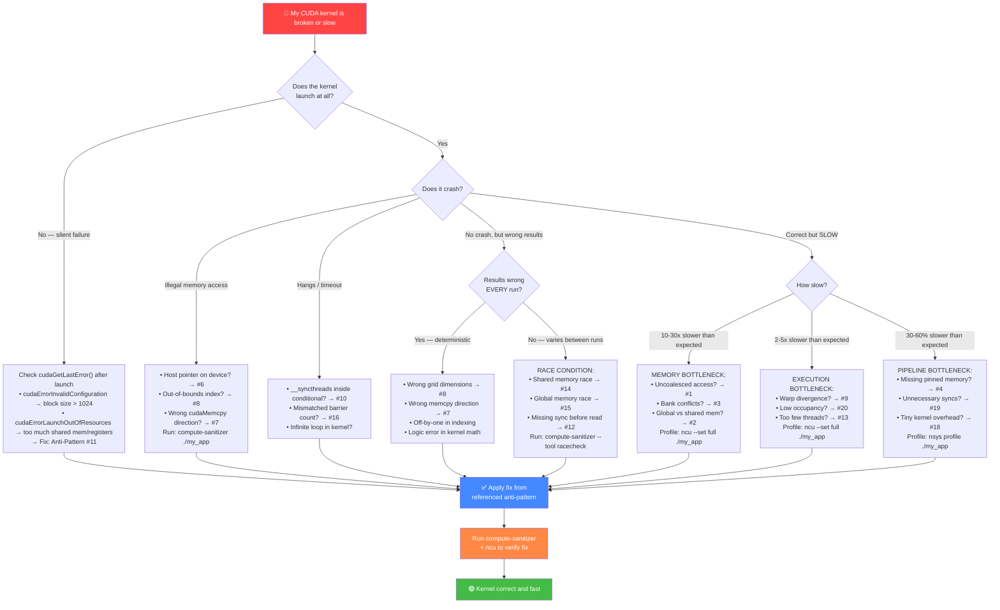

# CUDA Anti-Patterns: 20 Mistakes Every Beginner Makes

> **The fastest way to learn CUDA is to study what NOT to do.**
> Each anti-pattern below shows broken or slow code, explains why it fails,
> and gives you the production-quality fix.

---

## Table of Contents

| # | Category | Anti-Pattern | Impact |
|---|----------|-------------|--------|
| 1 | Memory | Uncoalesced memory access | 10-30× slowdown |
| 2 | Memory | Global memory instead of shared memory | 5-20× unnecessary latency |
| 3 | Memory | Shared memory bank conflicts | 2-32× slowdown on shared mem |
| 4 | Memory | Forgetting pinned memory for async transfers | Can't overlap compute+transfer |
| 5 | Memory | Memory leaks (missing cudaFree) | GPU OOM after repeated calls |
| 6 | Memory | Using host pointer on device (or vice versa) | Illegal memory access crash |
| 7 | Memory | Wrong cudaMemcpy direction | Silent data corruption |
| 8 | Execution | Wrong grid/block dimensions | Silent wrong results |
| 9 | Execution | Excessive warp divergence | 2-32× branch penalty |
| 10 | Execution | `__syncthreads()` inside conditional | Undefined behavior / hangs |
| 11 | Execution | Thread block too large (>1024) | Kernel launch failure |
| 12 | Execution | Not synchronizing before reading results | Stale / partial data |
| 13 | Execution | Launching too few threads | GPU underutilized |
| 14 | Synchronization | Race condition on shared memory | Missing `__syncthreads()` |
| 15 | Synchronization | Race condition on global memory | Missing atomics |
| 16 | Synchronization | Deadlock from mismatched barriers | Not all threads reach barrier |
| 17 | Synchronization | Incorrect atomic operation | Lost updates |
| 18 | Performance | Kernel launch overhead dominance | Tiny kernels serialized |
| 19 | Performance | Unnecessary `cudaDeviceSynchronize` | Serializing GPU and CPU |
| 20 | Performance | Ignoring occupancy | Low parallelism |

---

# Memory Mistakes

---

## ❌ Anti-Pattern 1: Uncoalesced Memory Access

**The Mistake:**

```cuda
// Each thread reads a column — stride = number of columns
// Memory layout: row-major, but access pattern is column-major
__global__ void column_sum(float* matrix, float* result, int rows, int cols) {
    int col = blockIdx.x * blockDim.x + threadIdx.x;
    if (col >= cols) return;

    float sum = 0.0f;
    for (int row = 0; row < rows; row++) {
        // Adjacent threads (col, col+1, col+2...) access:
        //   matrix[0*cols + col], matrix[0*cols + col+1], ...  ← OK for row 0
        // But the LOOP iterates rows, so each thread jumps by 'cols' elements
        // Thread 0: matrix[0], matrix[cols], matrix[2*cols]...
        // Thread 1: matrix[1], matrix[cols+1], matrix[2*cols+1]...
        // Within a single iteration, adjacent threads DO read adjacent addresses.
        // The REAL problem is the strided pattern below:
        sum += matrix[row * cols + col];  // stride = cols between iterations
    }
    result[col] = sum;
}

// WORSE example — truly uncoalesced: struct-of-arrays vs array-of-structs
struct Particle {
    float x, y, z;     // 12 bytes per particle
    float vx, vy, vz;  // AoS layout
};

__global__ void update_particles_bad(Particle* particles, int n) {
    int i = blockIdx.x * blockDim.x + threadIdx.x;
    if (i >= n) return;

    // Thread 0 reads particles[0].x  at offset 0
    // Thread 1 reads particles[1].x  at offset 24 bytes
    // Thread 2 reads particles[2].x  at offset 48 bytes
    // Stride = sizeof(Particle) = 24 bytes → uncoalesced!
    particles[i].x += particles[i].vx;  // 24-byte stride between threads
    particles[i].y += particles[i].vy;
    particles[i].z += particles[i].vz;
}
```

**What Goes Wrong:** When adjacent threads in a warp access memory addresses that are
far apart (strided), the GPU issues multiple memory transactions instead of one. A
32-thread warp that should use 1 cache line fires up to 32 separate transactions.

**The Impact:** 10-30× slowdown. A strided access pattern with stride S wastes
`(S × sizeof(element)) / 128` cache lines per warp load. For the Particle example
above, each warp load touches 32 × 24 = 768 bytes across 6+ cache lines instead of
packing into 1-2 lines.

**✅ The Fix:**

```cuda
// Structure of Arrays — each field is contiguous
struct ParticlesSoA {
    float* x;   // all x values packed together
    float* y;   // all y values packed together
    float* z;
    float* vx;
    float* vy;
    float* vz;
};

__global__ void update_particles_good(ParticlesSoA p, int n) {
    int i = blockIdx.x * blockDim.x + threadIdx.x;
    if (i >= n) return;

    // Thread 0 reads p.x[0], Thread 1 reads p.x[1], Thread 2 reads p.x[2]...
    // Stride = sizeof(float) = 4 bytes → perfectly coalesced!
    p.x[i] += p.vx[i];  // 1 transaction for the whole warp
    p.y[i] += p.vy[i];
    p.z[i] += p.vz[i];
}
```

**Why This Works:** Adjacent threads access adjacent memory addresses (4-byte stride
= sizeof(float)). The hardware combines 32 threads' loads into a single 128-byte
cache-line transaction. Bandwidth utilization goes from ~12% to ~100%.

**Rule of Thumb:** *"Adjacent threads must touch adjacent addresses — use SoA, not AoS."*

---

## ❌ Anti-Pattern 2: Using Global Memory Where Shared Memory Works

**The Mistake:**

```cuda
// Naive matrix multiplication — every element loaded from global memory every time
__global__ void matmul_naive(float* A, float* B, float* C, int N) {
    int row = blockIdx.y * blockDim.y + threadIdx.y;
    int col = blockIdx.x * blockDim.x + threadIdx.x;
    if (row >= N || col >= N) return;

    float sum = 0.0f;
    for (int k = 0; k < N; k++) {
        // Each element of A and B is loaded from global memory N times
        // across different threads. Global memory latency: ~400-800 cycles
        sum += A[row * N + k] * B[k * N + col];
    }
    C[row * N + col] = sum;
}
```

**What Goes Wrong:** Each element of A and B is read from global memory O(N) times by
different threads. Global memory bandwidth is the bottleneck. For N=1024, each element
is loaded 1024 times — a massive waste when threads in the same block need the same data.

**The Impact:** 5-20× slower than tiled version. For a 1024×1024 matmul, naive does
~2 billion global loads; the tiled version reduces this to ~64 million (32× fewer with
TILE=32).

**✅ The Fix:**

```cuda
#define TILE 32

__global__ void matmul_tiled(float* A, float* B, float* C, int N) {
    __shared__ float As[TILE][TILE];
    __shared__ float Bs[TILE][TILE];

    int row = blockIdx.y * TILE + threadIdx.y;
    int col = blockIdx.x * TILE + threadIdx.x;
    float sum = 0.0f;

    for (int t = 0; t < (N + TILE - 1) / TILE; t++) {
        // Cooperative load: each thread loads ONE element into shared memory
        int a_col = t * TILE + threadIdx.x;
        int b_row = t * TILE + threadIdx.y;

        As[threadIdx.y][threadIdx.x] = (row < N && a_col < N) ? A[row * N + a_col] : 0.0f;
        Bs[threadIdx.y][threadIdx.x] = (b_row < N && col < N) ? B[b_row * N + col] : 0.0f;

        __syncthreads();  // Wait for all threads to finish loading

        for (int k = 0; k < TILE; k++) {
            sum += As[threadIdx.y][k] * Bs[k][threadIdx.x];
            // Reads from shared memory: ~5 cycle latency (vs ~400 for global)
        }

        __syncthreads();  // Wait before overwriting shared memory
    }

    if (row < N && col < N)
        C[row * N + col] = sum;
}
```

**Why This Works:** Each global memory load is amortized across TILE threads.
Shared memory has ~100× lower latency than global memory (~5 vs ~400-800 cycles) and
~20× higher bandwidth. The data reuse within a tile converts a memory-bound kernel
into a compute-bound one.

**Rule of Thumb:** *"If multiple threads in a block read the same data, load it into shared memory once."*

---

## ❌ Anti-Pattern 3: Shared Memory Bank Conflicts

**The Mistake:**

```cuda
__global__ void transpose_bank_conflict(float* input, float* output, int N) {
    __shared__ float tile[32][32];  // 32 banks, 32 columns → column access = conflict

    int x = blockIdx.x * 32 + threadIdx.x;
    int y = blockIdx.y * 32 + threadIdx.y;

    // Load: threads in a warp read along row — no conflict
    tile[threadIdx.y][threadIdx.x] = input[y * N + x];
    __syncthreads();

    // Store: threads in a warp read along COLUMN — 32-way bank conflict!
    // Thread 0 reads tile[0][threadIdx.x=0] → bank 0
    // Thread 1 reads tile[1][threadIdx.x=0] → bank 0   ← SAME BANK!
    // All 32 threads hit bank 0 → serialized to 32 sequential accesses
    int x2 = blockIdx.y * 32 + threadIdx.x;
    int y2 = blockIdx.x * 32 + threadIdx.y;
    output[y2 * N + x2] = tile[threadIdx.x][threadIdx.y];  // column read = conflict
}
```

**What Goes Wrong:** CUDA shared memory has 32 banks. When multiple threads in a warp
access the same bank (but different addresses within it), accesses are serialized.
A 32×32 tile with column access creates a 32-way bank conflict — the worst case.

**The Impact:** 2-32× slowdown on shared memory accesses. A 32-way conflict makes
shared memory as slow as global memory, defeating its entire purpose.

**✅ The Fix:**

```cuda
__global__ void transpose_no_conflict(float* input, float* output, int N) {
    // Padding: 33 columns instead of 32 shifts each row by 1 bank
    __shared__ float tile[32][32 + 1];  // +1 padding eliminates all conflicts

    int x = blockIdx.x * 32 + threadIdx.x;
    int y = blockIdx.y * 32 + threadIdx.y;

    tile[threadIdx.y][threadIdx.x] = input[y * N + x];
    __syncthreads();

    int x2 = blockIdx.y * 32 + threadIdx.x;
    int y2 = blockIdx.x * 32 + threadIdx.y;

    // Column read now conflict-free:
    // Thread 0 reads tile[0][0] → bank 0
    // Thread 1 reads tile[1][0] → bank 1  (shifted by padding!)
    // Thread 2 reads tile[2][0] → bank 2
    output[y2 * N + x2] = tile[threadIdx.x][threadIdx.y];
}
```

**Why This Works:** Adding 1 padding element to each row shifts the column addresses
so that consecutive rows map to consecutive banks. Thread k accessing `tile[k][col]`
now hits bank `(k * 33 + col) % 32 = (k + col) % 32` — all different banks for
different k values.

**Rule of Thumb:** *"Pad shared memory arrays: `[N][N+1]` — one extra element per row kills bank conflicts."*

---

## ❌ Anti-Pattern 4: Forgetting Pinned Memory for Async Transfers

**The Mistake:**

```cuda
void process_batches(float* h_data, int batch_size, int num_batches) {
    float *d_data, *d_result;
    float* h_result = (float*)malloc(batch_size * sizeof(float));  // pageable!
    cudaMalloc(&d_data, batch_size * sizeof(float));
    cudaMalloc(&d_result, batch_size * sizeof(float));

    for (int i = 0; i < num_batches; i++) {
        // These are ALL synchronous — CPU blocks until each completes
        cudaMemcpy(d_data, h_data + i * batch_size,
                   batch_size * sizeof(float), cudaMemcpyHostToDevice);  // BLOCKS
        my_kernel<<<grid, block>>>(d_data, d_result, batch_size);        // async
        cudaMemcpy(h_result, d_result,
                   batch_size * sizeof(float), cudaMemcpyDeviceToHost);  // BLOCKS
        process_on_cpu(h_result, batch_size);
    }

    free(h_result);
    cudaFree(d_data);
    cudaFree(d_result);
}
// Timeline: [H2D]---[kernel]---[D2H]---[H2D]---[kernel]---[D2H]---
//           Everything serialized. GPU idle during transfers.
```

**What Goes Wrong:** `cudaMemcpyAsync` with pageable memory silently falls back to
synchronous behavior. The driver must first copy data to a pinned staging buffer,
then DMA it — you can't overlap transfers with compute, and the extra copy wastes time.

**The Impact:** Losing 30-60% of potential throughput. A pipeline that could hide
transfer latency behind compute instead serializes everything. For a 100ms kernel
with 20ms transfers, you lose 40ms per batch (29% overhead instead of ~0%).

**✅ The Fix:**

```cuda
void process_batches_pipelined(float* h_data, int batch_size, int num_batches) {
    float *d_data[2], *d_result[2];
    float* h_pinned_data;
    float* h_pinned_result;

    // Pin the host memory — DMA can access it directly
    cudaMallocHost(&h_pinned_data, batch_size * num_batches * sizeof(float));
    cudaMallocHost(&h_pinned_result, batch_size * sizeof(float));
    memcpy(h_pinned_data, h_data, batch_size * num_batches * sizeof(float));

    for (int buf = 0; buf < 2; buf++) {
        cudaMalloc(&d_data[buf], batch_size * sizeof(float));
        cudaMalloc(&d_result[buf], batch_size * sizeof(float));
    }

    cudaStream_t streams[2];
    cudaStreamCreate(&streams[0]);
    cudaStreamCreate(&streams[1]);

    for (int i = 0; i < num_batches; i++) {
        int buf = i % 2;
        // All three operations go into the SAME stream — ordered within stream
        // But stream 0 and stream 1 can run CONCURRENTLY
        cudaMemcpyAsync(d_data[buf], h_pinned_data + i * batch_size,
                        batch_size * sizeof(float),
                        cudaMemcpyHostToDevice, streams[buf]);  // non-blocking!
        my_kernel<<<grid, block, 0, streams[buf]>>>(d_data[buf], d_result[buf],
                                                     batch_size);
        cudaMemcpyAsync(h_pinned_result, d_result[buf],
                        batch_size * sizeof(float),
                        cudaMemcpyDeviceToHost, streams[buf]);
    }

    cudaDeviceSynchronize();  // Wait for all streams

    for (int buf = 0; buf < 2; buf++) {
        cudaFree(d_data[buf]);
        cudaFree(d_result[buf]);
    }
    cudaStreamDestroy(streams[0]);
    cudaStreamDestroy(streams[1]);
    cudaFreeHost(h_pinned_data);
    cudaFreeHost(h_pinned_result);
}
// Timeline: [H2D_0][H2D_1]
//              [kernel_0][kernel_1]
//                  [D2H_0][D2H_1]
// Transfers and compute overlap — GPU never idle!
```

**Why This Works:** Pinned (page-locked) memory lets the GPU DMA engine access host
RAM directly without going through a staging buffer. This enables true async transfers
via `cudaMemcpyAsync` and allows the CUDA runtime to overlap transfers on the copy
engine with kernel execution on the compute engine.

**Rule of Thumb:** *"Async transfers require pinned memory — `cudaMallocHost`, not `malloc`."*

---

## ❌ Anti-Pattern 5: Memory Leaks (Forgetting cudaFree)

**The Mistake:**

```cuda
void train_step(float* h_input, float* h_labels, int n) {
    float *d_input, *d_labels, *d_weights, *d_grad;

    cudaMalloc(&d_input, n * sizeof(float));
    cudaMalloc(&d_labels, n * sizeof(float));
    cudaMalloc(&d_weights, n * sizeof(float));
    cudaMalloc(&d_grad, n * sizeof(float));

    cudaMemcpy(d_input, h_input, n * sizeof(float), cudaMemcpyHostToDevice);
    cudaMemcpy(d_labels, h_labels, n * sizeof(float), cudaMemcpyHostToDevice);

    forward_kernel<<<grid, block>>>(d_input, d_weights, n);
    loss_kernel<<<grid, block>>>(d_weights, d_labels, d_grad, n);

    // Early return on error — leaks ALL four allocations!
    cudaError_t err = cudaGetLastError();
    if (err != cudaSuccess) {
        printf("Kernel failed: %s\n", cudaGetErrorString(err));
        return;  // LEAK: 4 × n × sizeof(float) bytes lost on GPU!
    }

    backward_kernel<<<grid, block>>>(d_grad, d_weights, n);

    // Even on success path, forgot cudaFree for d_grad!
    cudaFree(d_input);
    cudaFree(d_labels);
    cudaFree(d_weights);
    // cudaFree(d_grad);  ← MISSING
}
// Called 10,000 times during training → OOM after a few hundred steps
```

**What Goes Wrong:** GPU memory is not garbage-collected. Every `cudaMalloc` without
a matching `cudaFree` leaks memory permanently (until process exit). Early returns
and exception paths are the most common culprits.

**The Impact:** GPU OOM crash after repeated calls. An 8GB GPU leaking 40MB per
training step runs out of memory after ~200 steps. The error message
(`cudaErrorMemoryAllocation`) gives no clue about the leak source.

**✅ The Fix:**

```cuda
// RAII wrapper — allocation freed automatically when scope exits
struct CudaBuffer {
    void* ptr = nullptr;
    CudaBuffer() = default;
    explicit CudaBuffer(size_t bytes) {
        cudaMalloc(&ptr, bytes);
    }
    ~CudaBuffer() {
        if (ptr) cudaFree(ptr);
    }
    // Prevent copying (double-free)
    CudaBuffer(const CudaBuffer&) = delete;
    CudaBuffer& operator=(const CudaBuffer&) = delete;
    // Allow moving
    CudaBuffer(CudaBuffer&& other) noexcept : ptr(other.ptr) { other.ptr = nullptr; }
    CudaBuffer& operator=(CudaBuffer&& other) noexcept {
        if (ptr) cudaFree(ptr);
        ptr = other.ptr;
        other.ptr = nullptr;
        return *this;
    }
    template<typename T> T* as() { return static_cast<T*>(ptr); }
};

void train_step(float* h_input, float* h_labels, int n) {
    size_t bytes = n * sizeof(float);
    CudaBuffer d_input(bytes), d_labels(bytes), d_weights(bytes), d_grad(bytes);

    cudaMemcpy(d_input.as<float>(), h_input, bytes, cudaMemcpyHostToDevice);
    cudaMemcpy(d_labels.as<float>(), h_labels, bytes, cudaMemcpyHostToDevice);

    forward_kernel<<<grid, block>>>(d_input.as<float>(), d_weights.as<float>(), n);
    loss_kernel<<<grid, block>>>(d_weights.as<float>(), d_labels.as<float>(),
                                  d_grad.as<float>(), n);

    cudaError_t err = cudaGetLastError();
    if (err != cudaSuccess) {
        printf("Kernel failed: %s\n", cudaGetErrorString(err));
        return;  // Safe! All CudaBuffers freed by destructors
    }

    backward_kernel<<<grid, block>>>(d_grad.as<float>(), d_weights.as<float>(), n);
    // All CudaBuffers freed automatically at scope exit
}
```

**Why This Works:** RAII (Resource Acquisition Is Initialization) ties the lifetime
of GPU memory to C++ object scope. Whether the function returns normally, returns
early, or throws an exception, destructors always run and memory is always freed.

**Rule of Thumb:** *"Wrap every `cudaMalloc` in RAII — never call `cudaFree` manually."*

---

## ❌ Anti-Pattern 6: Using Host Pointer on Device (or Vice Versa)

**The Mistake:**

```cuda
__global__ void add_kernel(float* a, float* b, float* c, int n) {
    int i = blockIdx.x * blockDim.x + threadIdx.x;
    if (i < n) c[i] = a[i] + b[i];
}

int main() {
    int n = 1024;
    float* h_a = new float[n];  // Host memory
    float* h_b = new float[n];
    float* h_c = new float[n];

    // Initialize h_a, h_b...

    // BUG: Passing HOST pointers to a DEVICE kernel!
    add_kernel<<<(n+255)/256, 256>>>(h_a, h_b, h_c, n);
    cudaDeviceSynchronize();
    // Result: "an illegal memory access was encountered"

    // ALSO BAD — the reverse:
    float* d_x;
    cudaMalloc(&d_x, n * sizeof(float));
    // BUG: Dereferencing a DEVICE pointer on the HOST
    printf("First element: %f\n", d_x[0]);  // Segfault or garbage!

    delete[] h_a;
    delete[] h_b;
    delete[] h_c;
    cudaFree(d_x);
}
```

**What Goes Wrong:** Host and device have separate address spaces. A host pointer
(from `new`/`malloc`) is meaningless on the GPU — the GPU MMU can't translate it.
Similarly, a device pointer (from `cudaMalloc`) is just a number on the CPU.

**The Impact:** Instant crash with `cudaErrorIllegalAddress`, or worse — on systems
with unified virtual addressing (UVA), it might silently read garbage instead of
crashing, leading to corrupt results that are extremely hard to debug.

**✅ The Fix:**

```cuda
int main() {
    int n = 1024;
    size_t bytes = n * sizeof(float);

    // Host allocations
    float* h_a = new float[n];
    float* h_b = new float[n];
    float* h_c = new float[n];

    // Device allocations — separate pointers!
    float *d_a, *d_b, *d_c;
    cudaMalloc(&d_a, bytes);
    cudaMalloc(&d_b, bytes);
    cudaMalloc(&d_c, bytes);

    // Explicit copies: host → device
    cudaMemcpy(d_a, h_a, bytes, cudaMemcpyHostToDevice);
    cudaMemcpy(d_b, h_b, bytes, cudaMemcpyHostToDevice);

    // Kernel uses DEVICE pointers
    add_kernel<<<(n+255)/256, 256>>>(d_a, d_b, d_c, n);

    // Copy result back: device → host
    cudaMemcpy(h_c, d_c, bytes, cudaMemcpyDeviceToHost);

    // NOW safe to read on host
    printf("First element: %f\n", h_c[0]);

    delete[] h_a; delete[] h_b; delete[] h_c;
    cudaFree(d_a); cudaFree(d_b); cudaFree(d_c);
}
```

**Why This Works:** Each pointer lives in its correct address space. `cudaMemcpy`
bridges the two spaces via DMA. The pattern is always: allocate both → copy H2D →
kernel with device pointers → copy D2H → read host pointers.

**Rule of Thumb:** *"Prefix device pointers with `d_` and host with `h_` — never mix address spaces."*

---

## ❌ Anti-Pattern 7: Wrong cudaMemcpy Direction

**The Mistake:**

```cuda
float* h_data = (float*)malloc(n * sizeof(float));
float* d_data;
cudaMalloc(&d_data, n * sizeof(float));

// Initialize h_data with meaningful values...
for (int i = 0; i < n; i++) h_data[i] = (float)i;

// BUG: Direction is BACKWARDS — this copies device → host
// (overwrites h_data with uninitialized GPU garbage)
cudaMemcpy(h_data, d_data, n * sizeof(float), cudaMemcpyHostToDevice);
//          ^^^dst  ^^^src  → direction says H2D but dst is host!

// d_data still uninitialized — kernel reads garbage
my_kernel<<<grid, block>>>(d_data, n);

// Another common mistake: using D2D when you meant H2D
cudaMemcpy(d_data, h_data, n * sizeof(float), cudaMemcpyDeviceToDevice);
// This interprets h_data as a device pointer → crash or corruption
```

**What Goes Wrong:** `cudaMemcpy` does NOT validate that pointers match the declared
direction. If you say `cudaMemcpyHostToDevice` but swap src/dst, the runtime copies
in the wrong direction. The `cudaMemcpyDeviceToDevice` flag with a host pointer causes
the GPU to read from an address that doesn't exist in device memory.

**The Impact:** Silent data corruption (the worst kind of bug). The kernel runs on
garbage data and produces garbage output. No error is reported. You spend hours
debugging the kernel when the bug is in the memcpy call.

**✅ The Fix:**

```cuda
// Use a helper macro that enforces the convention: dst, src, direction
#define CUDA_MEMCPY_H2D(dst, src, bytes) \
    cudaMemcpy((dst), (src), (bytes), cudaMemcpyHostToDevice)
#define CUDA_MEMCPY_D2H(dst, src, bytes) \
    cudaMemcpy((dst), (src), (bytes), cudaMemcpyDeviceToHost)

// Even better: use cudaMemcpyDefault with UVA (Unified Virtual Addressing)
// The runtime figures out the direction automatically
cudaMemcpy(d_data, h_data, n * sizeof(float), cudaMemcpyDefault);
// Direction is inferred from pointer addresses — no chance of getting it wrong

// Correct manual version with clear naming
cudaMemcpy(d_data,   // dst: device
           h_data,   // src: host
           n * sizeof(float),
           cudaMemcpyHostToDevice);  // direction matches src → dst
```

**Why This Works:** `cudaMemcpyDefault` uses UVA to determine whether each pointer
is host or device, then picks the correct transfer path. This eliminates the entire
class of direction bugs. For explicit directions, the `d_`/`h_` naming convention
makes mismatches visually obvious.

**Rule of Thumb:** *"Use `cudaMemcpyDefault` — let the runtime pick the direction."*

---

# Execution Mistakes

---

## ❌ Anti-Pattern 8: Wrong Grid/Block Dimensions

**The Mistake:**

```cuda
__global__ void process(float* data, int n) {
    int i = blockIdx.x * blockDim.x + threadIdx.x;
    if (i < n) data[i] *= 2.0f;
}

int main() {
    int n = 1000000;
    float* d_data;
    cudaMalloc(&d_data, n * sizeof(float));

    // BUG 1: Integer division truncates — not enough blocks!
    int threads = 256;
    int blocks = n / threads;  // 1000000 / 256 = 3906 (should be 3907)
    // Missing threads: 3906 * 256 = 999,936 → last 64 elements never processed!
    process<<<blocks, threads>>>(d_data, n);

    // BUG 2: 2D data but 1D launch — only processes first row
    int width = 1920, height = 1080;
    process<<<width / 256, 256>>>(d_data, width * height);
    // Only covers width=1920 elements, not width*height=2,073,600!

    // BUG 3: Grid and block dimensions swapped
    process<<<256, blocks>>>(d_data, n);
    // blockDim.x = 3906 > 1024 → kernel silently fails to launch!
}
```

**What Goes Wrong:** Integer division truncation leaves a remainder of elements
unprocessed. No error is reported — the kernel runs fine on fewer elements, and the
remaining data is silently left unmodified. This creates subtle off-by-one bugs
that only appear for certain input sizes.

**The Impact:** Silent wrong results. The last `n % blockDim.x` elements are never
touched. For the example above, 64 elements out of 1 million are wrong — a 0.006%
error that passes casual testing but corrupts downstream computations.

**✅ The Fix:**

```cuda
int main() {
    int n = 1000000;
    float* d_data;
    cudaMalloc(&d_data, n * sizeof(float));

    int threads = 256;
    // Ceiling division — always rounds UP
    int blocks = (n + threads - 1) / threads;  // (1000000 + 255) / 256 = 3907
    process<<<blocks, threads>>>(d_data, n);
    // 3907 * 256 = 1,000,192 threads → last 192 threads check i < n and exit

    // For 2D data, use dim3
    int width = 1920, height = 1080;
    dim3 blockDim2D(16, 16);  // 256 threads per block
    dim3 gridDim2D((width + 15) / 16, (height + 15) / 16);  // ceiling division both dims
    process_2d<<<gridDim2D, blockDim2D>>>(d_data, width, height);
}
```

**Why This Works:** The ceiling division formula `(n + blockSize - 1) / blockSize`
guarantees at least `n` threads are launched. The extra threads (up to `blockSize - 1`)
are harmlessly filtered out by the `if (i < n)` bounds check in the kernel.

**Rule of Thumb:** *"Always use ceiling division for grid size: `(N + block - 1) / block`."*

---

## ❌ Anti-Pattern 9: Excessive Warp Divergence

**The Mistake:**

```cuda
__global__ void process_elements(float* data, int* types, float* output, int n) {
    int i = blockIdx.x * blockDim.x + threadIdx.x;
    if (i >= n) return;

    // Each thread in a warp might take a different branch
    // Warp of 32 threads → up to 5 different paths → serialized!
    if (types[i] == 0) {
        output[i] = sinf(data[i]);           // Path A
    } else if (types[i] == 1) {
        output[i] = cosf(data[i]);           // Path B
    } else if (types[i] == 2) {
        output[i] = expf(data[i]);           // Path C
    } else if (types[i] == 3) {
        output[i] = logf(data[i]);           // Path D
    } else {
        output[i] = sqrtf(fabsf(data[i]));   // Path E
    }
    // If a 32-thread warp has threads on all 5 paths:
    // The warp executes ALL 5 paths, masking inactive threads each time.
    // Effective throughput: 1/5th of peak = 80% wasted cycles
}
```

**What Goes Wrong:** A CUDA warp (32 threads) executes in lockstep (SIMT). When
threads in the same warp take different branches, the warp must execute every taken
branch sequentially, disabling threads that didn't take that branch. The worst case
is 32 different paths = 32× slower.

**The Impact:** 2-32× slowdown depending on divergence degree. For the 5-path
example, a warp with all 5 types active runs at 20% efficiency. With random types,
average efficiency is about 25-30%.

**✅ The Fix:**

```cuda
// Pre-sort data by type so threads within each warp take the same path
// Step 1: Sort indices by type on GPU (use CUB or Thrust)
// Step 2: Launch kernel on sorted data

// Or — restructure to minimize divergence:
__global__ void process_type(float* data, int* indices, float* output,
                              int count, int type) {
    int tid = blockIdx.x * blockDim.x + threadIdx.x;
    if (tid >= count) return;

    int i = indices[tid];  // Pre-gathered indices of this type
    switch (type) {        // ALL threads in this launch take the SAME path
        case 0: output[i] = sinf(data[i]); break;
        case 1: output[i] = cosf(data[i]); break;
        case 2: output[i] = expf(data[i]); break;
        case 3: output[i] = logf(data[i]); break;
        default: output[i] = sqrtf(fabsf(data[i])); break;
    }
}

// Launch one kernel per type — zero divergence
for (int t = 0; t < NUM_TYPES; t++) {
    int count = type_counts[t];
    int blocks = (count + 255) / 256;
    process_type<<<blocks, 256>>>(d_data, d_indices[t], d_output, count, t);
}
```

**Why This Works:** By separating elements by type before processing, every thread
in every warp takes the same branch. Zero divergence = 100% SIMT efficiency. The
overhead of sorting/binning is typically much less than the divergence penalty.

**Rule of Thumb:** *"Sort by branch condition so warps are uniform — divergence kills SIMT."*

---

## ❌ Anti-Pattern 10: `__syncthreads()` Inside Conditional

**The Mistake:**

```cuda
__global__ void reduce_bad(float* data, float* result, int n) {
    __shared__ float sdata[256];
    int tid = threadIdx.x;
    int i = blockIdx.x * blockDim.x + tid;

    if (i < n) {  // Some threads enter, others don't
        sdata[tid] = data[i];

        __syncthreads();  // BUG: Only threads where i < n reach this barrier!
        // Threads where i >= n never call __syncthreads()
        // → UNDEFINED BEHAVIOR: hang, crash, or wrong results

        // Reduction
        for (int s = blockDim.x / 2; s > 0; s >>= 1) {
            if (tid < s) {
                sdata[tid] += sdata[tid + s];
            }
            __syncthreads();  // This one is ALSO inside the i < n block!
        }

        if (tid == 0) result[blockIdx.x] = sdata[0];
    }
}
```

**What Goes Wrong:** `__syncthreads()` is a block-level barrier — ALL threads in the
block must reach it, or the behavior is undefined. When `__syncthreads()` is inside
an `if` statement that not all threads enter, some threads never reach the barrier.
The GPU may hang waiting for threads that will never arrive.

**The Impact:** Undefined behavior — the kernel may hang indefinitely, produce wrong
results silently, or crash with a timeout error. The behavior can vary between GPU
architectures and driver versions, making it extremely hard to reproduce.

**✅ The Fix:**

```cuda
__global__ void reduce_good(float* data, float* result, int n) {
    __shared__ float sdata[256];
    int tid = threadIdx.x;
    int i = blockIdx.x * blockDim.x + tid;

    // ALL threads execute this — load or zero-pad
    sdata[tid] = (i < n) ? data[i] : 0.0f;

    __syncthreads();  // All 256 threads reach this — always safe

    // Reduction — __syncthreads() is outside the if
    for (int s = blockDim.x / 2; s > 0; s >>= 1) {
        if (tid < s) {
            sdata[tid] += sdata[tid + s];
        }
        __syncthreads();  // ALL threads hit this every iteration
    }

    if (tid == 0) result[blockIdx.x] = sdata[0];
}
```

**Why This Works:** Every thread in the block reaches every `__syncthreads()` call,
regardless of the data-dependent condition. The conditional work (the addition) is
inside the `if`, but the barrier is outside. Inactive threads still participate in
the barrier — they just don't do any work.

**Rule of Thumb:** *"Every thread in the block must hit every `__syncthreads()` — never put it inside `if`."*

---

## ❌ Anti-Pattern 11: Thread Block Too Large (>1024)

**The Mistake:**

```cuda
__global__ void process(float* data, int n) {
    int i = blockIdx.x * blockDim.x + threadIdx.x;
    if (i < n) data[i] = data[i] * 2.0f;
}

int main() {
    int n = 1 << 20;  // 1M elements
    float* d_data;
    cudaMalloc(&d_data, n * sizeof(float));

    // BUG: blockDim = 2048 exceeds hardware limit of 1024
    process<<<n / 2048, 2048>>>(d_data, n);
    // Kernel silently fails to launch!

    // No error checked — result array is untouched garbage
    cudaError_t err = cudaGetLastError();
    // err == cudaErrorInvalidConfiguration, but we never check it...
}
```

**What Goes Wrong:** CUDA hardware supports a maximum of 1024 threads per block
(for all architectures from Fermi onward). Requesting more causes the launch to
fail silently — `cudaGetLastError()` returns `cudaErrorInvalidConfiguration`, but
if you don't check it, you'll never know the kernel didn't run.

**The Impact:** Kernel doesn't run at all. Output buffer contains uninitialized data
or results from a previous operation. No crash, no warning — just silent failure.
This is one of the hardest bugs to diagnose because the program continues normally.

**✅ The Fix:**

```cuda
// Always check launch errors with a macro
#define CUDA_CHECK(call) do { \
    cudaError_t err = (call); \
    if (err != cudaSuccess) { \
        fprintf(stderr, "CUDA error at %s:%d: %s\n", \
                __FILE__, __LINE__, cudaGetErrorString(err)); \
        exit(EXIT_FAILURE); \
    } \
} while(0)

#define CUDA_CHECK_LAUNCH() do { \
    CUDA_CHECK(cudaGetLastError()); \
    CUDA_CHECK(cudaDeviceSynchronize()); \
} while(0)

int main() {
    int n = 1 << 20;
    float* d_data;
    CUDA_CHECK(cudaMalloc(&d_data, n * sizeof(float)));

    // Use a valid block size, query device for max
    int blockSize = 256;  // Safe default, always valid
    int gridSize = (n + blockSize - 1) / blockSize;

    process<<<gridSize, blockSize>>>(d_data, n);
    CUDA_CHECK_LAUNCH();  // Catches launch errors immediately

    // Better: query optimal block size from the runtime
    int minGrid;
    cudaOccupancyMaxPotentialBlockSize(&minGrid, &blockSize, process, 0, n);
    gridSize = (n + blockSize - 1) / blockSize;
    process<<<gridSize, blockSize>>>(d_data, n);
    CUDA_CHECK_LAUNCH();
}
```

**Why This Works:** The `CUDA_CHECK` macro catches errors immediately, converting
silent failures into loud, informative crashes. `cudaOccupancyMaxPotentialBlockSize`
queries the runtime for the optimal block size that maximizes occupancy for a
specific kernel — it never exceeds hardware limits.

**Rule of Thumb:** *"Never hardcode block sizes > 1024 — use 256 as default and always CUDA_CHECK."*

---

## ❌ Anti-Pattern 12: Not Synchronizing Before Reading Results

**The Mistake:**

```cuda
int main() {
    int n = 1 << 20;
    float *h_data, *d_data;
    h_data = (float*)malloc(n * sizeof(float));
    cudaMalloc(&d_data, n * sizeof(float));
    cudaMemcpy(d_data, h_data, n * sizeof(float), cudaMemcpyHostToDevice);

    my_kernel<<<grid, block>>>(d_data, n);

    // BUG: Kernel launch is ASYNCHRONOUS — this copy might start
    // before the kernel finishes (or even starts!)
    cudaMemcpy(h_data, d_data, n * sizeof(float), cudaMemcpyDeviceToHost);
    // Actually, cudaMemcpy is synchronous and WILL wait... but what about:

    // The REAL bug — using streams:
    cudaStream_t stream;
    cudaStreamCreate(&stream);
    my_kernel<<<grid, block, 0, stream>>>(d_data, n);
    cudaMemcpyAsync(h_data_pinned, d_data, n * sizeof(float),
                    cudaMemcpyDeviceToHost, stream);

    // BUG: h_data_pinned is NOT ready yet — stream hasn't finished!
    printf("Result: %f\n", h_data_pinned[0]);  // Reads stale/partial data!

    cudaStreamDestroy(stream);
}
```

**What Goes Wrong:** CUDA kernel launches and async memcpy's are non-blocking — the
CPU continues immediately while the GPU works. Reading host memory before the async
operation completes gives you stale or partially-updated data. The result may appear
correct in some runs (race condition) and wrong in others.

**The Impact:** Intermittent wrong results — the worst kind of bug. Might work in
debug mode (slower GPU = more time to finish) and fail in release. Might work on
small inputs and fail on large ones. Extremely difficult to reproduce and diagnose.

**✅ The Fix:**

```cuda
int main() {
    cudaStream_t stream;
    cudaStreamCreate(&stream);

    my_kernel<<<grid, block, 0, stream>>>(d_data, n);
    cudaMemcpyAsync(h_data_pinned, d_data, n * sizeof(float),
                    cudaMemcpyDeviceToHost, stream);

    // Option 1: Synchronize the specific stream (preferred — doesn't block other streams)
    cudaStreamSynchronize(stream);

    // Option 2: Synchronize the whole device (blocks ALL streams)
    // cudaDeviceSynchronize();

    // Option 3: Use events for fine-grained synchronization
    cudaEvent_t done;
    cudaEventCreate(&done);
    cudaEventRecord(done, stream);
    cudaEventSynchronize(done);  // Wait for just this event

    // NOW safe to read
    printf("Result: %f\n", h_data_pinned[0]);

    cudaEventDestroy(done);
    cudaStreamDestroy(stream);
}
```

**Why This Works:** `cudaStreamSynchronize` blocks the CPU until all preceding
operations in that stream complete. The GPU continues working on other streams while
the CPU waits for just the one it needs. Events provide even finer granularity — you
can wait for a specific operation within a stream.

**Rule of Thumb:** *"Always synchronize before reading GPU results on the CPU — `cudaStreamSynchronize`."*

---

## ❌ Anti-Pattern 13: Launching Too Few Threads

**The Mistake:**

```cuda
__global__ void vector_add(float* a, float* b, float* c, int n) {
    int i = blockIdx.x * blockDim.x + threadIdx.x;
    // Each thread does ONE element — but we launched too few threads
    if (i < n) c[i] = a[i] + b[i];
}

int main() {
    int n = 10000000;  // 10M elements

    // BUG: Only 1 block of 32 threads — uses 1 out of 80+ SMs
    vector_add<<<1, 32>>>(d_a, d_b, d_c, n);
    // Only 32 threads processing 10M elements? Each thread does 312,500 elements.
    // Wait — the kernel only processes element [0..31] and skips the rest!

    // Slightly better but still bad — 1 block of 256
    vector_add<<<1, 256>>>(d_a, d_b, d_c, n);
    // Only processes elements [0..255], ignores 9,999,744 elements!

    // Even if you use a grid-stride loop, 1 block is bad:
    // 1 block = 1 SM active out of 80+ = ~1.25% GPU utilization
}
```

**What Goes Wrong:** A modern GPU has 80-130+ streaming multiprocessors (SMs), each
capable of running multiple thread blocks concurrently. Launching just 1 block wastes
99%+ of the GPU. Even with a grid-stride loop, you need thousands of blocks to
saturate the hardware.

**The Impact:** 50-100× slower than a properly-sized launch. An A100 with 108 SMs
can run ~2000 blocks simultaneously. Launching 1 block uses 0.05% of available
parallelism — at that point, the CPU would be faster.

**✅ The Fix:**

```cuda
__global__ void vector_add_stride(float* a, float* b, float* c, int n) {
    // Grid-stride loop — each thread processes multiple elements
    int idx = blockIdx.x * blockDim.x + threadIdx.x;
    int stride = blockDim.x * gridDim.x;
    for (int i = idx; i < n; i += stride) {
        c[i] = a[i] + b[i];
    }
}

int main() {
    int n = 10000000;
    int blockSize = 256;

    // Option 1: Enough blocks to cover all data (may be excessive for simple kernels)
    int gridSize = (n + blockSize - 1) / blockSize;  // 39,063 blocks

    // Option 2: Launch enough to saturate the GPU — grid-stride handles the rest
    int device;
    cudaGetDevice(&device);
    cudaDeviceProp prop;
    cudaGetDeviceProperties(&prop, device);
    // ~4 blocks per SM is a good starting point for occupancy
    gridSize = prop.multiProcessorCount * 4;  // e.g., 108 * 4 = 432 blocks
    vector_add_stride<<<gridSize, blockSize>>>(d_a, d_b, d_c, n);

    // Option 3: Let the runtime decide (best)
    int minGrid;
    cudaOccupancyMaxPotentialBlockSize(&minGrid, &blockSize,
                                       vector_add_stride, 0, n);
    vector_add_stride<<<minGrid, blockSize>>>(d_a, d_b, d_c, n);
}
```

**Why This Works:** The grid-stride loop pattern lets each thread process multiple
elements, and launching enough blocks to fill every SM maximizes hardware utilization.
`cudaOccupancyMaxPotentialBlockSize` calculates the ideal launch configuration
considering register usage, shared memory, and hardware limits.

**Rule of Thumb:** *"Launch at least `numSMs × 4` blocks — one block per SM is never enough."*

---

# Synchronization Mistakes

---

## ❌ Anti-Pattern 14: Race Condition on Shared Memory

**The Mistake:**

```cuda
__global__ void histogram_bad(int* data, int* bins, int n) {
    __shared__ int local_bins[256];
    int tid = threadIdx.x;
    int i = blockIdx.x * blockDim.x + tid;

    // Initialize shared memory
    if (tid < 256) local_bins[tid] = 0;
    // BUG: No __syncthreads() here!
    // Some threads start incrementing before initialization is complete

    if (i < n) {
        int bin = data[i];
        local_bins[bin]++;  // RACE: multiple threads read-modify-write same bin
        // Thread A reads local_bins[5] = 0
        // Thread B reads local_bins[5] = 0  (before A writes back)
        // Thread A writes local_bins[5] = 1
        // Thread B writes local_bins[5] = 1  (should be 2!)
    }

    // BUG: No __syncthreads() before writing to global memory!
    if (tid < 256) atomicAdd(&bins[tid], local_bins[tid]);
}
```

**What Goes Wrong:** Two bugs: (1) Missing barrier between initialization and use of
shared memory — some threads may see uninitialized values. (2) Non-atomic
read-modify-write on shared memory — when multiple threads increment the same bin,
updates are lost. Both are classic race conditions.

**The Impact:** Wrong results — histogram counts are consistently less than expected.
The count loss is probabilistic and depends on input distribution, block size, and
hardware timing. Results change between runs (non-deterministic).

**✅ The Fix:**

```cuda
__global__ void histogram_good(int* data, int* bins, int n) {
    __shared__ int local_bins[256];
    int tid = threadIdx.x;
    int i = blockIdx.x * blockDim.x + tid;

    // Initialize shared memory
    if (tid < 256) local_bins[tid] = 0;
    __syncthreads();  // ← Barrier: all bins initialized before any thread uses them

    if (i < n) {
        int bin = data[i];
        atomicAdd(&local_bins[bin], 1);  // ← Atomic: safe concurrent increment
    }

    __syncthreads();  // ← Barrier: all increments done before writing to global

    // Write local histogram to global
    if (tid < 256) atomicAdd(&bins[tid], local_bins[tid]);
}
```

**Why This Works:** `__syncthreads()` ensures all threads complete their writes before
any thread reads. `atomicAdd` on shared memory ensures the read-modify-write is
indivisible — no lost updates. The two barriers create three clean phases:
initialize → accumulate → write-back.

**Rule of Thumb:** *"Shared memory write then read? Put a `__syncthreads()` between them — always."*

---

## ❌ Anti-Pattern 15: Race Condition on Global Memory

**The Mistake:**

```cuda
__global__ void find_max_bad(float* data, float* result, int n) {
    int i = blockIdx.x * blockDim.x + threadIdx.x;
    if (i >= n) return;

    // BUG: Multiple threads read-compare-write to result[0] simultaneously
    if (data[i] > result[0]) {
        result[0] = data[i];  // RACE: Thread A reads result[0] = 5.0
                               //        Thread B reads result[0] = 5.0
                               //        Thread A writes 7.0
                               //        Thread B writes 6.0 ← overwrites 7.0!
    }
}

// Also bad — trying to increment a global counter
__global__ void count_positive_bad(float* data, int* count, int n) {
    int i = blockIdx.x * blockDim.x + threadIdx.x;
    if (i >= n) return;

    if (data[i] > 0.0f) {
        (*count)++;  // NOT atomic — lost increments across thousands of threads
    }
}
```

**What Goes Wrong:** Global memory has no implicit synchronization between thread
blocks. When multiple blocks write to the same address, the result depends on
scheduling order — a classic race condition. Unlike shared memory, you can't use
`__syncthreads()` because it only synchronizes within a block.

**The Impact:** Wrong results every time, but the specific wrong value changes between
runs. For a max-reduction with 1M elements, you might get any value from the array
instead of the actual maximum. For counting, you might get 10-100× fewer counts than
expected.

**✅ The Fix:**

```cuda
// For simple operations: use atomics
__global__ void count_positive_good(float* data, int* count, int n) {
    int i = blockIdx.x * blockDim.x + threadIdx.x;
    if (i >= n) return;

    if (data[i] > 0.0f) {
        atomicAdd(count, 1);  // Atomic — guaranteed correct, but slow if contended
    }
}

// For reductions: use hierarchical reduction (much faster than atomics)
__global__ void find_max_good(float* data, float* block_maxes, int n) {
    __shared__ float sdata[256];
    int tid = threadIdx.x;
    int i = blockIdx.x * blockDim.x + tid;

    // Load into shared memory
    sdata[tid] = (i < n) ? data[i] : -INFINITY;
    __syncthreads();

    // Block-level reduction in shared memory — no atomics needed
    for (int s = blockDim.x / 2; s > 0; s >>= 1) {
        if (tid < s) {
            sdata[tid] = fmaxf(sdata[tid], sdata[tid + s]);
        }
        __syncthreads();
    }

    // One thread per block writes to global — minimal contention
    if (tid == 0) block_maxes[blockIdx.x] = sdata[0];
}
// Then launch a second kernel to reduce block_maxes → final result
```

**Why This Works:** Hierarchical reduction converts N competing global writes into
N/256 writes (one per block), then reduces those in a second pass. Each level uses
shared memory (fast, barrier-synchronized) and only the final write touches global
memory. This is both correct and fast.

**Rule of Thumb:** *"Never read-modify-write global memory without atomics — use reduction patterns instead."*

---

## ❌ Anti-Pattern 16: Deadlock from Mismatched `__syncthreads()`

**The Mistake:**

```cuda
__global__ void conditional_sync_bad(float* data, int n) {
    __shared__ float sdata[256];
    int tid = threadIdx.x;
    int i = blockIdx.x * blockDim.x + tid;

    sdata[tid] = (i < n) ? data[i] : 0.0f;

    // Different threads reach DIFFERENT __syncthreads() calls
    if (tid % 2 == 0) {
        sdata[tid] *= 2.0f;
        __syncthreads();   // ← Even threads reach this one
    } else {
        sdata[tid] *= 3.0f;
        __syncthreads();   // ← Odd threads reach this one
    }
    // On pre-Volta: these are treated as the SAME barrier → works by accident
    // On Volta+ (independent thread scheduling): these MAY be different barriers
    // → UNDEFINED BEHAVIOR on all architectures per the CUDA spec

    // Worse case — one branch has a barrier, the other doesn't
    if (tid < 128) {
        sdata[tid] += sdata[tid + 128];
        __syncthreads();   // Only first 128 threads reach this
        // Threads 128-255 are deadlocked waiting at... nothing
    }
}
```

**What Goes Wrong:** `__syncthreads()` requires ALL threads in a block to reach the
SAME barrier instance. When different code paths have different numbers of barriers,
some threads wait forever at a barrier that other threads will never reach. Even if
both branches have a barrier, the spec says they must be the same textual instance.

**The Impact:** Deadlock — the kernel hangs until a timeout kills it (default: ~2
seconds, then `cudaErrorLaunchTimeout`). On some architectures it may appear to
work but produces subtly wrong results due to incomplete synchronization.

**✅ The Fix:**

```cuda
__global__ void conditional_sync_good(float* data, int n) {
    __shared__ float sdata[256];
    int tid = threadIdx.x;
    int i = blockIdx.x * blockDim.x + tid;

    sdata[tid] = (i < n) ? data[i] : 0.0f;

    // Do conditional work WITHOUT barriers inside the conditional
    if (tid % 2 == 0) {
        sdata[tid] *= 2.0f;
    } else {
        sdata[tid] *= 3.0f;
    }

    __syncthreads();  // ONE barrier — ALL threads reach it

    // Safe reduction — barriers are outside conditionals
    if (tid < 128) sdata[tid] += sdata[tid + 128];
    __syncthreads();  // All 256 threads reach this

    if (tid < 64) sdata[tid] += sdata[tid + 64];
    __syncthreads();  // All 256 threads reach this

    // Warp-level reduction (no barriers needed within a single warp)
    if (tid < 32) {
        volatile float* vs = sdata;
        vs[tid] += vs[tid + 32];
        vs[tid] += vs[tid + 16];
        vs[tid] += vs[tid + 8];
        vs[tid] += vs[tid + 4];
        vs[tid] += vs[tid + 2];
        vs[tid] += vs[tid + 1];
    }
}
```

**Why This Works:** Every `__syncthreads()` is at the top level — all 256 threads
reach it regardless of which branch they took. The conditional work is done between
barriers, not around them. For the final warp (32 threads), `volatile` shared memory
ensures correct ordering without explicit barriers.

**Rule of Thumb:** *"Count your `__syncthreads()` — every thread must hit the same ones in the same order."*

---

## ❌ Anti-Pattern 17: Incorrect Atomic Operation

**The Mistake:**

```cuda
// Trying to atomically update a struct or do a compound operation
__global__ void update_stats_bad(float* data, float* sum, float* max_val, int n) {
    int i = blockIdx.x * blockDim.x + threadIdx.x;
    if (i >= n) return;

    // BUG 1: Not using atomic — result depends on scheduling
    *sum += data[i];  // Race condition: lost updates

    // BUG 2: Non-atomic compare-and-swap — broken max
    if (data[i] > *max_val) {
        *max_val = data[i];  // Thread A reads max=5, sees data=7
                              // Thread B reads max=5, sees data=6
                              // Thread A writes 7
                              // Thread B writes 6 — max should be 7!
    }
}

// BUG 3: Atomic on wrong type — no native atomicAdd for doubles on older GPUs
__global__ void sum_double_bad(double* data, double* result, int n) {
    int i = blockIdx.x * blockDim.x + threadIdx.x;
    if (i >= n) return;
    // atomicAdd for double only available on compute capability 6.0+
    // On older GPUs, this won't compile or gives wrong results
    atomicAdd(result, data[i]);
}
```

**What Goes Wrong:** (1) Non-atomic operations on global memory from multiple threads
are always races. (2) A non-atomic compare-and-swap lets another thread change the
value between the comparison and the write. (3) Not all atomic operations are
supported for all types on all architectures.

**The Impact:** Lost updates — the sum might be 10-100× less than the correct value.
The max might not be the actual maximum. Results change between runs because thread
scheduling is non-deterministic.

**✅ The Fix:**

```cuda
__global__ void update_stats_good(float* data, float* sum, float* max_val, int n) {
    int i = blockIdx.x * blockDim.x + threadIdx.x;
    if (i >= n) return;

    // Correct: use atomicAdd for summation
    atomicAdd(sum, data[i]);

    // Correct: use atomicMax (for int) or CAS loop (for float)
    // Float atomicMax via compare-and-swap loop:
    float val = data[i];
    int* max_as_int = (int*)max_val;
    int old = *max_as_int;
    int expected;
    do {
        expected = old;
        if (__int_as_float(expected) >= val) break;
        old = atomicCAS(max_as_int, expected, __float_as_int(val));
    } while (old != expected);
}

// Double atomicAdd — portable CAS implementation for all architectures
__device__ double atomicAdd_double(double* address, double val) {
    unsigned long long int* address_as_ull = (unsigned long long int*)address;
    unsigned long long int old = *address_as_ull;
    unsigned long long int assumed;
    do {
        assumed = old;
        old = atomicCAS(address_as_ull, assumed,
                        __double_as_longlong(val + __longlong_as_double(assumed)));
    } while (assumed != old);
    return __longlong_as_double(old);
}
```

**Why This Works:** `atomicCAS` (Compare-And-Swap) is the universal building block
for any atomic operation. The loop retries until no other thread modified the value
between the read and write. For float max, we reinterpret as int to use `atomicCAS`
(since IEEE 754 floats preserve order when reinterpreted as ints for positive values).

**Rule of Thumb:** *"If two threads can write the same address, you need an atomic — no exceptions."*

---

# Performance Mistakes

---

## ❌ Anti-Pattern 18: Kernel Launch Overhead Dominance

**The Mistake:**

```cuda
// Processing pipeline with tiny kernels
void process_image(float* d_image, int width, int height) {
    dim3 block(16, 16);
    dim3 grid((width+15)/16, (height+15)/16);

    // Each kernel does trivial work but costs ~5-15μs launch overhead
    normalize_kernel<<<grid, block>>>(d_image, width, height);  // 5μs overhead + 2μs work
    clamp_kernel<<<grid, block>>>(d_image, width, height);      // 5μs overhead + 1μs work
    gamma_kernel<<<grid, block>>>(d_image, width, height);      // 5μs overhead + 2μs work
    brightness_kernel<<<grid, block>>>(d_image, width, height); // 5μs overhead + 1μs work
    contrast_kernel<<<grid, block>>>(d_image, width, height);   // 5μs overhead + 1μs work

    // Total: 25μs launch overhead + 7μs actual work = 32μs
    // Launch overhead is 78% of total time!
}

// Even worse — launching a kernel per element
for (int i = 0; i < n; i++) {
    process_one<<<1, 1>>>(d_data, i);  // 5μs overhead per element
    // 1M elements × 5μs = 5 SECONDS of pure launch overhead
}
```

**What Goes Wrong:** Each kernel launch has 5-15μs of CPU-side overhead (driver
dispatch, command queuing). When the kernel's actual GPU work is shorter than the
launch overhead, you're paying more to start the work than to do it. The GPU spends
most of its time idle between kernels.

**The Impact:** 3-10× slower than a fused kernel. For the image processing example,
78% of time is launch overhead. For per-element kernels, it's 99%+ overhead. Nsight
Systems shows this as a "staircase" of tiny kernels with gaps between them.

**✅ The Fix:**

```cuda
// Fused kernel — all operations in a single launch
__global__ void process_image_fused(float* image, int width, int height,
                                     float gamma, float brightness, float contrast) {
    int x = blockIdx.x * blockDim.x + threadIdx.x;
    int y = blockIdx.y * blockDim.y + threadIdx.y;
    if (x >= width || y >= height) return;

    int idx = y * width + x;
    float pixel = image[idx];

    // All operations fused — one global memory read, one write
    pixel = pixel / 255.0f;                                 // normalize
    pixel = fminf(fmaxf(pixel, 0.0f), 1.0f);              // clamp
    pixel = powf(pixel, gamma);                             // gamma
    pixel = pixel * brightness;                             // brightness
    pixel = (pixel - 0.5f) * contrast + 0.5f;             // contrast

    image[idx] = pixel;
}
// Total: 5μs overhead + 7μs work = 12μs (vs 32μs = 2.7× faster)
// For memory-bound kernels, fusing also saves re-reading data from global memory

// For many independent operations, use CUDA Graphs:
cudaGraph_t graph;
cudaGraphExec_t graphExec;

cudaStreamBeginCapture(stream, cudaStreamCaptureModeGlobal);
    kernel_a<<<grid, block, 0, stream>>>(d_data);
    kernel_b<<<grid, block, 0, stream>>>(d_data);
    kernel_c<<<grid, block, 0, stream>>>(d_data);
cudaStreamEndCapture(stream, &graph);
cudaGraphInstantiate(&graphExec, graph, NULL, NULL, 0);

// Launch entire graph with ONE dispatch call
for (int iter = 0; iter < 1000; iter++) {
    cudaGraphLaunch(graphExec, stream);  // ~5μs for ALL three kernels
}
```

**Why This Works:** Kernel fusion eliminates launch overhead and saves memory
bandwidth (data stays in registers/cache between operations instead of being written
to and re-read from global memory). CUDA Graphs batch multiple kernel launches into
a single API call, reducing CPU-side overhead by 5-10×.

**Rule of Thumb:** *"If a kernel runs < 50μs, fuse it with its neighbors — launch overhead dominates."*

---

## ❌ Anti-Pattern 19: Unnecessary `cudaDeviceSynchronize`

**The Mistake:**

```cuda
void training_loop(int epochs) {
    for (int e = 0; e < epochs; e++) {
        for (int b = 0; b < num_batches; b++) {
            cudaMemcpy(d_input, h_batches[b], batch_bytes, cudaMemcpyHostToDevice);

            forward<<<grid, block>>>(d_input, d_weights, d_output);
            cudaDeviceSynchronize();  // UNNECESSARY — next kernel depends on output
                                      // but kernel ordering within default stream is guaranteed

            compute_loss<<<grid, block>>>(d_output, d_labels, d_loss);
            cudaDeviceSynchronize();  // UNNECESSARY — same reason

            backward<<<grid, block>>>(d_loss, d_weights, d_grad);
            cudaDeviceSynchronize();  // UNNECESSARY

            update_weights<<<grid, block>>>(d_weights, d_grad, lr);
            cudaDeviceSynchronize();  // UNNECESSARY — only needed before reading on CPU

            // Only THIS sync is needed (if we want to print loss):
            cudaMemcpy(&h_loss, d_loss, sizeof(float), cudaMemcpyDeviceToHost);
            printf("Epoch %d Batch %d Loss: %.4f\n", e, b, h_loss);
        }
    }
}
// Each sync costs ~10-30μs of CPU-GPU pipeline stall
// 4 unnecessary syncs × 10μs × 1000 batches = 40ms wasted per epoch
```

**What Goes Wrong:** `cudaDeviceSynchronize()` forces the CPU to wait until ALL GPU
work completes. This creates a "pipeline bubble" — the CPU can't queue the next
kernel while waiting, and the GPU sits idle after finishing until the CPU recovers.
Within the default stream, kernels are already serialized — explicit sync is redundant.

**The Impact:** 10-30μs overhead per unnecessary sync. For a training loop with 4
unnecessary syncs per batch and 1000 batches per epoch, that's 40-120ms of pure
overhead per epoch. For small kernels (< 100μs), this can be 10-50% of total time.

**✅ The Fix:**

```cuda
void training_loop(int epochs) {
    for (int e = 0; e < epochs; e++) {
        for (int b = 0; b < num_batches; b++) {
            // All in the same stream — ordering is GUARANTEED
            cudaMemcpy(d_input, h_batches[b], batch_bytes, cudaMemcpyHostToDevice);
            forward<<<grid, block>>>(d_input, d_weights, d_output);
            compute_loss<<<grid, block>>>(d_output, d_labels, d_loss);
            backward<<<grid, block>>>(d_loss, d_weights, d_grad);
            update_weights<<<grid, block>>>(d_weights, d_grad, lr);

            // Sync ONLY when you need to read a result on the CPU
            if (b % 100 == 0) {  // Print loss every 100 batches, not every batch
                cudaMemcpy(&h_loss, d_loss, sizeof(float), cudaMemcpyDeviceToHost);
                printf("Epoch %d Batch %d Loss: %.4f\n", e, b, h_loss);
            }
        }
        // Sync once at end of epoch
        cudaDeviceSynchronize();
    }
}
// CPU queues ALL kernels rapidly — GPU stays 100% busy
// Pipeline: [fwd_0][loss_0][bwd_0][upd_0][fwd_1][loss_1]...
//           GPU never stalls waiting for CPU
```

**Why This Works:** CUDA streams provide implicit ordering — kernels submitted to
the same stream execute in order. The CPU can race ahead and queue thousands of
kernels while the GPU processes them. Only sync when you need to read a result on the
CPU. The GPU pipeline stays full and never stalls.

**Rule of Thumb:** *"Sync only when the CPU needs a GPU result — never between kernels in the same stream."*

---

## ❌ Anti-Pattern 20: Ignoring Occupancy

**The Mistake:**

```cuda
// Kernel that uses too many registers and too much shared memory
__global__ void heavy_kernel(float* data, float* output, int n) {
    __shared__ float cache[4096];  // 16KB shared memory per block

    // Compiler allocates ~64 registers per thread for all these locals
    float a, b, c, d, e, f, g, h;
    float i, j, k, l, m, n2, o, p;
    float q, r, s, t, u, v, w, x;
    float y, z, aa, bb, cc, dd, ee, ff;

    // ... complex computation using all variables ...
    // Each thread uses 64 registers × 4 bytes = 256 bytes of register file
    // Block of 1024 threads × 256 bytes = 256KB registers
    // But SM only has 256KB register file → only 1 block fits!
    // Combined with 16KB shared memory → very low occupancy
}

// Launch without considering occupancy
heavy_kernel<<<num_blocks, 1024>>>(d_data, d_output, n);
// Block of 1024 threads × 64 registers = 65,536 registers
// SM has 65,536 registers → exactly 1 block per SM
// Occupancy = 1024 / 2048 = 50% (max threads per SM = 2048)
// But with shared memory pressure, it might be even lower
```

**What Goes Wrong:** Each SM has limited registers (65,536) and shared memory
(48-164KB). When a kernel uses too many registers per thread or too much shared
memory per block, fewer blocks can run concurrently on each SM. Low occupancy means
the SM can't hide memory latency with other warps, causing stalls.

**The Impact:** 30-70% performance loss. With occupancy below 25%, the SM has too
few active warps to hide the 400+ cycle memory latency. The GPU spends most of its
time waiting for memory instead of computing. Nsight Compute shows this as high
"stall_memory" metrics.

**✅ The Fix:**

```cuda
// Strategy 1: Limit register usage with compiler flag
// nvcc --maxrregcount=32 kernel.cu
// Or per-kernel:
__global__ __launch_bounds__(256, 4)  // 256 threads/block, >= 4 blocks/SM
void optimized_kernel(float* data, float* output, int n) {
    // __launch_bounds__ tells the compiler to limit register usage
    // to allow at least 4 blocks of 256 threads per SM
    // 4 × 256 = 1024 threads → 50% occupancy minimum

    // Strategy 2: Use smaller shared memory tiles — process in chunks
    __shared__ float cache[1024];  // 4KB instead of 16KB → more blocks fit

    int tid = threadIdx.x;
    int idx = blockIdx.x * blockDim.x + tid;

    // Strategy 3: Reduce register pressure — reuse variables, use loops
    float acc = 0.0f;
    for (int phase = 0; phase < NUM_PHASES; phase++) {
        float val = data[idx + phase * n];  // Reuse 'val' instead of 32 variables
        acc += process(val);
    }
    output[idx] = acc;
}

// Strategy 4: Query and tune at runtime
void launch_optimized(float* d_data, float* d_output, int n) {
    int blockSize, minGridSize;
    cudaOccupancyMaxPotentialBlockSize(&minGridSize, &blockSize,
                                       optimized_kernel, 0, n);

    int maxActiveBlocks;
    cudaOccupancyMaxActiveBlocksPerMultiprocessor(&maxActiveBlocks,
                                                   optimized_kernel,
                                                   blockSize, 0);

    cudaDeviceProp prop;
    cudaGetDeviceProperties(&prop, 0);
    float occupancy = (float)(maxActiveBlocks * blockSize) /
                      prop.maxThreadsPerMultiProcessor;
    printf("Occupancy: %.1f%%\n", occupancy * 100);
    // If < 25%, consider reducing registers or shared memory

    int gridSize = (n + blockSize - 1) / blockSize;
    optimized_kernel<<<gridSize, blockSize>>>(d_data, d_output, n);
}
```

**Why This Works:** `__launch_bounds__` tells the compiler to optimize register
allocation for a target occupancy. Smaller shared memory footprints allow more
concurrent blocks. The runtime occupancy API lets you measure and tune without
guessing. A good target is 50-75% occupancy — beyond that, diminishing returns.

**Rule of Thumb:** *"Profile occupancy with Nsight — below 25% means you're starving the SM of warps."*

---

# CUDA Debugging Checklist

> When your kernel produces wrong results or runs too slowly, follow this flowchart
> to systematically diagnose the issue.



---

## Quick-Reference Diagnostic Commands

```bash
# Step 1: Check for memory errors and race conditions
compute-sanitizer ./my_cuda_app
compute-sanitizer --tool racecheck ./my_cuda_app
compute-sanitizer --tool memcheck ./my_cuda_app

# Step 2: Profile timeline — find pipeline bubbles and sync overhead
nsys profile -o report ./my_cuda_app
nsys stats report.nsys-rep

# Step 3: Profile kernel performance — memory, compute, occupancy
ncu --set full -o profile ./my_cuda_app
ncu --set full --target-processes all ./my_cuda_app

# Step 4: Check specific metrics
ncu --metrics \
  l1tex__t_bytes_pipe_lsu_mem_global_op_ld.sum.per_second,\
  smsp__sass_average_data_bytes_per_sector_mem_global_op_ld.pct,\
  sm__warps_active.avg.pct_of_peak_sustained_active \
  ./my_cuda_app

# Step 5: Check occupancy limits
ncu --metrics \
  launch__occupancy_limit_registers,\
  launch__occupancy_limit_shared_mem,\
  launch__occupancy_limit_blocks,\
  launch__occupancy_limit_warps \
  ./my_cuda_app
```

---

## The 20 Rules — One-Line Summary

| # | Rule |
|---|------|
| 1 | Adjacent threads must touch adjacent addresses — SoA, not AoS |
| 2 | If threads in a block share data, use shared memory |
| 3 | Pad shared memory `[N][N+1]` to kill bank conflicts |
| 4 | Async transfers require pinned memory — `cudaMallocHost` |
| 5 | Wrap `cudaMalloc` in RAII — never call `cudaFree` manually |
| 6 | Prefix `d_` for device, `h_` for host — never mix |
| 7 | Use `cudaMemcpyDefault` — let the runtime pick direction |
| 8 | Always ceiling-divide grid size: `(N + block - 1) / block` |
| 9 | Sort by branch condition so warps are uniform |
| 10 | Every thread must hit every `__syncthreads()` |
| 11 | Never hardcode block sizes > 1024 — always `CUDA_CHECK` |
| 12 | Sync before reading GPU results on CPU |
| 13 | Launch ≥ `numSMs × 4` blocks |
| 14 | Shared memory write → read needs `__syncthreads()` between |
| 15 | Use reduction patterns, not raw atomic loops |
| 16 | Count barriers — every thread hits the same ones, same order |
| 17 | Two threads, one address → must be atomic |
| 18 | Fuse kernels shorter than 50μs |
| 19 | Sync only when the CPU needs a GPU result |
| 20 | Profile occupancy — below 25% means SM starvation |

---

*Last updated: 2025-07*
