# CUDA Patterns Cookbook

> **Quick-reference guide: "I need to do X → here's the pattern."**
> Every snippet compiles with `nvcc -O3 -arch=sm_80` (adjust `-arch` for your GPU).
> Patterns are ordered by category; jump to the [Pattern Selection Flowchart](#pattern-selection-flowchart) at the end.

---

# Table of Contents

| # | Pattern | Category |
|---|---------|----------|
| 1 | [Coalesced Global Memory Read](#pattern-1-coalesced-global-memory-read) | Memory |
| 2 | [Coalesced Write with Index Remapping](#pattern-2-coalesced-write-with-index-remapping) | Memory |
| 3 | [Shared Memory Tile Loading](#pattern-3-shared-memory-tile-loading) | Memory |
| 4 | [Shared Memory Bank Conflict Avoidance](#pattern-4-shared-memory-bank-conflict-avoidance) | Memory |
| 5 | [Constant Memory for Read-Only Parameters](#pattern-5-constant-memory-for-read-only-parameters) | Memory |
| 6 | [Texture Memory for Spatially-Local Reads](#pattern-6-texture-memory-for-spatially-local-reads) | Memory |
| 7 | [Pinned Memory for Fast Transfers](#pattern-7-pinned-memory-for-fast-transfers) | Memory |
| 8 | [Unified Memory with Prefetch Hints](#pattern-8-unified-memory-with-prefetch-hints) | Memory |
| 9 | [1D Grid-Stride Loop](#pattern-9-1d-grid-stride-loop) | Compute |
| 10 | [2D Tile Mapping for Matrix/Image Ops](#pattern-10-2d-tile-mapping-for-matriximage-ops) | Compute |
| 11 | [Warp-Level Reduction](#pattern-11-warp-level-reduction) | Compute |
| 12 | [Block-Level Reduction](#pattern-12-block-level-reduction) | Compute |
| 13 | [Device-Level Reduction](#pattern-13-device-level-reduction) | Compute |
| 14 | [Parallel Prefix Scan (Blelloch)](#pattern-14-parallel-prefix-scan-blelloch) | Compute |
| 15 | [Stream Compaction](#pattern-15-stream-compaction) | Compute |
| 16 | [Histogram with Privatization](#pattern-16-histogram-with-privatization) | Compute |
| 17 | [__syncthreads() for Shared Memory](#pattern-17-__syncthreads-for-shared-memory-consistency) | Sync |
| 18 | [Warp-Synchronous Programming](#pattern-18-warp-synchronous-programming) | Sync |
| 19 | [Cooperative Groups](#pattern-19-cooperative-groups) | Sync |
| 20 | [Atomic Operations](#pattern-20-atomic-operations) | Sync |
| 21 | [Loop Unrolling](#pattern-21-loop-unrolling) | Optimization |
| 22 | [Vectorized Loads (float4)](#pattern-22-vectorized-loads) | Optimization |
| 23 | [Instruction-Level Parallelism](#pattern-23-instruction-level-parallelism) | Optimization |
| 24 | [Kernel Fusion](#pattern-24-kernel-fusion) | Optimization |
| 25 | [Stream Overlap Pipeline](#pattern-25-stream-overlap-pipeline) | Optimization |
| 26 | [CUDA Graphs](#pattern-26-cuda-graphs) | Optimization |
| 27 | [Structure of Arrays (SoA)](#pattern-27-structure-of-arrays-soa) | Data Structures |
| 28 | [AoSoA Hybrid Layout](#pattern-28-aosoa-hybrid-layout) | Data Structures |
| 29 | [Parallel Hash Map](#pattern-29-parallel-hash-map) | Data Structures |
| 30 | [Sparse Matrix-Vector Multiply (CSR)](#pattern-30-sparse-matrix-vector-multiply-csr) | Data Structures |

---

# Memory Patterns

---

## Pattern 1: Coalesced Global Memory Read

**When to use:** Every thread reads a consecutive address — the hardware merges all 32 warp-thread reads into a single wide memory transaction (128 bytes on most GPUs).

**Code:**
```cuda
// Each thread reads one float at index tid.
// Threads 0-31 read addresses 0-31 → one 128-byte transaction.
__global__ void coalesced_read(const float* __restrict__ input,
                               float* __restrict__ output,
                               int N) {
    int tid = blockIdx.x * blockDim.x + threadIdx.x;
    if (tid < N) {
        // Coalesced: consecutive threads access consecutive addresses
        float val = input[tid];
        output[tid] = val * 2.0f;
    }
}

// Launch
int N = 1 << 20;
int threads = 256;
int blocks  = (N + threads - 1) / threads;
coalesced_read<<<blocks, threads>>>(d_in, d_out, N);
```

**Key points:**
- Coalesced access delivers **~90 %** of peak memory bandwidth.
- Stride-1 pattern: thread `k` reads address `base + k`.
- Misaligned base addresses are handled by hardware on SM ≥ 2.0, but waste bytes at the edges.
- Use `__restrict__` to let the compiler assume no pointer aliasing.

**Performance note:** Fast when every warp's 32 threads hit 1-2 cache lines. Stride-N or random access can drop bandwidth by 10-32×.

---

## Pattern 2: Coalesced Write with Index Remapping

**When to use:** Your algorithm naturally produces output in a non-sequential order (e.g., transpose, scatter), but you can remap indices so writes are coalesced even if reads are strided.

**Code:**
```cuda
// Matrix transpose: read rows (strided), write columns (coalesced).
// Favor coalesced WRITES because the L2 write path is more sensitive.
__global__ void transpose_coalesced(const float* __restrict__ in,
                                    float* __restrict__ out,
                                    int width, int height) {
    // Output-centric indexing: compute which output element this thread writes
    int out_col = blockIdx.x * blockDim.x + threadIdx.x; // coalesced dim
    int out_row = blockIdx.y * blockDim.y + threadIdx.y;

    if (out_col < width && out_row < height) {
        // Read from transposed position (strided, but cached via L1/L2)
        float val = in[out_col * height + out_row];
        // Write to sequential position (coalesced across the warp)
        out[out_row * width + out_col] = val;
    }
}

// Launch with 2D grid
dim3 threads(32, 8);
dim3 blocks((width + 31) / 32, (height + 7) / 8);
transpose_coalesced<<<blocks, threads>>>(d_in, d_out, width, height);
```

**Key points:**
- When you can only coalesce one side (read or write), prefer coalescing **writes** — the write path has no L1 cache to absorb misses on most architectures.
- Output-centric indexing: define the loop/grid so that consecutive threads produce consecutive output addresses.
- For transpose specifically, shared memory tiling (Pattern 3 + 4) coalesces *both* sides.
- Verify with `ncu --metrics l1tex__t_sectors_pipe_lsu_mem_global_op_st` — look for sector efficiency near 100 %.

**Performance note:** Fast for any scatter pattern where you can compute the inverse mapping. Slow if the mapping is truly random and cannot be reordered.

---

## Pattern 3: Shared Memory Tile Loading

**When to use:** Multiple threads in a block need overlapping or reused data from global memory. Load a tile cooperatively into shared memory once, then let every thread read from it repeatedly.

**Code:**
```cuda
#define TILE_SIZE 32

__global__ void matmul_tiled(const float* __restrict__ A,
                             const float* __restrict__ B,
                             float* __restrict__ C,
                             int M, int N, int K) {
    __shared__ float sA[TILE_SIZE][TILE_SIZE];
    __shared__ float sB[TILE_SIZE][TILE_SIZE];

    int row = blockIdx.y * TILE_SIZE + threadIdx.y;
    int col = blockIdx.x * TILE_SIZE + threadIdx.x;
    float sum = 0.0f;

    for (int t = 0; t < (K + TILE_SIZE - 1) / TILE_SIZE; t++) {
        // Cooperative load: each thread loads exactly one element
        int a_col = t * TILE_SIZE + threadIdx.x;
        int b_row = t * TILE_SIZE + threadIdx.y;

        sA[threadIdx.y][threadIdx.x] = (row < M && a_col < K)
                                        ? A[row * K + a_col] : 0.0f;
        sB[threadIdx.y][threadIdx.x] = (b_row < K && col < N)
                                        ? B[b_row * N + col] : 0.0f;
        __syncthreads();

        // Every thread reads the entire tile — data reuse!
        #pragma unroll
        for (int i = 0; i < TILE_SIZE; i++)
            sum += sA[threadIdx.y][i] * sB[i][threadIdx.x];

        __syncthreads(); // Ensure tile consumed before next load
    }

    if (row < M && col < N)
        C[row * N + col] = sum;
}

// Launch
dim3 threads(TILE_SIZE, TILE_SIZE);  // 32×32 = 1024 threads
dim3 blocks((N + TILE_SIZE - 1) / TILE_SIZE,
            (M + TILE_SIZE - 1) / TILE_SIZE);
matmul_tiled<<<blocks, threads>>>(d_A, d_B, d_C, M, N, K);
```

**Key points:**
- Each element of A and B is loaded from global memory **once** per tile, then read `TILE_SIZE` times from shared memory.
- Two `__syncthreads()` per iteration: one after loading (all data ready), one after compute (safe to overwrite).
- Boundary checks (`row < M`, etc.) handle matrices that aren't multiples of `TILE_SIZE`.
- Shared memory throughput is ~20× higher than global memory (4+ TB/s vs ~900 GB/s on A100).

**Performance note:** The textbook pattern for compute-bound kernels. Diminishing returns when the tile doesn't fit in the shared memory budget (48-164 KB per SM depending on GPU).

---

## Pattern 4: Shared Memory Bank Conflict Avoidance

**When to use:** Your shared memory access pattern causes multiple threads in the same warp to hit the same bank (e.g., column access on a row-major tile). Add 1 column of padding to shift bank assignments.

**Code:**
```cuda
#define TILE 32
#define TILE_PAD (TILE + 1) // +1 padding eliminates bank conflicts

__global__ void transpose_no_bank_conflict(const float* __restrict__ in,
                                           float* __restrict__ out,
                                           int width, int height) {
    // Padded shared memory: 32 columns + 1 padding column
    __shared__ float tile[TILE][TILE_PAD];

    int x_in = blockIdx.x * TILE + threadIdx.x;
    int y_in = blockIdx.y * TILE + threadIdx.y;

    // Load: coalesced read from global, column-write to shared
    if (x_in < width && y_in < height)
        tile[threadIdx.y][threadIdx.x] = in[y_in * width + x_in];

    __syncthreads();

    // Compute output coordinates (transposed block)
    int x_out = blockIdx.y * TILE + threadIdx.x;
    int y_out = blockIdx.x * TILE + threadIdx.y;

    // Store: column-read from shared (no bank conflict thanks to padding),
    //        coalesced write to global
    if (x_out < height && y_out < width)
        out[y_out * height + x_out] = tile[threadIdx.x][threadIdx.y];
}
```

**Key points:**
- Shared memory has 32 banks, each 4 bytes wide. Addresses `addr` maps to bank `(addr / 4) % 32`.
- Without padding, column access `tile[0..31][col]` makes all 32 threads hit the **same** bank → 32-way conflict (serialized).
- Adding 1 padding column shifts each row by 4 bytes, so `tile[k][col]` lands on bank `(col + k) % 32` — all different.
- Only wastes `TILE × 4` bytes of shared memory per array — negligible.

**Performance note:** Bank conflicts cause 2-32× slowdown on shared memory access. Profile with `ncu --metrics l1tex__data_bank_conflicts_pipe_lsu_mem_shared`. A conflict-free pattern matches L1 cache bandwidth.

---

## Pattern 5: Constant Memory for Read-Only Parameters

**When to use:** Small, read-only data (≤ 64 KB) broadcast to all threads — lookup tables, filter kernels, configuration constants. Every thread in a warp reads the **same** address in the same cycle.

**Code:**
```cuda
// Declare in file scope (not inside a function)
__constant__ float d_filter[256];

__global__ void apply_filter(const float* __restrict__ input,
                             float* __restrict__ output,
                             int N, int filter_len) {
    int tid = blockIdx.x * blockDim.x + threadIdx.x;
    if (tid < N) {
        float sum = 0.0f;
        for (int k = 0; k < filter_len; k++) {
            int idx = tid - filter_len / 2 + k;
            if (idx >= 0 && idx < N)
                sum += input[idx] * d_filter[k]; // Broadcast read
        }
        output[tid] = sum;
    }
}

// Host side — copy to constant memory before launch
float h_filter[256];
// ... fill h_filter ...
cudaMemcpyToSymbol(d_filter, h_filter, filter_len * sizeof(float));
apply_filter<<<blocks, threads>>>(d_in, d_out, N, filter_len);
```

**Key points:**
- Constant memory is cached in a dedicated constant cache (~8 KB per SM).
- **Broadcast** semantics: if all 32 warp threads read the same address, it costs 1 cycle. If they read 32 different addresses, it serializes to 32 cycles.
- Maximum size: 64 KB total across all `__constant__` variables.
- Use `cudaMemcpyToSymbol()` — not `cudaMemcpy()` — to copy data.

**Performance note:** Fast when all warp threads read the same element per cycle (convolution weights, LUT index). Slow when threads read different constant addresses — use `__ldg()` or global memory with L1 cache instead.

---

## Pattern 6: Texture Memory for Spatially-Local Reads

**When to use:** 2D or 3D data where threads access nearby spatial coordinates — image processing, fluid simulation, interpolation. Hardware provides free bilinear interpolation and boundary clamping.

**Code:**
```cuda
// Modern bindless texture API (CUDA ≥ 5.0, preferred)
__global__ void bilinear_resize(cudaTextureObject_t texObj,
                                float* __restrict__ output,
                                int out_w, int out_h,
                                float scale_x, float scale_y) {
    int x = blockIdx.x * blockDim.x + threadIdx.x;
    int y = blockIdx.y * blockDim.y + threadIdx.y;

    if (x < out_w && y < out_h) {
        // tex2D does hardware bilinear interpolation for free
        float u = (x + 0.5f) * scale_x;
        float v = (y + 0.5f) * scale_y;
        output[y * out_w + x] = tex2D<float>(texObj, u, v);
    }
}

// Host setup
cudaArray_t cuArray;
cudaChannelFormatDesc desc = cudaCreateChannelDesc<float>();
cudaMallocArray(&cuArray, &desc, width, height);
cudaMemcpy2DToArray(cuArray, 0, 0, h_data,
                    width * sizeof(float),
                    width * sizeof(float), height,
                    cudaMemcpyHostToDevice);

// Resource descriptor
cudaResourceDesc resDesc = {};
resDesc.resType = cudaResourceTypeArray;
resDesc.res.array.array = cuArray;

// Texture descriptor
cudaTextureDesc texDesc = {};
texDesc.addressMode[0] = cudaAddressModeClamp;
texDesc.addressMode[1] = cudaAddressModeClamp;
texDesc.filterMode     = cudaFilterModeLinear;  // bilinear interp
texDesc.normalizedCoords = false;

cudaTextureObject_t texObj;
cudaCreateTextureObject(&texObj, &resDesc, &texDesc, nullptr);

dim3 threads(16, 16);
dim3 blocks((out_w + 15) / 16, (out_h + 15) / 16);
bilinear_resize<<<blocks, threads>>>(texObj, d_out, out_w, out_h,
                                     (float)width / out_w,
                                     (float)height / out_h);

cudaDestroyTextureObject(texObj);
cudaFreeArray(cuArray);
```

**Key points:**
- Texture cache is optimized for 2D spatial locality (space-filling curve layout internally).
- Hardware interpolation (bilinear/trilinear) at no extra ALU cost.
- Automatic boundary handling (clamp, wrap, mirror) via `addressMode`.
- Bindless texture objects are thread-safe and can be passed as kernel arguments.

**Performance note:** Fast for image processing, volume rendering, and any 2D stencil with irregular access. Slower than direct global memory for purely sequential (stride-1) access — the texture cache is smaller than L1/L2.

---

## Pattern 7: Pinned Memory for Fast Transfers

**When to use:** You transfer data between host and device frequently. Pinned (page-locked) memory avoids an extra copy through a staging buffer, enabling full PCIe/NVLink bandwidth and async transfers.

**Code:**
```cuda
int N = 1 << 24;
size_t bytes = N * sizeof(float);

// --- Pageable (default) — slow path ---
// float* h_data = (float*)malloc(bytes);
// cudaMemcpy: driver pins internally → copies → unpins. Extra copy.

// --- Pinned — fast path ---
float* h_pinned;
cudaHostAlloc(&h_pinned, bytes, cudaHostAllocDefault);
// OR: cudaMallocHost(&h_pinned, bytes);  // equivalent

// Fill data on host
for (int i = 0; i < N; i++) h_pinned[i] = (float)i;

// Transfer — uses DMA directly from h_pinned, no staging buffer
float* d_data;
cudaMalloc(&d_data, bytes);
cudaMemcpy(d_data, h_pinned, bytes, cudaMemcpyHostToDevice);

// Async transfer (requires pinned memory + non-default stream)
cudaStream_t stream;
cudaStreamCreate(&stream);
cudaMemcpyAsync(d_data, h_pinned, bytes, cudaMemcpyHostToDevice, stream);
// Overlap with host work here...
cudaStreamSynchronize(stream);

// Mapped pinned memory (zero-copy) — device accesses host memory directly
float* h_mapped;
cudaHostAlloc(&h_mapped, bytes,
              cudaHostAllocMapped | cudaHostAllocPortable);
float* d_mapped;
cudaHostGetDevicePointer(&d_mapped, h_mapped, 0);
// d_mapped can be used directly in kernels (slow per-access, but no bulk copy)

// Cleanup
cudaFreeHost(h_pinned);
cudaFreeHost(h_mapped);
cudaFree(d_data);
cudaStreamDestroy(stream);
```

**Key points:**
- Pinned memory is **required** for `cudaMemcpyAsync` — pageable memory forces synchronous behavior even with async API.
- Typical PCIe 4.0 x16 bandwidth: ~25 GB/s. Pinned memory saturates this; pageable may only reach 50-70 %.
- Don't over-allocate — pinned memory reduces the OS page pool and can cause system-wide slowdown.
- `cudaHostAllocWriteCombined` is useful for write-only host buffers (no CPU cache pollution), but CPU reads from it are extremely slow.

**Performance note:** Fast for any H2D/D2H scenario. Use with streams (Pattern 25) for pipelined overlap. Avoid pinning > 50 % of system RAM.

---

## Pattern 8: Unified Memory with Prefetch Hints

**When to use:** Rapid prototyping or when data access patterns are hard to predict. Unified Memory (UM) provides a single pointer valid on both host and device, with driver-managed page migration. Prefetch hints recover most of the performance gap vs explicit copies.

**Code:**
```cuda
__global__ void process(float* data, int N) {
    int tid = blockIdx.x * blockDim.x + threadIdx.x;
    if (tid < N) data[tid] = sqrtf(data[tid]);
}

int main() {
    int N = 1 << 22;
    size_t bytes = N * sizeof(float);

    float* data;
    cudaMallocManaged(&data, bytes);

    // Initialize on host
    for (int i = 0; i < N; i++) data[i] = (float)(i + 1);

    int device = 0;
    cudaGetDevice(&device);

    // Prefetch to GPU before kernel launch — avoids page faults
    cudaMemPrefetchAsync(data, bytes, device);

    int threads = 256;
    int blocks  = (N + threads - 1) / threads;
    process<<<blocks, threads>>>(data, N);

    // Prefetch back to host before CPU access
    cudaMemPrefetchAsync(data, bytes, cudaCpuDeviceId);
    cudaDeviceSynchronize();

    printf("data[0] = %f\n", data[0]); // 1.0

    // Memory usage hints (CUDA 8+)
    // Hint: data will be accessed mostly by the GPU
    cudaMemAdvise(data, bytes, cudaMemAdviseSetPreferredLocation, device);
    // Hint: CPU will also read it (create read-only copy on host)
    cudaMemAdvise(data, bytes, cudaMemAdviseSetAccessedBy, cudaCpuDeviceId);

    cudaFree(data);
    return 0;
}
```

**Key points:**
- Without prefetch, first GPU access triggers page faults — each fault migrates a 4 KB-64 KB page, causing severe stalls.
- `cudaMemPrefetchAsync` migrates pages in bulk using DMA — nearly as fast as explicit `cudaMemcpy`.
- `cudaMemAdvise` guides the driver: `SetPreferredLocation` pins pages on a specific processor, `SetAccessedBy` creates read-only mappings.
- On pre-Pascal GPUs (CC < 6.0), Unified Memory has severe limitations (no concurrent access, no oversubscription).

**Performance note:** With prefetch hints, UM is within 5-10 % of explicit memory management on Pascal+. Without hints, page faults can make kernels 10-100× slower. Best for prototyping → add prefetches when profiling shows migration overhead.

---

# Compute Patterns

---

## Pattern 9: 1D Grid-Stride Loop

**When to use:** Processing N elements when N may be much larger than the grid size. Each thread processes multiple elements by striding through the data. This is the **universal CUDA kernel pattern** — always prefer this over launching exactly N threads.

**Code:**
```cuda
__global__ void saxpy_grid_stride(float a,
                                  const float* __restrict__ x,
                                  float* __restrict__ y,
                                  int N) {
    // grid-stride loop: each thread handles multiple elements
    int stride = blockDim.x * gridDim.x;
    for (int i = blockIdx.x * blockDim.x + threadIdx.x;
         i < N;
         i += stride) {
        y[i] = a * x[i] + y[i];
    }
}

// Launch with a FIXED grid size (e.g., enough to fill the GPU)
int threads = 256;
int blocks  = min((N + threads - 1) / threads, 1024);  // cap grid size
saxpy_grid_stride<<<blocks, threads>>>(2.0f, d_x, d_y, N);
```

**Key points:**
- Works for **any** N, even billions — no need to compute exact grid dimensions.
- Fixed grid size = consistent occupancy and resource usage regardless of problem size.
- Consecutive threads still access consecutive addresses → coalesced memory access preserved.
- Amortizes kernel launch overhead when N is small (all elements processed in one launch).

**Performance note:** Always fast. The only time to avoid this is when you need exactly one thread per element for correctness (rare). Use `gridDim.x = SM_count * blocks_per_SM` for optimal occupancy.

---

## Pattern 10: 2D Tile Mapping for Matrix/Image Ops

**When to use:** Operating on 2D data (matrices, images, feature maps) where each output element depends on a local neighborhood. Map a 2D thread block to a tile of the output.

**Code:**
```cuda
#define BLOCK_X 16
#define BLOCK_Y 16
#define RADIUS  1  // stencil radius

__global__ void stencil_2d(const float* __restrict__ in,
                           float* __restrict__ out,
                           int width, int height) {
    // Shared memory with halo region
    __shared__ float s_data[BLOCK_Y + 2 * RADIUS][BLOCK_X + 2 * RADIUS];

    int gx = blockIdx.x * BLOCK_X + threadIdx.x;
    int gy = blockIdx.y * BLOCK_Y + threadIdx.y;

    int lx = threadIdx.x + RADIUS;
    int ly = threadIdx.y + RADIUS;

    // Load center
    if (gx < width && gy < height)
        s_data[ly][lx] = in[gy * width + gx];
    else
        s_data[ly][lx] = 0.0f;

    // Load halo (left, right, top, bottom)
    if (threadIdx.x < RADIUS) {
        int hx = gx - RADIUS;
        s_data[ly][lx - RADIUS] = (hx >= 0 && gy < height)
                                   ? in[gy * width + hx] : 0.0f;
        hx = gx + BLOCK_X;
        s_data[ly][lx + BLOCK_X] = (hx < width && gy < height)
                                    ? in[gy * width + hx] : 0.0f;
    }
    if (threadIdx.y < RADIUS) {
        int hy = gy - RADIUS;
        s_data[ly - RADIUS][lx] = (gx < width && hy >= 0)
                                   ? in[hy * width + gx] : 0.0f;
        hy = gy + BLOCK_Y;
        s_data[ly + BLOCK_Y][lx] = (gx < width && hy < height)
                                    ? in[hy * width + gx] : 0.0f;
    }

    __syncthreads();

    // 3×3 averaging stencil
    if (gx < width && gy < height) {
        float sum = 0.0f;
        for (int dy = -RADIUS; dy <= RADIUS; dy++)
            for (int dx = -RADIUS; dx <= RADIUS; dx++)
                sum += s_data[ly + dy][lx + dx];
        out[gy * width + gx] = sum / ((2 * RADIUS + 1) * (2 * RADIUS + 1));
    }
}

dim3 threads(BLOCK_X, BLOCK_Y);
dim3 blocks((width + BLOCK_X - 1) / BLOCK_X,
            (height + BLOCK_Y - 1) / BLOCK_Y);
stencil_2d<<<blocks, threads>>>(d_in, d_out, width, height);
```

**Key points:**
- 2D thread blocks naturally map to 2D data — `threadIdx.x` is the fast-changing (coalesced) dimension.
- Halo loading: threads at block edges also load neighboring elements so the stencil can read beyond the tile boundary.
- Keep `BLOCK_X` a multiple of 32 (warp size) for coalesced global memory access.
- For larger stencil radii, consider having each thread load multiple halo elements.

**Performance note:** Fast for local stencils (convolution, blurs, Laplacian). Shared memory reuse scales with `(2R+1)²` — a 5×5 stencil reuses each element 25 times.

---

## Pattern 11: Warp-Level Reduction

**When to use:** Reducing 32 values (one per warp lane) to a single result. No shared memory or synchronization needed — uses warp shuffle intrinsics that complete in 5 steps.

**Code:**
```cuda
// Reduce 32 values across a warp using shuffle-down
__device__ float warp_reduce_sum(float val) {
    // Each step halves the active range: 16, 8, 4, 2, 1
    for (int offset = warpSize / 2; offset > 0; offset >>= 1) {
        val += __shfl_down_sync(0xFFFFFFFF, val, offset);
    }
    return val; // Result is valid only in lane 0
}

__device__ float warp_reduce_max(float val) {
    for (int offset = warpSize / 2; offset > 0; offset >>= 1) {
        val = fmaxf(val, __shfl_down_sync(0xFFFFFFFF, val, offset));
    }
    return val;
}

// Usage in a kernel
__global__ void reduce_per_warp(const float* __restrict__ input,
                                float* __restrict__ warp_sums,
                                int N) {
    int tid = blockIdx.x * blockDim.x + threadIdx.x;
    float val = (tid < N) ? input[tid] : 0.0f;

    float sum = warp_reduce_sum(val);

    // Lane 0 of each warp writes the result
    int warp_id = tid / warpSize;
    int lane    = tid % warpSize;
    if (lane == 0)
        warp_sums[warp_id] = sum;
}
```

**Key points:**
- `__shfl_down_sync(mask, val, offset)` reads `val` from the lane that is `offset` positions higher. The `mask` (0xFFFFFFFF) specifies all 32 lanes participate.
- Completes in exactly **5 instructions** (log₂32 = 5) — faster than shared memory reduction.
- The result is valid only in **lane 0** of the warp.
- Other shuffles: `__shfl_up_sync` (prefix scan), `__shfl_xor_sync` (butterfly reduction), `__shfl_sync` (arbitrary lane).

**Performance note:** The fastest possible 32-element reduction. Zero shared memory, zero synchronization overhead. Use as a building block for block-level and device-level reductions.

---

## Pattern 12: Block-Level Reduction

**When to use:** Reducing all values in a block (e.g., 256 or 1024 threads) to a single value. Combines warp shuffle (Pattern 11) for intra-warp reduction with shared memory for cross-warp communication.

**Code:**
```cuda
__device__ float block_reduce_sum(float val) {
    __shared__ float warp_results[32]; // max 32 warps per block (1024/32)

    int lane    = threadIdx.x % warpSize;
    int warp_id = threadIdx.x / warpSize;

    // Phase 1: reduce within each warp
    val = warp_reduce_sum(val); // from Pattern 11

    // Phase 2: lane 0 of each warp writes to shared memory
    if (lane == 0)
        warp_results[warp_id] = val;

    __syncthreads();

    // Phase 3: first warp reduces the warp results
    int num_warps = blockDim.x / warpSize;
    val = (threadIdx.x < num_warps) ? warp_results[threadIdx.x] : 0.0f;

    if (warp_id == 0)
        val = warp_reduce_sum(val);

    return val; // Valid only in thread 0
}

__global__ void block_sum(const float* __restrict__ input,
                          float* __restrict__ block_results,
                          int N) {
    float sum = 0.0f;

    // Grid-stride accumulation
    for (int i = blockIdx.x * blockDim.x + threadIdx.x;
         i < N;
         i += blockDim.x * gridDim.x) {
        sum += input[i];
    }

    sum = block_reduce_sum(sum);

    if (threadIdx.x == 0)
        block_results[blockIdx.x] = sum;
}
```

**Key points:**
- Two-phase approach: warp shuffles (5 steps) + one shared memory exchange + another warp shuffle (≤5 steps).
- Only one `__syncthreads()` needed — after writing to shared memory.
- Grid-stride loop lets each thread accumulate multiple elements before reducing, increasing arithmetic intensity.
- `warp_results` array needs only `blockDim.x / 32` entries (8 for 256 threads, 32 for 1024 threads).

**Performance note:** ~10 instructions total for a 256-thread block reduction. The grid-stride loop dominates runtime for large N — the reduction itself is nearly free.

---

## Pattern 13: Device-Level Reduction

**When to use:** Computing a single scalar from millions or billions of elements. Requires coordination across all blocks — either via a second kernel pass or atomics.

**Code:**
```cuda
// Approach A: Two-pass reduction (most portable)
void reduce_two_pass(const float* d_input, float* d_output, int N) {
    int threads = 256;
    int blocks  = min((N + threads - 1) / threads, 1024);

    float* d_partial;
    cudaMalloc(&d_partial, blocks * sizeof(float));

    // Pass 1: each block reduces to one value
    block_sum<<<blocks, threads>>>(d_input, d_partial, N);

    // Pass 2: reduce the partial results (single block is enough)
    block_sum<<<1, 1024>>>(d_partial, d_output, blocks);

    cudaFree(d_partial);
}

// Approach B: Single-pass with atomics (simpler, slight contention)
__global__ void reduce_atomic(const float* __restrict__ input,
                              float* __restrict__ result,
                              int N) {
    float sum = 0.0f;
    for (int i = blockIdx.x * blockDim.x + threadIdx.x;
         i < N;
         i += blockDim.x * gridDim.x) {
        sum += input[i];
    }

    sum = block_reduce_sum(sum); // from Pattern 12

    if (threadIdx.x == 0)
        atomicAdd(result, sum);  // one atomic per block
}

// Approach C: Cooperative kernel with grid sync (CUDA 9+)
#include <cooperative_groups.h>
namespace cg = cooperative_groups;

__global__ void reduce_coop(const float* __restrict__ input,
                            float* __restrict__ result,
                            int N) {
    cg::grid_group grid = cg::this_grid();

    float sum = 0.0f;
    for (int i = grid.thread_rank(); i < N; i += grid.size())
        sum += input[i];

    sum = block_reduce_sum(sum);

    if (threadIdx.x == 0)
        atomicAdd(result, sum);

    grid.sync(); // Synchronize all blocks
}
```

**Key points:**
- **Two-pass** is the safest and most portable approach — no atomic contention, deterministic results.
- **Atomic** approach is simpler but introduces minor floating-point non-determinism (order-dependent rounding).
- **Cooperative** approach uses `grid.sync()` for inter-block synchronization — requires `cudaLaunchCooperativeKernel` and limited grid size.
- Always zero the output before an atomic reduction: `cudaMemset(d_result, 0, sizeof(float))`.

**Performance note:** For N > 1M elements, all three approaches are memory-bandwidth-bound and achieve similar throughput. Atomic contention is negligible when only one thread per block does the atomic (≤ 1024 atomics total). Two-pass adds one extra kernel launch (~5 µs).

---

## Pattern 14: Parallel Prefix Scan (Blelloch)

**When to use:** Computing prefix sums (cumulative sums) in parallel — needed for stream compaction, radix sort, and dynamic memory allocation on the GPU.

**Code:**
```cuda
#define BLOCK_SIZE 1024

// Blelloch exclusive scan for one block
__global__ void blelloch_scan(float* data, float* block_sums, int N) {
    __shared__ float s_data[BLOCK_SIZE];

    int tid = threadIdx.x;
    int gid = blockIdx.x * BLOCK_SIZE + tid;

    // Load to shared memory
    s_data[tid] = (gid < N) ? data[gid] : 0.0f;
    __syncthreads();

    // Up-sweep (reduce) phase
    for (int stride = 1; stride < BLOCK_SIZE; stride <<= 1) {
        int index = (tid + 1) * (stride << 1) - 1;
        if (index < BLOCK_SIZE)
            s_data[index] += s_data[index - stride];
        __syncthreads();
    }

    // Save block sum and clear last element
    if (tid == 0) {
        if (block_sums) block_sums[blockIdx.x] = s_data[BLOCK_SIZE - 1];
        s_data[BLOCK_SIZE - 1] = 0.0f; // identity for exclusive scan
    }
    __syncthreads();

    // Down-sweep phase
    for (int stride = BLOCK_SIZE >> 1; stride > 0; stride >>= 1) {
        int index = (tid + 1) * (stride << 1) - 1;
        if (index < BLOCK_SIZE) {
            float temp = s_data[index - stride];
            s_data[index - stride] = s_data[index];
            s_data[index] += temp;
        }
        __syncthreads();
    }

    // Write result
    if (gid < N)
        data[gid] = s_data[tid];
}

// Full scan for large arrays (3 kernel launches)
void full_scan(float* d_data, int N) {
    int blocks = (N + BLOCK_SIZE - 1) / BLOCK_SIZE;

    float* d_block_sums;
    cudaMalloc(&d_block_sums, blocks * sizeof(float));

    // Step 1: scan each block independently
    blelloch_scan<<<blocks, BLOCK_SIZE>>>(d_data, d_block_sums, N);

    // Step 2: scan the block sums (recursive for very large arrays)
    if (blocks > 1)
        blelloch_scan<<<1, BLOCK_SIZE>>>(d_block_sums, nullptr, blocks);

    // Step 3: add block sums to each block (separate kernel)
    // add_block_sums<<<blocks, BLOCK_SIZE>>>(d_data, d_block_sums, N);

    cudaFree(d_block_sums);
}
```

**Key points:**
- **Up-sweep**: builds a reduction tree (log₂N steps), computing partial sums.
- **Down-sweep**: distributes prefix sums back down the tree (log₂N steps).
- For arrays larger than one block, a 3-pass approach is needed: scan blocks → scan block sums → add block sums back.
- Work complexity: O(N) — same as sequential, with O(log N) span.

**Performance note:** Memory-bound for large arrays (same as reduction). For production use, prefer CUB's `DeviceScan` or Thrust's `exclusive_scan` — they handle multi-block coordination and achieve near-peak bandwidth.

---

## Pattern 15: Stream Compaction

**When to use:** Filtering elements that match a predicate (e.g., remove zeros, select active particles). Uses scan (Pattern 14) to compute output positions, then scatters matching elements.

**Code:**
```cuda
// Step 1: Mark elements that pass the predicate
__global__ void mark_predicate(const float* __restrict__ input,
                               int* __restrict__ flags,
                               int N) {
    int tid = blockIdx.x * blockDim.x + threadIdx.x;
    if (tid < N)
        flags[tid] = (input[tid] > 0.0f) ? 1 : 0; // keep positives
}

// Step 2: Exclusive prefix scan on flags → gives scatter positions
// (Use Pattern 14 or CUB/Thrust)

// Step 3: Scatter matching elements to compacted output
__global__ void scatter(const float* __restrict__ input,
                        const int* __restrict__ flags,
                        const int* __restrict__ scan_result,
                        float* __restrict__ output,
                        int N) {
    int tid = blockIdx.x * blockDim.x + threadIdx.x;
    if (tid < N && flags[tid] == 1) {
        output[scan_result[tid]] = input[tid];
    }
}

// Host orchestration
void compact(float* d_in, float* d_out, int* d_count, int N) {
    int *d_flags, *d_scan;
    cudaMalloc(&d_flags, N * sizeof(int));
    cudaMalloc(&d_scan,  N * sizeof(int));

    int threads = 256;
    int blocks  = (N + threads - 1) / threads;

    mark_predicate<<<blocks, threads>>>(d_in, d_flags, N);

    // Exclusive scan (using CUB for production)
    // cub::DeviceScan::ExclusiveSum(d_temp, temp_bytes, d_flags, d_scan, N);
    // Or use blelloch_scan from Pattern 14

    scatter<<<blocks, threads>>>(d_in, d_flags, d_scan, d_out, N);

    // Total count = flags[N-1] + scan[N-1]
    // Copy last element of scan + flag to get output count
    cudaFree(d_flags);
    cudaFree(d_scan);
}
```

**Key points:**
- Three-phase pattern: predicate → scan → scatter. Each phase is a separate kernel (or fused).
- The scan converts per-element flags (0/1) into output indices — guarantees no gaps, preserves order.
- Output count is `scan[N-1] + flags[N-1]` (last scanned value + last flag).
- CUB provides `DeviceSelect::If` and `DeviceSelect::Flagged` that fuse all three phases.

**Performance note:** 3 kernel launches + 3N memory accesses. Bandwidth-bound for large N. For small compaction ratios (few elements pass), consider warp-vote based compaction (`__ballot_sync`) which avoids the global scan.

---

## Pattern 16: Histogram with Privatization

**When to use:** Computing frequency counts for discrete values (pixel intensities, categorical features). Privatization gives each block its own histogram copy, avoiding global atomic contention.

**Code:**
```cuda
#define NUM_BINS 256

// Approach 1: Naive global atomics (simple but slow for high contention)
__global__ void histogram_global_atomic(const unsigned char* __restrict__ data,
                                        int* __restrict__ hist,
                                        int N) {
    int tid = blockIdx.x * blockDim.x + threadIdx.x;
    int stride = blockDim.x * gridDim.x;
    for (int i = tid; i < N; i += stride)
        atomicAdd(&hist[data[i]], 1);
}

// Approach 2: Shared memory privatization (much faster)
__global__ void histogram_privatized(const unsigned char* __restrict__ data,
                                     int* __restrict__ hist,
                                     int N) {
    __shared__ int s_hist[NUM_BINS];

    // Initialize private histogram
    for (int i = threadIdx.x; i < NUM_BINS; i += blockDim.x)
        s_hist[i] = 0;
    __syncthreads();

    // Accumulate into private (shared memory) histogram
    int tid = blockIdx.x * blockDim.x + threadIdx.x;
    int stride = blockDim.x * gridDim.x;
    for (int i = tid; i < N; i += stride)
        atomicAdd(&s_hist[data[i]], 1); // shared mem atomic — much faster

    __syncthreads();

    // Merge private histogram into global histogram
    for (int i = threadIdx.x; i < NUM_BINS; i += blockDim.x)
        atomicAdd(&hist[i], s_hist[i]); // one atomic per bin per block
}

// Launch
int threads = 256;
int blocks  = min((N + threads - 1) / threads, 240); // ~SMs * 2
cudaMemset(d_hist, 0, NUM_BINS * sizeof(int));
histogram_privatized<<<blocks, threads>>>(d_data, d_hist, N);
```

**Key points:**
- **Global atomics** create massive contention when many threads update the same bin simultaneously.
- **Privatization**: each block builds its own histogram in shared memory (atomics on shared are ~10× faster), then merges with a single pass of global atomics.
- For 256 bins × 4 bytes = 1 KB shared memory per histogram — easily fits.
- For very large bin counts (> 1024), consider per-warp sub-histograms or multi-pass approaches.

**Performance note:** Privatized version is 5-20× faster than naive global atomics for skewed distributions (many updates to same bin). For uniform distributions with many bins, the difference is smaller.

---

# Synchronization Patterns

---

## Pattern 17: __syncthreads() for Shared Memory Consistency

**When to use:** Whenever threads in a block communicate through shared memory — you must ensure all writes are visible before any thread reads. This is the most common synchronization primitive.

**Code:**
```cuda
__global__ void smem_example(const float* __restrict__ input,
                             float* __restrict__ output,
                             int N) {
    __shared__ float s_data[256];

    int tid = blockIdx.x * blockDim.x + threadIdx.x;

    // Phase 1: ALL threads write to shared memory
    s_data[threadIdx.x] = (tid < N) ? input[tid] : 0.0f;

    __syncthreads(); // REQUIRED: ensures all writes complete before reads

    // Phase 2: threads read from shared memory (potentially other threads' data)
    float left  = (threadIdx.x > 0) ? s_data[threadIdx.x - 1] : 0.0f;
    float right = (threadIdx.x < blockDim.x - 1) ? s_data[threadIdx.x + 1] : 0.0f;
    float center = s_data[threadIdx.x];

    __syncthreads(); // REQUIRED if you're about to reuse s_data

    // Phase 3: can now write to s_data again safely
    s_data[threadIdx.x] = 0.25f * left + 0.5f * center + 0.25f * right;

    __syncthreads(); // REQUIRED before reading the new values

    if (tid < N)
        output[tid] = s_data[threadIdx.x];
}
```

**Key points:**
- `__syncthreads()` is a **barrier** — all threads in the block must reach it before any can proceed.
- **Rule of thumb**: place a `__syncthreads()` between every write→read pair on shared memory.
- **Deadlock danger**: if `__syncthreads()` is inside a conditional, ALL threads must still reach it — or the block deadlocks.
- Does **not** synchronize across blocks — only within a single block.

**Performance note:** ~4-20 cycles depending on GPU and occupancy. Not free, but the alternative (race conditions) is worse. Avoid excessive barriers; restructure data flow to minimize synchronization points.

---

## Pattern 18: Warp-Synchronous Programming

**When to use:** When only threads within the same warp (32 threads) need to coordinate. Warp-level primitives are faster than `__syncthreads()` and don't require shared memory.

**Code:**
```cuda
__global__ void warp_sync_example(const int* __restrict__ input,
                                  int* __restrict__ output,
                                  int N) {
    int tid = blockIdx.x * blockDim.x + threadIdx.x;
    int lane = threadIdx.x % 32;
    unsigned mask = 0xFFFFFFFF; // all 32 lanes participate

    if (tid >= N) return;

    int val = input[tid];

    // __syncwarp: explicit synchronization point within the warp
    __syncwarp(mask);

    // Warp vote functions
    int all_positive = __all_sync(mask, val > 0);   // 1 if ALL lanes have val > 0
    int any_negative = __any_sync(mask, val < 0);    // 1 if ANY lane has val < 0
    unsigned ballot  = __ballot_sync(mask, val > 0); // bitmask of lanes where val > 0

    // Count how many lanes have positive values
    int count = __popc(ballot); // population count of the ballot result

    // Warp shuffle: broadcast lane 0's value to all lanes
    int broadcast = __shfl_sync(mask, val, 0);

    // Warp-level prefix sum using shuffle
    int prefix = val;
    for (int offset = 1; offset < 32; offset <<= 1) {
        int n = __shfl_up_sync(mask, prefix, offset);
        if (lane >= offset) prefix += n;
    }

    // Match: find lanes with the same value (CC 7.0+)
    // unsigned peers = __match_any_sync(mask, val);

    if (lane == 0)
        output[tid / 32] = count;
}
```

**Key points:**
- Since Volta (CC 7.0+), warps have **independent thread scheduling** — never assume lock-step execution. Always use `_sync` variants.
- The `mask` parameter specifies which lanes are participating — use `0xFFFFFFFF` for all, or `__activemask()` for only active threads.
- Warp-level ops complete in **1-2 cycles** — no shared memory, no barrier.
- `__ballot_sync` is the key building block for warp-level compaction and decision-making.

**Performance note:** 1-2 cycles per warp intrinsic, vs ~4-20 for `__syncthreads()`. Use warp-level ops whenever your algorithm's parallelism fits within 32 elements.

---

## Pattern 19: Cooperative Groups

**When to use:** When you need synchronization scopes that don't match the rigid block/warp boundaries — sub-warp groups, multi-block groups, or when you want self-documenting synchronization.

**Code:**
```cuda
#include <cooperative_groups.h>
namespace cg = cooperative_groups;

__global__ void coop_groups_demo(float* data, int N) {
    // Thread block group (equivalent to __syncthreads)
    cg::thread_block block = cg::this_thread_block();
    int tid = block.thread_rank(); // like threadIdx.x for 1D blocks

    // Partition block into tiles of 32 (warp-sized groups)
    cg::thread_block_tile<32> warp = cg::tiled_partition<32>(block);
    int lane = warp.thread_rank();

    // Warp-level reduction using cooperative groups API
    float val = data[blockIdx.x * blockDim.x + tid];
    for (int offset = warp.size() / 2; offset > 0; offset >>= 1) {
        val += warp.shfl_down(val, offset);
    }

    // Sub-warp tiles: partition into groups of 4
    cg::thread_block_tile<4> quad = cg::tiled_partition<4>(block);
    float quad_sum = val;
    for (int offset = quad.size() / 2; offset > 0; offset >>= 1) {
        quad_sum += quad.shfl_down(quad_sum, offset);
    }

    // Synchronize the block group
    block.sync(); // equivalent to __syncthreads()

    // Coalesced groups: only threads that reach this point
    cg::coalesced_group active = cg::coalesced_threads();
    int active_rank = active.thread_rank();
    int active_size = active.size();

    // Multi-block grid synchronization (requires cooperative launch)
    // cg::grid_group grid = cg::this_grid();
    // grid.sync(); // synchronize ALL blocks on the device
}

// Cooperative launch for grid-wide sync
// void* args[] = { &d_data, &N };
// cudaLaunchCooperativeKernel((void*)coop_groups_demo,
//                             blocks, threads, args);
```

**Key points:**
- Cooperative groups **generalize** synchronization — tiled_partition creates groups of 2, 4, 8, 16, or 32 threads.
- `thread_block_tile<N>` provides `shfl_down`, `shfl_up`, `ballot`, `any`, `all` — same as warp intrinsics but for arbitrary tile sizes.
- `coalesced_group` handles divergent warps — only active threads participate.
- `grid_group.sync()` enables inter-block barriers but limits grid size to what the GPU can run concurrently.

**Performance note:** Same performance as raw warp intrinsics and `__syncthreads()` — the compiler maps them identically. The benefit is expressiveness and safety, not speed.

---

## Pattern 20: Atomic Operations

**When to use:** Multiple threads need to update the same memory location without races — counters, accumulators, lock-free data structures, and producer-consumer patterns.

**Code:**
```cuda
// Common atomic operations
__global__ void atomic_examples(int* counter, float* max_val,
                                int* lock, float* data, int N) {
    int tid = blockIdx.x * blockDim.x + threadIdx.x;
    if (tid >= N) return;

    // atomicAdd: increment shared counter
    atomicAdd(counter, 1);

    // atomicAdd for float (native since CC 2.0)
    atomicAdd(max_val, data[tid]);

    // atomicMax for int
    atomicMax(counter, tid);

    // atomicCAS (Compare-And-Swap): foundation of lock-free programming
    // Atomically: if *addr == expected, write desired; return old value
    int old = atomicCAS(counter, 42, 100); // if counter==42, set to 100

    // Custom atomic operation via CAS loop
    // Example: atomicMax for float (not natively available before CC 8.0)
    float my_val = data[tid];
    unsigned int* addr_as_uint = (unsigned int*)max_val;
    unsigned int old_uint = *addr_as_uint;
    unsigned int assumed;
    do {
        assumed = old_uint;
        float old_float = __uint_as_float(assumed);
        float new_float = fmaxf(old_float, my_val);
        old_uint = atomicCAS(addr_as_uint, assumed,
                             __float_as_uint(new_float));
    } while (assumed != old_uint);

    // Spinlock using atomicExch (use sparingly!)
    // Acquire
    while (atomicExch(lock, 1) == 1) { /* spin */ }
    // Critical section (minimize work here)
    data[0] += 1.0f;
    __threadfence(); // ensure writes are visible
    // Release
    atomicExch(lock, 0);
}

// atomicAdd for double (native CC 6.0+, CAS fallback for older)
__device__ double atomic_add_double(double* addr, double val) {
    unsigned long long int* addr_as_ull = (unsigned long long int*)addr;
    unsigned long long int old = *addr_as_ull, assumed;
    do {
        assumed = old;
        old = atomicCAS(addr_as_ull, assumed,
                        __double_as_longlong(
                            __longlong_as_double(assumed) + val));
    } while (assumed != old);
    return __longlong_as_double(old);
}
```

**Key points:**
- Atomics on **shared memory** are ~10× faster than on global memory (no L2 round-trip).
- `atomicCAS` is the universal building block — any atomic operation can be built with a CAS loop.
- `__threadfence()` ensures writes are visible to other blocks (memory ordering, not synchronization).
- Avoid spinlocks on GPU — they can deadlock due to warp scheduling. Use atomics for lock-free designs instead.

**Performance note:** One global atomicAdd costs ~500 cycles on HBM, vs ~20 cycles on shared memory. Reduce contention by privatizing (Pattern 16) or doing per-warp reductions (Pattern 11) before the final atomic.

---

# Optimization Patterns

---

## Pattern 21: Loop Unrolling

**When to use:** Tight inner loops with known or bounded iteration counts. Unrolling lets the compiler allocate registers, reorder instructions, and eliminate loop overhead — critical for latency-bound kernels.

**Code:**
```cuda
__global__ void conv1d_unrolled(const float* __restrict__ input,
                                const float* __restrict__ kernel_weights,
                                float* __restrict__ output,
                                int N) {
    int tid = blockIdx.x * blockDim.x + threadIdx.x;
    if (tid >= N) return;

    float sum = 0.0f;

    // Full unroll: compiler knows the trip count at compile time
    #pragma unroll
    for (int k = 0; k < 7; k++) { // 7-tap filter — fully unrolled
        int idx = tid - 3 + k;
        if (idx >= 0 && idx < N)
            sum += input[idx] * kernel_weights[k];
    }

    output[tid] = sum;
}

// Partial unroll: unroll by a factor (useful for variable-length loops)
__global__ void dot_product_partial_unroll(const float* __restrict__ a,
                                           const float* __restrict__ b,
                                           float* __restrict__ result,
                                           int N) {
    float sum = 0.0f;
    int tid = blockIdx.x * blockDim.x + threadIdx.x;
    int stride = blockDim.x * gridDim.x;

    int i = tid;
    // Process 4 elements per iteration
    #pragma unroll 4
    for (; i + 3 * stride < N; i += 4 * stride) {
        sum += a[i]              * b[i];
        sum += a[i + stride]     * b[i + stride];
        sum += a[i + 2 * stride] * b[i + 2 * stride];
        sum += a[i + 3 * stride] * b[i + 3 * stride];
    }
    // Handle remainder
    for (; i < N; i += stride)
        sum += a[i] * b[i];

    sum = block_reduce_sum(sum);
    if (threadIdx.x == 0) atomicAdd(result, sum);
}
```

**Key points:**
- `#pragma unroll` with no argument fully unrolls — only use when the trip count is a compile-time constant.
- `#pragma unroll N` unrolls by factor N — good for loops with large or variable trip counts.
- Over-unrolling increases register pressure, which can reduce occupancy and hurt performance.
- Profile register usage: `nvcc --ptxas-options=-v` reports registers per thread.

**Performance note:** 10-30 % speedup typical for compute-bound kernels. Diminishing returns beyond ~8× unroll. Watch for register spills to local memory — this negates unrolling benefits.

---

## Pattern 22: Vectorized Loads

**When to use:** When each thread processes multiple consecutive elements. Using `float4` / `int4` loads issues one 128-bit instruction instead of four 32-bit instructions — quadruples effective memory bandwidth per instruction.

**Code:**
```cuda
// Vectorized SAXPY: load 4 floats at once with float4
__global__ void saxpy_vectorized(float a,
                                 const float4* __restrict__ x,
                                 float4* __restrict__ y,
                                 int N4) {
    int tid = blockIdx.x * blockDim.x + threadIdx.x;
    if (tid < N4) {
        float4 vx = x[tid];   // single 128-bit load
        float4 vy = y[tid];   // single 128-bit load

        vy.x = a * vx.x + vy.x;
        vy.y = a * vx.y + vy.y;
        vy.z = a * vx.z + vy.z;
        vy.w = a * vx.w + vy.w;

        y[tid] = vy;           // single 128-bit store
    }
}

// Launch: process N/4 elements per thread
int N = 1 << 22;
int N4 = N / 4;  // ensure N is divisible by 4
int threads = 256;
int blocks  = (N4 + threads - 1) / threads;
saxpy_vectorized<<<blocks, threads>>>(2.0f,
    reinterpret_cast<const float4*>(d_x),
    reinterpret_cast<float4*>(d_y), N4);

// Handle remainder (last 0-3 elements)
int remainder = N % 4;
if (remainder > 0) {
    // Launch a small kernel for the tail, or handle in the main kernel
}

// Generic vectorized load helper
__device__ __forceinline__ float4 load_float4(const float* ptr) {
    return *reinterpret_cast<const float4*>(ptr);
}

__device__ __forceinline__ void store_float4(float* ptr, float4 val) {
    *reinterpret_cast<float4*>(ptr) = val;
}
```

**Key points:**
- `float4` load = one 128-bit LDG instruction vs four 32-bit LDG instructions — fewer instructions, better ILP.
- Data must be **16-byte aligned** for `float4`. `cudaMalloc` always returns 256-byte aligned pointers, so base addresses are fine.
- Use `reinterpret_cast<float4*>` to alias a `float*` — valid in CUDA.
- For half precision: `half2` packs two 16-bit values; use `__hadd2` for 2× throughput.

**Performance note:** Delivers up to 4× instruction reduction for bandwidth-bound kernels. Real speedup is typically 1.5-2× because the bottleneck shifts to memory bandwidth, which doesn't change. Most effective when instruction issue rate is the limiter.

---

## Pattern 23: Instruction-Level Parallelism

**When to use:** When a thread has independent operations that can execute simultaneously on different functional units. Having each thread do **more independent work** hides memory latency and keeps pipelines full.

**Code:**
```cuda
// Low ILP: each operation depends on the previous
__global__ void low_ilp(const float* a, const float* b,
                        float* out, int N) {
    int tid = blockIdx.x * blockDim.x + threadIdx.x;
    if (tid < N) {
        float x = a[tid];
        float y = b[tid];
        float r = x + y;     // depends on x, y loads
        r = r * x;           // depends on r
        r = sqrtf(r);        // depends on r
        out[tid] = r;        // depends on r — fully serial chain
    }
}

// High ILP: multiple independent chains
__global__ void high_ilp(const float* a, const float* b,
                         const float* c, const float* d,
                         float* out, int N) {
    int tid = blockIdx.x * blockDim.x + threadIdx.x;
    int stride = blockDim.x * gridDim.x;

    for (int i = tid; i < N; i += stride) {
        // Load 4 independent values — can issue simultaneously
        float va = a[i];
        float vb = b[i];
        float vc = c[i];
        float vd = d[i];

        // Two independent computation chains
        float r1 = va + vb;   // chain 1
        float r2 = vc * vd;   // chain 2 — independent of chain 1!

        r1 = r1 * va;         // chain 1
        r2 = sqrtf(r2);       // chain 2

        out[i] = r1 + r2;     // merge results
    }
}

// ILP via processing multiple elements per thread
__global__ void multi_element_ilp(const float* __restrict__ input,
                                  float* __restrict__ output,
                                  int N) {
    int tid = blockIdx.x * (blockDim.x * 4) + threadIdx.x;
    int stride = blockDim.x;

    // Each thread processes 4 elements — loads can overlap with compute
    float v0 = (tid              < N) ? input[tid]              : 0.0f;
    float v1 = (tid + stride     < N) ? input[tid + stride]     : 0.0f;
    float v2 = (tid + 2 * stride < N) ? input[tid + 2 * stride] : 0.0f;
    float v3 = (tid + 3 * stride < N) ? input[tid + 3 * stride] : 0.0f;

    // All four are independent — compiler can schedule optimally
    v0 = v0 * v0 + 1.0f;
    v1 = v1 * v1 + 1.0f;
    v2 = v2 * v2 + 1.0f;
    v3 = v3 * v3 + 1.0f;

    if (tid              < N) output[tid]              = v0;
    if (tid + stride     < N) output[tid + stride]     = v1;
    if (tid + 2 * stride < N) output[tid + 2 * stride] = v2;
    if (tid + 3 * stride < N) output[tid + 3 * stride] = v3;
}
```

**Key points:**
- GPUs hide latency by switching between warps, but **within** a warp, independent instructions can also overlap (dual-issue, pipelining).
- Declaring multiple independent variables lets the compiler schedule loads, computes, and stores in parallel.
- Processing 2-8 elements per thread (ILP factor) is the sweet spot — beyond 8, register pressure dominates.
- Use `nvcc -Xptxas -dlcm=ca` and inspect SASS to verify the compiler isn't serializing your chains.

**Performance note:** High ILP can improve throughput by 1.5-3× on compute-bound kernels, especially on GPUs with low occupancy. Trade-off: more registers per thread = fewer concurrent warps.

---

## Pattern 24: Kernel Fusion

**When to use:** You have multiple consecutive kernels where the output of one is the input to the next. Fusing them into a single kernel eliminates intermediate global memory round-trips and kernel launch overhead.

**Code:**
```cuda
// UNFUSED: 3 kernels, 2 unnecessary global memory round-trips
// kernel 1: y = W * x
// kernel 2: z = y + b
// kernel 3: out = relu(z)
// Each writes/reads an intermediate array through global memory.

// FUSED: single kernel does all three operations
__global__ void fused_linear_relu(const float* __restrict__ W,
                                  const float* __restrict__ x,
                                  const float* __restrict__ bias,
                                  float* __restrict__ output,
                                  int M, int N) {
    int row = blockIdx.x * blockDim.x + threadIdx.x;
    if (row < M) {
        // Step 1: matrix-vector product (W[row] · x)
        float sum = 0.0f;
        for (int j = 0; j < N; j++)
            sum += W[row * N + j] * x[j];

        // Step 2: add bias (stays in register, no global write)
        sum += bias[row];

        // Step 3: ReLU (stays in register, no global write)
        output[row] = fmaxf(sum, 0.0f);
    }
}

// Element-wise fusion example (common in deep learning)
__global__ void fused_add_layernorm(const float* __restrict__ residual,
                                    const float* __restrict__ attn_out,
                                    const float* __restrict__ gamma,
                                    const float* __restrict__ beta,
                                    float* __restrict__ output,
                                    int hidden_dim) {
    __shared__ float s_sum[32];
    __shared__ float s_sum2[32];

    int row = blockIdx.x;
    int tid = threadIdx.x;

    // Phase 1: Residual add + accumulate stats (fused)
    float local_sum = 0.0f, local_sum2 = 0.0f;
    for (int i = tid; i < hidden_dim; i += blockDim.x) {
        float val = residual[row * hidden_dim + i]
                  + attn_out[row * hidden_dim + i]; // residual add
        local_sum  += val;
        local_sum2 += val * val;
    }

    // Phase 2: Reduce to get mean and variance
    local_sum  = block_reduce_sum(local_sum);
    local_sum2 = block_reduce_sum(local_sum2);

    __shared__ float mean, inv_std;
    if (tid == 0) {
        mean = local_sum / hidden_dim;
        float var = local_sum2 / hidden_dim - mean * mean;
        inv_std = rsqrtf(var + 1e-5f);
    }
    __syncthreads();

    // Phase 3: Normalize + scale + shift (fused)
    for (int i = tid; i < hidden_dim; i += blockDim.x) {
        float val = residual[row * hidden_dim + i]
                  + attn_out[row * hidden_dim + i];
        output[row * hidden_dim + i] = gamma[i] * (val - mean) * inv_std + beta[i];
    }
}
```

**Key points:**
- Intermediate results stay in **registers** instead of going through global memory (HBM) — saves 2× bandwidth per fused kernel boundary.
- Kernel launch overhead is ~5-10 µs per launch — fusing N kernels saves (N-1) × 5-10 µs.
- Not always beneficial: fused kernels may use more registers, reducing occupancy.
- For deep learning, operator fusion is the #1 optimization (used by TensorRT, Triton, etc.).

**Performance note:** Typically 2-5× speedup for bandwidth-bound chains (add + norm + activation). Less benefit for compute-bound kernels (matrix multiply), where the computation dominates.

---

## Pattern 25: Stream Overlap Pipeline

**When to use:** Your workload involves large data transfers AND computation. Use multiple CUDA streams to overlap H2D transfer, kernel execution, and D2H transfer in a pipeline.

**Code:**
```cuda
const int NUM_STREAMS = 4;
const int CHUNK = N / NUM_STREAMS;
size_t chunk_bytes = CHUNK * sizeof(float);

// Allocate pinned host memory (REQUIRED for async overlap)
float *h_in, *h_out;
cudaHostAlloc(&h_in,  N * sizeof(float), cudaHostAllocDefault);
cudaHostAlloc(&h_out, N * sizeof(float), cudaHostAllocDefault);

// Allocate device memory
float *d_in, *d_out;
cudaMalloc(&d_in,  N * sizeof(float));
cudaMalloc(&d_out, N * sizeof(float));

// Create streams
cudaStream_t streams[NUM_STREAMS];
for (int i = 0; i < NUM_STREAMS; i++)
    cudaStreamCreate(&streams[i]);

// Pipeline: overlap H2D, compute, D2H across streams
for (int i = 0; i < NUM_STREAMS; i++) {
    int offset = i * CHUNK;

    // Stage 1: copy chunk to device (async)
    cudaMemcpyAsync(d_in + offset, h_in + offset,
                    chunk_bytes, cudaMemcpyHostToDevice, streams[i]);

    // Stage 2: process chunk on device
    int threads = 256;
    int blocks  = (CHUNK + threads - 1) / threads;
    process_kernel<<<blocks, threads, 0, streams[i]>>>(
        d_in + offset, d_out + offset, CHUNK);

    // Stage 3: copy results back (async)
    cudaMemcpyAsync(h_out + offset, d_out + offset,
                    chunk_bytes, cudaMemcpyDeviceToHost, streams[i]);
}

// Wait for all streams to complete
cudaDeviceSynchronize();

// Timeline visualization:
// Stream 0: [H2D_0][Compute_0][D2H_0]
// Stream 1:        [H2D_1][Compute_1][D2H_1]
// Stream 2:               [H2D_2][Compute_2][D2H_2]
// Stream 3:                      [H2D_3][Compute_3][D2H_3]
//           ↑ The hardware overlaps transfers and compute on different engines

// Cleanup
for (int i = 0; i < NUM_STREAMS; i++)
    cudaStreamDestroy(streams[i]);
cudaFreeHost(h_in);
cudaFreeHost(h_out);
cudaFree(d_in);
cudaFree(d_out);
```

**Key points:**
- GPUs have separate hardware engines for H2D copy, D2H copy, and compute — they can run simultaneously.
- **Pinned memory is required** — pageable memory forces synchronous copies even with streams.
- Optimal chunk count: 2-8 streams typically saturate all engines. More streams add overhead without benefit.
- Issue order matters: place H2D → kernel → D2H for each stream in sequence. GPU engines will automatically overlap across streams.

**Performance note:** Ideal pipeline hides transfer time completely when compute time ≥ transfer time. Maximum theoretical speedup: 3× (triple-buffering: H2D, compute, D2H all running simultaneously). Real-world: 1.5-2.5× for typical PCIe-bound workloads.

---

## Pattern 26: CUDA Graphs

**When to use:** You have a kernel launch pattern that repeats many times (training iterations, simulation steps). CUDA Graphs capture the entire launch sequence once and replay it with minimal CPU overhead (~5 µs per graph launch vs ~5-10 µs per individual kernel).

**Code:**
```cuda
// Method 1: Stream capture (easiest — captures existing code)
cudaGraph_t graph;
cudaGraphExec_t graphExec;
cudaStream_t stream;
cudaStreamCreate(&stream);

// Begin capture — all operations go into the graph, not the GPU
cudaStreamBeginCapture(stream, cudaStreamCaptureModeGlobal);

// Record your kernel sequence (not executed yet)
kernel_A<<<blocksA, threadsA, 0, stream>>>(d_input, d_temp1, N);
kernel_B<<<blocksB, threadsB, 0, stream>>>(d_temp1, d_temp2, N);
kernel_C<<<blocksC, threadsC, 0, stream>>>(d_temp2, d_output, N);

// End capture
cudaStreamEndCapture(stream, &graph);

// Instantiate: validate and prepare for execution
cudaGraphInstantiate(&graphExec, graph, nullptr, nullptr, 0);

// Replay the graph many times with minimal launch overhead
for (int iter = 0; iter < 1000; iter++) {
    cudaGraphLaunch(graphExec, stream);
}
cudaStreamSynchronize(stream);

// If kernel parameters change, update the graph (avoid re-instantiation)
cudaKernelNodeParams params = {};
// ... update params.kernelParams ...
// cudaGraphExecKernelNodeSetParams(graphExec, node, &params);

// Cleanup
cudaGraphExecDestroy(graphExec);
cudaGraphDestroy(graph);
cudaStreamDestroy(stream);


// Method 2: Explicit graph construction (more control)
cudaGraph_t graph;
cudaGraphCreate(&graph, 0);

// Add nodes with explicit dependencies
cudaGraphNode_t nodeA, nodeB, nodeC;
cudaKernelNodeParams paramsA = {};
paramsA.func = (void*)kernel_A;
paramsA.gridDim = blocksA;
paramsA.blockDim = threadsA;
void* argsA[] = { &d_input, &d_temp1, &N };
paramsA.kernelParams = argsA;

cudaGraphAddKernelNode(&nodeA, graph, nullptr, 0, &paramsA);

// nodeB depends on nodeA
cudaKernelNodeParams paramsB = {};
paramsB.func = (void*)kernel_B;
paramsB.gridDim = blocksB;
paramsB.blockDim = threadsB;
void* argsB[] = { &d_temp1, &d_temp2, &N };
paramsB.kernelParams = argsB;

cudaGraphAddKernelNode(&nodeB, graph, &nodeA, 1, &paramsB);

// Instantiate and launch as before
cudaGraphExec_t exec;
cudaGraphInstantiate(&exec, graph, nullptr, nullptr, 0);
cudaGraphLaunch(exec, stream);

cudaGraphExecDestroy(exec);
cudaGraphDestroy(graph);
```

**Key points:**
- Graphs eliminate per-launch CPU overhead — **critical** for workloads with many small kernels (e.g., inference with 100+ layers).
- Stream capture is transparent — wrap existing code with `BeginCapture` / `EndCapture` and it just works.
- Graphs can be updated (parameter changes) without re-instantiation — use `cudaGraphExecUpdate`.
- **Limitation**: graph topology (kernel count, dependencies) is fixed after instantiation. Dynamic control flow requires multiple graphs.

**Performance note:** Reduces launch overhead from ~5-10 µs/kernel to ~5 µs for the entire graph. Most impactful when kernel execution time < 50 µs (launch overhead is a significant fraction). For long-running kernels (>1 ms), the savings are negligible.

---

# Data Structure Patterns

---

## Pattern 27: Structure of Arrays (SoA)

**When to use:** Whenever you store collections of multi-field records on the GPU. SoA layout ensures coalesced access when a kernel reads only one or two fields — the common case.

**Code:**
```cuda
// AoS layout (BAD for GPU — threads read scattered addresses)
struct ParticleAoS {
    float x, y, z;    // position
    float vx, vy, vz; // velocity
    float mass;
};
// ParticleAoS particles[N];  // particles[0].x, particles[0].y, ... particles[1].x, ...
// Thread 0 reads particles[0].x, thread 1 reads particles[1].x
// Stride = sizeof(ParticleAoS) = 28 bytes → terrible coalescing

// SoA layout (GOOD for GPU — threads read consecutive addresses)
struct ParticlesSoA {
    float* x;   float* y;   float* z;
    float* vx;  float* vy;  float* vz;
    float* mass;
    int count;
};

void allocate_particles(ParticlesSoA& p, int N) {
    p.count = N;
    cudaMalloc(&p.x,    N * sizeof(float));
    cudaMalloc(&p.y,    N * sizeof(float));
    cudaMalloc(&p.z,    N * sizeof(float));
    cudaMalloc(&p.vx,   N * sizeof(float));
    cudaMalloc(&p.vy,   N * sizeof(float));
    cudaMalloc(&p.vz,   N * sizeof(float));
    cudaMalloc(&p.mass, N * sizeof(float));
}

// Kernel using SoA — coalesced access on every field
__global__ void update_positions(float* __restrict__ x,
                                 float* __restrict__ y,
                                 float* __restrict__ z,
                                 const float* __restrict__ vx,
                                 const float* __restrict__ vy,
                                 const float* __restrict__ vz,
                                 float dt, int N) {
    int i = blockIdx.x * blockDim.x + threadIdx.x;
    if (i < N) {
        x[i] += vx[i] * dt;  // 32 consecutive threads read x[0..31] → coalesced
        y[i] += vy[i] * dt;
        z[i] += vz[i] * dt;
    }
}
```

**Key points:**
- AoS stride = `sizeof(struct)`, which is rarely 4 bytes → always strided → always un-coalesced.
- SoA stride = `sizeof(field_type)` = 4 bytes (float) → always coalesced.
- If a kernel only reads `x` and `vx`, SoA loads only those two arrays — AoS would load the entire struct (wasting 5/7 of bandwidth).
- Downside: more pointers to manage, less cache-friendly for single-record access on CPU.

**Performance note:** SoA typically delivers 3-7× better bandwidth utilization than AoS for GPU kernels that access a subset of fields. Always use SoA for GPU-primary data.

---

## Pattern 28: AoSoA Hybrid Layout

**When to use:** When you need SoA's coalesced access AND the cache-friendliness of keeping related fields together. AoSoA groups elements into tiles of 32 (one warp) and interleaves fields within each tile.

**Code:**
```cuda
// AoSoA: Array of Structures of Arrays
// Tile size = 32 (warp size) for perfect coalescing
#define TILE 32

// Memory layout for N particles, grouped in tiles of 32:
// [x0..x31] [y0..y31] [z0..z31] [vx0..vx31] [vy0..vy31] [vz0..vz31]
// [x32..x63] [y32..y63] ...
// Each tile keeps all fields contiguous — good L1/L2 cache reuse

struct ParticlesAoSoA {
    float data[7]; // x, y, z, vx, vy, vz, mass interleaved in tiles
};

// More practical: explicit field offsets within a flat buffer
// Field k of particle i:
//   tile_index = i / TILE
//   lane       = i % TILE
//   address    = base + tile_index * (TILE * num_fields) + k * TILE + lane

__device__ __forceinline__
float aosoa_load(const float* base, int i, int field, int num_fields) {
    int tile = i / TILE;
    int lane = i % TILE;
    return base[tile * TILE * num_fields + field * TILE + lane];
}

__device__ __forceinline__
void aosoa_store(float* base, int i, int field, int num_fields, float val) {
    int tile = i / TILE;
    int lane = i % TILE;
    base[tile * TILE * num_fields + field * TILE + lane] = val;
}

__global__ void update_aosoa(float* particles, float dt, int N) {
    int i = blockIdx.x * blockDim.x + threadIdx.x;
    if (i >= N) return;

    const int NUM_FIELDS = 7;

    // Load position and velocity (fields 0-5)
    float x  = aosoa_load(particles, i, 0, NUM_FIELDS);
    float y  = aosoa_load(particles, i, 1, NUM_FIELDS);
    float z  = aosoa_load(particles, i, 2, NUM_FIELDS);
    float vx = aosoa_load(particles, i, 3, NUM_FIELDS);
    float vy = aosoa_load(particles, i, 4, NUM_FIELDS);
    float vz = aosoa_load(particles, i, 5, NUM_FIELDS);

    // Update position
    x += vx * dt;
    y += vy * dt;
    z += vz * dt;

    // Store updated positions (fields 0-2)
    aosoa_store(particles, i, 0, NUM_FIELDS, x);
    aosoa_store(particles, i, 1, NUM_FIELDS, y);
    aosoa_store(particles, i, 2, NUM_FIELDS, z);
}
```

**Key points:**
- Within a tile (32 elements), access to any field is coalesced (stride-1 within the TILE segment).
- All fields of the same 32 particles sit in a contiguous `32 × num_fields × 4` byte block — fits in L1/L2 cache.
- Best of both worlds: SoA coalescing + AoS spatial locality.
- The indexing math adds a few integer ops per access — usually hidden by memory latency.

**Performance note:** AoSoA shines when kernels access **many fields** of the same element. For single-field access, pure SoA is simpler and equally fast. For simulation codes (particles, agents) accessing all fields, AoSoA can match or beat SoA by 5-15 % due to better cache hit rates.

---

## Pattern 29: Parallel Hash Map

**When to use:** You need key-value lookups or de-duplication on the GPU. Open addressing with linear probing + atomic CAS is the standard GPU hash map approach.

**Code:**
```cuda
#define EMPTY_KEY 0xFFFFFFFF
#define HASH_TABLE_SIZE (1 << 20)  // must be power of 2

struct HashEntry {
    unsigned int key;
    unsigned int value;
};

// Initialize hash table
__global__ void hash_init(HashEntry* table, int size) {
    int tid = blockIdx.x * blockDim.x + threadIdx.x;
    if (tid < size) {
        table[tid].key   = EMPTY_KEY;
        table[tid].value = 0;
    }
}

// Insert a key-value pair (open addressing, linear probing)
__device__ bool hash_insert(HashEntry* table, int size,
                            unsigned int key, unsigned int value) {
    unsigned int slot = key & (size - 1); // hash = key mod size (power of 2)

    for (int i = 0; i < size; i++) { // linear probe, bounded
        unsigned int prev = atomicCAS(&table[slot].key, EMPTY_KEY, key);

        if (prev == EMPTY_KEY || prev == key) {
            // Slot was empty or already had our key — write value
            table[slot].value = value;
            return true;
        }
        // Collision — linear probe to next slot
        slot = (slot + 1) & (size - 1);
    }
    return false; // Table full
}

// Lookup a key
__device__ unsigned int hash_lookup(const HashEntry* table, int size,
                                    unsigned int key) {
    unsigned int slot = key & (size - 1);

    for (int i = 0; i < size; i++) {
        if (table[slot].key == key)
            return table[slot].value;
        if (table[slot].key == EMPTY_KEY)
            return EMPTY_KEY; // Not found
        slot = (slot + 1) & (size - 1);
    }
    return EMPTY_KEY; // Not found
}

// Batch insert kernel
__global__ void batch_insert(HashEntry* table, int table_size,
                             const unsigned int* keys,
                             const unsigned int* values,
                             int N) {
    int tid = blockIdx.x * blockDim.x + threadIdx.x;
    int stride = blockDim.x * gridDim.x;

    for (int i = tid; i < N; i += stride)
        hash_insert(table, table_size, keys[i], values[i]);
}

// Batch lookup kernel
__global__ void batch_lookup(const HashEntry* table, int table_size,
                             const unsigned int* query_keys,
                             unsigned int* results,
                             int N) {
    int tid = blockIdx.x * blockDim.x + threadIdx.x;
    int stride = blockDim.x * gridDim.x;

    for (int i = tid; i < N; i += stride)
        results[i] = hash_lookup(table, table_size, query_keys[i]);
}
```

**Key points:**
- **Load factor**: keep below 0.7 — above this, probe chains get long and performance degrades rapidly.
- Hash function: for integer keys, `key & (size - 1)` works for power-of-2 tables. For better distribution, use `key * 2654435769u >> (32 - log2(size))` (Fibonacci hashing).
- `atomicCAS` on the key ensures only one thread "claims" a slot — lock-free and wait-free for inserts.
- For concurrent insert + lookup, reads of `value` must be paired with a `__threadfence()` after write to ensure visibility.

**Performance note:** Throughput: ~500M-1B lookups/sec on modern GPUs (A100/H100) for load factor < 0.5. Performance drops sharply above 0.7 load factor. For higher-performance alternatives, look at cuckoo hashing or the `cuCollections` library.

---

## Pattern 30: Sparse Matrix-Vector Multiply (CSR)

**When to use:** Multiplying a sparse matrix (stored in Compressed Sparse Row format) by a dense vector — the core kernel for graph analytics, scientific computing, and sparse neural networks.

**Code:**
```cuda
// CSR format:
// row_ptr[M+1]: start index of each row in col_idx/values
// col_idx[nnz]: column index of each non-zero
// values[nnz]:  value of each non-zero
// Result: y = A * x

// Scalar CSR SpMV: one thread per row
__global__ void spmv_csr_scalar(const int* __restrict__ row_ptr,
                                const int* __restrict__ col_idx,
                                const float* __restrict__ values,
                                const float* __restrict__ x,
                                float* __restrict__ y,
                                int num_rows) {
    int row = blockIdx.x * blockDim.x + threadIdx.x;
    if (row < num_rows) {
        float sum = 0.0f;
        int row_start = row_ptr[row];
        int row_end   = row_ptr[row + 1];

        for (int j = row_start; j < row_end; j++)
            sum += values[j] * x[col_idx[j]];

        y[row] = sum;
    }
}

// Vector CSR SpMV: one WARP per row (better for rows with many non-zeros)
__global__ void spmv_csr_vector(const int* __restrict__ row_ptr,
                                const int* __restrict__ col_idx,
                                const float* __restrict__ values,
                                const float* __restrict__ x,
                                float* __restrict__ y,
                                int num_rows) {
    int lane    = threadIdx.x % 32;
    int warp_id = (blockIdx.x * blockDim.x + threadIdx.x) / 32;

    if (warp_id >= num_rows) return;

    int row_start = row_ptr[warp_id];
    int row_end   = row_ptr[warp_id + 1];

    // Each lane processes a subset of the row's non-zeros
    float sum = 0.0f;
    for (int j = row_start + lane; j < row_end; j += 32)
        sum += values[j] * x[col_idx[j]];

    // Warp-level reduction to sum across lanes
    for (int offset = 16; offset > 0; offset >>= 1)
        sum += __shfl_down_sync(0xFFFFFFFF, sum, offset);

    if (lane == 0)
        y[warp_id] = sum;
}

// Launch: scalar version (good for short rows, avg nnz/row < 32)
int threads = 256;
int blocks  = (num_rows + threads - 1) / threads;
spmv_csr_scalar<<<blocks, threads>>>(d_row_ptr, d_col_idx,
                                     d_values, d_x, d_y, num_rows);

// Launch: vector version (good for long rows, avg nnz/row >= 32)
// Need 32 threads per row
int total_threads = num_rows * 32;
blocks  = (total_threads + threads - 1) / threads;
spmv_csr_vector<<<blocks, threads>>>(d_row_ptr, d_col_idx,
                                     d_values, d_x, d_y, num_rows);

// Adaptive: use scalar for short rows, vector for long rows
// (cuSPARSE does this automatically with csrmv)
```

**Key points:**
- **Scalar** (1 thread/row): simple, works well when rows have < 32 non-zeros. Suffers from load imbalance with variable-length rows.
- **Vector** (1 warp/row): better for long rows (≥32 nnz) — all 32 lanes process the row in parallel, then reduce with shuffle.
- `x[col_idx[j]]` is an indirect (gather) access — the key bottleneck. Texture cache (`__ldg`) helps if `x` is reused.
- For production, use **cuSPARSE** (`cusparseSpMV`) — it auto-selects the best algorithm and format.

**Performance note:** SpMV is inherently memory-bandwidth-bound and irregular. Expect 10-30 % of peak bandwidth on most sparse matrices. The vector version is 2-5× faster than scalar for power-law graphs (few rows with thousands of non-zeros). For balanced matrices, scalar is sufficient.

---

# Pattern Selection Flowchart

```mermaid
flowchart TD
    START["I need to..."] --> Q1{"Process many<br/>elements?"}

    Q1 -->|"1D array"| P9["#9 Grid-Stride Loop"]
    Q1 -->|"2D matrix/image"| P10["#10 2D Tile Mapping"]
    Q1 -->|"Reduce to scalar"| Q_REDUCE{"Scope?"}

    Q_REDUCE -->|"32 values (warp)"| P11["#11 Warp Reduction"]
    Q_REDUCE -->|"Block (256-1024)"| P12["#12 Block Reduction"]
    Q_REDUCE -->|"Entire array"| P13["#13 Device Reduction"]

    Q1 -->|"Filter / compact"| P15["#15 Stream Compaction<br/>(uses #14 Scan)"]
    Q1 -->|"Count frequencies"| P16["#16 Histogram"]
    Q1 -->|"Prefix sums"| P14["#14 Blelloch Scan"]

    START --> Q2{"Optimize memory<br/>access?"}

    Q2 -->|"Sequential read/write"| P1["#1 Coalesced Read"]
    Q2 -->|"Scatter writes"| P2["#2 Coalesced Write<br/>Index Remap"]
    Q2 -->|"Reuse across threads"| P3["#3 Shared Mem Tiles"]
    Q2 -->|"Column access in smem"| P4["#4 Bank Conflict Pad"]
    Q2 -->|"Small read-only table"| P5["#5 Constant Memory"]
    Q2 -->|"2D spatial locality"| P6["#6 Texture Memory"]

    START --> Q3{"Optimize transfers?"}

    Q3 -->|"Faster H2D/D2H"| P7["#7 Pinned Memory"]
    Q3 -->|"Prototype / easy API"| P8["#8 Unified Memory"]
    Q3 -->|"Overlap copy+compute"| P25["#25 Stream Overlap"]

    START --> Q4{"Reduce overhead?"}

    Q4 -->|"Repeated kernel sequence"| P26["#26 CUDA Graphs"]
    Q4 -->|"Multiple kernel passes"| P24["#24 Kernel Fusion"]
    Q4 -->|"Tight inner loop"| P21["#21 Loop Unrolling"]
    Q4 -->|"Many small loads"| P22["#22 Vectorized Loads"]
    Q4 -->|"Low occupancy"| P23["#23 ILP"]

    START --> Q5{"Synchronize<br/>threads?"}

    Q5 -->|"Within a block"| P17["#17 __syncthreads()"]
    Q5 -->|"Within a warp"| P18["#18 __syncwarp"]
    Q5 -->|"Flexible groups"| P19["#19 Cooperative Groups"]
    Q5 -->|"Update shared counter"| P20["#20 Atomics"]

    START --> Q6{"Data layout?"}

    Q6 -->|"Multi-field records"| P27["#27 SoA"]
    Q6 -->|"All fields, cache-friendly"| P28["#28 AoSoA"]
    Q6 -->|"Key-value lookups"| P29["#29 Hash Map"]
    Q6 -->|"Sparse matrix ops"| P30["#30 CSR SpMV"]

    style START fill:#1a1a2e,stroke:#e94560,color:#fff
    style P9 fill:#0f3460,stroke:#e94560,color:#fff
    style P10 fill:#0f3460,stroke:#e94560,color:#fff
    style P11 fill:#0f3460,stroke:#e94560,color:#fff
    style P12 fill:#0f3460,stroke:#e94560,color:#fff
    style P13 fill:#0f3460,stroke:#e94560,color:#fff
    style P14 fill:#0f3460,stroke:#e94560,color:#fff
    style P15 fill:#0f3460,stroke:#e94560,color:#fff
    style P16 fill:#0f3460,stroke:#e94560,color:#fff
    style P1 fill:#16213e,stroke:#e94560,color:#fff
    style P2 fill:#16213e,stroke:#e94560,color:#fff
    style P3 fill:#16213e,stroke:#e94560,color:#fff
    style P4 fill:#16213e,stroke:#e94560,color:#fff
    style P5 fill:#16213e,stroke:#e94560,color:#fff
    style P6 fill:#16213e,stroke:#e94560,color:#fff
    style P7 fill:#533483,stroke:#e94560,color:#fff
    style P8 fill:#533483,stroke:#e94560,color:#fff
    style P25 fill:#533483,stroke:#e94560,color:#fff
    style P26 fill:#2b2d42,stroke:#e94560,color:#fff
    style P24 fill:#2b2d42,stroke:#e94560,color:#fff
    style P21 fill:#2b2d42,stroke:#e94560,color:#fff
    style P22 fill:#2b2d42,stroke:#e94560,color:#fff
    style P23 fill:#2b2d42,stroke:#e94560,color:#fff
    style P17 fill:#4a0e4e,stroke:#e94560,color:#fff
    style P18 fill:#4a0e4e,stroke:#e94560,color:#fff
    style P19 fill:#4a0e4e,stroke:#e94560,color:#fff
    style P20 fill:#4a0e4e,stroke:#e94560,color:#fff
    style P27 fill:#0a3d62,stroke:#e94560,color:#fff
    style P28 fill:#0a3d62,stroke:#e94560,color:#fff
    style P29 fill:#0a3d62,stroke:#e94560,color:#fff
    style P30 fill:#0a3d62,stroke:#e94560,color:#fff
```



---

## Quick Reference: When to Use What

| Problem | First choice | Alternative |
|---------|-------------|-------------|
| Process N elements | #9 Grid-stride loop | — |
| Matrix multiply | #3 Shared mem tiles | cuBLAS |
| Image filter / stencil | #10 2D tile + #4 padding | #6 Texture |
| Sum an array | #11 Warp → #12 Block → #13 Device | CUB `DeviceReduce` |
| Prefix sum | #14 Blelloch scan | CUB `DeviceScan` |
| Filter / compact | #15 Stream compaction | CUB `DeviceSelect` |
| Histogram | #16 Privatized | #20 Atomic (naive) |
| Read-only lookup table | #5 Constant memory | `__ldg()` intrinsic |
| Transfer data H↔D | #7 Pinned + #25 streams | #8 Unified memory |
| Many small kernels | #26 CUDA Graphs | #24 Kernel fusion |
| Bandwidth-bound kernel | #22 Vectorized loads | #23 ILP |
| Compute-bound kernel | #21 Unrolling + #23 ILP | #24 Fusion |
| GPU data layout | #27 SoA | #28 AoSoA (multi-field) |
| Key-value store | #29 Hash map | cuCollections |
| Sparse linear algebra | #30 CSR SpMV | cuSPARSE |

---

*Generated for CUDA Toolkit 12.x targeting SM 7.0+ (Volta and later). Adjust `__syncwarp` masks and shared memory sizes for your target architecture.*
