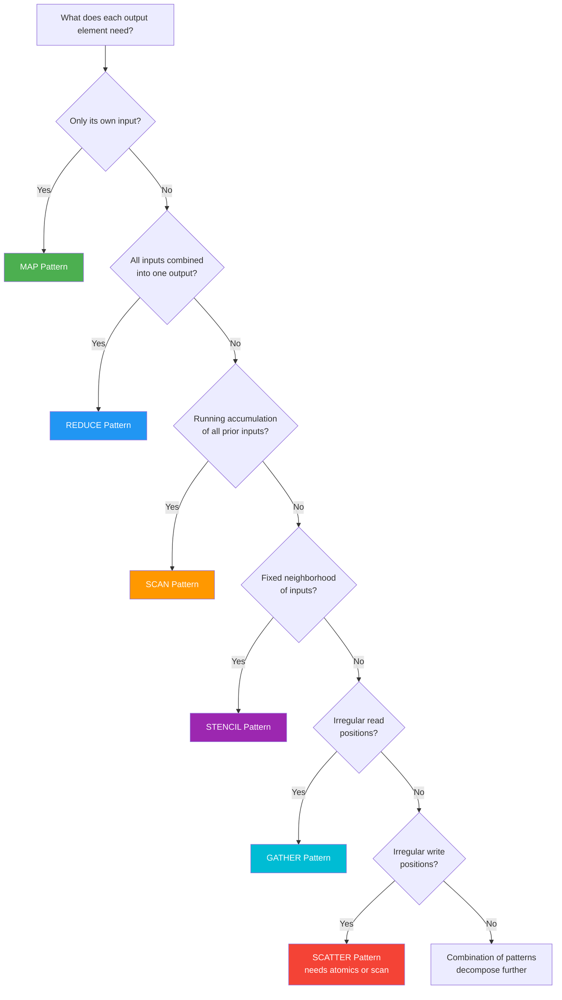
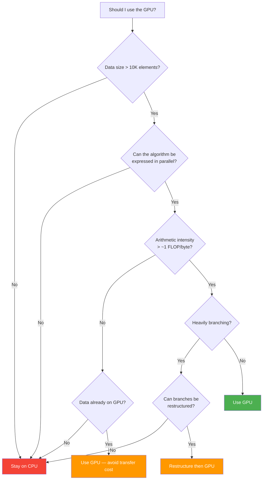

# Think Parallel: From Sequential CPU to Massively Parallel GPU

> You know C++. You know pointers, templates, RAII, the STL. But every time you sit
> down to write a CUDA kernel, your brain reaches for a `for` loop. This guide
> rewires that instinct.

---

## 1. The Fundamental Shift

### CPU Thinking: "What does ONE thread do, step by step?"

On a CPU, you write a `for` loop that processes elements one by one (or a few at a time with multithreading). The hardware executes iterations sequentially because CPUs are optimized for single-thread performance.

```cpp
// CPU: process 1 million elements with 1 thread (or a few)
for (int i = 0; i < N; i++) {
    output[i] = transform(input[i]);
}
```

You write the **loop**. The hardware runs iterations **one after another**.
Even with multi-threading you might get 16–64 threads. You think sequentially
because the hardware *is* sequential.

### GPU Thinking: "What does EACH of 1 million threads do simultaneously?"

On a GPU, there is no loop — instead you launch millions of threads, each processing one element. The `if (i < N)` guard handles the edge case where the total thread count exceeds the array size. The kernel describes what ONE element does, and the hardware runs it for ALL elements simultaneously.

```cpp
// GPU: 1 million threads, each handles ONE element
__global__ void transformKernel(float* output, const float* input, int N) {
    int i = blockIdx.x * blockDim.x + threadIdx.x;
    if (i < N) {
        output[i] = transform(input[i]);
    }
}
// Launch: transformKernel<<<(N+255)/256, 256>>>(d_out, d_in, N);
```

You write **what one element does**. The hardware runs it for **all elements
at once**. There is no loop in the kernel — the loop is replaced by the launch
configuration.

### The Mental Model

| Concept | CPU | GPU |
|---------|-----|-----|
| Unit of work | One iteration of a loop | One thread |
| Who loops? | Your code (`for`, `while`) | The hardware (grid of threads) |
| Parallelism | 8–64 threads | 10,000–10,000,000 threads |
| Control flow | Complex branching is fine | Uniform control flow is critical |
| Memory | Big caches hide latency | Massive bandwidth hides latency |
| Optimization goal | Reduce instruction count | Maximize throughput / occupancy |

**The single most important shift**: Stop thinking "How do I process this array?"
Start thinking "If I were element #47,391, what would I do?"

---

## 2. Seven Rules for Parallel Thinking

### Rule 1: Think Per-Element, Not Per-Loop

**CPU instinct**: Write a loop that visits every element.

```cpp
// CPU: you control the iteration
for (int i = 0; i < N; i++) {
    C[i] = A[i] + B[i];
}
```

**GPU instinct**: Each thread IS one iteration. There is no loop.

```cpp
__global__ void addKernel(float* C, const float* A, const float* B, int N) {
    int i = blockIdx.x * blockDim.x + threadIdx.x;
    if (i < N) C[i] = A[i] + B[i];
}
```

When you catch yourself writing `for (int i = 0; ...)` inside a kernel, ask:
"Should each iteration be a separate thread instead?"

### Rule 2: Eliminate Dependencies

If iteration B needs the result of iteration A, you cannot run them in parallel.

```cpp
// SERIAL: each step depends on the previous
for (int i = 1; i < N; i++) {
    x[i] = x[i-1] * 2 + 1;  // Can't parallelize — hard dependency
}
```

The fix is to restructure the algorithm so each element reads only from its own independent input rather than from the previous element's output. This removes the dependency chain entirely.

```cpp
// PARALLEL: each element is independent
for (int i = 0; i < N; i++) {
    y[i] = x[i] * 2 + 1;  // Each element only reads its own input
}
```

**Dependency checklist:**
- Does element `i` read from element `i-1`? → Sequential dependency
- Does element `i` write where element `j` reads? → Race condition
- Does the order of processing matter? → Probably not parallelizable directly

Sometimes you can *restructure* a dependent algorithm into an independent one
(see: prefix scan, Rule 5).

### Rule 3: Prefer Data Parallelism (SIMT)

CUDA's execution model is **SIMT** — Single Instruction, Multiple Threads.
All 32 threads in a warp execute the **same instruction** on **different data**.

```
Warp (32 threads):
  Thread 0: y[0] = a * x[0] + b
  Thread 1: y[1] = a * x[1] + b
  Thread 2: y[2] = a * x[2] + b
  ...
  Thread 31: y[31] = a * x[31] + b
```

All threads do the same work. Only the array index differs. This is the sweet
spot for GPUs.

**Anti-pattern — task parallelism on GPU:**
```cpp
if (threadIdx.x == 0) doTaskA();
else if (threadIdx.x == 1) doTaskB();
else if (threadIdx.x == 2) doTaskC();
// 29 threads sit idle while 3 threads do different things
```

### Rule 4: Minimize Communication

Threads in different blocks **cannot communicate** during a kernel (no global
barrier). Threads in the same block can synchronize with `__syncthreads()`,
but it is expensive.

**Cost hierarchy:**
```
Register (per-thread)    →  ~0 cycles   (free)
Shared memory (per-block) →  ~5 cycles   (cheap)
Global memory (all threads)→ ~200-800 cycles (expensive)
Atomic operations          →  serialized  (very expensive)
Host ↔ Device transfer     →  microseconds (avoid at all costs in loops)
```

Design kernels so threads work **independently** as much as possible.

### Rule 5: Embrace Redundant Computation

On a CPU, you never compute something twice. On a GPU, recomputing can be
faster than communicating.

```cpp
// CPU instinct: compute once, share the result
float shared_value = expensive_function(x);
for (int i = 0; i < N; i++) {
    output[i] = input[i] * shared_value;
}

// GPU reality: each thread recomputes if sharing is more expensive
__global__ void kernel(float* output, const float* input, float x, int N) {
    int i = blockIdx.x * blockDim.x + threadIdx.x;
    if (i < N) {
        float val = expensive_function(x);  // Recomputed by every thread!
        output[i] = input[i] * val;
    }
}
```

When `expensive_function` is cheaper than a global memory read + synchronization,
**recomputing wins**. Profile to decide.

### Rule 6: Think About Memory First

GPUs have enormous compute throughput (tens of TFLOPS) but memory bandwidth
is the bottleneck for most kernels. A kernel is either:

- **Compute-bound**: limited by arithmetic throughput (rare, good problem to have)
- **Memory-bound**: limited by how fast data can be loaded/stored (common)

**Arithmetic intensity** = FLOPs per byte loaded. If it's low, you are
memory-bound no matter how clever your math is.

| Operation | Intensity | Bound |
|-----------|-----------|-------|
| Vector add: `C[i] = A[i] + B[i]` | 1 FLOP / 12 bytes | Memory |
| Matrix multiply (tiled): `C = A × B` | O(N) FLOPs / byte | Compute |
| Reduction: `sum += A[i]` | 1 FLOP / 4 bytes | Memory |

**Always ask**: "How many bytes do I move for each FLOP?" If the ratio is low,
focus on memory access patterns before optimizing compute.

### Rule 7: Work in Powers of 32

A **warp** is 32 threads. The GPU executes instructions warp-by-warp.

- Block size should be a multiple of 32: 128, 256, 512
- Array sizes padded to multiples of 32 avoid wasted threads
- `if` statements within a warp cause **divergence** — both paths execute serially

This example shows warp divergence: within a 32-thread warp, even and odd threads take different code paths. The GPU must execute both paths sequentially, masking inactive threads. The better approach groups work so entire warps take the same path, eliminating the divergence penalty.

```cpp
// BAD: 100 threads per block (100/32 = 3.125 warps → 4 warps, 28 threads wasted)
kernel<<<N/100, 100>>>(...);

// GOOD: 256 threads per block (256/32 = 8 warps, no waste)
kernel<<<(N+255)/256, 256>>>(...);
```

**Warp divergence example:**
```cpp
// Every warp splits into two paths → half the throughput
if (threadIdx.x % 2 == 0) {
    doEvenWork();
} else {
    doOddWork();
}

// Better: group work so entire warps take the same path
if (threadIdx.x < 128) {
    doFirstHalfWork();   // Warps 0-3: all take this path
} else {
    doSecondHalfWork();  // Warps 4-7: all take this path
}
```

---

## 3. Ten CPU-to-GPU Conversions (Worked Examples)

Each example follows the same pattern:
1. CPU code (sequential)
2. Identify the parallelism
3. GPU kernel (CUDA)
4. Thought process explained

---

### Conversion 1: Array Sum — Loop → Parallel Reduction

**CPU Code:**

The CPU version sums an array sequentially — each iteration depends on the previous accumulation. This looks impossible to parallelize, but because addition is associative, we can restructure it as a tree: pair up elements, sum pairs in parallel, and repeat until one value remains.

```cpp
float sum = 0.0f;
for (int i = 0; i < N; i++) {
    sum += data[i];
}
```

**Where's the parallelism?** Each iteration depends on the previous `sum`.
You can't directly parallelize. But you CAN restructure: pair up elements,
sum pairs in parallel, repeat. This is **tree reduction** — O(log N) steps
instead of O(N).

```
Step 0:  [a0, a1, a2, a3, a4, a5, a6, a7]
Step 1:  [a0+a1,  _,  a2+a3,  _,  a4+a5,  _,  a6+a7,  _]
Step 2:  [a0..a3, _,  _,      _,  a4..a7, _,  _,      _]
Step 3:  [a0..a7, _,  _,      _,  _,      _,  _,      _]
```

**GPU Kernel:**
```cpp
__global__ void reduceSum(float* input, float* output, int N) {
    extern __shared__ float sdata[];

    unsigned int tid = threadIdx.x;
    unsigned int i = blockIdx.x * blockDim.x * 2 + threadIdx.x;

    // Load two elements per thread into shared memory
    float mySum = 0.0f;
    if (i < N) mySum = input[i];
    if (i + blockDim.x < N) mySum += input[i + blockDim.x];
    sdata[tid] = mySum;
    __syncthreads();

    // Tree reduction in shared memory
    for (unsigned int s = blockDim.x / 2; s > 32; s >>= 1) {
        if (tid < s) {
            sdata[tid] += sdata[tid + s];
        }
        __syncthreads();
    }

    // Warp-level reduction (no sync needed within a warp)
    if (tid < 32) {
        volatile float* smem = sdata;
        smem[tid] += smem[tid + 32];
        smem[tid] += smem[tid + 16];
        smem[tid] += smem[tid + 8];
        smem[tid] += smem[tid + 4];
        smem[tid] += smem[tid + 2];
        smem[tid] += smem[tid + 1];
    }

    if (tid == 0) output[blockIdx.x] = sdata[0];
}

// Launch: produces one partial sum per block, then reduce again
int threads = 256;
int blocks = (N + threads * 2 - 1) / (threads * 2);
reduceSum<<<blocks, threads, threads * sizeof(float)>>>(d_in, d_out, N);
```

**Thought process**: The dependency chain `sum += x[i]` looks serial, but
addition is **associative** — we can reorder it. Tree reduction exploits
this: O(N) work in O(log N) parallel steps. The final result requires
a second kernel pass (or atomic add) to combine block-level partial sums.

---

### Conversion 2: Array Map — Direct 1:1 Mapping (Trivial)

**CPU Code:**

The CPU version applies a formula to each element independently. Since no element depends on any other, this is "embarrassingly parallel" — the simplest case for GPU conversion.

```cpp
for (int i = 0; i < N; i++) {
    output[i] = sqrtf(input[i]) * 2.0f + 1.0f;
}
```

**Where's the parallelism?** Each element is completely independent. This is
**embarrassingly parallel** — the easiest case.

**GPU Kernel:**
```cpp
__global__ void mapKernel(float* output, const float* input, int N) {
    int i = blockIdx.x * blockDim.x + threadIdx.x;
    if (i < N) {
        output[i] = sqrtf(input[i]) * 2.0f + 1.0f;
    }
}

// Launch
int threads = 256;
int blocks = (N + threads - 1) / threads;
mapKernel<<<blocks, threads>>>(d_out, d_in, N);
```

**Thought process**: No dependencies between elements. Each thread computes
exactly one output. The `if (i < N)` guard handles the case where N isn't
a multiple of the block size. This is the template for most simple kernels.

---

### Conversion 3: Matrix Multiply — Nested Loops → 2D Grid

**CPU Code:**

The CPU version uses three nested loops: the outer two iterate over output rows and columns, while the inner loop computes a dot product. The outer two loops parallelize perfectly (each output element is independent), creating a 2D grid of GPU threads.

```cpp
// C = A × B, dimensions: A[M×K], B[K×N], C[M×N]
for (int row = 0; row < M; row++) {
    for (int col = 0; col < N; col++) {
        float sum = 0.0f;
        for (int k = 0; k < K; k++) {
            sum += A[row * K + k] * B[k * N + col];
        }
        C[row * N + col] = sum;
    }
}
```

**Where's the parallelism?** Each output element C[row][col] is independent.
The outer two loops parallelize; the inner dot-product loop is a reduction.

**GPU Kernel (Tiled with Shared Memory):**
```cpp
#define TILE_SIZE 16

__global__ void matMulTiled(float* C, const float* A, const float* B,
                            int M, int K, int N) {
    __shared__ float As[TILE_SIZE][TILE_SIZE];
    __shared__ float Bs[TILE_SIZE][TILE_SIZE];

    int row = blockIdx.y * TILE_SIZE + threadIdx.y;
    int col = blockIdx.x * TILE_SIZE + threadIdx.x;
    float sum = 0.0f;

    for (int t = 0; t < (K + TILE_SIZE - 1) / TILE_SIZE; t++) {
        // Collaborative load: each thread loads one element of each tile
        int aCol = t * TILE_SIZE + threadIdx.x;
        int bRow = t * TILE_SIZE + threadIdx.y;

        As[threadIdx.y][threadIdx.x] = (row < M && aCol < K)
            ? A[row * K + aCol] : 0.0f;
        Bs[threadIdx.y][threadIdx.x] = (bRow < K && col < N)
            ? B[bRow * N + col] : 0.0f;
        __syncthreads();

        for (int i = 0; i < TILE_SIZE; i++) {
            sum += As[threadIdx.y][i] * Bs[i][threadIdx.x];
        }
        __syncthreads();
    }

    if (row < M && col < N) {
        C[row * N + col] = sum;
    }
}

// Launch with 2D grid
dim3 threads(TILE_SIZE, TILE_SIZE);   // 16×16 = 256 threads/block
dim3 blocks((N + TILE_SIZE - 1) / TILE_SIZE,
            (M + TILE_SIZE - 1) / TILE_SIZE);
matMulTiled<<<blocks, threads>>>(d_C, d_A, d_B, M, K, N);
```

**Thought process**: Two outer loops → 2D thread grid. Each thread computes
one element of C. The inner dot-product remains a serial loop *within* each
thread, but we tile through shared memory so each global load serves 16
threads (TILE_SIZE reuse). This turns a memory-bound kernel into a
compute-bound one.

---

### Conversion 4: Histogram — Sequential Counting → Atomics

**CPU Code:**

The CPU version counts occurrences of each value into histogram bins. Multiple elements may map to the same bin, creating write conflicts on the GPU. The solution uses "privatization" — each block maintains a local histogram in fast shared memory, then merges results into the global histogram with atomic operations.

```cpp
int histogram[NUM_BINS] = {0};
for (int i = 0; i < N; i++) {
    histogram[data[i]]++;
}
```

**Where's the parallelism?** Multiple elements may map to the same bin —
that's a **write conflict**. We need atomic operations, but global atomics
serialize. Solution: **privatization** — each block maintains a local
histogram in shared memory, then merges.

**GPU Kernel:**
```cpp
__global__ void histogram(const int* data, int* hist, int N, int numBins) {
    extern __shared__ int localHist[];

    int tid = threadIdx.x;
    int gid = blockIdx.x * blockDim.x + threadIdx.x;

    // Initialize local histogram
    for (int i = tid; i < numBins; i += blockDim.x) {
        localHist[i] = 0;
    }
    __syncthreads();

    // Count into local histogram (shared memory atomics — fast)
    if (gid < N) {
        atomicAdd(&localHist[data[gid]], 1);
    }
    __syncthreads();

    // Merge local histogram into global (one atomic per bin per block)
    for (int i = tid; i < numBins; i += blockDim.x) {
        if (localHist[i] > 0) {
            atomicAdd(&hist[i], localHist[i]);
        }
    }
}

// Launch
int threads = 256;
int blocks = (N + threads - 1) / threads;
histogram<<<blocks, threads, NUM_BINS * sizeof(int)>>>(d_data, d_hist, N, NUM_BINS);
```

**Thought process**: Naive approach (global atomics for every element)
creates massive contention. Privatization reduces contention by a factor of
`blockDim.x`. Shared memory atomics are an order of magnitude faster than
global ones. This pattern applies whenever multiple threads write to the
same location.

---

### Conversion 5: Prefix Scan — Blelloch Algorithm

**CPU Code:**

The CPU version computes an inclusive prefix sum where each element depends on all previous elements. Despite this serial dependency, the Blelloch scan algorithm achieves O(log N) parallel steps through an up-sweep (reduction) followed by a down-sweep (distribution) phase.

```cpp
// Inclusive prefix sum
for (int i = 1; i < N; i++) {
    output[i] = output[i-1] + input[i];
}
output[0] = input[0];
```

**Where's the parallelism?** Each element depends on all previous elements.
Looks serial. But the **Blelloch scan** computes it in O(N) work and
O(log N) steps using an up-sweep (reduce) followed by a down-sweep.

**GPU Kernel (Block-level exclusive scan):**
```cpp
__global__ void blellochScan(float* output, const float* input, int N) {
    extern __shared__ float temp[];

    int tid = threadIdx.x;
    int offset = 1;

    // Load input into shared memory
    int ai = tid;
    int bi = tid + blockDim.x;
    temp[ai] = (ai < N) ? input[ai] : 0.0f;
    temp[bi] = (bi < N) ? input[bi] : 0.0f;

    // Up-sweep (reduce) phase
    for (int d = blockDim.x; d > 0; d >>= 1) {
        __syncthreads();
        if (tid < d) {
            int left  = offset * (2 * tid + 1) - 1;
            int right = offset * (2 * tid + 2) - 1;
            temp[right] += temp[left];
        }
        offset <<= 1;
    }

    // Clear the last element
    if (tid == 0) temp[2 * blockDim.x - 1] = 0.0f;

    // Down-sweep phase
    for (int d = 1; d <= blockDim.x; d <<= 1) {
        offset >>= 1;
        __syncthreads();
        if (tid < d) {
            int left  = offset * (2 * tid + 1) - 1;
            int right = offset * (2 * tid + 2) - 1;
            float t = temp[left];
            temp[left] = temp[right];
            temp[right] += t;
        }
    }
    __syncthreads();

    // Write results
    if (ai < N) output[ai] = temp[ai];
    if (bi < N) output[bi] = temp[bi];
}

// Launch (handles one block worth of data; full scan needs multi-block approach)
int threads = N / 2;
blellochScan<<<1, threads, N * sizeof(float)>>>(d_out, d_in, N);
```

**Thought process**: The key insight is that prefix sum has **hidden
parallelism** — you can compute it with a balanced binary tree traversal.
Up-sweep computes partial sums (like reduction), down-sweep distributes
them. For arrays larger than one block, you need a three-kernel approach:
scan blocks, scan the block sums, then add block sums back.

---

### Conversion 6: Finding Max/Min — Parallel Reduction Variant

**CPU Code:**

The CPU version finds the maximum by scanning linearly. Since `max` is associative and commutative (like addition), the exact same tree reduction pattern from Conversion 1 applies — just replace `+` with `max`. This pattern works for any associative binary operator.

```cpp
float maxVal = data[0];
for (int i = 1; i < N; i++) {
    if (data[i] > maxVal) maxVal = data[i];
}
```

**Where's the parallelism?** Same structure as sum reduction — `max` is
associative and commutative. Replace `+` with `max`.

**GPU Kernel:**
```cpp
__global__ void reduceMax(float* input, float* output, int N) {
    extern __shared__ float sdata[];

    unsigned int tid = threadIdx.x;
    unsigned int i = blockIdx.x * blockDim.x * 2 + threadIdx.x;

    float myMax = -INFINITY;
    if (i < N) myMax = input[i];
    if (i + blockDim.x < N) myMax = fmaxf(myMax, input[i + blockDim.x]);
    sdata[tid] = myMax;
    __syncthreads();

    for (unsigned int s = blockDim.x / 2; s > 32; s >>= 1) {
        if (tid < s) {
            sdata[tid] = fmaxf(sdata[tid], sdata[tid + s]);
        }
        __syncthreads();
    }

    if (tid < 32) {
        volatile float* smem = sdata;
        smem[tid] = fmaxf(smem[tid], smem[tid + 32]);
        smem[tid] = fmaxf(smem[tid], smem[tid + 16]);
        smem[tid] = fmaxf(smem[tid], smem[tid + 8]);
        smem[tid] = fmaxf(smem[tid], smem[tid + 4]);
        smem[tid] = fmaxf(smem[tid], smem[tid + 2]);
        smem[tid] = fmaxf(smem[tid], smem[tid + 1]);
    }

    if (tid == 0) output[blockIdx.x] = sdata[0];
}

// Launch (same pattern as sum reduction)
int threads = 256;
int blocks = (N + threads * 2 - 1) / (threads * 2);
reduceMax<<<blocks, threads, threads * sizeof(float)>>>(d_in, d_out, N);
```

**Thought process**: Any associative binary operator (sum, max, min, AND, OR,
XOR) can use the same tree reduction pattern. The only change is swapping
the combining operation. You can write a templated reduction kernel that
accepts any binary functor.

---

### Conversion 7: Sorting — Radix Sort

**CPU Code:**

The CPU version uses `std::sort` (typically introsort). For GPU parallelization, the algorithm must change entirely: radix sort processes one bit at a time using counting and prefix scan — both highly parallel operations. This illustrates that the best parallel algorithm is often a completely different algorithm than the best sequential one.

```cpp
std::sort(data.begin(), data.end());
```

**Where's the parallelism?** Comparison-based sorts (quicksort, mergesort)
are hard to parallelize efficiently. **Radix sort** processes one bit (or
digit) at a time using counting/prefix-scan — both highly parallel.

**GPU Kernel (simplified single-block radix sort, 1-bit per pass):**
```cpp
__global__ void radixSortSingleBlock(unsigned int* data, int N) {
    extern __shared__ unsigned int sdata[];
    unsigned int* keys = sdata;
    unsigned int* temp = sdata + N;

    int tid = threadIdx.x;

    // Load data
    if (tid < N) keys[tid] = data[tid];
    __syncthreads();

    for (int bit = 0; bit < 32; bit++) {
        // Compute predicate: is bit set?
        unsigned int key = (tid < N) ? keys[tid] : 0xFFFFFFFF;
        unsigned int bitSet = (key >> bit) & 1;

        // Count zeros (prefix scan over NOT bit)
        // Simplified: use atomics for small N
        __shared__ int numZeros;
        if (tid == 0) numZeros = 0;
        __syncthreads();

        if (tid < N && !bitSet) atomicAdd(&numZeros, 1);
        __syncthreads();

        // Compute destination index via simple scan
        // Zeros go first (indices 0..numZeros-1)
        // Ones go after (indices numZeros..N-1)
        __shared__ int zeroCount;
        __shared__ int oneCount;
        if (tid == 0) { zeroCount = 0; oneCount = 0; }
        __syncthreads();

        int dest;
        if (tid < N) {
            if (!bitSet) {
                dest = atomicAdd(&zeroCount, 1);
            } else {
                dest = numZeros + atomicAdd(&oneCount, 1);
            }
        }
        __syncthreads();

        if (tid < N) temp[dest] = key;
        __syncthreads();

        if (tid < N) keys[tid] = temp[tid];
        __syncthreads();
    }

    if (tid < N) data[tid] = keys[tid];
}

// Launch (single block for simplicity; real radix sort uses multi-block scan)
radixSortSingleBlock<<<1, N, 2 * N * sizeof(unsigned int)>>>(d_data, N);
```

**Thought process**: The critical lesson — **the best parallel algorithm is
often a completely different algorithm** than the best sequential one.
`std::sort` uses introsort (quicksort variant). GPU sort uses radix sort
because it decomposes into scan and scatter — both massively parallel.
For production, use `thrust::sort` or `cub::DeviceRadixSort`.

---

### Conversion 8: BFS Graph Traversal — Frontier Expansion

**CPU Code:**

The CPU version uses a queue-based BFS. On the GPU, all nodes at the same distance from the source (the "frontier") can be expanded in parallel. `atomicCAS` on the level array ensures each node is visited exactly once, and `atomicAdd` builds the next frontier without duplicates.

```cpp
std::queue<int> frontier;
std::vector<bool> visited(numNodes, false);
frontier.push(source);
visited[source] = true;

while (!frontier.empty()) {
    int node = frontier.front();
    frontier.pop();
    for (int neighbor : adj[node]) {
        if (!visited[neighbor]) {
            visited[neighbor] = true;
            frontier.push(neighbor);
        }
    }
}
```

**Where's the parallelism?** All nodes in the current frontier can be
expanded simultaneously. The sequential queue becomes a parallel frontier
array.

**GPU Kernel:**
```cpp
// Graph stored in CSR format: rowPtr[node] to rowPtr[node+1] gives neighbor range
__global__ void bfsKernel(const int* rowPtr, const int* colIdx,
                          int* level, const int* frontier, int frontierSize,
                          int* nextFrontier, int* nextSize, int currentLevel) {
    int tid = blockIdx.x * blockDim.x + threadIdx.x;
    if (tid >= frontierSize) return;

    int node = frontier[tid];
    int start = rowPtr[node];
    int end   = rowPtr[node + 1];

    for (int e = start; e < end; e++) {
        int neighbor = colIdx[e];
        // atomicCAS: only the first thread to reach this neighbor claims it
        if (atomicCAS(&level[neighbor], -1, currentLevel + 1) == -1) {
            int pos = atomicAdd(nextSize, 1);
            nextFrontier[pos] = neighbor;
        }
    }
}

// Host loop: iterate until frontier is empty
// int currentLevel = 0;
// while (frontierSize > 0) {
//     bfsKernel<<<(frontierSize+255)/256, 256>>>(
//         d_rowPtr, d_colIdx, d_level,
//         d_frontier, frontierSize,
//         d_nextFrontier, d_nextSize, currentLevel);
//     std::swap(d_frontier, d_nextFrontier);
//     cudaMemcpy(&frontierSize, d_nextSize, sizeof(int), cudaMemcpyDeviceToHost);
//     cudaMemset(d_nextSize, 0, sizeof(int));
//     currentLevel++;
// }
```

**Thought process**: BFS has **level parallelism** — all nodes at the same
distance from the source can be processed concurrently. The challenge is
building the next frontier without duplicates. `atomicCAS` on the level
array ensures each node is visited exactly once. For high-degree nodes,
consider assigning one thread per *edge* instead of per *node*.

---

### Conversion 9: Image Convolution — 2D Tiling with Halo

**CPU Code:**

The CPU version applies a 3×3 convolution filter to an image by reading a neighborhood around each pixel. On the GPU, neighboring threads read overlapping data — the "halo" or "ghost cells" at tile boundaries. Shared memory eliminates redundant global loads by loading each tile plus its halo once.

```cpp
// 3×3 convolution kernel applied to an image
for (int y = 1; y < height - 1; y++) {
    for (int x = 1; x < width - 1; x++) {
        float sum = 0.0f;
        for (int ky = -1; ky <= 1; ky++) {
            for (int kx = -1; kx <= 1; kx++) {
                sum += image[(y+ky)*width + (x+kx)] * filter[(ky+1)*3 + (kx+1)];
            }
        }
        output[y * width + x] = sum;
    }
}
```

**Where's the parallelism?** Each output pixel is independent. But each
pixel reads a 3×3 neighborhood — neighboring threads read overlapping data.
Solution: load a tile + halo into shared memory.

**GPU Kernel:**
```cpp
#define TILE_W 16
#define TILE_H 16
#define FILTER_R 1  // radius of 3×3 filter

__global__ void convolution2D(float* output, const float* input,
                              const float* filter,
                              int width, int height) {
    // Shared memory tile includes halo region
    __shared__ float tile[TILE_H + 2*FILTER_R][TILE_W + 2*FILTER_R];

    int tx = threadIdx.x;
    int ty = threadIdx.y;
    int outX = blockIdx.x * TILE_W + tx;
    int outY = blockIdx.y * TILE_H + ty;

    // Load tile + halo (each thread loads one element, edge threads load halo)
    int inX = outX - FILTER_R;
    int inY = outY - FILTER_R;

    // Load main region and halo
    for (int dy = ty; dy < TILE_H + 2*FILTER_R; dy += TILE_H) {
        for (int dx = tx; dx < TILE_W + 2*FILTER_R; dx += TILE_W) {
            int gx = blockIdx.x * TILE_W + dx - FILTER_R;
            int gy = blockIdx.y * TILE_H + dy - FILTER_R;
            float val = 0.0f;
            if (gx >= 0 && gx < width && gy >= 0 && gy < height) {
                val = input[gy * width + gx];
            }
            tile[dy][dx] = val;
        }
    }
    __syncthreads();

    // Compute convolution from shared memory
    if (outX < width && outY < height) {
        float sum = 0.0f;
        for (int ky = 0; ky < 2*FILTER_R+1; ky++) {
            for (int kx = 0; kx < 2*FILTER_R+1; kx++) {
                sum += tile[ty + ky][tx + kx] * filter[ky * (2*FILTER_R+1) + kx];
            }
        }
        output[outY * width + outX] = sum;
    }
}

// Launch with 2D grid
dim3 threads(TILE_W, TILE_H);
dim3 blocks((width + TILE_W - 1) / TILE_W,
            (height + TILE_H - 1) / TILE_H);
convolution2D<<<blocks, threads>>>(d_out, d_in, d_filter, width, height);
```

**Thought process**: The stencil pattern — each output reads a neighborhood
of inputs. Without shared memory, neighboring threads redundantly load from
global memory. The "halo" (ghost cells) are the extra rows/columns each
tile needs beyond its own output region. Shared memory turns redundant
global loads into fast local reads.

---

### Conversion 10: Sparse Matrix-Vector Multiply (SpMV)

**CPU Code (CSR format):**
```cpp
// CSR: rowPtr, colIdx, values represent sparse matrix A
// y = A * x
for (int row = 0; row < numRows; row++) {
    float sum = 0.0f;
    for (int j = rowPtr[row]; j < rowPtr[row + 1]; j++) {
        sum += values[j] * x[colIdx[j]];
    }
    y[row] = sum;
}
```

**Where's the parallelism?** Each row's dot product is independent. Assign
one thread per row.

**GPU Kernel:**
```cpp
__global__ void spmvCSR(const int* rowPtr, const int* colIdx,
                        const float* values, const float* x,
                        float* y, int numRows) {
    int row = blockIdx.x * blockDim.x + threadIdx.x;
    if (row < numRows) {
        float sum = 0.0f;
        int start = rowPtr[row];
        int end   = rowPtr[row + 1];
        for (int j = start; j < end; j++) {
            sum += values[j] * x[colIdx[j]];
        }
        y[row] = sum;
    }
}

// Launch
int threads = 256;
int blocks = (numRows + threads - 1) / threads;
spmvCSR<<<blocks, threads>>>(d_rowPtr, d_colIdx, d_values, d_x, d_y, numRows);
```

**Thought process**: One-thread-per-row is simple but has a problem: rows
with wildly different lengths cause **load imbalance** within a warp. If
row 0 has 2 non-zeros and row 1 has 2000, thread 0 finishes instantly while
thread 1 works forever. Advanced approaches use one *warp* per row (warp
shuffle to reduce) or dynamic parallelism for very long rows.

---

## 4. Common Parallelism Patterns

Every parallel algorithm is a composition of a few fundamental patterns.
Learn these and you can decompose any problem.

### Pattern: Map

**One input → one output. No interaction between elements.**

```
Input:  [a, b, c, d, e]
        ↓  ↓  ↓  ↓  ↓     f(x) applied independently
Output: [f(a), f(b), f(c), f(d), f(e)]
```

Examples: color space conversion, element-wise math, applying activation
functions in neural networks.

### Pattern: Reduce

**Many inputs → one output via associative operator.**

```
Input:  [a, b, c, d, e, f, g, h]
         ╲╱   ╲╱   ╲╱   ╲╱
Step 1:  [a+b, c+d, e+f, g+h]
          ╲╱    ╲╱
Step 2:  [a..d, e..h]
           ╲╱
Step 3:  [a..h]
```

Examples: sum, max, min, dot product, checking if any element meets a
condition.

### Pattern: Scan (Prefix Sum)

**Running accumulation — output[i] depends on all inputs[0..i].**

```
Input:  [3, 1, 4, 1, 5]
Output: [3, 4, 8, 9, 14]  (inclusive scan)
```

Surprisingly parallel via Blelloch algorithm. Used as a building block in
sort, compact/filter, and stream compaction.

### Pattern: Scatter

**Each thread writes to a computed (possibly irregular) position.**

```
Thread i writes to output[f(i)]
```

Needs atomics or exclusive index computation (via scan) to avoid write
conflicts. Examples: histogram, hash table insertion, radix sort.

### Pattern: Gather

**Each thread reads from a computed (possibly irregular) position.**

```
Thread i reads from input[g(i)]
```

Naturally parallel — reads don't conflict. But irregular reads may cause
poor memory coalescing. Examples: texture lookup, index-based reordering.

### Pattern: Stencil

**Each output depends on a fixed neighborhood of inputs.**

```
output[i] = f(input[i-1], input[i], input[i+1])
```

Needs halo/ghost cells at tile boundaries. Examples: image filters, PDE
solvers, cellular automata, convolution.

### Pattern Selection Flowchart



---

## 5. When NOT to Use the GPU

GPUs are not universally faster. Here are the cases where the CPU wins.

### Small Data (< ~10K elements)

Kernel launch overhead is ~5–20 μs. Data transfer adds more. For small
arrays, the CPU finishes before the GPU even starts.

```
Array size:     CPU time:     GPU time (including transfer):
100             0.1 μs        50 μs   ← GPU 500× slower
10,000          10 μs         55 μs   ← GPU still slower
100,000         100 μs        60 μs   ← Breakeven
10,000,000      10,000 μs     100 μs  ← GPU 100× faster
```

### Heavily Branching Code

Warp divergence means both paths of every `if` execute for the full warp.

```cpp
// Terrible on GPU: every thread does something different
__global__ void branchHell(int* data, int N) {
    int i = blockIdx.x * blockDim.x + threadIdx.x;
    if (i >= N) return;

    switch (data[i] % 8) {
        case 0: data[i] = func0(data[i]); break;
        case 1: data[i] = func1(data[i]); break;
        case 2: data[i] = func2(data[i]); break;
        // ... 8 different paths → 8× slowdown in worst case
    }
}
```

### Sequential Algorithms with True Dependencies

Some algorithms are **inherently sequential** — each step depends on the
previous. No restructuring helps.

```cpp
// Fibonacci: each value depends on the previous two
fib[0] = 0; fib[1] = 1;
for (int i = 2; i < N; i++) {
    fib[i] = fib[i-1] + fib[i-2];  // Cannot parallelize
}
```

### Low Arithmetic Intensity

If you do 1 FLOP per 8 bytes loaded, the GPU's compute power is wasted
waiting for memory.

```cpp
// 1 add per 12 bytes loaded — memory-bound even on GPU
// Transfer cost may exceed compute savings
C[i] = A[i] + B[i];
```

Rule of thumb: if arithmetic intensity < 1 FLOP/byte AND total data is
small, stay on CPU.

### Decision Flowchart: "Should I GPU This?"



---

## 6. The Optimization Mindset

### The Four-Step Process

```
Step 1: Make it correct on CPU     (baseline, reference output)
Step 2: Make it correct on GPU     (naive kernel, compare output to CPU)
Step 3: Make it fast               (optimize in order: memory → compute → occupancy)
Step 4: Repeat Step 3 with profiler (never guess — measure!)
```

### Step 1: CPU Reference

Always start with a correct CPU implementation. You need it for:
- Validating GPU correctness (compare outputs with tolerance for floating point)
- Benchmarking speedup (meaningless without a baseline)
- Debugging (when the GPU kernel produces wrong results)

This template shows the starting point for any GPU optimization: a correct CPU reference implementation. You need this to validate GPU results (comparing with floating-point tolerance) and to have a meaningful baseline for benchmarking speedup.

```cpp
void cpuReference(float* output, const float* input, int N) {
    for (int i = 0; i < N; i++) {
        output[i] = /* your algorithm */;
    }
}
```

### Step 2: Naive GPU Kernel

Write the simplest possible kernel that produces correct output. Don't
optimize yet.

```cpp
__global__ void naiveKernel(float* output, const float* input, int N) {
    int i = blockIdx.x * blockDim.x + threadIdx.x;
    if (i < N) {
        output[i] = /* same algorithm as CPU */;
    }
}
```

Verify: `max |cpu_output[i] - gpu_output[i]| < epsilon` for all i.

### Step 3: Optimize (In Order!)

**Priority 1 — Memory access patterns:**
```
Coalesced reads/writes?        → Adjacent threads access adjacent memory
Using shared memory for reuse? → Data read multiple times loaded once
Avoiding bank conflicts?       → Shared memory accessed without serialization
Minimizing global memory ops?  → Fewer loads/stores per thread
```

**Priority 2 — Compute efficiency:**
```
Avoiding warp divergence?      → Branches aligned to warp boundaries
Using fast math intrinsics?    → __sinf, __cosf, __expf
Reducing register pressure?    → Fewer local variables
Loop unrolling where helpful?  → #pragma unroll for small fixed loops
```

**Priority 3 — Occupancy and launch config:**
```
Enough threads per SM?         → High occupancy hides latency
Block size a multiple of 32?   → No wasted warp slots
Grid large enough?             → Enough blocks to fill all SMs
```

### Step 4: Profile, Don't Guess

Use NVIDIA's profiling tools rather than guessing where the bottleneck is. Nsight Compute shows kernel-level metrics (memory throughput, compute utilization, occupancy), while Nsight Systems shows the overall CPU/GPU timeline to identify pipeline stalls.

```bash
# Nsight Compute: detailed kernel analysis
ncu --set full ./my_program

# Nsight Systems: timeline of CPU/GPU activity
nsys profile ./my_program

# Key metrics to check:
# - Memory throughput (% of peak bandwidth)
# - Compute throughput (% of peak FLOPS)
# - Occupancy (achieved vs theoretical)
# - Warp stall reasons
```

### The Golden Rule

> **Never optimize before you profile. The bottleneck is almost never
> where you think it is.**

Common surprises from profiling:
- "My kernel is slow" → Actually, your `cudaMemcpy` takes 95% of the time
- "I need to optimize compute" → You're at 10% memory bandwidth utilization
- "I need more threads" → Your kernel uses 64 registers/thread, killing occupancy

---

## Quick Reference Card

```
┌────────────────────────────────────────────────────────────────┐
│                  PARALLEL THINKING CHEAT SHEET                 │
├────────────────────────────────────────────────────────────────┤
│                                                                │
│  CPU loop          →  GPU: delete the loop, each thread = 1 i │
│  Sequential reduce →  GPU: tree reduction (log N steps)        │
│  Shared result     →  GPU: recompute OR shared memory          │
│  Write conflict    →  GPU: atomicAdd / privatize / scan        │
│  Irregular access  →  GPU: gather (OK) or scatter (atomics)    │
│  Neighborhood read →  GPU: stencil + halo in shared memory     │
│                                                                │
│  Block size:  256 (safe default)                               │
│  Grid size:   (N + blockSize - 1) / blockSize                  │
│  Guard:       if (i < N) { ... }                               │
│                                                                │
│  OPTIMIZATION ORDER:                                           │
│    1. Memory access patterns                                   │
│    2. Compute efficiency                                       │
│    3. Occupancy tuning                                         │
│    4. PROFILE FIRST                                            │
│                                                                │
│  MEMORY COST:                                                  │
│    Register   ~0    cycles  (per thread, fastest)              │
│    Shared     ~5    cycles  (per block)                        │
│    L2 cache   ~50   cycles  (per SM cluster)                   │
│    Global     ~200+ cycles  (device DRAM)                      │
│    Host↔Dev   ~μs           (PCIe/NVLink, avoid in loops)      │
│                                                                │
└────────────────────────────────────────────────────────────────┘
```

---

*Next: [Memory_Model.md](Memory_Model.md) — Understanding global, shared,
local, constant, and texture memory.*
