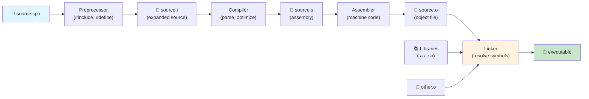
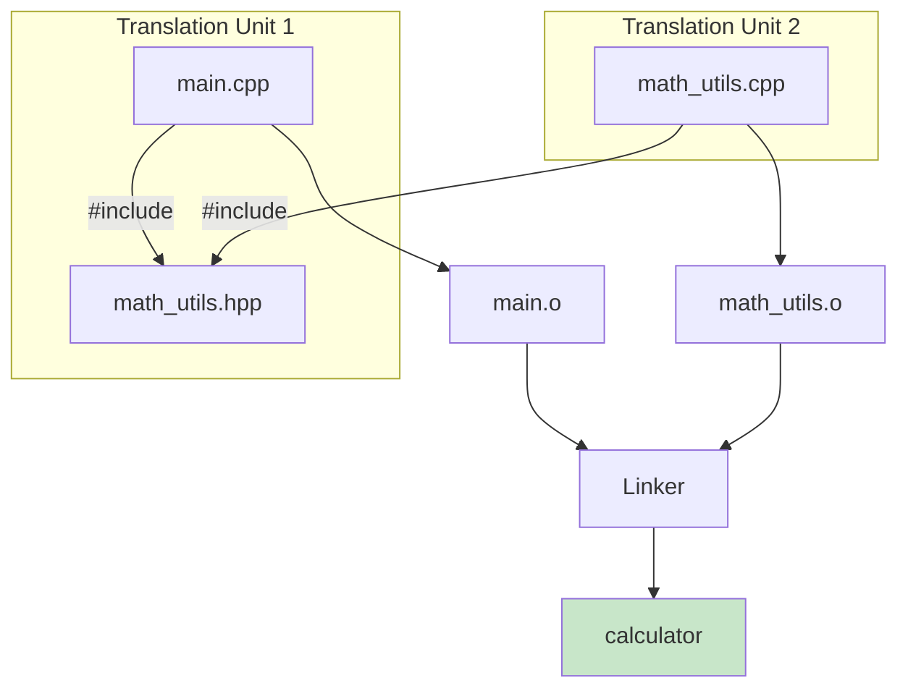

# Chapter 01 — Hello C++ & Your First Program

> **Tags:** `#cpp` `#beginner` `#compilation` `#iostream` `#cmake`
> **Prerequisites:** Basic familiarity with any programming language helpful but not required
> **Estimated Time:** 2–3 hours

---

## 1. Theory

C++ is a **compiled, statically-typed, multi-paradigm** language created by Bjarne Stroustrup in 1979 as "C with Classes." Today it powers operating systems, game engines, trading systems, embedded firmware, and high-performance ML frameworks like PyTorch and TensorFlow.

Unlike interpreted languages (Python, JavaScript), C++ source code goes through a **multi-stage compilation pipeline** before producing an executable binary. Understanding this pipeline is essential — it explains why you get different categories of errors (preprocessor errors, compile errors, linker errors) and how large projects are organized.

### The C++ Compilation Model

The journey from source code to executable involves four distinct phases:

1. **Preprocessing** (`cpp` / `-E` flag) — Handles directives starting with `#`: includes, macros, conditional compilation. The preprocessor is essentially a text substitution engine; it knows nothing about C++ syntax.

2. **Compilation** (`cc1plus` / `-S` flag) — The compiler parses the preprocessed source, performs semantic analysis, optimizations, and emits **assembly code** (`.s` files). Each `.cpp` file is compiled independently as a **translation unit**.

3. **Assembly** (`as` / `-c` flag) — The assembler converts human-readable assembly into machine code, producing **object files** (`.o` / `.obj`). These contain machine instructions but with unresolved external references.

4. **Linking** (`ld`) — The linker resolves all symbol references across object files and libraries, producing the final executable or shared library. This is where "undefined reference" errors appear.

### Translation Units

A **translation unit** is the fundamental unit of compilation: one `.cpp` file after all `#include` directives have been expanded. The compiler sees each translation unit in isolation. This is why:

- You can compile files in parallel (each is independent)
- Forward declarations exist (to tell the compiler "trust me, this symbol exists somewhere")
- Header files are needed (to share declarations across translation units)

### Header Files vs Source Files

| Aspect | Header (`.h` / `.hpp`) | Source (`.cpp`) |
|--------|----------------------|-----------------|
| Contains | Declarations, inline functions, templates | Definitions, implementations |
| Compiled directly? | No — included into `.cpp` files | Yes — each becomes a translation unit |
| Include guards? | Required (`#pragma once` or `#ifndef`) | Not applicable |
| Typical content | Class declarations, function prototypes, constants | Function bodies, global variable definitions |

---

## 2. What / Why / How

### What?
A C++ program is a collection of translation units compiled and linked into a binary. Every program has exactly one `main()` function as its entry point.

### Why C++?
- **Performance**: Zero-cost abstractions, direct hardware access, no garbage collector
- **Control**: Manual memory management when needed, deterministic destruction
- **Ecosystem**: 40+ years of libraries, tools, and community knowledge
- **Portability**: Runs everywhere — from 8-bit microcontrollers to supercomputers

### How?
Write `.cpp` files → compile with `g++` or `clang++` → link → run the binary. For real projects, use a build system like **CMake** to manage the process.

---

## 3. Code Examples

### Example 1 — Classic Hello World

```cpp
// hello.cpp — The simplest C++ program
#include <iostream>  // Brings in std::cout, std::endl

int main() {
    std::cout << "Hello, C++!" << std::endl;
    return 0;  // 0 signals success to the OS
}
```

**Compile & Run:**
```bash
g++ -std=c++17 -Wall -Wextra -o hello hello.cpp
./hello
```

### Example 2 — Interactive Input/Output

```cpp
// greet.cpp — Reading user input
#include <iostream>
#include <string>

int main() {
    std::string name;
    std::cout << "Enter your name: ";
    std::getline(std::cin, name);  // Read full line (handles spaces)

    int age{};
    std::cout << "Enter your age: ";
    std::cin >> age;

    std::cout << "Hello, " << name << "! You are " << age << " years old.\n";
    return 0;
}
```

### Example 3 — Return Values Matter

```cpp
// exit_code.cpp — Demonstrating return values
#include <iostream>
#include <cstdlib>  // EXIT_SUCCESS, EXIT_FAILURE

int main(int argc, char* argv[]) {
    if (argc < 2) {
        std::cerr << "Usage: " << argv[0] << " <name>\n";
        return EXIT_FAILURE;  // Non-zero = error
    }

    std::cout << "Hello, " << argv[1] << "!\n";
    return EXIT_SUCCESS;  // 0 = success
}
```

**Usage:**
```bash
g++ -std=c++17 -o greet exit_code.cpp
./greet              # Prints error, exit code 1
./greet Alice        # Prints "Hello, Alice!", exit code 0
echo $?              # Shows the exit code
```

### Example 4 — Multi-File Project

```cpp
// math_utils.hpp — Header with declarations
#pragma once  // Modern include guard

int add(int a, int b);
int multiply(int a, int b);
```

```cpp
// math_utils.cpp — Source with definitions
#include "math_utils.hpp"

int add(int a, int b) { return a + b; }
int multiply(int a, int b) { return a * b; }
```

```cpp
// main.cpp — Uses the math utilities
#include <iostream>
#include "math_utils.hpp"

int main() {
    std::cout << "3 + 4 = " << add(3, 4) << '\n';
    std::cout << "3 * 4 = " << multiply(3, 4) << '\n';
    return 0;
}
```

**Compile multi-file:**
```bash
g++ -std=c++17 -Wall -o calc main.cpp math_utils.cpp
./calc
```

### Example 5 — Minimal CMakeLists.txt

```cmake
# CMakeLists.txt
cmake_minimum_required(VERSION 3.16)
project(HelloCPP LANGUAGES CXX)

set(CMAKE_CXX_STANDARD 17)
set(CMAKE_CXX_STANDARD_REQUIRED ON)

add_executable(hello main.cpp math_utils.cpp)
```

**Build with CMake:**
```bash
mkdir build && cd build
cmake ..
cmake --build .
./hello
```

---

## 4. Mermaid Diagrams

### C++ Compilation Pipeline



### Header / Source Relationship



---

## 5. Practical Exercises

### 🟢 Exercise 1: Temperature Converter
Write a program that reads a temperature in Celsius from the user and prints the Fahrenheit equivalent. Formula: `F = C × 9/5 + 32`.

### 🟢 Exercise 2: Command-Line Echo
Write a program that prints all command-line arguments, one per line, with their index. Example: `./echo hello world` prints:
```
arg[0]: ./echo
arg[1]: hello
arg[2]: world
```

### 🟡 Exercise 3: Multi-File Calculator
Create a 3-file project (header + source + main) that implements `add`, `subtract`, `multiply`, and `divide` functions. Handle division by zero gracefully.

### 🟡 Exercise 4: Build with CMake
Take your calculator project and create a proper `CMakeLists.txt`. Build it using cmake out-of-source build.

### 🔴 Exercise 5: Preprocessor Explorer
Write a program and use `g++ -E` to see the preprocessed output. Add a custom `#define` macro for `SQUARE(x)` and observe text substitution. Identify a case where the macro behaves unexpectedly (hint: `SQUARE(1+2)`).

---

## 6. Solutions

### Solution 1: Temperature Converter

```cpp
#include <iostream>

int main() {
    double celsius{};
    std::cout << "Enter temperature in Celsius: ";
    std::cin >> celsius;

    double fahrenheit = celsius * 9.0 / 5.0 + 32.0;
    std::cout << celsius << "°C = " << fahrenheit << "°F\n";
    return 0;
}
```

### Solution 2: Command-Line Echo

```cpp
#include <iostream>

int main(int argc, char* argv[]) {
    for (int i = 0; i < argc; ++i) {
        std::cout << "arg[" << i << "]: " << argv[i] << '\n';
    }
    return 0;
}
```

### Solution 3: Multi-File Calculator

```cpp
// calc.hpp
#pragma once
#include <optional>

double add(double a, double b);
double subtract(double a, double b);
double multiply(double a, double b);
std::optional<double> divide(double a, double b);
```

```cpp
// calc.cpp
#include "calc.hpp"

double add(double a, double b) { return a + b; }
double subtract(double a, double b) { return a - b; }
double multiply(double a, double b) { return a * b; }

std::optional<double> divide(double a, double b) {
    if (b == 0.0) return std::nullopt;
    return a / b;
}
```

```cpp
// main.cpp
#include <iostream>
#include "calc.hpp"

int main() {
    std::cout << "10 + 3 = " << add(10, 3) << '\n';
    std::cout << "10 - 3 = " << subtract(10, 3) << '\n';
    std::cout << "10 * 3 = " << multiply(10, 3) << '\n';

    if (auto result = divide(10, 3)) {
        std::cout << "10 / 3 = " << *result << '\n';
    }
    if (auto result = divide(10, 0)) {
        std::cout << "10 / 0 = " << *result << '\n';
    } else {
        std::cout << "10 / 0 = Error: division by zero\n";
    }
    return 0;
}
```

### Solution 4: CMakeLists.txt

```cmake
cmake_minimum_required(VERSION 3.16)
project(Calculator LANGUAGES CXX)

set(CMAKE_CXX_STANDARD 17)
set(CMAKE_CXX_STANDARD_REQUIRED ON)
set(CMAKE_EXPORT_COMPILE_COMMANDS ON)

add_executable(calculator main.cpp calc.cpp)
target_compile_options(calculator PRIVATE -Wall -Wextra -Wpedantic)
```

### Solution 5: Preprocessor Explorer

```cpp
// macro_demo.cpp
#define SQUARE(x) x * x

#include <iostream>

int main() {
    std::cout << SQUARE(5) << '\n';      // 25 ✓
    std::cout << SQUARE(1+2) << '\n';    // Expect 9, get 5!
    // Expands to: 1+2 * 1+2 = 1+2+2 = 5 (operator precedence!)
    // Fix: #define SQUARE(x) ((x) * (x))
    return 0;
}
```

Run `g++ -E macro_demo.cpp | tail -20` to see the expansion.

---

## 7. Quiz

**Q1.** What is the correct order of the C++ compilation stages?
- A) Compiler → Preprocessor → Assembler → Linker
- B) Preprocessor → Compiler → Assembler → Linker ✅
- C) Preprocessor → Assembler → Compiler → Linker
- D) Linker → Compiler → Preprocessor → Assembler

**Q2.** What does `#pragma once` do?
- A) Compiles the file only once across the entire project
- B) Ensures the header is included at most once per translation unit ✅
- C) Makes the file read-only
- D) Enables C++17 mode

**Q3.** What return value from `main()` indicates success?
- A) 1
- B) -1
- C) 0 ✅
- D) Any positive number

**Q4.** (Short Answer) Explain the difference between `std::cout` and `std::cerr`.

> **Answer:** `std::cout` writes to standard output (stdout, fd 1) and is typically buffered. `std::cerr` writes to standard error (stderr, fd 2) and is unbuffered by default. Error messages should go to `cerr` so they appear immediately and can be redirected separately from normal output.

**Q5.** What type of error is "undefined reference to `foo()`"?
- A) Preprocessor error
- B) Compile error
- C) Linker error ✅
- D) Runtime error

**Q6.** (Short Answer) Why do header files need include guards?

> **Answer:** Without include guards, if a header is included multiple times (directly or transitively) in the same translation unit, the compiler sees duplicate declarations/definitions, causing redefinition errors. Include guards (`#pragma once` or `#ifndef`/`#define`/`#endif`) ensure the header content is processed only once per translation unit.

**Q7.** What flag tells `g++` to use C++17?
- A) `-std=c17`
- B) `-std=c++17` ✅
- C) `-cpp17`
- D) `-version=17`

---

## 8. Key Takeaways

- C++ compilation is a **4-stage pipeline**: preprocess → compile → assemble → link
- Each `.cpp` file is an independent **translation unit** compiled in isolation
- **Headers** (`.h`/`.hpp`) share declarations; **source files** (`.cpp`) contain definitions
- Always use `#pragma once` or traditional include guards in headers
- `main()` returns `int`; `0` means success, non-zero means error
- Use `-Wall -Wextra` flags to catch common mistakes early
- **CMake** is the de facto standard build system for C++ projects
- Prefer `'\n'` over `std::endl` (the latter forces a buffer flush)

---

## 9. Chapter Summary

This chapter introduced the C++ compilation model — the four-stage pipeline from source code to executable — and the concept of translation units that enable separate compilation. We wrote our first programs using `std::cout` and `std::cin` for I/O, explored command-line arguments via `argc`/`argv`, and built a multi-file project both manually and with CMake. Understanding this compilation model is foundational: it explains header/source file organization, why linker errors differ from compile errors, and how build systems orchestrate the process. Every concept in the chapters ahead builds on this foundation.

---

## 10. Real-World Insight

**Trading Systems (HFT):** Build times matter enormously. Firms like Citadel and Jump Trading invest heavily in build infrastructure — distributed compilation (distcc, Icecream), precompiled headers, and module systems (C++20) to reduce rebuild times from hours to minutes. Understanding translation units helps you structure code so that changing one file doesn't trigger recompilation of the entire project.

**Game Engines:** Unreal Engine's build system (UnrealBuildTool) manages thousands of translation units. Unity builds leverage "unity builds" (ironic name!) that concatenate multiple `.cpp` files into single translation units to reduce linking overhead.

**ML Frameworks:** PyTorch's C++ backend (`libtorch`) uses CMake extensively. The build system must handle platform-specific CUDA compilation, conditional feature flags, and cross-compilation for mobile deployment.

---

## 11. Common Mistakes

### Mistake 1: Forgetting Include Guards
```cpp
// BAD — no include guard
// utils.hpp
int helper();

// FIX
#pragma once
int helper();
```
Without guards, including this header twice causes redefinition errors.

### Mistake 2: Using `endl` Everywhere
```cpp
// BAD — unnecessary flush kills performance in loops
for (int i = 0; i < 1000000; ++i)
    std::cout << i << std::endl;  // Flushes buffer each iteration

// FIX — use '\n'
for (int i = 0; i < 1000000; ++i)
    std::cout << i << '\n';
```

### Mistake 3: Defining Functions in Headers (without inline)
```cpp
// BAD — defined in header, included in multiple .cpp files → linker error
// utils.hpp
int add(int a, int b) { return a + b; }  // ODR violation!

// FIX — mark inline, or move to .cpp
inline int add(int a, int b) { return a + b; }
```

### Mistake 4: Mixing `cin >>` and `getline`
```cpp
int age;
std::cin >> age;          // Reads number, leaves '\n' in buffer
std::string name;
std::getline(std::cin, name);  // Reads the leftover '\n' — empty!

// FIX — consume the newline
std::cin >> age;
std::cin.ignore(std::numeric_limits<std::streamsize>::max(), '\n');
std::getline(std::cin, name);
```

---

## 12. Interview Questions

### Q1: Explain the difference between a declaration and a definition in C++.

**Model Answer:** A **declaration** introduces a name and its type to the compiler without allocating storage or providing implementation (e.g., `int add(int, int);` or `extern int x;`). A **definition** provides the complete implementation or allocates storage (e.g., `int add(int a, int b) { return a + b; }` or `int x = 5;`). Every definition is also a declaration, but not vice versa. The **One Definition Rule (ODR)** states that each entity must have exactly one definition across all translation units (with exceptions for inline functions and templates).

### Q2: What happens if you have two `main()` functions in different `.cpp` files?

**Model Answer:** The linker will report a "multiple definition of `main`" error. The C++ standard requires exactly one `main()` function in a program. Since each `.cpp` file is compiled independently, the compiler won't catch this — it's the linker that sees both definitions when combining object files.

### Q3: Why might you prefer `clang++` over `g++` (or vice versa)?

**Model Answer:** **Clang** typically provides better error messages, faster compilation, and is the default on macOS/LLVM-based toolchains. It also has excellent static analysis tools (clang-tidy, clang-format). **GCC** often produces slightly faster executables due to more mature optimization passes, supports more platforms (embedded targets), and has broader C++ standards compliance in some edge cases. In production, many teams use both: Clang for development (better diagnostics) and GCC for release builds (better codegen).

### Q4: What is the One Definition Rule (ODR)?

**Model Answer:** The ODR states that (1) within a single translation unit, each entity can have at most one definition, and (2) across the entire program, each non-inline function and non-inline variable must have exactly one definition. Inline functions, templates, and class definitions may appear in multiple translation units but must be identical. Violating ODR leads to undefined behavior — often manifesting as linker errors or, worse, silently using the wrong definition.

### Q5: How does CMake differ from Make?

**Model Answer:** **Make** is a build executor — it reads a `Makefile` with explicit rules and runs commands. **CMake** is a build system *generator* — it reads `CMakeLists.txt` and generates native build files (Makefiles, Ninja files, Visual Studio projects, Xcode projects). CMake provides higher-level abstractions (targets, properties, package finding) and is cross-platform, while Makefiles are platform-specific and require manual dependency tracking.
