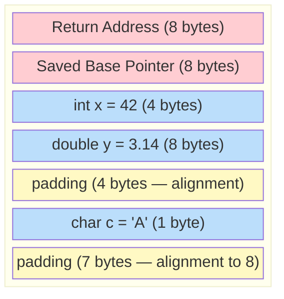
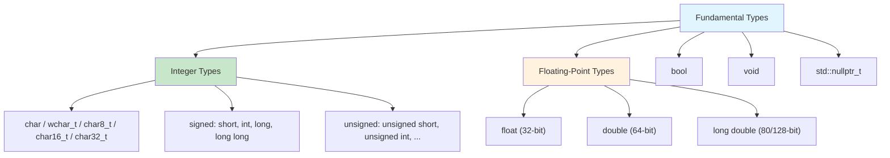

# Chapter 02 — Variables, Types & Memory Layout

> **Tags:** `#cpp` `#types` `#memory` `#stack` `#constexpr`
> **Prerequisites:** Chapter 01 (Hello C++, compilation model)
> **Estimated Time:** 2–3 hours

---

## 1. Theory

Every variable in C++ occupies a specific region of memory with a defined **type**, **size**, and **lifetime**. Unlike dynamically-typed languages, C++ determines types at compile time, enabling the compiler to generate optimal machine code with zero runtime type-checking overhead.

### The Type System: Why It Matters

C++ is **statically typed** and **strongly typed** (with escape hatches). The type system serves three critical purposes:

1. **Memory Layout** — The type determines how many bytes to allocate and how to interpret the bit pattern
2. **Valid Operations** — The compiler knows which operations are legal on each type
3. **Optimization** — The compiler can make assumptions about alignment, aliasing, and value ranges

### Fundamental Types

C++ inherits C's fundamental types and extends them:

| Type | Typical Size | Range | Use Case |
|------|-------------|-------|----------|
| `bool` | 1 byte | `true` / `false` | Flags, conditions |
| `char` | 1 byte | -128 to 127 (signed) | Characters, raw bytes |
| `short` | 2 bytes | -32,768 to 32,767 | Compact integers (rare) |
| `int` | 4 bytes | ±2.1 billion | General-purpose integer |
| `long` | 4 or 8 bytes | Platform-dependent | Extended integer |
| `long long` | 8 bytes | ±9.2 quintillion | Large integers |
| `float` | 4 bytes | ~7 decimal digits | Fast floating-point |
| `double` | 8 bytes | ~15 decimal digits | Default floating-point |
| `long double` | 8–16 bytes | Extended precision | Scientific computing |

**Critical insight**: Sizes are **minimum** guarantees, not exact. `sizeof(int)` is guaranteed ≥ 16 bits but is 32 bits on virtually all modern platforms. For exact-width types, use `<cstdint>`:

```cpp
#include <cstdint>
int8_t   a;   // Exactly 8 bits
int16_t  b;   // Exactly 16 bits
int32_t  c;   // Exactly 32 bits
int64_t  d;   // Exactly 64 bits
uint64_t e;   // Unsigned 64 bits
```

### Type Modifiers

- **`signed` / `unsigned`** — Controls whether the type represents negative values. `unsigned int` doubles the positive range but cannot hold negative values.
- **`short` / `long`** — Adjusts the minimum size. `short int` ≥ 16 bits, `long int` ≥ 32 bits, `long long int` ≥ 64 bits.
- **`const`** — Makes a variable immutable after initialization. The compiler enforces this and may optimize accordingly.
- **`constexpr`** — Declares a value computable at compile time. Stronger than `const` — guarantees compile-time evaluation.

### Memory Layout: Stack vs Heap

When a function is called, the CPU allocates a **stack frame** containing:
- Return address
- Function parameters
- Local variables
- Saved registers

The stack grows downward (on most architectures). Variables are laid out contiguously, with possible **padding** for alignment.

### Initialization in C++

C++ has a notoriously complex initialization story. Modern best practice: **use brace initialization** (`{}`) by default.

| Style | Syntax | Narrowing? | Example |
|-------|--------|-----------|---------|
| Default | `int x;` | N/A | Uninitialized (UB if read!) |
| Copy | `int x = 5;` | Allowed | `int x = 3.14;` → 3 (silent truncation) |
| Direct | `int x(5);` | Allowed | `int x(3.14);` → 3 |
| Brace (uniform) | `int x{5};` | **Rejected** | `int x{3.14};` → compiler error ✅ |
| Brace + copy | `int x = {5};` | **Rejected** | Same protection |

---

## 2. What / Why / How

### What?
Variables are named regions of memory with a type that determines their size, alignment, valid operations, and how the bit pattern is interpreted.

### Why?
Choosing the right type affects **performance** (cache usage, SIMD vectorization), **correctness** (overflow, precision loss), and **portability** (type sizes vary across platforms). In CUDA programming, choosing `float` vs `double` can mean a 2× performance difference on consumer GPUs.

### How?
Declare variables close to first use, use `auto` for complex types, prefer `{}` initialization, and use `const`/`constexpr` aggressively. The compiler is your ally — let it catch mistakes.

---

## 3. Code Examples

### Example 1 — Type Sizes and Limits

This program uses `sizeof` and `std::numeric_limits` to print the actual sizes and value ranges of each fundamental type on your system. Running it yourself reveals platform-specific details like whether `long` is 4 or 8 bytes.

```cpp
#include <iostream>
#include <limits>
#include <cstdint>

int main() {
    std::cout << "=== Fundamental Type Sizes ===\n";
    std::cout << "bool:        " << sizeof(bool)        << " byte(s)\n";
    std::cout << "char:        " << sizeof(char)        << " byte(s)\n";
    std::cout << "short:       " << sizeof(short)       << " byte(s)\n";
    std::cout << "int:         " << sizeof(int)         << " byte(s)\n";
    std::cout << "long:        " << sizeof(long)        << " byte(s)\n";
    std::cout << "long long:   " << sizeof(long long)   << " byte(s)\n";
    std::cout << "float:       " << sizeof(float)       << " byte(s)\n";
    std::cout << "double:      " << sizeof(double)      << " byte(s)\n";

    std::cout << "\n=== Integer Limits ===\n";
    std::cout << "int min:       " << std::numeric_limits<int>::min() << '\n';
    std::cout << "int max:       " << std::numeric_limits<int>::max() << '\n';
    std::cout << "uint64_t max:  " << std::numeric_limits<uint64_t>::max() << '\n';

    std::cout << "\n=== Floating-Point Precision ===\n";
    std::cout << "float digits:  " << std::numeric_limits<float>::digits10 << '\n';
    std::cout << "double digits: " << std::numeric_limits<double>::digits10 << '\n';

    return 0;
}
```

### Example 2 — Initialization Styles Compared

This program demonstrates the four main ways to initialize variables in C++. Brace initialization (`{}`) is preferred in modern C++ because it prevents silent narrowing conversions — the compiler will reject `int x{3.14}` instead of quietly truncating the value.

```cpp
#include <iostream>

int main() {
    // Default: UNINITIALIZED — reading is undefined behavior!
    int a;
    // std::cout << a;  // UB! Don't do this.

    // Copy initialization
    int b = 42;

    // Direct initialization
    int c(42);

    // Brace (uniform) initialization — preferred in modern C++
    int d{42};

    // Brace catches narrowing conversions
    // int e{3.14};  // ERROR: narrowing conversion from double to int

    // auto type deduction
    auto pi = 3.14159;           // double
    auto count = 42;             // int
    auto name = std::string{"C++"};  // std::string (not const char*!)

    std::cout << "b=" << b << " c=" << c << " d=" << d << '\n';
    std::cout << "pi=" << pi << " count=" << count << " name=" << name << '\n';

    return 0;
}
```

### Example 3 — const vs constexpr

This program illustrates the difference between `const` (a value that cannot change after initialization, but may be computed at runtime) and `constexpr` (a value the compiler must be able to compute at compile time). Notice that a `constexpr` function can also be called at runtime with non-constant arguments.

```cpp
#include <iostream>
#include <cmath>

// constexpr: evaluated at compile time (if possible)
constexpr int BOARD_SIZE = 8;
constexpr int TOTAL_SQUARES = BOARD_SIZE * BOARD_SIZE;

// constexpr function: can be evaluated at compile time
constexpr int factorial(int n) {
    return (n <= 1) ? 1 : n * factorial(n - 1);
}

int main() {
    // const: immutable, but may be runtime-initialized
    const double sqrt2 = std::sqrt(2.0);  // Runtime computation

    // constexpr: guaranteed compile-time
    constexpr int fact10 = factorial(10);

    // Can also call constexpr function at runtime
    int n{};
    std::cin >> n;
    int fact_n = factorial(n);  // Runtime call — still valid

    std::cout << "Board: " << BOARD_SIZE << "x" << BOARD_SIZE
              << " = " << TOTAL_SQUARES << " squares\n";
    std::cout << "sqrt(2) = " << sqrt2 << '\n';
    std::cout << "10! = " << fact10 << '\n';
    std::cout << n << "! = " << fact_n << '\n';

    return 0;
}
```

### Example 4 — Unsigned Overflow Trap

This program shows how unsigned integer overflow wraps around silently (255 + 1 becomes 0), which is defined behavior in C++. It also demonstrates the dangerous case where subtracting from an unsigned zero produces a huge number instead of -1, a common source of bugs.

```cpp
#include <iostream>
#include <cstdint>

int main() {
    // Unsigned overflow is DEFINED behavior (wraps around)
    uint8_t counter = 255;
    counter++;  // Wraps to 0 — no error, no warning!
    std::cout << "uint8_t overflow: " << static_cast<int>(counter) << '\n';  // 0

    // Signed overflow is UNDEFINED behavior — compiler can do anything
    // int32_t big = std::numeric_limits<int32_t>::max();
    // big++;  // UB! Don't do this.

    // Classic bug: unsigned subtraction
    unsigned int items = 0;
    // items - 1 wraps to 4294967295, NOT -1!
    if (items - 1 > 100) {
        std::cout << "Surprise! items-1 = " << (items - 1) << '\n';
    }

    return 0;
}
```

### Example 5 — Literals and Digit Separators (C++14/17)

This program showcases the different ways to write numeric literals in C++. Digit separators (`'`) make large numbers readable, and you can write values in hexadecimal (`0x`), binary (`0b`), or octal (`0`) notation. Suffixes like `f` and `LL` control the literal's type.

```cpp
#include <iostream>
#include <cstdint>

int main() {
    // Integer literals with digit separators (C++14)
    int million = 1'000'000;
    long long gdp = 25'000'000'000'000LL;

    // Different bases
    int hex_color = 0xFF'AA'33;    // Hexadecimal
    int permissions = 0b0111'0101;  // Binary (C++14)
    int legacy = 0755;              // Octal (avoid — confusing!)

    // Floating-point
    double avogadro = 6.022e23;
    float pi_f = 3.14159f;         // 'f' suffix for float literal

    // Character and string
    char newline = '\n';
    char16_t unicode = u'Ω';       // UTF-16 character

    std::cout << "million: " << million << '\n';
    std::cout << "hex_color: 0x" << std::hex << hex_color << std::dec << '\n';
    std::cout << "binary 0b01110101 = " << permissions << '\n';
    std::cout << "avogadro: " << avogadro << '\n';

    return 0;
}
```

---

## 4. Mermaid Diagrams

### Stack Frame Layout



### Type Hierarchy



---

## 5. Practical Exercises

### 🟢 Exercise 1: sizeof Explorer
Write a program that prints the `sizeof` every fundamental type, including `std::size_t` and `std::ptrdiff_t`. Format output as a neat table.

### 🟢 Exercise 2: Safe Input
Write a program that asks for the user's age and validates it is between 0 and 150. Use `unsigned int` and explain what happens if the user enters -1.

### 🟡 Exercise 3: Overflow Detector
Write a function `safe_add(int a, int b)` that returns `std::optional<int>` — returning `std::nullopt` if the addition would overflow. Test with `INT_MAX + 1`.

### 🟡 Exercise 4: Binary Representation
Write a program that reads an integer and prints its binary representation using bitwise operations (not `std::bitset`).

### 🔴 Exercise 5: Memory Inspector
Write a program that takes a `double` value, reinterprets its bytes as an array of `uint8_t`, and prints each byte in hexadecimal. This reveals the IEEE 754 representation.

---

## 6. Solutions

### Solution 1: sizeof Explorer

This solution uses `std::setw` and `std::left` from `<iomanip>` to format a neat table showing every fundamental type's size in bytes. It includes `size_t` and `ptrdiff_t`, which are important platform-dependent types used for sizes and pointer arithmetic.

```cpp
#include <iostream>
#include <iomanip>
#include <cstddef>
#include <cstdint>

int main() {
    std::cout << std::left;
    std::cout << std::setw(20) << "Type" << std::setw(10) << "Size (bytes)" << '\n';
    std::cout << std::string(30, '-') << '\n';
    std::cout << std::setw(20) << "bool"        << std::setw(10) << sizeof(bool) << '\n';
    std::cout << std::setw(20) << "char"        << std::setw(10) << sizeof(char) << '\n';
    std::cout << std::setw(20) << "short"       << std::setw(10) << sizeof(short) << '\n';
    std::cout << std::setw(20) << "int"         << std::setw(10) << sizeof(int) << '\n';
    std::cout << std::setw(20) << "long"        << std::setw(10) << sizeof(long) << '\n';
    std::cout << std::setw(20) << "long long"   << std::setw(10) << sizeof(long long) << '\n';
    std::cout << std::setw(20) << "float"       << std::setw(10) << sizeof(float) << '\n';
    std::cout << std::setw(20) << "double"      << std::setw(10) << sizeof(double) << '\n';
    std::cout << std::setw(20) << "long double" << std::setw(10) << sizeof(long double) << '\n';
    std::cout << std::setw(20) << "size_t"      << std::setw(10) << sizeof(std::size_t) << '\n';
    std::cout << std::setw(20) << "ptrdiff_t"   << std::setw(10) << sizeof(std::ptrdiff_t) << '\n';
    std::cout << std::setw(20) << "int64_t"     << std::setw(10) << sizeof(int64_t) << '\n';
    return 0;
}
```

### Solution 2: Safe Input

This solution validates user input with a loop that rejects invalid entries. If the user types a non-number or an out-of-range value, `cin.clear()` resets the error state and `cin.ignore()` discards the bad input so the program can ask again.

```cpp
#include <iostream>
#include <limits>

int main() {
    int age{};
    std::cout << "Enter your age: ";

    while (!(std::cin >> age) || age < 0 || age > 150) {
        std::cout << "Invalid input. Enter age (0-150): ";
        std::cin.clear();
        std::cin.ignore(std::numeric_limits<std::streamsize>::max(), '\n');
    }

    std::cout << "Your age is: " << age << '\n';
    // Note: if user enters -1 with unsigned int, it wraps to 4294967295
    // which is > 150, so validation catches it — but the comparison is tricky!
    return 0;
}
```

### Solution 3: Overflow Detector

This solution detects integer overflow *before* it happens by checking whether the result would exceed `INT_MAX` or go below `INT_MIN`. It returns `std::optional<int>` so callers receive `std::nullopt` on overflow instead of undefined behavior.

```cpp
#include <iostream>
#include <optional>
#include <climits>

std::optional<int> safe_add(int a, int b) {
    if (b > 0 && a > INT_MAX - b) return std::nullopt;  // Positive overflow
    if (b < 0 && a < INT_MIN - b) return std::nullopt;  // Negative overflow
    return a + b;
}

int main() {
    auto r1 = safe_add(100, 200);
    auto r2 = safe_add(INT_MAX, 1);
    auto r3 = safe_add(INT_MIN, -1);

    if (r1) std::cout << "100 + 200 = " << *r1 << '\n';
    if (!r2) std::cout << "INT_MAX + 1 = OVERFLOW!\n";
    if (!r3) std::cout << "INT_MIN + (-1) = OVERFLOW!\n";

    return 0;
}
```

### Solution 4: Binary Representation

This solution prints an integer's binary representation by shifting each bit into the least-significant position and masking with `& 1`. It iterates from the most significant bit to the least, inserting spaces every 8 bits for readability.

```cpp
#include <iostream>
#include <climits>

void print_binary(int value) {
    for (int i = sizeof(int) * CHAR_BIT - 1; i >= 0; --i) {
        std::cout << ((value >> i) & 1);
        if (i % 8 == 0 && i != 0) std::cout << ' ';
    }
    std::cout << '\n';
}

int main() {
    int n{};
    std::cout << "Enter an integer: ";
    std::cin >> n;
    std::cout << "Binary: ";
    print_binary(n);
    return 0;
}
```

### Solution 5: Memory Inspector

This solution uses `std::memcpy` to safely copy a `double` value's raw bytes into a `uint8_t` array, then prints each byte in hexadecimal. This reveals the IEEE 754 floating-point representation that the CPU actually stores in memory.

```cpp
#include <iostream>
#include <iomanip>
#include <cstdint>
#include <cstring>

void inspect_bytes(double value) {
    uint8_t bytes[sizeof(double)];
    std::memcpy(bytes, &value, sizeof(double));  // Type-safe aliasing

    std::cout << "Value: " << value << '\n';
    std::cout << "Bytes (little-endian): ";
    for (std::size_t i = 0; i < sizeof(double); ++i) {
        std::cout << std::hex << std::setw(2) << std::setfill('0')
                  << static_cast<int>(bytes[i]) << ' ';
    }
    std::cout << std::dec << '\n';
}

int main() {
    inspect_bytes(0.0);
    inspect_bytes(1.0);
    inspect_bytes(-1.0);
    inspect_bytes(3.14);
    inspect_bytes(1.0 / 0.0);  // +infinity
    return 0;
}
```

---

## 7. Quiz

**Q1.** What is the guaranteed minimum size of `int` in C++?
- A) 8 bits
- B) 16 bits ✅
- C) 32 bits
- D) 64 bits

**Q2.** Which initialization style catches narrowing conversions?
- A) `int x = 3.14;`
- B) `int x(3.14);`
- C) `int x{3.14};` ✅
- D) All of the above

**Q3.** What is the difference between `const` and `constexpr`?
- A) They are identical
- B) `const` can be runtime; `constexpr` must be compile-time ✅
- C) `constexpr` is only for functions
- D) `const` is deprecated in C++17

**Q4.** (Short Answer) What happens when you read an uninitialized `int` local variable?

> **Answer:** It is **undefined behavior**. The variable contains whatever garbage was previously in that stack location. The compiler may optimize based on the assumption that UB never occurs, leading to unexpected results — the variable might appear to be 0, random, or cause a crash. Always initialize your variables.

**Q5.** What value does `uint8_t x = 255; x++;` produce?
- A) 256
- B) 0 ✅
- C) Undefined behavior
- D) Compiler error

**Q6.** Which header provides `int32_t` and `uint64_t`?
- A) `<cstdlib>`
- B) `<cstdint>` ✅
- C) `<climits>`
- D) `<cmath>`

**Q7.** (Short Answer) Why is `auto` useful but potentially dangerous?

> **Answer:** `auto` reduces verbosity and prevents type-mismatch errors when types are complex (iterators, lambda types). However, it can be dangerous when the deduced type isn't what you expect — e.g., `auto x = 0;` deduces `int` not `unsigned`, and `auto s = "hello";` deduces `const char*` not `std::string`. It can also reduce code readability when the type isn't obvious from context.

**Q8.** What is the purpose of padding in a stack frame?
- A) Security
- B) Memory alignment for efficient CPU access ✅
- C) Debugging information
- D) Compiler bookkeeping

---

## 8. Key Takeaways

- C++ is **statically typed** — types are fixed at compile time, enabling maximum optimization
- Use **`<cstdint>`** types (`int32_t`, `uint64_t`) when exact sizes matter (protocols, hardware, serialization)
- **Brace initialization** `{}` is safest — it prevents narrowing conversions
- `const` means "don't change after init"; `constexpr` means "evaluate at compile time"
- **Unsigned overflow wraps** (defined); **signed overflow is undefined behavior**
- `auto` deduces types — great for complex types, use judiciously for clarity
- Memory alignment affects struct layout and performance — the compiler inserts padding
- Always initialize variables — reading uninitialized memory is UB

---

## 9. Chapter Summary

This chapter explored C++'s type system from fundamental types through type modifiers to initialization strategies. We examined how variables map to memory with specific sizes, alignment requirements, and padding. The distinction between `const` (runtime immutability) and `constexpr` (compile-time evaluation) was clarified, along with the `auto` keyword for type deduction. We saw how unsigned arithmetic wraps while signed overflow invokes undefined behavior — a critical distinction for writing correct, portable code. These type-system fundamentals directly affect performance in GPU programming, where choosing `float` over `double` can double throughput.

---

## 10. Real-World Insight

**CUDA / GPU Computing:** NVIDIA consumer GPUs have ~32× more float throughput than double. Choosing `float` vs `double` is a critical performance decision. The `half` (16-bit float) type in CUDA is even faster for ML inference.

**High-Frequency Trading:** Nanoseconds matter. Firms use exact-width types (`int64_t` for timestamps, `int32_t` for prices) to ensure consistent behavior across platforms and prevent alignment-related cache misses.

**Game Engines:** Memory layout is obsessively optimized. Entity Component Systems (ECS) like those in Unity DOTS pack data tightly, choosing types to minimize padding and maximize cache line utilization.

**Network Protocols:** Protocols define exact byte layouts. Using `uint16_t` and `uint32_t` with specific endianness ensures a packet serialized on one machine deserializes correctly on another.

---

## 11. Common Mistakes

### Mistake 1: Signed/Unsigned Comparison

When you compare a signed integer to an unsigned integer, the signed value gets implicitly converted to unsigned. A negative number like `-1` becomes a very large positive value, causing the comparison to produce unexpected results.

```cpp
int count = -1;
unsigned int size = 10;
if (count < size) {  // WARNING: -1 is implicitly converted to a huge unsigned value!
    // This branch is NOT taken!
}
// FIX: Use same signedness, or cast explicitly
if (count < static_cast<int>(size)) { /* correct */ }
```

### Mistake 2: Floating-Point Equality

Floating-point numbers cannot represent all decimal values exactly. Comparing them with `==` often fails because tiny rounding errors accumulate. Instead, check whether two values are close enough using an epsilon (small tolerance) value.

```cpp
double a = 0.1 + 0.2;
if (a == 0.3) {  // FALSE! 0.1+0.2 ≠ 0.3 in IEEE 754
    std::cout << "Equal\n";
}
// FIX: Use epsilon comparison
if (std::abs(a - 0.3) < 1e-9) {
    std::cout << "Close enough\n";
}
```

### Mistake 3: Not Initializing Variables

Reading an uninitialized variable is undefined behavior — the variable holds whatever garbage was previously in that memory location. Always initialize variables when you declare them, using `{}` or `= 0` to start with a known value.

```cpp
int sum;  // Uninitialized — contains garbage!
for (int i = 0; i < 10; ++i) {
    sum += i;  // UB on first iteration — sum is garbage
}
// FIX:
int sum{0};  // Or: int sum = 0;
```

### Mistake 4: Implicit Narrowing in Older Style

Assigning a `double` to an `int` with `=` silently truncates the decimal part, losing data without any warning. Brace initialization catches this mistake at compile time, and `static_cast<int>()` makes the truncation explicit in your code.

```cpp
double pi = 3.14159;
int approx = pi;  // Silently truncates to 3 — data loss!
// FIX: Use brace init to catch it
// int approx{pi};  // Compiler error!
int approx = static_cast<int>(pi);  // Explicit: "yes, I know"
```

---

## 12. Interview Questions

### Q1: What is the difference between `int`, `int32_t`, and `size_t`?

**Model Answer:** `int` is a fundamental type with a platform-dependent size (≥16 bits, typically 32). `int32_t` (from `<cstdint>`) is guaranteed to be exactly 32 bits — use it when exact size matters (protocols, serialization). `size_t` (from `<cstddef>`) is an unsigned type large enough to hold the size of any object — typically 64 bits on 64-bit systems. It's the return type of `sizeof` and is used for container sizes and indices. Mixing `int` and `size_t` in comparisons is a common source of bugs due to signed/unsigned conversion.

### Q2: Explain undefined behavior (UB) with an example.

**Model Answer:** Undefined behavior means the C++ standard places no requirements on the program's behavior — it can crash, produce wrong results, appear to work, or reformat your hard drive (theoretically). Common examples: reading uninitialized variables, signed integer overflow, dereferencing null pointers, out-of-bounds array access. The compiler is allowed to optimize assuming UB never occurs, which can cause surprising results. For example, a compiler seeing `if (x + 1 < x)` with signed `x` may optimize away the entire check, since signed overflow is UB and the condition "can't happen."

### Q3: When would you choose `constexpr` over `const`?

**Model Answer:** Use `constexpr` when the value must be available at compile time — array sizes, template arguments, switch cases, and compile-time computations. Use `const` when the value is computed at runtime but shouldn't change after initialization (e.g., `const double sqrt2 = std::sqrt(2.0)`). `constexpr` implies `const`, but not vice versa. In modern C++, prefer `constexpr` wherever possible — it enables more compiler optimizations and catches errors earlier.

### Q4: What is the "most vexing parse" and how does brace initialization solve it?

**Model Answer:** The "most vexing parse" is a C++ ambiguity where `Type name();` is parsed as a function declaration, not a variable initialization. For example, `std::vector<int> v();` declares a function `v` returning a vector, not an empty vector. Brace initialization resolves this: `std::vector<int> v{};` is unambiguously a variable. This is one of many reasons modern C++ guidelines recommend uniform (brace) initialization.

### Q5: How does struct padding work, and why does it matter for performance?

**Model Answer:** Compilers insert padding bytes between struct members to satisfy alignment requirements. For example, a `double` (8 bytes) must be aligned to an 8-byte boundary. So `struct { char a; double b; }` may be 16 bytes (1 + 7 padding + 8), not 9. This matters because misaligned access can be slow (extra cache line fetches) or even illegal on some architectures. For performance-critical code (GPU buffers, network packets, ECS data), you should order struct members by decreasing size to minimize padding.
