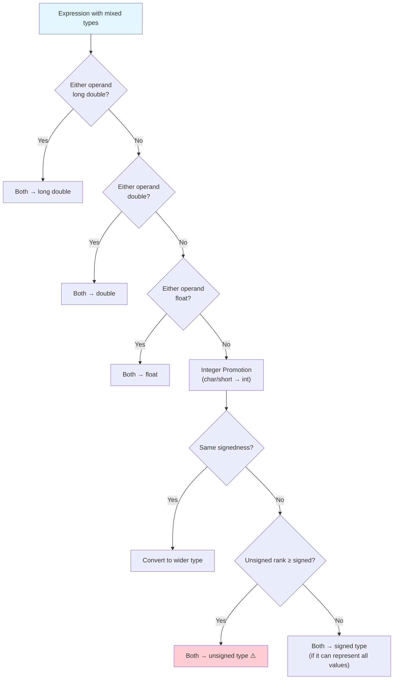
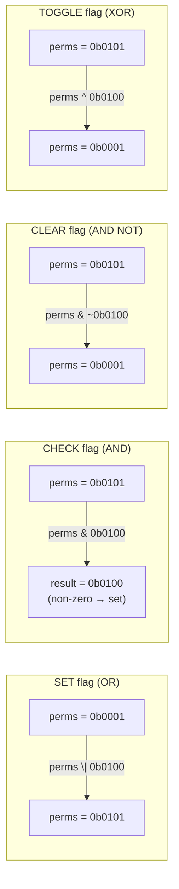

# Chapter 03 — Operators & Expressions

> **Tags:** `#cpp` `#operators` `#bitwise` `#casting` `#expressions`
> **Prerequisites:** Chapter 02 (Variables, Types, Memory)
> **Estimated Time:** 2–3 hours

---

## 1. Theory

Operators are symbols that tell the compiler to perform specific mathematical, relational, logical, or bitwise operations on operands. In C++, operators can be **overloaded** for user-defined types (covered in later chapters), making them far more powerful than in C.

### Operator Categories

C++ organizes operators into several categories:

| Category | Operators | Example |
|----------|-----------|---------|
| **Arithmetic** | `+`, `-`, `*`, `/`, `%` | `a + b`, `x % 2` |
| **Comparison** | `==`, `!=`, `<`, `>`, `<=`, `>=`, `<=>` (C++20) | `a == b` |
| **Logical** | `&&`, `\|\|`, `!` | `a && b` |
| **Bitwise** | `&`, `\|`, `^`, `~`, `<<`, `>>` | `flags & MASK` |
| **Assignment** | `=`, `+=`, `-=`, `*=`, `/=`, `%=`, `&=`, `\|=`, `^=`, `<<=`, `>>=` | `x += 5` |
| **Increment/Decrement** | `++`, `--` (prefix and postfix) | `++i`, `i++` |
| **Member Access** | `.`, `->`, `.*`, `->*` | `obj.member` |
| **Ternary** | `? :` | `x > 0 ? x : -x` |
| **Comma** | `,` | `a = 1, b = 2` |
| **Spaceship** (C++20) | `<=>` | `a <=> b` |

### Operator Precedence (Simplified)

Higher precedence binds tighter. When in doubt, use parentheses.

| Precedence | Operators | Associativity |
|-----------|-----------|---------------|
| 1 (highest) | `::` | Left |
| 2 | `()` `[]` `.` `->` `++`(post) `--`(post) | Left |
| 3 | `++`(pre) `--`(pre) `!` `~` `+`(unary) `-`(unary) `*`(deref) `&`(addr) `sizeof` | Right |
| 4 | `*` `/` `%` | Left |
| 5 | `+` `-` | Left |
| 6 | `<<` `>>` | Left |
| 7 | `<` `<=` `>` `>=` | Left |
| 8 | `==` `!=` | Left |
| 9 | `&` (bitwise AND) | Left |
| 10 | `^` (bitwise XOR) | Left |
| 11 | `\|` (bitwise OR) | Left |
| 12 | `&&` (logical AND) | Left |
| 13 | `\|\|` (logical OR) | Left |
| 14 | `?:` | Right |
| 15 | `=` `+=` `-=` etc. | Right |
| 16 (lowest) | `,` | Left |

### Type Casting in C++

C++ provides four named cast operators, each with a specific purpose:

| Cast | Purpose | Safety |
|------|---------|--------|
| `static_cast<T>` | Compile-time checked conversions (numeric, up/down class hierarchy) | Safe if used correctly |
| `const_cast<T>` | Add/remove `const` or `volatile` | Dangerous — modifying a truly const object is UB |
| `dynamic_cast<T>` | Runtime-checked downcast in class hierarchies (requires RTTI) | Safe — returns `nullptr` on failure |
| `reinterpret_cast<T>` | Bit-pattern reinterpretation (pointer-to-int, etc.) | Dangerous — almost no checks |

**Rule of thumb**: Use `static_cast` for 95% of casts. If you need `reinterpret_cast`, you're probably doing low-level work (hardware registers, serialization). If you need `const_cast`, reconsider your design.

### Implicit Conversions

The compiler silently converts types in expressions following "usual arithmetic conversions":

1. If either operand is `long double` → other becomes `long double`
2. Else if either is `double` → other becomes `double`
3. Else if either is `float` → other becomes `float`
4. Otherwise, integer promotion: types smaller than `int` become `int`
5. If signedness differs: signed converts to unsigned (dangerous!)

### Short-Circuit Evaluation

Logical operators `&&` and `||` evaluate left-to-right and **stop early**:

- `a && b`: if `a` is false, `b` is never evaluated
- `a || b`: if `a` is true, `b` is never evaluated

This is not just an optimization — it's a guarantee you can rely on:
```cpp
if (ptr != nullptr && ptr->value > 0) { /* safe — ptr checked first */ }
```

---

## 2. What / Why / How

### What?
Operators transform values through arithmetic, comparison, logic, and bit manipulation. Expressions combine operators and operands to produce results.

### Why?
Understanding operator precedence prevents subtle bugs. Mastering bitwise operations enables efficient flag management, hardware register manipulation, and high-performance algorithms. Knowing C++ cast types prevents undefined behavior.

### How?
Use parentheses to clarify intent. Prefer named casts over C-style casts. Use bitwise operations for flag manipulation and performance-critical code. Be explicit about type conversions.

---

## 3. Code Examples

### Example 1 — Arithmetic Operators and Integer Division

This program demonstrates basic arithmetic operators and a key C++ gotcha: when both operands are integers, division truncates toward zero (17 / 5 gives 3, not 3.4). To get a decimal result, you must cast at least one operand to `double` using `static_cast`.

```cpp
#include <iostream>

int main() {
    int a = 17, b = 5;

    std::cout << "a + b  = " << (a + b) << '\n';   // 22
    std::cout << "a - b  = " << (a - b) << '\n';   // 12
    std::cout << "a * b  = " << (a * b) << '\n';   // 85
    std::cout << "a / b  = " << (a / b) << '\n';   // 3 (truncated!)
    std::cout << "a % b  = " << (a % b) << '\n';   // 2

    // Integer division truncates toward zero
    std::cout << "-17 / 5 = " << (-17 / 5) << '\n';  // -3 (not -4)
    std::cout << "-17 % 5 = " << (-17 % 5) << '\n';  // -2

    // Force floating-point division
    double result = static_cast<double>(a) / b;
    std::cout << "17.0 / 5 = " << result << '\n';  // 3.4

    return 0;
}
```

### Example 2 — Comparison and the Spaceship Operator (C++20)

This program shows traditional comparison operators alongside the C++20 three-way comparison (spaceship) operator `<=>`. The spaceship operator returns a value that tells you whether the left side is less than, equal to, or greater than the right side — all in a single operation.

```cpp
#include <iostream>
#include <compare>  // C++20

int main() {
    int x = 10, y = 20;

    // Traditional comparisons
    std::cout << std::boolalpha;
    std::cout << "x == y: " << (x == y) << '\n';  // false
    std::cout << "x != y: " << (x != y) << '\n';  // true
    std::cout << "x < y:  " << (x < y)  << '\n';  // true

    // C++20 three-way comparison (spaceship operator)
    auto cmp = x <=> y;
    if (cmp < 0)      std::cout << "x is less than y\n";
    else if (cmp == 0) std::cout << "x equals y\n";
    else               std::cout << "x is greater than y\n";

    return 0;
}
```

### Example 3 — Bitwise Operations: Flags and Masks

This program shows how to use individual bits as on/off flags — a technique used everywhere in systems programming. Each permission gets its own bit position, and you use OR to set flags, AND to check them, AND-NOT to clear them, and XOR to toggle them.

```cpp
#include <iostream>
#include <cstdint>

// Permission flags using bit positions
constexpr uint8_t PERM_READ    = 0b0000'0001;  // Bit 0
constexpr uint8_t PERM_WRITE   = 0b0000'0010;  // Bit 1
constexpr uint8_t PERM_EXECUTE = 0b0000'0100;  // Bit 2
constexpr uint8_t PERM_ADMIN   = 0b1000'0000;  // Bit 7

void print_permissions(uint8_t perms) {
    std::cout << "Permissions: ";
    if (perms & PERM_READ)    std::cout << "READ ";
    if (perms & PERM_WRITE)   std::cout << "WRITE ";
    if (perms & PERM_EXECUTE) std::cout << "EXEC ";
    if (perms & PERM_ADMIN)   std::cout << "ADMIN ";
    std::cout << '\n';
}

int main() {
    uint8_t user_perms = 0;

    // Set permissions (OR)
    user_perms |= PERM_READ;
    user_perms |= PERM_WRITE;
    print_permissions(user_perms);  // READ WRITE

    // Add execute
    user_perms |= PERM_EXECUTE;
    print_permissions(user_perms);  // READ WRITE EXEC

    // Remove write (AND with complement)
    user_perms &= ~PERM_WRITE;
    print_permissions(user_perms);  // READ EXEC

    // Toggle admin (XOR)
    user_perms ^= PERM_ADMIN;
    print_permissions(user_perms);  // READ EXEC ADMIN

    // Check if specific permission is set
    bool can_write = (user_perms & PERM_WRITE) != 0;
    std::cout << "Can write? " << std::boolalpha << can_write << '\n';  // false

    return 0;
}
```

### Example 4 — Bitwise Tricks

This program collects several classic bitwise algorithms: checking if a number is a power of two, swapping values without a temporary variable, counting set bits using Kernighan's algorithm, and rounding up to the next power of two. These are common interview questions and appear frequently in performance-critical code.

```cpp
#include <iostream>
#include <cstdint>

// Check if a number is a power of 2
constexpr bool is_power_of_two(uint32_t n) {
    return n > 0 && (n & (n - 1)) == 0;
}

// Swap two integers without a temporary
void bitwise_swap(int& a, int& b) {
    a ^= b;
    b ^= a;
    a ^= b;
}

// Count set bits (Kernighan's algorithm)
constexpr int count_bits(uint32_t n) {
    int count = 0;
    while (n) {
        n &= (n - 1);  // Clear lowest set bit
        ++count;
    }
    return count;
}

// Round up to next power of 2
constexpr uint32_t next_power_of_two(uint32_t n) {
    --n;
    n |= n >> 1;
    n |= n >> 2;
    n |= n >> 4;
    n |= n >> 8;
    n |= n >> 16;
    return ++n;
}

int main() {
    std::cout << "is_power_of_two(16): " << is_power_of_two(16) << '\n';  // true
    std::cout << "is_power_of_two(15): " << is_power_of_two(15) << '\n';  // false

    int a = 42, b = 99;
    bitwise_swap(a, b);
    std::cout << "After swap: a=" << a << " b=" << b << '\n';  // a=99 b=42

    std::cout << "count_bits(0xFF): " << count_bits(0xFF) << '\n';  // 8
    std::cout << "next_power_of_two(50): " << next_power_of_two(50) << '\n';  // 64

    return 0;
}
```

### Example 5 — C++ Named Casts

This program demonstrates C++'s named cast operators, which replace the unsafe C-style `(int)x` syntax. Each cast has a specific purpose: `static_cast` for safe numeric conversions, `const_cast` for removing const (use sparingly), and `reinterpret_cast` for raw bit-level reinterpretation.

```cpp
#include <iostream>
#include <cstdint>
#include <cstring>

int main() {
    // --- static_cast: safe, compile-time checked ---
    double pi = 3.14159;
    int truncated = static_cast<int>(pi);  // 3 — explicit truncation
    std::cout << "static_cast<int>(3.14159) = " << truncated << '\n';

    // Enum to int
    enum class Color : uint8_t { Red = 0, Green = 1, Blue = 2 };
    int color_value = static_cast<int>(Color::Green);
    std::cout << "Color::Green = " << color_value << '\n';

    // --- const_cast: remove const (use with extreme caution) ---
    const int original = 42;
    // int& ref = const_cast<int&>(original);
    // ref = 99;  // UB! original was truly const
    // Only safe when the original object was NOT declared const

    // --- reinterpret_cast: raw bit reinterpretation ---
    float f = 1.0f;
    uint32_t bits;
    std::memcpy(&bits, &f, sizeof(float));  // Safe way to inspect bits
    std::cout << "float 1.0 bits: 0x" << std::hex << bits << std::dec << '\n';
    // Result: 0x3f800000 (IEEE 754 representation of 1.0)

    // --- AVOID C-style casts ---
    // int x = (int)pi;  // BAD: which cast is this? Unclear and unsafe.
    // int x = static_cast<int>(pi);  // GOOD: explicit intent

    return 0;
}
```

---

## 4. Mermaid Diagrams

### Implicit Conversion Rules



### Bitwise Flag Operations



---

## 5. Practical Exercises

### 🟢 Exercise 1: Simple Calculator
Write a program that reads two numbers and an operator (`+`, `-`, `*`, `/`, `%`) from the user and prints the result. Handle division by zero.

### 🟢 Exercise 2: Even/Odd Checker (Bitwise)
Write a function that checks if a number is even or odd using a bitwise operator (not modulo).

### 🟡 Exercise 3: RGB Color Packer
Write functions to pack three `uint8_t` values (R, G, B) into a single `uint32_t` (format: `0x00RRGGBB`) and unpack back. Use only bitwise operations.

### 🟡 Exercise 4: Safe Division
Write a function template (or overloaded functions) that performs division with proper handling for integer truncation, division by zero, and floating-point edge cases (NaN, infinity).

### 🔴 Exercise 5: Expression Evaluator
Write a program that evaluates simple expressions like `"3 + 4 * 2"` respecting operator precedence. Support `+`, `-`, `*`, `/` with integers.

---

## 6. Solutions

### Solution 1: Simple Calculator

This solution reads two numbers and an operator, then uses a `switch` statement to select the matching arithmetic operation. It handles division by zero as a special case and reports unknown operators via `std::cerr`.

```cpp
#include <iostream>

int main() {
    double a{}, b{};
    char op{};

    std::cout << "Enter expression (e.g., 10 + 3): ";
    std::cin >> a >> op >> b;

    switch (op) {
        case '+': std::cout << a << " + " << b << " = " << (a + b) << '\n'; break;
        case '-': std::cout << a << " - " << b << " = " << (a - b) << '\n'; break;
        case '*': std::cout << a << " * " << b << " = " << (a * b) << '\n'; break;
        case '/':
            if (b == 0.0) {
                std::cerr << "Error: division by zero\n";
            } else {
                std::cout << a << " / " << b << " = " << (a / b) << '\n';
            }
            break;
        default:
            std::cerr << "Unknown operator: " << op << '\n';
    }
    return 0;
}
```

### Solution 2: Even/Odd Checker (Bitwise)

This solution uses the bitwise AND operator to check the least significant bit: if `n & 1` is 0, the number is even. This is faster than using modulo (`n % 2`) and demonstrates a fundamental bitwise technique.

```cpp
#include <iostream>

constexpr bool is_even(int n) {
    return (n & 1) == 0;  // Check least significant bit
}

int main() {
    for (int i = 0; i < 10; ++i) {
        std::cout << i << " is " << (is_even(i) ? "even" : "odd") << '\n';
    }
    return 0;
}
```

### Solution 3: RGB Color Packer

This solution packs three separate 8-bit color values (R, G, B) into a single 32-bit integer using bit shifts, and unpacks them back using shifts and masks. This is exactly how colors are stored in graphics memory and image file formats.

```cpp
#include <iostream>
#include <cstdint>
#include <iomanip>

constexpr uint32_t pack_rgb(uint8_t r, uint8_t g, uint8_t b) {
    return (static_cast<uint32_t>(r) << 16) |
           (static_cast<uint32_t>(g) << 8)  |
           (static_cast<uint32_t>(b));
}

struct RGB {
    uint8_t r, g, b;
};

constexpr RGB unpack_rgb(uint32_t color) {
    return {
        static_cast<uint8_t>((color >> 16) & 0xFF),
        static_cast<uint8_t>((color >> 8) & 0xFF),
        static_cast<uint8_t>(color & 0xFF)
    };
}

int main() {
    uint32_t coral = pack_rgb(255, 127, 80);
    std::cout << "Coral: 0x" << std::hex << std::setfill('0')
              << std::setw(6) << coral << std::dec << '\n';

    auto [r, g, b] = unpack_rgb(coral);
    std::cout << "R=" << static_cast<int>(r)
              << " G=" << static_cast<int>(g)
              << " B=" << static_cast<int>(b) << '\n';

    return 0;
}
```

### Solution 4: Safe Division

This solution provides safe division functions that return `std::optional` — returning `std::nullopt` on division by zero or when the result would overflow. The integer version also handles the special case of `INT_MIN / -1`, which overflows.

```cpp
#include <iostream>
#include <optional>
#include <cmath>
#include <limits>

std::optional<int> safe_int_divide(int a, int b) {
    if (b == 0) return std::nullopt;
    if (a == std::numeric_limits<int>::min() && b == -1) return std::nullopt;
    return a / b;
}

std::optional<double> safe_double_divide(double a, double b) {
    if (b == 0.0) return std::nullopt;
    double result = a / b;
    if (std::isnan(result) || std::isinf(result)) return std::nullopt;
    return result;
}

int main() {
    if (auto r = safe_int_divide(10, 3)) std::cout << "10/3 = " << *r << '\n';
    if (!safe_int_divide(10, 0))          std::cout << "10/0 = error\n";
    if (auto r = safe_double_divide(1.0, 3.0)) std::cout << "1.0/3.0 = " << *r << '\n';
    return 0;
}
```

### Solution 5: Expression Evaluator

This solution implements a recursive descent parser that correctly handles operator precedence. It splits parsing into `expr` (handles `+` and `-`), `term` (handles `*` and `/`), and `factor` (handles numbers and parentheses), naturally encoding the precedence hierarchy through the call structure.

```cpp
#include <iostream>
#include <sstream>
#include <string>

// Simple recursive descent parser for: expr = term (('+' | '-') term)*
//                                       term = factor (('*' | '/') factor)*
//                                       factor = number | '(' expr ')'
class Parser {
    std::istringstream stream_;
    char current_{};

    void advance() { stream_.get(current_); }
    void skip_spaces() { while (stream_.peek() == ' ') stream_.get(); }

    double factor() {
        skip_spaces();
        if (stream_.peek() == '(') {
            advance();  // consume '('
            double val = expr();
            skip_spaces();
            advance();  // consume ')'
            return val;
        }
        double num{};
        stream_ >> num;
        return num;
    }

    double term() {
        double left = factor();
        skip_spaces();
        while (stream_.peek() == '*' || stream_.peek() == '/') {
            char op{};
            stream_.get(op);
            double right = factor();
            if (op == '*') left *= right;
            else           left /= right;
            skip_spaces();
        }
        return left;
    }

public:
    double expr() {
        double left = term();
        skip_spaces();
        while (stream_.peek() == '+' || stream_.peek() == '-') {
            char op{};
            stream_.get(op);
            double right = term();
            if (op == '+') left += right;
            else           left -= right;
            skip_spaces();
        }
        return left;
    }

    double evaluate(const std::string& expression) {
        stream_ = std::istringstream(expression);
        return expr();
    }
};

int main() {
    Parser parser;
    std::cout << "3 + 4 * 2 = " << parser.evaluate("3 + 4 * 2") << '\n';      // 11
    std::cout << "(3 + 4) * 2 = " << parser.evaluate("(3 + 4) * 2") << '\n';  // 14
    std::cout << "10 - 2 * 3 + 1 = " << parser.evaluate("10 - 2 * 3 + 1") << '\n';  // 5
    return 0;
}
```

---

## 7. Quiz

**Q1.** What is the result of `7 / 2` in C++ (both operands are `int`)?
- A) 3.5
- B) 3 ✅
- C) 4
- D) Compiler error

**Q2.** Which cast should you use to convert `double` to `int`?
- A) `reinterpret_cast`
- B) `const_cast`
- C) `static_cast` ✅
- D) `dynamic_cast`

**Q3.** What does the expression `n & (n - 1)` do?
- A) Doubles n
- B) Clears the lowest set bit ✅
- C) Sets all bits
- D) Returns n - 1

**Q4.** (Short Answer) Why is `(a == true)` worse than just `a` in a boolean context?

> **Answer:** If `a` is not a `bool` but an `int` with value 2, `a == true` compares `2 == 1` (since `true` converts to `1`), returning `false` — even though `a` is "truthy." Just writing `if (a)` correctly treats any non-zero value as true.

**Q5.** What does short-circuit evaluation guarantee?
- A) Both operands are always evaluated
- B) The second operand is skipped if the first determines the result ✅
- C) Evaluation happens right-to-left
- D) It only applies to `&&`

**Q6.** Which operator has higher precedence: `*` or `+`?
- A) `+`
- B) `*` ✅
- C) They are equal
- D) It depends on context

**Q7.** (Short Answer) Why should you avoid C-style casts like `(int)x`?

> **Answer:** C-style casts are dangerous because they try multiple cast types in sequence (`static_cast`, `const_cast`, `reinterpret_cast`) until one succeeds — you can't tell which one was used. Named casts make intent explicit: `static_cast<int>(x)` clearly means "numeric conversion," while a C-style cast might silently strip `const` or reinterpret bits. Named casts are also easier to search for in code.

**Q8.** What does `x ^= x` always produce?
- A) `x`
- B) `~x`
- C) `0` ✅
- D) Undefined behavior

---

## 8. Key Takeaways

- **Integer division truncates** toward zero — use `static_cast<double>` for true division
- **Operator precedence** is complex — use parentheses to clarify intent
- **Short-circuit evaluation** is a guarantee, not an optimization — rely on it for null checks
- **Bitwise operators** are essential for flags, masks, and hardware programming
- Use **named casts** (`static_cast`, etc.) — never C-style casts
- **Implicit conversions** between signed/unsigned are a major bug source
- The **spaceship operator** (`<=>`) in C++20 simplifies comparison overloading
- `constexpr` bitwise functions enable compile-time bit manipulation

---

## 9. Chapter Summary

This chapter covered C++ operators from basic arithmetic through bitwise manipulation and type casting. We explored operator precedence, the implicit conversion rules that silently change types in mixed expressions, and the four named cast operators that replace C-style casts with explicit intent. Bitwise operations — setting, clearing, toggling, and checking flags — were demonstrated as essential tools for systems programming. The key lesson: be explicit. Use parentheses for clarity, named casts for safety, and bitwise operators for performance-critical flag management.

---

## 10. Real-World Insight

**Game Engines:** Bitwise flags are ubiquitous. Unity and Unreal use bitmasks for layer masks, collision filters, and rendering flags. A single `uint32_t` can represent 32 boolean properties with O(1) set intersection via `&`.

**High-Frequency Trading:** Avoiding branches matters at nanosecond scale. Traders use branchless min/max (`(a ^ ((a ^ b) & -(a < b)))`) and bitwise tricks to avoid pipeline stalls.

**Networking:** IP addresses, subnet masks, and protocol headers are manipulated with bitwise operations. `ip & subnet_mask == network_address` is a fundamental networking operation.

**CUDA / GPU:** Warp-level programming uses bitmasks (`__ballot_sync`, `__shfl_xor_sync`) where each bit represents a thread in a 32-thread warp. Understanding bitwise operations is essential for GPU programming.

---

## 11. Common Mistakes

### Mistake 1: Precedence Surprises with Bitwise Operators

Bitwise operators like `&` have lower precedence than comparison operators like `==`, so `flags & MASK == 0` is parsed as `flags & (MASK == 0)` instead of `(flags & MASK) == 0`. Always use parentheses with bitwise expressions.

```cpp
// BAD — & has lower precedence than ==
if (flags & MASK == 0) { /* always false! */ }
// Parsed as: flags & (MASK == 0) → flags & 0 → 0

// FIX — parenthesize
if ((flags & MASK) == 0) { /* correct */ }
```

### Mistake 2: Using = Instead of ==

Using a single `=` in an `if` condition performs an assignment instead of a comparison. The assigned value is then tested as a boolean, leading to logic that always succeeds or always fails. Compiling with `-Wall` catches this common typo.

```cpp
int x = 5;
if (x = 0) {  // ASSIGNS 0 to x, then checks if 0 is true → always false!
    std::cout << "Never reached\n";
}
// FIX: Use == for comparison. Enable -Wall to catch this.
if (x == 0) { /* correct */ }
```

### Mistake 3: Signed/Unsigned Mixing in Bit Shifts

Right-shifting a signed negative value is implementation-defined — different compilers may or may not propagate the sign bit. Always use unsigned types like `uint32_t` for bitwise operations to get well-defined, portable behavior.

```cpp
int x = -1;
unsigned int y = x >> 1;  // Implementation-defined! May propagate sign bit
// FIX: Use unsigned types for bitwise operations
uint32_t x = 0xFFFFFFFF;
uint32_t y = x >> 1;  // Well-defined: 0x7FFFFFFF
```

### Mistake 4: Assuming Evaluation Order

The order in which function arguments are evaluated is unspecified in C++. If two arguments modify and read the same variable, the result is unpredictable. Separate such operations into distinct statements to ensure correct evaluation order.

```cpp
int i = 0;
int arr[3] = {10, 20, 30};
// BAD — order of evaluation of function arguments is unspecified
// foo(arr[i], ++i);  // Which i is used for arr[i]? Unspecified!
// FIX: Separate into distinct statements
int val = arr[i];
++i;
```

---

## 12. Interview Questions

### Q1: Explain the difference between prefix (`++i`) and postfix (`i++`) increment.

**Model Answer:** **Prefix** (`++i`) increments `i` and returns the new value. **Postfix** (`i++`) saves the old value, increments `i`, and returns the old value — requiring a temporary copy. For primitive types the compiler optimizes away the difference, but for complex iterators, prefix is more efficient (no temporary). Best practice: prefer `++i` unless you specifically need the old value.

### Q2: How would you check if a number is a power of 2 in O(1)?

**Model Answer:** `n > 0 && (n & (n - 1)) == 0`. A power of 2 has exactly one bit set (e.g., `0b1000`). Subtracting 1 flips all lower bits (`0b0111`). AND-ing them gives 0 only when there was a single bit. The `n > 0` check excludes zero, which would otherwise pass.

### Q3: Why are implicit conversions between signed and unsigned dangerous?

**Model Answer:** When a signed negative value is implicitly converted to unsigned, it becomes a very large positive number (due to two's complement wrapping). For example, `-1` becomes `4294967295` for `uint32_t`. This causes comparison bugs: `int count = -1; if (count < some_vector.size())` may be false because `count` converts to a huge unsigned value. This is a top-10 C++ bug source. Use `-Wsign-compare` and `-Wconversion` to catch these.

### Q4: What is the spaceship operator (`<=>`) and why was it added in C++20?

**Model Answer:** The three-way comparison operator `<=>` returns an object indicating whether the left operand is less than, equal to, or greater than the right operand. It was added to simplify comparison operator overloading — instead of writing all six operators (`==`, `!=`, `<`, `>`, `<=`, `>=`), you can define `<=>` and `==`, and the compiler generates the rest. The return type is one of `std::strong_ordering`, `std::weak_ordering`, or `std::partial_ordering`, depending on the semantics of the comparison.

### Q5: When would you use `const_cast`?

**Model Answer:** `const_cast` should be used sparingly. The main legitimate use case is interfacing with legacy C APIs that take non-const pointers but don't actually modify the data: `const_cast<char*>(str.c_str())`. It's also used in the "const overloading" pattern where a non-const method delegates to a const version to avoid code duplication. **Never** use `const_cast` to modify a variable that was originally declared `const` — that's undefined behavior.
