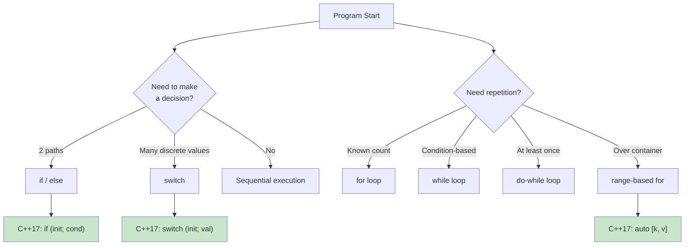
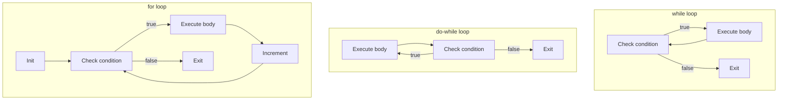

# Chapter 04 — Control Flow

> **Tags:** `#cpp` `#control-flow` `#loops` `#switch` `#structured-bindings`
> **Prerequisites:** Chapter 03 (Operators & Expressions)
> **Estimated Time:** 2–3 hours

---

## 1. Theory

Control flow determines the order in which statements execute. Without it, programs would be straight-line sequences — no decisions, no repetition, no branching. C++ provides rich control flow constructs inherited from C, enhanced with modern features like init-statements in `if`/`switch` (C++17), range-based for loops, and structured bindings.

### Branching Constructs

**`if` / `else`** — The fundamental decision. C++17 adds an init-statement form:
```cpp
if (init; condition) { ... }
```
This scopes a variable to the `if`/`else` block, reducing namespace pollution.

**`switch`** — Multi-way branch on integral/enum values. More efficient than chains of `if`/`else if` for many cases (compiler may generate a jump table). C++17 adds init-statement and `[[fallthrough]]` attribute.

### Loop Constructs

| Loop | Use When |
|------|----------|
| `for` | Known iteration count or index needed |
| `while` | Condition checked before first iteration |
| `do-while` | Body must execute at least once |
| Range-based `for` | Iterating over all elements of a container |

### Structured Bindings (C++17)

Structured bindings let you decompose aggregates into named variables:
```cpp
auto [key, value] = std::make_pair("hello", 42);
```
Works with pairs, tuples, arrays, and structs with public members. This is not destructuring in the JavaScript sense — it creates new variables that are aliases or copies of the original members.

### Early Return & Guard Clauses

The **guard clause** pattern handles error/edge cases first, then proceeds with the "happy path":
```cpp
bool process(Data* data) {
    if (!data) return false;         // Guard
    if (data->empty()) return false; // Guard
    // Happy path — main logic here
    return true;
}
```
This reduces nesting, improves readability, and makes the expected flow obvious.

### `goto` — The Controversial Statement

C++ inherits `goto` from C. It has exactly one legitimate modern use: breaking out of nested loops. In all other cases, prefer structured alternatives (functions, exceptions, RAII). Many style guides ban `goto` entirely.

---

## 2. What / Why / How

### What?
Control flow constructs direct program execution through decisions (branching), repetition (loops), and jumps (break, continue, return, goto).

### Why?
Programs must respond to varying inputs, repeat operations on data, and handle error conditions. Efficient control flow is the backbone of algorithms — from simple input validation to complex state machines.

### How?
Use `if`/`else` for binary decisions, `switch` for multi-way branching on discrete values, and the appropriate loop construct for iteration. Leverage C++17 features (init-statements, structured bindings) for cleaner code. Apply guard clauses to reduce nesting.

---

## 3. Code Examples

### Example 1 — if/else with C++17 Init-Statement

This example shows C++17's init-statement inside an `if`, which lets you declare a variable (like a map iterator) and test it in one line. The variable is scoped to the `if`/`else` block, keeping the surrounding code clean and preventing accidental reuse of temporary lookup results.

```cpp
#include <iostream>
#include <map>
#include <string>

int main() {
    std::map<std::string, int> scores{
        {"Alice", 95}, {"Bob", 87}, {"Charlie", 42}
    };

    // C++17: init-statement in if
    // 'it' is scoped to the if/else block
    if (auto it = scores.find("Bob"); it != scores.end()) {
        std::cout << "Bob's score: " << it->second << '\n';
    } else {
        std::cout << "Bob not found\n";
    }
    // 'it' is not accessible here — no namespace pollution

    // Traditional approach (variable leaks into outer scope)
    auto it2 = scores.find("Dave");
    if (it2 != scores.end()) {
        std::cout << "Dave's score: " << it2->second << '\n';
    } else {
        std::cout << "Dave not found\n";
    }
    // it2 is still accessible here — unnecessary

    return 0;
}
```

### Example 2 — Modern switch Statement

This example demonstrates using `switch` with a strongly-typed `enum class` to handle HTTP status codes. By omitting a `default` case, the compiler can warn you if you forget to handle a new enum value. It also shows the C++17 init-statement inside `switch`, which keeps the variable scoped to the switch block.

```cpp
#include <iostream>
#include <string>

enum class HttpStatus : int {
    OK = 200,
    Created = 201,
    BadRequest = 400,
    Unauthorized = 401,
    NotFound = 404,
    InternalError = 500
};

std::string status_message(HttpStatus status) {
    switch (status) {
        case HttpStatus::OK:           return "OK";
        case HttpStatus::Created:      return "Created";
        case HttpStatus::BadRequest:   return "Bad Request";
        case HttpStatus::Unauthorized: return "Unauthorized";
        case HttpStatus::NotFound:     return "Not Found";
        case HttpStatus::InternalError: return "Internal Server Error";
        // No default — compiler warns if a case is missing with -Wswitch
    }
    return "Unknown";  // Unreachable, but satisfies return analysis
}

int main() {
    // C++17: init-statement in switch
    switch (auto code = HttpStatus::NotFound; code) {
        case HttpStatus::OK:
        case HttpStatus::Created:
            std::cout << "Success: " << status_message(code) << '\n';
            break;
        case HttpStatus::BadRequest:
        case HttpStatus::Unauthorized:
        case HttpStatus::NotFound:
            std::cout << "Client Error: " << status_message(code) << '\n';
            break;
        case HttpStatus::InternalError:
            std::cout << "Server Error: " << status_message(code) << '\n';
            break;
    }

    return 0;
}
```

### Example 3 — Loop Varieties

This example compares the four main loop styles in C++: the classic index-based `for` (when you need the position), the range-based `for` (the cleanest way to iterate), `while` (for condition-driven loops), and `do-while` (which guarantees at least one execution). Each has a specific use case, and choosing the right one makes your intent clearer.

```cpp
#include <iostream>
#include <vector>
#include <string>

int main() {
    std::vector<std::string> languages{"C++", "Rust", "Python", "Go", "Zig"};

    // 1. Classic for loop (when you need the index)
    std::cout << "=== Classic for ===\n";
    for (std::size_t i = 0; i < languages.size(); ++i) {
        std::cout << i << ": " << languages[i] << '\n';
    }

    // 2. Range-based for (preferred for iteration)
    std::cout << "\n=== Range-based for ===\n";
    for (const auto& lang : languages) {
        std::cout << lang << '\n';
    }

    // 3. Range-based for with init-statement (C++20)
    // for (auto size = languages.size(); const auto& lang : languages) { ... }

    // 4. while loop
    std::cout << "\n=== while ===\n";
    int countdown = 5;
    while (countdown > 0) {
        std::cout << countdown << "... ";
        --countdown;
    }
    std::cout << "Liftoff!\n";

    // 5. do-while (execute at least once)
    std::cout << "\n=== do-while (input validation) ===\n";
    int choice{};
    do {
        std::cout << "Enter 1, 2, or 3: ";
        std::cin >> choice;
    } while (choice < 1 || choice > 3);
    std::cout << "You chose: " << choice << '\n';

    return 0;
}
```

### Example 4 — Structured Bindings (C++17)

Structured bindings let you unpack pairs, tuples, arrays, and structs into named variables with `auto [a, b] = ...`. This example shows the four most common uses: iterating a map with `[key, value]`, unpacking a tuple returned from a function, decomposing an array, and capturing the result of `map::insert` which returns an iterator-bool pair.

```cpp
#include <iostream>
#include <map>
#include <tuple>
#include <string>
#include <array>

// Function returning a tuple
std::tuple<bool, std::string, int> authenticate(const std::string& user) {
    if (user == "admin") return {true, "Welcome, admin!", 0};
    return {false, "Access denied", -1};
}

int main() {
    // 1. With std::pair (most common: map iteration)
    std::map<std::string, double> prices{
        {"AAPL", 178.50}, {"GOOG", 141.80}, {"MSFT", 378.91}
    };

    std::cout << "=== Map iteration with structured bindings ===\n";
    for (const auto& [ticker, price] : prices) {
        std::cout << ticker << ": $" << price << '\n';
    }

    // 2. With std::tuple
    auto [success, message, error_code] = authenticate("admin");
    if (success) {
        std::cout << message << " (code: " << error_code << ")\n";
    }

    // 3. With arrays
    std::array<int, 3> rgb{255, 128, 64};
    auto [r, g, b] = rgb;
    std::cout << "R=" << r << " G=" << g << " B=" << b << '\n';

    // 4. With map::insert (returns pair<iterator, bool>)
    if (auto [it, inserted] = prices.insert({"TSLA", 248.50}); inserted) {
        std::cout << "Inserted " << it->first << " at $" << it->second << '\n';
    } else {
        std::cout << it->first << " already exists\n";
    }

    return 0;
}
```

### Example 5 — Guard Clauses & Early Return

This example contrasts deeply nested `if` blocks (the "bad" approach) with guard clauses that return early on invalid input (the "good" approach). Guard clauses check for error conditions first and exit immediately, keeping the main logic at the shallowest nesting level and making the code much easier to read.

```cpp
#include <iostream>
#include <string>
#include <vector>
#include <optional>
#include <algorithm>

struct User {
    std::string name;
    int age;
    bool active;
};

// BAD: Deeply nested
std::optional<std::string> greet_nested(const std::vector<User>& users, int id) {
    if (id >= 0) {
        if (static_cast<std::size_t>(id) < users.size()) {
            if (users[id].active) {
                if (!users[id].name.empty()) {
                    return "Hello, " + users[id].name + "!";
                }
            }
        }
    }
    return std::nullopt;
}

// GOOD: Guard clauses — flat and readable
std::optional<std::string> greet_clean(const std::vector<User>& users, int id) {
    if (id < 0) return std::nullopt;
    if (static_cast<std::size_t>(id) >= users.size()) return std::nullopt;

    const auto& user = users[id];
    if (!user.active) return std::nullopt;
    if (user.name.empty()) return std::nullopt;

    return "Hello, " + user.name + "!";
}

int main() {
    std::vector<User> users{
        {"Alice", 30, true},
        {"",      25, true},   // Empty name
        {"Charlie", 28, false} // Inactive
    };

    for (int id = -1; id <= 3; ++id) {
        if (auto msg = greet_clean(users, id)) {
            std::cout << "ID " << id << ": " << *msg << '\n';
        } else {
            std::cout << "ID " << id << ": (invalid)\n";
        }
    }

    return 0;
}
```

### Example 6 — Breaking Out of Nested Loops

When searching a 2D matrix, `break` only exits the innermost loop. This example shows three strategies to break out of nested loops: using a boolean flag (verbose but common), using `goto` (controversial but concise), and wrapping the loops in a lambda so you can `return` from it. The lambda approach is the most modern and recommended.

```cpp
#include <iostream>
#include <vector>

int main() {
    std::vector<std::vector<int>> matrix{
        {1, 2, 3},
        {4, 5, 6},
        {7, 8, 9}
    };

    // Method 1: Using a flag (common but verbose)
    int target = 5;
    bool found = false;
    for (std::size_t r = 0; r < matrix.size() && !found; ++r) {
        for (std::size_t c = 0; c < matrix[r].size() && !found; ++c) {
            if (matrix[r][c] == target) {
                std::cout << "Found " << target << " at [" << r << "][" << c << "]\n";
                found = true;
            }
        }
    }

    // Method 2: Lambda with early return (modern, clean)
    auto find_in_matrix = [&](int val) -> bool {
        for (std::size_t r = 0; r < matrix.size(); ++r) {
            for (std::size_t c = 0; c < matrix[r].size(); ++c) {
                if (matrix[r][c] == val) {
                    std::cout << "Lambda found " << val
                              << " at [" << r << "][" << c << "]\n";
                    return true;
                }
            }
        }
        return false;
    };
    find_in_matrix(8);

    return 0;
}
```

---

## 4. Mermaid Diagrams

### Control Flow Decision Tree



### Loop Execution Patterns



---

## 5. Practical Exercises

### 🟢 Exercise 1: FizzBuzz
Print numbers 1 to 100. For multiples of 3 print "Fizz", multiples of 5 print "Buzz", multiples of both print "FizzBuzz".

### 🟢 Exercise 2: Number Guessing Game
Generate a random number 1–100. Let the user guess with "higher"/"lower" hints. Track the number of guesses.

### 🟡 Exercise 3: Menu System
Create an interactive menu with a `do-while` loop: 1) Add item, 2) List items, 3) Remove last, 4) Quit. Use a `std::vector<std::string>` to store items.

### 🟡 Exercise 4: Pattern Printer
Using nested loops, print a diamond pattern of `*` characters for a given odd width:
```
  *
 ***
*****
 ***
  *
```

### 🔴 Exercise 5: Simple State Machine
Implement a text parser state machine that counts words, lines, and characters in input text. Use an `enum class` for states (InWord, OutOfWord) and a `switch` to handle transitions.

---

## 6. Solutions

### Solution 1: FizzBuzz

This solution uses chained `if`/`else if` to print "FizzBuzz" for multiples of 15, "Fizz" for multiples of 3, "Buzz" for multiples of 5, and the number otherwise. Testing `% 15` first avoids printing "Fizz" or "Buzz" alone when both conditions are true.

```cpp
#include <iostream>

int main() {
    for (int i = 1; i <= 100; ++i) {
        if (i % 15 == 0)     std::cout << "FizzBuzz";
        else if (i % 3 == 0) std::cout << "Fizz";
        else if (i % 5 == 0) std::cout << "Buzz";
        else                  std::cout << i;
        std::cout << '\n';
    }
    return 0;
}
```

### Solution 2: Number Guessing Game

This solution uses a `do-while` loop to guarantee the player gets at least one guess. A random target is generated using C++'s `<random>` library (preferred over `rand()`), and the loop continues giving "Higher!" or "Lower!" hints until the correct number is found.

```cpp
#include <iostream>
#include <random>

int main() {
    std::random_device rd;
    std::mt19937 gen(rd());
    std::uniform_int_distribution<int> dist(1, 100);
    int target = dist(gen);

    int guess{}, attempts{0};
    std::cout << "Guess the number (1-100)!\n";

    do {
        std::cout << "Your guess: ";
        std::cin >> guess;
        ++attempts;

        if (guess < target)      std::cout << "Higher!\n";
        else if (guess > target) std::cout << "Lower!\n";
        else std::cout << "Correct! You got it in " << attempts << " guesses.\n";

    } while (guess != target);

    return 0;
}
```

### Solution 3: Menu System

This solution combines a `do-while` loop with a `switch` statement to build an interactive menu. The `do-while` ensures the menu displays at least once, and `switch` dispatches the user's choice to add, list, or remove items from a vector. Each `case` uses `break` to prevent fall-through.

```cpp
#include <iostream>
#include <vector>
#include <string>

int main() {
    std::vector<std::string> items;
    int choice{};

    do {
        std::cout << "\n=== Menu ===\n"
                  << "1) Add item\n"
                  << "2) List items\n"
                  << "3) Remove last\n"
                  << "4) Quit\n"
                  << "Choice: ";
        std::cin >> choice;
        std::cin.ignore();

        switch (choice) {
            case 1: {
                std::string item;
                std::cout << "Enter item: ";
                std::getline(std::cin, item);
                items.push_back(std::move(item));
                std::cout << "Added!\n";
                break;
            }
            case 2:
                if (items.empty()) {
                    std::cout << "(empty)\n";
                } else {
                    for (std::size_t i = 0; i < items.size(); ++i) {
                        std::cout << "  " << i + 1 << ". " << items[i] << '\n';
                    }
                }
                break;
            case 3:
                if (items.empty()) {
                    std::cout << "Nothing to remove.\n";
                } else {
                    std::cout << "Removed: " << items.back() << '\n';
                    items.pop_back();
                }
                break;
            case 4:
                std::cout << "Goodbye!\n";
                break;
            default:
                std::cout << "Invalid choice.\n";
        }
    } while (choice != 4);

    return 0;
}
```

### Solution 4: Diamond Pattern

This solution prints a diamond shape using nested `for` loops. The top half grows from 1 star to `width` stars by adding 2 each row, while the bottom half mirrors it in reverse. Leading spaces are calculated as `half - row` to center each line, demonstrating precise loop control for pattern generation.

```cpp
#include <iostream>

void print_diamond(int width) {
    if (width % 2 == 0) ++width;  // Ensure odd

    int half = width / 2;

    // Top half including middle
    for (int row = 0; row <= half; ++row) {
        for (int sp = 0; sp < half - row; ++sp) std::cout << ' ';
        for (int st = 0; st < 2 * row + 1; ++st) std::cout << '*';
        std::cout << '\n';
    }

    // Bottom half
    for (int row = half - 1; row >= 0; --row) {
        for (int sp = 0; sp < half - row; ++sp) std::cout << ' ';
        for (int st = 0; st < 2 * row + 1; ++st) std::cout << '*';
        std::cout << '\n';
    }
}

int main() {
    print_diamond(7);
    return 0;
}
```

### Solution 5: Word/Line/Char Counter (State Machine)

This solution implements a finite state machine with two states (`InWord` and `OutOfWord`) to count words, lines, and characters. A `switch` statement drives the transitions: when a non-space character is encountered while `OutOfWord`, the state flips to `InWord` and the word count increments. This pattern is the foundation of parsers and tokenizers.

```cpp
#include <iostream>
#include <string>
#include <sstream>

enum class State { OutOfWord, InWord };

struct Counts {
    int words{0};
    int lines{0};
    int chars{0};
};

Counts count_text(const std::string& text) {
    Counts c;
    State state = State::OutOfWord;

    for (char ch : text) {
        ++c.chars;

        if (ch == '\n') ++c.lines;

        switch (state) {
            case State::OutOfWord:
                if (!std::isspace(static_cast<unsigned char>(ch))) {
                    state = State::InWord;
                    ++c.words;
                }
                break;
            case State::InWord:
                if (std::isspace(static_cast<unsigned char>(ch))) {
                    state = State::OutOfWord;
                }
                break;
        }
    }

    if (c.chars > 0 && text.back() != '\n') ++c.lines;
    return c;
}

int main() {
    std::string text = "Hello World\nThis is a test\nOf the state machine\n";
    auto [words, lines, chars] = count_text(text);

    std::cout << "Words: " << words << '\n';
    std::cout << "Lines: " << lines << '\n';
    std::cout << "Chars: " << chars << '\n';

    return 0;
}
```

---

## 7. Quiz

**Q1.** What does C++17's `if (auto it = m.find(k); it != m.end())` do?
- A) Declares a global variable `it`
- B) Scopes `it` to the if/else block ✅
- C) Creates a compile error
- D) Runs a parallel search

**Q2.** Which loop guarantees at least one execution of the body?
- A) `for`
- B) `while`
- C) `do-while` ✅
- D) Range-based `for`

**Q3.** What happens if you omit `break` in a `switch` case?
- A) Compiler error
- B) Execution falls through to the next case ✅
- C) The switch exits
- D) Undefined behavior

**Q4.** (Short Answer) When is `goto` arguably justified in C++?

> **Answer:** Breaking out of deeply nested loops is the one commonly accepted use case. However, even this can be replaced by extracting the nested loops into a function and using `return`, or by using a lambda with early return. Many codebases ban `goto` entirely. The Linux kernel is a notable exception that uses `goto` for error cleanup in C code.

**Q5.** What does `auto [x, y] = std::make_pair(1, 2);` do?
- A) Creates a pair and copies both elements into `x` and `y` ✅
- B) Creates references to pair members
- C) Only works with tuples
- D) Is a C++20 feature

**Q6.** What is the benefit of guard clauses over nested if/else?
- A) They're faster
- B) They reduce nesting and improve readability ✅
- C) They generate fewer machine instructions
- D) They're required by the C++ standard

**Q7.** (Short Answer) Explain the difference between `break` and `continue`.

> **Answer:** `break` immediately exits the innermost loop or switch. `continue` skips the rest of the current iteration and jumps to the loop's next iteration (condition check for while/do-while, increment for for-loops). Neither affects outer loops. To affect outer loops, you need a flag, `goto`, or a function return.

**Q8.** Why should you prefer `++i` over `i++` in loop increments?
- A) `++i` is always faster
- B) For iterators, `++i` avoids creating a temporary copy ✅
- C) `i++` is deprecated
- D) There is no difference

---

## 8. Key Takeaways

- C++17 **init-statements** in `if`/`switch` reduce variable scope pollution
- **`switch`** is cleaner than `if`/`else if` chains for discrete values; always handle all cases
- **Range-based for** is the default for container iteration; use classic `for` when you need the index
- **Structured bindings** (`auto [a, b] = ...`) make pair/tuple decomposition readable
- **Guard clauses** flatten nested logic and make the happy path obvious
- `do-while` guarantees at least one iteration — ideal for input validation
- Prefer `++i` over `i++` to avoid unnecessary temporaries with iterators
- Avoid `goto` — use lambdas or functions for early exit from nested loops

---

## 9. Chapter Summary

This chapter covered C++'s control flow constructs from basic `if`/`else` and `switch` through all loop varieties to modern C++17 features like init-statements and structured bindings. We emphasized the guard clause pattern for reducing nesting, demonstrated when to use each loop type, and showed how structured bindings make map iteration and tuple unpacking clean and expressive. The chapter also covered the controversial `goto` statement and its modern alternatives. These control flow patterns are the building blocks of algorithms and state machines used throughout systems programming.

---

## 10. Real-World Insight

**Game Engines:** Game loops are the heartbeat of every game. Unreal Engine's main loop is a `while` loop that runs `Tick()` every frame. State machines (using `switch` on enum states) drive AI behavior, animation systems, and UI flows.

**Trading Systems:** Order matching engines use tight loops with early exits to minimize latency. Every nanosecond in a loop body matters, so guard clauses that short-circuit unnecessary work are critical.

**Embedded Systems:** `do-while(0)` is a classic C/C++ macro trick that allows multi-statement macros to behave like a single statement in `if`/`else` contexts. You'll see this pattern in Linux kernel code and firmware.

**ML Frameworks:** Training loops in PyTorch/TensorFlow iterate over epochs and batches. The C++ backends use range-based for loops over tensors and apply early stopping (break) when validation metrics plateau.

---

## 11. Common Mistakes

### Mistake 1: Forgetting `break` in switch

Without `break`, execution "falls through" from one `case` into the next, so matching `case 1` would also run `case 2`'s code. Always add `break` at the end of each case, or use `[[fallthrough]]` to signal that the fall-through is intentional.

```cpp
switch (x) {
    case 1: std::cout << "one\n";    // Falls through!
    case 2: std::cout << "two\n";    // Also executes when x == 1
}
// FIX: Add break (or [[fallthrough]] if intentional)
switch (x) {
    case 1: std::cout << "one\n"; break;
    case 2: std::cout << "two\n"; break;
}
```

### Mistake 2: Off-by-One in Loops

Using `<=` instead of `<` in the loop condition causes an out-of-bounds access on the last iteration. For an array of size 5, valid indices are 0–4, so the condition should be `i < 5`. Range-based `for` eliminates this mistake entirely.

```cpp
// BAD: accesses arr[5] which is out of bounds for arr[5]
int arr[5] = {1, 2, 3, 4, 5};
for (int i = 0; i <= 5; ++i) {  // Should be < 5
    std::cout << arr[i];
}
// FIX: Use < (not <=), or better: range-based for
for (int val : arr) std::cout << val;
```

### Mistake 3: Infinite Loop from Unsigned Underflow

An `unsigned int` can never be negative, so the condition `i >= 0` is always true. When `i` decrements past zero it wraps around to the maximum unsigned value, creating an infinite loop. The fix is to use a signed `int` for countdown loops.

```cpp
// BAD: i is unsigned, so i >= 0 is ALWAYS true!
for (unsigned int i = 10; i >= 0; --i) {
    std::cout << i << '\n';  // Infinite loop! Wraps from 0 to UINT_MAX
}
// FIX: Use signed int, or restructure the loop
for (int i = 10; i >= 0; --i) {
    std::cout << i << '\n';
}
```

### Mistake 4: Modifying Container While Iterating

Calling `erase()` on a vector while iterating with iterators invalidates those iterators, causing undefined behavior. The fix is the erase-remove idiom, which moves unwanted elements to the end first and then erases them in one call. C++20 simplifies this with `std::erase_if`.

```cpp
std::vector<int> v{1, 2, 3, 4, 5};
// BAD: erasing invalidates iterators!
for (auto it = v.begin(); it != v.end(); ++it) {
    if (*it % 2 == 0) v.erase(it);  // UB!
}
// FIX: Use erase-remove idiom
v.erase(std::remove_if(v.begin(), v.end(),
    [](int x) { return x % 2 == 0; }), v.end());
// Or in C++20: std::erase_if(v, [](int x) { return x % 2 == 0; });
```

---

## 12. Interview Questions

### Q1: What is the difference between `break` and `return` inside a loop?

**Model Answer:** `break` exits only the innermost loop/switch and continues execution after it. `return` exits the entire function, regardless of how many loops are nested. When you need to exit nested loops, `return` (from a helper function or lambda) is cleaner than `break` with flag variables.

### Q2: Explain how structured bindings work in C++17.

**Model Answer:** Structured bindings decompose an aggregate type into named aliases. `auto [a, b] = pair;` creates `a` and `b` as copies of (or references to, with `auto&`) the pair's first and second members. It works with `std::pair`, `std::tuple`, `std::array`, and any struct with all public members. Under the hood, the compiler creates a hidden variable holding the aggregate and binds names to its members.

### Q3: When would you use `do-while` over `while`?

**Model Answer:** When the loop body must execute at least once before checking the condition. Classic examples: input validation (prompt then validate), menu systems (display menu then check for exit), and algorithms that modify state before testing convergence. The key difference: `while` checks before the first iteration; `do-while` checks after.

### Q4: Why does C++ still have `goto`? Should you use it?

**Model Answer:** `goto` exists for C compatibility and has one remaining legitimate use: breaking out of deeply nested loops. However, modern C++ provides better alternatives: extract the nested loops into a function/lambda and use `return`, use flag variables, or redesign the algorithm. Most modern style guides (Google, LLVM, Mozilla) prohibit or heavily restrict `goto`. The Linux kernel is a notable exception, using `goto` for centralized error cleanup in C code.

### Q5: What is the performance difference between `switch` and `if/else if` chains?

**Model Answer:** For a small number of cases (2-3), they're typically identical. For many cases with contiguous values, the compiler can generate a **jump table** for `switch`, giving O(1) dispatch instead of O(n) sequential comparisons. However, modern compilers are smart enough to convert `if/else if` chains into jump tables too, if the pattern is suitable. The main advantage of `switch` is **readability** and the compiler's ability to warn about unhandled enum values (`-Wswitch`).
