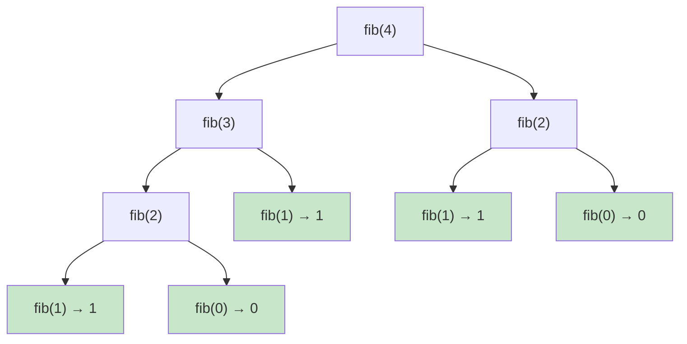
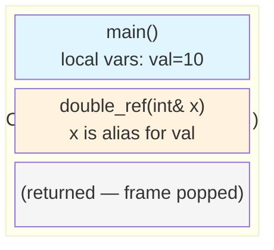
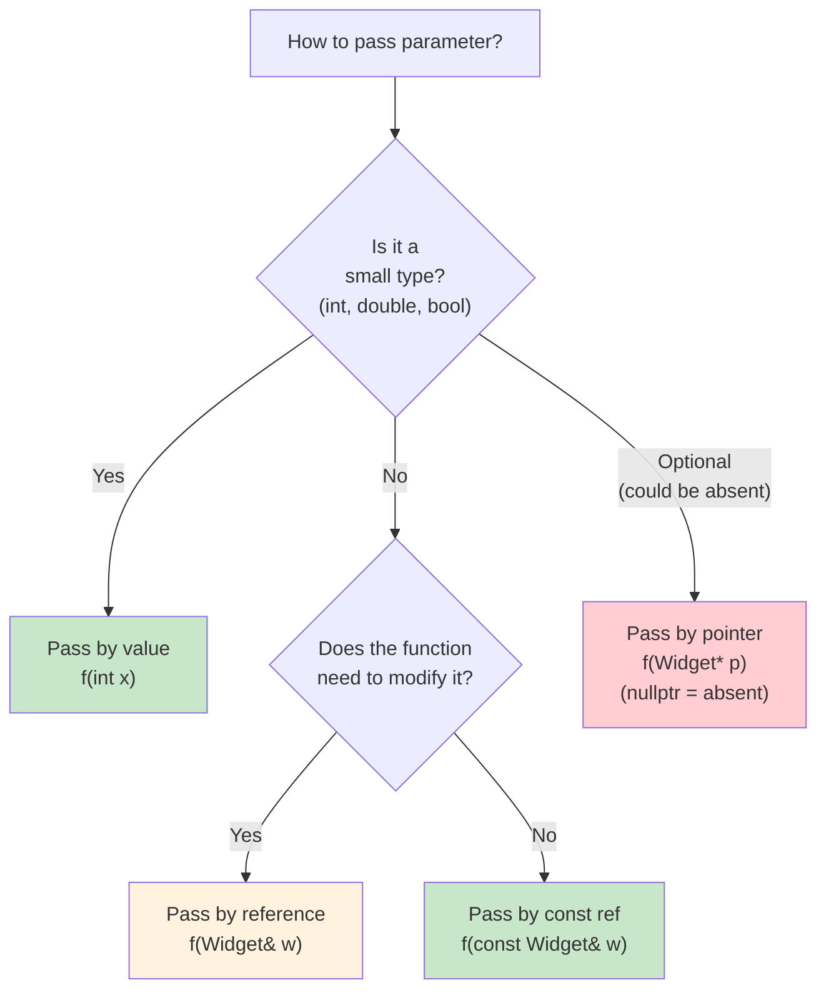

# Chapter 05 — Functions: The Building Blocks

> **Tags:** `#cpp` `#functions` `#overloading` `#constexpr` `#recursion`
> **Prerequisites:** Chapter 04 (Control Flow)
> **Estimated Time:** 2–3 hours

---

## 1. Theory

Functions are the primary unit of code organization in C++. They encapsulate reusable logic, enable abstraction, and form the building blocks of every program. Unlike many scripting languages, C++ distinguishes between **declaration** (telling the compiler a function exists) and **definition** (providing the implementation).

### Declaration vs Definition

A **declaration** (also called a **prototype**) tells the compiler the function's name, return type, and parameter types — without the body:
```cpp
int add(int a, int b);  // Declaration — no body
```

A **definition** provides the complete implementation:
```cpp
int add(int a, int b) { return a + b; }  // Definition
```

The compiler needs a declaration before a function is called. The linker needs exactly one definition across all translation units (the **One Definition Rule**).

### Parameter Passing Modes

How you pass arguments fundamentally affects correctness and performance:

| Mode | Syntax | Copies? | Can Modify? | Use When |
|------|--------|---------|-------------|----------|
| **By value** | `void f(int x)` | Yes | No (copy modified) | Small types (int, double, pointers) |
| **By reference** | `void f(int& x)` | No | Yes | Need to modify the original |
| **By const reference** | `void f(const std::string& s)` | No | No | Large types, read-only access |
| **By pointer** | `void f(int* p)` | No (pointer copied) | Yes | Optional params (nullptr = absent) |
| **By rvalue reference** | `void f(std::string&& s)` | No | Yes (move) | Move semantics (Ch09) |

**Rule of thumb:** Pass by value for small/cheap types (`int`, `double`, `bool`, pointers). Pass by `const&` for everything else. Pass by `&` only when mutation is the function's purpose.

### Function Overloading

C++ allows multiple functions with the same name but different parameter lists. The compiler selects the best match at compile time through **overload resolution**:

```cpp
void print(int x);
void print(double x);
void print(const std::string& s);
```

Overloading is resolved by the **number and types** of arguments — not the return type.

### inline Functions

The `inline` keyword suggests to the compiler that a function's body should be inserted at the call site, avoiding the overhead of a function call. In modern C++, `inline` primarily means "may have multiple identical definitions across translation units" (enabling definition in headers).

### constexpr Functions

A `constexpr` function can be evaluated at compile time when called with compile-time arguments:
```cpp
constexpr int square(int x) { return x * x; }
constexpr int s = square(5);  // Computed at compile time → s = 25
```
If called with runtime arguments, it executes normally at runtime. This is dual-mode behavior.

### [[nodiscard]] Attribute (C++17)

Marks a function whose return value should not be ignored:
```cpp
[[nodiscard]] bool save_file(const std::string& path);
// auto result = save_file("data.txt");  // OK
// save_file("data.txt");                // Warning: discarded nodiscard value
```

### Recursion

A function that calls itself. Every recursive call adds a stack frame, consuming stack memory. Deep recursion can cause stack overflow. C++ does not guarantee tail-call optimization (unlike some functional languages).

---

## 2. What / Why / How

### What?
Functions encapsulate logic into named, reusable units with defined inputs (parameters) and outputs (return values).

### Why?
- **Abstraction**: Hide complexity behind a simple interface
- **Reuse**: Write once, call many times
- **Testing**: Functions are the natural unit of testing
- **Compilation**: Functions in separate translation units enable parallel compilation

### How?
Declare in headers, define in source files. Choose the right parameter passing mode. Use overloading for related operations. Apply `constexpr` for compile-time computation and `[[nodiscard]]` for critical return values.

---

## 3. Code Examples

### Example 1 — Parameter Passing Modes

```cpp
#include <iostream>
#include <string>

// By value: receives a copy — original unchanged
void double_value(int x) {
    x *= 2;
    std::cout << "  Inside: x = " << x << '\n';
}

// By reference: modifies the original
void double_ref(int& x) {
    x *= 2;
}

// By const reference: read-only, no copy
void print_info(const std::string& name, int age) {
    std::cout << name << " is " << age << " years old\n";
}

// By pointer: allows nullptr (optional)
void maybe_increment(int* p) {
    if (p) ++(*p);
}

int main() {
    int val = 10;
    double_value(val);
    std::cout << "After double_value: " << val << '\n';  // Still 10

    double_ref(val);
    std::cout << "After double_ref: " << val << '\n';  // Now 20

    print_info("Alice", 30);  // No copy of "Alice" string

    int a = 5;
    maybe_increment(&a);
    std::cout << "After increment: " << a << '\n';  // 6
    maybe_increment(nullptr);  // Safe — does nothing

    return 0;
}
```

### Example 2 — Function Overloading

```cpp
#include <iostream>
#include <string>
#include <vector>
#include <cmath>

// Overloaded: same name, different parameter types
double area(double radius) {
    return M_PI * radius * radius;
}

double area(double width, double height) {
    return width * height;
}

double area(double a, double b, double c) {
    // Heron's formula for triangle
    double s = (a + b + c) / 2.0;
    return std::sqrt(s * (s - a) * (s - b) * (s - c));
}

// Overloaded with different number of params
void log(const std::string& msg) {
    std::cout << "[INFO] " << msg << '\n';
}

void log(const std::string& level, const std::string& msg) {
    std::cout << "[" << level << "] " << msg << '\n';
}

int main() {
    std::cout << "Circle area (r=5):     " << area(5.0) << '\n';
    std::cout << "Rectangle area (3x4):  " << area(3.0, 4.0) << '\n';
    std::cout << "Triangle area (3,4,5): " << area(3.0, 4.0, 5.0) << '\n';

    log("System started");
    log("ERROR", "Disk full");

    return 0;
}
```

### Example 3 — Default Arguments & constexpr

```cpp
#include <iostream>
#include <string>

// Default arguments: must be rightmost parameters
std::string format_greeting(
    const std::string& name,
    const std::string& title = "User",
    bool formal = false
) {
    if (formal) return "Dear " + title + " " + name + ",";
    return "Hello, " + name + "!";
}

// constexpr function: compile-time when possible
constexpr long long fibonacci(int n) {
    if (n <= 1) return n;
    long long a = 0, b = 1;
    for (int i = 2; i <= n; ++i) {
        long long temp = a + b;
        a = b;
        b = temp;
    }
    return b;
}

// constexpr + nodiscard
[[nodiscard]] constexpr int clamp(int value, int low, int high) {
    if (value < low) return low;
    if (value > high) return high;
    return value;
}

int main() {
    std::cout << format_greeting("Alice") << '\n';
    std::cout << format_greeting("Bob", "Dr.") << '\n';
    std::cout << format_greeting("Eve", "Prof.", true) << '\n';

    // Computed at compile time
    constexpr auto fib20 = fibonacci(20);
    static_assert(fib20 == 6765, "Fibonacci(20) should be 6765");
    std::cout << "fib(20) = " << fib20 << '\n';

    constexpr int clamped = clamp(150, 0, 100);
    static_assert(clamped == 100);
    std::cout << "clamp(150, 0, 100) = " << clamped << '\n';

    return 0;
}
```

### Example 4 — [[nodiscard]] and Return Value Patterns

```cpp
#include <iostream>
#include <optional>
#include <string>
#include <fstream>

// nodiscard: caller MUST handle the return value
[[nodiscard]] bool save_data(const std::string& filename, const std::string& data) {
    std::ofstream file(filename);
    if (!file.is_open()) return false;
    file << data;
    return file.good();
}

// Returning optional for "might fail" operations
[[nodiscard]] std::optional<int> parse_int(const std::string& s) {
    try {
        std::size_t pos{};
        int result = std::stoi(s, &pos);
        if (pos != s.size()) return std::nullopt;  // Partial parse
        return result;
    } catch (...) {
        return std::nullopt;
    }
}

// Multiple return values via struct
struct DivResult {
    int quotient;
    int remainder;
};

[[nodiscard]] DivResult divide(int a, int b) {
    return {a / b, a % b};
}

int main() {
    // nodiscard forces handling
    if (!save_data("test.txt", "Hello!")) {
        std::cerr << "Save failed!\n";
    }

    // Optional return
    if (auto val = parse_int("42")) {
        std::cout << "Parsed: " << *val << '\n';
    }
    if (!parse_int("abc")) {
        std::cout << "\"abc\" is not a number\n";
    }

    // Structured binding with return struct
    auto [q, r] = divide(17, 5);
    std::cout << "17 / 5 = " << q << " remainder " << r << '\n';

    return 0;
}
```

### Example 5 — Recursion with Memoization

```cpp
#include <iostream>
#include <unordered_map>
#include <functional>

// Naive recursion: O(2^n) — extremely slow for large n
int fib_naive(int n) {
    if (n <= 1) return n;
    return fib_naive(n - 1) + fib_naive(n - 2);
}

// Memoized recursion: O(n) with a cache
int fib_memo(int n, std::unordered_map<int, int>& cache) {
    if (n <= 1) return n;
    if (auto it = cache.find(n); it != cache.end()) {
        return it->second;
    }
    int result = fib_memo(n - 1, cache) + fib_memo(n - 2, cache);
    cache[n] = result;
    return result;
}

// Iterative (best for this problem)
constexpr long long fib_iterative(int n) {
    if (n <= 1) return n;
    long long a = 0, b = 1;
    for (int i = 2; i <= n; ++i) {
        long long temp = a + b;
        a = b;
        b = temp;
    }
    return b;
}

int main() {
    // Naive: don't try n > 40 unless you want to wait
    std::cout << "fib_naive(30) = " << fib_naive(30) << '\n';

    // Memoized: handles large n easily
    std::unordered_map<int, int> cache;
    std::cout << "fib_memo(45) = " << fib_memo(45, cache) << '\n';

    // Iterative: fastest, constexpr capable
    std::cout << "fib_iterative(45) = " << fib_iterative(45) << '\n';

    return 0;
}
```

---

## 4. Mermaid Diagrams

### Recursive Call Stack



### Function Call Stack Frame



### Parameter Passing Decision Tree



---

## 5. Practical Exercises

### 🟢 Exercise 1: Min/Max/Clamp
Write overloaded `clamp` functions for `int` and `double` that restrict a value to a range `[low, high]`. Use `constexpr` and `[[nodiscard]]`.

### 🟢 Exercise 2: String Utilities
Write three functions: `to_upper(std::string)`, `to_lower(std::string)`, and `trim(std::string)` that return modified copies. Pass by value (take ownership and modify).

### 🟡 Exercise 3: Power Function
Write a `constexpr` power function `power(base, exp)` for integer exponents using fast exponentiation (exponentiation by squaring). Verify with `static_assert`.

### 🟡 Exercise 4: Function Composition
Write a higher-order function `compose(f, g)` that returns a new function `h(x) = f(g(x))`. Use `std::function` or auto return.

### 🔴 Exercise 5: Tower of Hanoi
Implement the Tower of Hanoi recursively, printing each move. Count total moves and verify it equals `2^n - 1`.

---

## 6. Solutions

### Solution 1: Min/Max/Clamp

```cpp
#include <iostream>

[[nodiscard]] constexpr int clamp(int val, int lo, int hi) {
    return (val < lo) ? lo : (val > hi) ? hi : val;
}

[[nodiscard]] constexpr double clamp(double val, double lo, double hi) {
    return (val < lo) ? lo : (val > hi) ? hi : val;
}

int main() {
    static_assert(clamp(5, 0, 10) == 5);
    static_assert(clamp(-3, 0, 10) == 0);
    static_assert(clamp(15, 0, 10) == 10);

    std::cout << clamp(3.7, 0.0, 1.0) << '\n';  // 1.0
    std::cout << clamp(-0.5, 0.0, 1.0) << '\n';  // 0.0

    return 0;
}
```

### Solution 2: String Utilities

```cpp
#include <iostream>
#include <string>
#include <algorithm>
#include <cctype>

std::string to_upper(std::string s) {
    std::transform(s.begin(), s.end(), s.begin(),
        [](unsigned char c) { return std::toupper(c); });
    return s;
}

std::string to_lower(std::string s) {
    std::transform(s.begin(), s.end(), s.begin(),
        [](unsigned char c) { return std::tolower(c); });
    return s;
}

std::string trim(std::string s) {
    auto start = std::find_if_not(s.begin(), s.end(),
        [](unsigned char c) { return std::isspace(c); });
    auto end = std::find_if_not(s.rbegin(), s.rend(),
        [](unsigned char c) { return std::isspace(c); }).base();
    return (start < end) ? std::string(start, end) : std::string{};
}

int main() {
    std::cout << to_upper("hello world") << '\n';     // HELLO WORLD
    std::cout << to_lower("HELLO WORLD") << '\n';     // hello world
    std::cout << "[" << trim("  hello  ") << "]\n";   // [hello]
    return 0;
}
```

### Solution 3: Fast Power

```cpp
#include <iostream>

constexpr long long power(long long base, int exp) {
    if (exp < 0) return 0;  // Integer power can't handle negative exponents
    long long result = 1;
    while (exp > 0) {
        if (exp & 1) result *= base;
        base *= base;
        exp >>= 1;
    }
    return result;
}

int main() {
    static_assert(power(2, 10) == 1024);
    static_assert(power(3, 5) == 243);
    static_assert(power(5, 0) == 1);

    std::cout << "2^20 = " << power(2, 20) << '\n';
    std::cout << "10^9 = " << power(10, 9) << '\n';
    return 0;
}
```

### Solution 4: Function Composition

```cpp
#include <iostream>
#include <functional>
#include <cmath>

template<typename F, typename G>
auto compose(F f, G g) {
    return [f, g](auto x) { return f(g(x)); };
}

int main() {
    auto add_one = [](int x) { return x + 1; };
    auto double_it = [](int x) { return x * 2; };

    auto double_then_add = compose(add_one, double_it);
    std::cout << "double_then_add(5) = " << double_then_add(5) << '\n';  // 11

    auto add_then_double = compose(double_it, add_one);
    std::cout << "add_then_double(5) = " << add_then_double(5) << '\n';  // 12

    // Composing math functions
    auto sqrt_of_abs = compose(
        [](double x) { return std::sqrt(x); },
        [](double x) { return std::abs(x); }
    );
    std::cout << "sqrt(|-16|) = " << sqrt_of_abs(-16.0) << '\n';  // 4

    return 0;
}
```

### Solution 5: Tower of Hanoi

```cpp
#include <iostream>
#include <cmath>

int move_count = 0;

void hanoi(int n, char from, char to, char aux) {
    if (n == 0) return;
    hanoi(n - 1, from, aux, to);
    std::cout << "Move disk " << n << ": " << from << " → " << to << '\n';
    ++move_count;
    hanoi(n - 1, aux, to, from);
}

int main() {
    int disks = 4;
    hanoi(disks, 'A', 'C', 'B');

    int expected = static_cast<int>(std::pow(2, disks)) - 1;
    std::cout << "\nTotal moves: " << move_count
              << " (expected: " << expected << ")\n";
    return 0;
}
```

---

## 7. Quiz

**Q1.** What is the difference between a declaration and a definition?
- A) They are the same thing
- B) A declaration provides the body; a definition provides the signature
- C) A declaration provides the signature; a definition provides the body ✅
- D) Declarations are only needed in headers

**Q2.** How should you pass a `std::vector<int>` that won't be modified?
- A) `void f(std::vector<int> v)` — by value
- B) `void f(const std::vector<int>& v)` — by const reference ✅
- C) `void f(std::vector<int>& v)` — by reference
- D) `void f(std::vector<int>* v)` — by pointer

**Q3.** Can overloaded functions differ only in return type?
- A) Yes
- B) No — they must differ in parameter types or count ✅
- C) Only for template functions
- D) Only for virtual functions

**Q4.** (Short Answer) What does `constexpr` mean on a function?

> **Answer:** A `constexpr` function can be evaluated at compile time when called with constant expressions. If called with runtime values, it executes normally at runtime. This enables the same function to serve both compile-time computation (template arguments, array sizes, `static_assert`) and runtime use, avoiding code duplication.

**Q5.** What does `[[nodiscard]]` do?
- A) Prevents the function from being called
- B) Generates a warning if the return value is discarded ✅
- C) Makes the return value const
- D) Forces inlining

**Q6.** (Short Answer) Why is recursion potentially dangerous in C++?

> **Answer:** Each recursive call pushes a new stack frame, consuming limited stack memory (typically 1-8 MB). Deep recursion can cause stack overflow. C++ does not guarantee tail-call optimization, so even tail-recursive functions may overflow. For deep recursion, consider iterative alternatives or explicit stack data structures.

**Q7.** What happens if you call a `constexpr` function with a runtime value?
- A) Compiler error
- B) It runs at runtime like a normal function ✅
- C) Undefined behavior
- D) The result is always 0

**Q8.** Why pass by value for small types like `int`?
- A) It's required by the standard
- B) Copying an int is faster than dereferencing a pointer/reference ✅
- C) References don't work with int
- D) int is always passed by value regardless of syntax

---

## 8. Key Takeaways

- **Declare in headers, define in source files** — this is the C++ compilation model
- Pass by **value** for small types, **const&** for large types, **&** for mutation
- **Function overloading** resolves at compile time based on argument types and count
- **`constexpr`** functions work at both compile time and runtime — use for constants
- **`[[nodiscard]]`** prevents accidentally ignoring critical return values
- **Default arguments** simplify common call patterns but must be rightmost
- Recursion is elegant but limited by stack size — prefer iteration for deep recursion
- Use `std::optional` for functions that might not produce a result

---

## 9. Chapter Summary

This chapter established functions as the fundamental building blocks of C++ programs. We covered the critical distinction between declarations and definitions, explored all parameter passing modes with clear guidelines on when to use each, and demonstrated function overloading for cleaner APIs. Modern C++ features — `constexpr` for compile-time evaluation, `[[nodiscard]]` for enforcing return value handling, and `std::optional` for safe failure reporting — were presented as essential tools. Recursion was examined with both naive and optimized implementations, and the stack frame model was illustrated to explain its memory implications.

---

## 10. Real-World Insight

**Trading Systems:** Functions in HFT are designed for minimal overhead. `constexpr` pricing functions compute option Greeks at compile time for known scenarios. Inline functions avoid call overhead in hot paths. `[[nodiscard]]` prevents ignoring error codes from order submission.

**Game Engines:** Function overloading is used extensively in math libraries — `lerp(float, float, float)`, `lerp(Vec3, Vec3, float)`, `lerp(Quaternion, Quaternion, float)`. Template functions often replace overloads for maximum generality.

**ML Frameworks:** PyTorch's C++ frontend (`libtorch`) uses `const&` everywhere for tensor arguments (tensors are expensive to copy). `[[nodiscard]]` marks functions that return new tensors rather than modifying in-place, preventing memory leaks.

**CUDA:** `__device__` functions must be carefully designed since GPU stack space is extremely limited (often 1 KB per thread). Recursive device functions are strongly discouraged — iteration is mandatory.

---

## 11. Common Mistakes

### Mistake 1: Returning Reference to Local Variable
```cpp
// BAD — returns reference to destroyed local!
int& get_value() {
    int x = 42;
    return x;  // x is destroyed when function returns — dangling reference!
}
// FIX: Return by value
int get_value() {
    int x = 42;
    return x;  // Copy elision makes this efficient
}
```

### Mistake 2: Default Arguments in Definition (not Declaration)
```cpp
// BAD — default in definition, not declaration
// header: void greet(std::string name);
// source: void greet(std::string name = "World") { ... }  // Error!

// FIX: Default goes in the declaration (header)
// header: void greet(std::string name = "World");
// source: void greet(std::string name) { ... }
```

### Mistake 3: Ambiguous Overloads
```cpp
void print(int x) { std::cout << "int: " << x << '\n'; }
void print(double x) { std::cout << "double: " << x << '\n'; }
// print(3.14f);  // Ambiguous! float converts equally to int and double
// FIX: Add a float overload, or cast explicitly
void print(float x) { print(static_cast<double>(x)); }
```

### Mistake 4: Forgetting [[nodiscard]] on Fallible Functions
```cpp
// BAD — caller can silently ignore failure
bool connect_to_server(const std::string& host);
connect_to_server("example.com");  // No warning — error silently ignored!

// FIX:
[[nodiscard]] bool connect_to_server(const std::string& host);
// Now: connect_to_server("example.com");  // Compiler warning!
```

---

## 12. Interview Questions

### Q1: What is the difference between pass by reference and pass by pointer?

**Model Answer:** Both avoid copying, but they differ in semantics and safety. **References** must be bound to a valid object (no null references), cannot be reassigned, and have cleaner syntax (`x.member`). **Pointers** can be null (useful for optional parameters), can be reassigned, and use arrow syntax (`p->member`). Modern C++ prefers references for non-optional parameters and uses `std::optional<T&>` or `std::reference_wrapper` for optional references. Pointers are still used in polymorphic scenarios and when interfacing with C APIs.

### Q2: Explain function overload resolution.

**Model Answer:** When a function call matches multiple overloads, the compiler selects the "best viable function" through a ranked system: (1) exact match, (2) promotion (e.g., `float` → `double`), (3) standard conversion (e.g., `int` → `double`), (4) user-defined conversion. If two overloads are equally good, the call is ambiguous and fails to compile. Overload resolution only considers parameter types and count — not return types. Template functions participate too, with non-template preferred over template when both match equally.

### Q3: When should you use `constexpr` vs `const` for functions?

**Model Answer:** `constexpr` functions can be evaluated at compile time — use when the result feeds into template arguments, array sizes, `static_assert`, or other compile-time contexts. `const` member functions promise not to modify the object — a different concept entirely. A function can be both `constexpr` and return a `const` value. Use `constexpr` aggressively — even if not always called at compile time, it documents that the function is pure (no side effects).

### Q4: What is NRVO and why does it matter for return-by-value?

**Model Answer:** **Named Return Value Optimization (NRVO)** allows the compiler to construct the return value directly in the caller's memory, eliminating the copy. For example, `std::vector<int> make_vector()` can return a local vector without copying it. Since C++17, copy elision is mandatory for temporary objects (RVO). NRVO is not guaranteed but is performed by all major compilers. This means returning large objects by value is efficient — no need for output parameters or dynamic allocation.

### Q5: How does `std::optional` improve function error handling compared to sentinel values?

**Model Answer:** `std::optional<T>` explicitly represents "value or nothing" in the type system. Unlike sentinel values (returning -1 for "not found", nullptr for "no result"), `std::optional` is self-documenting: the return type itself tells you the function might not produce a result. It prevents bugs where callers forget to check for the sentinel value. It also works for any type T, even types without a natural sentinel. The `has_value()` / `operator*` pattern makes checking and access explicit.
