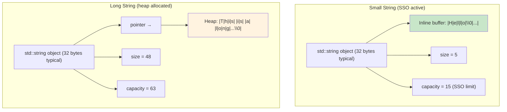
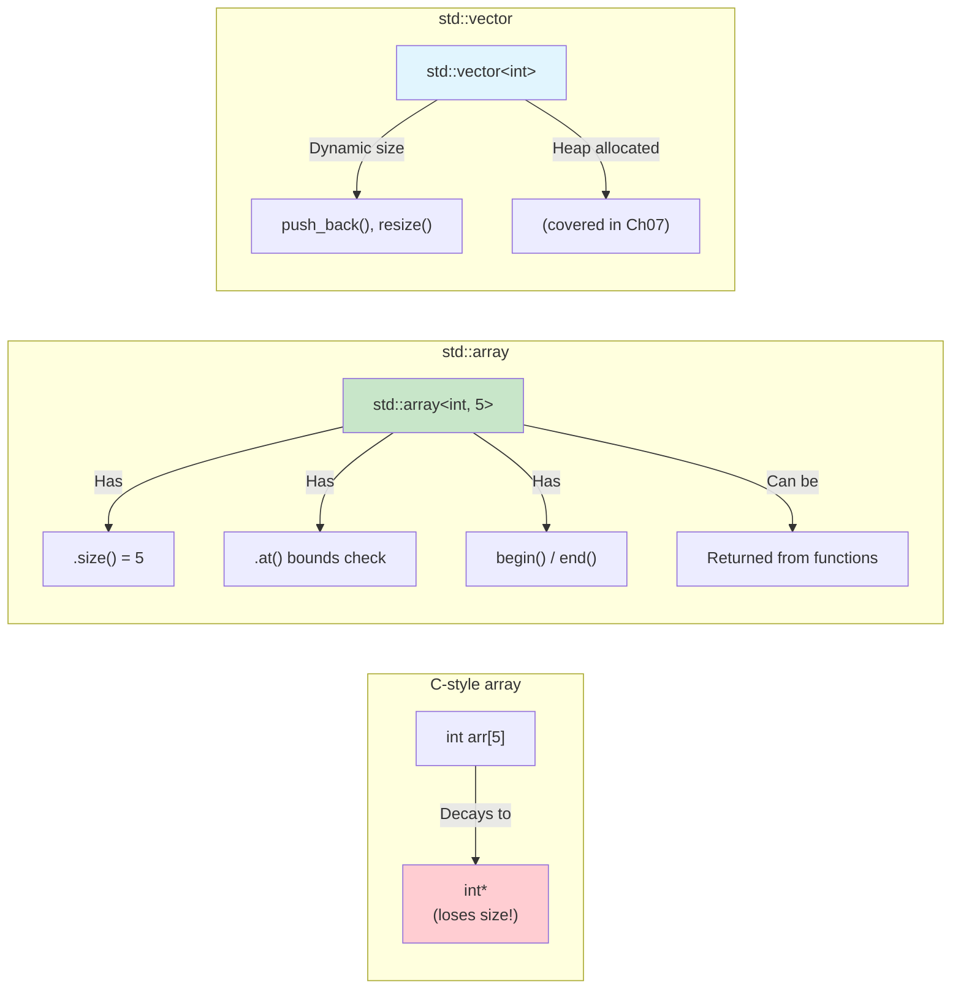
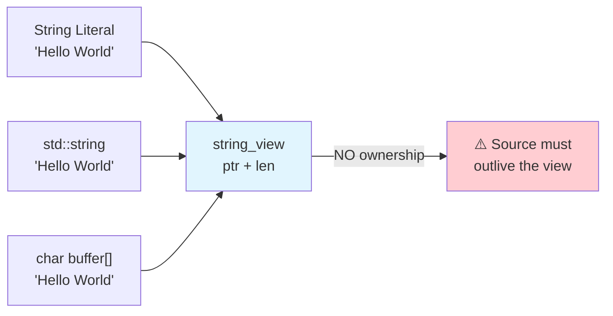

# Chapter 06 — Arrays, Strings & C-Style Legacy

> **Tags:** `#cpp` `#arrays` `#strings` `#string_view` `#SSO` `#legacy`
> **Prerequisites:** Chapter 05 (Functions)
> **Estimated Time:** 2–3 hours

---

## 1. Theory

Arrays and strings are among the most used data structures in any language. C++ carries a dual heritage: raw C-style arrays and strings (`char[]`, `char*`) alongside modern standard library types (`std::array`, `std::string`, `std::string_view`). Understanding both layers is essential — legacy C code is everywhere, and modern C++ provides safer, more efficient alternatives.

### C-Style Arrays

A C-style array is a contiguous block of elements:
```cpp
int arr[5] = {1, 2, 3, 4, 5};
```

**Critical limitations:**
- **No bounds checking** — `arr[10]` compiles but is undefined behavior
- **Decays to pointer** — passing `arr` to a function passes `int*`, losing the size
- **Cannot be copied or assigned** — `arr2 = arr1;` doesn't work
- **Size must be compile-time constant** (VLAs are not standard C++)
- **No `.size()` method** — must track size separately

Array decay is one of C++'s most dangerous inherited features:
```cpp
void process(int arr[]) {   // Looks like array, actually int* !
    sizeof(arr);             // Returns sizeof(pointer), NOT array size
}
```

### std::array (C++11)

`std::array<T, N>` is a zero-overhead wrapper around a C array:
- Fixed size, known at compile time
- No heap allocation
- Provides `.size()`, `.at()` (bounds-checked), iterators
- Can be copied, compared, and returned from functions
- Same performance as C arrays

### C-Style Strings

C strings are null-terminated character arrays:
```cpp
const char* greeting = "Hello";  // 6 bytes: H-e-l-l-o-\0
```

**Limitations:**
- Must manually manage memory for dynamic strings
- Buffer overflows from `strcpy`, `strcat` are notorious security vulnerabilities
- Length computation is O(n) — must scan for `\0`
- No embedded nulls allowed

### std::string

`std::string` (actually `std::basic_string<char>`) provides:
- Dynamic sizing — grows as needed
- Automatic memory management (RAII)
- Rich API: `find`, `substr`, `replace`, concatenation with `+`
- Guaranteed O(1) `size()`
- Safe — no buffer overflows

**Small String Optimization (SSO):** Most implementations store strings up to ~15-22 characters directly inside the `std::string` object (no heap allocation). This means short strings are extremely fast — no `new`/`delete` involved.

### std::string_view (C++17)

`std::string_view` is a **non-owning, read-only** reference to a character sequence:
```cpp
void process(std::string_view sv);  // No copy, works with string, const char*, etc.
```

**Key properties:**
- Zero-copy — just a pointer + length
- Works with `std::string`, `const char*`, string literals — no conversion needed
- Does NOT own the data — the underlying string must outlive the view
- Cannot modify the characters
- Replaces `const std::string&` in many function signatures

### Why C++ Moved Beyond C-Strings

| Issue | C-String | std::string |
|-------|----------|-------------|
| Memory management | Manual (`malloc`/`free`) | Automatic (RAII) |
| Buffer overflow | Common (CVE goldmine) | Impossible (checked) |
| Length query | O(n) scan | O(1) `.size()` |
| Embedded nulls | Not supported | Supported |
| Copy | Manual `strcpy` | Assignment operator |
| Concatenation | Manual buffer sizing | `+` operator |

---

## 2. What / Why / How

### What?
Arrays store fixed sequences of same-type elements. Strings store text. Modern C++ provides `std::array`, `std::string`, and `std::string_view` as safe, efficient alternatives to their C ancestors.

### Why?
C-style arrays and strings are responsible for the majority of security vulnerabilities in C/C++ code (buffer overflows, use-after-free, dangling pointers). Modern alternatives eliminate entire categories of bugs while maintaining the same performance.

### How?
Use `std::array` for fixed-size collections, `std::string` for owned text, and `std::string_view` for read-only string parameters. Resort to C-style only when interfacing with legacy C APIs.

---

## 3. Code Examples

### Example 1 — C-Style Arrays and Their Pitfalls

This example highlights the main danger of C-style arrays: when passed to a function, they "decay" into a pointer and lose their size information. The `sizeof` trick only works in the same scope where the array is declared. A template trick can preserve the size at compile time, but the modern solution is to use `std::array` instead.

```cpp
#include <iostream>
#include <cstddef>

// Array decays to pointer — size information is LOST
void print_array_bad(int arr[], std::size_t size) {
    // sizeof(arr) here returns sizeof(int*), NOT the array size!
    for (std::size_t i = 0; i < size; ++i) {
        std::cout << arr[i] << ' ';
    }
    std::cout << '\n';
}

// Template trick to preserve array size (compile-time only)
template<std::size_t N>
void print_array_safe(const int (&arr)[N]) {
    for (std::size_t i = 0; i < N; ++i) {
        std::cout << arr[i] << ' ';
    }
    std::cout << '\n';
}

int main() {
    int scores[] = {95, 87, 42, 73, 88};
    constexpr std::size_t count = sizeof(scores) / sizeof(scores[0]);

    std::cout << "Array size (in main): " << count << '\n';  // 5

    print_array_bad(scores, count);  // Works but fragile
    print_array_safe(scores);        // Size deduced automatically

    // Danger: no bounds checking!
    // scores[10] = 999;  // Compiles! UB at runtime.

    return 0;
}
```

### Example 2 — std::array: The Modern Fixed-Size Container

`std::array` is the modern replacement for C-style arrays. It knows its own size, provides bounds-checked access via `.at()`, works with all standard algorithms like `std::sort` and `std::accumulate`, and can even be used at compile time with `constexpr`. Unlike C arrays, it can be returned from functions.

```cpp
#include <iostream>
#include <array>
#include <algorithm>
#include <numeric>

int main() {
    // Brace-initialized, type and size are part of the type
    std::array<int, 5> scores{95, 87, 42, 73, 88};

    // Size is always available
    std::cout << "Size: " << scores.size() << '\n';

    // Bounds-checked access with .at()
    try {
        std::cout << "scores.at(10): " << scores.at(10) << '\n';
    } catch (const std::out_of_range& e) {
        std::cerr << "Error: " << e.what() << '\n';
    }

    // Works with all standard algorithms
    std::sort(scores.begin(), scores.end());
    std::cout << "Sorted: ";
    for (int s : scores) std::cout << s << ' ';
    std::cout << '\n';

    // Sum with std::accumulate
    int total = std::accumulate(scores.begin(), scores.end(), 0);
    std::cout << "Sum: " << total << '\n';
    std::cout << "Average: " << static_cast<double>(total) / scores.size() << '\n';

    // Can be returned from functions (unlike C arrays)
    auto make_range = []() -> std::array<int, 5> {
        return {1, 2, 3, 4, 5};
    };
    auto range = make_range();
    std::cout << "Range: ";
    for (int v : range) std::cout << v << ' ';
    std::cout << '\n';

    // Compile-time array operations (C++17 constexpr)
    constexpr std::array<int, 4> powers{1, 2, 4, 8};
    static_assert(powers[3] == 8);

    // Structured bindings (small arrays)
    auto [a, b, c, d] = powers;
    std::cout << "First four powers of 2: " << a << ' ' << b << ' ' << c << ' ' << d << '\n';

    return 0;
}
```

### Example 3 — std::string Operations

This example tours the most common `std::string` operations: construction, concatenation with `+` and `+=`, searching with `find()`, replacing substrings, converting to/from numbers with `std::stoi` and `std::to_string`, and splitting text with `std::istringstream`. These are the building blocks for most text processing tasks in C++.

```cpp
#include <iostream>
#include <string>
#include <algorithm>
#include <sstream>
#include <vector>

int main() {
    // Construction
    std::string greeting = "Hello, World!";
    std::string repeated(5, '*');           // "*****"
    std::string sub = greeting.substr(7, 5); // "World"

    std::cout << greeting << '\n';
    std::cout << "Repeated: " << repeated << '\n';
    std::cout << "Substring: " << sub << '\n';

    // Searching
    auto pos = greeting.find("World");
    if (pos != std::string::npos) {
        std::cout << "'World' found at position " << pos << '\n';
    }

    // Replacement
    std::string msg = greeting;
    msg.replace(pos, 5, "C++");
    std::cout << "Replaced: " << msg << '\n';  // "Hello, C++!"

    // Concatenation (multiple ways)
    std::string full = greeting + " " + "How are you?";
    full += " Fine!";
    std::cout << "Concat: " << full << '\n';

    // Iteration
    std::string lower = greeting;
    std::transform(lower.begin(), lower.end(), lower.begin(),
        [](unsigned char c) { return std::tolower(c); });
    std::cout << "Lower: " << lower << '\n';

    // Splitting a string (no built-in split, use stringstream)
    std::string csv = "apple,banana,cherry,date";
    std::vector<std::string> tokens;
    std::istringstream stream(csv);
    std::string token;
    while (std::getline(stream, token, ',')) {
        tokens.push_back(token);
    }
    std::cout << "Tokens: ";
    for (const auto& t : tokens) std::cout << "[" << t << "] ";
    std::cout << '\n';

    // Numeric conversions
    int num = std::stoi("42");
    double pi = std::stod("3.14159");
    std::string num_str = std::to_string(num);
    std::cout << "Parsed: " << num << ", " << pi << '\n';
    std::cout << "to_string: " << num_str << '\n';

    return 0;
}
```

### Example 4 — Small String Optimization (SSO) Demonstration

Most `std::string` implementations store short strings directly inside the object (on the stack) instead of allocating heap memory — this is called Small String Optimization (SSO). This example detects whether SSO is active by checking if the string's data pointer falls within the object's own memory range, showing the performance benefit for short strings.

```cpp
#include <iostream>
#include <string>

void check_sso(const std::string& label, const std::string& s) {
    const void* data_ptr = static_cast<const void*>(s.data());
    const void* obj_ptr = static_cast<const void*>(&s);

    // If data pointer is within the object's memory, SSO is active
    auto obj_addr = reinterpret_cast<std::uintptr_t>(obj_ptr);
    auto data_addr = reinterpret_cast<std::uintptr_t>(data_ptr);
    bool is_sso = (data_addr >= obj_addr) && (data_addr < obj_addr + sizeof(s));

    std::cout << label << " (size=" << s.size()
              << ", capacity=" << s.capacity()
              << ", SSO=" << (is_sso ? "YES" : "NO") << ")\n";
}

int main() {
    std::cout << "sizeof(std::string) = " << sizeof(std::string) << " bytes\n\n";

    std::string tiny = "Hi";
    std::string small = "Hello World!!!";    // Typically fits in SSO
    std::string medium = "This is a medium-length string that exceeds SSO";
    std::string large(200, 'x');

    check_sso("tiny  ", tiny);
    check_sso("small ", small);
    check_sso("medium", medium);
    check_sso("large ", large);

    return 0;
}
```

### Example 5 — std::string_view: Zero-Copy String References

`std::string_view` is a lightweight, non-owning reference to a string that avoids copying. It works with string literals, `std::string`, and `char*` equally well. This example shows zero-allocation key-value parsing and word counting using `string_view`, demonstrating why it's preferred for read-only string parameters. Caution: the underlying string must outlive the view.

```cpp
#include <iostream>
#include <string>
#include <string_view>
#include <vector>
#include <charconv>

// Accepts ANY string-like thing without copying
void print_header(std::string_view title) {
    std::cout << "=== " << title << " ===" << '\n';
}

// Parse a key=value pair without any heap allocation
std::pair<std::string_view, std::string_view>
parse_kv(std::string_view input) {
    auto eq_pos = input.find('=');
    if (eq_pos == std::string_view::npos) {
        return {input, {}};
    }
    return {input.substr(0, eq_pos), input.substr(eq_pos + 1)};
}

// Count words without allocating
std::size_t count_words(std::string_view text) {
    std::size_t count = 0;
    bool in_word = false;
    for (char c : text) {
        if (std::isspace(static_cast<unsigned char>(c))) {
            in_word = false;
        } else if (!in_word) {
            in_word = true;
            ++count;
        }
    }
    return count;
}

int main() {
    // Works with string literals (no std::string created)
    print_header("String View Demo");

    // Works with std::string
    std::string title = "Another Title";
    print_header(title);

    // Works with substrings — no allocation!
    const char* data = "name=Alice age=30 role=admin";
    print_header(std::string_view(data, 10));

    // Key-value parsing
    auto [key, value] = parse_kv("language=C++");
    std::cout << "Key: " << key << ", Value: " << value << '\n';

    // Word counting — zero allocation
    std::string_view text = "The quick brown fox jumps over the lazy dog";
    std::cout << "Word count: " << count_words(text) << '\n';

    // DANGER: string_view does NOT own the data!
    // std::string_view dangling;
    // {
    //     std::string temp = "temporary";
    //     dangling = temp;  // OK here
    // }
    // std::cout << dangling;  // UB! temp is destroyed!

    return 0;
}
```

### Example 6 — Migrating from C-Style to Modern C++

This side-by-side comparison shows the same tasks done in legacy C style (raw `char` buffers, `strcpy`, `strcat`, C arrays with `qsort`) and then in modern C++ (`std::string`, `std::array`, standard algorithms). The modern approach is safer, shorter, and eliminates buffer overflow risks entirely.

```cpp
#include <iostream>
#include <string>
#include <string_view>
#include <array>
#include <cstring>   // For legacy C functions
#include <algorithm>

// ============ LEGACY C STYLE ============
void legacy_example() {
    // C-style string manipulation (DON'T do this in new code)
    char buffer[64];
    std::strcpy(buffer, "Hello");
    std::strcat(buffer, ", ");
    std::strcat(buffer, "World!");
    std::cout << "C-style: " << buffer << " (len=" << std::strlen(buffer) << ")\n";

    // C-style array
    int c_arr[5] = {5, 3, 1, 4, 2};
    // Must use C qsort or manually implement sort
}

// ============ MODERN C++ STYLE ============
void modern_example() {
    // std::string — safe, automatic
    std::string greeting = "Hello";
    greeting += ", ";
    greeting += "World!";
    std::cout << "Modern: " << greeting << " (len=" << greeting.size() << ")\n";

    // std::array — safe, sortable, knows its size
    std::array<int, 5> arr{5, 3, 1, 4, 2};
    std::sort(arr.begin(), arr.end());
    std::cout << "Sorted: ";
    for (int v : arr) std::cout << v << ' ';
    std::cout << '\n';
}

// ============ INTERFACING WITH C APIs ============
// Sometimes you MUST use C-style strings (POSIX, legacy libs)
void c_api_interop() {
    std::string modern = "Hello from C++";

    // std::string → const char* (for C APIs that read)
    const char* c_str = modern.c_str();  // Null-terminated
    std::cout << "C API read: " << c_str << '\n';

    // const char* → std::string (when receiving from C API)
    const char* from_c = "From legacy API";
    std::string cpp_str(from_c);  // Copies the data

    // For mutable C APIs: use std::vector<char> as a buffer
    std::vector<char> buf(256, '\0');
    // c_api_that_writes(buf.data(), buf.size());
    std::string result(buf.data());
}

int main() {
    legacy_example();
    modern_example();
    c_api_interop();
    return 0;
}
```

---

## 4. Mermaid Diagrams

### std::string Memory Layout (SSO vs Heap)



### Array Type Comparison



### string_view Relationship



---

## 5. Practical Exercises

### 🟢 Exercise 1: Array Statistics
Using `std::array<double, 10>`, write functions to compute the mean, min, max, and standard deviation. Use standard algorithms where possible.

### 🟢 Exercise 2: String Reversal
Write three versions of a string reversal function: one using `std::string`, one using `std::string_view` (returning a new string), and one in-place.

### 🟡 Exercise 3: CSV Parser
Write a function `parse_csv(std::string_view line)` that splits a CSV line into a `std::vector<std::string_view>` without any heap allocation for the tokens themselves.

### 🟡 Exercise 4: Palindrome Checker
Write a `constexpr` function that checks if a `std::string_view` is a palindrome (ignoring case and non-alphanumeric characters).

### 🔴 Exercise 5: Simple String Class
Implement a basic `MyString` class with: constructor from `const char*`, copy constructor, destructor (manage heap memory manually), `size()`, `c_str()`, and `operator+` for concatenation. This teaches what `std::string` does internally.

---

## 6. Solutions

### Solution 1: Array Statistics

This solution uses `std::array` with template functions to compute mean and standard deviation. `std::accumulate` sums the elements, and a lambda accumulator computes the sum of squared deviations. The template parameter `N` lets the same functions work with arrays of any size.

```cpp
#include <iostream>
#include <array>
#include <algorithm>
#include <numeric>
#include <cmath>

template<std::size_t N>
double mean(const std::array<double, N>& arr) {
    return std::accumulate(arr.begin(), arr.end(), 0.0) / N;
}

template<std::size_t N>
double stddev(const std::array<double, N>& arr) {
    double m = mean(arr);
    double sq_sum = std::accumulate(arr.begin(), arr.end(), 0.0,
        [m](double acc, double val) { return acc + (val - m) * (val - m); });
    return std::sqrt(sq_sum / N);
}

int main() {
    std::array<double, 10> data{4.2, 7.8, 3.1, 9.5, 6.3, 2.7, 8.4, 5.6, 1.9, 7.0};

    std::cout << "Mean:   " << mean(data) << '\n';
    std::cout << "Min:    " << *std::min_element(data.begin(), data.end()) << '\n';
    std::cout << "Max:    " << *std::max_element(data.begin(), data.end()) << '\n';
    std::cout << "StdDev: " << stddev(data) << '\n';

    return 0;
}
```

### Solution 2: String Reversal

This solution shows three ways to reverse a string: returning a reversed copy using `std::reverse`, constructing a new string from reverse iterators of a `string_view`, and doing an in-place reversal by swapping characters from both ends toward the middle. Each approach suits a different use case depending on whether you need to preserve the original.

```cpp
#include <iostream>
#include <string>
#include <string_view>
#include <algorithm>

// Version 1: Returns reversed copy (std::string)
std::string reverse_copy(std::string s) {
    std::reverse(s.begin(), s.end());
    return s;
}

// Version 2: From string_view → new string
std::string reverse_view(std::string_view sv) {
    return std::string(sv.rbegin(), sv.rend());
}

// Version 3: In-place reversal
void reverse_inplace(std::string& s) {
    std::size_t n = s.size();
    for (std::size_t i = 0; i < n / 2; ++i) {
        std::swap(s[i], s[n - 1 - i]);
    }
}

int main() {
    std::cout << reverse_copy("Hello") << '\n';       // olleH
    std::cout << reverse_view("World") << '\n';       // dlroW

    std::string msg = "C++ Rocks";
    reverse_inplace(msg);
    std::cout << msg << '\n';  // skcoR ++C

    return 0;
}
```

### Solution 3: CSV Parser (Zero-Allocation Tokens)

This parser splits a CSV line into fields using `string_view::find()` and `substr()`, which return views into the original string without allocating any new memory. The resulting `vector<string_view>` holds lightweight references to the original data, making this approach very efficient for parsing large files.

```cpp
#include <iostream>
#include <string_view>
#include <vector>

std::vector<std::string_view> parse_csv(std::string_view line) {
    std::vector<std::string_view> tokens;
    std::size_t start = 0;

    while (start < line.size()) {
        auto comma = line.find(',', start);
        if (comma == std::string_view::npos) {
            tokens.push_back(line.substr(start));
            break;
        }
        tokens.push_back(line.substr(start, comma - start));
        start = comma + 1;
    }

    return tokens;
}

int main() {
    std::string_view csv = "Alice,30,Engineer,NYC";
    auto fields = parse_csv(csv);

    for (std::size_t i = 0; i < fields.size(); ++i) {
        std::cout << "Field " << i << ": [" << fields[i] << "]\n";
    }

    // All string_views point into the original csv — no allocation!
    return 0;
}
```

### Solution 4: Palindrome Checker

This `constexpr` palindrome checker uses two pointers that move inward from both ends of the string, skipping non-alphanumeric characters and comparing in a case-insensitive manner. Because it's `constexpr`, the compiler can evaluate it at compile time, as verified by the `static_assert` tests.

```cpp
#include <iostream>
#include <string_view>
#include <cctype>

constexpr bool is_alnum(char c) {
    return (c >= 'a' && c <= 'z') ||
           (c >= 'A' && c <= 'Z') ||
           (c >= '0' && c <= '9');
}

constexpr char to_lower(char c) {
    return (c >= 'A' && c <= 'Z') ? static_cast<char>(c + 32) : c;
}

constexpr bool is_palindrome(std::string_view s) {
    std::size_t left = 0;
    std::size_t right = s.size();

    while (left < right) {
        if (right == 0) break;
        // Skip non-alphanumeric from left
        while (left < right && !is_alnum(s[left])) ++left;
        // Skip non-alphanumeric from right
        while (right > left && !is_alnum(s[right - 1])) --right;

        if (left >= right) break;

        if (to_lower(s[left]) != to_lower(s[right - 1])) return false;
        ++left;
        --right;
    }
    return true;
}

int main() {
    static_assert(is_palindrome("racecar"));
    static_assert(is_palindrome("A man, a plan, a canal: Panama"));
    static_assert(!is_palindrome("hello"));

    std::cout << std::boolalpha;
    std::cout << "racecar: " << is_palindrome("racecar") << '\n';
    std::cout << "Panama:  " << is_palindrome("A man, a plan, a canal: Panama") << '\n';
    std::cout << "hello:   " << is_palindrome("hello") << '\n';

    return 0;
}
```

### Solution 5: Simple String Class

This solution builds a minimal string class from scratch using raw `char*` memory, implementing the Rule of Five: constructor, copy constructor, copy assignment (using the copy-and-swap idiom), move constructor, and move assignment. It demonstrates manual memory management to help you understand what `std::string` does under the hood.

```cpp
#include <iostream>
#include <cstring>
#include <utility>

class MyString {
    char* data_;
    std::size_t size_;

public:
    // Constructor from C-string
    MyString(const char* s = "")
        : size_(std::strlen(s))
        , data_(new char[size_ + 1])
    {
        std::memcpy(data_, s, size_ + 1);
    }

    // Copy constructor
    MyString(const MyString& other)
        : size_(other.size_)
        , data_(new char[size_ + 1])
    {
        std::memcpy(data_, other.data_, size_ + 1);
    }

    // Copy assignment (copy-and-swap idiom)
    MyString& operator=(MyString other) {
        std::swap(data_, other.data_);
        std::swap(size_, other.size_);
        return *this;
    }

    // Move constructor
    MyString(MyString&& other) noexcept
        : data_(other.data_), size_(other.size_)
    {
        other.data_ = nullptr;
        other.size_ = 0;
    }

    // Destructor
    ~MyString() {
        delete[] data_;
    }

    // Accessors
    [[nodiscard]] std::size_t size() const { return size_; }
    [[nodiscard]] const char* c_str() const { return data_ ? data_ : ""; }

    // Concatenation
    MyString operator+(const MyString& other) const {
        MyString result;
        delete[] result.data_;
        result.size_ = size_ + other.size_;
        result.data_ = new char[result.size_ + 1];
        std::memcpy(result.data_, data_, size_);
        std::memcpy(result.data_ + size_, other.data_, other.size_ + 1);
        return result;
    }

    // Stream output
    friend std::ostream& operator<<(std::ostream& os, const MyString& s) {
        return os << s.c_str();
    }
};

int main() {
    MyString a("Hello");
    MyString b(", World!");
    MyString c = a + b;

    std::cout << "a: " << a << " (size=" << a.size() << ")\n";
    std::cout << "b: " << b << " (size=" << b.size() << ")\n";
    std::cout << "c: " << c << " (size=" << c.size() << ")\n";

    MyString d = c;  // Copy
    std::cout << "d (copy): " << d << '\n';

    MyString e = std::move(d);  // Move
    std::cout << "e (moved): " << e << '\n';

    return 0;
}
```

---

## 7. Quiz

**Q1.** What happens when you pass a C-style array to a function expecting `int arr[]`?
- A) The full array is copied
- B) It decays to a pointer, losing size information ✅
- C) A compilation error occurs
- D) The array is passed by reference

**Q2.** What is Small String Optimization (SSO)?
- A) Compressing string data
- B) Storing short strings inside the string object itself, avoiding heap allocation ✅
- C) Using `char` instead of `wchar_t`
- D) A compiler optimization for string concatenation

**Q3.** What does `std::string_view` own?
- A) A copy of the string
- B) A heap-allocated buffer
- C) Nothing — it's a non-owning view ✅
- D) A reference-counted shared buffer

**Q4.** (Short Answer) Why is `std::array` preferred over C-style arrays?

> **Answer:** `std::array` knows its size (`.size()`), provides bounds-checked access (`.at()`), works with standard algorithms and range-based for loops, can be copied/compared/returned from functions, and does not decay to a pointer. It has zero overhead compared to C-style arrays — same memory layout, same performance.

**Q5.** What is the time complexity of `std::string::size()` vs `strlen()`?
- A) Both O(n)
- B) `size()` is O(1), `strlen()` is O(n) ✅
- C) Both O(1)
- D) `size()` is O(n), `strlen()` is O(1)

**Q6.** How do you safely convert `std::string` to `const char*` for a C API?
- A) `static_cast<const char*>(s)`
- B) `s.c_str()` ✅
- C) `&s[0]`
- D) `reinterpret_cast<const char*>(&s)`

**Q7.** (Short Answer) When is `std::string_view` dangerous?

> **Answer:** When the viewed data is destroyed before the `string_view`. For example, returning a `string_view` into a local `std::string` creates a dangling reference. Similarly, storing a `string_view` member in a class whose lifetime exceeds the original string's. Always ensure the source data outlives the view.

**Q8.** What does `.at()` do that `[]` doesn't on `std::array`?
- A) It's faster
- B) It performs bounds checking and throws `std::out_of_range` ✅
- C) It returns a reference
- D) It works with negative indices

---

## 8. Key Takeaways

- **C-style arrays decay to pointers**, losing size — use `std::array` instead
- **`std::array<T, N>`** is zero-overhead with full STL compatibility
- **`std::string`** manages memory automatically via RAII — no buffer overflows
- **SSO** means short strings (typically ≤ 15-22 chars) avoid heap allocation entirely
- **`std::string_view`** (C++17) provides zero-copy string references — use for function parameters
- **`string_view` does NOT own data** — the source must outlive the view
- Use `.c_str()` to interface with C APIs; use `std::vector<char>` for mutable C buffers
- Prefer modern types (`std::array`, `std::string`) — resort to C-style only for legacy interop

---

## 9. Chapter Summary

This chapter bridged C++'s dual heritage of C-style arrays and strings with their modern replacements. We examined C-style array decay — one of the language's most dangerous features — and showed how `std::array` eliminates it with zero overhead. For strings, we progressed from error-prone C-strings through `std::string` (with its Small String Optimization for performance) to `std::string_view` for zero-copy parameter passing. The migration patterns for interfacing modern C++ with legacy C APIs were demonstrated. Understanding both layers is essential: you'll encounter C-style code in legacy systems, kernel interfaces, and embedded environments, but new code should always use the modern alternatives.

---

## 10. Real-World Insight

**High-Frequency Trading:** `std::string_view` is heavily used in message parsing — market data feeds arrive as raw byte buffers, and `string_view` enables parsing without copying. SSO matters when constructing small symbol strings (e.g., "AAPL", "GOOG") millions of times per second.

**Game Engines:** Fixed-size arrays (`std::array`) map directly to GPU vertex data. A vertex might be `std::array<float, 3>` for position — same layout as GLSL `vec3`. The zero-overhead guarantee means no performance penalty vs C arrays.

**ML Frameworks:** Tensor shape descriptors are often `std::array<int64_t, N>` for fixed-rank tensors or `std::vector<int64_t>` for dynamic rank. `std::string_view` is used for operation names in computation graphs.

**Security:** Buffer overflow vulnerabilities in C-string handling (`strcpy`, `strcat`, `sprintf`) have caused billions of dollars in damage (Heartbleed, Morris worm, countless CVEs). `std::string` eliminates this entire category of bugs. CERT C++ coding standards mandate using `std::string` over C-strings.

---

## 11. Common Mistakes

### Mistake 1: Dangling string_view

Returning a `string_view` from a function where it references a local `std::string` is undefined behavior — the string is destroyed when the function returns, leaving the view pointing at freed memory. Always return `std::string` when the function creates the data.

```cpp
// BAD — string_view outlives the string
std::string_view get_name() {
    std::string name = "Alice";
    return name;  // name destroyed! view is dangling!
}
// FIX: Return std::string instead
std::string get_name() {
    return "Alice";  // Safe — returns owned string
}
```

### Mistake 2: Using sizeof on Decayed Array

When a C-style array is passed to a function, it decays to a pointer, so `sizeof(arr)` returns the size of a pointer (typically 8 bytes), not the array. This makes the `sizeof(arr)/sizeof(arr[0])` trick produce wrong results inside functions. Use `std::array`, pass the size explicitly, or use `std::span` (C++20).

```cpp
void process(int arr[]) {
    // BAD — sizeof(arr) is sizeof(int*), not the array!
    for (int i = 0; i < sizeof(arr) / sizeof(arr[0]); ++i) { /* ... */ }
}
// FIX: Use std::array or pass size explicitly, or use span (C++20)
void process(std::span<int> arr) {  // C++20
    for (int val : arr) { /* ... */ }
}
```

### Mistake 3: Concatenating string_views Inefficiently

Converting each `string_view` to a `std::string` just to concatenate them creates unnecessary temporary heap allocations. Instead, pre-allocate with `reserve()` and use `append()` to build the result in one buffer, avoiding the overhead of repeated allocations.

```cpp
// BAD — creates temporary strings
std::string result = std::string(sv1) + std::string(sv2) + std::string(sv3);

// FIX: Reserve and append
std::string result;
result.reserve(sv1.size() + sv2.size() + sv3.size());
result.append(sv1);
result.append(sv2);
result.append(sv3);
```

### Mistake 4: Off-by-One with Null Terminator

C-strings require a null terminator (`\0`) at the end, so the string `"Hello"` actually needs 6 bytes of storage. Allocating only 5 bytes causes `strcpy` to write past the buffer — a classic buffer overflow bug. The safest fix is to use `std::string`, which manages the terminator automatically.

```cpp
// BAD — buffer too small for null terminator
char buf[5];
std::strcpy(buf, "Hello");  // Writes 6 bytes into 5-byte buffer! UB!

// FIX: Account for \0
char buf[6];  // 5 chars + null terminator
std::strcpy(buf, "Hello");
// Or better: use std::string
```

### Mistake 5: Comparing Strings with ==  on C-Strings

Using `==` on two `const char*` pointers compares their memory addresses, not their content. Two identical string literals might or might not share the same address depending on the compiler. Use `std::strcmp` for C-strings, or better yet, use `std::string` where `==` compares content correctly.

```cpp
const char* a = "hello";
const char* b = "hello";
if (a == b) { /* Compares POINTERS, not content! May or may not be true */ }
// FIX: Use strcmp or std::string
if (std::strcmp(a, b) == 0) { /* correct */ }
// Or: std::string sa = a; if (sa == b) { /* correct */ }
```

---

## 12. Interview Questions

### Q1: What is array decay and why is it dangerous?

**Model Answer:** Array decay is the implicit conversion of a C-style array to a pointer to its first element when passed to a function or assigned to a pointer. This loses the array's size information — `sizeof` returns the pointer size, not the array size. It's dangerous because functions receiving decayed arrays cannot perform bounds checking and must rely on a separate size parameter (which can be wrong). Modern alternatives: use `std::array`, `std::span` (C++20), or template functions that deduce the size.

### Q2: Explain Small String Optimization (SSO).

**Model Answer:** SSO is an implementation technique where `std::string` stores short strings directly inside the string object (typically in the space that would otherwise hold a pointer, size, and capacity — about 15-22 bytes depending on the implementation). This avoids heap allocation for small strings, which is a major performance win since most strings in practice are short. The string object detects at runtime whether SSO is active and dispatches accordingly. SSO is why `sizeof(std::string)` is typically 32 bytes even for an empty string.

### Q3: When should you use `std::string_view` vs `const std::string&`?

**Model Answer:** Prefer `std::string_view` for function parameters that only read the string data. It's more flexible — it accepts `std::string`, `const char*`, string literals, and substrings without any conversion or allocation. Use `const std::string&` when you need to call string-specific methods that `string_view` doesn't provide, or when you need to store a reference to an owned string. Never use `string_view` for stored/member variables unless you can guarantee the source outlives the view.

### Q4: How would you safely interface C++ string types with a C API?

**Model Answer:** **Reading from C API:** Receive `const char*` and construct `std::string` from it (`std::string s(c_str)`). **Writing to C API:** Use `str.c_str()` for null-terminated read-only access. For mutable buffers, use `std::vector<char>` with pre-allocated size, pass `.data()` and `.size()` to the C function, then construct `std::string` from the result. Never pass `std::string::data()` to C functions that expect to write to the buffer (in pre-C++17, `data()` returned const).

### Q5: Compare `std::array`, `std::vector`, and C-style arrays for different use cases.

**Model Answer:** **C-style arrays**: Avoid in new code; only for C interop or constrained environments. **`std::array<T, N>`**: Fixed size known at compile time, stack-allocated, zero-overhead, ideal for small fixed collections (coordinates, colors, matrix rows). **`std::vector<T>`**: Dynamic size, heap-allocated, can grow/shrink, ideal for collections of unknown or variable size. The choice depends on whether the size is known at compile time: `std::array` for fixed, `std::vector` for dynamic. Both provide bounds checking via `.at()` and work with STL algorithms.
