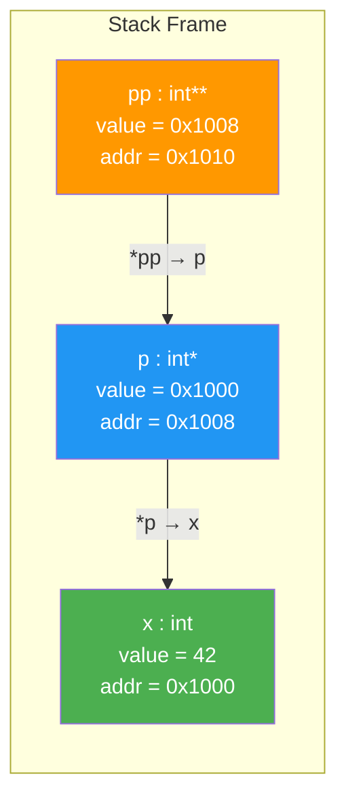
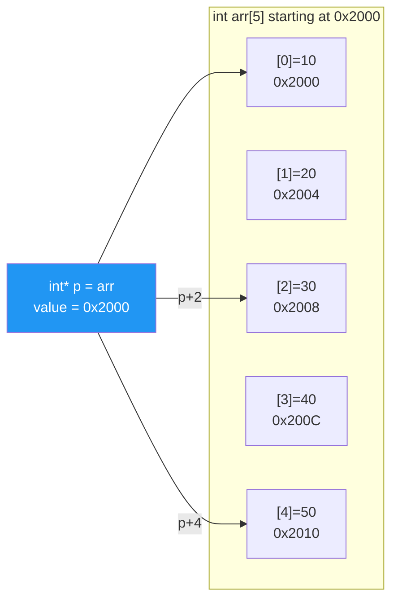

# Chapter 7: Pointers Deep Dive

> **Tags:** `pointers` `memory` `pointer-arithmetic` `function-pointers` `callbacks`
> **Prerequisites:** Chapter 3 (Variables & Types), Chapter 5 (Functions)
> **Estimated Time:** 3–4 hours

---

## Theory

A **pointer** is a variable that stores the memory address of another object. Pointers are the
foundation of C and C++ — they enable dynamic memory, polymorphism, hardware access, and
efficient data structures. Understanding pointers deeply is non-negotiable for any serious C++
developer.

Every object in a running program occupies one or more bytes of memory, and each byte has a
unique numerical address. A pointer simply holds one of these addresses. The **type** of the
pointer tells the compiler how to interpret the bytes at that address and how far to jump
during pointer arithmetic.

**Key concepts:**
- The **address-of** operator `&` yields a pointer to an existing object.
- The **dereference** operator `*` follows the pointer to the object it points to.
- Pointers can be **null** (pointing nowhere), **dangling** (pointing to freed memory), or
  **wild** (uninitialized) — all three are bugs waiting to happen.

Pointer arithmetic is defined only within arrays (or one-past-the-end). Adding `n` to a
pointer of type `T*` advances the address by `n * sizeof(T)` bytes.

---

## What / Why / How

### What
A pointer is a typed variable whose value is a memory address. In a 64-bit system a pointer
is typically 8 bytes regardless of what it points to.

### Why
- **Indirection** — access and modify objects through their address.
- **Dynamic allocation** — create objects whose lifetime is not tied to a scope.
- **Polymorphism** — base-class pointers enable virtual dispatch.
- **C interop** — every C API traffics in raw pointers.
- **Hardware** — memory-mapped I/O requires writing to specific addresses.

### How
```cpp
int x = 42;
int* p = &x;   // p holds the address of x
*p = 100;      // x is now 100
```

---

## Code Examples

### Example 1 — Basic Pointer Operations

```cpp
// basic_pointers.cpp
#include <iostream>

int main() {
    int value = 10;
    int* ptr = &value;

    std::cout << "value   = " << value << '\n';
    std::cout << "&value  = " << &value << '\n';
    std::cout << "ptr     = " << ptr << '\n';
    std::cout << "*ptr    = " << *ptr << '\n';

    *ptr = 20;
    std::cout << "After *ptr = 20, value = " << value << '\n';

    return 0;
}
// Compile: g++ -std=c++17 -Wall -o basic_pointers basic_pointers.cpp
```

### Example 2 — Pointer Arithmetic and Arrays

```cpp
// pointer_arithmetic.cpp
#include <iostream>
#include <cstddef>

int main() {
    int arr[] = {10, 20, 30, 40, 50};
    int* p = arr;  // array decays to pointer to first element

    for (std::size_t i = 0; i < 5; ++i) {
        std::cout << "arr[" << i << "] address: " << (p + i)
                  << "  value: " << *(p + i) << '\n';
    }

    // Pointer difference
    int* first = &arr[0];
    int* last  = &arr[4];
    std::ptrdiff_t diff = last - first;
    std::cout << "Elements between first and last: " << diff << '\n';

    return 0;
}
```

### Example 3 — nullptr vs NULL

```cpp
// nullptr_demo.cpp
#include <iostream>

void process(int n)    { std::cout << "process(int): " << n << '\n'; }
void process(int* ptr) { std::cout << "process(int*): " << ptr << '\n'; }

int main() {
    // process(NULL);       // AMBIGUOUS — NULL is often 0 (an int literal)
    process(nullptr);       // Always calls process(int*)
    process(42);            // Calls process(int)

    int* p = nullptr;
    if (p == nullptr) {
        std::cout << "p is null — safe check\n";
    }

    return 0;
}
```

### Example 4 — Const Pointers vs Pointers to Const

```cpp
// const_pointers.cpp
#include <iostream>

int main() {
    int a = 10, b = 20;

    // Pointer to const — cannot modify the pointed-to value
    const int* pc = &a;
    // *pc = 99;  // ERROR
    pc = &b;      // OK — pointer itself can change

    // Const pointer — cannot change where the pointer points
    int* const cp = &a;
    *cp = 99;     // OK — value can change
    // cp = &b;   // ERROR

    // Const pointer to const — nothing changes
    const int* const cpc = &a;
    // *cpc = 1;  // ERROR
    // cpc = &b;  // ERROR

    std::cout << "a = " << a << ", b = " << b << '\n';
    return 0;
}
```

### Example 5 — Function Pointers and Callbacks

```cpp
// function_pointers.cpp
#include <iostream>
#include <vector>
#include <algorithm>

using Comparator = bool(*)(int, int);

bool ascending(int a, int b)  { return a < b; }
bool descending(int a, int b) { return a > b; }

void sort_and_print(std::vector<int>& v, Comparator cmp) {
    std::sort(v.begin(), v.end(), cmp);
    for (int x : v) std::cout << x << ' ';
    std::cout << '\n';
}

int main() {
    std::vector<int> data = {5, 2, 8, 1, 9};

    std::cout << "Ascending:  ";
    sort_and_print(data, ascending);

    std::cout << "Descending: ";
    sort_and_print(data, descending);

    // Using a function pointer variable
    Comparator chosen = descending;
    std::cout << "Chosen:     ";
    sort_and_print(data, chosen);

    return 0;
}
```

### Example 6 — Void Pointers

```cpp
// void_pointer.cpp
#include <iostream>
#include <cstring>

void print_bytes(const void* data, std::size_t len) {
    const unsigned char* bytes = static_cast<const unsigned char*>(data);
    for (std::size_t i = 0; i < len; ++i) {
        std::printf("%02x ", bytes[i]);
    }
    std::cout << '\n';
}

int main() {
    int x = 0x01020304;
    double d = 3.14;
    char s[] = "Hi";

    std::cout << "int bytes:    "; print_bytes(&x, sizeof(x));
    std::cout << "double bytes: "; print_bytes(&d, sizeof(d));
    std::cout << "char[] bytes: "; print_bytes(s, std::strlen(s));

    return 0;
}
```

---

## Mermaid Diagrams

### Memory Layout — Pointer Indirection



### Array Pointer Decay



---

## Practical Exercises

### 🟢 Exercise 1 — Swap via Pointers
Write a function `void swap(int* a, int* b)` that swaps two integers using raw pointers.
Test it from `main()`.

### 🟢 Exercise 2 — Array Reversal
Write `void reverse(int* arr, int size)` that reverses an array in place using pointer
arithmetic only (no indexing with `[]`).

### 🟡 Exercise 3 — String Length with Pointer Walk
Implement `std::size_t my_strlen(const char* s)` by walking the pointer until `'\0'`.

### 🟡 Exercise 4 — Dispatch Table
Create an array of function pointers for `add`, `sub`, `mul`, `div` and let the user choose
an operation by index.

### 🔴 Exercise 5 — Matrix with Double Pointers
Dynamically allocate a 2D matrix using `int**`, fill it with values, print it, then free it
without leaks.

---

## Solutions

### Solution 1

```cpp
#include <iostream>

void swap(int* a, int* b) {
    int temp = *a;
    *a = *b;
    *b = temp;
}

int main() {
    int x = 10, y = 20;
    std::cout << "Before: x=" << x << " y=" << y << '\n';
    swap(&x, &y);
    std::cout << "After:  x=" << x << " y=" << y << '\n';
}
```

### Solution 2

```cpp
#include <iostream>

void reverse(int* arr, int size) {
    int* left = arr;
    int* right = arr + size - 1;
    while (left < right) {
        int temp = *left;
        *left = *right;
        *right = temp;
        ++left;
        --right;
    }
}

int main() {
    int arr[] = {1, 2, 3, 4, 5};
    reverse(arr, 5);
    for (int i = 0; i < 5; ++i) std::cout << arr[i] << ' ';
    std::cout << '\n';
}
```

### Solution 3

```cpp
#include <iostream>
#include <cstddef>

std::size_t my_strlen(const char* s) {
    const char* p = s;
    while (*p != '\0') ++p;
    return static_cast<std::size_t>(p - s);
}

int main() {
    const char* msg = "Hello, pointers!";
    std::cout << "Length: " << my_strlen(msg) << '\n';  // 16
}
```

### Solution 4

```cpp
#include <iostream>

double add(double a, double b) { return a + b; }
double sub(double a, double b) { return a - b; }
double mul(double a, double b) { return a * b; }
double divide(double a, double b) { return b != 0 ? a / b : 0; }

int main() {
    using Op = double(*)(double, double);
    Op dispatch[] = {add, sub, mul, divide};
    const char* names[] = {"add", "sub", "mul", "div"};

    double a = 10.0, b = 3.0;
    for (int i = 0; i < 4; ++i) {
        std::cout << names[i] << "(" << a << ", " << b
                  << ") = " << dispatch[i](a, b) << '\n';
    }
}
```

### Solution 5

```cpp
#include <iostream>

int main() {
    int rows = 3, cols = 4;

    // Allocate
    int** matrix = new int*[rows];
    for (int r = 0; r < rows; ++r)
        matrix[r] = new int[cols];

    // Fill
    int val = 1;
    for (int r = 0; r < rows; ++r)
        for (int c = 0; c < cols; ++c)
            matrix[r][c] = val++;

    // Print
    for (int r = 0; r < rows; ++r) {
        for (int c = 0; c < cols; ++c)
            std::cout << matrix[r][c] << '\t';
        std::cout << '\n';
    }

    // Free — reverse order of allocation
    for (int r = 0; r < rows; ++r)
        delete[] matrix[r];
    delete[] matrix;
}
```

---

## Quiz

**Q1.** What is the size of a pointer on a 64-bit system?
a) 4 bytes  b) 8 bytes  c) Depends on the pointed-to type  d) 16 bytes

**Q2.** What does `*(arr + 3)` equal if `arr` is `int arr[] = {10, 20, 30, 40, 50}`?
a) 10  b) 30  c) 40  d) Undefined

**Q3.** Why should you prefer `nullptr` over `NULL`?
a) `nullptr` is faster  b) `nullptr` has type `std::nullptr_t`, avoiding overload ambiguity
c) `NULL` is deprecated  d) No difference

**Q4.** `const int* p` means:
a) The pointer is const  b) The value pointed to is const  c) Both are const  d) Neither

**Q5.** What is the output of `int a = 5; int* p = &a; p++;`?
a) `p` points to `a + 1`  b) `p` points past `a` (undefined to dereference)
c) Compile error  d) `a` becomes 6

**Q6.** A void pointer (`void*`) can be:
a) Dereferenced directly  b) Used in arithmetic  c) Cast to any typed pointer
d) None of the above

**Answers:** Q1-b, Q2-c, Q3-b, Q4-b, Q5-b, Q6-c

---

## Key Takeaways

- A pointer stores an **address**; its type governs how that address is interpreted.
- `nullptr` is type-safe; always use it instead of `NULL` or `0`.
- **Pointer arithmetic** moves in units of `sizeof(T)`, not bytes.
- `const int*` ≠ `int* const` — know the difference cold.
- Function pointers enable **callbacks**, dispatch tables, and C-API integration.
- `void*` is the "type-erased" pointer — useful for generic interfaces, but loses type safety.
- Uninitialized, dangling, and null-dereference pointers are the **top 3 pointer bugs**.

---

## Chapter Summary

Pointers are the lowest-level indirection mechanism in C++. They store memory addresses and
enable dynamic allocation, polymorphism, hardware access, and C interop. Pointer arithmetic
is powerful but constrained to array bounds. Modern C++ prefers references, smart pointers,
and `std::span` for safety, but raw pointers remain essential when interfacing with C
libraries, writing allocators, or working close to the hardware. Mastering `const`
correctness with pointers and understanding `nullptr` are prerequisites for every chapter
that follows.

---

## Real-World Insight

In production C++ at Google, Meta, and game studios, raw pointers appear in:
- **Custom allocators** — pool allocators hand out raw `void*` chunks.
- **C interop** — OpenSSL, POSIX, Win32 APIs all use `T*` parameters.
- **GPU programming** — CUDA's `cudaMalloc` returns `void*` device pointers.
- **Embedded systems** — memory-mapped hardware registers are accessed via `volatile T*`.

The rule of thumb: raw pointers **observe** but do not **own**. If a pointer owns a resource,
wrap it in a smart pointer (Chapter 14).

---

## Common Mistakes

| # | Mistake | Fix |
|---|---------|-----|
| 1 | **Dereferencing nullptr** — crashes at runtime | Always check `if (ptr != nullptr)` or use references |
| 2 | **Dangling pointer** — using after `delete` | Set to `nullptr` after delete; prefer smart pointers |
| 3 | **Off-by-one in arithmetic** — accessing `arr + size` | Valid to form but never to dereference |
| 4 | **Mixing `delete` and `delete[]`** — undefined behavior | Match `new T` with `delete`, `new T[]` with `delete[]` |
| 5 | **Using `NULL` in overloaded functions** — calls wrong overload | Always use `nullptr` |

---

## Interview Questions

### Q1: What is the difference between `const int*`, `int* const`, and `const int* const`?

**Model Answer:**
- `const int* p` — pointer to const int. You cannot modify `*p`, but you can reassign `p`.
- `int* const p` — const pointer to int. You cannot reassign `p`, but you can modify `*p`.
- `const int* const p` — const pointer to const int. Neither the pointer nor the pointee can
  change. Read declarations right-to-left: "p is a const pointer to a const int."

### Q2: Why is `nullptr` preferred over `NULL`?

**Model Answer:**
`NULL` is typically defined as `0` or `(void*)0` in C. In C++, `0` is an `int`, so passing
`NULL` to an overloaded function can call the `int` overload instead of the pointer overload.
`nullptr` has type `std::nullptr_t` and is implicitly convertible to any pointer type but not
to integral types, eliminating the ambiguity.

### Q3: Explain pointer arithmetic. What happens when you add 1 to an `int*`?

**Model Answer:**
Adding 1 to an `int*` advances the address by `sizeof(int)` bytes (typically 4). The
compiler scales the integer operand by the size of the pointed-to type. This is why
`*(arr + i)` is equivalent to `arr[i]`. Arithmetic is only defined within an array or
one past its end — going further is undefined behavior.

### Q4: When would you use a `void*` in modern C++?

**Model Answer:**
`void*` is used for type-erased interfaces, particularly when interoperating with C APIs
(e.g., `malloc` returns `void*`, `pthread_create` takes `void*` arguments). In modern C++,
`std::any`, templates, and `std::variant` are preferred for type erasure, but `void*` remains
necessary at the C boundary and in custom allocators.

### Q5: What is a function pointer and when would you use one?

**Model Answer:**
A function pointer holds the address of a function. It's used for **callbacks** (e.g.,
`qsort` in C), dispatch tables, plugin systems, and signal handlers. In modern C++,
`std::function` and lambdas are more flexible, but function pointers have zero overhead and
are required for C API callbacks.
