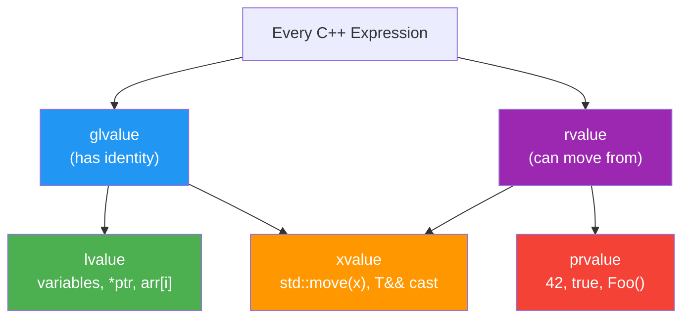
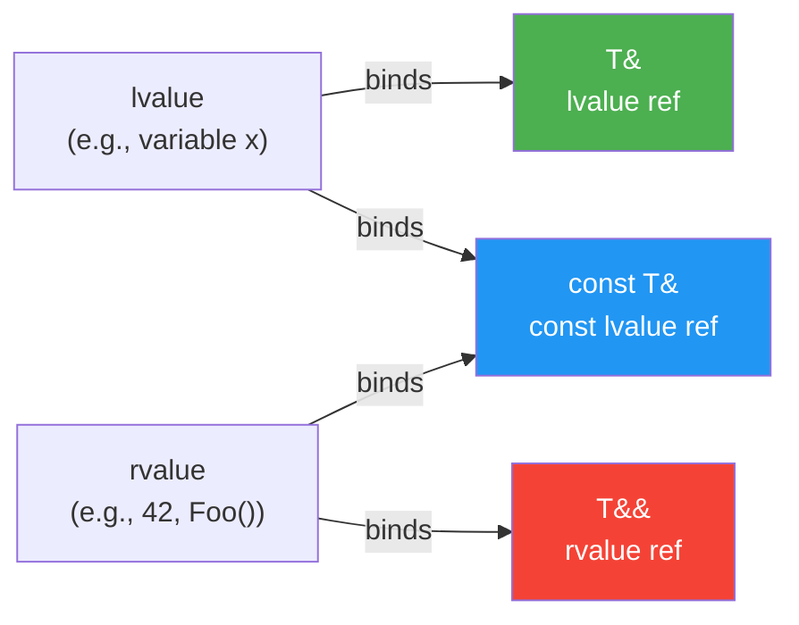

# Chapter 8: References & Value Categories

> **Tags:** `references` `lvalue` `rvalue` `const-ref` `value-categories`
> **Prerequisites:** Chapter 7 (Pointers Deep Dive)
> **Estimated Time:** 2–3 hours

---

## Theory

A **reference** is an alias for an existing object — a second name bound to the same memory
location. Unlike pointers, references cannot be null, cannot be reseated (changed to refer to
a different object), and do not require explicit dereferencing.

C++ has a rich system of **value categories** that classify every expression:

| Category | Can take address? | Can move from? | Examples |
|----------|:-:|:-:|---|
| **lvalue** | ✅ | ❌ | Variables, `*ptr`, `arr[i]`, string literals |
| **prvalue** | ❌ | ✅ | Literals `42`, `true`, temporaries `Foo()` |
| **xvalue** | ❌ | ✅ | `std::move(x)`, cast to `T&&` |

**lvalue references** (`T&`) bind to lvalues. **const lvalue references** (`const T&`) bind
to anything — lvalues, prvalues, and xvalues — which is why they are the universal "read-only
parameter" type.

**rvalue references** (`T&&`) bind only to rvalues (prvalues and xvalues) and are the
foundation of move semantics (covered in depth in Chapter 15).

---

## What / Why / How

### What
A reference is a compile-time alias. After initialization, every use of the reference is
indistinguishable from using the original object.

### Why
- **Safety** — references cannot be null, eliminating an entire class of pointer bugs.
- **Clean syntax** — no `*` or `->` needed; code reads like operating on the original.
- **Efficiency** — pass large objects by `const T&` instead of copying.
- **Operator overloading** — requires references for natural syntax (`a + b`).
- **Move semantics** — rvalue references enable zero-copy transfers (C++11).

### How
```cpp
int x = 42;
int& ref = x;    // ref is an alias for x
ref = 100;       // x is now 100

const int& cref = 42;  // OK — const ref extends temporary lifetime
```

---

## Code Examples

### Example 1 — Lvalue References

```cpp
// lvalue_references.cpp
#include <iostream>
#include <string>

void greet(const std::string& name) {  // no copy
    std::cout << "Hello, " << name << "!\n";
}

void increment(int& value) {  // modifies caller's variable
    ++value;
}

int main() {
    std::string user = "Alice";
    greet(user);         // lvalue bound to const&
    greet("Bob");        // temporary string bound to const&

    int count = 0;
    increment(count);
    increment(count);
    std::cout << "count = " << count << '\n';  // 2

    return 0;
}
// Compile: g++ -std=c++17 -Wall -o lvalue_refs lvalue_references.cpp
```

### Example 2 — Demonstrating Value Categories

```cpp
// value_categories.cpp
#include <iostream>
#include <string>

void classify(int& x)        { std::cout << "lvalue\n"; }
void classify(const int& x)  { std::cout << "const lvalue or prvalue\n"; }
void classify(int&& x)       { std::cout << "rvalue\n"; }

int get_value() { return 42; }

int main() {
    int a = 10;

    classify(a);              // lvalue
    classify(get_value());    // rvalue (prvalue)
    classify(std::move(a));   // rvalue (xvalue)

    const int b = 20;
    classify(b);              // const lvalue

    return 0;
}
```

### Example 3 — Dangling Reference Pitfalls

```cpp
// dangling_reference.cpp — DO NOT USE THIS PATTERN
#include <iostream>
#include <string>

// BAD — returns reference to local variable
// const std::string& bad_func() {
//     std::string local = "I will be destroyed";
//     return local;  // DANGLING — local dies at }
// }

// GOOD — return by value (copy/move elision makes this free)
std::string good_func() {
    std::string local = "Safe and sound";
    return local;  // NRVO — no copy in practice
}

// GOOD — return reference to parameter or member
const std::string& pick_longer(const std::string& a, const std::string& b) {
    return a.size() >= b.size() ? a : b;
}

int main() {
    std::string result = good_func();
    std::cout << result << '\n';

    std::string x = "short";
    std::string y = "much longer string";
    std::cout << "Longer: " << pick_longer(x, y) << '\n';

    return 0;
}
```

### Example 4 — Reference vs Pointer Comparison

```cpp
// ref_vs_ptr.cpp
#include <iostream>

struct Point { double x, y; };

// Pointer version — caller uses &, function uses ->
void translate_ptr(Point* p, double dx, double dy) {
    if (!p) return;  // must check null
    p->x += dx;
    p->y += dy;
}

// Reference version — cleaner, no null check needed
void translate_ref(Point& p, double dx, double dy) {
    p.x += dx;
    p.y += dy;
}

int main() {
    Point a{1.0, 2.0};
    translate_ptr(&a, 10, 20);
    std::cout << "Ptr: (" << a.x << ", " << a.y << ")\n";

    Point b{1.0, 2.0};
    translate_ref(b, 10, 20);
    std::cout << "Ref: (" << b.x << ", " << b.y << ")\n";

    return 0;
}
```

### Example 5 — Const Reference Lifetime Extension

```cpp
// lifetime_extension.cpp
#include <iostream>
#include <string>

std::string make_greeting(const std::string& name) {
    return "Hello, " + name + "!";
}

int main() {
    // const ref extends the lifetime of the temporary
    const std::string& greeting = make_greeting("World");
    std::cout << greeting << '\n';  // safe — temporary lives until greeting goes out of scope

    // rvalue reference also extends lifetime
    std::string&& temp = make_greeting("C++");
    std::cout << temp << '\n';  // also safe

    return 0;
}
```

### Example 6 — Preview of Move Semantics

```cpp
// move_preview.cpp
#include <iostream>
#include <string>
#include <utility>

void process(std::string&& data) {
    std::cout << "Moved in: " << data << '\n';
    // data is now an lvalue inside this function despite being T&&
}

int main() {
    std::string msg = "Transfer me";

    // process(msg);           // ERROR — msg is an lvalue
    process(std::move(msg));   // OK — cast to xvalue
    std::cout << "After move, msg = \"" << msg << "\"\n";  // valid but unspecified

    process(std::string("Temporary"));  // OK — prvalue binds to &&

    return 0;
}
```

---

## Mermaid Diagrams

### Value Category Taxonomy



### Reference Binding Rules



---

## Reference vs Pointer — Comparison Table

| Feature | Reference (`T&`) | Pointer (`T*`) |
|---------|:-:|:-:|
| Can be null | ❌ | ✅ |
| Can be reseated | ❌ | ✅ |
| Requires initialization | ✅ | ❌ |
| Syntax overhead | None | `*`, `->`, `&` |
| Arithmetic | ❌ | ✅ |
| Size in memory | Usually same as pointer | Pointer-sized |
| Use for optional param | ❌ (use `T*` or `std::optional`) | ✅ |
| Use for output param | ✅ (prefer return values) | ✅ |

---

## Practical Exercises

### 🟢 Exercise 1 — Swap with References
Write `void swap(int& a, int& b)` and compare with the pointer version from Chapter 7.

### 🟢 Exercise 2 — Max of Three
Write `const int& max3(const int& a, const int& b, const int& c)` that returns a reference
to the largest value without copying.

### 🟡 Exercise 3 — Classify Expressions
For each expression, state whether it's an lvalue, prvalue, or xvalue:
1. `x` (a local int variable)
2. `42`
3. `x + 1`
4. `std::move(x)`
5. `*ptr`
6. `"Hello"` (a string literal)

### 🟡 Exercise 4 — Safe Chaining
Design a `Matrix` struct with a method `Matrix& scale(double factor)` that multiplies all
elements and returns `*this` to allow chaining: `m.scale(2).scale(3)`.

### 🔴 Exercise 5 — Lifetime Trap
Identify and fix the dangling reference in this code:
```cpp
const std::string& get_name() {
    std::string name = "Alice";
    return name;
}
```

---

## Solutions

### Solution 1

```cpp
#include <iostream>

void swap(int& a, int& b) {
    int temp = a;
    a = b;
    b = temp;
}

int main() {
    int x = 10, y = 20;
    swap(x, y);  // no & at call site — cleaner
    std::cout << "x=" << x << " y=" << y << '\n';
}
```

### Solution 2

```cpp
#include <iostream>

const int& max3(const int& a, const int& b, const int& c) {
    const int& m = (a > b) ? a : b;
    return (m > c) ? m : c;
}

int main() {
    int a = 5, b = 9, c = 3;
    std::cout << "Max: " << max3(a, b, c) << '\n';  // 9
}
```

### Solution 3

1. `x` → **lvalue** (named variable, has address)
2. `42` → **prvalue** (literal, no identity)
3. `x + 1` → **prvalue** (result of arithmetic is a temporary)
4. `std::move(x)` → **xvalue** (has identity but is "expiring")
5. `*ptr` → **lvalue** (dereferencing yields an addressable location)
6. `"Hello"` → **lvalue** (string literals have static storage duration)

### Solution 4

```cpp
#include <iostream>
#include <vector>

struct Matrix {
    int rows, cols;
    std::vector<double> data;

    Matrix(int r, int c, double init = 0.0) : rows(r), cols(c), data(r * c, init) {}

    Matrix& scale(double factor) {
        for (auto& val : data) val *= factor;
        return *this;  // enables chaining
    }

    void print() const {
        for (int r = 0; r < rows; ++r) {
            for (int c = 0; c < cols; ++c)
                std::cout << data[r * cols + c] << '\t';
            std::cout << '\n';
        }
    }
};

int main() {
    Matrix m(2, 3, 1.0);
    m.scale(2.0).scale(3.0);  // chaining — all elements are now 6.0
    m.print();
}
```

### Solution 5

```cpp
// FIXED: return by value instead of by reference
#include <iostream>
#include <string>

std::string get_name() {  // return by VALUE
    std::string name = "Alice";
    return name;  // NRVO eliminates the copy
}

int main() {
    std::string name = get_name();
    std::cout << name << '\n';
}
```

---

## Quiz

**Q1.** Which can be null?
a) `int&`  b) `int*`  c) Both  d) Neither

**Q2.** `const int& r = 42;` is:
a) Illegal  b) Legal — const ref extends temporary lifetime
c) Legal but undefined  d) Legal only in C++20

**Q3.** `std::move(x)` produces:
a) An lvalue  b) A prvalue  c) An xvalue  d) Undefined behavior

**Q4.** What value category is the expression `foo()` where `foo` returns `int`?
a) lvalue  b) prvalue  c) xvalue  d) Depends

**Q5.** Which can be reseated to refer to a different object?
a) Reference  b) Pointer  c) Both  d) Neither

**Q6.** A string literal `"hello"` is:
a) A prvalue  b) An lvalue  c) An xvalue  d) Not an expression

**Q7.** `void f(T&&)` where T is not a template parameter accepts:
a) Only lvalues  b) Only rvalues  c) Both  d) Neither

**Answers:** Q1-b, Q2-b, Q3-c, Q4-b, Q5-b, Q6-b, Q7-b

---

## Key Takeaways

- A reference is an **alias**, not a separate object — it cannot be null or reseated.
- `const T&` binds to everything — it's the **universal read-only parameter**.
- Every expression has a value category: **lvalue**, **prvalue**, or **xvalue**.
- Never return a reference to a **local** variable — instant dangling reference.
- Prefer references over pointers for non-optional, non-owning parameters.
- `std::move` does not move — it **casts** an lvalue to an xvalue to enable moving.
- Lifetime extension works only for `const T&` and `T&&` binding a prvalue directly.

---

## Chapter Summary

References provide a safer, cleaner alternative to pointers for most indirection needs.
They cannot be null or reseated, which eliminates two major sources of pointer bugs.
Understanding value categories — lvalue, prvalue, xvalue — is essential for grasping move
semantics, perfect forwarding, and overload resolution in modern C++. The `const T&` idiom
is ubiquitous for efficient read-only access, while rvalue references (`T&&`) open the door
to move semantics covered in upcoming chapters.

---

## Real-World Insight

In production codebases, references are used far more frequently than raw pointers:
- **Google's C++ Style Guide** recommends `const T&` for input parameters.
- **Game engines** (Unreal, Unity C++) use references for component access where nullability
  isn't needed.
- **Financial systems** pass large order books and market data structures by `const&` to
  avoid nanosecond-level copy overhead.
- **Move semantics** built on rvalue references are what make `std::string`, `std::vector`,
  and `std::unique_ptr` efficient in C++11+.

---

## Common Mistakes

| # | Mistake | Fix |
|---|---------|-----|
| 1 | **Returning reference to local** — instant dangling | Return by value; rely on NRVO/move |
| 2 | **Binding non-const ref to temporary** — compile error | Use `const T&` or `T&&` |
| 3 | **Confusing reference with pointer** — trying to "reseat" | References are fixed at init; use a pointer if you need reseating |
| 4 | **Forgetting `const` in parameters** — prevents passing temporaries | Always use `const T&` for read-only params |
| 5 | **Assuming `std::move` moves** — it's just a cast | The actual move happens in the move constructor/assignment |

---

## Interview Questions

### Q1: What is the difference between a reference and a pointer?

**Model Answer:**
A reference is an alias that must be initialized, cannot be null, and cannot be reseated. A
pointer is a variable holding an address that can be null, reseated, and used in arithmetic.
References provide cleaner syntax and stronger guarantees, while pointers offer more
flexibility (optional parameters, data structures with rebinding).

### Q2: What are lvalues and rvalues?

**Model Answer:**
An **lvalue** is an expression that has identity — you can take its address (e.g., a named
variable). An **rvalue** is an expression that can be moved from — typically a temporary or
literal. C++11 refined this into lvalue, prvalue (pure rvalue like `42`), and xvalue
(eXpiring value like `std::move(x)`).

### Q3: Why does `const int& r = 42;` compile but `int& r = 42;` doesn't?

**Model Answer:**
`42` is a prvalue (temporary). A non-const lvalue reference cannot bind to a temporary
because that would allow modifying a value that's about to disappear. A `const` reference can
bind to a temporary because you're promising not to modify it, and the language guarantees
lifetime extension — the temporary lives as long as the reference.

### Q4: What does `std::move` actually do?

**Model Answer:**
`std::move` is a cast, not a move. It takes an lvalue and casts it to an xvalue (`T&&`),
signaling that the caller no longer needs the value and it's safe to move from. The actual
move happens when a move constructor or move assignment operator is invoked with the xvalue.
After a move, the source object is in a valid but unspecified state.
