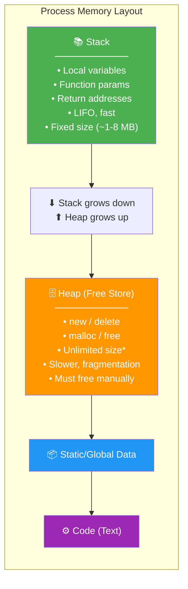
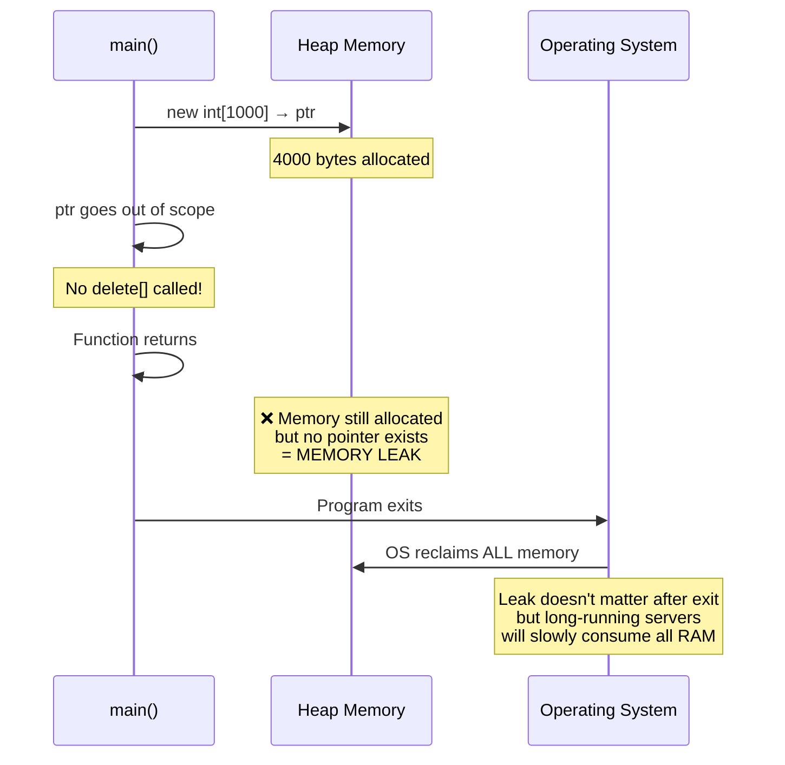
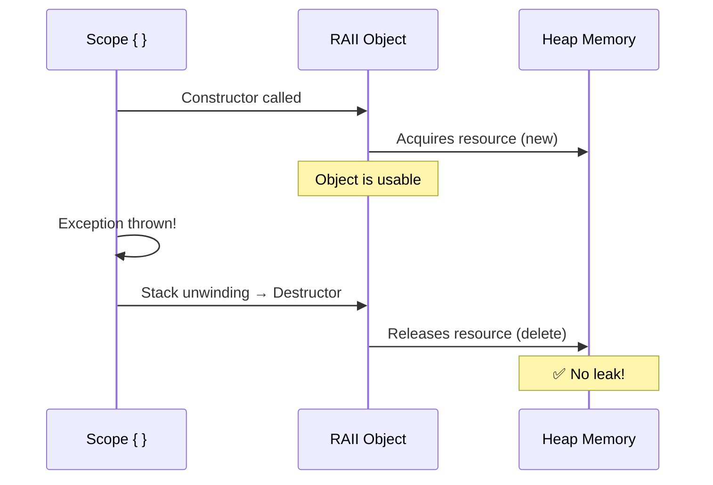

# Chapter 9: Dynamic Memory

> **Tags:** `heap` `stack` `new` `delete` `RAII` `memory-leaks`
> **Prerequisites:** Chapter 7 (Pointers), Chapter 8 (References)
> **Estimated Time:** 3–4 hours

---

## Theory

C++ gives the programmer direct control over memory allocation and deallocation. Objects can
live on the **stack** (automatic storage) or the **heap** (dynamic storage). Stack objects
are fast and automatically cleaned up, but their size must be known at compile time and their
lifetime is tied to the enclosing scope. Heap objects survive beyond scope boundaries and can
be any size, but the programmer must explicitly free them.

**The Fundamental Problem:** Every `new` requires a matching `delete`. Forget to `delete` →
memory leak. `delete` twice → undefined behavior. Use after `delete` → dangling pointer.
These bugs have caused billions of dollars of damage in production software.

**RAII (Resource Acquisition Is Initialization)** is the C++ answer. By tying resource
ownership to object lifetime, destructors automatically release resources when the owning
object goes out of scope — even when exceptions are thrown. RAII is arguably the single most
important idiom in C++.

---

## What / Why / How

### What
`new` allocates memory on the heap and constructs an object. `delete` destructs and frees.
`new[]` / `delete[]` handle arrays.

### Why
- Objects that **outlive** the creating scope (e.g., returned data structures).
- Objects whose **size is determined at runtime** (dynamic arrays, trees, graphs).
- Objects that are **too large for the stack** (multi-megabyte buffers).
- **Polymorphism** — base pointer to derived object on the heap.

### How

This snippet shows the basic lifecycle of heap memory: `new` allocates and initializes, you use the pointer to access the value, `delete` frees the memory, and setting the pointer to `nullptr` prevents accidental reuse.

```cpp
int* p = new int(42);     // allocate + initialize
*p = 100;                 // use
delete p;                 // free
p = nullptr;              // prevent dangling
```

---

## Code Examples

### Example 1 — Stack vs Heap

This program contrasts stack and heap allocation. Stack variables are created and destroyed automatically within their scope, while heap variables (created with `new`) persist until you explicitly `delete` them. Large objects like the 1 MB struct should go on the heap to avoid stack overflow.

```cpp
// stack_vs_heap.cpp
#include <iostream>

struct Large {
    char buffer[1024 * 1024];  // 1 MB
};

int main() {
    // Stack allocation — automatic lifetime
    int stack_var = 42;
    std::cout << "Stack var: " << stack_var << " at " << &stack_var << '\n';

    // Heap allocation — manual lifetime
    int* heap_var = new int(42);
    std::cout << "Heap var:  " << *heap_var << " at " << heap_var << '\n';
    delete heap_var;

    // Large objects should go on the heap
    // Large on_stack;  // may overflow the stack (~1 MB)
    Large* on_heap = new Large{};
    std::cout << "Large object at " << on_heap << '\n';
    delete on_heap;

    return 0;
}
// Compile: g++ -std=c++17 -Wall -o stack_heap stack_vs_heap.cpp
```

### Example 2 — Dynamic Arrays

This example allocates an array whose size is determined at runtime using `new int[n]`. Because the size isn't known at compile time, stack allocation won't work. The critical rule: always use `delete[]` (not plain `delete`) to free arrays created with `new[]`.

```cpp
// dynamic_arrays.cpp
#include <iostream>

int main() {
    int n;
    std::cout << "Enter array size: ";
    std::cin >> n;

    int* arr = new int[n];  // allocate array of n ints

    for (int i = 0; i < n; ++i) {
        arr[i] = i * i;
    }

    std::cout << "Squares: ";
    for (int i = 0; i < n; ++i) {
        std::cout << arr[i] << ' ';
    }
    std::cout << '\n';

    delete[] arr;  // MUST use delete[] for new[]
    arr = nullptr;

    return 0;
}
```

### Example 3 — Memory Leak Demonstration

This intentionally buggy function shows how an early `return` can skip the `delete[]` call, causing a memory leak. The fixed version adds cleanup before every exit path. In real code, RAII wrappers are preferred so you don't have to remember to free on every path.

```cpp
// memory_leak.cpp — intentional leak for demonstration
#include <iostream>

void leaky_function() {
    int* data = new int[1000];
    data[0] = 42;

    if (data[0] == 42) {
        return;  // LEAK! — delete[] never called
    }

    delete[] data;  // dead code — never reached
}

void fixed_function() {
    int* data = new int[1000];
    data[0] = 42;

    if (data[0] == 42) {
        delete[] data;  // clean up on EVERY exit path
        return;
    }

    delete[] data;
}

int main() {
    for (int i = 0; i < 100; ++i) {
        leaky_function();  // leaks 4000 bytes per call
    }
    std::cout << "Leaked ~400KB of memory\n";

    // In production, use Valgrind:
    // valgrind --leak-check=full ./memory_leak

    return 0;
}
```

### Example 4 — RAII Pattern (The Right Way)

This `Buffer` class demonstrates the RAII pattern: the constructor acquires memory with `new`, and the destructor releases it with `delete[]`. Even when an exception is thrown, the destructor runs automatically during stack unwinding, guaranteeing no leak. Copy operations are deleted to prevent double-free bugs.

```cpp
// raii_buffer.cpp
#include <iostream>
#include <cstring>
#include <stdexcept>

class Buffer {
    char* data_;
    std::size_t size_;

public:
    // Resource Acquisition IS Initialization
    explicit Buffer(std::size_t size)
        : data_(new char[size]), size_(size) {
        std::memset(data_, 0, size);
        std::cout << "Buffer allocated: " << size << " bytes\n";
    }

    // Destructor — automatic cleanup
    ~Buffer() {
        delete[] data_;
        std::cout << "Buffer freed: " << size_ << " bytes\n";
    }

    // Delete copy to prevent double-free
    Buffer(const Buffer&) = delete;
    Buffer& operator=(const Buffer&) = delete;

    char* data() { return data_; }
    std::size_t size() const { return size_; }
};

void process() {
    Buffer buf(1024);              // allocated here
    std::strcpy(buf.data(), "RAII is beautiful");
    std::cout << buf.data() << '\n';

    if (true) {
        throw std::runtime_error("Something went wrong!");
    }
    // buf is STILL properly freed because ~Buffer() runs during stack unwinding
}

int main() {
    try {
        process();
    } catch (const std::exception& e) {
        std::cout << "Caught: " << e.what() << '\n';
    }
    // No leak! Destructor ran automatically.
    return 0;
}
```

### Example 5 — Double-Free and Use-After-Free

This example shows two of the most dangerous pointer bugs: deleting the same memory twice (double-free) and accessing memory after it has been freed (use-after-free). Both cause undefined behavior. The fix is to set the pointer to `nullptr` immediately after deleting, since `delete nullptr` is safely defined as a no-op.

```cpp
// double_free.cpp — UNDEFINED BEHAVIOR examples
#include <iostream>

int main() {
    int* p = new int(42);

    delete p;
    // delete p;    // DOUBLE FREE — undefined behavior, crash, corruption
    // *p = 10;     // USE AFTER FREE — undefined behavior

    p = nullptr;    // GOOD PRACTICE — makes subsequent delete a no-op
    delete p;       // safe — deleting nullptr is defined as a no-op

    return 0;
}
```

### Example 6 — Why Manual Memory Is Dangerous

This example contrasts manual `new`/`delete` with RAII containers like `std::vector`. In `dangerous()`, if any allocation or code throws an exception, previously allocated memory leaks because `delete` is never reached. In `safe_with_raii()`, the vectors' destructors automatically free memory during stack unwinding.

```cpp
// exception_leak.cpp — leak through exception
#include <iostream>
#include <stdexcept>
#include <vector>

void dangerous() {
    int* a = new int[1000];
    int* b = new int[2000];  // if this throws, a leaks

    // ... work with a and b ...

    // If any code here throws, both a and b leak
    if (true) throw std::runtime_error("oops");

    delete[] b;
    delete[] a;
}

void safe_with_raii() {
    std::vector<int> a(1000);   // RAII — vector manages memory
    std::vector<int> b(2000);

    if (true) throw std::runtime_error("oops");
    // a and b are automatically freed during stack unwinding
}

int main() {
    try { dangerous(); } catch (...) {
        std::cout << "dangerous() leaked memory\n";
    }
    try { safe_with_raii(); } catch (...) {
        std::cout << "safe_with_raii() — no leak!\n";
    }
    return 0;
}
```

---

## Mermaid Diagrams

### Stack vs Heap Memory Layout



### Memory Leak Lifecycle



### RAII Lifecycle



---

## Practical Exercises

### 🟢 Exercise 1 — Dynamic Integer
Allocate a single `int` on the heap, set it to your birth year, print it, and free it.

### 🟢 Exercise 2 — Dynamic String Array
Allocate an array of `std::string` on the heap (use `new std::string[n]`), fill with names,
print, and free.

### 🟡 Exercise 3 — RAII Wrapper
Write a `DynArray` class that wraps a `new int[n]` allocation. The constructor allocates,
the destructor frees. Add `at(i)` for bounds-checked access.

### 🟡 Exercise 4 — Leak Detector
Use Valgrind (or AddressSanitizer) to find the leak in this code:
```cpp
void process() {
    int* data = new int[100];
    // ... forgot delete[]
}
```

### 🔴 Exercise 5 — Exception-Safe Two-Resource
Write a function that allocates two resources (`new`). Ensure both are freed even if an
exception occurs between the two allocations, without using smart pointers (use RAII classes).

---

## Solutions

### Solution 1

This minimal example allocates a single integer on the heap, prints it, then properly frees it and nullifies the pointer. It demonstrates the complete `new` → use → `delete` → `nullptr` lifecycle.

```cpp
#include <iostream>

int main() {
    int* year = new int(1995);
    std::cout << "Birth year: " << *year << '\n';
    delete year;
    year = nullptr;
}
```

### Solution 2

This solution allocates a dynamic array of `std::string` objects using `new[]`, fills them, prints them, and frees with `delete[]`. Note that `std::string` objects on the heap still manage their own internal character buffers — `delete[]` properly calls each string's destructor.

```cpp
#include <iostream>
#include <string>

int main() {
    int n = 3;
    std::string* names = new std::string[n];
    names[0] = "Alice";
    names[1] = "Bob";
    names[2] = "Charlie";

    for (int i = 0; i < n; ++i)
        std::cout << names[i] << '\n';

    delete[] names;
}
```

### Solution 3

This `DynArray` class is a complete RAII wrapper around a raw `int` array. The constructor allocates, the destructor frees, copy is disabled to prevent double-free, and `at()` provides bounds-checked access that throws on out-of-range indices.

```cpp
#include <iostream>
#include <stdexcept>

class DynArray {
    int* data_;
    std::size_t size_;

public:
    explicit DynArray(std::size_t n) : data_(new int[n]{}), size_(n) {}
    ~DynArray() { delete[] data_; }

    DynArray(const DynArray&) = delete;
    DynArray& operator=(const DynArray&) = delete;

    int& at(std::size_t i) {
        if (i >= size_) throw std::out_of_range("DynArray::at");
        return data_[i];
    }

    const int& at(std::size_t i) const {
        if (i >= size_) throw std::out_of_range("DynArray::at");
        return data_[i];
    }

    std::size_t size() const { return size_; }
};

int main() {
    DynArray arr(5);
    for (std::size_t i = 0; i < arr.size(); ++i)
        arr.at(i) = static_cast<int>(i * 10);

    for (std::size_t i = 0; i < arr.size(); ++i)
        std::cout << arr.at(i) << ' ';
    std::cout << '\n';

    try {
        arr.at(10);  // throws
    } catch (const std::out_of_range& e) {
        std::cout << "Caught: " << e.what() << '\n';
    }
}
```

### Solution 4

These commands show two ways to detect memory leaks: compiling with AddressSanitizer (`-fsanitize=address`) for fast, integrated checking, or running the binary through Valgrind for detailed leak reports including exact allocation sites.

```bash
# Compile with AddressSanitizer
g++ -std=c++17 -fsanitize=address -g -o leak_test leak_test.cpp
./leak_test
# Output shows: "detected memory leaks" with exact allocation site

# Or use Valgrind
valgrind --leak-check=full ./leak_test
# Output shows: "definitely lost: 400 bytes in 1 blocks"
```

### Solution 5

This solution wraps each allocation in its own RAII class (`IntBuffer`), so that even when an exception is thrown between the two allocations, both buffers are automatically freed by their destructors during stack unwinding. This pattern eliminates the need for manual `try/catch` cleanup.

```cpp
#include <iostream>
#include <stdexcept>

class IntBuffer {
    int* data_;
    std::size_t size_;
public:
    explicit IntBuffer(std::size_t n) : data_(new int[n]{}), size_(n) {
        std::cout << "IntBuffer(" << n << ") allocated\n";
    }
    ~IntBuffer() {
        delete[] data_;
        std::cout << "IntBuffer(" << size_ << ") freed\n";
    }
    IntBuffer(const IntBuffer&) = delete;
    IntBuffer& operator=(const IntBuffer&) = delete;
    int* data() { return data_; }
};

void two_resources() {
    IntBuffer a(100);  // RAII — will be freed on any exit
    IntBuffer b(200);  // RAII — will be freed on any exit

    // Simulate error between usage
    throw std::runtime_error("Error after allocating both");

    // Both a and b are freed by their destructors during stack unwinding
}

int main() {
    try {
        two_resources();
    } catch (const std::exception& e) {
        std::cout << "Caught: " << e.what() << '\n';
    }
}
```

---

## Quiz

**Q1.** What operator allocates memory on the heap?
a) `malloc`  b) `new`  c) `alloc`  d) `stack_alloc`

**Q2.** What happens if you use `delete` instead of `delete[]` for an array?
a) Nothing  b) Only first element freed  c) Undefined behavior  d) Compile error

**Q3.** RAII stands for:
a) Resource Allocation Is Incomplete  b) Resource Acquisition Is Initialization
c) Runtime Allocation Is Implicit  d) Resource Access Is Immediate

**Q4.** What does Valgrind detect?
a) Syntax errors  b) Memory leaks and invalid accesses  c) Logic errors  d) Type errors

**Q5.** Deleting `nullptr` is:
a) Undefined behavior  b) A no-op (safe)  c) A compile error  d) Implementation-defined

**Q6.** Which is exception-safe?
a) Raw `new`/`delete` pairs  b) RAII wrappers  c) Both equally  d) Neither

**Q7.** The typical stack size per thread is:
a) 64 KB  b) 1–8 MB  c) 1 GB  d) Unlimited

**Answers:** Q1-b, Q2-c, Q3-b, Q4-b, Q5-b, Q6-b, Q7-b

---

## Key Takeaways

- **Stack** = fast, automatic, limited size. **Heap** = flexible, manual, unlimited.
- Every `new` must have exactly one `delete`; every `new[]` needs `delete[]`.
- **RAII** ties resource lifetime to object lifetime — the #1 C++ idiom.
- Manual `new`/`delete` is fragile in the face of **exceptions** and **early returns**.
- Always set freed pointers to `nullptr` to prevent use-after-free.
- Use **Valgrind** or **AddressSanitizer** to catch leaks during development.
- In modern C++, prefer `std::vector`, `std::string`, and smart pointers over raw `new`.

---

## Chapter Summary

Dynamic memory via `new` and `delete` gives C++ programmers the power to control object
lifetime, allocate runtime-sized data, and build complex data structures. However, this power
comes with severe responsibility: memory leaks, double-frees, and use-after-free bugs are
the most common C++ defects. The RAII pattern — binding resource acquisition to object
construction and release to destruction — is the fundamental C++ technique for writing safe,
exception-resistant code. Smart pointers (Chapter 14) build on RAII to automate heap
management entirely.

---

## Real-World Insight

- **Server software** (databases, web servers) that leaks even 1 byte per request will
  eventually consume all RAM and crash after hours/days of uptime.
- **Game engines** use custom allocators (pool, arena, frame) built on raw memory to avoid
  heap fragmentation and allocation overhead.
- **Google's Abseil** and **Facebook's Folly** provide arena allocators for high-performance
  services.
- **Chromium** banned raw `new` in most code — all heap allocations go through smart pointers
  or custom allocators.
- **Valgrind** and **AddressSanitizer (ASan)** are mandatory in CI pipelines at most C++
  shops.

---

## Common Mistakes

| # | Mistake | Fix |
|---|---------|-----|
| 1 | **Mismatching `new`/`delete[]`** — UB | Always match: `new T` → `delete`, `new T[]` → `delete[]` |
| 2 | **Not freeing on every exit path** — leak via early return | Use RAII; the destructor handles all paths |
| 3 | **Double delete** — heap corruption | Set to `nullptr` after delete; prefer unique_ptr |
| 4 | **Allocating large objects on stack** — stack overflow | Use heap for buffers >100 KB |
| 5 | **Ignoring exception paths** — leak through throw | RAII wrappers are exception-safe by design |

---

## Interview Questions

### Q1: What is RAII and why is it important?

**Model Answer:**
RAII (Resource Acquisition Is Initialization) binds resource management to object lifetime.
The constructor acquires the resource (memory, file handle, lock) and the destructor releases
it. This guarantees cleanup even when exceptions are thrown, making code exception-safe
without explicit try/finally blocks. Every standard container, smart pointer, and file stream
in C++ uses RAII.

### Q2: What's the difference between `new`/`delete` and `malloc`/`free`?

**Model Answer:**
`new` calls the constructor after allocating memory; `delete` calls the destructor before
freeing. `malloc`/`free` are C functions that only allocate/free raw bytes — no
construction or destruction. In C++, always prefer `new`/`delete` (or better, smart pointers)
because they ensure proper initialization and cleanup.

### Q3: How would you detect memory leaks in a C++ program?

**Model Answer:**
1. **Valgrind** (`--leak-check=full`) — runtime detection, reports exact allocation site.
2. **AddressSanitizer (ASan)** — compile with `-fsanitize=address`, fast, catches leaks +
   overflows + use-after-free.
3. **Static analysis** — tools like clang-tidy warn about missing deletes.
4. **Smart pointers** — prevention is better than detection.

### Q4: When should you allocate on the heap vs the stack?

**Model Answer:**
Use the **stack** for small, short-lived objects with compile-time-known size (the default).
Use the **heap** when: (1) the object must outlive the current scope, (2) size is determined
at runtime, (3) the object is too large for the stack (>100 KB), or (4) you need
polymorphism via base-class pointers. In modern C++, `std::vector` and `std::string`
internally use the heap but manage it via RAII.
