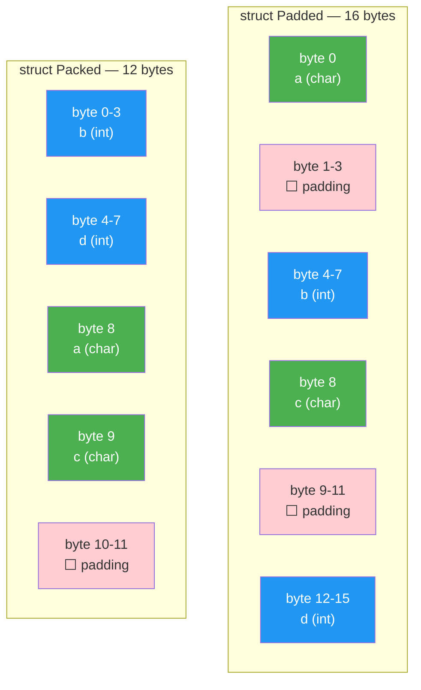
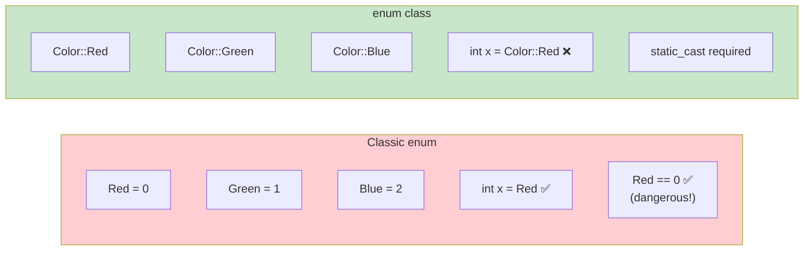

# Chapter 10: Structs & Enums

> **Tags:** `struct` `enum` `enum-class` `alignment` `padding` `aggregate-init`
> **Prerequisites:** Chapter 3 (Variables & Types), Chapter 7 (Pointers)
> **Estimated Time:** 2–3 hours

---

## Theory

**Structs** group related data into a single type. In C++, a `struct` is identical to a
`class` except that members are `public` by default. Structs are the building blocks of
every data-oriented program: network packets, database rows, GPU vertex buffers, and
configuration objects are all structs.

**Enums** define a set of named constants. Classic `enum` leaks names into the enclosing
scope and implicitly converts to `int` — a source of subtle bugs. **`enum class`** (C++11)
fixes both problems: names are scoped and there's no implicit conversion.

**Memory layout** matters for performance and interoperability. The compiler may insert
**padding bytes** between struct members to satisfy alignment requirements. Understanding
padding is critical for serialization, network protocols, and cache optimization.

---

## What / Why / How

### What
- A `struct` is a user-defined type that groups heterogeneous data.
- An `enum` (or `enum class`) defines a type with a fixed set of named values.

### Why
- **Organization** — group `x, y, z` into `Point3D` instead of passing three floats.
- **Type safety** — `enum class Color { Red, Green, Blue }` prevents mixing with integers.
- **Interop** — C APIs, hardware registers, and file formats require known memory layouts.
- **Bitfields** — pack boolean flags into minimal space.

### How

Here is the minimal syntax for declaring a struct and a scoped enum. The struct groups two `double` values into a single `Point` type, while `enum class` defines a type-safe set of named constants.

```cpp
struct Point { double x, y; };          // aggregate type
enum class Color { Red, Green, Blue };  // scoped enum
```

---

## Code Examples

### Example 1 — Basic Struct

This example defines an `Employee` struct that bundles a name, ID, and salary together. It shows two ways to create a struct: brace initialization (all at once) and field-by-field assignment. The `print()` member function demonstrates that structs in C++ can have methods, not just data.

```cpp
// basic_struct.cpp
#include <iostream>
#include <string>

struct Employee {
    std::string name;
    int id;
    double salary;

    void print() const {
        std::cout << "[" << id << "] " << name
                  << " — $" << salary << '\n';
    }
};

int main() {
    Employee e1{"Alice", 101, 95000.0};
    e1.print();

    Employee e2;
    e2.name = "Bob";
    e2.id = 102;
    e2.salary = 87000.0;
    e2.print();

    return 0;
}
// Compile: g++ -std=c++17 -Wall -o basic_struct basic_struct.cpp
```

### Example 2 — Aggregate Initialization & Designated Initializers (C++20)

This program shows two styles of struct initialization. The C++11 positional style fills fields in order, while C++20 designated initializers let you name each field explicitly (e.g., `.width = 3840`), making the code self-documenting. Any fields you skip keep their default values.

```cpp
// designated_init.cpp
#include <iostream>

struct Config {
    int width = 1920;
    int height = 1080;
    bool fullscreen = false;
    double refresh_rate = 60.0;
};

int main() {
    // C++11 aggregate init — positional
    Config c1{2560, 1440, true, 144.0};

    // C++20 designated initializers — by name (order must match declaration)
    Config c2{.width = 3840, .height = 2160, .refresh_rate = 120.0};
    // .fullscreen defaults to false

    std::cout << "c1: " << c1.width << "x" << c1.height
              << " fullscreen=" << c1.fullscreen << '\n';
    std::cout << "c2: " << c2.width << "x" << c2.height
              << " rate=" << c2.refresh_rate << '\n';

    return 0;
}
// Compile: g++ -std=c++20 -Wall -o des_init designated_init.cpp
```

### Example 3 — Memory Padding and Alignment

This example reveals how the compiler inserts hidden padding bytes inside structs to keep each member aligned to its natural boundary. By reordering the same members (largest first), `Packed` saves 4 bytes over `Padded`. The `#pragma pack(1)` version forces zero padding but may hurt performance. Use `sizeof` and `offsetof` to inspect the actual layout.

```cpp
// padding.cpp
#include <iostream>
#include <cstddef>

struct Padded {
    char a;       // 1 byte + 3 padding
    int b;        // 4 bytes
    char c;       // 1 byte + 3 padding
    int d;        // 4 bytes
};  // Total: 16 bytes

struct Packed {
    int b;        // 4 bytes
    int d;        // 4 bytes
    char a;       // 1 byte
    char c;       // 1 byte + 2 padding
};  // Total: 12 bytes

#pragma pack(push, 1)
struct ForcePacked {
    char a;
    int b;
    char c;
    int d;
};  // Total: 10 bytes — NO padding (may hurt performance)
#pragma pack(pop)

int main() {
    std::cout << "sizeof(Padded):     " << sizeof(Padded)     << '\n';  // 16
    std::cout << "sizeof(Packed):     " << sizeof(Packed)     << '\n';  // 12
    std::cout << "sizeof(ForcePacked):" << sizeof(ForcePacked)<< '\n';  // 10

    // Show offsets
    std::cout << "\nPadded offsets:\n";
    std::cout << "  a: " << offsetof(Padded, a) << '\n';
    std::cout << "  b: " << offsetof(Padded, b) << '\n';
    std::cout << "  c: " << offsetof(Padded, c) << '\n';
    std::cout << "  d: " << offsetof(Padded, d) << '\n';

    return 0;
}
```

### Example 4 — enum vs enum class

This code compares classic `enum` with the safer `enum class` introduced in C++11. Classic enums leak their names into the surrounding scope and silently convert to integers, which can cause subtle bugs. `enum class` requires qualified names (e.g., `Color::Red`) and forbids implicit conversion, catching mistakes at compile time.

```cpp
// enum_comparison.cpp
#include <iostream>

// Classic enum — unscoped, implicit conversion
enum OldColor { Red, Green, Blue };

// Scoped enum — type-safe
enum class Color { Red, Green, Blue };
enum class Fruit { Apple, Orange, Banana };

int main() {
    // Classic enum problems
    OldColor oc = Red;              // no scope needed
    int val = oc;                   // implicit conversion to int
    // if (oc == 0) { ... }         // compiles — comparing color to int!

    // enum class — safe
    Color c = Color::Red;           // must qualify
    // int x = c;                   // ERROR — no implicit conversion
    int x = static_cast<int>(c);   // explicit cast required
    // if (c == Fruit::Apple) {}    // ERROR — different enum types

    std::cout << "OldColor Red = " << val << '\n';
    std::cout << "Color::Red = " << x << '\n';

    return 0;
}
```

### Example 5 — Bitfield Enums for Flags

This example uses an `enum class` with power-of-two values to represent combinable permission flags (Read, Write, Execute). Because `enum class` blocks implicit conversion, we overload the `|` and `&` operators to combine and test flags while keeping full type safety. The `has_flag` helper checks whether a specific permission is set.

```cpp
// bitflags.cpp
#include <iostream>
#include <cstdint>

enum class Permission : uint8_t {
    None    = 0,
    Read    = 1 << 0,  // 0b001
    Write   = 1 << 1,  // 0b010
    Execute = 1 << 2,  // 0b100
};

// Operator overloads for flag operations
constexpr Permission operator|(Permission a, Permission b) {
    return static_cast<Permission>(
        static_cast<uint8_t>(a) | static_cast<uint8_t>(b));
}

constexpr Permission operator&(Permission a, Permission b) {
    return static_cast<Permission>(
        static_cast<uint8_t>(a) & static_cast<uint8_t>(b));
}

constexpr bool has_flag(Permission perms, Permission flag) {
    return (perms & flag) == flag;
}

int main() {
    auto perms = Permission::Read | Permission::Write;

    std::cout << "Has Read:    " << has_flag(perms, Permission::Read)    << '\n';
    std::cout << "Has Write:   " << has_flag(perms, Permission::Write)   << '\n';
    std::cout << "Has Execute: " << has_flag(perms, Permission::Execute) << '\n';

    perms = perms | Permission::Execute;
    std::cout << "After adding Execute: "
              << has_flag(perms, Permission::Execute) << '\n';

    return 0;
}
```

### Example 6 — Struct vs Class

This example illustrates the only real difference between `struct` and `class` in C++: the default access level. `Point` is a struct with all-public fields — ideal for plain data. `Circle` is a class with a private `radius_` and a constructor that enforces a non-negative value, demonstrating when you need controlled access through an interface.

```cpp
// struct_vs_class.cpp
#include <iostream>
#include <string>

// struct — public by default, used for passive data (POD-like)
struct Point {
    double x, y;
};

// class — private by default, used when invariants must be maintained
class Circle {
    double radius_;  // private
public:
    explicit Circle(double r) : radius_(r > 0 ? r : 0) {}
    double area() const { return 3.14159265 * radius_ * radius_; }
    double radius() const { return radius_; }
};

int main() {
    Point p{3.0, 4.0};  // direct access — it's just data
    std::cout << "Point: (" << p.x << ", " << p.y << ")\n";

    Circle c(5.0);       // controlled access through interface
    std::cout << "Circle r=" << c.radius() << " area=" << c.area() << '\n';

    return 0;
}
```

---

## Mermaid Diagrams

### Struct Memory Layout — Padding



### Enum Class Safety



---

## Practical Exercises

### 🟢 Exercise 1 — Student Struct
Define a `Student` struct with `name`, `age`, `gpa`. Write a function to print it.

### 🟢 Exercise 2 — Scoped Enum
Create an `enum class Weekday` and a function that returns `true` if a day is a weekend.

### 🟡 Exercise 3 — Struct Size Detective
Create three structs with the same members in different orders. Predict and verify `sizeof`.

### 🟡 Exercise 4 — Flag System
Implement a `FileMode` flags enum with `Read`, `Write`, `Append`, `Binary`. Show combining
and testing flags.

### 🔴 Exercise 5 — Serializable Struct
Write a struct representing a network packet header (version, length, type, checksum). Pack
it to eliminate padding and write a function to serialize/deserialize to/from a byte array.

---

## Solutions

### Solution 1

This solution defines a `Student` struct and a free function that prints it by const reference. It also demonstrates C++20 designated initializers as a second way to construct the struct.

```cpp
#include <iostream>
#include <string>

struct Student {
    std::string name;
    int age;
    double gpa;
};

void print_student(const Student& s) {
    std::cout << s.name << " (age " << s.age << "), GPA: " << s.gpa << '\n';
}

int main() {
    Student s{"Alice", 20, 3.85};
    print_student(s);

    Student s2{.name = "Bob", .age = 22, .gpa = 3.60};  // C++20
    print_student(s2);
}
```

### Solution 2

This solution creates a scoped `Weekday` enum and a function that checks if a given day is Saturday or Sunday. Because `enum class` is used, comparisons between unrelated types are caught at compile time.

```cpp
#include <iostream>

enum class Weekday { Monday, Tuesday, Wednesday, Thursday, Friday, Saturday, Sunday };

bool is_weekend(Weekday day) {
    return day == Weekday::Saturday || day == Weekday::Sunday;
}

int main() {
    Weekday day = Weekday::Saturday;
    std::cout << "Is weekend? " << std::boolalpha << is_weekend(day) << '\n';

    day = Weekday::Wednesday;
    std::cout << "Is weekend? " << is_weekend(day) << '\n';
}
```

### Solution 3

This solution defines five structs with identical members arranged in different orders to demonstrate how member ordering affects total struct size due to padding. Notice that `struct E` is 24 bytes while others are 16 — simply because `int` sits before `double`, forcing extra alignment padding.

```cpp
#include <iostream>

struct A { char c; int i; double d; };           // 1+3pad +4 +8 = 16
struct B { double d; int i; char c; };           // 8 +4 +1+3pad = 16
struct C { char c1; char c2; int i; double d; }; // 1+1+2pad +4 +8 = 16
struct D { double d; char c1; char c2; int i; }; // 8 +1+1+2pad +4 = 16
struct E { int i; double d; char c; };           // 4+4pad +8 +1+7pad = 24!

int main() {
    std::cout << "sizeof(A) = " << sizeof(A) << '\n';
    std::cout << "sizeof(B) = " << sizeof(B) << '\n';
    std::cout << "sizeof(C) = " << sizeof(C) << '\n';
    std::cout << "sizeof(D) = " << sizeof(D) << '\n';
    std::cout << "sizeof(E) = " << sizeof(E) << '\n';
}
```

### Solution 4

This solution implements a `FileMode` flags enum backed by `uint8_t`. Operator overloads for `|` and `&` let you combine and test flags naturally (e.g., `Read | Binary`), while keeping `enum class` type safety so you can't accidentally mix file modes with unrelated integers.

```cpp
#include <iostream>
#include <cstdint>

enum class FileMode : uint8_t {
    None    = 0,
    Read    = 1 << 0,
    Write   = 1 << 1,
    Append  = 1 << 2,
    Binary  = 1 << 3,
};

constexpr FileMode operator|(FileMode a, FileMode b) {
    return static_cast<FileMode>(static_cast<uint8_t>(a) | static_cast<uint8_t>(b));
}
constexpr FileMode operator&(FileMode a, FileMode b) {
    return static_cast<FileMode>(static_cast<uint8_t>(a) & static_cast<uint8_t>(b));
}
constexpr bool has(FileMode mode, FileMode flag) {
    return (mode & flag) == flag;
}

int main() {
    auto mode = FileMode::Read | FileMode::Binary;
    std::cout << std::boolalpha;
    std::cout << "Read:   " << has(mode, FileMode::Read)   << '\n';
    std::cout << "Write:  " << has(mode, FileMode::Write)  << '\n';
    std::cout << "Binary: " << has(mode, FileMode::Binary) << '\n';
}
```

### Solution 5

This solution defines a packed network packet header with `#pragma pack(1)` to eliminate all padding, then uses `memcpy` to serialize it to a byte array and deserialize it back. The `static_assert` ensures the struct is exactly 8 bytes, which is critical for binary protocol correctness.

```cpp
#include <iostream>
#include <cstdint>
#include <cstring>
#include <array>

#pragma pack(push, 1)
struct PacketHeader {
    uint8_t  version;
    uint16_t length;
    uint8_t  type;
    uint32_t checksum;
};
#pragma pack(pop)

static_assert(sizeof(PacketHeader) == 8, "PacketHeader must be 8 bytes");

std::array<uint8_t, sizeof(PacketHeader)> serialize(const PacketHeader& h) {
    std::array<uint8_t, sizeof(PacketHeader)> buf;
    std::memcpy(buf.data(), &h, sizeof(h));
    return buf;
}

PacketHeader deserialize(const std::array<uint8_t, sizeof(PacketHeader)>& buf) {
    PacketHeader h;
    std::memcpy(&h, buf.data(), sizeof(h));
    return h;
}

int main() {
    PacketHeader h{1, 1024, 3, 0xDEADBEEF};
    auto bytes = serialize(h);

    std::cout << "Serialized bytes: ";
    for (auto b : bytes) std::printf("%02x ", b);
    std::cout << '\n';

    auto h2 = deserialize(bytes);
    std::cout << "Deserialized: v=" << (int)h2.version
              << " len=" << h2.length
              << " type=" << (int)h2.type
              << " checksum=0x" << std::hex << h2.checksum << '\n';
}
```

---

## Quiz

**Q1.** The default access specifier for `struct` members is:
a) private  b) protected  c) public  d) internal

**Q2.** `enum class` prevents:
a) Implicit conversion to int  b) Scope pollution  c) Both  d) Neither

**Q3.** Why does the compiler add padding bytes?
a) To waste memory  b) To align members for CPU efficiency  c) For debugging  d) Required by C++ standard

**Q4.** Designated initializers (C++20) require members to be initialized in:
a) Any order  b) Declaration order  c) Alphabetical order  d) Reverse order

**Q5.** `#pragma pack(1)` does what?
a) Removes all padding  b) Adds extra padding  c) Only works on enums  d) Is non-standard

**Q6.** `sizeof(struct { char c; int i; })` on a typical 64-bit system is likely:
a) 5  b) 8  c) 12  d) 16

**Answers:** Q1-c, Q2-c, Q3-b, Q4-b, Q5-a, Q6-b

---

## Key Takeaways

- `struct` = `class` with public defaults. Use `struct` for passive data, `class` for
  invariants.
- Always prefer **`enum class`** over plain `enum` for type safety and scope.
- The compiler inserts **padding** for alignment — reorder members to minimize waste.
- **Designated initializers** (C++20) make struct initialization self-documenting.
- Bitfield enums with operator overloads give type-safe flag combinations.
- Use `#pragma pack` or `alignas` when you need exact memory layout (serialization, HW).
- `offsetof` and `sizeof` are your tools for inspecting layout.

---

## Chapter Summary

Structs and enums are the fundamental building blocks for organizing data in C++. Structs
group related values into coherent types, and understanding their memory layout — including
padding and alignment — is essential for performance-critical and interop code. Enum classes
provide scoped, type-safe constants that prevent entire categories of bugs caused by classic
enums. Together with designated initializers and bitfield patterns, these features enable
clean, safe, and efficient data modeling in modern C++.

---

## Real-World Insight

- **Network protocols** (TCP, UDP, custom) define headers as packed structs with exact byte
  layouts.
- **Game engines** organize entity data as structs-of-arrays (SoA) for cache efficiency.
- **Database engines** (SQLite, RocksDB) use structs for page headers and index nodes.
- **Embedded systems** map hardware registers to packed structs at specific memory addresses.
- **Google Protobuf** and **FlatBuffers** generate struct-like code for serialization.

---

## Common Mistakes

| # | Mistake | Fix |
|---|---------|-----|
| 1 | **Using plain `enum`** — name collisions and implicit int conversion | Always use `enum class` |
| 2 | **Ignoring padding** — structs larger than expected, serialization bugs | Reorder members largest-first; verify with `sizeof` |
| 3 | **Comparing different enum types** — compiles with plain enum | `enum class` makes this a compile error |
| 4 | **Assuming struct layout is portable** — endianness, padding vary | Use serialization libraries for cross-platform data |
| 5 | **Forgetting `const` on accessor methods** — can't call on const objects | Mark read-only methods `const` |

---

## Interview Questions

### Q1: What is the difference between `struct` and `class` in C++?

**Model Answer:**
The only difference is the default access specifier: `struct` members are `public` by
default, `class` members are `private`. Inheritance is also `public` by default for structs
and `private` for classes. Convention: use `struct` for plain data (no invariants) and
`class` when the type has invariants that must be maintained through an interface.

### Q2: What is struct padding and how do you minimize it?

**Model Answer:**
The CPU accesses memory most efficiently when data is aligned to its natural boundary (e.g.,
a 4-byte `int` at an address divisible by 4). The compiler inserts padding bytes between
struct members to achieve this alignment. To minimize padding, order members from largest to
smallest alignment requirement. Use `sizeof` and `offsetof` to verify. For exact layout
control, use `#pragma pack(1)`, but be aware this may reduce performance.

### Q3: Why should you prefer `enum class` over plain `enum`?

**Model Answer:**
`enum class` provides: (1) **Scoped names** — `Color::Red` instead of `Red`, preventing
name collisions. (2) **No implicit conversion** — cannot accidentally compare a `Color` with
an `int` or another enum type. (3) **Underlying type control** — `enum class Color : uint8_t`
specifies storage. These features prevent bugs that are common with unscoped enums.

### Q4: How do designated initializers work in C++20?

**Model Answer:**
Designated initializers allow naming struct members during initialization:
`Config c{.width = 1920, .height = 1080}`. Members must be initialized in **declaration
order** (unlike C99 where any order is allowed). Unmentioned members get their default
values. This improves readability, especially for structs with many fields or boolean
parameters.
