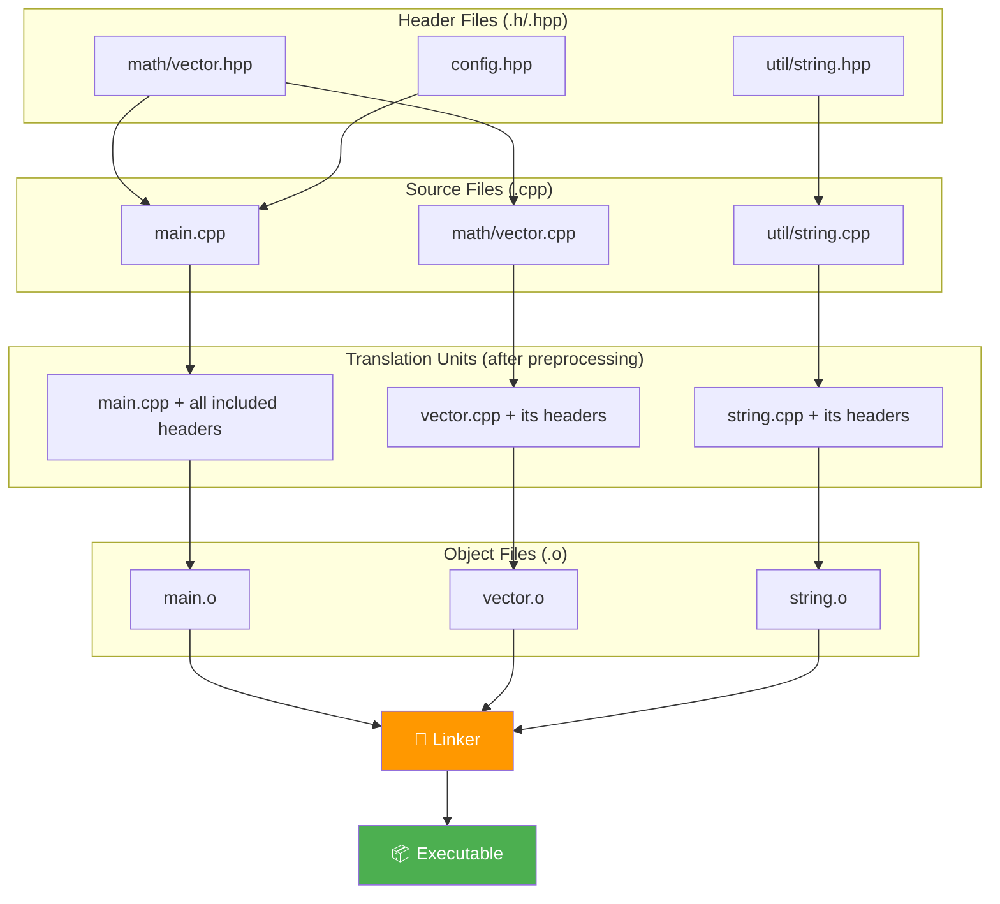
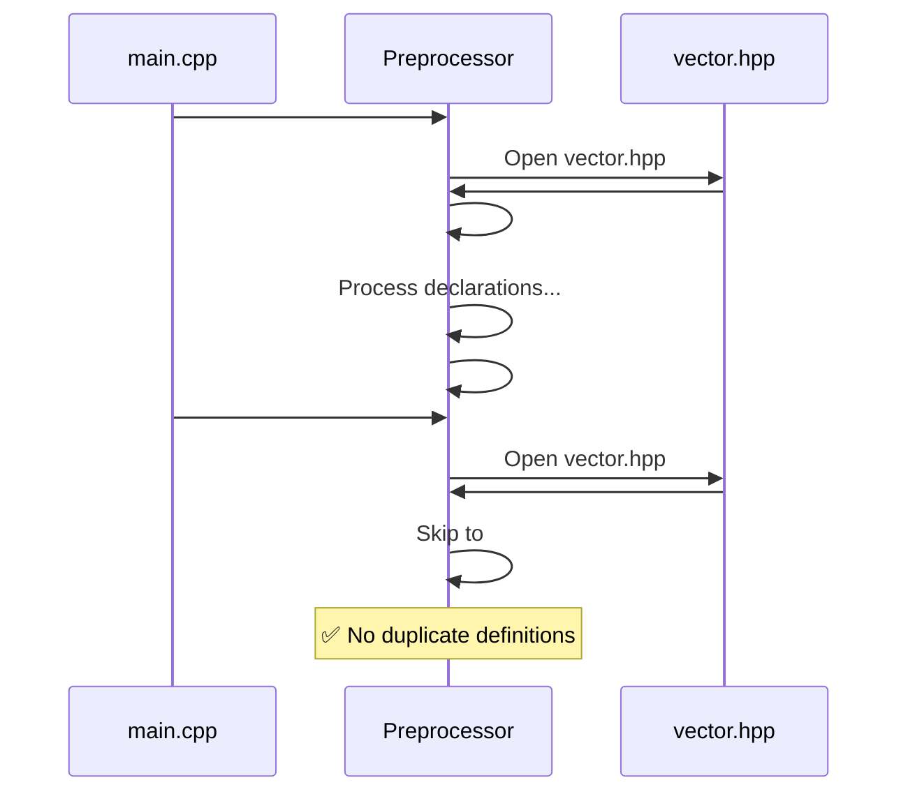

# Chapter 11: Namespaces & Headers

> **Tags:** `namespaces` `headers` `include-guards` `ODR` `translation-units` `forward-declarations`
> **Prerequisites:** Chapter 5 (Functions), Chapter 10 (Structs)
> **Estimated Time:** 2–3 hours

---

## Theory

As C++ programs grow, name collisions become inevitable. Two libraries might both define
`log()`, `Node`, or `Error`. **Namespaces** solve this by grouping declarations into named
scopes.

The C++ **compilation model** is based on **translation units** — each `.cpp` file is compiled
independently. Headers (`.h` / `.hpp`) are textually pasted into source files by `#include`.
This model creates challenges: duplicate definitions across translation units, long compile
times, and fragile dependency chains.

Key rules governing this system:
- **One Definition Rule (ODR):** A variable, function, or class must have exactly one
  definition across all translation units (with exceptions for inline functions and
  templates).
- **Include guards** prevent the same header from being processed twice in one TU.
- **Forward declarations** reduce compile-time dependencies.

---

## What / Why / How

### What
- **Namespace:** A declarative region that provides scope to identifiers.
- **Header file:** A file included by `#include` to share declarations.
- **Translation unit:** A source file after all `#include` directives are resolved.

### Why
- Prevent **name collisions** between libraries and modules.
- Enable **separate compilation** — change one `.cpp`, recompile only that file.
- Reduce **compile times** by minimizing header dependencies.
- Ensure **correctness** via ODR compliance.

### How
```cpp
// math/vector.hpp
#pragma once
namespace math {
    struct Vector3 { double x, y, z; };
    double dot(const Vector3& a, const Vector3& b);
}
```

---

## Code Examples

### Example 1 — Namespaces Basics

```cpp
// namespaces.cpp
#include <iostream>

namespace graphics {
    void draw() { std::cout << "Drawing a shape\n"; }
    int version = 2;
}

namespace audio {
    void draw() { std::cout << "Drawing audio waveform\n"; }  // same name, no conflict
    int version = 3;
}

int main() {
    graphics::draw();  // qualified name
    audio::draw();

    // using declaration — imports one name
    using graphics::version;
    std::cout << "Graphics version: " << version << '\n';

    // using directive — imports everything (use sparingly)
    {
        using namespace audio;
        draw();  // calls audio::draw()
    }

    return 0;
}
// Compile: g++ -std=c++17 -Wall -o namespaces namespaces.cpp
```

### Example 2 — Nested Namespaces (C++17)

```cpp
// nested_namespaces.cpp
#include <iostream>

// C++17 compact syntax
namespace company::product::detail {
    void internal_func() {
        std::cout << "company::product::detail::internal_func()\n";
    }
}

// Equivalent C++11 style:
// namespace company { namespace product { namespace detail { ... }}}

namespace company::product {
    void public_func() {
        std::cout << "company::product::public_func()\n";
        detail::internal_func();
    }
}

int main() {
    company::product::public_func();

    // Namespace alias — shorthand
    namespace cp = company::product;
    cp::public_func();

    return 0;
}
```

### Example 3 — Anonymous Namespaces (Internal Linkage)

```cpp
// anonymous_ns.cpp
#include <iostream>

// Anonymous namespace — visible only in this translation unit
// Equivalent to 'static' in C, but works for types too
namespace {
    int internal_counter = 0;

    void increment() {
        ++internal_counter;
    }

    struct InternalData {
        int value;
    };
}

// Another TU can define its own 'internal_counter' without conflict

int main() {
    increment();
    increment();
    std::cout << "Counter: " << internal_counter << '\n';

    InternalData d{42};
    std::cout << "Data: " << d.value << '\n';

    return 0;
}
```

### Example 4 — Header Organization with Include Guards

```cpp
// === math/vector.hpp ===
#ifndef MATH_VECTOR_HPP   // traditional include guard
#define MATH_VECTOR_HPP

#include <cmath>
#include <iostream>

namespace math {

struct Vector3 {
    double x = 0, y = 0, z = 0;

    double length() const {
        return std::sqrt(x * x + y * y + z * z);
    }
};

// Inline — can appear in header without ODR violation
inline double dot(const Vector3& a, const Vector3& b) {
    return a.x * b.x + a.y * b.y + a.z * b.z;
}

// Declaration only — definition in .cpp
Vector3 cross(const Vector3& a, const Vector3& b);

inline std::ostream& operator<<(std::ostream& os, const Vector3& v) {
    return os << "(" << v.x << ", " << v.y << ", " << v.z << ")";
}

}  // namespace math

#endif  // MATH_VECTOR_HPP
```

```cpp
// === math/vector.cpp ===
#include "math/vector.hpp"

namespace math {

Vector3 cross(const Vector3& a, const Vector3& b) {
    return {
        a.y * b.z - a.z * b.y,
        a.z * b.x - a.x * b.z,
        a.x * b.y - a.y * b.x
    };
}

}  // namespace math
```

```cpp
// === main.cpp ===
#include "math/vector.hpp"
#include <iostream>

int main() {
    math::Vector3 a{1, 2, 3};
    math::Vector3 b{4, 5, 6};

    std::cout << "a = " << a << '\n';
    std::cout << "b = " << b << '\n';
    std::cout << "dot(a,b) = " << math::dot(a, b) << '\n';
    std::cout << "cross(a,b) = " << math::cross(a, b) << '\n';
    std::cout << "|a| = " << a.length() << '\n';

    return 0;
}
// Compile: g++ -std=c++17 -Wall -Iinclude -o main main.cpp math/vector.cpp
```

### Example 5 — Forward Declarations

```cpp
// forward_decl.hpp
#pragma once

// Forward declaration — avoids #include "database.hpp"
// Only works when we use pointers or references
namespace db {
    class Connection;
}

namespace app {

class UserService {
    db::Connection* conn_;  // pointer — forward decl is sufficient

public:
    explicit UserService(db::Connection* conn);
    void create_user(const char* name);
};

}  // namespace app
```

```cpp
// forward_decl.cpp
// #include "database.hpp"  — full definition needed here
// #include "forward_decl.hpp"
#include <iostream>

// Simulated db::Connection
namespace db {
class Connection {
public:
    void execute(const char* sql) {
        std::cout << "Executing: " << sql << '\n';
    }
};
}

namespace app {

UserService::UserService(db::Connection* conn) : conn_(conn) {}

void UserService::create_user(const char* name) {
    std::cout << "Creating user: " << name << '\n';
    conn_->execute("INSERT INTO users ...");
}

}  // namespace app

int main() {
    db::Connection conn;
    app::UserService svc(&conn);
    svc.create_user("Alice");
    return 0;
}
```

### Example 6 — using Declarations vs Directives

```cpp
// using_demo.cpp
#include <iostream>
#include <string>
#include <vector>

namespace util {
    std::string to_upper(std::string s) {
        for (auto& c : s) c = static_cast<char>(std::toupper(c));
        return s;
    }

    std::string to_lower(std::string s) {
        for (auto& c : s) c = static_cast<char>(std::tolower(c));
        return s;
    }
}

int main() {
    // GOOD: using declaration — import specific names
    using util::to_upper;
    std::cout << to_upper("hello") << '\n';

    // BAD IN HEADERS: using directive — imports everything
    // using namespace util;  // don't do this in headers!

    // In .cpp files, 'using namespace' is acceptable but scoped is better
    {
        using namespace util;
        std::cout << to_lower("WORLD") << '\n';
    }

    return 0;
}
```

---

## Mermaid Diagrams

### Compilation Unit Model



### Include Guard Protection



---

## Practical Exercises

### 🟢 Exercise 1 — Basic Namespace
Create a `geometry` namespace with a `Circle` struct and an `area()` function. Use it from
`main()` with qualified names.

### 🟢 Exercise 2 — Include Guard
Write a header `utils.hpp` with a proper include guard and a `clamp()` function.

### 🟡 Exercise 3 — Multi-File Project
Split a `Calculator` class into `calculator.hpp` (declaration) and `calculator.cpp`
(definition). Compile and link them with `main.cpp`.

### 🟡 Exercise 4 — Namespace Alias
Create a deeply nested namespace `company::math::linalg` and use a namespace alias to
make it convenient.

### 🔴 Exercise 5 — ODR Violation
Create a program with an intentional ODR violation (define a non-inline function in a header
included by two `.cpp` files). Observe the linker error, then fix it with `inline` or by
moving the definition to a `.cpp` file.

---

## Solutions

### Solution 1

```cpp
#include <iostream>
#include <cmath>

namespace geometry {
    struct Circle {
        double radius;
    };

    double area(const Circle& c) {
        return M_PI * c.radius * c.radius;
    }
}

int main() {
    geometry::Circle c{5.0};
    std::cout << "Area: " << geometry::area(c) << '\n';
}
```

### Solution 2

```cpp
// utils.hpp
#ifndef UTILS_HPP
#define UTILS_HPP

template<typename T>
constexpr T clamp(T value, T lo, T hi) {
    return (value < lo) ? lo : (value > hi) ? hi : value;
}

#endif  // UTILS_HPP
```

```cpp
// main.cpp
#include "utils.hpp"
#include <iostream>

int main() {
    std::cout << clamp(15, 0, 10) << '\n';   // 10
    std::cout << clamp(-5, 0, 10) << '\n';   // 0
    std::cout << clamp(5, 0, 10) << '\n';    // 5
}
```

### Solution 3

```cpp
// calculator.hpp
#pragma once

class Calculator {
    double memory_ = 0;
public:
    double add(double a, double b);
    double sub(double a, double b);
    void store(double val);
    double recall() const;
};
```

```cpp
// calculator.cpp
#include "calculator.hpp"

double Calculator::add(double a, double b) { return a + b; }
double Calculator::sub(double a, double b) { return a - b; }
void Calculator::store(double val) { memory_ = val; }
double Calculator::recall() const { return memory_; }
```

```cpp
// main.cpp
#include "calculator.hpp"
#include <iostream>

int main() {
    Calculator calc;
    double result = calc.add(3.0, 4.0);
    calc.store(result);
    std::cout << "Result: " << result << '\n';
    std::cout << "Memory: " << calc.recall() << '\n';
}
// Compile: g++ -std=c++17 -Wall -o calc main.cpp calculator.cpp
```

### Solution 4

```cpp
#include <iostream>

namespace company::math::linalg {
    struct Matrix4x4 {
        double data[4][4] = {};
        static Matrix4x4 identity() {
            Matrix4x4 m;
            for (int i = 0; i < 4; ++i) m.data[i][i] = 1.0;
            return m;
        }
    };
}

int main() {
    namespace linalg = company::math::linalg;

    auto id = linalg::Matrix4x4::identity();
    std::cout << "Identity[0][0] = " << id.data[0][0] << '\n';
    std::cout << "Identity[0][1] = " << id.data[0][1] << '\n';
}
```

### Solution 5

```cpp
// BAD: helper.hpp with non-inline function definition
// #pragma once
// int compute() { return 42; }  // Defined in header — ODR violation if included by 2 TUs

// FIX Option A: Mark inline
// #pragma once
// inline int compute() { return 42; }

// FIX Option B: Declaration in header, definition in .cpp
// helper.hpp:  int compute();
// helper.cpp:  int compute() { return 42; }
```

---

## Quiz

**Q1.** `#pragma once` is:
a) Standard C++  b) A widely-supported compiler extension  c) Deprecated  d) Only MSVC

**Q2.** An anonymous namespace gives identifiers:
a) External linkage  b) Internal linkage  c) No linkage  d) Global scope

**Q3.** ODR stands for:
a) One Declaration Rule  b) One Definition Rule  c) Ordered Definition Rule  d) Object Definition Requirement

**Q4.** Which is safe in a header file?
a) `using namespace std;`  b) `using std::cout;` inside a function  c) Neither  d) Both

**Q5.** `inline` functions in headers:
a) Are always inlined  b) Are allowed to have definitions in multiple TUs  c) Are deprecated  d) Must be in anonymous namespace

**Q6.** Forward declaring a class lets you:
a) Use it by value  b) Call its methods  c) Declare pointers/references to it  d) Inherit from it

**Q7.** A translation unit is:
a) A header file  b) A `.cpp` file after preprocessing  c) An object file  d) A namespace

**Answers:** Q1-b, Q2-b, Q3-b, Q4-b, Q5-b, Q6-c, Q7-b

---

## Key Takeaways

- **Namespaces** prevent name collisions; use qualified names or scoped `using` declarations.
- Never put `using namespace X;` in a **header file** — it pollutes every includer's scope.
- Every header needs an **include guard** (`#ifndef` or `#pragma once`).
- **ODR**: one definition per entity across the program; `inline` and templates are exceptions.
- **Forward declarations** reduce compile-time dependencies and speed up builds.
- **Anonymous namespaces** replace `static` for file-local declarations.
- The **compilation model**: preprocessor → compiler → linker.

---

## Chapter Summary

Namespaces and headers are the organizational backbone of C++ programs. Namespaces prevent
name collisions as codebases grow, while the header/source split enables separate compilation
and fast incremental builds. Understanding the compilation model — from preprocessing through
linking — and the One Definition Rule is essential for writing correct multi-file programs.
Forward declarations, include guards, and anonymous namespaces are practical techniques that
every professional C++ developer uses daily.

---

## Real-World Insight

- **Large codebases** (Chromium: 35M+ lines) depend heavily on forward declarations and
  include-what-you-use (IWYU) to keep compile times manageable.
- **C++20 Modules** (`import std;`) are the future replacement for `#include`, eliminating
  header guards, reducing compilation time, and avoiding macro leakage.
- **Google's C++ Style Guide** bans `using namespace` in headers and limits it in source
  files.
- **Anonymous namespaces** are standard for helper functions in `.cpp` files at Bloomberg,
  Jane Street, and other financial firms.

---

## Common Mistakes

| # | Mistake | Fix |
|---|---------|-----|
| 1 | **`using namespace std;` in headers** — pollutes all includers | Use qualified names: `std::cout`, `std::string` |
| 2 | **Missing include guards** — multiple definition errors | Always use `#pragma once` or `#ifndef` guards |
| 3 | **Defining non-inline functions in headers** — ODR violation | Use `inline`, `constexpr`, or move to `.cpp` |
| 4 | **Including unnecessary headers** — slow compilation | Forward-declare when only pointers/references are needed |
| 5 | **Circular includes** — compile errors | Break cycles with forward declarations |

---

## Interview Questions

### Q1: What is the One Definition Rule (ODR)?

**Model Answer:**
The ODR states that every variable, function, class, or template must have exactly one
definition across the entire program. Exceptions: `inline` functions, `constexpr` functions,
templates, and classes defined in headers may have definitions in multiple translation units,
provided all definitions are token-for-token identical. Violating ODR is undefined behavior —
the linker may silently pick one definition or produce errors.

### Q2: What's the difference between `using` declaration and `using` directive?

**Model Answer:**
A `using` declaration (`using std::cout;`) imports a single name into the current scope. A
`using` directive (`using namespace std;`) imports all names from a namespace. The
declaration is safer and more explicit; the directive risks name collisions and should never
appear in header files. In source files, scoped `using` directives are acceptable.

### Q3: When should you use a forward declaration instead of `#include`?

**Model Answer:**
Use a forward declaration when you only need a pointer or reference to a type (not its full
definition). This reduces header dependencies, speeds up compilation, and breaks circular
include chains. You need the full `#include` when you need `sizeof`, call member functions,
inherit, or use the type by value.

### Q4: What is an anonymous namespace and when do you use it?

**Model Answer:**
An anonymous namespace (`namespace { ... }`) gives all enclosed declarations internal
linkage — they're visible only in the current translation unit. It replaces `static` for
file-local functions, variables, and types. Use it in `.cpp` files for helper functions and
implementation details that should not be visible to other files.
