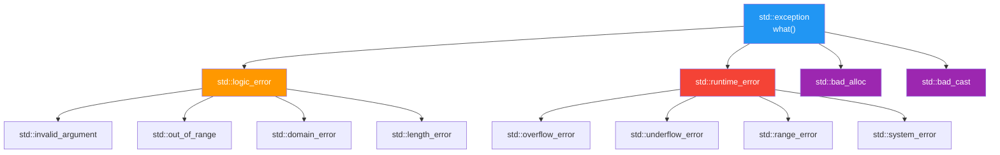
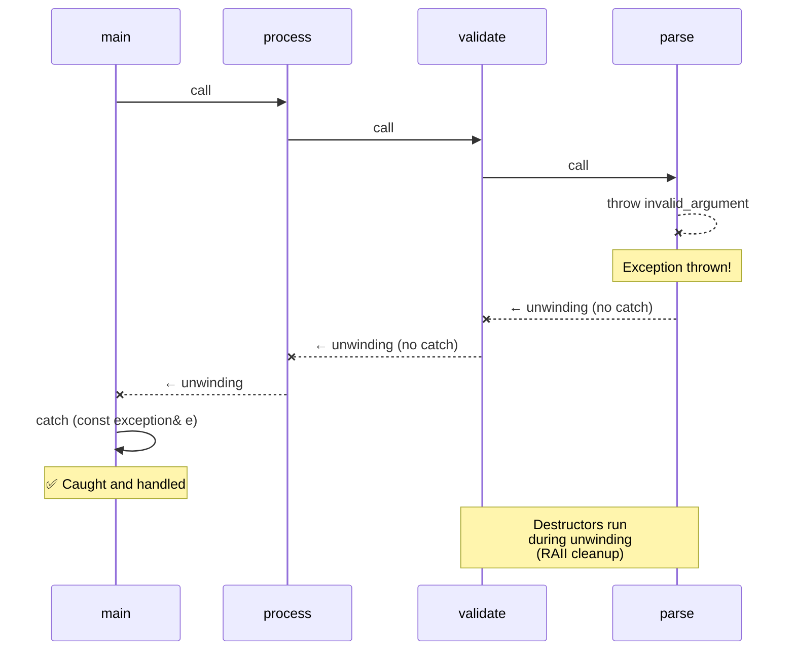

# Chapter 12: Error Handling

> **Tags:** `exceptions` `try-catch` `noexcept` `RAII` `error-codes` `std::optional` `std::expected`
> **Prerequisites:** Chapter 9 (Dynamic Memory / RAII), Chapter 10 (Structs & Enums)
> **Estimated Time:** 3–4 hours

---

## Theory

Every non-trivial program must handle errors: files that don't exist, network connections
that drop, memory that runs out, user input that's invalid. C++ offers multiple error-
handling strategies, each with tradeoffs:

1. **Exceptions** (`try`/`catch`/`throw`) — the standard C++ mechanism. Errors propagate
   automatically up the call stack until caught. Combined with RAII, exceptions guarantee
   resource cleanup without explicit error checking at every level.

2. **Error codes** — the C tradition. Functions return a status code; callers check it.
   Simple, predictable, no hidden control flow — but error handling pollutes business logic
   and is easy to ignore.

3. **`std::optional<T>`** (C++17) — represents "a value or nothing." Perfect for functions
   that might not produce a result (lookup, parse).

4. **`std::expected<T, E>`** (C++23) — represents "a value or an error." Combines the
   benefits of error codes (explicit checking) with type safety and composability.

The modern C++ consensus: use exceptions for truly exceptional, rare failures; use
`std::optional` / `std::expected` for expected error conditions in performance-critical
paths.

---

## What / Why / How

### What
Error handling mechanisms determine how a program detects, reports, and recovers from
failures.

### Why
- **Robustness** — handle failures gracefully instead of crashing.
- **Separation of concerns** — separate error handling from business logic.
- **Resource safety** — ensure cleanup even when errors occur (RAII + exceptions).
- **Clarity** — make error paths explicit and readable.

### How
```cpp
// Exceptions
try {
    auto data = read_file("config.json");
} catch (const std::exception& e) {
    std::cerr << "Error: " << e.what() << '\n';
}

// std::optional
std::optional<int> result = find_user(42);
if (result) use(*result);
```

---

## Code Examples

### Example 1 — Basic Exception Handling

```cpp
// basic_exceptions.cpp
#include <iostream>
#include <stdexcept>
#include <string>

double divide(double a, double b) {
    if (b == 0.0) {
        throw std::invalid_argument("Division by zero");
    }
    return a / b;
}

int parse_positive_int(const std::string& s) {
    int val = std::stoi(s);  // may throw std::invalid_argument or std::out_of_range
    if (val < 0) {
        throw std::domain_error("Expected positive integer, got " + std::to_string(val));
    }
    return val;
}

int main() {
    // Catching specific exceptions
    try {
        std::cout << divide(10, 0) << '\n';
    } catch (const std::invalid_argument& e) {
        std::cerr << "Invalid argument: " << e.what() << '\n';
    }

    // Catching by base class
    try {
        int val = parse_positive_int("-5");
        std::cout << "Parsed: " << val << '\n';
    } catch (const std::exception& e) {
        std::cerr << "Error: " << e.what() << '\n';
    }

    // Multiple catch blocks
    try {
        int val = parse_positive_int("not_a_number");
        std::cout << val << '\n';
    } catch (const std::invalid_argument& e) {
        std::cerr << "Parse error: " << e.what() << '\n';
    } catch (const std::out_of_range& e) {
        std::cerr << "Overflow: " << e.what() << '\n';
    } catch (...) {
        std::cerr << "Unknown error\n";
    }

    return 0;
}
// Compile: g++ -std=c++17 -Wall -o basic_exc basic_exceptions.cpp
```

### Example 2 — RAII + Exceptions = Safe Resource Management

```cpp
// raii_exceptions.cpp
#include <iostream>
#include <fstream>
#include <stdexcept>
#include <vector>
#include <string>

class DatabaseConnection {
    std::string name_;
public:
    explicit DatabaseConnection(const std::string& name) : name_(name) {
        std::cout << "  [DB] Connected to " << name_ << '\n';
    }
    ~DatabaseConnection() {
        std::cout << "  [DB] Disconnected from " << name_ << '\n';
    }
    void query(const std::string& sql) {
        if (sql.empty()) throw std::runtime_error("Empty SQL query");
        std::cout << "  [DB] Executing: " << sql << '\n';
    }
};

void process_data() {
    DatabaseConnection db("production");   // RAII — auto cleanup
    std::vector<int> buffer(1000);         // RAII — auto cleanup

    db.query("SELECT * FROM users");

    // Simulate an error deep in processing
    throw std::runtime_error("Network timeout");

    // db and buffer are STILL properly cleaned up via stack unwinding
    db.query("UPDATE stats SET ...");  // never reached
}

int main() {
    std::cout << "Starting...\n";
    try {
        process_data();
    } catch (const std::exception& e) {
        std::cerr << "Caught: " << e.what() << '\n';
    }
    std::cout << "Finished — all resources cleaned up\n";
    return 0;
}
```

### Example 3 — noexcept Specification

```cpp
// noexcept_demo.cpp
#include <iostream>
#include <vector>

// noexcept tells compiler and callers this function won't throw
int safe_add(int a, int b) noexcept {
    return a + b;
}

// Conditional noexcept
template<typename T>
void swap_items(T& a, T& b) noexcept(noexcept(T(std::move(a)))) {
    T temp = std::move(a);
    a = std::move(b);
    b = std::move(temp);
}

// Move operations SHOULD be noexcept — enables std::vector optimization
struct FastBuffer {
    int* data_ = nullptr;
    size_t size_ = 0;

    FastBuffer() = default;
    explicit FastBuffer(size_t n) : data_(new int[n]{}), size_(n) {}

    // noexcept move — vector::push_back will MOVE instead of COPY
    FastBuffer(FastBuffer&& other) noexcept
        : data_(other.data_), size_(other.size_) {
        other.data_ = nullptr;
        other.size_ = 0;
    }

    FastBuffer& operator=(FastBuffer&& other) noexcept {
        if (this != &other) {
            delete[] data_;
            data_ = other.data_;
            size_ = other.size_;
            other.data_ = nullptr;
            other.size_ = 0;
        }
        return *this;
    }

    ~FastBuffer() { delete[] data_; }

    // Delete copy to keep example simple
    FastBuffer(const FastBuffer&) = delete;
    FastBuffer& operator=(const FastBuffer&) = delete;
};

int main() {
    std::cout << "safe_add is noexcept: " << noexcept(safe_add(1, 2)) << '\n';

    std::vector<FastBuffer> buffers;
    buffers.push_back(FastBuffer(100));  // moves because noexcept
    buffers.push_back(FastBuffer(200));  // reallocation moves existing elements

    std::cout << "Buffers stored: " << buffers.size() << '\n';
    return 0;
}
```

### Example 4 — Error Codes vs Exceptions

```cpp
// error_codes_vs_exceptions.cpp
#include <iostream>
#include <string>
#include <system_error>

// === Approach 1: Error Codes ===
enum class ParseError { None, InvalidFormat, OutOfRange, Empty };

struct ParseResult {
    int value;
    ParseError error;
};

ParseResult parse_int_ec(const std::string& s) {
    if (s.empty()) return {0, ParseError::Empty};
    try {
        size_t pos;
        int val = std::stoi(s, &pos);
        if (pos != s.size()) return {0, ParseError::InvalidFormat};
        return {val, ParseError::None};
    } catch (...) {
        return {0, ParseError::InvalidFormat};
    }
}

// === Approach 2: Exceptions ===
int parse_int_exc(const std::string& s) {
    if (s.empty()) throw std::invalid_argument("Empty string");
    size_t pos;
    int val = std::stoi(s, &pos);
    if (pos != s.size()) throw std::invalid_argument("Trailing chars");
    return val;
}

int main() {
    // Error code style — explicit checking
    auto [val1, err1] = parse_int_ec("42");
    if (err1 == ParseError::None) {
        std::cout << "EC: Parsed " << val1 << '\n';
    }

    auto [val2, err2] = parse_int_ec("abc");
    if (err2 != ParseError::None) {
        std::cout << "EC: Parse failed\n";
    }

    // Exception style — cleaner happy path
    try {
        int val = parse_int_exc("42");
        std::cout << "EXC: Parsed " << val << '\n';
    } catch (const std::exception& e) {
        std::cerr << "EXC: " << e.what() << '\n';
    }

    return 0;
}
```

### Example 5 — std::optional (C++17)

```cpp
// optional_demo.cpp
#include <iostream>
#include <optional>
#include <string>
#include <map>

class UserDatabase {
    std::map<int, std::string> users_ = {
        {1, "Alice"}, {2, "Bob"}, {3, "Charlie"}
    };

public:
    // Returns the user name, or nothing if not found
    std::optional<std::string> find_user(int id) const {
        auto it = users_.find(id);
        if (it != users_.end()) {
            return it->second;
        }
        return std::nullopt;  // "no value"
    }
};

std::optional<int> safe_divide(int a, int b) {
    if (b == 0) return std::nullopt;
    return a / b;
}

int main() {
    UserDatabase db;

    // Method 1: Check with has_value() / operator bool
    auto user = db.find_user(1);
    if (user) {
        std::cout << "Found: " << *user << '\n';
    }

    // Method 2: value_or() for default
    std::cout << "User 99: "
              << db.find_user(99).value_or("(not found)") << '\n';

    // Method 3: value() throws std::bad_optional_access if empty
    try {
        std::cout << db.find_user(99).value() << '\n';
    } catch (const std::bad_optional_access& e) {
        std::cerr << "No value: " << e.what() << '\n';
    }

    // With safe_divide
    auto result = safe_divide(10, 3);
    if (result) std::cout << "10/3 = " << *result << '\n';

    auto bad = safe_divide(10, 0);
    if (!bad) std::cout << "10/0 = undefined\n";

    return 0;
}
```

### Example 6 — std::expected (C++23)

```cpp
// expected_demo.cpp  (requires C++23 or <tl/expected.hpp> for older compilers)
#include <iostream>
#include <string>
#include <cmath>

#if __has_include(<expected>)
#include <expected>
#else
// Simplified polyfill for demonstration
#include <variant>
namespace std {
    template<typename T, typename E>
    class expected {
        std::variant<T, E> data_;
    public:
        expected(T val) : data_(std::move(val)) {}
        struct unexpected_tag {};
        expected(unexpected_tag, E err) : data_(std::move(err)) {}
        bool has_value() const { return data_.index() == 0; }
        explicit operator bool() const { return has_value(); }
        T& value() { return std::get<0>(data_); }
        E& error() { return std::get<1>(data_); }
        T& operator*() { return value(); }
    };
    template<typename E>
    struct unexpected { E error; };
}
#endif

enum class MathError { DivisionByZero, NegativeSqrt, Overflow };

std::string to_string(MathError e) {
    switch (e) {
        case MathError::DivisionByZero: return "Division by zero";
        case MathError::NegativeSqrt:   return "Negative sqrt";
        case MathError::Overflow:        return "Overflow";
    }
    return "Unknown";
}

std::expected<double, MathError> safe_sqrt(double x) {
    if (x < 0) return std::unexpected(MathError::NegativeSqrt);
    return std::sqrt(x);
}

std::expected<double, MathError> safe_divide(double a, double b) {
    if (b == 0.0) return std::unexpected(MathError::DivisionByZero);
    return a / b;
}

int main() {
    auto result = safe_sqrt(25.0);
    if (result) {
        std::cout << "sqrt(25) = " << *result << '\n';
    }

    auto bad = safe_sqrt(-1.0);
    if (!bad) {
        std::cerr << "Error: " << to_string(bad.error()) << '\n';
    }

    auto div = safe_divide(10.0, 3.0);
    if (div) {
        std::cout << "10/3 = " << *div << '\n';
    }

    return 0;
}
// Compile: g++ -std=c++23 -Wall -o expected expected_demo.cpp
```

---

## Mermaid Diagrams

### std::exception Hierarchy



### Exception Propagation



---

## Error Handling Tradeoff Table

| Aspect | Exceptions | Error Codes | `std::optional` | `std::expected` |
|--------|:-:|:-:|:-:|:-:|
| **Happy path clarity** | ✅ Clean | ❌ Cluttered | ✅ Clean | ✅ Clean |
| **Can't be ignored** | ✅ Propagates | ❌ Easy to skip | ⚠️ Check needed | ⚠️ Check needed |
| **Performance (error)** | ❌ Slow | ✅ Fast | ✅ Fast | ✅ Fast |
| **Performance (no error)** | ✅ Zero-cost* | ✅ Fast | ✅ Fast | ✅ Fast |
| **Error context** | ✅ Rich | ⚠️ Limited | ❌ None | ✅ Typed error |
| **Composable** | ⚠️ Try/catch | ❌ Manual | ✅ Monadic | ✅ Monadic |
| **Usable in `noexcept`** | ❌ | ✅ | ✅ | ✅ |

*Exceptions have zero overhead on the happy path but significant overhead when thrown.

---

## Practical Exercises

### 🟢 Exercise 1 — Safe Division
Write a function `double safe_div(double a, double b)` that throws `std::invalid_argument`
when `b == 0`. Call it from `main()` with proper try/catch.

### 🟢 Exercise 2 — Optional Find
Write `std::optional<int> find_index(const std::vector<int>& v, int target)` that returns
the index if found, or `std::nullopt`.

### 🟡 Exercise 3 — Custom Exception
Create a `FileError` class deriving from `std::runtime_error` with an additional `path()`
method. Throw and catch it.

### 🟡 Exercise 4 — noexcept Move
Write a `DynString` class with a `noexcept` move constructor. Verify that `std::vector`
moves it during reallocation.

### 🔴 Exercise 5 — Expected Pipeline
Using `std::expected` (or a polyfill), chain three operations: parse a string to int,
validate it's positive, compute its square root. Propagate errors through the chain.

---

## Solutions

### Solution 1

```cpp
#include <iostream>
#include <stdexcept>

double safe_div(double a, double b) {
    if (b == 0.0) throw std::invalid_argument("Division by zero");
    return a / b;
}

int main() {
    try {
        std::cout << safe_div(10.0, 3.0) << '\n';
        std::cout << safe_div(10.0, 0.0) << '\n';
    } catch (const std::invalid_argument& e) {
        std::cerr << "Error: " << e.what() << '\n';
    }
}
```

### Solution 2

```cpp
#include <iostream>
#include <optional>
#include <vector>

std::optional<int> find_index(const std::vector<int>& v, int target) {
    for (int i = 0; i < static_cast<int>(v.size()); ++i) {
        if (v[i] == target) return i;
    }
    return std::nullopt;
}

int main() {
    std::vector<int> data = {10, 20, 30, 40, 50};

    auto idx = find_index(data, 30);
    if (idx) {
        std::cout << "Found at index " << *idx << '\n';
    }

    auto missing = find_index(data, 99);
    std::cout << "99 found? " << missing.has_value() << '\n';
}
```

### Solution 3

```cpp
#include <iostream>
#include <stdexcept>
#include <string>

class FileError : public std::runtime_error {
    std::string path_;
public:
    FileError(const std::string& msg, const std::string& path)
        : std::runtime_error(msg + ": " + path), path_(path) {}

    const std::string& path() const noexcept { return path_; }
};

void open_file(const std::string& path) {
    throw FileError("File not found", path);
}

int main() {
    try {
        open_file("/etc/nonexistent.conf");
    } catch (const FileError& e) {
        std::cerr << "FileError: " << e.what() << '\n';
        std::cerr << "Path: " << e.path() << '\n';
    }
}
```

### Solution 4

```cpp
#include <iostream>
#include <vector>
#include <cstring>
#include <utility>

class DynString {
    char* data_ = nullptr;
    size_t len_ = 0;

public:
    DynString() = default;

    explicit DynString(const char* s) : len_(std::strlen(s)) {
        data_ = new char[len_ + 1];
        std::memcpy(data_, s, len_ + 1);
    }

    // noexcept move constructor
    DynString(DynString&& other) noexcept
        : data_(other.data_), len_(other.len_) {
        other.data_ = nullptr;
        other.len_ = 0;
        std::cout << "  [Move ctor]\n";
    }

    DynString& operator=(DynString&& other) noexcept {
        if (this != &other) {
            delete[] data_;
            data_ = other.data_;
            len_ = other.len_;
            other.data_ = nullptr;
            other.len_ = 0;
        }
        return *this;
    }

    ~DynString() { delete[] data_; }

    DynString(const DynString&) = delete;
    DynString& operator=(const DynString&) = delete;

    const char* c_str() const { return data_ ? data_ : ""; }
};

int main() {
    std::vector<DynString> v;
    v.reserve(1);  // force reallocation on second push

    v.push_back(DynString("First"));
    std::cout << "Adding second (triggers reallocation):\n";
    v.push_back(DynString("Second"));  // existing element is MOVED (not copied)

    for (const auto& s : v) std::cout << s.c_str() << '\n';
}
```

### Solution 5

```cpp
#include <iostream>
#include <optional>
#include <string>
#include <cmath>
#include <variant>

// Simplified expected for pre-C++23
template<typename T, typename E>
struct Expected {
    std::variant<T, E> data;
    Expected(T val) : data(std::move(val)) {}
    Expected(E err, bool) : data(std::move(err)) {}
    bool ok() const { return data.index() == 0; }
    T& value() { return std::get<0>(data); }
    E& error() { return std::get<1>(data); }
};

template<typename T, typename E>
Expected<T, E> make_error(E err) { return Expected<T, E>(std::move(err), true); }

using Result = Expected<double, std::string>;

Result parse(const std::string& s) {
    try { return std::stod(s); }
    catch (...) { return make_error<double, std::string>("Parse error: " + s); }
}

Result validate_positive(double v) {
    if (v < 0) return make_error<double, std::string>("Negative value");
    return v;
}

Result compute_sqrt(double v) {
    return std::sqrt(v);
}

int main() {
    auto pipeline = [](const std::string& input) -> Result {
        auto r1 = parse(input);
        if (!r1.ok()) return make_error<double, std::string>(r1.error());
        auto r2 = validate_positive(r1.value());
        if (!r2.ok()) return make_error<double, std::string>(r2.error());
        return compute_sqrt(r2.value());
    };

    auto r = pipeline("25");
    if (r.ok()) std::cout << "sqrt(25) = " << r.value() << '\n';

    auto bad = pipeline("-4");
    if (!bad.ok()) std::cerr << "Error: " << bad.error() << '\n';

    auto nan = pipeline("abc");
    if (!nan.ok()) std::cerr << "Error: " << nan.error() << '\n';
}
```

---

## Quiz

**Q1.** Exceptions propagate until:
a) The program crashes  b) A matching `catch` is found  c) The OS handles it  d) `main()` returns

**Q2.** `noexcept` on a move constructor enables:
a) Faster exceptions  b) `std::vector` to move instead of copy on reallocation
c) Compile-time error checking  d) Nothing useful

**Q3.** `std::optional<T>` represents:
a) A nullable pointer  b) A value or nothing  c) An error or a value  d) A smart pointer

**Q4.** Which catch should come first?
a) `catch (const std::exception&)`  b) `catch (const std::runtime_error&)`

**Q5.** RAII helps with exceptions because:
a) It prevents exceptions  b) Destructors run during stack unwinding
c) It catches all exceptions  d) It makes code noexcept

**Q6.** `std::expected<T, E>` (C++23) is similar to:
a) `std::optional`  b) Rust's `Result<T, E>`  c) `std::variant`  d) `std::any`

**Q7.** If a `noexcept` function throws, the program:
a) Catches it silently  b) Calls `std::terminate`  c) Ignores it  d) Unwinds the stack

**Answers:** Q1-b, Q2-b, Q3-b, Q4-b (more specific first), Q5-b, Q6-b, Q7-b

---

## Key Takeaways

- **Exceptions** are for exceptional conditions; they propagate automatically and are
  impossible to ignore.
- **RAII + exceptions** = safe resource management without explicit cleanup code.
- **`noexcept`** on move operations is critical — it enables `std::vector` optimizations.
- **Error codes** are appropriate for performance-critical hot paths and C interop.
- **`std::optional`** is for "might not have a value" — not for errors.
- **`std::expected`** (C++23) is the modern alternative to error codes — typed, composable.
- Catch exceptions **by const reference** (`const std::exception&`).
- Order catch blocks **most specific first**.

---

## Chapter Summary

C++ provides a rich toolkit for error handling. Exceptions offer automatic propagation and,
combined with RAII, guarantee resource cleanup even in the face of errors. The `noexcept`
specifier is critical for enabling move optimizations and documenting no-throw guarantees.
For cases where exceptions are too heavy or errors are expected and frequent, `std::optional`
(C++17) and `std::expected` (C++23) provide lightweight, type-safe alternatives. The right
choice depends on the context: exceptions for rare failures, `optional`/`expected` for
expected error conditions, and error codes for C interop and hard real-time systems.

---

## Real-World Insight

- **Google's C++ Style Guide** historically banned exceptions (legacy constraint); they use
  error codes and `absl::StatusOr<T>` (their version of `std::expected`).
- **Bloomberg** and **most financial systems** use exceptions extensively with RAII.
- **Game engines** (EA's EASTL) often disable exceptions for performance predictability.
- **Embedded/safety-critical systems** (automotive, aerospace) may ban exceptions due to
  certification requirements (MISRA C++).
- **Rust's `Result<T, E>`** directly inspired C++23's `std::expected<T, E>`.

---

## Common Mistakes

| # | Mistake | Fix |
|---|---------|-----|
| 1 | **Catching by value** — slices derived exceptions | Always catch by `const T&` |
| 2 | **Catch-all before specific catches** — unreachable handlers | Order: most derived first, base last |
| 3 | **Missing `noexcept` on move ops** — vector copies instead of moves | Always mark move ctor/assign `noexcept` |
| 4 | **Using exceptions for control flow** — throwing in tight loops | Use `optional`/`expected` for expected failures |
| 5 | **Ignoring `std::optional` emptiness** — dereferencing nullopt | Always check `has_value()` or use `value_or()` |

---

## Interview Questions

### Q1: When should you use exceptions vs error codes?

**Model Answer:**
Use exceptions for **rare, truly exceptional** conditions (file not found, out of memory,
network failure) where you want automatic propagation and RAII cleanup. Use error codes
(or `std::expected`) for **frequent, expected** conditions in hot paths where exception
overhead is unacceptable, or when interfacing with C code. In practice, most C++ codebases
use exceptions; Google is a notable exception.

### Q2: What happens if a `noexcept` function throws?

**Model Answer:**
The runtime calls `std::terminate()`, which by default calls `std::abort()`. The stack is
NOT unwound — destructors may NOT run. This is by design: `noexcept` is a hard guarantee
that the function won't throw, and violating it is a programming error, not a recoverable
condition.

### Q3: Explain how RAII makes exception handling safe.

**Model Answer:**
RAII ties resource acquisition to object construction and release to destruction. When an
exception is thrown, the runtime performs **stack unwinding** — all local objects with
automatic storage duration have their destructors called. This means RAII objects (smart
pointers, containers, lock guards, file streams) automatically release their resources,
preventing leaks without explicit try/finally blocks.

### Q4: What is `std::expected` and how does it differ from `std::optional`?

**Model Answer:**
`std::optional<T>` represents "a T or nothing" — it doesn't carry error information.
`std::expected<T, E>` (C++23) represents "a T or an error of type E" — it's a discriminated
union that carries either the success value or a typed error. It's inspired by Rust's
`Result<T, E>` and is ideal for functions that can fail in documented ways without using
exceptions. It supports monadic operations like `and_then`, `transform`, and `or_else`.

### Q5: Why should you catch exceptions by const reference?

**Model Answer:**
Catching by **value** slices the exception — if a `derived_error` is thrown and you catch
`std::exception` by value, the derived part is lost. Catching by **reference** preserves
polymorphism so `what()` returns the correct message. The `const` qualifier signals you
won't modify the exception and enables catching temporaries.
