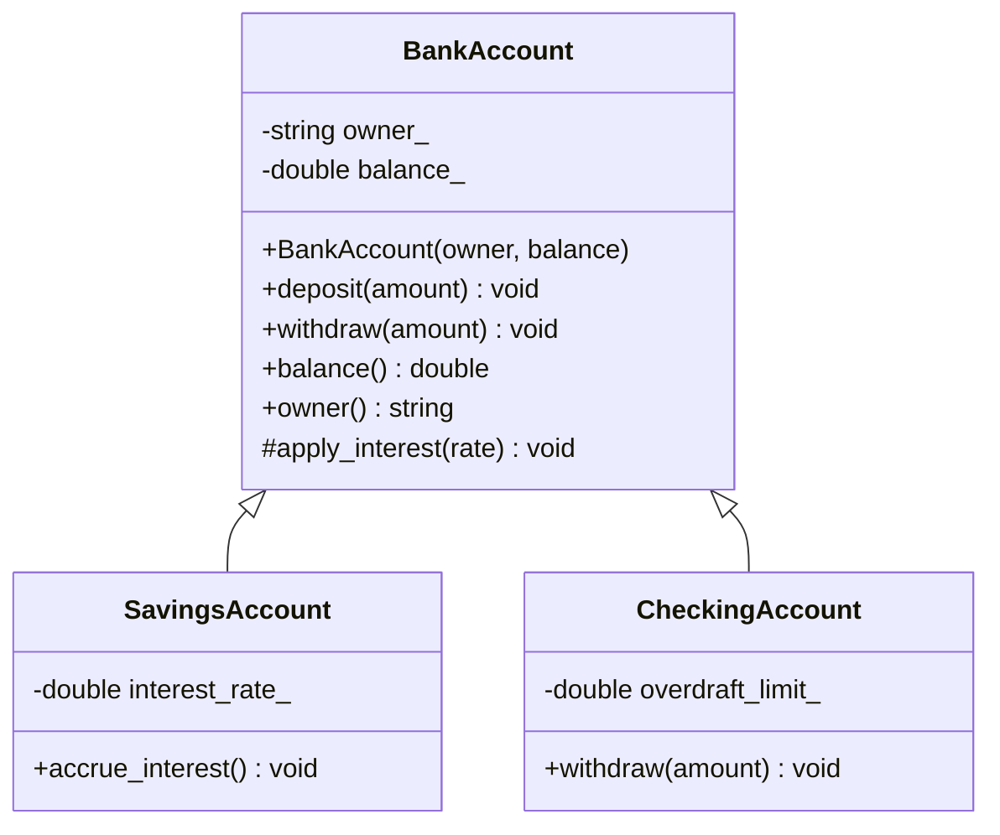
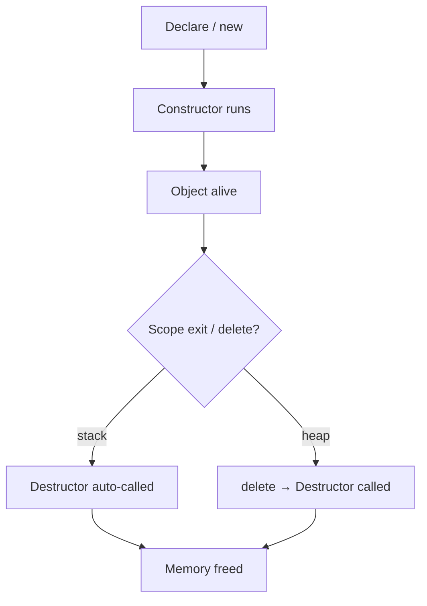

# Chapter 13 — Object-Oriented Programming: Classes

> **Tags:** #cpp #oop #classes #constructors #destructors #encapsulation #static #friend #this-pointer

---

## 1. Theory — OOP and Classes in C++

Object-Oriented Programming organizes software around **objects** — bundles of state (data members) and behaviour (member functions) that model real-world entities. C++ was among the first mainstream languages to add OOP on top of systems programming, and its class system remains one of the most powerful available.

### Core Pillars of OOP

| Pillar | Meaning | C++ Mechanism |
|---|---|---|
| **Encapsulation** | Hiding internal state behind a public interface | `private` / `protected` / `public` |
| **Abstraction** | Exposing only what is necessary | Pure virtual functions, abstract classes |
| **Inheritance** | Reusing and extending existing classes | `class Derived : public Base` |
| **Polymorphism** | One interface, many implementations | Virtual functions, templates |

This chapter focuses on **encapsulation** through classes — the foundation for every other pillar.

In C++ the only difference between `struct` and `class` is the **default access level**: `struct` defaults to `public`, `class` defaults to `private`. By convention, use `class` when you need invariants and `struct` for passive data aggregates.

> **Note:** C++ Core Guidelines (C.2): *"Use `class` if the class has an invariant; use `struct` if the data members can vary independently."*

---

## 2. What / Why / How

**What:** A class is a user-defined type bundling data members and member functions. An object is a concrete instance occupying memory at runtime.

**Why use classes?**
1. **Encapsulation** — enforce invariants so callers cannot corrupt internal state.
2. **Abstraction** — provide a clean public API, hide implementation.
3. **Code reuse** — compose objects, inherit behaviour, template over types.
4. **Maintainability** — implementation changes don't break external code.

**How they work:** The compiler allocates storage for each non-static data member in declaration order, pads for alignment, and generates special member functions per well-defined rules. Member functions receive a hidden `this` pointer — they are *not* stored inside the object.

---

## 3. Class Definition with Access Specifiers

```cpp
#pragma once
#include <string>
#include <stdexcept>

class BankAccount {
public:
    BankAccount(std::string owner, double balance);
    void deposit(double amount);
    void withdraw(double amount);
    [[nodiscard]] double      balance() const;
    [[nodiscard]] std::string owner()   const;

protected:
    void apply_interest(double rate);

private:
    std::string owner_;
    double      balance_;
};
```

| Specifier | Same class | Derived | Outside |
|-----------|:---:|:---:|:---:|
| `public` | ✅ | ✅ | ✅ |
| `protected` | ✅ | ✅ | ❌ |
| `private` | ✅ | ❌ | ❌ |

> **Note:** Data members should almost always be `private`. Prefer providing `protected` *methods* over exposing raw data to derived classes.

---

## 4. Constructors

### 4.1 Default Constructor

```cpp
class Sensor {
public:
    Sensor() = default;
    [[nodiscard]] int reading() const { return reading_; }
private:
    int  reading_ = 0;   // in-class member initializer (C++11)
    bool active_  = false;
};
```

### 4.2 Parameterized Constructor

```cpp
class Point {
public:
    Point(double x, double y) : x_{x}, y_{y} {}
    [[nodiscard]] double x() const { return x_; }
    [[nodiscard]] double y() const { return y_; }
private:
    double x_, y_;
};
```

### 4.3 Delegating Constructor (C++11)

```cpp
class Rectangle {
public:
    Rectangle(double w, double h) : width_{w}, height_{h} {
        if (w <= 0 || h <= 0)
            throw std::invalid_argument("Dimensions must be positive");
    }
    Rectangle(double side) : Rectangle(side, side) {}  // delegate for square
    [[nodiscard]] double area() const { return width_ * height_; }
private:
    double width_, height_;
};
```

> **Note:** A delegating constructor **cannot** also have its own member-initializer list — the target handles all initialization.

---

## 5. Destructors

```cpp
#include <cstdio>
class FileHandle {
public:
    explicit FileHandle(const char* path) : fp_{std::fopen(path, "r")} {
        if (!fp_) throw std::runtime_error("Cannot open file");
    }
    ~FileHandle() { if (fp_) std::fclose(fp_); }
    FileHandle(const FileHandle&)            = delete;
    FileHandle& operator=(const FileHandle&) = delete;
private:
    std::FILE* fp_;
};
```

> **Note:** This is **RAII** (Resource Acquisition Is Initialization) — acquire in the constructor, release in the destructor. It is the most important idiom in C++.

---

## 6. Member Initializer Lists — Performance

```cpp
class Employee {
public:
    // ❌ BAD — default-constructs name_, then copy-assigns
    // Employee(std::string name, int id) { name_ = name; id_ = id; }

    // ✅ GOOD — direct move-constructs name_
    Employee(std::string name, int id) : name_{std::move(name)}, id_{id} {}
private:
    std::string name_;
    int id_;
};
```

For non-trivial types (`std::string`, `std::vector`), the initializer list avoids an extra default-construction + assignment. Members initialize in **declaration order**, not initializer-list order — mismatched order causes bugs (`-Wreorder` warns).

---

## 7. The `this` Pointer

```cpp
class Counter {
public:
    Counter& increment() { ++count_; return *this; }  // enables chaining
    Counter& reset()     { count_ = 0; return *this; }
    [[nodiscard]] int value() const { return count_; }
private:
    int count_ = 0;
};
// Usage: Counter c; c.increment().increment().increment();  // value() == 3
```

Common uses: disambiguating names, returning `*this` for fluent APIs, passing the current object to callbacks.

---

## 8. `const` Member Functions

```cpp
class Temperature {
public:
    explicit Temperature(double c) : celsius_{c} {}
    [[nodiscard]] double celsius()    const { return celsius_; }
    [[nodiscard]] double fahrenheit() const { return celsius_ * 9.0/5.0 + 32.0; }
    void set(double c) { celsius_ = c; }
private:
    double celsius_;
};
```

A `const` object can **only** call `const` member functions. Forgetting `const` on getters breaks const-correctness throughout the codebase.

---

## 9. `static` Members and Methods

```cpp
class Widget {
public:
    Widget()  { ++count_; }
    ~Widget() { --count_; }
    static int count() { return count_; }
private:
    static inline int count_ = 0;  // inline since C++17
};
```

Static data is shared across all instances. Static methods have **no `this` pointer** — they cannot access non-static members. Use them for factory methods and utilities:

```cpp
class IdGenerator {
public:
    static int next() { static int id = 0; return ++id; }
};
```

---

## 10. `friend` Functions and Classes

```cpp
#include <iostream>
class Vector2D {
public:
    Vector2D(double x, double y) : x_{x}, y_{y} {}
    friend std::ostream& operator<<(std::ostream& os, const Vector2D& v);
    friend Vector2D operator+(const Vector2D& a, const Vector2D& b);
private:
    double x_, y_;
};

std::ostream& operator<<(std::ostream& os, const Vector2D& v) {
    return os << '(' << v.x_ << ", " << v.y_ << ')';
}
Vector2D operator+(const Vector2D& a, const Vector2D& b) {
    return {a.x_ + b.x_, a.y_ + b.y_};
}
```

```cpp
class Car {
    friend class Engine;
private:
    int fuel_ = 100;
};
class Engine {
public:
    void burn(Car& c, int amt) { c.fuel_ -= amt; }  // OK — friend
};
```

> **Note:** Friendship is **not transitive** and **not inherited**. Use sparingly.

---

## 11. Mermaid Diagrams





---

## 12. Complete Example

```cpp
#include <iostream>
#include <string>
#include <stdexcept>

class Student {
public:
    Student() : Student("Unknown", 0) {}
    Student(std::string name, int age)
        : name_{std::move(name)}, age_{age}, id_{next_id()} {
        if (age_ < 0) throw std::invalid_argument("Negative age");
        ++total_;
    }
    ~Student() { --total_; }

    [[nodiscard]] std::string name() const { return name_; }
    [[nodiscard]] int age()  const { return age_; }
    [[nodiscard]] int id()   const { return id_; }
    static int total() { return total_; }

    friend std::ostream& operator<<(std::ostream& os, const Student& s) {
        return os << "[#" << s.id_ << "] " << s.name_ << " (age " << s.age_ << ')';
    }
private:
    std::string name_; int age_; int id_;
    static inline int total_ = 0;
    static int next_id() { static int c = 0; return ++c; }
};

int main() {
    Student a{"Alice", 22}, b{"Bob", 25}, u;
    std::cout << a << '\n' << b << '\n' << u << '\n';
    std::cout << "Total: " << Student::total() << '\n';
}
```

Output: `[#1] Alice (age 22)` / `[#2] Bob (age 25)` / `[#3] Unknown (age 0)` / `Total: 3`

---

## 13. Exercises

### 🟢 Easy — Circle Class
Create a `Circle` with private `radius_`, constructor validating `radius > 0`, `const` methods `area()` and `circumference()`, and a `friend operator<<` printing `Circle(r=3.5)`.

### 🟡 Medium — InventoryItem with Static Counter
Design `InventoryItem` with `name_`, `quantity_`, `price_`, auto-generated `sku_`. Add `static total_items()`, a delegating constructor, and `restock(int)` returning `*this` for chaining.

### 🔴 Hard — Matrix2x2
Implement `Matrix2x2` with `double data_[2][2]`, constructor from four doubles, `const` methods `at()`, `determinant()`, `trace()`, friend `operator+`, `operator*` (matrix multiply), `operator<<`, and `static identity()`.

---

## 14. Solutions

<details>
<summary>🟢 Circle Solution</summary>

```cpp
#include <iostream>
#include <numbers>
#include <stdexcept>

class Circle {
public:
    explicit Circle(double r) : radius_{r} {
        if (r <= 0) throw std::invalid_argument("Radius must be positive");
    }
    [[nodiscard]] double radius()        const { return radius_; }
    [[nodiscard]] double area()          const { return std::numbers::pi * radius_ * radius_; }
    [[nodiscard]] double circumference() const { return 2.0 * std::numbers::pi * radius_; }
    friend std::ostream& operator<<(std::ostream& os, const Circle& c) {
        return os << "Circle(r=" << c.radius_ << ')';
    }
private:
    double radius_;
};

int main() {
    Circle c1{3.5}, c2{1.0};
    std::cout << c1 << " area=" << c1.area() << '\n';
    std::cout << c2 << " area=" << c2.area() << '\n';
}
```
</details>

<details>
<summary>🟡 InventoryItem Solution</summary>

```cpp
#include <iostream>
#include <string>

class InventoryItem {
public:
    InventoryItem(std::string name, int qty, double price)
        : name_{std::move(name)}, quantity_{qty}, price_{price}, sku_{next_sku_()} {
        ++live_;
    }
    InventoryItem(std::string name) : InventoryItem(std::move(name), 0, 0.0) {}
    ~InventoryItem() { --live_; }

    InventoryItem& restock(int qty) { quantity_ += qty; return *this; }
    static int total_items() { return live_; }

    friend std::ostream& operator<<(std::ostream& os, const InventoryItem& i) {
        return os << "[SKU " << i.sku_ << "] " << i.name_
                  << " qty=" << i.quantity_ << " $" << i.price_;
    }
private:
    std::string name_; int quantity_; double price_; int sku_;
    static inline int live_ = 0;
    static int next_sku_() { static int c = 1000; return ++c; }
};

int main() {
    InventoryItem w{"Widget", 10, 4.99}, g{"Gadget"};
    g.restock(5).restock(3);
    std::cout << w << '\n' << g << '\n';
    std::cout << "Live: " << InventoryItem::total_items() << '\n';
}
```
</details>

<details>
<summary>🔴 Matrix2x2 Solution</summary>

```cpp
#include <iostream>
#include <iomanip>
#include <stdexcept>

class Matrix2x2 {
public:
    Matrix2x2(double a, double b, double c, double d) : data_{{a,b},{c,d}} {}
    [[nodiscard]] double at(int r, int c) const {
        if (r<0||r>1||c<0||c>1) throw std::out_of_range("Index OOB");
        return data_[r][c];
    }
    [[nodiscard]] double determinant() const { return data_[0][0]*data_[1][1]-data_[0][1]*data_[1][0]; }
    [[nodiscard]] double trace() const { return data_[0][0]+data_[1][1]; }
    static Matrix2x2 identity() { return {1,0,0,1}; }

    friend Matrix2x2 operator+(const Matrix2x2& a, const Matrix2x2& b) {
        return {a.data_[0][0]+b.data_[0][0], a.data_[0][1]+b.data_[0][1],
                a.data_[1][0]+b.data_[1][0], a.data_[1][1]+b.data_[1][1]};
    }
    friend Matrix2x2 operator*(const Matrix2x2& a, const Matrix2x2& b) {
        return {a.data_[0][0]*b.data_[0][0]+a.data_[0][1]*b.data_[1][0],
                a.data_[0][0]*b.data_[0][1]+a.data_[0][1]*b.data_[1][1],
                a.data_[1][0]*b.data_[0][0]+a.data_[1][1]*b.data_[1][0],
                a.data_[1][0]*b.data_[0][1]+a.data_[1][1]*b.data_[1][1]};
    }
    friend std::ostream& operator<<(std::ostream& os, const Matrix2x2& m) {
        return os << "| " << m.data_[0][0] << " " << m.data_[0][1] << " |\n"
                  << "| " << m.data_[1][0] << " " << m.data_[1][1] << " |";
    }
private:
    double data_[2][2];
};

int main() {
    Matrix2x2 A{1,2,3,4}; auto I = Matrix2x2::identity();
    std::cout << "A:\n" << A << "\nA+I:\n" << (A+I) << "\nA*I:\n" << (A*I) << '\n';
    std::cout << "det=" << A.determinant() << " tr=" << A.trace() << '\n';
}
```
</details>

---

## 15. Quiz

**Q1.** What is the only difference between `struct` and `class` in C++?
<details><summary>Answer</summary>
Default access: `struct` → `public`, `class` → `private`. Everything else is identical.
</details>

**Q2.** Why prefer member-initializer lists over body assignment?
<details><summary>Answer</summary>
Initializer lists directly construct members; body assignment default-constructs first then assigns — two operations instead of one for non-trivial types.
</details>

**Q3.** In what order are members initialized?
<details><summary>Answer</summary>
Always in **declaration order** in the class body, regardless of initializer-list order. Use `-Wreorder` to catch mismatches.
</details>

**Q4.** Can a `const` member function modify a member?
<details><summary>Answer</summary>
Only if that member is declared `mutable` — used for caches, mutexes, and access counters that don't affect observable state.
</details>

**Q5.** What does a `static` member function lack?
<details><summary>Answer</summary>
No `this` pointer — it cannot access non-static members or call non-static methods.
</details>

**Q6.** Is friendship transitive or inherited?
<details><summary>Answer</summary>
Neither. A friend-of-a-friend is not a friend, and derived classes don't inherit base-class friendships.
</details>

**Q7.** What happens if you define a parameterized constructor but no default?
<details><summary>Answer</summary>
The compiler will **not** generate a default constructor. `MyClass obj;` becomes a compilation error. Add `MyClass() = default;` explicitly.
</details>

**Q8.** What is RAII?
<details><summary>Answer</summary>
Resource Acquisition Is Initialization — resources are acquired in the constructor and released in the destructor. C++ guarantees destructors run on scope exit, ensuring leak-free resource management even with exceptions.
</details>

---

## 16. Key Takeaways

- A **class** bundles data and behaviour; prefer `class` over `struct` when invariants exist.
- **Access specifiers** enforce encapsulation — data should be `private` by default.
- **Member-initializer lists** directly construct members — always prefer them.
- Members initialize in **declaration order**, not initializer-list order.
- **Delegating constructors** reduce duplication between overloads.
- **Destructors** power RAII — the most important C++ idiom.
- **`this`** enables method chaining and self-referencing.
- Mark non-mutating methods **`const`** — essential for const-correctness.
- **`static`** members belong to the class, not instances; use `inline` for in-header init.
- **`friend`** grants access but is not transitive or inherited — use judiciously.

---

## 17. Chapter Summary

Classes are the foundational building block of OOP in C++, enabling encapsulation of data and behaviour behind well-defined interfaces. Constructors (default, parameterized, delegating) control initialization, while destructors enable the RAII pattern for deterministic resource management. Member-initializer lists, `const` correctness, `static` members, and `friend` declarations complete the toolkit. Mastering these concepts is prerequisite for inheritance, polymorphism, and templates in subsequent chapters.

---

## 18. Real-World Insight

> **💡 Industry Insight — RAII in Production Systems**
>
> At Google, Meta, and per the C++ Core Guidelines by Stroustrup and Sutter, RAII is the **single most important C++ idiom**. Smart pointers (`unique_ptr`, `shared_ptr`), lock guards (`scoped_lock`), and file streams all follow RAII. Production C++ almost never uses raw `new`/`delete` — constructors and destructors manage every resource, making leaks structurally impossible. If you learn one thing from this chapter, let it be RAII.

---

## 19. Common Mistakes

| # | Mistake | Correction |
|---|---------|------------|
| 1 | Assigning in constructor body instead of init list | Use `: member_{val}` — avoids extra default-construct + assign |
| 2 | Init-list order ≠ declaration order | Match them; enable `-Wreorder` |
| 3 | Forgetting `const` on getters | Always mark non-mutating methods `const` |
| 4 | Making data members `public` | Keep data `private`; provide accessors |
| 5 | Overusing `friend` | Prefer public/protected interfaces |
| 6 | Forgetting `inline` on static members (pre-C++17) | Use `static inline` or define in `.cpp` |
| 7 | No self-assignment check in `operator=` | Use copy-and-swap idiom |
| 8 | Expecting default ctor after defining parameterized | Add `ClassName() = default;` explicitly |

---

## 20. Interview Questions

### Q1. Explain aggregation vs composition vs inheritance.
<details><summary>Answer</summary>

- **Inheritance** ("is-a"): Derived extends Base. `class Dog : public Animal`.
- **Composition** ("has-a", owns): Contains by value; inner destroyed with outer. `class Car { Engine e_; };`
- **Aggregation** ("has-a", uses): Holds pointer/reference; referred object may outlive container.

Prefer composition over inheritance for code reuse.
</details>

### Q2. What is the Rule of Zero vs Rule of Five?
<details><summary>Answer</summary>

**Rule of Five:** If you define any of destructor, copy ctor, copy-assign, move ctor, or move-assign, define all five. **Rule of Zero:** Design classes so none are needed — use RAII wrappers (`unique_ptr`, `string`, `vector`) and let compiler defaults work. Rule of Zero is preferred in modern C++.
</details>

### Q3. Why use `explicit` on single-argument constructors?
<details><summary>Answer</summary>

Without `explicit`, single-arg constructors enable implicit conversions — `f(42)` silently converts to `f(MyClass{42})`. This causes subtle bugs. `explicit` forces callers to make conversions visible and intentional.
</details>

### Q4. How does `mutable` interact with `const` methods?
<details><summary>Answer</summary>

A `mutable` member can be modified inside `const` methods. Used for caching, mutexes, and counters that don't affect observable state. Overuse is a code smell — reserve for truly invisible internal state.
</details>

### Q5. How does `static inline` (C++17) simplify class design?
<details><summary>Answer</summary>

Before C++17, static members needed a separate `.cpp` definition for ODR compliance. `static inline int count_ = 0;` allows definition directly in the header — the linker merges copies. This simplifies header-only libraries and eliminates boilerplate.
</details>

---

*End of Chapter 13 — Object-Oriented Programming: Classes*
