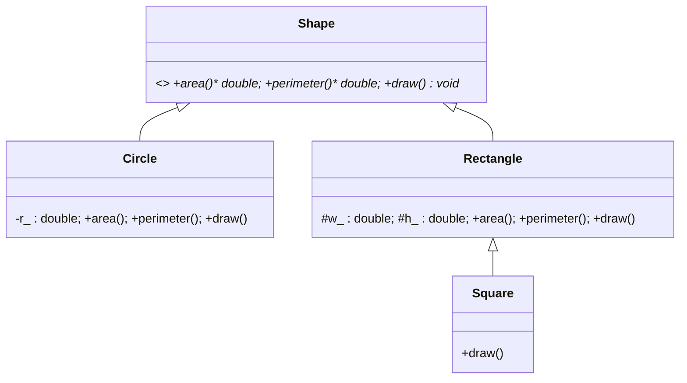
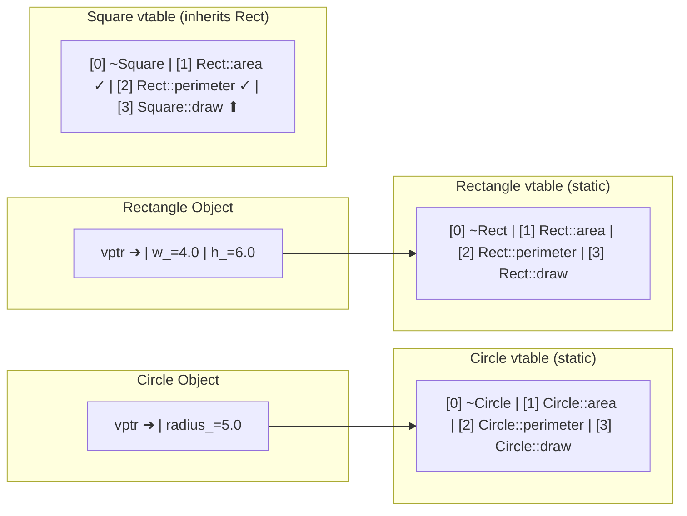

# Chapter 14 — Inheritance & Polymorphism

> **Tags:** #cpp #inheritance #polymorphism #vtable #virtual #abstract

---

## Theory

Inheritance lets a **derived** class acquire the members of a **base** class, forming an **is-a** relationship. A `Dog` *is-a* `Animal`; a `Circle` *is-a* `Shape`. This models taxonomies directly in code and enables **runtime polymorphism** — calling a function on a base pointer and having the correct derived implementation execute at run time.

C++ implements this through **virtual functions**. The compiler generates a **vtable** (array of function pointers) per polymorphic class. Every object carries a hidden **vptr** pointing to its class's vtable. A call through a base pointer indirects through vptr → vtable → function pointer, achieving **dynamic dispatch**.

Key concepts: **access control** (`public`/`protected`/`private` inheritance), **abstract classes** (pure virtual `= 0`), **multiple inheritance**, the **diamond problem**, and **virtual inheritance**.

> **Note:** Prefer composition over inheritance when the relationship is *has-a*. Use inheritance only for genuine *is-a* with polymorphic behavior.

---

## What / Why / How

| Aspect | Detail |
|--------|--------|
| **What** | Inheritance lets a derived class reuse and extend a base class. Polymorphism lets code written against a base type work with any derived type. |
| **Why** | Eliminates duplication, enables the open/closed principle, and powers plugin architectures, GUI frameworks, and game engines. |
| **How** | `class Derived : public Base` establishes inheritance. `virtual` enables dynamic dispatch via vtable. Pure virtuals (`= 0`) define interfaces. |

---

## Code Examples

### 1 — Single Inheritance with Access Control

```cpp
#include <iostream>
#include <string>

class Animal {
public:
    explicit Animal(std::string name) : name_(std::move(name)) {}
    virtual ~Animal() = default;

    const std::string& name() const { return name_; }
protected:
    int age_ = 0;                    // accessible in derived
private:
    std::string name_;               // hidden from derived
};

class Dog : public Animal {
public:
    using Animal::Animal;
    void set_age(int a) { age_ = a; }    // OK — protected
    void bark() const { std::cout << name() << " says Woof!\n"; }
};

int main() {
    Dog d("Rex");
    d.set_age(5);
    d.bark();
}
```

### 2 — Virtual Functions: Shape Hierarchy

```cpp
#include <cmath>
#include <iostream>
#include <memory>
#include <numbers>
#include <vector>

class Shape {
public:
    virtual ~Shape() = default;
    virtual double area()      const = 0;
    virtual double perimeter() const = 0;
    virtual void   draw()      const = 0;
    void print_info() const {
        draw();
        std::cout << "  Area=" << area() << "  Perim=" << perimeter() << '\n';
    }
};

class Circle final : public Shape {
    double r_;
public:
    explicit Circle(double r) : r_(r) {}
    double area()      const override { return std::numbers::pi * r_ * r_; }
    double perimeter() const override { return 2.0 * std::numbers::pi * r_; }
    void   draw()      const override { std::cout << "[Circle r=" << r_ << "]"; }
};

class Rectangle : public Shape {
protected:
    double w_, h_;
public:
    Rectangle(double w, double h) : w_(w), h_(h) {}
    double area()      const override { return w_ * h_; }
    double perimeter() const override { return 2.0 * (w_ + h_); }
    void   draw()      const override { std::cout << "[Rect " << w_ << "x" << h_ << "]"; }
};

class Square final : public Rectangle {
public:
    explicit Square(double s) : Rectangle(s, s) {}
    void draw() const override { std::cout << "[Square " << w_ << "]"; }
};

int main() {
    std::vector<std::unique_ptr<Shape>> shapes;
    shapes.push_back(std::make_unique<Circle>(5.0));
    shapes.push_back(std::make_unique<Rectangle>(4.0, 6.0));
    shapes.push_back(std::make_unique<Square>(3.0));
    for (const auto& s : shapes) s->print_info();
}
```

### 3 — How the vtable Works

When the compiler sees `virtual`, it generates a **vtable per class** and a hidden **vptr per object**.

1. `Shape`'s vtable: `{ __cxa_pure_virtual, __cxa_pure_virtual, __cxa_pure_virtual, &Shape::~Shape }` — pure slots abort if called.
2. `Circle`'s vtable **overrides** those: `{ &Circle::area, &Circle::perimeter, &Circle::draw, &Circle::~Circle }`.
3. Constructing a `Circle` sets the hidden vptr at offset 0 to `Circle`'s vtable.
4. `shape_ptr->area()` compiles to:

```
mov  rax, [shape_ptr]          ; load vptr
call [rax + OFFSET_OF_area]    ; indirect call through vtable
```

> **Note:** During construction, the vptr points to the *currently-being-constructed* class's vtable. Virtual calls in constructors dispatch to the current level, **not** the most-derived class.

### 4 — `override` and `final`

```cpp
class Base {
public:
    virtual ~Base() = default;
    virtual void process(int x) const;
    virtual void log() const;
};

class Derived : public Base {
public:
    void process(int x) const override;   // OK — matches signature
    // void process(double x) override;   // ERROR: doesn't override — bug caught!
    void log() const final;               // prevents further overriding
};

class Leaf final : public Derived {};     // no class can inherit from Leaf
// class Oops : public Leaf {};           // ERROR — Leaf is final
```

### 5 — Pure Virtual Functions & Interface Pattern

```cpp
class ISerializable {
public:
    virtual ~ISerializable() = default;
    virtual std::string serialize() const = 0;
    virtual void deserialize(const std::string& data) = 0;
};

class IDrawable {
public:
    virtual ~IDrawable() = default;
    virtual void draw() const = 0;
};

class Widget : public ISerializable, public IDrawable {
public:
    std::string serialize() const override { return "widget_data"; }
    void deserialize(const std::string&) override { /* parse */ }
    void draw() const override { std::cout << "Drawing widget\n"; }
};
```

### 6 — Multiple Inheritance & the Diamond Problem

```cpp
class Device { public: int id = 0; };
class Printer : public Device { public: void print() { std::cout << id; } };
class Scanner : public Device { public: void scan()  { std::cout << id; } };
class AllInOne : public Printer, public Scanner {};

int main() {
    AllInOne aio;
    // aio.id = 1;          // ERROR: ambiguous — two Device sub-objects
    aio.Printer::id = 1;    // must disambiguate
    aio.Scanner::id = 2;    // different copy!
}
```

### 7 — Virtual Inheritance Solves the Diamond

```cpp
class Device { public: int id = 0; };
class Printer : virtual public Device {};
class Scanner : virtual public Device {};
class AllInOne : public Printer, public Scanner {
public:
    AllInOne() : Device(), Printer(), Scanner() {} // most-derived inits virtual base
};

int main() {
    AllInOne aio;
    aio.id = 42;    // unambiguous — single Device sub-object
}
```

### 8 — Object Slicing

```cpp
class Base {
public:
    virtual ~Base() = default;
    virtual void who() const { std::cout << "Base\n"; }
};
class Derived : public Base {
    int extra_ = 42;
public:
    void who() const override { std::cout << "Derived " << extra_ << "\n"; }
};

void by_value(Base b)        { b.who(); }   // SLICED — always "Base"
void by_ref(const Base& b)   { b.who(); }   // Correct — polymorphic

int main() {
    Derived d;
    by_value(d);  // Base          ← slicing!
    by_ref(d);    // Derived 42    ← correct
}
```

### 9 — Dynamic Dispatch Cost Analysis

```cpp
#include <chrono>
#include <iostream>
#include <memory>

class ICompute {
public:
    virtual ~ICompute() = default;
    virtual int compute(int x) const = 0;
};
class Doubler final : public ICompute {
public:
    int compute(int x) const override { return x * 2; }
};
struct DirectOp { int compute(int x) const { return x * 2; } };

int main() {
    constexpr int N = 100'000'000;
    std::unique_ptr<ICompute> vobj = std::make_unique<Doubler>();
    DirectOp dobj;
    long long s1 = 0, s2 = 0;

    auto t0 = std::chrono::high_resolution_clock::now();
    for (int i = 0; i < N; ++i) s1 += vobj->compute(i);
    auto t1 = std::chrono::high_resolution_clock::now();
    for (int i = 0; i < N; ++i) s2 += dobj.compute(i);
    auto t2 = std::chrono::high_resolution_clock::now();

    using ms = std::chrono::duration<double, std::milli>;
    std::cout << "Virtual:  " << ms(t1-t0).count() << " ms\n";
    std::cout << "Direct:   " << ms(t2-t1).count() << " ms\n";
}
```

Virtual dispatch adds **~1–5 ns per call** (extra indirection + branch misprediction). In tight hot loops, consider CRTP or `std::variant` + `std::visit`.

```
# Approximate x86-64 assembly for virtual vs direct call:
#   mov   rax, QWORD PTR [rdi]        ; load vptr from object
#   call  QWORD PTR [rax+16]          ; indirect call via vtable slot
# vs:
#   call  DirectOp::compute(int)      ; direct, possibly inlined
```

---

## Mermaid Diagrams

### Inheritance Hierarchy



### vtable Memory Layout



> **Note:** Each class has **one vtable** (shared by all instances). Each object has **one vptr** (8 bytes on 64-bit), typically at offset 0.

---

## Exercises

### 🟢 Easy — Animal Hierarchy
Create `Animal` with pure virtual `speak()`. Derive `Cat` and `Dog`. Store in `vector<unique_ptr<Animal>>`, call `speak()`.

### 🟡 Medium — Expression Tree
Abstract `Expr` with `virtual double eval() const = 0`. Derive `Literal(double)`, `Add(Expr*, Expr*)`, `Mul(Expr*, Expr*)`. Evaluate `(3 + 4) * 2` using `unique_ptr`.

### 🔴 Hard — Plugin System
`Plugin` interface with `name()`, `version()`, `execute()`. `PluginManager` with `register_plugin()`, `find_plugin(name)`, `run_all()`. Two concrete plugins. Demonstrate open/closed principle.

---

## Solutions

<details><summary>🟢 Easy</summary>

```cpp
#include <iostream>
#include <memory>
#include <vector>

class Animal {
public:
    virtual ~Animal() = default;
    virtual void speak() const = 0;
};
class Cat final : public Animal {
public:
    void speak() const override { std::cout << "Meow!\n"; }
};
class Dog final : public Animal {
public:
    void speak() const override { std::cout << "Woof!\n"; }
};

int main() {
    std::vector<std::unique_ptr<Animal>> zoo;
    zoo.push_back(std::make_unique<Cat>());
    zoo.push_back(std::make_unique<Dog>());
    for (const auto& a : zoo) a->speak();
}
```
</details>

<details><summary>🟡 Medium</summary>

```cpp
#include <iostream>
#include <memory>

class Expr {
public:
    virtual ~Expr() = default;
    virtual double eval() const = 0;
};
class Literal final : public Expr {
    double v_;
public:
    explicit Literal(double v) : v_(v) {}
    double eval() const override { return v_; }
};
class Add final : public Expr {
    std::unique_ptr<Expr> l_, r_;
public:
    Add(std::unique_ptr<Expr> l, std::unique_ptr<Expr> r)
        : l_(std::move(l)), r_(std::move(r)) {}
    double eval() const override { return l_->eval() + r_->eval(); }
};
class Mul final : public Expr {
    std::unique_ptr<Expr> l_, r_;
public:
    Mul(std::unique_ptr<Expr> l, std::unique_ptr<Expr> r)
        : l_(std::move(l)), r_(std::move(r)) {}
    double eval() const override { return l_->eval() * r_->eval(); }
};

int main() {
    auto expr = std::make_unique<Mul>(
        std::make_unique<Add>(std::make_unique<Literal>(3), std::make_unique<Literal>(4)),
        std::make_unique<Literal>(2));
    std::cout << expr->eval() << "\n";  // 14
}
```
</details>

<details><summary>🔴 Hard</summary>

```cpp
#include <algorithm>
#include <iostream>
#include <memory>
#include <string>
#include <vector>

class Plugin {
public:
    virtual ~Plugin() = default;
    virtual std::string name() const = 0;
    virtual std::string version() const = 0;
    virtual void execute() const = 0;
};

class PluginManager final {
    std::vector<std::unique_ptr<Plugin>> plugins_;
public:
    void register_plugin(std::unique_ptr<Plugin> p) {
        plugins_.push_back(std::move(p));
    }
    Plugin* find_plugin(const std::string& n) const {
        auto it = std::find_if(plugins_.begin(), plugins_.end(),
            [&](const auto& p) { return p->name() == n; });
        return it != plugins_.end() ? it->get() : nullptr;
    }
    void run_all() const {
        for (const auto& p : plugins_) {
            std::cout << "[" << p->name() << "] ";
            p->execute();
        }
    }
};

class Logger final : public Plugin {
public:
    std::string name() const override { return "Logger"; }
    std::string version() const override { return "1.0"; }
    void execute() const override { std::cout << "Logging.\n"; }
};
class Compressor final : public Plugin {
public:
    std::string name() const override { return "Compressor"; }
    std::string version() const override { return "2.3"; }
    void execute() const override { std::cout << "Compressing.\n"; }
};

int main() {
    PluginManager mgr;
    mgr.register_plugin(std::make_unique<Logger>());
    mgr.register_plugin(std::make_unique<Compressor>());
    mgr.run_all();
}
```
</details>

---

## Quiz

**Q1.** What is the size overhead of making a class polymorphic?
<details><summary>Answer</summary>Each object gains a hidden vptr (8 bytes on 64-bit). The vtable is per-class, stored once in static memory.</details>

**Q2.** What happens if you call a virtual function inside a constructor?
<details><summary>Answer</summary>It dispatches to the version of the class currently being constructed, not the most-derived class — the vptr hasn't been updated yet.</details>

**Q3.** Why must base class destructors be `virtual`?
<details><summary>Answer</summary>Without it, `delete base_ptr` skips the derived destructor, causing resource leaks and undefined behavior.</details>

**Q4.** What does `override` do?
<details><summary>Answer</summary>Tells the compiler to verify the function actually overrides a base virtual. Catches signature mismatches at compile time. Not mandatory but strongly recommended.</details>

**Q5.** What is object slicing?
<details><summary>Answer</summary>Copying a derived object into a base object by value — derived members are lost along with polymorphic behavior.</details>

**Q6.** How does virtual inheritance fix the diamond problem?
<details><summary>Answer</summary>It ensures the shared base exists as a single sub-object. The most-derived class initializes the virtual base.</details>

**Q7.** When prefer `std::variant` over virtual dispatch?
<details><summary>Answer</summary>When the type set is closed (known at compile time) and performance matters — avoids heap allocation and vptr overhead.</details>

---

## Key Takeaways

- Always declare base destructors `virtual` in polymorphic hierarchies
- Always use `override` — it prevents silent signature-mismatch bugs
- Use `final` to communicate intent and enable devirtualization
- Pass polymorphic objects by reference/pointer — **never by value** (slicing)
- Prefer composition over inheritance; use inheritance only for true is-a + polymorphism
- Virtual dispatch costs ~1–5 ns/call — negligible unless in a million-iteration hot loop
- Virtual inheritance solves the diamond but adds complexity — use only when needed

---

## Chapter Summary

Inheritance models is-a relationships and enables code reuse through class hierarchies. Runtime polymorphism, powered by vtables and vptrs, lets a single interface (`Shape*`) dispatch to the correct derived implementation at run time. Modern C++ adds `override` and `final` for safety, while smart pointers eliminate ownership bugs in polymorphic code. Understanding the vtable mechanism, object slicing, and the diamond problem is essential for writing correct, efficient hierarchies.

---

## Real-World Insight

> **🏭 Polymorphism in Production**
>
> Game engines like Unreal use deep hierarchies (`AActor` → `APawn` → `ACharacter`) where virtual functions drive update loops and rendering. Plugin systems (VST audio, database drivers) define abstract interfaces so third-party code integrates without recompilation. However, high-performance systems (ECS in games, LLVM's `isa<>/cast<>`) increasingly favor data-oriented or variant-based designs over virtual dispatch for cache locality. Know both — use virtual dispatch for extensibility, value-based polymorphism for hot paths.

---

## Common Mistakes

| Mistake | Problem | Fix |
|---------|---------|-----|
| Non-virtual base destructor | UB / resource leak on `delete base_ptr` | `virtual ~Base() = default;` |
| Forgetting `override` | Typo creates new function silently | Always add `override` |
| Virtual calls in constructor | Dispatches to base, not derived | Use post-construction `init()` or factory |
| Passing polymorphic objects by value | Object slicing — derived data lost | Pass by `const&` or smart pointer |
| Raw `new`/`delete` with polymorphism | Leaks, exception-unsafe | Use `unique_ptr` / `shared_ptr` |
| Diamond without virtual inheritance | Ambiguous base members | `virtual public Base` |
| Deep inheritance hierarchies | Fragile, tightly coupled code | Keep ≤ 3 levels; prefer composition |

---

## Interview Questions

**Q1. Explain vtable/vptr mechanism and memory layout.**
<details><summary>Answer</summary>
Each polymorphic class has a static vtable — an array of function pointers. Each instance has a hidden vptr (8 bytes, offset 0) pointing to its class's vtable. `ptr->func()` compiles to: load vptr from object, call through vtable slot. During construction, vptr updates progressively from base to derived.
</details>

**Q2. What is the diamond problem and how does C++ solve it?**
<details><summary>Answer</summary>
When D inherits from B and C, which both inherit from A, D has two A sub-objects — ambiguous access. Virtual inheritance (`class B : virtual public A`) ensures a single A sub-object. The most-derived class initializes the virtual base. Trade-off: extra indirection and more complex layout.
</details>

**Q3. When choose CRTP over virtual functions?**
<details><summary>Answer</summary>
CRTP gives compile-time polymorphism with zero overhead (no vtable, full inlining). Use when types are known at compile time and performance is critical. Downside: no heterogeneous containers. Virtual dispatch is better for runtime extensibility (plugins, user-defined types).
</details>

**Q4. Why is `delete base_ptr` UB without virtual destructor?**
<details><summary>Answer</summary>
The standard says deleting through a base pointer when the actual type differs and the destructor isn't virtual is UB. In practice, only Base's destructor runs — Derived's cleanup is skipped, leaking resources. Virtual destructor enables vtable dispatch to the correct destructor.
</details>

**Q5. How do you prevent object slicing?**
<details><summary>Answer</summary>
Pass by reference/pointer, delete copy operations (`Base(const Base&) = delete`), use smart pointers, or make the base abstract so it can't be instantiated by value.
</details>
