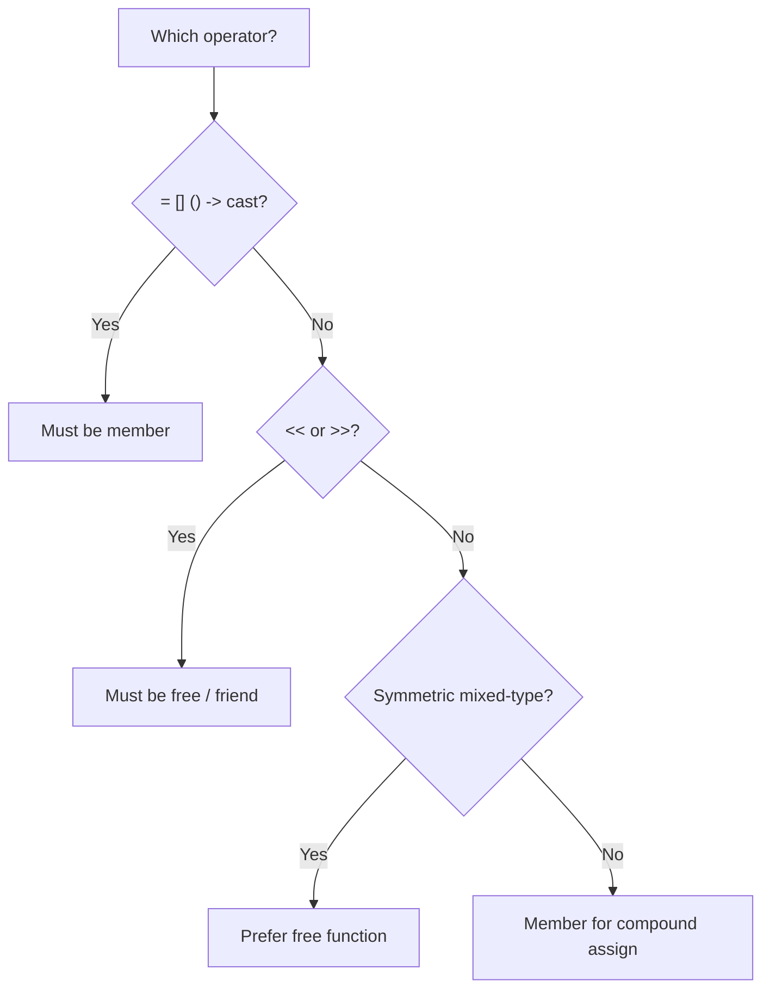
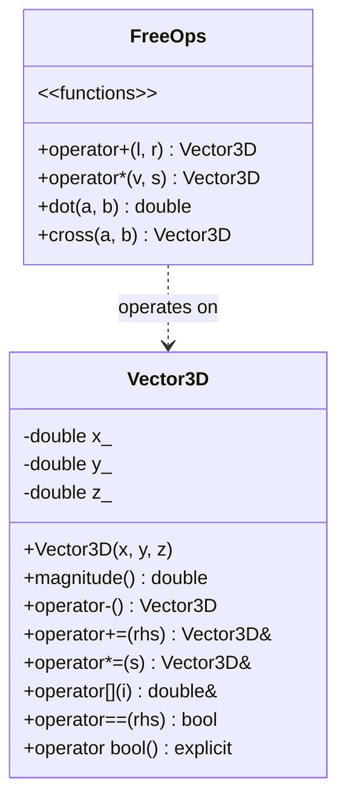

# Chapter 15 — Operator Overloading

> **Tags:** #cpp #operators #overloading #functors #spaceship
---

## 1. Theory — Philosophy of Operator Overloading

Operator overloading lets user-defined types behave like built-in types by giving custom meaning to operators such as `+`, `==`, `<<`, and `()`. The goal is **natural syntax**: a `Matrix` multiplied with `*`, a `BigInteger` compared with `<`.

### Design Principles

1. **Respect semantics** — `+` should add, not subtract.
2. **Preserve symmetry** — if `a + b` works, `b + a` should too (use free functions).
3. **Maintain consistency** — overload `==` → also provide `!=`.
4. **Don't abuse it** — overload only when meaning is obvious.

> **Note:** C++ forbids overloading `::`, `.`, `.*`, `?:`, and `sizeof`.

### Compiler Resolution

When you write `a + b`, the compiler searches for `a.operator+(b)` (member) or `operator+(a, b)` (free). If both exist, overload resolution picks the best match.

---

## 2. What / Why / How

**What?** — Defining custom behavior for operators on user-defined types. `a + b` is syntactic sugar for `operator+(a, b)` or `a.operator+(b)`.

**Why?** — Expressiveness (mathematical notation), generic programming (`std::sort` uses `<`), and library design (STL relies on `<<`, `[]`, `()`).

**How?** — Define a function named `operatorX`:

```cpp
ReturnType operator+(const MyType& rhs) const;            // member
ReturnType operator+(const MyType& lhs, const MyType& rhs); // free
```

---

## 3. Member vs Free Function Rules

| Criterion | Member | Free Function |
|---|---|---|
| Access to private data | Direct | Needs `friend` |
| LHS must be your type | Yes | No — enables mixed-type |
| Symmetry | Asymmetric | Symmetric |
| **Required for** | `=`, `[]`, `()`, `->` | `<<`, `>>` (stream ops) |
| **Convention for** | Compound assign (`+=`) | Binary arithmetic (`+`) |



---

## 4. Code Examples

### 4.1 Arithmetic Operators (+, -, *, /)

```cpp
#include <iostream>
#include <numeric>

class Fraction {
    int num_, den_;
    void simplify() {
        int g = std::gcd(std::abs(num_), std::abs(den_));
        if (g) { num_ /= g; den_ /= g; }
        if (den_ < 0) { num_ = -num_; den_ = -den_; }
    }
public:
    Fraction(int n = 0, int d = 1) : num_(n), den_(d) { simplify(); }

    Fraction& operator+=(const Fraction& r) {
        num_ = num_ * r.den_ + r.num_ * den_;
        den_ *= r.den_; simplify(); return *this;
    }
    Fraction& operator*=(const Fraction& r) {
        num_ *= r.num_; den_ *= r.den_;
        simplify(); return *this;
    }

    friend std::ostream& operator<<(std::ostream& os, const Fraction& f) {
        return os << f.num_ << '/' << f.den_;
    }
};

Fraction operator+(Fraction l, const Fraction& r) { return l += r; }
Fraction operator*(Fraction l, const Fraction& r) { return l *= r; }

int main() {
    Fraction a(1, 2), b(1, 3);
    std::cout << a + b << '\n';  // 5/6
    std::cout << a * b << '\n';  // 1/6
}
```

> **Note:** `operator+` takes `lhs` **by value** (copy), then delegates to `+=` — the canonical pattern.

---

### 4.2 Comparison Operators & C++20 Spaceship (`<=>`)

```cpp
#include <compare>
#include <iostream>
#include <string>

struct Employee {
    std::string name;
    int id;

    auto operator<=>(const Employee& o) const {
        if (auto cmp = id <=> o.id; cmp != 0) return cmp;
        return name <=> o.name;
    }
    bool operator==(const Employee&) const = default;
};

int main() {
    Employee alice{"Alice", 42}, bob{"Bob", 17};
    std::cout << std::boolalpha;
    std::cout << (alice > bob) << '\n';   // true (42 > 17)
    std::cout << (alice == bob) << '\n';  // false
}
```

> **Note:** `<=>` returns `std::strong_ordering` / `std::weak_ordering` / `std::partial_ordering`. The compiler auto-generates `<`, `<=`, `>`, `>=` from it.

---

### 4.3 Stream Operators (`<<` and `>>`)

```cpp
#include <iostream>
#include <sstream>

class Point {
    double x_, y_;
public:
    Point(double x = 0, double y = 0) : x_(x), y_(y) {}
    friend std::ostream& operator<<(std::ostream& os, const Point& p) {
        return os << '(' << p.x_ << ", " << p.y_ << ')';
    }
    friend std::istream& operator>>(std::istream& is, Point& p) {
        char d; return is >> d >> p.x_ >> d >> p.y_ >> d;
    }
};

int main() {
    Point p(3.14, 2.72);
    std::cout << p << '\n';              // (3.14, 2.72)
    std::istringstream iss("(10, 20)");
    Point q; iss >> q;
    std::cout << q << '\n';              // (10, 20)
}
```

---

### 4.4 Subscript Operator `[]`

```cpp
#include <iostream>
#include <vector>

class Matrix {
    std::vector<std::vector<double>> data_;
public:
    Matrix(size_t r, size_t c) : data_(r, std::vector<double>(c, 0)) {}

    std::vector<double>&       operator[](size_t r)       { return data_.at(r); }
    const std::vector<double>& operator[](size_t r) const { return data_.at(r); }
};

int main() {
    Matrix m(3, 3);
    m[1][1] = 5.0;
    std::cout << m[1][1] << '\n';  // 5
}
```

---

### 4.5 Function Call Operator `()` — Functors

```cpp
#include <algorithm>
#include <iostream>
#include <vector>

class MultiplyBy {
    double factor_;
public:
    explicit MultiplyBy(double f) : factor_(f) {}
    double operator()(double x) const { return x * factor_; }
};

class InRange {
    double lo_, hi_;
public:
    InRange(double lo, double hi) : lo_(lo), hi_(hi) {}
    bool operator()(double x) const { return x >= lo_ && x <= hi_; }
};

int main() {
    std::vector<double> v{1.0, 2.5, 3.7, 4.2, 5.8};
    std::vector<double> scaled(v.size());
    std::transform(v.begin(), v.end(), scaled.begin(), MultiplyBy(3.0));
    for (double x : scaled) std::cout << x << ' ';  // 3 7.5 11.1 12.6 17.4
    std::cout << '\n';
    std::cout << std::count_if(v.begin(), v.end(), InRange(2, 4.5)) << '\n'; // 2
}
```

> **Note:** Functors predate lambdas but remain relevant for complex state, serialization, and STL requirements (allocators, hash functions).

---

### 4.6 Conversion Operators

```cpp
#include <iostream>

class Meters {
    double val_;
public:
    explicit Meters(double v) : val_(v) {}
    operator double() const { return val_; }             // implicit → double
    explicit operator int() const { return (int)val_; }  // explicit → int
    explicit operator bool() const { return val_ > 0; }  // explicit → bool
};

int main() {
    Meters h(1.82);
    double d = h;                     // OK: implicit
    int i = static_cast<int>(h);      // OK: explicit cast required
    if (h) std::cout << d << "m\n";   // OK: explicit bool in boolean context
}
```

> **Note:** Prefer `explicit` conversions. `explicit operator bool()` is special — it works in `if`/`while`/`&&`/`||` contexts without enabling arithmetic misuse.

---

### 4.7 Complete Vector3D Class

```cpp
#include <cmath>
#include <compare>
#include <iostream>
#include <stdexcept>

class Vector3D {
    double x_, y_, z_;
public:
    Vector3D(double x = 0, double y = 0, double z = 0) : x_(x), y_(y), z_(z) {}
    double x() const { return x_; }
    double y() const { return y_; }
    double z() const { return z_; }
    double magnitude() const { return std::sqrt(x_*x_ + y_*y_ + z_*z_); }

    Vector3D  operator-() const { return {-x_, -y_, -z_}; }
    Vector3D& operator+=(const Vector3D& r) { x_+=r.x_; y_+=r.y_; z_+=r.z_; return *this; }
    Vector3D& operator-=(const Vector3D& r) { x_-=r.x_; y_-=r.y_; z_-=r.z_; return *this; }
    Vector3D& operator*=(double s) { x_*=s; y_*=s; z_*=s; return *this; }

    double& operator[](int i) {
        if (i==0) return x_; if (i==1) return y_; if (i==2) return z_;
        throw std::out_of_range("Vector3D index");
    }
    double operator[](int i) const {
        if (i==0) return x_; if (i==1) return y_; if (i==2) return z_;
        throw std::out_of_range("Vector3D index");
    }

    bool operator==(const Vector3D&) const = default;
    explicit operator bool() const { return magnitude() > 0.0; }

    friend std::ostream& operator<<(std::ostream& os, const Vector3D& v) {
        return os << '<' << v.x_ << ", " << v.y_ << ", " << v.z_ << '>';
    }
};

Vector3D operator+(Vector3D l, const Vector3D& r) { return l += r; }
Vector3D operator-(Vector3D l, const Vector3D& r) { return l -= r; }
Vector3D operator*(Vector3D v, double s) { return v *= s; }
Vector3D operator*(double s, Vector3D v) { return v *= s; }

double dot(const Vector3D& a, const Vector3D& b) {
    return a.x()*b.x() + a.y()*b.y() + a.z()*b.z();
}
Vector3D cross(const Vector3D& a, const Vector3D& b) {
    return { a.y()*b.z()-a.z()*b.y(), a.z()*b.x()-a.x()*b.z(), a.x()*b.y()-a.y()*b.x() };
}

int main() {
    Vector3D a(1,2,3), b(4,5,6);
    std::cout << "a+b   = " << (a+b) << '\n';
    std::cout << "2*a   = " << (2*a) << '\n';
    std::cout << "dot   = " << dot(a,b) << '\n';
    std::cout << "cross = " << cross(a,b) << '\n';
    std::cout << "a[1]  = " << a[1] << '\n';
}
```

---

## 5. Vector3D Class Diagram



---

## 6. Exercises

### 🟢 Exercise 1 — Complex Number

Write a `Complex` class with `real` and `imag`. Overload `+`, `-`, `<<`:

```cpp
Complex a(3, 4), b(1, -2);
std::cout << a + b << '\n';  // (4, 2)
```

### 🟡 Exercise 2 — SafeArray with Bounds Checking

Create `SafeArray<T, N>` wrapping `std::array`. Overload `[]` (with bounds checking), `==`, and `<<`.

### 🔴 Exercise 3 — Expression Templates

Implement lazy vector arithmetic so `auto r = a + b * 2.0 - c;` builds an expression tree evaluated only on assignment, avoiding temporaries.

---

## 7. Solutions

<details>
<summary>🟢 Solution 1 — Complex</summary>

```cpp
#include <iostream>
class Complex {
    double r_, i_;
public:
    Complex(double r=0, double i=0) : r_(r), i_(i) {}
    Complex& operator+=(const Complex& o) { r_+=o.r_; i_+=o.i_; return *this; }
    Complex& operator-=(const Complex& o) { r_-=o.r_; i_-=o.i_; return *this; }
    friend std::ostream& operator<<(std::ostream& os, const Complex& c) {
        return os << '(' << c.r_ << ", " << c.i_ << ')';
    }
};
Complex operator+(Complex l, const Complex& r) { return l += r; }
Complex operator-(Complex l, const Complex& r) { return l -= r; }

int main() {
    Complex a(3,4), b(1,-2);
    std::cout << a+b << '\n';  // (4, 2)
    std::cout << a-b << '\n';  // (2, 6)
}
```

</details>

<details>
<summary>🟡 Solution 2 — SafeArray</summary>

```cpp
#include <array>
#include <iostream>
template <typename T, size_t N>
class SafeArray {
    std::array<T,N> d_{};
public:
    T&       operator[](size_t i)       { return d_.at(i); }
    const T& operator[](size_t i) const { return d_.at(i); }
    bool operator==(const SafeArray& o) const { return d_ == o.d_; }
    friend std::ostream& operator<<(std::ostream& os, const SafeArray& a) {
        os << '[';
        for (size_t i=0; i<N; ++i) { if (i) os << ", "; os << a.d_[i]; }
        return os << ']';
    }
};

int main() {
    SafeArray<int,4> a;
    for (int i=0; i<4; ++i) a[i] = i*10;
    std::cout << a << '\n';  // [0, 10, 20, 30]
}
```

</details>

<details>
<summary>🔴 Solution 3 — Expression Templates (Sketch)</summary>

```cpp
#include <iostream>
#include <vector>
template <typename E>
class VecExpr {
public:
    double operator[](size_t i) const { return static_cast<const E&>(*this)[i]; }
    size_t size() const { return static_cast<const E&>(*this).size(); }
};

class Vec : public VecExpr<Vec> {
    std::vector<double> d_;
public:
    Vec(std::initializer_list<double> il) : d_(il) {}
    template <typename E>
    Vec(const VecExpr<E>& e) : d_(e.size()) {
        for (size_t i=0; i<d_.size(); ++i) d_[i] = e[i];
    }
    double operator[](size_t i) const { return d_[i]; }
    size_t size() const { return d_.size(); }
};

template <typename L, typename R>
class VecAdd : public VecExpr<VecAdd<L,R>> {
    const L& l_; const R& r_;
public:
    VecAdd(const L& l, const R& r) : l_(l), r_(r) {}
    double operator[](size_t i) const { return l_[i]+r_[i]; }
    size_t size() const { return l_.size(); }
};

template <typename L, typename R>
VecAdd<L,R> operator+(const VecExpr<L>& l, const VecExpr<R>& r) {
    return {static_cast<const L&>(l), static_cast<const R&>(r)};
}

int main() {
    Vec a{1,2,3}, b{4,5,6}, c{0.1,0.2,0.3};
    Vec r = a + b + c;  // lazy — no temporaries
    for (size_t i=0; i<r.size(); ++i) std::cout << r[i] << ' ';
}
```

</details>

---

## 8. Quiz

**Q1.** Which operators cannot be overloaded?

<details><summary>Answer</summary>
`::`, `.`, `.*`, `?:`, and `sizeof`.
</details>

**Q2.** Why should `operator+` be a free function?

<details><summary>Answer</summary>
A free function allows implicit conversions on both sides, enabling symmetric expressions like `2 + myObj`. A member function requires the LHS to be your type.
</details>

**Q3.** What does the C++20 `<=>` operator return?

<details><summary>Answer</summary>
`std::strong_ordering`, `std::weak_ordering`, or `std::partial_ordering`. The compiler auto-generates `<`, `<=`, `>`, `>=` from it.
</details>

**Q4.** What is the canonical way to implement `operator+` from `operator+=`?

<details><summary>Answer</summary>
Take LHS by value (copy), apply `+=`, return: `MyType operator+(MyType l, const MyType& r) { return l += r; }`
</details>

**Q5.** Why mark conversion operators `explicit`?

<details><summary>Answer</summary>
Implicit conversions cause silent bugs. `explicit operator bool()` is special — works in boolean contexts (`if`, `&&`, `||`) but prevents `int n = myObj + 1;`.
</details>

**Q6.** What is a functor?

<details><summary>Answer</summary>
A class overloading `operator()`, making instances callable like functions. They can hold state unlike raw function pointers.
</details>

**Q7.** Can `operator[]` be a free function?

<details><summary>Answer</summary>
No. `operator[]`, `operator=`, `operator()`, `operator->`, and conversion operators must be non-static members.
</details>

**Q8.** Why should you never overload `&&` or `||`?

<details><summary>Answer</summary>
Overloading them turns them into function calls, which destroys short-circuit evaluation — both operands are always evaluated.
</details>

---

## 9. Key Takeaways

- Operator overloading makes user-defined types feel like built-in types.
- Implement `+=` as member; build `+` as a free function on top of it.
- C++20 `<=>` eliminates boilerplate — one operator replaces six.
- `[]`, `()`, `=`, and casts **must** be members; `<<`/`>>` **must** be free.
- Functors remain valuable for stateful callables and STL customization.
- Only overload when meaning is intuitive — clarity over cleverness.

---

## 10. Chapter Summary

This chapter covered operator overloading: philosophy, member-vs-free decisions, arithmetic, comparison (C++20 `<=>`), streams, subscript, functors, and conversions. We built a complete `Vector3D` class and introduced expression templates as an advanced technique.

---

## 11. Real-World Insight

> **🏭 Industry Usage:**
> - **Eigen** uses operator overloading + expression templates for MATLAB-like syntax at zero cost.
> - **`std::string`** uses `+` (concatenation), `==` (comparison), `[]` (access).
> - **`std::chrono`** enables `auto t = 5s + 200ms;` via overloaded arithmetic.
> - **CUDA/Thrust** overloads operators on GPU vector types for parallel computation.
---

## 12. Common Mistakes

| Mistake | Problem | Fix |
|---|---|---|
| Overloading `+` without `+=` | Inconsistent API | Implement `+=` first, define `+` via it |
| Returning reference from `+` | Dangling reference | Return by value |
| Non-`const` `operator==` | Can't compare `const` objects | Mark `const` |
| Implicit `operator bool()` | `int n = obj + 1;` compiles | Use `explicit operator bool()` |
| Overloading `&&` or `\|\|` | Loses short-circuit evaluation | Never overload these |
| Making `<<` a member | LHS must be `ostream` | Use `friend` free function |
| Forgetting `scalar * vec` | `2 * v` fails | Provide both orderings |

---

## 13. Interview Questions

**Q1.** Member vs free `operator+` — when to use each?

<details><summary>Answer</summary>
Member: LHS is always `this`, prevents left-side conversions. Use for compound assignment (`+=`). Free: both operands are parameters, enables `5 + obj`. Canonical approach: `+=` as member, `+` as free function calling `+=`.
</details>

**Q2.** How does C++20 `<=>` reduce boilerplate?

<details><summary>Answer</summary>
One `<=>` definition (or `= default`) generates all six comparison operators. It returns an ordering type, and the compiler synthesizes `<`, `<=`, `>`, `>=` automatically.
</details>

**Q3.** Why are functors still relevant with lambdas?

<details><summary>Answer</summary>
Functors have named types (forward-declarable, usable as template params), can hold complex state, are serializable, and satisfy STL requirements for allocators/hash functions.
</details>

**Q4.** What if both member and free `operator+` exist for the same types?

<details><summary>Answer</summary>
Both participate in overload resolution. If equally viable, the call is ambiguous (compiler error). Convention: use one form only — `+=` as member, `+` as free.
</details>

**Q5.** Explain the `explicit operator bool` idiom.

<details><summary>Answer</summary>
`explicit operator bool()` allows use in boolean contexts (`if`, `while`, `!`) but prevents implicit conversion to `int`. Without `explicit`, `MyType x; int n = x + 1;` silently converts through bool→int.
</details>

---

> **📚 Further Reading:** *C++ Primer* Ch.14 • *Effective C++* Items 24–25 • [cppreference: operators](https://en.cppreference.com/w/cpp/language/operators)
