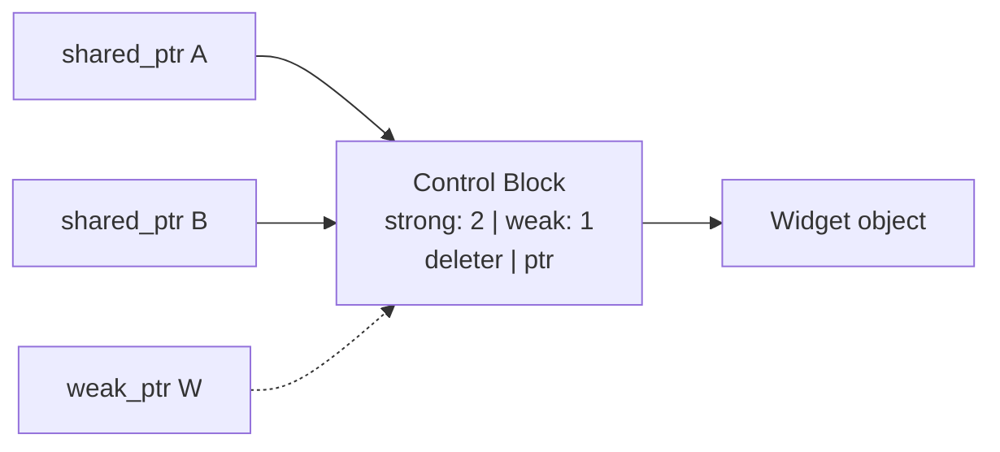
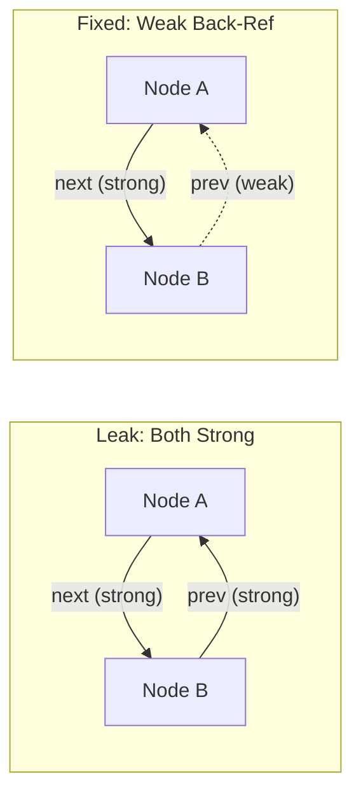
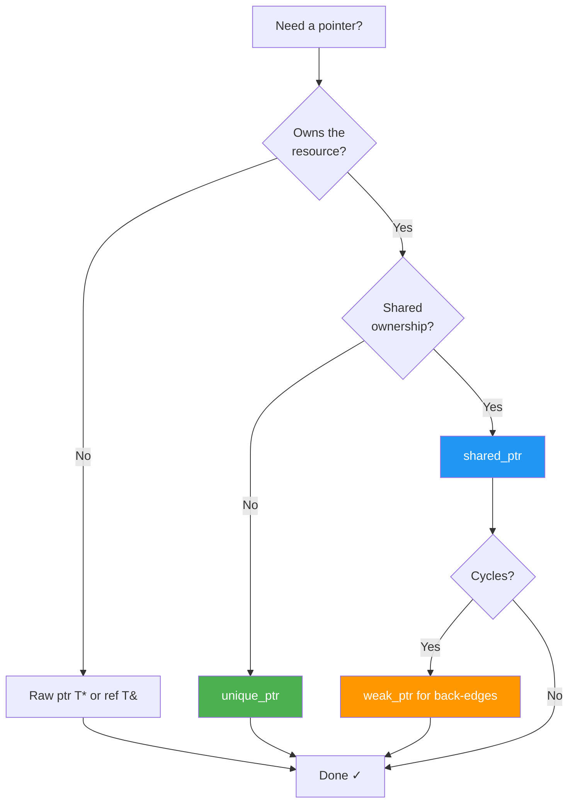

# Chapter 16 — Smart Pointers & Ownership

> **Tags:** #cpp #smart-pointers #ownership #unique_ptr #shared_ptr #weak_ptr #RAII

---

## 1. Theory — Ownership Semantics and RAII

**Ownership** answers one question: *who is responsible for destroying this resource?*

C++ formalizes this through **RAII — Resource Acquisition Is Initialization**: resources are acquired in constructors and released in destructors. Stack unwinding guarantees cleanup even on exceptions.

| Model | Smart Pointer | Semantics |
|-------|--------------|-----------|
| **Exclusive** | `std::unique_ptr<T>` | One owner. Non-copyable, movable. |
| **Shared** | `std::shared_ptr<T>` | Reference-counted shared ownership. |
| **Observing** | `std::weak_ptr<T>` | Non-owning observer of `shared_ptr`. |

> **Note:** RAII is the most important idiom in C++. Smart pointers are its standard library implementation for heap memory.

---

## 2. What / Why / How

### What Goes Wrong with Manual Management

```cpp
void dangerous() {
    int* data = new int[1000];
    if (rand() % 2) throw std::runtime_error("Oops!"); // LEAK
    delete[] data; // only reached on the happy path
}
```

### Why Smart Pointers Exist

| Problem | Solution |
|---------|----------|
| Leak on exception | Destructor runs during stack unwinding |
| Double-free | Only the owning smart pointer calls `delete` |
| Dangling pointer | `weak_ptr::lock()` returns `nullptr` if expired |
| Ownership ambiguity | Type signature documents intent |

### How — Simplified `unique_ptr` Model

```cpp
template <typename T>
class SimpleUniquePtr {
    T* ptr_;
public:
    explicit SimpleUniquePtr(T* p = nullptr) : ptr_(p) {}
    ~SimpleUniquePtr() { delete ptr_; }
    SimpleUniquePtr(SimpleUniquePtr&& o) noexcept : ptr_(o.ptr_) { o.ptr_ = nullptr; }
    SimpleUniquePtr& operator=(SimpleUniquePtr&& o) noexcept {
        if (this != &o) { delete ptr_; ptr_ = o.ptr_; o.ptr_ = nullptr; }
        return *this;
    }
    SimpleUniquePtr(const SimpleUniquePtr&) = delete;
    SimpleUniquePtr& operator=(const SimpleUniquePtr&) = delete;
    T& operator*() const { return *ptr_; }
    T* operator->() const { return ptr_; }
};
```

---

## 3. `unique_ptr` — Exclusive Ownership

```cpp
#include <memory>
#include <iostream>
#include <vector>

struct Sensor {
    int id;
    Sensor(int id) : id(id) { std::cout << "Sensor " << id << " created\n"; }
    ~Sensor() { std::cout << "Sensor " << id << " destroyed\n"; }
    void read() const { std::cout << "Sensor " << id << ": 42\n"; }
};

int main() {
    auto s = std::make_unique<Sensor>(1);
    s->read();
    auto s2 = std::move(s);  // transfer ownership
    // s is now nullptr

    std::vector<std::unique_ptr<Sensor>> fleet;
    fleet.push_back(std::make_unique<Sensor>(10));
    fleet.push_back(std::make_unique<Sensor>(20));
    for (const auto& x : fleet) x->read();
} // all destroyed automatically
```

### Custom Deleters

```cpp
#include <memory>
#include <cstdio>

struct FileDeleter {
    void operator()(FILE* fp) const { if (fp) std::fclose(fp); }
};

int main() {
    std::unique_ptr<FILE, FileDeleter> file(std::fopen("data.txt", "w"));
    if (file) std::fputs("Hello, RAII!\n", file.get());
} // file closed automatically
```

> **Note:** `unique_ptr` with a stateless deleter has **zero overhead** — same size as a raw pointer.

---

## 4. `shared_ptr` — Shared Ownership

### Control Block Architecture



```cpp
#include <memory>
#include <iostream>

struct Widget {
    std::string name;
    Widget(std::string n) : name(std::move(n)) { std::cout << name << " created\n"; }
    ~Widget() { std::cout << name << " destroyed\n"; }
};

int main() {
    auto w1 = std::make_shared<Widget>("Alpha");
    std::cout << "count: " << w1.use_count() << "\n"; // 1
    { auto w2 = w1; std::cout << "count: " << w1.use_count() << "\n"; } // 2, then 1
} // Widget destroyed when count hits 0
```

### `make_shared` — Performance and Exception Safety

```cpp
// BAD: Two allocations (object + control block)
std::shared_ptr<int> p1(new int(42));

// GOOD: Single allocation (object + control block coalesced)
auto p2 = std::make_shared<int>(42);
// Benefits: faster, better cache locality, exception-safe
```

---

## 5. `weak_ptr` — Breaking Circular References

### The Problem

```cpp
struct Node {
    std::string name;
    std::shared_ptr<Node> next;
    std::shared_ptr<Node> prev; // CIRCULAR — both strong!
    Node(std::string n) : name(std::move(n)) {}
    ~Node() { std::cout << name << " destroyed\n"; }
};

void leak() {
    auto a = std::make_shared<Node>("A");
    auto b = std::make_shared<Node>("B");
    a->next = b; b->prev = a; // LEAK: neither is ever destroyed
}
```

### The Fix

```cpp
struct SafeNode {
    std::string name;
    std::shared_ptr<SafeNode> next;
    std::weak_ptr<SafeNode> prev; // weak — breaks the cycle
    SafeNode(std::string n) : name(std::move(n)) {}
    ~SafeNode() { std::cout << name << " destroyed\n"; }
};

int main() {
    auto a = std::make_shared<SafeNode>("A");
    auto b = std::make_shared<SafeNode>("B");
    a->next = b; b->prev = a;
    std::cout << "a.use_count = " << a.use_count() << "\n"; // 1, not 2!
} // Both destroyed correctly
```



---

## 6. Overhead Analysis

```cpp
#include <memory>
#include <iostream>
int main() {
    std::cout << "Raw ptr:       " << sizeof(int*) << "B\n";
    std::cout << "unique_ptr:    " << sizeof(std::unique_ptr<int>) << "B\n";
    std::cout << "shared_ptr:    " << sizeof(std::shared_ptr<int>) << "B\n";
    std::cout << "weak_ptr:      " << sizeof(std::weak_ptr<int>) << "B\n";
}
```

| Type | Size (64-bit) | Notes |
|------|:---:|-------|
| `int*` | 8 | Raw pointer |
| `unique_ptr<int>` | 8 | Zero overhead (EBO) |
| `shared_ptr<int>` | 16 | ptr + control block ptr |
| `weak_ptr<int>` | 16 | Same layout as `shared_ptr` |

---

## 7. Ownership Transfer — Factory Pattern

```cpp
#include <memory>
#include <iostream>

class Logger {
public:
    virtual ~Logger() = default;
    virtual void log(const std::string& msg) = 0;
};
class ConsoleLogger : public Logger {
public:
    void log(const std::string& msg) override { std::cout << "[CON] " << msg << "\n"; }
};

// Return unique_ptr — caller decides ownership model
std::unique_ptr<Logger> create_logger() {
    return std::make_unique<ConsoleLogger>();
}

void install(std::unique_ptr<Logger> logger) { // takes ownership
    logger->log("installed");
}

int main() {
    auto logger = create_logger();
    logger->log("hello");
    install(std::move(logger)); // transfer to sink
    // Can also convert: std::shared_ptr<Logger> s = create_logger();
}
```

### When to Use Raw Pointers



```cpp
void process(const Widget* w) { w->do_work(); }   // non-owning: raw ptr OK
void consume(std::unique_ptr<Widget> w) { /*...*/ } // owning: smart ptr
void must_have(const Widget& w) { w.do_work(); }    // non-null: use ref
```

---

## 8. Exercises

### 🟢 Exercise 1 — FileGuard

Write a `FileGuard` class using `unique_ptr<FILE, Deleter>` to manage a C `FILE*` with RAII.

### 🟡 Exercise 2 — Observer with `weak_ptr`

Implement `EventBus` (holds `shared_ptr<Listener>`) and `Listener` (holds `weak_ptr<EventBus>`). Demonstrate that destroying the bus is detected by listeners via `expired()`.

### 🔴 Exercise 3 — Thread-Safe Cache

Build `Cache<K,V>` using `weak_ptr` internally so expired entries auto-evict. Guard with `std::mutex`.

---

## 9. Solutions

<details>
<summary>🟢 Solution 1 — FileGuard</summary>

```cpp
#include <memory>
#include <cstdio>
#include <string>
#include <stdexcept>

class FileGuard {
    struct Closer { void operator()(FILE* fp) const { if (fp) std::fclose(fp); } };
    std::unique_ptr<FILE, Closer> fp_;
public:
    FileGuard(const std::string& path, const char* mode = "w")
        : fp_(std::fopen(path.c_str(), mode)) {
        if (!fp_) throw std::runtime_error("Cannot open " + path);
    }
    void write(const std::string& s) { std::fputs(s.c_str(), fp_.get()); }
};

int main() {
    { FileGuard g("out.txt"); g.write("RAII!\n"); }
    // file closed here
}
```
</details>

<details>
<summary>🟡 Solution 2 — Observer</summary>

```cpp
#include <memory>
#include <vector>
#include <iostream>

class EventBus;
class Listener {
    std::weak_ptr<EventBus> bus_;
public:
    void set_bus(std::shared_ptr<EventBus> b) { bus_ = b; }
    bool bus_alive() const { return !bus_.expired(); }
    void on_event(const std::string& e) { std::cout << "Got: " << e << "\n"; }
};

class EventBus : public std::enable_shared_from_this<EventBus> {
    std::vector<std::shared_ptr<Listener>> subs_;
public:
    void subscribe(std::shared_ptr<Listener> l) {
        l->set_bus(shared_from_this()); subs_.push_back(l);
    }
    void emit(const std::string& e) { for (auto& s : subs_) s->on_event(e); }
};

int main() {
    auto listener = std::make_shared<Listener>();
    { auto bus = std::make_shared<EventBus>();
      bus->subscribe(listener); bus->emit("click");
      std::cout << "alive? " << listener->bus_alive() << "\n"; } // 1
    std::cout << "alive? " << listener->bus_alive() << "\n";     // 0
}
```
</details>

<details>
<summary>🔴 Solution 3 — Thread-Safe Cache</summary>

```cpp
#include <memory>
#include <mutex>
#include <unordered_map>
#include <functional>
#include <iostream>

template <typename K, typename V>
class Cache {
    mutable std::mutex mu_;
    std::unordered_map<K, std::weak_ptr<V>> store_;
public:
    std::shared_ptr<V> get(const K& key, std::function<std::shared_ptr<V>()> factory) {
        std::lock_guard lk(mu_);
        if (auto it = store_.find(key); it != store_.end())
            if (auto sp = it->second.lock()) return sp;
        auto val = factory();
        store_[key] = val;
        return val;
    }
};

int main() {
    Cache<std::string, std::string> c;
    { auto v = c.get("k", []{ return std::make_shared<std::string>("hello"); });
      auto v2 = c.get("k", []{ return std::make_shared<std::string>("world"); });
      std::cout << (*v == *v2 ? "cache hit" : "miss") << "\n"; } // hit
}
```
</details>

---

## 10. Quiz

**Q1.** What happens when you copy a `unique_ptr`?
<details><summary>Answer</summary>Compilation error — copy ctor is deleted. Use `std::move()`.</details>

**Q2.** What is `use_count()` after a `shared_ptr` is moved from?
<details><summary>Answer</summary>`0` — the source becomes null.</details>

**Q3.** Why prefer `make_shared` over `shared_ptr(new T)`?
<details><summary>Answer</summary>Single allocation, better cache locality, exception safety.</details>

**Q4.** When should you use `weak_ptr`?
<details><summary>Answer</summary>Breaking circular refs, caches, and observer patterns where observers shouldn't keep subjects alive.</details>

**Q5.** Can you convert `unique_ptr` → `shared_ptr`?
<details><summary>Answer</summary>Yes via `std::move()`. The reverse is impossible.</details>

**Q6.** Is `shared_ptr` reference counting thread-safe?
<details><summary>Answer</summary>The count is atomic. Accessing the managed object is NOT thread-safe — use a mutex.</details>

**Q7.** What does `shared_from_this()` require?
<details><summary>Answer</summary>The object must already be owned by a `shared_ptr`. Otherwise it's UB (`bad_weak_ptr` thrown).</details>

---

## 11. Key Takeaways

| # | Takeaway |
|---|----------|
| 1 | Default to `unique_ptr` — zero overhead, move-only |
| 2 | Use `shared_ptr` only when shared ownership is genuinely needed |
| 3 | Always use `make_unique` / `make_shared` — never raw `new` |
| 4 | Break cycles with `weak_ptr` — one direction strong, other weak |
| 5 | Return `unique_ptr` from factories — callers can convert to `shared_ptr` |
| 6 | Use raw pointers/references only for non-owning access |

---

## 12. Chapter Summary

Smart pointers encode ownership in the type system, ensuring deterministic cleanup and exception safety. `unique_ptr` is the zero-cost workhorse for exclusive ownership. `shared_ptr` enables reference-counted shared ownership. `weak_ptr` breaks cycles and enables caches. Together they eliminate leaks, double-frees, and dangling pointers. Never use raw `new`/`delete` in application code.

---

## 13. Real-World Insight

- **Chromium** forbids raw `new` in most codepaths; uses `std::unique_ptr` and a custom `scoped_refptr`.
- **Game engines** (Unreal, Godot) use `unique_ptr` for scene nodes, `shared_ptr` for assets referenced by multiple objects, `weak_ptr` in entity-component systems.
- **LLVM** uses `IntrusiveRefCntPtr` — embeds the refcount in the object to avoid the separate control block allocation of `shared_ptr`.

---

## 14. Common Mistakes

| # | Mistake | Fix |
|---|---------|-----|
| 1 | Two `shared_ptr`s from same raw ptr | Use `make_shared` or `shared_from_this()` |
| 2 | Circular `shared_ptr` refs | Use `weak_ptr` for back-references |
| 3 | Storing `.get()` result long-term | Keep the smart pointer alive instead |
| 4 | `shared_ptr` when `unique_ptr` suffices | Default to `unique_ptr`, upgrade if needed |
| 5 | Returning `shared_ptr` from factories | Return `unique_ptr` — more flexible |
| 6 | `make_shared` + large object + `weak_ptr` | Object memory held until last `weak_ptr` dies |

---

## 15. Interview Questions

**Q1.** Explain `unique_ptr` vs `shared_ptr` vs `weak_ptr` and when to use each.
<details><summary>Answer</summary>

`unique_ptr`: exclusive, zero-overhead, move-only. Default choice. `shared_ptr`: multiple owners via atomic refcount. Use when shared lifetime is needed. `weak_ptr`: non-owning observer — breaks cycles, caches, observers. Start with `unique_ptr`, upgrade only when proven necessary.
</details>

**Q2.** What is the control block in `shared_ptr`?
<details><summary>Answer</summary>

Heap-allocated struct containing: strong count (atomic), weak count (atomic), deleter, and pointer to managed object. Object is destroyed at strong=0; control block freed at strong=0 AND weak=0.
</details>

**Q3.** Why return `unique_ptr` from factories instead of `shared_ptr`?
<details><summary>Answer</summary>

`unique_ptr` converts to `shared_ptr` (not vice versa). Returning `unique_ptr` gives callers maximum flexibility and avoids refcount overhead when unnecessary. This is the Principle of Least Commitment.
</details>

**Q4.** Is it safe to read the same `shared_ptr` from two threads?
<details><summary>Answer</summary>

Copying (reading) is safe — refcount is atomic. Writing (reset/assign) the same `shared_ptr` instance is a data race — use `std::mutex` or `std::atomic<std::shared_ptr<T>>` (C++20). The managed object itself needs its own synchronization.
</details>

---

*Next: [Chapter 17 — STL Containers](17_STL_Containers.md)*
