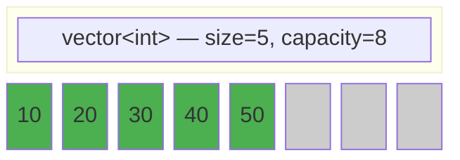
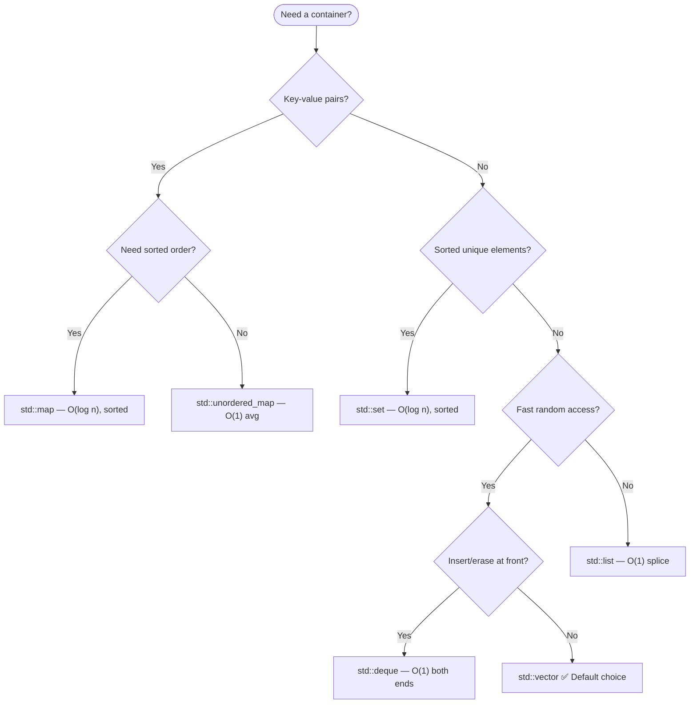

# Chapter 17 — STL Containers Deep-Dive

> **Tags:** #cpp #stl #containers #vector #map #unordered_map #performance

---

## Theory

The STL containers rest on three design pillars:

**1. Generic Programming** — Every container is a class template parameterized on element type (plus optional allocator/comparator/hash). The same source works for `int`, `std::string`, or any user type — without virtual dispatch.

**2. The Iterator Model** — Containers expose iterators (pointer-like traversal objects) categorized in a hierarchy. Algorithms target iterator *categories*, not containers, maximizing reuse.

| Category | Capabilities | Example Containers |
|---|---|---|
| Forward | Multi-pass, forward only | `forward_list`, `unordered_map` |
| Bidirectional | Forward + backward | `list`, `map`, `set` |
| Random Access | Bidirectional + O(1) jump | `vector`, `deque`, `array` |
| Contiguous (C++17) | Random access + contiguous memory | `vector`, `array` |

**3. Allocator Awareness** — Every container accepts an `Allocator` template parameter (defaulting to `std::allocator<T>`), enabling drop-in pool/arena/GPU-mapped allocators without changing container logic.

> **Note:** The separation of containers, iterators, and algorithms is the "STL trinity." Understanding this decoupling is key to mastering C++.

---

## What / Why / How

### What the STL Provides

| Family | Containers | Key Trait |
|---|---|---|
| **Sequence** | `vector`, `deque`, `list`, `forward_list`, `array` | Positional access |
| **Associative** | `set`, `map`, `multiset`, `multimap` | Sorted O(log n) via red-black tree |
| **Unordered** | `unordered_set/map`, `unordered_multiset/multimap` | O(1) avg via hash table |
| **Adaptors** | `stack`, `queue`, `priority_queue` | Restricted interface over underlying container |

### Why Generic Containers Matter
- **Code reuse** — write once, works on any container via iterators.
- **Complexity guarantees** — the standard mandates asymptotic bounds.
- **Safety** — RAII lifetime management, `at()` bounds checking, exception safety.

### How They Work Internally
- **`vector`** — contiguous dynamic array; grows by 1.5–2× on reallocation.
- **`deque`** — array of fixed-size chunks; O(1) push at both ends.
- **`list`/`forward_list`** — heap-allocated doubly/singly linked nodes.
- **`map`/`set`** — self-balancing **red-black trees** (color + parent/child pointers per node).
- **`unordered_map`/`unordered_set`** — hash tables with separate chaining; rehash when `load_factor() > max_load_factor()`.

---

## Mermaid Diagrams

### Vector Memory Layout — Capacity vs Size



### Container Selection Flowchart



---

## Code Examples

### Sequence Containers

This example demonstrates the four main sequence containers — `vector`, `deque`, `list`, and `forward_list` — highlighting how each manages elements differently. Notice how `vector` tracks capacity vs size during growth, `deque` supports fast insertion at both ends, and `list`/`forward_list` offer node-based operations like `sort()` and `unique()` as member functions.

```cpp
#include <iostream>
#include <vector>
#include <deque>
#include <list>
#include <forward_list>

int main() {
    // --- vector: capacity vs size growth ---
    std::vector<int> v;
    v.reserve(4);
    for (int i = 0; i < 10; ++i) {
        v.push_back(i);
        std::cout << "size=" << v.size() << " cap=" << v.capacity() << '\n';
    }
    v.shrink_to_fit();
    v.emplace_back(42);  // construct in-place

    // --- deque: O(1) push at both ends (chunk-based) ---
    std::deque<int> dq;
    dq.push_front(1);
    dq.push_back(2);
    dq.push_front(0);          // {0, 1, 2}

    // --- list: doubly-linked, bidirectional iterators ---
    std::list<int> lst = {3, 1, 4, 1, 5};
    lst.sort();
    lst.unique();               // {1, 3, 4, 5}

    // --- forward_list: singly-linked, minimal overhead ---
    std::forward_list<int> fl = {9, 7, 5};
    fl.push_front(11);
    fl.reverse();               // {5, 7, 9, 11}
}
```

### Associative Containers (Red-Black Tree)

This code shows `set`, `map`, and `multimap` — all backed by red-black trees that keep elements sorted automatically. Key patterns include `emplace` for in-place construction, `insert_or_assign` (C++17) for upsert semantics, structured bindings for clean iteration, and `equal_range` for retrieving all values under a duplicate key in a `multimap`.

```cpp
#include <iostream>
#include <set>
#include <map>

int main() {
    // set — unique sorted elements
    std::set<int> s = {5, 3, 8, 1, 3};   // duplicate 3 ignored → {1,3,5,8}

    // map — sorted key-value pairs
    std::map<std::string, int> scores;
    scores.emplace("Alice", 95);
    scores["Bob"] = 87;
    scores.insert_or_assign("Alice", 98);  // C++17 update-or-insert

    for (const auto& [name, score] : scores)  // structured bindings
        std::cout << name << ": " << score << '\n';

    // multimap — duplicate keys allowed
    std::multimap<std::string, int> mm;
    mm.emplace("tag", 1);
    mm.emplace("tag", 2);
    auto [begin, end] = mm.equal_range("tag");
    for (auto it = begin; it != end; ++it)
        std::cout << it->second << ' ';     // 1 2
}
```

> **Note:** `std::map`/`set` are red-black trees in all major implementations (libstdc++, libc++, MSVC STL).

### Unordered Containers (Hash Tables)

This example builds a word-frequency counter using `unordered_map` and shows how to inspect the underlying hash table — bucket count, load factor, and per-bucket sizes. The `rehash()` call forces the table to allocate at least 50 buckets, demonstrating how you can control memory layout to reduce collisions.

```cpp
#include <iostream>
#include <unordered_map>
#include <unordered_set>

int main() {
    std::unordered_set<int> us = {10, 20, 30, 20};  // 20 deduplicated

    // Hash table word frequency with introspection
    std::unordered_map<std::string, int> freq;
    for (auto& w : {"apple", "banana", "apple", "cherry", "banana", "apple"})
        freq[w]++;

    for (const auto& [word, count] : freq)
        std::cout << word << " → " << count << '\n';

    std::cout << "bucket_count: " << freq.bucket_count() << '\n';
    std::cout << "load_factor:  " << freq.load_factor() << '\n';
    freq.rehash(50);  // force at least 50 buckets

    size_t b = freq.bucket("apple");
    std::cout << "Bucket for 'apple': " << b
              << " (size=" << freq.bucket_size(b) << ")\n";
}
```

### Container Adaptors

Container adaptors wrap an underlying container (usually `deque`) and expose a restricted interface. This example demonstrates `stack` (LIFO access), `queue` (FIFO access), and `priority_queue` configured as a min-heap using `std::greater` so the smallest element is always on top.

```cpp
#include <iostream>
#include <stack>
#include <queue>
#include <vector>

int main() {
    // stack — LIFO (wraps deque by default)
    std::stack<int> stk;
    stk.push(1); stk.push(2); stk.push(3);
    while (!stk.empty()) { std::cout << stk.top() << ' '; stk.pop(); }  // 3 2 1

    // queue — FIFO
    std::queue<int> q;
    q.push(10); q.push(20); q.push(30);
    while (!q.empty()) { std::cout << q.front() << ' '; q.pop(); }      // 10 20 30

    // priority_queue — min-heap via std::greater
    std::priority_queue<int, std::vector<int>, std::greater<>> min_heap;
    min_heap.push(5); min_heap.push(1); min_heap.push(3);
    while (!min_heap.empty()) { std::cout << min_heap.top() << ' '; min_heap.pop(); }
    // Output: 1 3 5
}
```

### Insertion Benchmark Pattern

This benchmark measures raw insertion time across four container types — `vector`, `list`, `set`, and `unordered_set`. It uses `if constexpr` to handle API differences (`push_back` vs `insert`) at compile time, and `reserve()` is called on `vector` and `unordered_set` to isolate insertion cost from reallocation overhead.

```cpp
#include <iostream>
#include <vector>
#include <list>
#include <set>
#include <unordered_set>
#include <chrono>

template <typename Container>
long long bench(Container& c, int n) {
    auto t0 = std::chrono::high_resolution_clock::now();
    for (int i = 0; i < n; ++i) {
        if constexpr (requires { c.push_back(0); })
            c.push_back(i);
        else
            c.insert(i);
    }
    auto t1 = std::chrono::high_resolution_clock::now();
    return std::chrono::duration_cast<std::chrono::microseconds>(t1 - t0).count();
}

int main() {
    constexpr int N = 100'000;
    std::vector<int> v;  v.reserve(N);
    std::list<int> l;
    std::set<int> s;
    std::unordered_set<int> us;  us.reserve(N);

    std::cout << "vector:        " << bench(v, N)  << " μs\n"
              << "list:          " << bench(l, N)  << " μs\n"
              << "set:           " << bench(s, N)  << " μs\n"
              << "unordered_set: " << bench(us, N) << " μs\n";
}
```

> **Note:** Always `reserve()` before benchmarking to isolate insertion cost from reallocation. Use Google Benchmark for production profiling.

### Iterator Invalidation Examples

This code illustrates the most common iterator invalidation pitfalls. For `vector`, any `push_back` may trigger reallocation and invalidate all iterators — the safe workaround is index-based access. For `map`, insert and erase never invalidate other iterators. For `unordered_map`, a `reserve()` or rehash invalidates everything, so you must re-acquire iterators afterward.

```cpp
#include <iostream>
#include <vector>
#include <map>
#include <unordered_map>

int main() {
    // vector: reallocation invalidates ALL iterators
    std::vector<int> v = {1, 2, 3};
    auto it = v.begin();
    v.push_back(4);          // may reallocate — 'it' potentially INVALID
    // Safe pattern: use indices across mutations
    size_t idx = 0;
    v.push_back(5);
    std::cout << v[idx] << '\n';  // always safe

    // map: insert/erase does NOT invalidate other iterators
    std::map<int,int> m = {{1,10}, {2,20}, {3,30}};
    auto mit = m.find(2);
    m.erase(1);               // mit still valid
    m.emplace(4, 40);         // mit still valid

    // unordered_map: rehash invalidates ALL iterators
    std::unordered_map<int,int> um = {{1,10}, {2,20}};
    um.reserve(1000);         // forces rehash — all iterators INVALID
    auto umit = um.find(2);   // re-acquire after rehash
}
```

---

## Performance Comparison Table

| Container | Insert | Find | Iterate | Erase | Memory Overhead | Iter. Invalidation |
|---|---|---|---|---|---|---|
| `vector` | Amort. O(1) back | O(n) | ⭐ Fastest | O(n) shift | Low | All on realloc |
| `deque` | O(1) front+back | O(n) | Good | O(n) | Medium | All on realloc |
| `list` | O(1) at pos | O(n) | Slow (cache miss) | O(1) | High (2 ptr/node) | None |
| `forward_list` | O(1) after pos | O(n) | Slow | O(1) | Med (1 ptr/node) | None |
| `set`/`map` | O(log n) | O(log n) | Good | O(log n) | High (3 ptr+color) | None |
| `unordered_*` | Amort. O(1) | ⭐ O(1) avg | Moderate | O(1) avg | High | All on rehash |
| `priority_queue` | O(log n) | N/A | N/A | O(log n) top | Low | N/A |

---

## Iterator Invalidation Rules

| Container | `insert` / `push_back` | `erase` | Rehash / Realloc |
|---|---|---|---|
| `vector` | All if realloc; past-point otherwise | At + after erased pos | On `reserve`/`shrink_to_fit` |
| `deque` | All (middle); end-only (push front/back) | All (middle); end-only (pop) | N/A |
| `list`/`forward_list` | **None** | Erased element only | N/A |
| `map`/`set` | **None** | Erased element only | N/A |
| `unordered_*` | **All** if rehash; none otherwise | Erased element only | All iterators |

> **Note:** When in doubt, use index-based access for `vector` and re-acquire iterators after mutating unordered containers.

---

## Exercises

### 🟢 Easy — Word Frequency Counter
Read words from a string and print each with its frequency, sorted alphabetically. Use `std::map` and structured bindings.

### 🟡 Medium — LRU Cache
Implement an O(1) LRU cache of capacity `k` using `std::list` + `std::unordered_map`. Support `get(key)` and `put(key, value)`. *Hint:* list maintains access order; map stores list iterators.

### 🔴 Hard — Container Benchmark Suite
Build a templated benchmark that measures insert, find, erase for `vector`, `list`, `set`, `unordered_set` across sizes 1K–1M. Output CSV. Use `if constexpr` for API differences.

---

## Solutions

<details>
<summary>🟢 Word Frequency Counter</summary>

This solution reads words from a string using `istringstream`, counts each word's frequency with `std::map` (which keeps keys alphabetically sorted), and prints the results using structured bindings. The `operator[]` on the map auto-initializes missing keys to zero.

```cpp
#include <iostream>
#include <map>
#include <sstream>

int main() {
    std::string text = "the quick brown fox jumps over the lazy dog the fox";
    std::istringstream iss(text);
    std::map<std::string, int> freq;
    for (std::string w; iss >> w; ) freq[w]++;
    for (const auto& [w, c] : freq) std::cout << w << ": " << c << '\n';
}
```
</details>

<details>
<summary>🟡 LRU Cache</summary>

This implements an O(1) LRU (Least Recently Used) cache by combining `std::list` (for access-order tracking) with `std::unordered_map` (for O(1) key lookup). The `list::splice` operation moves a recently accessed node to the front in constant time, and eviction simply removes the back node when capacity is exceeded.

```cpp
#include <iostream>
#include <list>
#include <unordered_map>

class LRUCache {
    int cap_;
    std::list<std::pair<int,int>> order_;
    std::unordered_map<int, decltype(order_)::iterator> idx_;
public:
    explicit LRUCache(int c) : cap_(c) {}

    int get(int key) {
        auto it = idx_.find(key);
        if (it == idx_.end()) return -1;
        order_.splice(order_.begin(), order_, it->second);
        return it->second->second;
    }

    void put(int key, int val) {
        if (auto it = idx_.find(key); it != idx_.end()) {
            it->second->second = val;
            order_.splice(order_.begin(), order_, it->second);
            return;
        }
        if (static_cast<int>(order_.size()) >= cap_) {
            idx_.erase(order_.back().first);
            order_.pop_back();
        }
        order_.emplace_front(key, val);
        idx_[key] = order_.begin();
    }
};

int main() {
    LRUCache c(2);
    c.put(1, 10); c.put(2, 20);
    std::cout << c.get(1) << '\n';  // 10
    c.put(3, 30);                   // evicts key 2
    std::cout << c.get(2) << '\n';  // -1
}
```
</details>

<details>
<summary>🔴 Container Benchmark Suite</summary>

This full benchmark suite measures both insert and find performance across `vector`, `list`, `set`, and `unordered_set` at multiple data sizes (1K–100K). It uses `if constexpr` to select the correct API at compile time and outputs CSV-formatted results for easy analysis. Random data is generated via `std::mt19937` with a fixed seed for reproducibility.

```cpp
#include <iostream>
#include <vector>
#include <list>
#include <set>
#include <unordered_set>
#include <chrono>
#include <random>
#include <algorithm>

template <typename F>
long long us(F&& f) {
    auto t0 = std::chrono::high_resolution_clock::now();
    f();
    return std::chrono::duration_cast<std::chrono::microseconds>(
        std::chrono::high_resolution_clock::now() - t0).count();
}

template <typename C>
void run(const char* name, int n, const std::vector<int>& d) {
    C c;
    auto ti = us([&]{ for(int i=0;i<n;++i){
        if constexpr(requires{c.push_back(0);}) c.push_back(d[i]);
        else c.insert(d[i]); }});
    auto tf = us([&]{ for(int i=0;i<n;++i){
        if constexpr(requires{c.find(0);}) (void)c.find(d[i]);
        else (void)std::find(c.begin(),c.end(),d[i]); }});
    std::cout << name << ',' << n << ',' << ti << ',' << tf << '\n';
}

int main() {
    std::mt19937 rng(42);
    std::cout << "container,n,insert_us,find_us\n";
    for (int n : {1000, 10000, 100000}) {
        std::vector<int> d(n);
        std::generate(d.begin(), d.end(), [&]{ return rng()%(n*10); });
        run<std::vector<int>>("vector", n, d);
        run<std::list<int>>("list", n, d);
        run<std::set<int>>("set", n, d);
        run<std::unordered_set<int>>("uset", n, d);
    }
}
```
</details>

---

## Quiz

**Q1:** What is the default underlying container for `std::stack`?
<details><summary>Answer</summary><code>std::deque</code>. Both <code>stack</code> and <code>queue</code> default to <code>deque</code>.</details>

**Q2:** What happens when `vector::push_back` is called and `size() == capacity()`?
<details><summary>Answer</summary>A new buffer (typically 1.5–2×) is allocated, elements are moved/copied, the old buffer freed. <strong>All iterators are invalidated.</strong></details>

**Q3:** Why is `unordered_map` O(n) worst-case for lookup?
<details><summary>Answer</summary>If many keys hash to the same bucket, the chain degrades to linear scan. Average O(1) assumes a good hash and <code>load_factor ≤ max_load_factor</code>.</details>

**Q4:** Does erasing from `std::map` invalidate other iterators?
<details><summary>Answer</summary>No. Node-based containers only invalidate the iterator to the erased element.</details>

**Q5:** What is the difference between `emplace` and `insert`?
<details><summary>Answer</summary><code>insert</code> copies/moves a pre-constructed object. <code>emplace</code> forwards arguments to construct <strong>in-place</strong>, avoiding a temporary and extra move.</details>

**Q6:** When choose `deque` over `vector`?
<details><summary>Answer</summary>When you need O(1) insertion at <strong>both</strong> front and back. <code>vector</code> is O(n) for front insertion.</details>

**Q7:** What data structure underlies `std::priority_queue`?
<details><summary>Answer</summary>A binary max-heap stored in a <code>std::vector</code>, maintained by <code>push_heap</code>/<code>pop_heap</code>.</details>

---

## Key Takeaways

- **`std::vector` is the default** — contiguous memory gives unbeatable cache performance.
- **Node-based containers never invalidate other iterators** on insert/erase — ideal for stable references.
- **`unordered_map` gives O(1) avg lookup** but beware rehash invalidation and collision chains.
- **Always `reserve()`** when size is known — eliminates reallocation/rehashing overhead.
- **`emplace` > `insert`** for non-trivial types — avoid temporary construction.
- **Iterator invalidation is the #1 STL bug source** — know the rules per container.

---

## Chapter Summary

STL containers form a cohesive family unified by the iterator model and allocator-aware design. Sequence containers (`vector`, `deque`) excel at positional access; associative containers (`map`, `set`) provide ordered O(log n) operations via red-black trees; unordered containers trade ordering for O(1) average-case hashing. Choosing the right container depends on access patterns, mutation frequency, and iterator stability requirements.

---

## Real-World Insight

> **🏭 Production Container Choices:**
> - **Game engines** favor custom `vector`-like containers with arena allocators — cache locality dominates frame budgets.
> - **Databases** (RocksDB) use `map`-like memtables backed by skip lists, not red-black trees, for better concurrency.
> - **HFT systems** avoid `unordered_map` due to rehash latency spikes; prefer open-addressing maps (Abseil `flat_hash_map`).
> - **CUDA pipelines** require contiguous memory (`vector`-backed) for `cudaMemcpy` — node-based containers are incompatible with GPU memory.

---

## Common Mistakes

| # | Mistake | Fix |
|---|---|---|
| 1 | `operator[]` without bounds check | Use `at()` in debug builds |
| 2 | Holding iterators across `push_back` | Use indices or `reserve()` first |
| 3 | Using `map` when order isn't needed | Default to `unordered_map` for pure lookup |
| 4 | Forgetting `reserve()` for large inserts | Call `reserve(n)` before the loop |
| 5 | Erasing inside a range-for loop | Use erase-remove idiom or `std::erase_if` (C++20) |
| 6 | Assuming `unordered_map` order is stable | Rehash changes order — never depend on it |
| 7 | Using `list` "for performance" | Profile first; `vector` usually wins due to cache effects |

---

## Interview Questions

**Q1: `std::map` vs `std::unordered_map` — when to choose which?**
<details><summary>Answer</summary>

`map` = red-black tree, O(log n), sorted iteration, stable iterators. Choose for range queries, `lower_bound`, or when no hash function exists. `unordered_map` = hash table, amortized O(1), no order. Choose for maximum lookup speed on large datasets with a good hash.
</details>

**Q2: How does iterator invalidation differ between `vector` and `list`?**
<details><summary>Answer</summary>

**vector:** reallocation invalidates *all* iterators; insertion without realloc invalidates at/after insertion point; erase invalidates at/after erased position. **list:** insert *never* invalidates; erase only invalidates the erased node's iterator. Each node is independently allocated — no shifting.
</details>

**Q3: How does `unordered_map` handle collisions? What is load factor?**
<details><summary>Answer</summary>

Separate chaining: each bucket is a linked list. On collision, elements append to the chain. Load factor = `size()/bucket_count()`. When it exceeds `max_load_factor()` (default 1.0), the table rehashes (O(n), invalidates all iterators). Control with `reserve()`, `rehash()`, and `max_load_factor()`.
</details>

**Q4: Why is `vector` often faster than `list` even for middle insertions?**
<details><summary>Answer</summary>

Cache locality: shifting contiguous elements is hardware-prefetch-friendly. Per-node `malloc` for `list` is ~50–100ns each. A `list<int>` node is 24 bytes (2 pointers + int) vs 4 bytes in a vector. Stroustrup's benchmark shows `vector` beating `list` for sorted insertion up to ~500K elements.
</details>

**Q5: What is the erase-remove idiom, and how did C++20 simplify it?**
<details><summary>Answer</summary>

Pre-C++20: `v.erase(std::remove(v.begin(), v.end(), val), v.end());` — `remove` shifts survivors forward, `erase` truncates. C++20: `std::erase(v, val);` or `std::erase_if(v, pred);` — works on all containers, picks the optimal strategy automatically.
</details>
