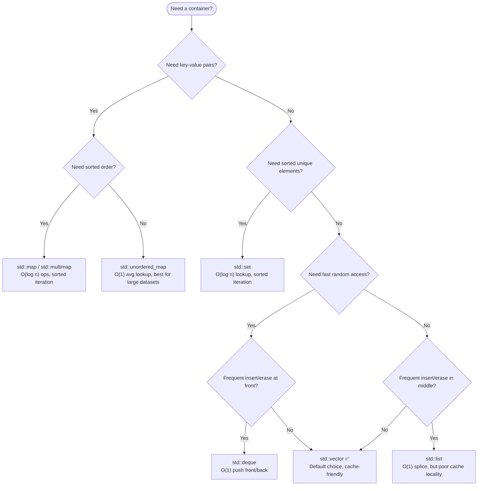

# Chapter 17 — STL Containers Deep-Dive

> **Tags:** #cpp #stl #containers #vector #map #unordered_map #performance

---

## Theory

The C++ Standard Template Library (STL) containers are the backbone of idiomatic C++ programming. Their design rests on three pillars:

**1. Generic Programming via Templates**
Every container is a class template parameterized on the element type (and optionally an allocator, comparator, or hash function). This means the *same* source code works for `int`, `std::string`, or any user-defined type that satisfies the container's requirements — without virtual dispatch overhead.

**2. The Iterator Model**
Containers do not expose their internal data structures directly. Instead, they expose **iterators** — lightweight, pointer-like objects that abstract traversal. Iterators are categorized into a hierarchy:

| Category | Capabilities | Example Containers |
|---|---|---|
| Input / Output | Single-pass read / write | `istream_iterator` |
| Forward | Multi-pass, forward only | `forward_list`, `unordered_map` |
| Bidirectional | Forward + backward | `list`, `map`, `set` |
| Random Access | Bidirectional + O(1) jump | `vector`, `deque`, `array` |
| Contiguous (C++17) | Random access + guaranteed contiguous memory | `vector`, `array`, `string` |

Algorithms are written against iterator *categories*, not containers, achieving maximum reuse.

**3. Allocator Awareness**
Every container accepts an `Allocator` template parameter (defaulting to `std::allocator<T>`). This allows drop-in replacement with pool allocators, arena allocators, or GPU-mapped allocators without changing container logic — critical for game engines, embedded systems, and CUDA interop.

> **Note:** The separation of containers, iterators, and algorithms is sometimes called the "STL trinity." Understanding this decoupling is key to mastering C++.

---

## What / Why / How

### What Does the STL Provide?

The STL ships four families of containers:

| Family | Containers | Ordering | Key Trait |
|---|---|---|---|
| **Sequence** | `vector`, `deque`, `list`, `forward_list`, `array` | Insertion order | Positional access |
| **Associative** | `set`, `map`, `multiset`, `multimap` | Sorted by key | O(log n) lookup via red-black tree |
| **Unordered** | `unordered_set`, `unordered_map`, `unordered_multiset`, `unordered_multimap` | None | O(1) average lookup via hash table |
| **Adaptors** | `stack`, `queue`, `priority_queue` | LIFO / FIFO / heap | Restricted interface over an underlying container |

### Why Generic Containers Matter

- **Code reuse** — Write an algorithm once; it works on any container.
- **Performance guarantees** — The standard mandates asymptotic complexity (e.g., `vector::push_back` is amortized O(1)).
- **Safety** — Range-checked accessors (`at()`), RAII-based lifetime management, and exception safety.

### How They're Organized Internally

- `vector` — A contiguous dynamic array. Maintains `size` (elements stored) and `capacity` (allocated slots). Grows by a factor (typically 1.5× or 2×) on reallocation.
- `deque` — An array of fixed-size chunks (blocks). Supports O(1) push at *both* ends.
- `list` / `forward_list` — Node-based doubly / singly linked lists. Each element is a heap allocation.
- `map` / `set` — Self-balancing **red-black trees**. Every node stores color, parent, and child pointers.
- `unordered_map` / `unordered_set` — **Hash tables** with separate chaining. Elements are distributed across buckets; when `load_factor() > max_load_factor()`, the table rehashes.

---

## Mermaid Diagrams

### Vector Memory Layout — Capacity vs Size

```mermaid
block-beta
  columns 12
  block:header:12
    A["vector&lt;int&gt; v  —  size=5, capacity=8"]
  end
  B0["10"] B1["20"] B2["30"] B3["40"] B4["50"] B5["  "] B6["  "] B7["  "] B8["← begin()"] B9[""] B10["← end()"] B11["← capacity end"]

  style B0 fill:#4CAF50,color:#fff
  style B1 fill:#4CAF50,color:#fff
  style B2 fill:#4CAF50,color:#fff
  style B3 fill:#4CAF50,color:#fff
  style B4 fill:#4CAF50,color:#fff
  style B5 fill:#ccc,color:#666
  style B6 fill:#ccc,color:#666
  style B7 fill:#ccc,color:#666
```

### Container Selection Decision Flowchart



---

## Code Examples

### Sequence Containers

#### `vector` — Capacity and Growth

```cpp
#include <iostream>
#include <vector>

int main() {
    std::vector<int> v;
    v.reserve(4);  // pre-allocate to avoid early reallocs

    for (int i = 0; i < 10; ++i) {
        v.push_back(i);
        std::cout << "size=" << v.size()
                  << "  capacity=" << v.capacity() << '\n';
    }

    // Shrink-to-fit releases unused capacity
    v.shrink_to_fit();
    std::cout << "After shrink: capacity=" << v.capacity() << '\n';

    // Emplace constructs in-place — avoids a copy
    v.emplace_back(42);
}
```

#### `deque` — Double-Ended Queue (Chunk-Based)

```cpp
#include <iostream>
#include <deque>

int main() {
    std::deque<int> dq;

    // O(1) push at both ends
    dq.push_front(1);
    dq.push_back(2);
    dq.push_front(0);

    // Random access works, but memory is NOT contiguous
    for (size_t i = 0; i < dq.size(); ++i)
        std::cout << dq[i] << ' ';   // 0 1 2
    std::cout << '\n';
}
```

#### `list` and `forward_list`

```cpp
#include <iostream>
#include <list>
#include <forward_list>

int main() {
    // Doubly-linked list — bidirectional iterators
    std::list<int> lst = {3, 1, 4, 1, 5};
    lst.sort();
    lst.unique();  // remove consecutive duplicates
    for (int x : lst) std::cout << x << ' ';  // 1 3 4 5
    std::cout << '\n';

    // Singly-linked list — forward iterators, lower overhead
    std::forward_list<int> fl = {9, 7, 5};
    fl.push_front(11);
    fl.reverse();
    for (int x : fl) std::cout << x << ' ';  // 5 7 9 11
    std::cout << '\n';
}
```

---

### Associative Containers (Red-Black Tree)

```cpp
#include <iostream>
#include <map>
#include <set>

int main() {
    // std::set — unique, sorted elements (red-black tree)
    std::set<int> s = {5, 3, 8, 1, 3};  // duplicate 3 ignored
    for (int x : s) std::cout << x << ' ';  // 1 3 5 8
    std::cout << '\n';

    // std::map — sorted key-value pairs
    std::map<std::string, int> scores;
    scores.emplace("Alice", 95);
    scores["Bob"] = 87;
    scores.insert_or_assign("Alice", 98);  // C++17: update existing

    // Structured bindings (C++17) for clean iteration
    for (const auto& [name, score] : scores)
        std::cout << name << ": " << score << '\n';

    // std::multimap — allows duplicate keys
    std::multimap<std::string, int> mm;
    mm.emplace("tag", 1);
    mm.emplace("tag", 2);
    auto [begin, end] = mm.equal_range("tag");
    for (auto it = begin; it != end; ++it)
        std::cout << it->second << ' ';  // 1 2
    std::cout << '\n';
}
```

> **Note:** `std::map` and `std::set` are implemented as red-black trees in all major standard libraries (libstdc++, libc++, MSVC STL).

---

### Unordered Containers (Hash Tables)

```cpp
#include <iostream>
#include <unordered_map>
#include <unordered_set>

int main() {
    std::unordered_set<int> us = {10, 20, 30, 20};
    std::cout << "count(20)=" << us.count(20) << '\n';  // 1

    // unordered_map with hash table introspection
    std::unordered_map<std::string, int> freq;
    for (auto& word : {"apple", "banana", "apple", "cherry", "banana", "apple"})
        freq[word]++;

    // Structured bindings
    for (const auto& [word, count] : freq)
        std::cout << word << " → " << count << '\n';

    // Hash table internals
    std::cout << "bucket_count : " << freq.bucket_count() << '\n';
    std::cout << "load_factor  : " << freq.load_factor() << '\n';
    std::cout << "max_load_factor: " << freq.max_load_factor() << '\n';

    // Force rehash to at least 50 buckets
    freq.rehash(50);
    std::cout << "After rehash, buckets: " << freq.bucket_count() << '\n';

    // Inspect a specific bucket
    size_t b = freq.bucket("apple");
    std::cout << "Bucket for 'apple': " << b
              << " (size=" << freq.bucket_size(b) << ")\n";
}
```

---

### Container Adaptors

```cpp
#include <iostream>
#include <stack>
#include <queue>
#include <vector>

int main() {
    // stack — LIFO, wraps deque by default
    std::stack<int> stk;
    stk.push(1); stk.push(2); stk.push(3);
    while (!stk.empty()) { std::cout << stk.top() << ' '; stk.pop(); }
    std::cout << '\n';  // 3 2 1

    // queue — FIFO
    std::queue<int> q;
    q.push(10); q.push(20); q.push(30);
    while (!q.empty()) { std::cout << q.front() << ' '; q.pop(); }
    std::cout << '\n';  // 10 20 30

    // priority_queue — max-heap by default
    std::priority_queue<int, std::vector<int>, std::greater<>> min_heap;
    min_heap.push(5); min_heap.push(1); min_heap.push(3);
    while (!min_heap.empty()) { std::cout << min_heap.top() << ' '; min_heap.pop(); }
    std::cout << '\n';  // 1 3 5  (min-heap via std::greater)
}
```

---

### Performance Comparison — Insertion Benchmarking Pattern

```cpp
#include <iostream>
#include <vector>
#include <list>
#include <set>
#include <unordered_set>
#include <chrono>
#include <string>

template <typename Container>
long long bench_insert(Container& c, int n) {
    auto start = std::chrono::high_resolution_clock::now();
    for (int i = 0; i < n; ++i)
        c.insert(c.end(), i);
    auto end = std::chrono::high_resolution_clock::now();
    return std::chrono::duration_cast<std::chrono::microseconds>(end - start).count();
}

// Specialization for set-like containers (no positional insert)
template <typename Container>
long long bench_insert_set(Container& c, int n) {
    auto start = std::chrono::high_resolution_clock::now();
    for (int i = 0; i < n; ++i)
        c.insert(i);
    auto end = std::chrono::high_resolution_clock::now();
    return std::chrono::duration_cast<std::chrono::microseconds>(end - start).count();
}

int main() {
    constexpr int N = 100'000;

    std::vector<int> v;    v.reserve(N);
    std::list<int> l;
    std::set<int> s;
    std::unordered_set<int> us;  us.reserve(N);

    std::cout << "Inserting " << N << " elements:\n";
    std::cout << "  vector        : " << bench_insert(v, N)      << " μs\n";
    std::cout << "  list          : " << bench_insert(l, N)      << " μs\n";
    std::cout << "  set           : " << bench_insert_set(s, N)  << " μs\n";
    std::cout << "  unordered_set : " << bench_insert_set(us, N) << " μs\n";
}
```

> **Note:** Always `reserve()` before benchmarking `vector` / `unordered_*` to isolate insertion cost from reallocation cost. Real benchmarks should use libraries like Google Benchmark.

---

### Iterator Invalidation Examples

```cpp
#include <iostream>
#include <vector>
#include <map>
#include <unordered_map>

int main() {
    // --- vector: reallocation invalidates ALL iterators ---
    std::vector<int> v = {1, 2, 3};
    auto it = v.begin();
    v.push_back(4);  // may reallocate!
    // 'it' is now POTENTIALLY INVALID — do not dereference

    // Safe pattern: use indices instead of iterators across mutations
    size_t idx = 0;
    v.push_back(5);
    std::cout << v[idx] << '\n';  // always safe

    // --- map: insert/erase does NOT invalidate other iterators ---
    std::map<int,int> m = {{1,10}, {2,20}, {3,30}};
    auto mit = m.find(2);
    m.erase(1);        // mit still valid
    m.emplace(4, 40);  // mit still valid
    std::cout << mit->second << '\n';  // 20

    // --- unordered_map: rehash invalidates ALL iterators ---
    std::unordered_map<int,int> um = {{1,10}, {2,20}};
    um.reserve(1000);  // forces rehash
    // All prior iterators to 'um' are now INVALID

    // Safe pattern: re-acquire iterators after potential rehash
    auto umit = um.find(2);
    if (umit != um.end())
        std::cout << umit->second << '\n';  // 20
}
```

---

## Performance Comparison Table

| Container | Insert (back/end) | Find | Iterate (all) | Erase (by pos) | Memory Overhead | Iterator Invalidation on Insert |
|---|---|---|---|---|---|---|
| `vector` | Amortized O(1) | O(n) | ⭐ Fastest (contiguous) | O(n) shift | Low (capacity slack) | All (on realloc) |
| `deque` | O(1) front & back | O(n) | Good | O(n) | Medium (chunk ptrs) | All (on realloc) |
| `list` | O(1) anywhere* | O(n) | Slow (cache misses) | O(1) | High (2 ptrs/node) | None |
| `forward_list` | O(1) after pos | O(n) | Slow | O(1) | Medium (1 ptr/node) | None |
| `set` / `map` | O(log n) | O(log n) | Good | O(log n) | High (3 ptrs + color) | None |
| `unordered_set/map` | Amortized O(1) | ⭐ O(1) avg | Moderate | O(1) avg | High (buckets + nodes) | All (on rehash) |
| `priority_queue` | O(log n) | N/A | N/A | O(log n) top only | Low (vector-backed) | N/A (no iterators) |

*\* `list::insert` is O(1) given an iterator to the position; finding the position is O(n).*

---

## Iterator Invalidation Rules

| Container | `insert` / `push_back` | `erase` | `rehash` / reallocation |
|---|---|---|---|
| `vector` | All iterators if realloc; past-insertion-point otherwise | At and after erased position | On `reserve`/`shrink_to_fit` if capacity changes |
| `deque` | All iterators (insert in middle); only end iterators (push_front/back) | All iterators (middle erase); only end (pop_front/back) | N/A |
| `list` / `forward_list` | **None** | Only the erased element | N/A |
| `map` / `set` | **None** | Only the erased element | N/A |
| `unordered_map/set` | **All** if rehash occurs; none otherwise | Only the erased element | All iterators |

> **Note:** When in doubt, prefer **index-based** access for `vector` and re-acquire iterators after mutation for unordered containers.

---

## Exercises

### 🟢 Easy — Word Frequency Counter

Write a program that reads words from a string and prints each word with its frequency, sorted alphabetically.

**Hint:** Use `std::map<std::string, int>` and structured bindings.

### 🟡 Medium — LRU Cache

Implement a Least Recently Used (LRU) cache of capacity `k` using `std::list` and `std::unordered_map`. It must support `get(key)` and `put(key, value)` in O(1).

**Hint:** The list maintains access order; the map stores iterators into the list.

### 🔴 Hard — Container Benchmark Suite

Build a templated benchmark harness that measures insert, find, and erase time for `vector`, `list`, `set`, and `unordered_set` across sizes 1K, 10K, 100K, and 1M. Output results as a CSV table.

**Hint:** Use `std::chrono`, template functions, and `if constexpr` to handle API differences between containers.

---

## Solutions

<details>
<summary>🟢 Easy — Word Frequency Counter</summary>

```cpp
#include <iostream>
#include <map>
#include <sstream>
#include <string>

int main() {
    std::string text = "the quick brown fox jumps over the lazy dog the fox";
    std::istringstream iss(text);
    std::map<std::string, int> freq;
    std::string word;

    while (iss >> word)
        freq[word]++;

    for (const auto& [w, count] : freq)
        std::cout << w << ": " << count << '\n';
}
```

**Output:**
```
brown: 1
dog: 1
fox: 2
jumps: 1
lazy: 1
over: 1
quick: 1
the: 3
```

</details>

<details>
<summary>🟡 Medium — LRU Cache</summary>

```cpp
#include <iostream>
#include <list>
#include <unordered_map>

class LRUCache {
    int capacity_;
    std::list<std::pair<int,int>> order_;  // front = most recent
    std::unordered_map<int, std::list<std::pair<int,int>>::iterator> lookup_;

public:
    explicit LRUCache(int cap) : capacity_(cap) {}

    int get(int key) {
        auto it = lookup_.find(key);
        if (it == lookup_.end()) return -1;
        // Move to front (most recently used)
        order_.splice(order_.begin(), order_, it->second);
        return it->second->second;
    }

    void put(int key, int value) {
        if (auto it = lookup_.find(key); it != lookup_.end()) {
            it->second->second = value;
            order_.splice(order_.begin(), order_, it->second);
            return;
        }
        if (static_cast<int>(order_.size()) >= capacity_) {
            int evict_key = order_.back().first;
            lookup_.erase(evict_key);
            order_.pop_back();
        }
        order_.emplace_front(key, value);
        lookup_[key] = order_.begin();
    }
};

int main() {
    LRUCache cache(2);
    cache.put(1, 10);
    cache.put(2, 20);
    std::cout << cache.get(1) << '\n';  // 10
    cache.put(3, 30);                   // evicts key 2
    std::cout << cache.get(2) << '\n';  // -1 (evicted)
    std::cout << cache.get(3) << '\n';  // 30
}
```

</details>

<details>
<summary>🔴 Hard — Container Benchmark Suite</summary>

```cpp
#include <iostream>
#include <vector>
#include <list>
#include <set>
#include <unordered_set>
#include <chrono>
#include <random>
#include <string>
#include <algorithm>

template <typename Func>
long long time_us(Func&& f) {
    auto t0 = std::chrono::high_resolution_clock::now();
    f();
    auto t1 = std::chrono::high_resolution_clock::now();
    return std::chrono::duration_cast<std::chrono::microseconds>(t1 - t0).count();
}

template <typename Container>
void benchmark(const std::string& name, int n, const std::vector<int>& data) {
    Container c;

    long long t_insert = time_us([&] {
        for (int i = 0; i < n; ++i) {
            if constexpr (requires { c.push_back(0); })
                c.push_back(data[i]);
            else
                c.insert(data[i]);
        }
    });

    long long t_find = time_us([&] {
        for (int i = 0; i < n; ++i) {
            if constexpr (requires { c.find(0); })
                [[maybe_unused]] auto it = c.find(data[i]);
            else
                [[maybe_unused]] auto it = std::find(c.begin(), c.end(), data[i]);
        }
    });

    std::cout << name << "," << n << "," << t_insert << "," << t_find << "\n";
}

int main() {
    std::mt19937 rng(42);
    std::cout << "container,n,insert_us,find_us\n";

    for (int n : {1000, 10000, 100000}) {
        std::vector<int> data(n);
        std::generate(data.begin(), data.end(), [&] { return rng() % (n * 10); });

        benchmark<std::vector<int>>("vector", n, data);
        benchmark<std::list<int>>("list", n, data);
        benchmark<std::set<int>>("set", n, data);
        benchmark<std::unordered_set<int>>("unordered_set", n, data);
    }
}
```

</details>

---

## Quiz

**Q1:** What is the default underlying container for `std::stack`?

<details><summary>Answer</summary>
<code>std::deque</code>. Both <code>std::stack</code> and <code>std::queue</code> default to <code>std::deque</code> as their underlying container.
</details>

**Q2:** What happens when you insert into a `std::vector` and `size() == capacity()`?

<details><summary>Answer</summary>
The vector allocates a new, larger buffer (typically 1.5× or 2× the current capacity), moves/copies all elements, then deallocates the old buffer. <strong>All iterators, pointers, and references are invalidated.</strong>
</details>

**Q3:** Why is `std::unordered_map` O(1) average but O(n) worst-case for lookup?

<details><summary>Answer</summary>
If many keys hash to the same bucket (hash collisions), the bucket's chain degrades to a linear scan. The average case assumes a good hash function and <code>load_factor ≤ max_load_factor</code>.
</details>

**Q4:** Does erasing an element from `std::map` invalidate iterators to other elements?

<details><summary>Answer</summary>
No. For all node-based containers (<code>map</code>, <code>set</code>, <code>list</code>), only the iterator to the erased element is invalidated. All other iterators remain valid.
</details>

**Q5:** What is the difference between `emplace` and `insert`?

<details><summary>Answer</summary>
<code>insert</code> takes a constructed object and copies/moves it into the container. <code>emplace</code> forwards arguments directly to the element's constructor, constructing it <strong>in-place</strong> — avoiding a temporary object and a potential extra move.
</details>

**Q6:** When should you choose `std::deque` over `std::vector`?

<details><summary>Answer</summary>
When you need efficient O(1) insertion/removal at <strong>both</strong> the front and back. <code>vector</code> only supports amortized O(1) at the back; inserting at the front is O(n). <code>deque</code> also never invalidates pointers/references on <code>push_front</code>/<code>push_back</code> (only iterators).
</details>

**Q7:** What data structure underlies `std::priority_queue`?

<details><summary>Answer</summary>
A binary max-heap, stored as an array inside a <code>std::vector</code> (by default). The heap invariant is maintained by <code>std::push_heap</code> and <code>std::pop_heap</code>.
</details>

---

## Key Takeaways

- **`std::vector` is the default choice** — contiguous memory gives unbeatable cache performance for iteration. Start here unless you have a specific reason not to.
- **Node-based containers (`list`, `map`, `set`) never invalidate other iterators** on insert/erase, making them ideal for stable-reference scenarios.
- **`unordered_map` gives O(1) average lookup** but watch out for rehash-triggered iterator invalidation and worst-case hash collision chains.
- **Always `reserve()` when the size is known** — eliminates reallocation overhead for `vector` and rehashing for unordered containers.
- **`emplace` > `insert`** for non-trivial types — avoid constructing temporaries.
- **Iterator invalidation is the #1 source of STL bugs** — memorize the rules or keep a reference table handy.
- **Container adaptors** (`stack`, `queue`, `priority_queue`) provide restricted interfaces that enforce usage patterns and improve code clarity.

---

## Chapter Summary

The STL containers form a cohesive family of data structures unified by the iterator model and allocator-aware design. Sequence containers like `vector` and `deque` excel at positional access, while associative containers (`map`, `set`) provide ordered O(log n) operations via red-black trees. Unordered containers trade ordering for O(1) average-case performance using hash tables. Choosing the right container is a performance-critical decision that depends on your access patterns, mutation frequency, and iterator stability requirements.

---

## Real-World Insight

> **🏭 Production Container Choices:**
>
> - **Game engines** (Unreal, Unity internals) heavily favor custom `vector`-like containers with inline storage and arena allocators — cache locality dominates frame-time budgets.
> - **Databases** (e.g., RocksDB, LevelDB) use `std::map`-like structures for in-memory memtables but back them with skip lists or B-trees, not red-black trees, for better cache and concurrency behavior.
> - **High-frequency trading** systems avoid `unordered_map` due to rehash latency spikes and instead use open-addressing hash maps (e.g., Abseil `flat_hash_map`, Robin Hood hashing) for deterministic performance.
> - **CUDA/GPU pipelines** require contiguous memory (`vector`-backed) for `cudaMemcpy` transfers — node-based containers are incompatible with GPU memory models.

---

## Common Mistakes

| # | Mistake | Why It's Wrong | Fix |
|---|---|---|---|
| 1 | Using `vector::operator[]` without bounds check | Undefined behavior on out-of-range access | Use `at()` in debug; `[]` only when index is proven valid |
| 2 | Holding iterators across `push_back` | Reallocation invalidates all iterators | Use indices, or `reserve()` before the loop |
| 3 | Using `map` when you don't need ordering | O(log n) lookup vs O(1) for `unordered_map` | Default to `unordered_map` for pure lookup tables |
| 4 | Forgetting `reserve()` for large insertions | Repeated reallocations = O(n) copies each time | Call `reserve(expected_size)` before insertion loop |
| 5 | Erasing in a range-for loop | Undefined behavior (iterator invalidated) | Use the erase-remove idiom or `std::erase_if` (C++20) |
| 6 | Assuming `unordered_map` iteration order is stable | Rehash changes bucket assignment and order | Never depend on iteration order of unordered containers |
| 7 | Using `list` "for performance" | Per-node heap allocation + cache misses usually make it slower than `vector` | Profile first; `vector` with move semantics is usually faster |

---

## Interview Questions

**Q1: Explain the difference between `std::map` and `std::unordered_map`. When would you choose each?**

<details>
<summary>Answer</summary>

`std::map` is a balanced BST (red-black tree) providing O(log n) insert/find/erase with **sorted iteration**. `std::unordered_map` is a hash table providing amortized O(1) operations but **no ordering**.

Choose `map` when:
- You need sorted iteration (e.g., range queries, lower/upper bound).
- The key type has no good hash function but has `operator<`.
- You need iterator stability (no rehash invalidation).

Choose `unordered_map` when:
- You need maximum lookup speed and don't care about order.
- The dataset is large (hash table's O(1) wins over tree's O(log n)).
- You can provide or use a good hash function.

</details>

**Q2: What is iterator invalidation, and how does it differ between `vector` and `list`?**

<details>
<summary>Answer</summary>

Iterator invalidation occurs when a container operation makes an existing iterator unsafe to dereference.

- **`vector`:** Any insertion that triggers reallocation invalidates **all** iterators. Insertion without reallocation invalidates iterators **at and after** the insertion point. Erasure invalidates iterators **at and after** the erased position.
- **`list`:** Insert **never** invalidates any existing iterator. Erase only invalidates the iterator **to the erased node**. This is because each node is independently heap-allocated — no shifting or reallocation occurs.

This difference makes `list` suitable for scenarios where stable references are critical (e.g., an observer registry that mutates during notification).

</details>

**Q3: How does `std::unordered_map` handle collisions, and what is the load factor?**

<details>
<summary>Answer</summary>

The standard mandates **separate chaining**: each bucket is a linked list of elements that hashed to the same index. On collision, the new element is appended to the chain.

The **load factor** = `size() / bucket_count()`. When it exceeds `max_load_factor()` (default 1.0), the container **rehashes** — allocates more buckets and redistributes all elements. This rehash is O(n) and invalidates all iterators.

You can control this with:
- `reserve(n)` — pre-size to avoid rehash.
- `max_load_factor(f)` — tune the threshold.
- `rehash(n)` — manually set bucket count.

</details>

**Q4: Why is `std::vector` often faster than `std::list` even for middle insertions?**

<details>
<summary>Answer</summary>

Despite `list::insert` being O(1) and `vector::insert` being O(n) (due to shifting), `vector` often wins in practice because:

1. **Cache locality:** `vector` stores elements contiguously. Modern CPUs prefetch sequential memory, so shifting N elements may be faster than traversing N scattered heap nodes.
2. **Allocation overhead:** Each `list` node requires a separate heap allocation (malloc), which is expensive (often 50-100ns per call). `vector` amortizes allocation via geometric growth.
3. **Memory overhead:** A `list<int>` node stores two pointers + the int (24 bytes on 64-bit) vs. 4 bytes per element in a vector.

Bjarne Stroustrup's famous benchmark demonstrates that `vector` beats `list` for insert-in-sorted-order up to surprisingly large sizes (~500K elements) due to these hardware realities.

</details>

**Q5: What is the erase-remove idiom, and how did C++20 simplify it?**

<details>
<summary>Answer</summary>

Before C++20, removing elements by value from a `vector` required two steps:

```cpp
// Pre-C++20: erase-remove idiom
v.erase(std::remove(v.begin(), v.end(), value), v.end());
```

`std::remove` shifts non-removed elements forward and returns an iterator to the new logical end. `erase` then truncates. This is error-prone and verbose.

C++20 introduced `std::erase` and `std::erase_if` as free functions:

```cpp
// C++20
std::erase(v, value);
std::erase_if(v, [](int x) { return x % 2 == 0; });
```

These work on all standard containers, choosing the optimal strategy (member `erase` for node-based, erase-remove for sequences).

</details>
