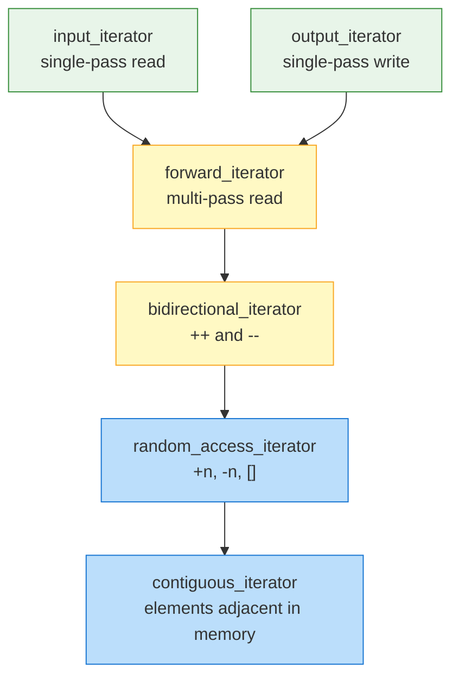
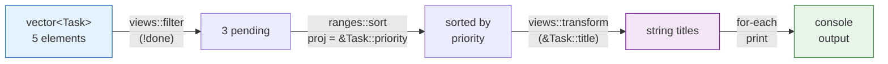

# Chapter 18 — STL Algorithms & Iterators

```yaml
title: "STL Algorithms & Iterators"
chapter: 18
part: "Part 02 – C++ Intermediate"
tags: [STL, algorithms, iterators, ranges, parallel, C++17, C++20, lambda]
difficulty: intermediate-to-advanced
compiler: "g++ -std=c++20 -O2"
```

---

## 1 · Theory

The Standard Template Library (STL) separates **containers** from **algorithms**
through a thin abstraction layer called **iterators**. This three-part design is
the defining architectural decision of the C++ standard library:

| Layer       | Examples                                   |
|-------------|--------------------------------------------|
| Containers  | `vector`, `list`, `map`, `unordered_set`   |
| Iterators   | `begin()`, `end()`, reverse, insert        |
| Algorithms  | `sort`, `find`, `transform`, `accumulate`  |

Any algorithm that operates on a pair of iterators works with **any** container
that supplies iterators of the required category — without knowing the
container's concrete type. This decoupling means *N* containers + *M* algorithms
require only *N + M* implementations instead of *N × M*.

### 1.1 Iterator Categories

C++20 formalises six iterator categories as concepts:



| Category          | Key operations        | Typical container          |
|-------------------|-----------------------|----------------------------|
| Input             | `*it`, `++it`         | `istream_iterator`         |
| Output            | `*it = v`, `++it`     | `ostream_iterator`         |
| Forward           | multi-pass `++`       | `forward_list`, `unordered_set` |
| Bidirectional     | `++`, `--`            | `list`, `set`, `map`       |
| Random Access     | `+n`, `-n`, `[]`      | `deque`                    |
| Contiguous        | RA + adjacent memory  | `vector`, `array`, `string`|

> **Rule of thumb:** An algorithm documents its *minimum* iterator requirement.
> Passing a stronger iterator always works; passing a weaker one is a compile error.

### 1.2 Algorithm Complexity Guarantees

The standard mandates worst-case or amortised bounds:

| Algorithm      | Complexity              | Iterator requirement |
|----------------|-------------------------|----------------------|
| `find`         | O(n)                    | Input                |
| `count`        | O(n)                    | Input                |
| `sort`         | O(n log n)              | Random Access        |
| `stable_sort`  | O(n log n) (with mem)   | Random Access        |
| `nth_element`  | O(n) average            | Random Access        |
| `lower_bound`  | O(log n)                | Forward (RA faster)  |
| `accumulate`   | O(n)                    | Input                |
| `transform`    | O(n)                    | Input + Output       |
| `unique`       | O(n)                    | Forward              |
| `remove_if`    | O(n)                    | Forward              |

---

## 2 · What / Why / How

### What
STL algorithms are **generic, iterator-based functions** in `<algorithm>`,
`<numeric>`, and (C++20) `<ranges>` that express common operations — searching,
sorting, transforming, accumulating — without coupling to any specific container.

### Why
- **Correctness:** Fewer hand-rolled loops means fewer off-by-one bugs.
- **Performance:** Implementations are heavily optimised (SIMD, branch-free
  partitions, introsort hybrids). `std::sort` often beats naive quicksort.
- **Expressiveness:** `ranges::views::filter | transform` reads like a
  pipeline description, not loop plumbing.
- **Parallelism for free:** Add `std::execution::par` and the same algorithm
  distributes across threads (C++17).

### How
1. Include the relevant header (`<algorithm>`, `<numeric>`, `<ranges>`).
2. Provide an iterator range `[first, last)` — half-open by convention.
3. Supply a callable (function pointer, functor, or lambda) for customisation.
4. Capture the return value (many algorithms return iterators or counts).

---

## 3 · Code Examples

### 3.1 Sorting with Custom Comparators

This example sorts a vector of `Employee` structs by salary (descending) with ties broken by name (ascending). It demonstrates how to pass a lambda comparator to `std::sort` and uses C++17 structured bindings to cleanly iterate over the sorted results.

```cpp
// file: sort_demo.cpp
// compile: g++ -std=c++20 -O2 -o sort_demo sort_demo.cpp
#include <algorithm>
#include <iostream>
#include <string>
#include <vector>

struct Employee {
    std::string name;
    int salary;
};

int main() {
    std::vector<Employee> team{
        {"Alice", 95000}, {"Bob", 87000}, {"Carol", 110000}, {"Dave", 87000}
    };

    // Sort by salary descending; ties broken by name ascending
    std::sort(team.begin(), team.end(), [](const Employee& a, const Employee& b) {
        if (a.salary != b.salary) return a.salary > b.salary;
        return a.name < b.name;
    });

    for (const auto& [name, salary] : team)
        std::cout << name << "  $" << salary << '\n';
    // Carol  $110000
    // Alice  $95000
    // Bob    $87000
    // Dave   $87000
}
```

### 3.2 find, find_if, count, count_if

This program demonstrates the four primary search-and-count algorithms. `find` locates an exact value, `find_if` takes a predicate (here, checking for even numbers), and `count`/`count_if` return how many elements match a value or condition. These are O(n) linear scans that work with any input iterator.

```cpp
// file: find_count.cpp
// compile: g++ -std=c++20 -O2 -o find_count find_count.cpp
#include <algorithm>
#include <iostream>
#include <vector>

int main() {
    std::vector<int> v{3, 1, 4, 1, 5, 9, 2, 6, 5, 3, 5};

    // find exact value
    auto it = std::find(v.begin(), v.end(), 9);
    if (it != v.end())
        std::cout << "Found 9 at index " << std::distance(v.begin(), it) << '\n';

    // find_if with predicate
    auto first_even = std::find_if(v.begin(), v.end(), [](int x) { return x % 2 == 0; });
    std::cout << "First even: " << *first_even << '\n';

    // count / count_if
    auto fives = std::count(v.begin(), v.end(), 5);
    auto odds  = std::count_if(v.begin(), v.end(), [](int x) { return x % 2 != 0; });
    std::cout << "Fives: " << fives << "  Odds: " << odds << '\n';
}
```

### 3.3 transform and accumulate

This code applies a 10% discount to a vector of prices using `std::transform` (which modifies elements in-place via matching source and destination iterators), then sums the result with `std::accumulate`. It also shows `accumulate` with a custom binary operator (`std::multiplies`) to compute a product, demonstrating how the same algorithm adapts to different operations.

```cpp
// file: transform_accum.cpp
// compile: g++ -std=c++20 -O2 -o transform_accum transform_accum.cpp
#include <algorithm>
#include <iostream>
#include <numeric>
#include <vector>

int main() {
    std::vector<double> prices{19.99, 5.49, 12.00, 8.75};

    // Apply 10 % discount in-place
    std::transform(prices.begin(), prices.end(), prices.begin(),
                   [](double p) { return p * 0.90; });

    // Sum with accumulate
    double total = std::accumulate(prices.begin(), prices.end(), 0.0);
    std::cout << "Discounted total: $" << total << '\n';

    // Product using accumulate with custom binary op
    std::vector<int> factors{2, 3, 5};
    int product = std::accumulate(factors.begin(), factors.end(), 1, std::multiplies<>{});
    std::cout << "Product: " << product << '\n';  // 30
}
```

### 3.4 The Erase–Remove Idiom and `std::erase_if` (C++20)

This example contrasts the classic erase–remove idiom with the simpler C++20 `std::erase_if`. The classic approach uses `std::remove_if` to shift surviving elements forward (returning an iterator to the new logical end), then calls `erase()` to actually shrink the container. The C++20 one-liner does both steps in a single call.

```cpp
// file: erase_remove.cpp
// compile: g++ -std=c++20 -O2 -o erase_remove erase_remove.cpp
#include <algorithm>
#include <iostream>
#include <vector>

int main() {
    std::vector<int> v{1, 2, 3, 4, 5, 6, 7, 8, 9, 10};

    // Classic erase-remove idiom (pre-C++20)
    v.erase(std::remove_if(v.begin(), v.end(),
            [](int x) { return x % 3 == 0; }),
            v.end());

    for (int x : v) std::cout << x << ' ';  // 1 2 4 5 7 8 10
    std::cout << '\n';

    // C++20 one-liner: erase_if for containers
    std::erase_if(v, [](int x) { return x > 7; });

    for (int x : v) std::cout << x << ' ';  // 1 2 4 5 7
    std::cout << '\n';
}
```

### 3.5 copy, unique, and Iterator Adaptors

This example demonstrates how `std::unique` removes consecutive duplicate elements (which is why the data must be sorted first), and how `std::copy` paired with `std::ostream_iterator` streams results directly to `stdout` — a common pattern for quick output without writing a manual loop.

```cpp
// file: copy_unique.cpp
// compile: g++ -std=c++20 -O2 -o copy_unique copy_unique.cpp
#include <algorithm>
#include <iostream>
#include <iterator>
#include <vector>

int main() {
    std::vector<int> src{5, 3, 3, 1, 1, 1, 4, 4, 2};

    // unique requires sorted input for full dedup
    std::sort(src.begin(), src.end());
    auto last = std::unique(src.begin(), src.end());
    src.erase(last, src.end());

    // copy to stdout via ostream_iterator
    std::copy(src.begin(), src.end(),
              std::ostream_iterator<int>(std::cout, " "));
    std::cout << '\n';  // 1 2 3 4 5
}
```

### 3.6 Parallel Algorithms (C++17)

This benchmark compares sequential vs parallel `std::sort` on 10 million integers. The only code difference is the execution policy (`std::execution::seq` vs `std::execution::par`). This demonstrates how C++17 parallel algorithms can speed up large-data operations with minimal code changes — just link against Intel TBB (`-ltbb`).

```cpp
// file: parallel_sort.cpp
// compile: g++ -std=c++20 -O2 -ltbb -o parallel_sort parallel_sort.cpp
#include <algorithm>
#include <chrono>
#include <execution>
#include <iostream>
#include <numeric>
#include <random>
#include <vector>

int main() {
    constexpr int N = 10'000'000;
    std::vector<int> data(N);
    std::iota(data.begin(), data.end(), 0);
    std::shuffle(data.begin(), data.end(), std::mt19937{42});

    auto bench = [](auto policy, std::vector<int> v, const char* label) {
        auto t0 = std::chrono::high_resolution_clock::now();
        std::sort(policy, v.begin(), v.end());
        auto t1 = std::chrono::high_resolution_clock::now();
        auto ms = std::chrono::duration_cast<std::chrono::milliseconds>(t1 - t0).count();
        std::cout << label << ": " << ms << " ms\n";
    };

    bench(std::execution::seq, data, "Sequential");
    bench(std::execution::par, data, "Parallel  ");
}
```

> **Note:** Link with `-ltbb` (Intel TBB) on GCC/Clang for parallel execution support.

### 3.7 C++20 Ranges — Pipes, Views, and Projections

This example builds a lazy pipeline using C++20 ranges to filter, sort, and transform a list of tasks. Views like `filter` and `transform` are composed with the pipe (`|`) operator and evaluated on-demand — no intermediate containers are allocated. The `ranges::sort` call uses a projection (`&Task::priority`) to sort by a member field without writing a custom comparator.

```cpp
// file: ranges_demo.cpp
// compile: g++ -std=c++20 -O2 -o ranges_demo ranges_demo.cpp
#include <algorithm>
#include <iostream>
#include <ranges>
#include <string>
#include <vector>

struct Task {
    std::string title;
    int priority;   // 1 = highest
    bool done;
};

int main() {
    std::vector<Task> backlog{
        {"Fix login bug",     1, false},
        {"Update README",     3, true},
        {"Add dark mode",     2, false},
        {"Write tests",       2, false},
        {"Refactor DB layer", 1, true},
    };

    // Pipeline: pending tasks → sorted by priority → titles only
    namespace rv = std::ranges::views;

    auto pending_titles = backlog
        | rv::filter([](const Task& t) { return !t.done; })
        | rv::transform([](const Task& t) -> const std::string& { return t.title; });

    // ranges::sort works on the original range with a projection
    std::ranges::sort(backlog, {}, &Task::priority);

    std::cout << "Pending tasks by priority:\n";
    for (const auto& title : backlog
             | rv::filter([](const Task& t) { return !t.done; })
             | rv::transform(&Task::title))
    {
        std::cout << "  - " << title << '\n';
    }
    // Output:
    //   - Fix login bug
    //   - Add dark mode
    //   - Write tests
}
```

### 3.8 Ranges Algorithm Pipeline (Diagram)



---

## 4 · Exercises

### 🟢 Easy — E1: Top-N Filter
Given a `vector<int>`, use `std::partial_sort` or `std::nth_element` to find
the **top 3** largest values without fully sorting the vector. Print them.

### 🟢 Easy — E2: Vowel Counter
Write a function that takes a `std::string` and returns the number of vowels
using `std::count_if`.

### 🟡 Medium — E3: Remove Duplicates (Preserving Order)
Given `vector<string> words`, remove duplicate words while preserving the
**first-occurrence** order. You may **not** sort the vector. Hint: use an
auxiliary `unordered_set` + `std::remove_if`.

### 🟡 Medium — E4: Parallel Sum vs Serial Sum
Create a `vector<double>` of 50 million random values. Compare the wall-clock
time of `std::reduce(std::execution::seq, ...)` vs
`std::reduce(std::execution::par, ...)`.

### 🔴 Hard — E5: Ranges Pipeline — Word Frequency
Read words from `std::cin`, normalise to lowercase, filter out words shorter
than 4 characters, count frequencies in a `std::map`, then print the top-10
most frequent words. Use C++20 ranges and views wherever possible.

---

## 5 · Solutions

### S1: Top-N Filter

This solution uses `std::nth_element` to partition the vector so the top N largest values end up in the last N positions — in O(n) average time, much faster than a full sort. It then sorts only those N elements with `std::greater` for descending output.

```cpp
#include <algorithm>
#include <iostream>
#include <vector>

int main() {
    std::vector<int> v{42, 15, 8, 23, 99, 4, 67, 31};
    constexpr int N = 3;

    // nth_element puts the N-th largest at position (end - N)
    std::nth_element(v.begin(), v.end() - N, v.end());

    // The last N elements are the top N (unordered among themselves)
    std::sort(v.end() - N, v.end(), std::greater<>{});

    std::cout << "Top " << N << ": ";
    for (auto it = v.end() - N; it != v.end(); ++it)
        std::cout << *it << ' ';
    std::cout << '\n';  // 99 67 42
}
```

### S2: Vowel Counter

This solution wraps `std::count_if` in a function, using a lambda that converts each character to lowercase before checking against the five vowels. The `static_cast<unsigned char>` ensures `tolower` handles all character values safely, avoiding undefined behavior with negative `char` values.

```cpp
#include <algorithm>
#include <iostream>
#include <string>

int count_vowels(const std::string& s) {
    return static_cast<int>(std::count_if(s.begin(), s.end(), [](char c) {
        c = static_cast<char>(std::tolower(static_cast<unsigned char>(c)));
        return c == 'a' || c == 'e' || c == 'i' || c == 'o' || c == 'u';
    }));
}

int main() {
    std::cout << count_vowels("STL Algorithms") << '\n';  // 4
}
```

### S3: Remove Duplicates (Preserving Order)

This solution uses `std::remove_if` with a captured `unordered_set` to track which words have already been seen. The `insert().second` trick returns `false` if the word was already in the set, marking it for removal. This preserves first-occurrence order without sorting the vector.

```cpp
#include <algorithm>
#include <iostream>
#include <string>
#include <unordered_set>
#include <vector>

int main() {
    std::vector<std::string> words{"apple", "banana", "apple", "cherry", "banana", "date"};
    std::unordered_set<std::string> seen;

    auto new_end = std::remove_if(words.begin(), words.end(),
        [&seen](const std::string& w) {
            return !seen.insert(w).second;  // insert returns {iter, was_inserted}
        });
    words.erase(new_end, words.end());

    for (const auto& w : words)
        std::cout << w << ' ';
    std::cout << '\n';  // apple banana cherry date
}
```

### S4: Parallel Sum vs Serial Sum

This solution generates 50 million random doubles and compares `std::reduce` with sequential vs parallel execution policies. `reduce` (not `accumulate`) is used because it allows out-of-order evaluation, which is required for parallel execution. The timing wrapper measures wall-clock time to show the speedup from multi-threading.

```cpp
// compile: g++ -std=c++20 -O2 -ltbb -o par_reduce par_reduce.cpp
#include <chrono>
#include <execution>
#include <iostream>
#include <numeric>
#include <random>
#include <vector>

int main() {
    constexpr size_t N = 50'000'000;
    std::vector<double> data(N);
    std::mt19937 rng{42};
    std::uniform_real_distribution<double> dist(0.0, 1.0);
    std::generate(data.begin(), data.end(), [&] { return dist(rng); });

    auto time_it = [&](auto policy, const char* label) {
        auto t0 = std::chrono::high_resolution_clock::now();
        double sum = std::reduce(policy, data.begin(), data.end(), 0.0);
        auto t1 = std::chrono::high_resolution_clock::now();
        auto ms = std::chrono::duration_cast<std::chrono::milliseconds>(t1 - t0).count();
        std::cout << label << ": " << sum << " in " << ms << " ms\n";
    };

    time_it(std::execution::seq, "Sequential");
    time_it(std::execution::par, "Parallel  ");
}
```

### S5: Ranges Word Frequency (Sketch)

This solution reads words from stdin, normalizes them to lowercase with `std::ranges::transform`, filters out words shorter than 4 characters, and counts frequencies in a `std::map`. It then sorts entries by count (descending) using a range sort with projection, and displays the top 10 using `std::views::take`.

```cpp
// compile: g++ -std=c++20 -O2 -o word_freq word_freq.cpp
// usage:   echo "the quick brown fox ... " | ./word_freq
#include <algorithm>
#include <cctype>
#include <iostream>
#include <map>
#include <ranges>
#include <string>
#include <vector>

int main() {
    std::map<std::string, int> freq;
    std::string word;

    while (std::cin >> word) {
        // Normalise to lowercase
        std::ranges::transform(word, word.begin(),
            [](unsigned char c) { return static_cast<char>(std::tolower(c)); });

        if (word.size() >= 4)
            ++freq[word];
    }

    // Collect into vector for sorting
    std::vector<std::pair<std::string, int>> entries(freq.begin(), freq.end());
    std::ranges::sort(entries, std::greater<>{}, &std::pair<std::string,int>::second);

    std::cout << "Top-10 words (>= 4 chars):\n";
    for (const auto& [w, n] : entries | std::views::take(10))
        std::cout << "  " << w << " — " << n << '\n';
}
```

---

## 6 · Quiz

**Q1.** What iterator category does `std::sort` require?
<details><summary>Answer</summary>
Random access iterator.  <code>sort</code> needs <code>operator[]</code> and constant-time
<code>+n</code>/<code>-n</code> to implement introsort / heapsort efficiently.
</details>

**Q2.** What is the time complexity guarantee for `std::sort`?
<details><summary>Answer</summary>
O(n log n) worst-case (since C++11, implementations use introsort which
falls back to heapsort to avoid quicksort's O(n²) worst case).
</details>

**Q3.** Why does `std::remove_if` not actually shrink the container?
<details><summary>Answer</summary>
Algorithms operate on iterator ranges and have no knowledge of the
container itself. <code>remove_if</code> moves wanted elements to the front and
returns an iterator to the new logical end. You must call
<code>container.erase(new_end, container.end())</code> to physically remove elements.
</details>

**Q4.** What header provides `std::accumulate` and `std::reduce`?
<details><summary>Answer</summary>
<code>&lt;numeric&gt;</code>.
</details>

**Q5.** Name one key difference between `std::accumulate` and `std::reduce`.
<details><summary>Answer</summary>
<code>reduce</code> allows out-of-order evaluation (the binary operation must be
associative and commutative), which enables parallel execution.
<code>accumulate</code> guarantees strict left-to-right folding.
</details>

**Q6.** In C++20 Ranges, what does a *projection* do?
<details><summary>Answer</summary>
A projection transforms each element before the algorithm's comparison
or predicate sees it — e.g., <code>std::ranges::sort(vec, {}, &amp;Employee::name)</code>
sorts by the <code>name</code> member without writing a custom comparator.
</details>

**Q7.** Which execution policy runs the algorithm on a single thread?
<details><summary>Answer</summary>
<code>std::execution::seq</code> (sequenced policy).
<code>std::execution::par</code> is parallel; <code>std::execution::par_unseq</code> is
parallel + vectorised.
</details>

**Q8.** `std::unique` requires the range to be sorted first. True or false?
<details><summary>Answer</summary>
Partially true. <code>unique</code> removes <em>consecutive</em> duplicates. If you want
to remove <strong>all</strong> duplicates the range must be sorted (or you accept
removing only adjacent duplicates).
</details>

---

## 7 · Key Takeaways

1. **Iterators decouple algorithms from containers** — learn the six categories
   and you'll know which algorithms work with which containers at a glance.
2. **Prefer algorithms over raw loops.** They're optimised, self-documenting,
   and compose with lambdas and ranges.
3. **Lambdas are the glue.** Modern C++ algorithms + lambdas eliminate the need
   for single-use functor classes.
4. **Know your complexities.** `sort` is O(n log n); `find` is O(n);
   `lower_bound` on random-access is O(log n).
5. **C++20 Ranges pipelines** (`filter | transform | take`) replace verbose
   iterator-pair calls with readable, lazy, composable views.
6. **Parallel algorithms** can provide significant speedups for large data sets
   by simply changing the execution policy — but the operation must be safe for
   concurrent execution.

---

## 8 · Chapter Summary

This chapter explored the STL's algorithm layer — from foundational iterator
categories through everyday workhorses (`sort`, `find`, `transform`,
`accumulate`) to modern C++20 ranges and C++17 parallel execution policies.

We saw that:
- The **erase–remove idiom** is a classic pattern that C++20's `std::erase_if`
  finally simplifies.
- **Custom comparators** and **projections** let you sort and search by any
  criterion without altering your data structures.
- **Views** are lazy, composable adaptors that build functional-style pipelines
  with zero intermediate copies.
- **Parallel algorithms** (`std::execution::par`) can accelerate compute-heavy
  operations on large datasets with minimal code changes.

Mastering STL algorithms is one of the highest-leverage investments in C++
proficiency — they appear in interviews, in production codebases, and in
performance-critical systems alike.

---

## 9 · Real-World Insight

**High-Frequency Trading (HFT) Order Books**

HFT systems maintain sorted order books with millions of price updates per
second. Rather than re-sorting after every update, they use algorithms like
`std::lower_bound` for O(log n) insertion points and `std::inplace_merge` when
batching updates. Parallel `std::transform_reduce` computes risk metrics across
portfolios in microseconds. Choosing the right algorithm — and understanding its
complexity guarantee — is the difference between a fill and a miss.

**Game Engines — Entity Component Systems (ECS)**

Modern ECS architectures store components in contiguous `std::vector`s and
rely on `std::sort` with custom comparators to reorder entities by render layer
or physics group. `std::partition` splits active from inactive entities without
allocation. `ranges::views::filter` lazily iterates only living entities during
the update tick — avoiding copies entirely.

---

## 10 · Common Mistakes

| #  | Mistake | Why it's wrong | Fix |
|----|---------|----------------|-----|
| 1  | Forgetting `erase()` after `remove_if` | Container size is unchanged; "removed" elements still exist past the returned iterator | Use the erase–remove idiom or C++20 `std::erase_if` |
| 2  | Passing `std::list` iterators to `std::sort` | `std::sort` requires random access; `list` provides only bidirectional iterators | Use `list::sort()` member function instead |
| 3  | Using `accumulate` with wrong init type | `std::accumulate(v.begin(), v.end(), 0)` with a `double` vector truncates to `int` | Match the init type: `0.0` for doubles |
| 4  | Assuming `unique` removes all duplicates | It only removes *consecutive* duplicates | Sort first, then `unique`, then `erase` |
| 5  | Mutating a container during algorithm execution | Invalidates iterators mid-algorithm → undefined behaviour | Collect results, then mutate separately |
| 6  | Parallel algorithms on non-thread-safe ops | Data races if the lambda captures shared mutable state | Use thread-safe operations or `std::execution::seq` |

---

## 11 · Interview Questions

### IQ-1: Explain the erase–remove idiom. Why is it needed?

**Answer:**

`std::remove` and `std::remove_if` are *algorithms* — they operate on iterator
ranges and have no access to the container. They shift retained elements to the
front and return an iterator pointing past the last retained element. The
"removed" elements are left in a valid-but-unspecified state at the tail.

You must call `container.erase(returned_iterator, container.end())` to actually
shrink the container. This two-step process is the erase–remove idiom.

C++20 introduced `std::erase_if(container, predicate)` as a one-step
replacement for the most common case.

---

### IQ-2: When would you choose `std::stable_sort` over `std::sort`?

**Answer:**

`std::stable_sort` preserves the relative order of elements that compare equal,
while `std::sort` does not (it may reorder equal elements arbitrarily).

Choose `stable_sort` when:
- You need a secondary sort key preserved from a prior sort (multi-key sorting).
- Deterministic output ordering matters for reproducibility or testing.

Trade-off: `stable_sort` requires O(n) extra memory for its merge-sort
implementation. If memory is constrained and stability is unnecessary, prefer
`sort`.

---

### IQ-3: What is the difference between `std::accumulate` and `std::reduce`?

**Answer:**

| Feature          | `accumulate`                | `reduce`                      |
|------------------|-----------------------------|-------------------------------|
| Header           | `<numeric>`                 | `<numeric>`                   |
| Evaluation order | Strict left-to-right fold   | Unspecified (may reorder)     |
| Parallelisable   | No                          | Yes (with execution policy)   |
| Requirements     | Binary op, any types        | Op must be associative + commutative |
| Introduced       | C++98                       | C++17                         |

Use `accumulate` when the operation is not commutative (e.g., string
concatenation). Use `reduce` when you want parallelism and the operation
supports reordering (e.g., addition, multiplication).

---

### IQ-4: How do C++20 range projections simplify code compared to custom comparators?

**Answer:**

Without projections you write a full comparator lambda:
```cpp
std::sort(employees.begin(), employees.end(),
          [](const Employee& a, const Employee& b) { return a.name < b.name; });
```

With projections you express the same intent declaratively:
```cpp
std::ranges::sort(employees, {}, &Employee::name);
```

The `{}` is the default comparator (`std::less<>`). The projection
`&Employee::name` tells the algorithm to extract the `name` member before
comparing. This eliminates boilerplate, reduces errors, and composes with other
range adaptors.

---

### IQ-5: Can you use `std::sort` on a `std::list`? Why or why not?

**Answer:**

No. `std::sort` requires random-access iterators (for O(1) element access at
arbitrary positions), but `std::list` provides only bidirectional iterators.
Attempting to compile will produce a concept/constraint failure (C++20) or a
cryptic template error (pre-C++20).

Instead, use the member function `std::list::sort()`, which implements a
merge-sort optimised for linked-list node relinking (O(n log n), no extra
memory for elements, only pointer swaps).

---

*Next chapter → [19 · Smart Pointers & Memory Management](#)*
