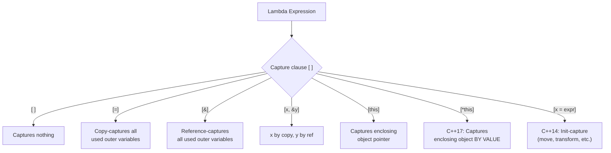
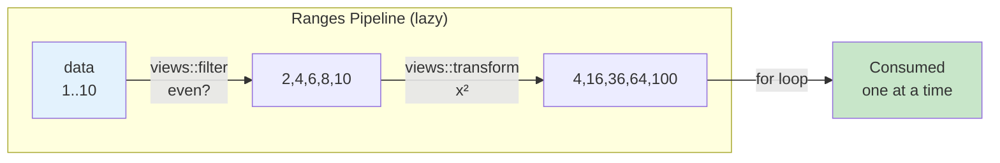

# Chapter 19 — Lambda Expressions & Functional C++

> *"Lambdas turned C++ from a language that supports functional idioms into one that makes them convenient."* — Bjarne Stroustrup

---

## 1 · Theory

A **lambda expression** is an anonymous function object (a *closure*) that the compiler
synthesises from concise inline syntax.  Under the hood the compiler generates
a unique, unnamed class with an `operator()` — exactly what you would write by
hand, but in a single expression.

**Functional programming** in C++ means treating functions as first-class values:
storing them in variables, passing them to algorithms, returning them from other
functions, and composing them.  Lambdas are the enabling technology that made
this practical starting with C++11, with each subsequent standard adding power.

### Timeline of Lambda Evolution

| Standard | Feature |
|----------|---------|
| C++11 | Basic lambda syntax, capture by value / reference |
| C++14 | Generic lambdas (`auto` parameters), generalised capture |
| C++17 | `constexpr` lambdas, `[*this]` capture by value |
| C++20 | Template lambdas, lambdas in unevaluated contexts, default-constructible stateless lambdas |
| C++23 | Deducing `this` in lambdas (explicit object parameter) |

---

## 2 · What / Why / How

### What
A lambda is a shorthand for creating a callable object *in place*, complete with
an optional captured environment (the *closure*).

### Why
- **Locality**: logic lives right next to the algorithm that uses it.
- **Brevity**: eliminates boilerplate functor classes.
- **Performance**: the compiler can inline a lambda more aggressively than a
  `std::function` or a function pointer because each lambda has a unique type.
- **Expressiveness**: enables higher-order patterns (map, filter, reduce) without
  leaving idiomatic C++.

### How
```
[capture-list](parameter-list) mutable? constexpr? noexcept? -> return-type { body }
```

Every part except the capture list and body is optional:

```cpp
auto greet = [] { return "hello"; };   // minimal lambda
```

---

## 3 · Lambda Syntax Deep Dive

### 3.1 Capture Semantics



### 3.2 Capture Examples

This program demonstrates all six capture modes available in C++ lambdas: capturing nothing, capturing all by copy (`[=]`), capturing all by reference (`[&]`), mixed capture, init-capture with `std::move` (C++14), and init-capture with a transformed expression. Each example shows how the lambda interacts with the outer scope's variables.

```cpp
// capture_demo.cpp — compile: g++ -std=c++20 -Wall -o capture_demo capture_demo.cpp
#include <iostream>
#include <string>
#include <memory>

int main() {
    int    x = 10;
    int    y = 20;
    std::string name = "Alice";

    // 1. Capture nothing
    auto add = [](int a, int b) { return a + b; };
    std::cout << "add: " << add(3, 4) << "\n";

    // 2. Capture by copy (default)
    auto show_x = [=] { std::cout << "x=" << x << "\n"; };
    show_x();

    // 3. Capture by reference (default)
    auto inc_y = [&] { ++y; };
    inc_y();
    std::cout << "y after inc: " << y << "\n";  // 21

    // 4. Mixed capture
    auto mixed = [x, &y] { return x + y; };
    std::cout << "mixed: " << mixed() << "\n";

    // 5. Init-capture (C++14) — move a unique_ptr into the lambda
    auto ptr = std::make_unique<int>(42);
    auto owner = [p = std::move(ptr)] {
        std::cout << "owned value: " << *p << "\n";
    };
    owner();
    // ptr is now nullptr

    // 6. Init-capture with transformation
    auto greeting = [msg = "Hello, " + name] {
        std::cout << msg << "\n";
    };
    greeting();
}
```

### 3.3 `[this]` vs `[*this]` (C++17)

This example contrasts `[this]` (capturing the pointer to the enclosing object) with `[*this]` (capturing a copy of the entire object). The `lazy_read_copy()` method returns a lambda that safely outlives the `Sensor` object because it holds its own copy, while `lazy_read_ptr()` would dangle if the object were destroyed before the lambda runs.

```cpp
// this_capture.cpp — compile: g++ -std=c++20 -Wall -o this_capture this_capture.cpp
#include <iostream>
#include <functional>

struct Sensor {
    double value = 3.14;

    // Captures `this` pointer — dangerous if Sensor is destroyed before lambda runs
    auto lazy_read_ptr() {
        return [this] { return value; };
    }

    // Captures a COPY of *this — safe even if Sensor is destroyed
    auto lazy_read_copy() {
        return [*this] { return value; };
    }
};

int main() {
    std::function<double()> fn;
    {
        Sensor s{2.71};
        fn = s.lazy_read_copy();  // safe: lambda holds its own Sensor copy
    } // s destroyed here
    std::cout << "read: " << fn() << "\n";  // 2.71 — safe
}
```

---

## 4 · Mutable Lambdas

By default, a lambda's `operator()` is `const` — you cannot modify captured-by-value
variables.  The `mutable` keyword lifts this restriction.

```cpp
// mutable_lambda.cpp — compile: g++ -std=c++20 -Wall -o mutable_lambda mutable_lambda.cpp
#include <iostream>

int main() {
    int counter = 0;

    // Without mutable: counter is const inside the lambda
    // auto bad = [counter]() { ++counter; };  // ERROR

    auto ticker = [counter]() mutable {
        return ++counter;  // modifies the lambda's OWN copy
    };

    std::cout << ticker() << "\n";  // 1
    std::cout << ticker() << "\n";  // 2
    std::cout << ticker() << "\n";  // 3
    std::cout << "original counter: " << counter << "\n";  // still 0
}
```

> **Key insight**: `mutable` modifies the lambda's *internal copy*. The original
> variable is never touched.

---

## 5 · Generic Lambdas (C++14) and Template Lambdas (C++20)

### 5.1 Generic Lambda — `auto` Parameters

A generic lambda uses `auto` parameters, which the compiler treats as an implicit template. This means a single lambda definition can accept arguments of any type — `int`, `double`, `std::string` — without writing separate overloads.

```cpp
// generic_lambda.cpp — compile: g++ -std=c++20 -Wall -o generic_lambda generic_lambda.cpp
#include <iostream>
#include <string>

int main() {
    // auto parameter → compiler generates a template operator()
    auto print = [](const auto& val) {
        std::cout << val << "\n";
    };

    print(42);
    print(3.14);
    print(std::string("hello"));
}
```

### 5.2 Template Lambda (C++20)

When you need to constrain or reuse the template parameter, C++20 template lambdas give you an explicit template parameter list. This example shows both an unconstrained template lambda that sums any `vector<T>` and a constrained one that only accepts `std::integral` types via concepts.

```cpp
// template_lambda.cpp — compile: g++ -std=c++20 -Wall -o template_lambda template_lambda.cpp
#include <iostream>
#include <concepts>
#include <vector>
#include <numeric>

int main() {
    // Explicit template parameter list — C++20
    auto sum_vec = []<typename T>(const std::vector<T>& v) -> T {
        return std::accumulate(v.begin(), v.end(), T{});
    };

    std::vector<int>    vi{1, 2, 3, 4, 5};
    std::vector<double> vd{1.1, 2.2, 3.3};

    std::cout << "int sum:    " << sum_vec(vi) << "\n";   // 15
    std::cout << "double sum: " << sum_vec(vd) << "\n";   // 6.6

    // Constrained template lambda with concepts
    auto add = []<std::integral T>(T a, T b) -> T {
        return a + b;
    };

    std::cout << "add: " << add(10, 20) << "\n";
    // add(1.5, 2.5);  // ERROR: double is not std::integral
}
```

---

## 6 · Immediately Invoked Lambda Expressions (IILE)

An IILE defines *and* calls a lambda in one expression — useful for complex
initialisation of `const` variables.

```cpp
// iile.cpp — compile: g++ -std=c++20 -Wall -o iile iile.cpp
#include <iostream>
#include <string>
#include <cstdlib>

int main() {
    // Complex init of a const variable
    const std::string config = [] {
        const char* env = std::getenv("APP_MODE");
        if (env && std::string(env) == "production")
            return std::string("prod-settings.json");
        return std::string("dev-settings.json");
    }();  // <-- note the () — invoked immediately

    std::cout << "config: " << config << "\n";

    // IILE for conditional constexpr
    constexpr int table_size = [] {
        if constexpr (sizeof(void*) == 8)
            return 1024;
        else
            return 256;
    }();

    std::cout << "table_size: " << table_size << "\n";
}
```

> **Why IILE?** It lets you write multi-statement initialisation logic while still
> marking the result `const` or `constexpr`.

---

## 7 · `std::function` — Type-Erased Callable Wrapper

`std::function<R(Args...)>` can hold *any* callable with that signature:
function pointer, functor, lambda, or `std::bind` result. This example builds a registry of named arithmetic operations, each stored as a `std::function<double(double, double)>`, and looks them up by name at runtime — demonstrating how `std::function` enables runtime polymorphism for callables.

```cpp
// std_function.cpp — compile: g++ -std=c++20 -Wall -o std_function std_function.cpp
#include <iostream>
#include <functional>
#include <vector>
#include <string>

// A registry of named operations
using Op = std::function<double(double, double)>;

double apply(const std::string& name, const std::vector<std::pair<std::string, Op>>& ops,
             double a, double b) {
    for (const auto& [op_name, fn] : ops) {
        if (op_name == name) return fn(a, b);
    }
    throw std::runtime_error("unknown op: " + name);
}

int main() {
    std::vector<std::pair<std::string, Op>> ops = {
        {"add", [](double a, double b) { return a + b; }},
        {"mul", [](double a, double b) { return a * b; }},
        {"pow", [](double a, double b) {
            double result = 1.0;
            for (int i = 0; i < static_cast<int>(b); ++i) result *= a;
            return result;
        }},
    };

    std::cout << "add(3,4) = " << apply("add", ops, 3, 4) << "\n";
    std::cout << "mul(3,4) = " << apply("mul", ops, 3, 4) << "\n";
    std::cout << "pow(2,10)= " << apply("pow", ops, 2, 10) << "\n";
}
```

### Performance Note

| Mechanism | Inline? | Heap alloc? | Use when |
|-----------|---------|-------------|----------|
| Raw lambda / template param | ✅ Yes | ❌ No | Hot paths, algorithms |
| `std::function` | ❌ Usually no | ⚠️ Possible (SBO) | Need to store heterogeneous callables |
| Function pointer | ❌ No | ❌ No | C interop, simple callbacks |

> **Rule of thumb**: prefer templates or `auto` for parameters when performance
> matters.  Use `std::function` when you need *runtime polymorphism* of callables.

---

## 8 · Higher-Order Functions: Composing & Chaining

### 8.1 Function Composition

This example implements mathematical function composition: `compose(f, g)` returns a new lambda that computes `f(g(x))`. Three simple functions are composed into a pipeline that adds three, doubles, and converts to a string — all without intermediate variables.

```cpp
// compose.cpp — compile: g++ -std=c++20 -Wall -o compose compose.cpp
#include <iostream>
#include <functional>

// compose(f, g) returns a lambda that computes f(g(x))
auto compose(auto f, auto g) {
    return [f, g](auto&&... args) {
        return f(g(std::forward<decltype(args)>(args)...));
    };
}

int main() {
    auto double_it  = [](int x) { return x * 2; };
    auto add_three  = [](int x) { return x + 3; };
    auto to_string  = [](int x) { return "result=" + std::to_string(x); };

    // Compose: to_string( double_it( add_three(x) ) )
    auto pipeline = compose(to_string, compose(double_it, add_three));

    std::cout << pipeline(7) << "\n";  // result=20  →  (7+3)*2 = 20
}
```

### 8.2 Pipeline Builder (Fluent Chaining)

This example builds reusable higher-order functions — `filter`, `transform`, and `reduce` — that each return a lambda operating on a vector. These building blocks are chained together to filter even numbers, square them, and sum the results, demonstrating how lambdas enable functional-style data processing without any library support.

```cpp
// pipeline.cpp — compile: g++ -std=c++20 -Wall -o pipeline pipeline.cpp
#include <iostream>
#include <vector>
#include <algorithm>
#include <numeric>

int main() {
    std::vector<int> data{1, 2, 3, 4, 5, 6, 7, 8, 9, 10};

    // Higher-order: accept and return lambdas
    auto filter = [](auto pred) {
        return [pred](const auto& vec) {
            std::remove_cvref_t<decltype(vec)> out;
            std::copy_if(vec.begin(), vec.end(), std::back_inserter(out), pred);
            return out;
        };
    };

    auto transform = [](auto fn) {
        return [fn](const auto& vec) {
            std::remove_cvref_t<decltype(vec)> out;
            out.reserve(vec.size());
            std::transform(vec.begin(), vec.end(), std::back_inserter(out), fn);
            return out;
        };
    };

    auto reduce = [](auto init, auto fn) {
        return [init, fn](const auto& vec) {
            return std::accumulate(vec.begin(), vec.end(), init, fn);
        };
    };

    // Chain: filter evens → square → sum
    auto evens   = filter([](int x) { return x % 2 == 0; });
    auto square  = transform([](int x) { return x * x; });
    auto sum_all = reduce(0, std::plus<int>{});

    int result = sum_all(square(evens(data)));
    std::cout << "sum of squares of evens: " << result << "\n";  // 4+16+36+64+100 = 220
}
```

---

## 9 · Functional Patterns with C++20 Ranges

C++20 Ranges provide a built-in, lazy alternative to the manual pipeline approach above. This example uses `views::filter` and `views::transform` with the pipe operator (`|`) to process data without intermediate allocations, and demonstrates `views::iota` for generating an infinite sequence of squares.

```cpp
// ranges_functional.cpp — compile: g++ -std=c++20 -Wall -o ranges_functional ranges_functional.cpp
#include <iostream>
#include <vector>
#include <ranges>
#include <numeric>

int main() {
    std::vector<int> data{1, 2, 3, 4, 5, 6, 7, 8, 9, 10};

    // filter | transform — lazy, zero intermediate allocations
    auto evens_squared = data
        | std::views::filter([](int x) { return x % 2 == 0; })
        | std::views::transform([](int x) { return x * x; });

    // Materialise or consume
    int total = 0;
    for (int v : evens_squared) {
        std::cout << v << " ";
        total += v;
    }
    std::cout << "\ntotal: " << total << "\n";  // 220

    // Generate infinite sequence, take first 5 squares
    auto squares = std::views::iota(1)
        | std::views::transform([](int x) { return x * x; })
        | std::views::take(5);

    for (int v : squares) std::cout << v << " ";  // 1 4 9 16 25
    std::cout << "\n";
}
```



---

## 10 · Exercises

### 🟢 Exercise 1 — Counter Factory

Write a function `make_counter(int start)` that returns a lambda. Each call to
the returned lambda increments and returns the next value.

```
auto c = make_counter(10);
c() → 10
c() → 11
c() → 12
```

### 🟡 Exercise 2 — Memoize

Implement a generic `memoize(f)` wrapper that caches results for previously
seen arguments.  Test with a recursive Fibonacci function.

### 🟡 Exercise 3 — Retry with Backoff

Write a higher-order function `retry(fn, max_attempts, delay_ms)` that calls
`fn()`.  If `fn` throws, retry up to `max_attempts` times, doubling `delay_ms`
each time.  Return the result on success or rethrow on final failure.

### 🔴 Exercise 4 — Mini Ranges Pipeline

Without using `<ranges>`, implement `Filter`, `Map`, and `Reduce` as
higher-order functions that operate on `std::vector<T>`.  Chain them to compute
the sum of ASCII values of uppercase letters in a string.

---

## 11 · Solutions

### Solution 1 — Counter Factory

This solution uses an init-capture (`n = start`) combined with `mutable` to create a lambda that maintains its own internal counter. Each call to the returned lambda increments and returns the next value, demonstrating how closures can encapsulate mutable state.

```cpp
// sol1_counter.cpp — compile: g++ -std=c++20 -Wall -o sol1 sol1_counter.cpp
#include <iostream>

auto make_counter(int start) {
    return [n = start]() mutable { return n++; };
}

int main() {
    auto c = make_counter(10);
    std::cout << c() << "\n";  // 10
    std::cout << c() << "\n";  // 11
    std::cout << c() << "\n";  // 12
}
```

### Solution 2 — Memoize

This solution wraps any single-argument function in a lambda that caches results in an `unordered_map`. The `mutable` keyword is required because the cache must be modified on each call. The Fibonacci example uses `std::function` for self-referencing recursion, allowing the memoized wrapper to intercept recursive calls.

```cpp
// sol2_memoize.cpp — compile: g++ -std=c++20 -Wall -o sol2 sol2_memoize.cpp
#include <iostream>
#include <functional>
#include <unordered_map>

template<typename Ret, typename Arg>
auto memoize(std::function<Ret(Arg)> fn) {
    std::unordered_map<Arg, Ret> cache;
    return [fn, cache](Arg a) mutable -> Ret {
        auto it = cache.find(a);
        if (it != cache.end()) return it->second;
        Ret result = fn(a);
        cache[a] = result;
        return result;
    };
}

int main() {
    // Recursive Fibonacci via std::function for memoization
    std::function<long long(int)> fib;
    fib = memoize<long long, int>(std::function<long long(int)>(
        [&fib](int n) -> long long {
            if (n <= 1) return n;
            return fib(n - 1) + fib(n - 2);
        }
    ));

    for (int i = 0; i < 15; ++i)
        std::cout << "fib(" << i << ")=" << fib(i) << " ";
    std::cout << "\n";
}
```

### Solution 3 — Retry with Backoff

This solution implements a generic retry wrapper using templates and exception handling. It calls the given function, catches failures, waits with exponentially increasing delays, and either returns the successful result or rethrows after exhausting all attempts. The test uses a deliberately unreliable lambda that succeeds only on the third call.

```cpp
// sol3_retry.cpp — compile: g++ -std=c++20 -Wall -o sol3 sol3_retry.cpp
#include <iostream>
#include <thread>
#include <chrono>
#include <stdexcept>
#include <random>

template<typename F>
auto retry(F fn, int max_attempts, int delay_ms) {
    int attempt = 0;
    while (true) {
        try {
            return fn();
        } catch (const std::exception& e) {
            if (++attempt >= max_attempts) throw;
            std::cerr << "attempt " << attempt << " failed: "
                      << e.what() << " — retrying in "
                      << delay_ms << "ms\n";
            std::this_thread::sleep_for(std::chrono::milliseconds(delay_ms));
            delay_ms *= 2;
        }
    }
}

int main() {
    std::mt19937 rng{42};
    int call_count = 0;

    auto unreliable = [&]() -> std::string {
        if (++call_count < 3)
            throw std::runtime_error("transient failure");
        return "success on attempt " + std::to_string(call_count);
    };

    auto result = retry(unreliable, 5, 100);
    std::cout << result << "\n";
}
```

### Solution 4 — Mini Ranges Pipeline

This solution implements `Filter`, `Map`, and `Reduce` as higher-order function templates that each return a lambda operating on vectors. They are chained together to extract uppercase letters from a string, convert them to ASCII values, and sum the results — all without using `<ranges>`.

```cpp
// sol4_pipeline.cpp — compile: g++ -std=c++20 -Wall -o sol4 sol4_pipeline.cpp
#include <iostream>
#include <vector>
#include <string>
#include <numeric>
#include <algorithm>

template<typename Pred>
auto Filter(Pred pred) {
    return [pred](const auto& vec) {
        std::remove_cvref_t<decltype(vec)> out;
        std::copy_if(vec.begin(), vec.end(), std::back_inserter(out), pred);
        return out;
    };
}

template<typename Fn>
auto Map(Fn fn) {
    return [fn](const auto& vec) {
        using R = decltype(fn(*vec.begin()));
        std::vector<R> out;
        out.reserve(vec.size());
        std::transform(vec.begin(), vec.end(), std::back_inserter(out), fn);
        return out;
    };
}

template<typename T, typename Fn>
auto Reduce(T init, Fn fn) {
    return [init, fn](const auto& vec) {
        return std::accumulate(vec.begin(), vec.end(), init, fn);
    };
}

int main() {
    std::string input = "Hello, World! ABC xyz 123";
    std::vector<char> chars(input.begin(), input.end());

    auto result = Reduce(0, std::plus<int>{})(
        Map([](char c) -> int { return static_cast<int>(c); })(
            Filter([](char c) { return c >= 'A' && c <= 'Z'; })(chars)
        )
    );

    std::cout << "sum of uppercase ASCII: " << result << "\n";
    // H=72 W=87 A=65 B=66 C=67 = 357
}
```

---

## 12 · Quiz

**Q1.** What is the type of a lambda expression?
<details><summary>Answer</summary>
Each lambda has a unique, unnamed *closure type* generated by the compiler.
Two lambdas with identical source code still have different types.
</details>

**Q2.** What happens if you capture a local variable by reference and the
variable goes out of scope before the lambda is called?
<details><summary>Answer</summary>
Undefined behaviour — the reference dangles. Use capture by value or
`[*this]` to avoid this.
</details>

**Q3.** Can a lambda be `constexpr`?
<details><summary>Answer</summary>
Yes. Since C++17 lambdas are implicitly `constexpr` if they satisfy
constexpr requirements. You can also mark them explicitly `constexpr`.
</details>

**Q4.** What is the difference between `[this]` and `[*this]`?
<details><summary>Answer</summary>
`[this]` captures the pointer to the enclosing object — the lambda can
access members but the object must outlive the lambda. `[*this]` (C++17)
copies the entire object into the closure, making it safe to use after the
original object is destroyed.
</details>

**Q5.** Why is `std::function` slower than a raw lambda in a template parameter?
<details><summary>Answer</summary>
`std::function` uses type erasure (virtual dispatch or function pointers)
and may heap-allocate the stored callable. A raw lambda passed as a
template argument preserves the exact type, enabling the compiler to inline
the call.
</details>

**Q6.** What does `mutable` do on a lambda?
<details><summary>Answer</summary>
It makes the closure's `operator()` non-const, allowing modification of
variables captured by value. Without `mutable`, those copies are const.
</details>

**Q7.** What is an IILE and when is it useful?
<details><summary>Answer</summary>
An Immediately Invoked Lambda Expression — a lambda that is defined and
called in the same expression: `auto x = []{ ... }();`. It is useful for
complex initialisation of `const` or `constexpr` variables.
</details>

**Q8.** In C++20, how do template lambdas differ from generic lambdas?
<details><summary>Answer</summary>
A generic lambda uses `auto` parameters and the compiler deduces each
independently. A C++20 template lambda has an explicit template parameter
list (`[]<typename T>(T a, T b)`), letting you constrain types, reuse the
same type across parameters, or access the type by name inside the body.
</details>

---

## 13 · Key Takeaways

1. **Lambdas are compiler-generated functors** — learn the mental model of the
   unnamed class with `operator()`.
2. **Capture only what you need** — prefer explicit captures `[x, &y]` over
   default captures `[=]` / `[&]` for clarity and safety.
3. **Use `[*this]` (C++17)** when a lambda may outlive the enclosing object.
4. **Generic lambdas** (`auto`) give you template power without template syntax;
   **template lambdas** (C++20) give you full control when you need it.
5. **IILE** is the cleanest way to initialise complex `const` variables.
6. **Prefer templates over `std::function`** on hot paths — reserve
   `std::function` for runtime polymorphism of callables.
7. **C++20 Ranges + lambdas** enable lazy, composable, zero-overhead functional
   pipelines rivalling Haskell or Rust iterators.

---

## 14 · Chapter Summary

This chapter traced lambdas from their C++11 origins through C++20 template
lambdas.  We covered every capture mode — by value, by reference, init-capture,
`this`, and `*this` — and showed when each is safe.  We explored `mutable`
lambdas, `constexpr` lambdas, and the IILE pattern for complex initialisation.

We then moved into functional territory: `std::function` for type-erased
callable storage, function composition, higher-order pipeline builders, and
finally C++20 Ranges for lazy, declarative data processing.  The exercises
reinforced these patterns with practical tasks: counters, memoization, retry
logic, and a hand-rolled filter-map-reduce chain.

---

## 15 · Real-World Insight

**At scale, lambdas appear everywhere:**

- **Event Systems** — game engines store `std::function` callbacks for input,
  physics, and rendering events.
- **Thread Pools** — tasks submitted as lambdas:
  `pool.submit([data]{ process(data); });`.
- **Configuration** — IILE initialises `const` configuration objects from
  environment variables or files, ensuring immutability after startup.
- **Data Pipelines** — financial systems chain range-based views to filter,
  transform, and aggregate tick data in real time with zero allocations.
- **GPU Dispatch** — CUDA/SYCL/Kokkos use lambda-like constructs to express
  parallel kernels while retaining C++ type safety.

---

## 16 · Common Mistakes

| # | Mistake | Why It Hurts | Fix |
|---|---------|-------------|-----|
| 1 | Capturing a local by reference and returning the lambda | Dangling reference → UB | Capture by value or use `[*this]` |
| 2 | Using `[=]` in a member function, thinking it copies members | `[=]` captures `this` *pointer* by value | Use `[*this]` or explicit member copies |
| 3 | Forgetting `mutable` when modifying captured-by-value variables | Compilation error | Add `mutable` after the parameter list |
| 4 | Wrapping every lambda in `std::function` | Prevents inlining, may heap-allocate | Use `auto` or template parameters |
| 5 | Capturing large objects by value unintentionally with `[=]` | Expensive copies, bloated closure | Capture by reference or move into init-capture |
| 6 | Assuming two identical lambdas have the same type | Each lambda has a unique type | Use templates or `std::function` when storing heterogeneous lambdas |
| 7 | Returning a lambda that captures local references | Returned closure outlives locals | Capture by value or move semantics |

---

## 17 · Interview Questions

### Q1: Explain how the compiler implements a lambda expression internally.

**Answer:**  
The compiler generates an anonymous class (the *closure type*) with:
- A data member for each captured variable (copy or reference depending on
  capture mode).
- An `operator()` whose signature matches the lambda's parameter list and
  return type.  It is `const` by default; `mutable` removes the `const`.
- If the lambda captures nothing, the compiler also provides an implicit
  conversion to a function pointer matching the signature.

For example:

```cpp
int x = 5;
auto fn = [x](int y) { return x + y; };
```

is roughly equivalent to:

```cpp
struct __lambda_1 {
    int x;
    int operator()(int y) const { return x + y; }
};
auto fn = __lambda_1{5};
```

### Q2: When should you use `std::function` vs a template parameter for accepting a callable?

**Answer:**  
Use a **template parameter** (or `auto`) when:
- Performance matters (enables inlining).
- The callable type is known at compile time.
- You're writing an algorithm that doesn't need to store the callable beyond
  the call.

Use **`std::function`** when:
- You need to store callables of *different* types in the same container or
  data member (runtime polymorphism).
- The callable crosses an ABI boundary (shared library).
- You need a stable, non-template API (e.g., callback registration).

The cost of `std::function`: type erasure overhead (virtual call or function
pointer indirection), possible heap allocation if the callable exceeds the
small buffer optimisation (typically 16-32 bytes).

### Q3: What is the dangling-reference problem with lambda captures, and how does C++17's `[*this]` help?

**Answer:**  
When a lambda in a member function captures `[this]` or `[=]` (which implicitly
captures `this` in a member context), it stores the *pointer* to the enclosing
object.  If the object is destroyed before the lambda executes, the pointer
dangles and any access is undefined behaviour.

C++17's `[*this]` capture copies the *entire enclosing object* into the closure,
giving the lambda its own independent copy.  This is safe even if the original
object is destroyed, making it ideal for lambdas passed to asynchronous APIs,
thread pools, or stored in containers that outlive the source object.

Trade-off: `[*this]` copies the full object, which may be expensive for large
types.  In such cases, selectively capturing the needed members via init-capture
is a better alternative.

### Q4: Describe the IILE pattern and give a practical use case.

**Answer:**  
IILE (Immediately Invoked Lambda Expression) defines and calls a lambda in one
expression:

```cpp
const auto config = []{
    // multi-line logic
    return computed_value;
}();
```

**Use case**: initialising a `const` variable that requires non-trivial logic
(conditionals, loops, parsing) — the kind of code you'd otherwise put in a
helper function.  IILE keeps the logic local, makes the variable `const` (or
even `constexpr`), and avoids polluting the namespace with a one-shot function.

### Q5: How do C++20 template lambdas improve upon C++14 generic lambdas?

**Answer:**  
C++14 generic lambdas use `auto` parameters — the compiler deduces each
independently, and you cannot refer to the deduced type by name, constrain it,
or enforce that two parameters share the same type.

C++20 template lambdas add an explicit template parameter list:

```cpp
auto fn = []<typename T>(const std::vector<T>& v) -> T { ... };
```

Benefits:
- **Named type parameter**: `T` is accessible in the body for casts, nested
  templates, or static assertions.
- **Constraints**: you can apply concepts (`[]<std::integral T>(...)`).
- **Same-type enforcement**: `[]<typename T>(T a, T b)` ensures both parameters
  are the same type — impossible with `auto` alone.
- **SFINAE / requires clauses**: full template machinery is available.

---

*Next chapter → [Chapter 20 — Smart Pointers & Resource Management](20_Smart_Pointers_RAII.md)*
