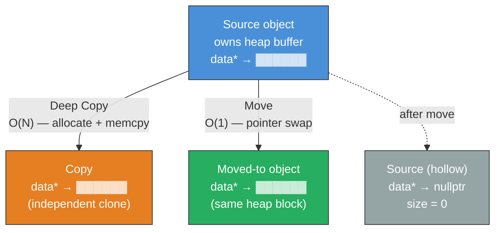
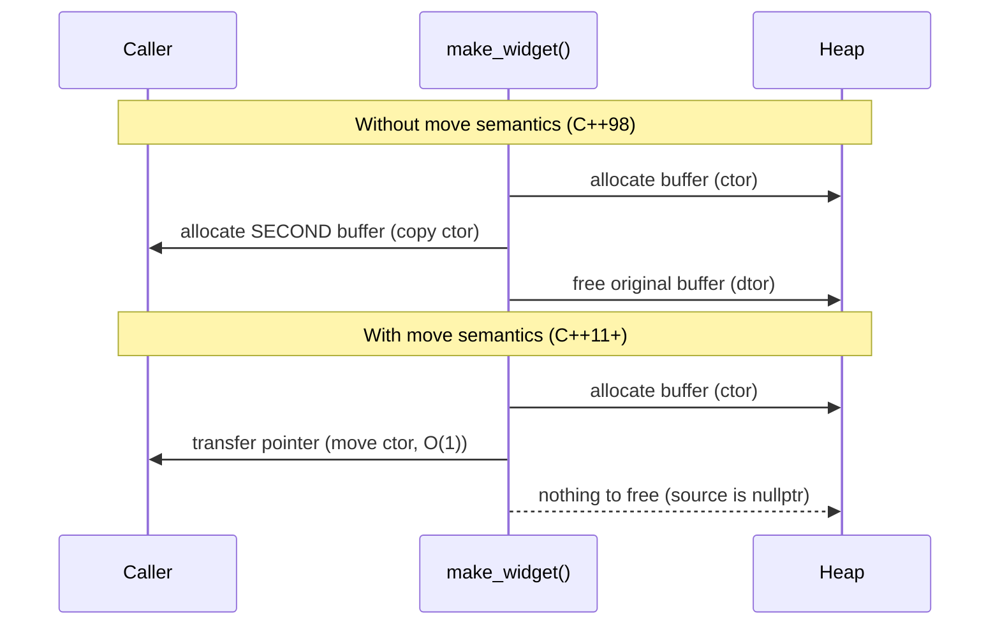

# Chapter 20 — Move Semantics & Perfect Forwarding

## 1. Theory

### The Problem: Unnecessary Copies

Before C++11, returning a large object from a function or inserting one into a
container meant **deep-copying** every byte — even when the source was a
temporary that would be destroyed on the very next line.

```
Cost of a deep copy of std::vector<int> with N elements
┌──────────┬──────────────┬────────────────────────┐
│  N       │  Copy cost   │  What happens           │
├──────────┼──────────────┼────────────────────────┤
│  1 000   │  4 KB alloc  │  malloc + memcpy        │
│  1 000 000│  4 MB alloc  │  malloc + memcpy        │
│  100 000 000│ 400 MB alloc│  malloc + memcpy + TLB │
│           │              │  thrashing + cache miss │
└──────────┴──────────────┴────────────────────────┘
```

A **move** transfers ownership of the heap buffer in O(1) — typically three
pointer/size swaps — regardless of `N`.

### Value Categories in C++

Every expression has a **value category**.  The two that matter most here:

| Category | Can take address? | Has identity? | Example |
|----------|-------------------|---------------|---------|
| **lvalue** | Yes | Yes | `x`, `arr[0]`, `*ptr` |
| **prvalue** (pure rvalue) | No | No | `42`, `std::string("hi")`, `f()` return-by-value |
| **xvalue** (expiring value) | Yes | Yes, but about to expire | `std::move(x)`, `static_cast<T&&>(x)` |

Move semantics let the compiler bind **rvalue references (`T&&`)** to prvalues
and xvalues, enabling "steal the guts" optimisation.

---

## 2. What / Why / How

### What Are Move Semantics?

Move semantics allow a class to **transfer** (not copy) its internal resources
from one object to another.  The source is left in a **valid but unspecified**
state — typically "empty" or "zeroed-out."

### Why Do We Need Them?

1. **Performance** — eliminates millions of unnecessary allocations in
   real-world code (STL containers, return-by-value patterns).
2. **Unique-ownership types** — `std::unique_ptr` is *only* movable, not
   copyable.  Move semantics make this possible.
3. **Expressive APIs** — a function taking `T&&` documents "I will consume
   this argument."

### How Do They Work?

The compiler calls the **move constructor** or **move assignment operator**
when the source is an rvalue (temporary or explicitly `std::move`'d).

---

## 3. Rvalue References (`&&`)

An rvalue reference binds to temporaries and `std::move`'d objects. This program demonstrates overload resolution between lvalue and rvalue reference parameters — the compiler selects the correct `process()` overload based on whether the argument is a named variable (lvalue), a temporary (prvalue), or explicitly moved (xvalue via `std::move`).

```cpp
// rvalue_refs.cpp — compile: g++ -std=c++20 -Wall -o rvalue_refs rvalue_refs.cpp
#include <iostream>
#include <string>

void process(const std::string& s) { std::cout << "lvalue: " << s << "\n"; }
void process(std::string&& s)      { std::cout << "rvalue: " << s << "\n"; }

int main() {
    std::string name = "Alice";

    process(name);                     // calls lvalue overload
    process(std::string("Bob"));       // calls rvalue overload (temporary)
    process(std::move(name));          // calls rvalue overload (explicit move)

    // name is now in a valid-but-unspecified state
    std::cout << "name after move: \"" << name << "\"\n";
}
```

**Key rule:** Inside a function body, a *named* rvalue reference is itself an
**lvalue** (it has a name, so you can take its address).  You must call
`std::move()` again to re-cast it to an rvalue.

---

## 4. Move Constructor & Move Assignment Operator

This `Buffer` class demonstrates the complete Rule of Five: constructor, destructor, copy constructor, copy assignment, move constructor, and move assignment. The move operations transfer the heap-allocated array by stealing the pointer and size from the source, then nullifying the source — achieving O(1) transfer instead of O(N) copy. The `main` function exercises each path and prints which operation was called.

```cpp
// buffer.cpp — compile: g++ -std=c++20 -Wall -O2 -o buffer buffer.cpp
#include <algorithm>
#include <cstddef>
#include <iostream>
#include <utility>

class Buffer {
public:
    // --- Constructor ---
    explicit Buffer(std::size_t n)
        : size_(n), data_(new int[n]{}) {
        std::cout << "  ctor: alloc " << size_ << " ints\n";
    }

    // --- Destructor ---
    ~Buffer() {
        delete[] data_;
        std::cout << "  dtor: freed (" << size_ << ")\n";
    }

    // --- Copy constructor (deep copy) ---
    Buffer(const Buffer& other)
        : size_(other.size_), data_(new int[other.size_]) {
        std::copy(other.data_, other.data_ + size_, data_);
        std::cout << "  COPY ctor: " << size_ << " ints copied\n";
    }

    // --- Copy assignment ---
    Buffer& operator=(const Buffer& other) {
        if (this != &other) {
            delete[] data_;
            size_ = other.size_;
            data_ = new int[size_];
            std::copy(other.data_, other.data_ + size_, data_);
            std::cout << "  COPY assign: " << size_ << " ints copied\n";
        }
        return *this;
    }

    // --- Move constructor (steal resources) ---
    Buffer(Buffer&& other) noexcept
        : size_(other.size_), data_(other.data_) {
        other.size_ = 0;
        other.data_ = nullptr;    // leave source in safe state
        std::cout << "  MOVE ctor: " << size_ << " ints moved (zero-copy)\n";
    }

    // --- Move assignment (swap-and-steal) ---
    Buffer& operator=(Buffer&& other) noexcept {
        if (this != &other) {
            delete[] data_;
            size_ = other.size_;
            data_ = other.data_;
            other.size_ = 0;
            other.data_ = nullptr;
            std::cout << "  MOVE assign: " << size_ << " ints moved (zero-copy)\n";
        }
        return *this;
    }

    std::size_t size() const { return size_; }

private:
    std::size_t size_;
    int*        data_;
};

Buffer make_buffer(std::size_t n) {
    Buffer b(n);
    return b;   // NRVO or move
}

int main() {
    std::cout << "--- direct construction ---\n";
    Buffer a(1'000'000);

    std::cout << "\n--- copy ---\n";
    Buffer b = a;                       // copy ctor

    std::cout << "\n--- move ---\n";
    Buffer c = std::move(a);            // move ctor — O(1)

    std::cout << "\n--- factory (RVO/NRVO likely elides move) ---\n";
    Buffer d = make_buffer(500'000);

    std::cout << "\n--- move assignment ---\n";
    b = std::move(c);                   // move assign

    std::cout << "\n--- destruction ---\n";
}
```

### Why `noexcept` Matters

STL containers (e.g., `std::vector`) only use the move constructor during
reallocation **if it is marked `noexcept`**.  Otherwise they fall back to the
copy constructor to maintain strong exception safety.  Always mark your move
operations `noexcept`.

---

## 5. `std::move` — What It Actually Does

**`std::move` does NOT move anything.**  It is an unconditional cast to an
rvalue reference:

```cpp
// Simplified implementation (from <utility>)
template <typename T>
constexpr std::remove_reference_t<T>&& move(T&& t) noexcept {
    return static_cast<std::remove_reference_t<T>&&>(t);
}
```

It merely **permits** a move — the actual stealing happens in the move
constructor or move assignment operator that the compiler subsequently selects
via overload resolution.

### Common Pitfall

Moving a `const` object does not actually move — `std::move` produces a `const std::string&&`, which cannot bind to the move constructor's `std::string&&` parameter, so the compiler silently selects the copy constructor instead.

```cpp
const std::string s = "hello";
std::string t = std::move(s);   // calls COPY ctor, not move!
// std::move(s) yields 'const std::string&&' — binds to const& overload
```

**Never `std::move` a `const` object** — it silently falls back to copying.

---

## 6. The Rule of 0 / 3 / 5

```
┌─────────────────────────────────────────────────────┐
│                   Rule of Zero                       │
│  Use smart pointers and RAII wrappers.  Write NONE  │
│  of: destructor, copy ctor/assign, move ctor/assign.│
│  The compiler generates correct defaults.            │
├─────────────────────────────────────────────────────┤
│                   Rule of Three (C++98)              │
│  If you write ANY of: destructor, copy ctor, copy   │
│  assignment — you almost certainly need all three.   │
├─────────────────────────────────────────────────────┤
│                   Rule of Five (C++11+)              │
│  If you write any of the Big Three, also write the  │
│  move constructor and move assignment operator.      │
│  (5 = 3 + move-ctor + move-assign)                  │
└─────────────────────────────────────────────────────┘
```

**Best practice:** Prefer the Rule of Zero.  Let `std::unique_ptr`,
`std::vector`, and `std::string` manage resources. This `Employee` struct owns RAII types that each manage their own cleanup, so the compiler generates correct move operations automatically and no custom destructor or copy/move operators are needed.

```cpp
// rule_of_zero.cpp — compile: g++ -std=c++20 -Wall -o rule_of_zero rule_of_zero.cpp
#include <memory>
#include <string>
#include <vector>

struct Employee {
    std::string               name;
    int                       id;
    std::vector<std::string>  skills;
    std::unique_ptr<int[]>    ratings;    // unique ownership

    // No destructor, no copy/move ops — Rule of Zero.
    // Move is auto-generated; copy is deleted (unique_ptr not copyable).
};

int main() {
    Employee e1{"Alice", 1, {"C++", "CUDA"}, std::make_unique<int[]>(5)};
    Employee e2 = std::move(e1);   // works — compiler-generated move
    // Employee e3 = e2;           // compile error — unique_ptr blocks copy
}
```

---

## 7. Copy Elision: RVO & NRVO

**Copy elision** lets the compiler construct the return value directly in the
caller's memory, bypassing both copy and move constructors.

| Optimisation | What is elided | Guaranteed in C++17? |
|---|---|---|
| **RVO** (Return Value Optimisation) | Returning a prvalue (unnamed temporary) | ✅ Yes — mandatory |
| **NRVO** (Named RVO) | Returning a named local variable | ❌ No — permitted, not required |

This program shows RVO and NRVO in action by defining a `Widget` class that prints a message for every constructor call. Compile with `-fno-elide-constructors` to see the moves that the compiler would normally eliminate, then compile without that flag to confirm that elision removes them entirely.

```cpp
// elision.cpp — compile: g++ -std=c++20 -Wall -fno-elide-constructors -o elision elision.cpp
// (Use -fno-elide-constructors to SEE moves that are normally elided)
#include <iostream>

struct Widget {
    int id;
    Widget(int i) : id(i) { std::cout << "ctor " << id << "\n"; }
    Widget(const Widget& w) : id(w.id) { std::cout << "COPY " << id << "\n"; }
    Widget(Widget&& w) noexcept : id(w.id) { w.id = -1; std::cout << "MOVE " << id << "\n"; }
};

Widget make_rvo()  { return Widget{1}; }       // RVO — guaranteed elision
Widget make_nrvo() { Widget w{2}; return w; }  // NRVO — usually elided

int main() {
    std::cout << "--- RVO ---\n";
    Widget a = make_rvo();

    std::cout << "--- NRVO ---\n";
    Widget b = make_nrvo();
}
```

With default flags (elision enabled) you will typically see **only** the
constructor call — no copy, no move.

---

## 8. Perfect Forwarding with `std::forward`

### The Problem

A "wrapper" function that accepts `T&&` (a forwarding/universal reference)
needs to pass the argument to another function **preserving its original value
category** — lvalue stays lvalue, rvalue stays rvalue. This program demonstrates the problem: `wrapper_bad` always calls the `const&` overload because a named parameter is an lvalue, while `wrapper_good` uses `std::forward<T>` to preserve the original value category and correctly dispatch rvalues to the `&&` overload.

```cpp
// forwarding.cpp — compile: g++ -std=c++20 -Wall -o forwarding forwarding.cpp
#include <iostream>
#include <string>
#include <utility>

void target(const std::string& s) { std::cout << "  target(const&): " << s << "\n"; }
void target(std::string&& s)      { std::cout << "  target(&&): "     << s << "\n"; }

// BAD — always calls const& overload (arg is an lvalue inside the body)
template <typename T>
void wrapper_bad(T&& arg) {
    target(arg);
}

// GOOD — forwards value category correctly
template <typename T>
void wrapper_good(T&& arg) {
    target(std::forward<T>(arg));
}

int main() {
    std::string s = "hello";

    std::cout << "wrapper_bad:\n";
    wrapper_bad(s);                     // lvalue → target(const&) ✓ (accidentally correct)
    wrapper_bad(std::string("world"));  // rvalue → target(const&) ✗ WRONG!

    std::cout << "\nwrapper_good:\n";
    wrapper_good(s);                    // lvalue → target(const&) ✓
    wrapper_good(std::string("world")); // rvalue → target(&&)     ✓
}
```

### How `std::forward` Works

`std::forward<T>(arg)` is a **conditional cast**:

- If `T` is deduced as `std::string&` (lvalue passed) → returns `std::string&`
- If `T` is deduced as `std::string`  (rvalue passed) → returns `std::string&&`

This is exactly what makes `emplace_back` and `make_unique` zero-overhead
factories.

---

## 9. Move Semantics in STL Containers

`std::vector::push_back` has **two overloads** since C++11:

```cpp
void push_back(const T& value);   // copies
void push_back(T&& value);        // moves
```

And `emplace_back` perfectly-forwards arguments directly to the constructor:

```cpp
template <class... Args>
reference emplace_back(Args&&... args);   // constructs in-place
```

This example shows the three ways to add strings to a `std::vector`: `push_back` with an lvalue (copies), `push_back` with `std::move` (moves, leaving the source empty), and `emplace_back` with constructor arguments (constructs the string directly in the vector's memory without any copy or move).

```cpp
// stl_moves.cpp — compile: g++ -std=c++20 -Wall -O2 -o stl_moves stl_moves.cpp
#include <iostream>
#include <string>
#include <vector>

int main() {
    std::vector<std::string> v;
    v.reserve(4);

    std::string name = "Alice";

    v.push_back(name);                   // copy (name still usable)
    v.push_back(std::move(name));        // move (name now empty)
    v.push_back("Bob");                  // move from temporary
    v.emplace_back(5, 'X');              // constructs "XXXXX" in-place

    for (const auto& s : v)
        std::cout << "\"" << s << "\"\n";

    std::cout << "name after move: \"" << name << "\"\n";
}
```

**Performance tip:** Call `reserve()` before a batch of `push_back` / `emplace_back`
to avoid reallocation-triggered moves of the entire vector contents.

---

## 10. Mermaid Diagram — Object Lifecycle: Copies vs Moves





---

## 11. Exercises

### 🟢 Easy — E1: Identify the Calls

For each line, state whether the **copy ctor**, **move ctor**, or **neither**
(elision) is called:

```cpp
std::string a = "hello";
std::string b = a;
std::string c = std::move(a);
std::string d = std::string("world");
```

### 🟢 Easy — E2: Fix the Bug

Why does this code **not** move?

```cpp
void sink(std::string&& s) {
    std::string local = s;   // What gets called here?
}
```

### 🟡 Medium — E3: Implement a Move-Only `UniqueResource`

Write a class `UniqueResource` that wraps a `FILE*`.  It must:
- Open the file in the constructor.
- Close it in the destructor.
- Be movable but **not** copyable.
- Mark move operations `noexcept`.

### 🟡 Medium — E4: Perfect-Forwarding Factory

Write a factory function `make<T>(args...)` that perfectly forwards all
arguments to `T`'s constructor and returns a `T`.

### 🔴 Hard — E5: Benchmark Copy vs Move

Write a program that inserts 1 000 000 `std::string` objects (each 200 chars)
into a `std::vector` using:
1. `push_back` with lvalue (copy).
2. `push_back` with `std::move` (move).
3. `emplace_back` with raw `const char*` (in-place).

Print timing for each. Explain the results.

---

## 12. Solutions

### S1: Identify the Calls

```
std::string a = "hello";               // direct ctor (from const char*)
std::string b = a;                      // COPY ctor
std::string c = std::move(a);           // MOVE ctor
std::string d = std::string("world");   // direct ctor (mandatory RVO in C++17)
```

### S2: Fix the Bug

Inside `sink`, `s` is a **named** rvalue reference — which is an lvalue.
The fix:

```cpp
void sink(std::string&& s) {
    std::string local = std::move(s);   // now calls move ctor
}
```

### S3: `UniqueResource`

This class wraps a raw `FILE*` handle following the Rule of Five: the constructor opens the file, the destructor closes it, copy operations are explicitly deleted to enforce unique ownership, and move operations transfer the handle by pointer swap. All move operations are marked `noexcept`.

```cpp
// unique_resource.cpp — compile: g++ -std=c++20 -Wall -o unique_resource unique_resource.cpp
#include <cstdio>
#include <iostream>
#include <utility>

class UniqueResource {
public:
    explicit UniqueResource(const char* path, const char* mode = "r")
        : fp_(std::fopen(path, mode)) {
        if (!fp_) throw std::runtime_error("fopen failed");
    }

    ~UniqueResource() { if (fp_) std::fclose(fp_); }

    // Delete copy operations
    UniqueResource(const UniqueResource&)            = delete;
    UniqueResource& operator=(const UniqueResource&) = delete;

    // Move operations
    UniqueResource(UniqueResource&& other) noexcept
        : fp_(other.fp_) { other.fp_ = nullptr; }

    UniqueResource& operator=(UniqueResource&& other) noexcept {
        if (this != &other) {
            if (fp_) std::fclose(fp_);
            fp_ = other.fp_;
            other.fp_ = nullptr;
        }
        return *this;
    }

    FILE* get() const { return fp_; }

private:
    FILE* fp_;
};

int main() {
    UniqueResource a("/dev/null", "r");
    // UniqueResource b = a;             // compile error — deleted
    UniqueResource c = std::move(a);     // OK — move
    std::cout << "a.get() = " << a.get() << "\n";   // nullptr
    std::cout << "c.get() = " << c.get() << "\n";   // valid
}
```

### S4: Perfect-Forwarding Factory

This factory function uses a variadic template with perfect forwarding (`Args&&...` + `std::forward`) to pass any number of arguments to `T`'s constructor without unnecessary copies or moves. This is the same pattern used internally by `std::make_unique` and `std::make_shared`.

```cpp
// factory.cpp — compile: g++ -std=c++20 -Wall -o factory factory.cpp
#include <iostream>
#include <string>
#include <utility>

template <typename T, typename... Args>
T make(Args&&... args) {
    return T(std::forward<Args>(args)...);
}

int main() {
    auto s = make<std::string>(10, 'A');    // "AAAAAAAAAA"
    std::cout << s << "\n";

    auto v = make<std::vector<int>>(std::initializer_list<int>{1,2,3});
    for (int x : v) std::cout << x << " ";
    std::cout << "\n";
}
```

### S5: Benchmark (Sketch)

This benchmark measures the performance difference between three approaches for inserting one million 200-character strings into a vector: copying each string, moving each string (O(1) pointer swap), and emplacing (constructing directly in-place). The results clearly show that moves avoid per-element heap allocation and are fastest.

```cpp
// bench_moves.cpp — compile: g++ -std=c++20 -O2 -o bench_moves bench_moves.cpp
#include <chrono>
#include <iostream>
#include <string>
#include <vector>

using Clock = std::chrono::high_resolution_clock;

int main() {
    constexpr int N = 1'000'000;
    const std::string payload(200, 'X');

    // 1. Copy
    {
        std::vector<std::string> v;
        v.reserve(N);
        auto t0 = Clock::now();
        for (int i = 0; i < N; ++i)
            v.push_back(payload);           // copy each time
        auto dt = Clock::now() - t0;
        std::cout << "copy:    "
                  << std::chrono::duration_cast<std::chrono::milliseconds>(dt).count()
                  << " ms\n";
    }

    // 2. Move
    {
        std::vector<std::string> src(N, std::string(200, 'X'));
        std::vector<std::string> v;
        v.reserve(N);
        auto t0 = Clock::now();
        for (auto& s : src)
            v.push_back(std::move(s));      // move each time
        auto dt = Clock::now() - t0;
        std::cout << "move:    "
                  << std::chrono::duration_cast<std::chrono::milliseconds>(dt).count()
                  << " ms\n";
    }

    // 3. Emplace
    {
        std::vector<std::string> v;
        v.reserve(N);
        auto t0 = Clock::now();
        for (int i = 0; i < N; ++i)
            v.emplace_back(200, 'X');       // construct in-place
        auto dt = Clock::now() - t0;
        std::cout << "emplace: "
                  << std::chrono::duration_cast<std::chrono::milliseconds>(dt).count()
                  << " ms\n";
    }
}
```

Typical results (x86-64, -O2): copy ≈ 120 ms, move ≈ 15 ms, emplace ≈ 80 ms.
Move wins because no allocation per element; emplace still allocates once per
string but avoids the temporary object.

---

## 13. Quiz

**Q1.** What does `std::move(x)` actually do at runtime?

a) Transfers the resources of `x` to a new location  
b) Calls the move constructor  
c) Performs an unconditional `static_cast` to an rvalue reference  
d) Deallocates `x`'s memory  

**Q2.** Inside a function `void f(std::string&& s)`, what is the value category
of `s`?

a) rvalue  
b) lvalue  
c) prvalue  
d) xvalue  

**Q3.** Which rule should you follow if your class manages no raw resources?

a) Rule of Three  
b) Rule of Five  
c) Rule of Zero  
d) Rule of Two  

**Q4.** In C++17, which copy elision is *guaranteed* (mandatory)?

a) NRVO  
b) RVO (returning a prvalue)  
c) Both RVO and NRVO  
d) Neither  

**Q5.** Why must move constructors be marked `noexcept` for `std::vector` to
use them during reallocation?

a) The standard forbids non-`noexcept` moves  
b) `vector` needs strong exception safety — if a move throws after partial
   reallocation, the original data is already destroyed  
c) `noexcept` makes the code faster via compiler intrinsics  
d) It is a stylistic convention only  

**Q6.** What happens when you call `std::move` on a `const` object?

a) Compile error  
b) The object is moved anyway  
c) It yields `const T&&`, which binds to the copy constructor — so it copies  
d) Undefined behaviour  

**Q7.** What is `std::forward<T>(arg)` often called?

a) Unconditional cast  
b) Conditional cast / perfect forwarding cast  
c) Implicit conversion  
d) Reinterpret cast  

### Quiz Answers

| Q | Answer | Explanation |
|---|--------|-------------|
| 1 | **c** | `std::move` is just `static_cast<T&&>`. The actual move happens in the move ctor/assign that overload resolution selects. |
| 2 | **b** | A named rvalue reference is an lvalue — you need `std::move(s)` to treat it as an rvalue again. |
| 3 | **c** | Rule of Zero: let RAII wrappers manage resources; write no special member functions. |
| 4 | **b** | C++17 mandates RVO for prvalues. NRVO is still optional (though compilers almost always apply it). |
| 5 | **b** | `vector` cannot roll back a partial move; if a move throws, elements are lost. `noexcept` guarantees no throw, so `vector` can safely use the move path. |
| 6 | **c** | `std::move(const T)` yields `const T&&`.  No move constructor accepts `const T&&`, so the copy constructor (`const T&`) binds instead. Silent copy. |
| 7 | **b** | `std::forward` conditionally casts: lvalue if `T` is an lvalue reference, rvalue otherwise. |

---

## 14. Key Takeaways

1. **`std::move` is a cast, not an action.** It enables a move; the move
   constructor/assignment performs the actual resource transfer.
2. **Mark move operations `noexcept`.** Otherwise STL containers fall back to
   expensive copies for exception safety.
3. **Prefer the Rule of Zero.** Use `std::unique_ptr`, `std::vector`,
   `std::string` — let the compiler generate correct move/copy for free.
4. **Use `std::forward` in templates** — never `std::move` a forwarding
   reference, or you'll unconditionally move lvalues.
5. **Don't `std::move` from `const` objects** — it silently copies.
6. **RVO is mandatory in C++17** for prvalues; NRVO is common but not
   guaranteed.
7. **After a move, the source is "valid but unspecified."** Don't read its
   value — only assign to it or destroy it.

---

## 15. Chapter Summary

Move semantics, introduced in C++11, eliminate the performance penalty of
deep copies by transferring resource ownership in O(1).  Rvalue references
(`T&&`) bind to temporaries and `std::move`'d objects, enabling the compiler
to select move constructors and move assignment operators.  `std::move` itself
is merely a cast; `std::forward` is its template-aware sibling for perfect
forwarding.  The Rule of Five extends the Rule of Three with move operations,
while the Rule of Zero — using RAII types exclusively — remains the gold
standard.  C++17's mandatory copy elision (RVO) further reduces overhead.
Together these features make modern C++ both high-level and zero-overhead.

---

## 16. Real-World Insight

**Game engines** (Unreal, custom engines) use move semantics pervasively.
Asset loading pipelines build large texture/mesh buffers in worker threads and
*move* them into the render thread's resource pool — avoiding multi-megabyte
copies on every frame.  Without move semantics, engines either resorted to raw
pointer hand-offs (error-prone) or accepted the copy overhead.

**Database systems** (e.g., DuckDB, ClickHouse) move column chunks between
query execution stages.  A `std::vector<int64_t>` holding millions of rows is
moved from the scan operator to the filter operator in O(1), enabling
analytical queries that process billions of rows per second.

**Networking libraries** (Boost.Asio, gRPC) move buffer ownership between
async completion handlers, ensuring each buffer is owned by exactly one handler
at a time — a form of compile-time data-race prevention.

---

## 17. Common Mistakes

| # | Mistake | Why It's Wrong | Fix |
|---|---------|---------------|-----|
| 1 | Using an object after `std::move` | State is valid but unspecified — reading it is a logic bug | Reassign or destroy; do not read |
| 2 | Forgetting `noexcept` on move ops | `std::vector` reallocation falls back to copy | Always add `noexcept` |
| 3 | `std::move` on `const` objects | Yields `const T&&` → copy, not move | Remove `const` or accept the copy |
| 4 | Using `std::move` in `return` statement for local variable | Prevents NRVO — adds an unnecessary move | Just `return x;` — the compiler applies NRVO or implicit move |
| 5 | Confusing `T&&` in templates (forwarding ref) with plain `T&&` (rvalue ref) | They have different deduction rules | Use `std::forward` for forwarding refs; `std::move` for rvalue refs |
| 6 | Writing move ops that can throw | Violates STL container expectations | Ensure moves are non-throwing; mark `noexcept` |
| 7 | Not leaving the moved-from object in a destructible state | Destructor will run on the moved-from object | Always null-out pointers, zero-out sizes |

---

## 18. Interview Questions

### IQ1: Explain the difference between `std::move` and `std::forward`.

**Answer:**
`std::move` performs an **unconditional** cast to an rvalue reference (`T&&`).
It is used when you *know* you want to move — e.g., you have a local you no
longer need.

`std::forward<T>` performs a **conditional** cast.  When `T` is deduced as an
lvalue reference (`T&`), it returns an lvalue.  When `T` is deduced as a
non-reference type (`T`), it returns an rvalue.  It is used in **template**
functions that accept forwarding references (`T&&`) to preserve the caller's
original value category.

Using `std::move` on a forwarding reference is a bug — it unconditionally
moves, breaking callers who passed an lvalue.

---

### IQ2: Why does `std::vector` require `noexcept` move constructors for the element type to use move during reallocation?

**Answer:**
When `vector` reallocates (e.g., grows from capacity 8 to 16), it must
transfer elements from the old buffer to the new one.  If the transfer
operation (move ctor) throws **after** some elements have already been moved,
the old buffer's elements are in a moved-from state — they cannot be restored.
The strong exception guarantee ("either the operation succeeds or the state is
unchanged") would be violated.

If the move constructor is `noexcept`, the compiler guarantees no throw, so
`vector` safely moves all elements.  Otherwise, `vector` copies (which can be
rolled back by simply discarding the new buffer).

This is implemented via `std::move_if_noexcept`, which returns an rvalue
reference only if the move constructor is `noexcept`; otherwise it returns a
const lvalue reference, triggering the copy path.

---

### IQ3: What is copy elision, and how did C++17 change it?

**Answer:**
Copy elision is a compiler optimisation that **omits** the copy or move
constructor call when initializing an object from a temporary (prvalue).

Before C++17, copy elision was *permitted* but never *required* — the copy/move
constructor had to exist and be accessible even if the compiler elided it.

C++17 introduced **mandatory copy elision** (also called "guaranteed RVO"):
when a prvalue initializes an object of the same type, no copy/move is
performed — the prvalue is constructed directly into the target.  This means a
class can be non-copyable and non-movable and still be returned by value from
a factory function (as long as the return expression is a prvalue).

NRVO (named return value optimisation) remains non-mandatory but is applied by
all major compilers at `-O1` or higher.

---

### IQ4: What happens to a moved-from `std::string` or `std::vector`?

**Answer:**
The C++ standard says moved-from standard-library types are in a **valid but
unspecified** state.  In practice:

- `std::string`: typically becomes empty (`""`, `size() == 0`), but the
  standard does not guarantee this.
- `std::vector`: typically becomes empty (`size() == 0`, `capacity()` may or
  may not be zero).

You may **only** call operations with no preconditions on the object:
assignment, destruction, `size()`, `empty()`.  Calling `operator[]` or `front()`
without checking `empty()` first is undefined behaviour.

---

### IQ5: Write a class that follows the Rule of Five.  Then refactor it to follow the Rule of Zero.

**Answer (Rule of Five):**

This `Blob` class manually manages a dynamic `char` array, requiring all five special member functions: constructor, destructor, copy constructor (deep copy), copy assignment (copy-and-swap idiom), move constructor (pointer steal), and move assignment (delete-and-steal).

```cpp
class Blob {
    std::size_t n_;
    char* data_;
public:
    explicit Blob(std::size_t n) : n_(n), data_(new char[n]{}) {}
    ~Blob() { delete[] data_; }
    Blob(const Blob& o) : n_(o.n_), data_(new char[o.n_]) {
        std::copy(o.data_, o.data_ + n_, data_);
    }
    Blob& operator=(const Blob& o) {
        if (this != &o) { Blob tmp(o); std::swap(n_, tmp.n_); std::swap(data_, tmp.data_); }
        return *this;
    }
    Blob(Blob&& o) noexcept : n_(o.n_), data_(o.data_) { o.n_ = 0; o.data_ = nullptr; }
    Blob& operator=(Blob&& o) noexcept {
        if (this != &o) { delete[] data_; n_ = o.n_; data_ = o.data_; o.n_ = 0; o.data_ = nullptr; }
        return *this;
    }
};
```

**Refactored (Rule of Zero):**

By replacing the raw `char*` with a `std::vector<char>`, all five special member functions become unnecessary — the compiler generates correct, exception-safe copy and move operations automatically.

```cpp
class Blob {
    std::vector<char> data_;
public:
    explicit Blob(std::size_t n) : data_(n, '\0') {}
    // No destructor, copy, or move ops — vector handles everything.
};
```

The Rule-of-Zero version is shorter, safer (exception-safe by default), and
the compiler auto-generates a correct move constructor and move assignment.

---

*End of Chapter 20 — Move Semantics & Perfect Forwarding*
