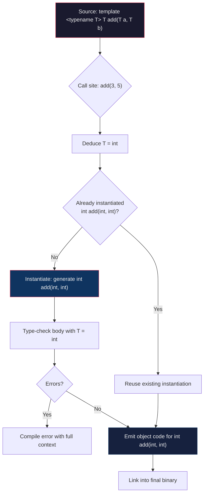
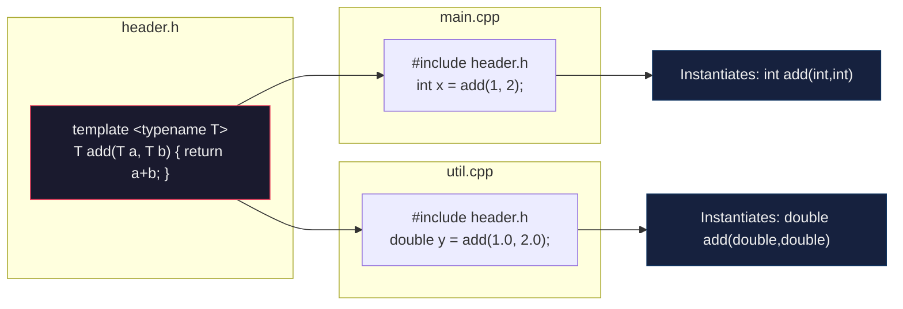

# Chapter 21 — Templates: Generic Programming

```yaml
title: "Templates: Generic Programming"
part: 2
chapter: 21
topics:
  - Function templates and type deduction
  - Class templates and member definitions
  - Full and partial template specialization
  - Non-type template parameters
  - SFINAE and std::enable_if
  - Type traits
  - Template compilation model
  - Variadic templates preview
tags: [c++, templates, generic-programming, SFINAE, type-traits, metaprogramming]
requires: [classes, operator-overloading, inheritance]
cpp_standard: C++17 / C++20
```

---

## 1 · Theory

Templates are the backbone of **generic programming** in C++. They let you write code
that works with *any* type, while the compiler generates concrete, type-safe
implementations at compile time. Every STL container (`std::vector<T>`), every
algorithm (`std::sort`), and every smart pointer (`std::unique_ptr<T>`) is built on
templates.

A template is **not** a function or a class — it is a *blueprint*. The compiler uses
it to **stamp out** (instantiate) real code for each combination of types you use.
This gives you the performance of hand-written, type-specific code with the
convenience of writing the logic only once.

### Core Concepts

| Concept | Description |
|---|---|
| **Template parameter** | A placeholder for a type (`typename T`) or a value (`int N`) |
| **Instantiation** | The compiler generating concrete code from a template |
| **Specialization** | Providing a custom implementation for specific types |
| **Deduction** | The compiler inferring template arguments from function call arguments |
| **SFINAE** | A rule that silently removes overload candidates instead of erroring |

---

## 2 · What / Why / How

### What Are Templates?

Templates are compile-time mechanisms that parameterise code over types or values.
They come in two primary forms:

- **Function templates** — parameterise standalone or member functions.
- **Class templates** — parameterise entire classes (data + methods).

### Why Use Templates?

1. **Code reuse** — Write once, use with `int`, `double`, `std::string`, user types.
2. **Type safety** — Errors are caught at compile time, not runtime.
3. **Zero-cost abstraction** — No vtable, no indirection; the compiler inlines aggressively.
4. **Foundation of the STL** — You cannot use the standard library without templates.

### How Do They Work?

```text
Source code          Compiler                  Object code
┌──────────┐   ┌─────────────────┐   ┌──────────────────────┐
│ template  │──▶│ Instantiation   │──▶│ max<int>(...)        │
│ <T> max() │   │ for each T used │   │ max<double>(...)     │
└──────────┘   └─────────────────┘   │ max<std::string>(...) │
                                      └──────────────────────┘
```

The compiler sees every call site, deduces `T`, and emits a dedicated function.

---

## 3 · Template Instantiation Process — Mermaid Diagram



---

## 4 · Code Examples

### 4.1 — Function Templates and Type Deduction

```cpp
// func_templates.cpp — compile: g++ -std=c++20 -Wall -Wextra -o func_templates func_templates.cpp
#include <iostream>
#include <string>

// Basic function template
template <typename T>
T maximum(T a, T b) {
    return (a > b) ? a : b;
}

// Template with multiple type parameters
template <typename T, typename U>
auto add(T a, U b) -> decltype(a + b) {   // trailing return type (C++11)
    return a + b;
}

// C++20 abbreviated function template (auto parameters)
auto multiply(auto a, auto b) {
    return a * b;
}

int main() {
    // --- Type deduction ---
    std::cout << "max(3, 7)        = " << maximum(3, 7)           << "\n";
    std::cout << "max(3.14, 2.72)  = " << maximum(3.14, 2.72)    << "\n";

    // --- Explicit instantiation ---
    std::cout << "max<double>(3, 7)= " << maximum<double>(3, 7)  << "\n";

    // --- Mixed types ---
    std::cout << "add(1, 2.5)      = " << add(1, 2.5)            << "\n";

    // --- C++20 auto params ---
    std::cout << "multiply(3, 4.5) = " << multiply(3, 4.5)       << "\n";

    // --- Works with std::string too ---
    using namespace std::string_literals;
    std::cout << "max strings      = " << maximum("hello"s, "world"s) << "\n";

    return 0;
}
```

### 4.2 — Class Templates

```cpp
// class_templates.cpp — compile: g++ -std=c++20 -Wall -Wextra -o class_templates class_templates.cpp
#include <iostream>
#include <stdexcept>
#include <array>

// A fixed-capacity stack using a class template
template <typename T, std::size_t Capacity = 64>
class FixedStack {
public:
    void push(const T& value) {
        if (top_ >= Capacity) throw std::overflow_error("Stack full");
        data_[top_++] = value;
    }

    T pop() {
        if (top_ == 0) throw std::underflow_error("Stack empty");
        return data_[--top_];
    }

    [[nodiscard]] const T& peek() const {
        if (top_ == 0) throw std::underflow_error("Stack empty");
        return data_[top_ - 1];
    }

    [[nodiscard]] bool        empty() const { return top_ == 0; }
    [[nodiscard]] std::size_t size()  const { return top_; }

private:
    std::array<T, Capacity> data_{};
    std::size_t             top_ = 0;
};

int main() {
    FixedStack<int, 8> intStack;
    for (int i = 1; i <= 5; ++i) intStack.push(i * 10);

    std::cout << "Top: " << intStack.peek() << "\n";
    std::cout << "Size: " << intStack.size() << "\n";

    while (!intStack.empty()) {
        std::cout << intStack.pop() << " ";
    }
    std::cout << "\n";

    // String stack with default capacity
    FixedStack<std::string> strStack;
    strStack.push("hello");
    strStack.push("templates");
    std::cout << "String top: " << strStack.peek() << "\n";

    return 0;
}
```

### 4.3 — Template Specialization (Full and Partial)

```cpp
// specialization.cpp — compile: g++ -std=c++20 -Wall -Wextra -o specialization specialization.cpp
#include <iostream>
#include <cstring>
#include <type_traits>

// --- Primary template ---
template <typename T>
struct TypeInfo {
    static const char* name() { return "unknown"; }
    static bool is_numeric()  { return false; }
};

// --- Full specializations ---
template <>
struct TypeInfo<int> {
    static const char* name() { return "int"; }
    static bool is_numeric()  { return true; }
};

template <>
struct TypeInfo<double> {
    static const char* name() { return "double"; }
    static bool is_numeric()  { return true; }
};

template <>
struct TypeInfo<const char*> {
    static const char* name() { return "const char*"; }
    static bool is_numeric()  { return false; }
};

// --- Partial specialization (for pointers) ---
template <typename T>
struct TypeInfo<T*> {
    static const char* name() { return "pointer-to-T"; }
    static bool is_numeric()  { return false; }
};

// --- Partial specialization (for std::pair-like pairs) ---
template <typename A, typename B>
struct Pair {
    A first;
    B second;
    void print() const {
        std::cout << "(" << first << ", " << second << ")\n";
    }
};

// Partial specialization: both types are the same
template <typename T>
struct Pair<T, T> {
    T first;
    T second;
    void print() const {
        std::cout << "[same-type pair] (" << first << ", " << second << ")\n";
    }
};

int main() {
    std::cout << "int:    " << TypeInfo<int>::name()         << "\n";
    std::cout << "double: " << TypeInfo<double>::name()      << "\n";
    std::cout << "char*:  " << TypeInfo<const char*>::name() << "\n";
    std::cout << "int*:   " << TypeInfo<int*>::name()        << "\n";
    std::cout << "float:  " << TypeInfo<float>::name()       << "\n";  // hits primary

    Pair<int, std::string> p1{42, "hello"};
    Pair<double, double>   p2{3.14, 2.72};   // hits partial specialization

    p1.print();
    p2.print();

    return 0;
}
```

### 4.4 — Non-Type Template Parameters

```cpp
// non_type.cpp — compile: g++ -std=c++20 -Wall -Wextra -o non_type non_type.cpp
#include <iostream>
#include <array>

// Non-type parameter: compile-time constant
template <typename T, int Rows, int Cols>
class Matrix {
public:
    T& operator()(int r, int c)       { return data_[r * Cols + c]; }
    T  operator()(int r, int c) const { return data_[r * Cols + c]; }

    static constexpr int rows() { return Rows; }
    static constexpr int cols() { return Cols; }

    void fill(T value) { data_.fill(value); }

    void print() const {
        for (int r = 0; r < Rows; ++r) {
            for (int c = 0; c < Cols; ++c)
                std::cout << (*this)(r, c) << "\t";
            std::cout << "\n";
        }
    }

private:
    std::array<T, Rows * Cols> data_{};
};

// Matrix multiplication — dimensions checked at compile time
template <typename T, int R1, int C1, int C2>
Matrix<T, R1, C2> matmul(const Matrix<T, R1, C1>& a,
                          const Matrix<T, C1, C2>& b) {
    Matrix<T, R1, C2> result;
    result.fill(T{});
    for (int r = 0; r < R1; ++r)
        for (int c = 0; c < C2; ++c)
            for (int k = 0; k < C1; ++k)
                result(r, c) += a(r, k) * b(k, c);
    return result;
}

int main() {
    Matrix<double, 2, 3> A;
    Matrix<double, 3, 2> B;

    // Fill with sample data
    int v = 1;
    for (int r = 0; r < 2; ++r)
        for (int c = 0; c < 3; ++c)
            A(r, c) = v++;

    for (int r = 0; r < 3; ++r)
        for (int c = 0; c < 2; ++c)
            B(r, c) = v++;

    std::cout << "A (2x3):\n"; A.print();
    std::cout << "B (3x2):\n"; B.print();

    auto C = matmul(A, B);   // Matrix<double, 2, 2>
    std::cout << "C = A * B (2x2):\n"; C.print();

    // This would fail at compile time — dimension mismatch:
    // auto bad = matmul(A, A);  // Error: Matrix<double,2,3> * Matrix<double,2,3>

    return 0;
}
```

### 4.5 — SFINAE and Type Traits

```cpp
// sfinae.cpp — compile: g++ -std=c++20 -Wall -Wextra -o sfinae sfinae.cpp
#include <iostream>
#include <type_traits>
#include <string>
#include <vector>

// ── SFINAE with std::enable_if ──────────────────────────────────────────
// Only enabled for integral types
template <typename T>
std::enable_if_t<std::is_integral_v<T>, T>
safe_divide(T a, T b) {
    if (b == 0) {
        std::cerr << "Error: integer division by zero\n";
        return T{};
    }
    return a / b;
}

// Only enabled for floating-point types
template <typename T>
std::enable_if_t<std::is_floating_point_v<T>, T>
safe_divide(T a, T b) {
    return a / b;   // IEEE 754 handles division by zero (returns inf)
}

// ── Using type traits for compile-time decisions ────────────────────────
template <typename T>
void describe_type() {
    std::cout << "Type properties:\n";
    std::cout << "  is_integral:       " << std::is_integral_v<T>       << "\n";
    std::cout << "  is_floating_point: " << std::is_floating_point_v<T> << "\n";
    std::cout << "  is_arithmetic:     " << std::is_arithmetic_v<T>     << "\n";
    std::cout << "  is_pointer:        " << std::is_pointer_v<T>        << "\n";
    std::cout << "  is_const:          " << std::is_const_v<T>          << "\n";
    std::cout << "  sizeof:            " << sizeof(T) << " bytes\n\n";
}

// ── C++17 if constexpr — cleaner than SFINAE for simple cases ───────────
template <typename T>
std::string to_debug_string(const T& value) {
    if constexpr (std::is_arithmetic_v<T>) {
        return std::to_string(value);
    } else if constexpr (std::is_same_v<T, std::string>) {
        return "\"" + value + "\"";
    } else {
        return "[non-printable type]";
    }
}

int main() {
    // SFINAE selects the correct overload
    std::cout << "safe_divide(10, 3)   = " << safe_divide(10, 3)     << "\n";
    std::cout << "safe_divide(10, 0)   = " << safe_divide(10, 0)     << "\n";
    std::cout << "safe_divide(10.0,3.0)= " << safe_divide(10.0, 3.0) << "\n";

    std::cout << "\n--- int ---\n";
    describe_type<int>();

    std::cout << "--- const double ---\n";
    describe_type<const double>();

    std::cout << "--- int* ---\n";
    describe_type<int*>();

    // if constexpr dispatching
    std::cout << "Debug: " << to_debug_string(42)             << "\n";
    std::cout << "Debug: " << to_debug_string(3.14)           << "\n";
    std::cout << "Debug: " << to_debug_string(std::string{"hello"}) << "\n";
    std::cout << "Debug: " << to_debug_string(std::vector<int>{})   << "\n";

    return 0;
}
```

### 4.6 — Variadic Templates (Preview)

```cpp
// variadic.cpp — compile: g++ -std=c++20 -Wall -Wextra -o variadic variadic.cpp
#include <iostream>
#include <string>

// ── Base case ───────────────────────────────────────────────────────────
void print() {
    std::cout << "\n";   // terminates recursion
}

// ── Recursive variadic template ─────────────────────────────────────────
template <typename First, typename... Rest>
void print(const First& first, const Rest&... rest) {
    std::cout << first;
    if constexpr (sizeof...(rest) > 0) {
        std::cout << ", ";
    }
    print(rest...);   // expand the parameter pack
}

// ── C++17 fold expression: sum any number of args ───────────────────────
template <typename... Args>
auto sum(Args... args) {
    return (args + ...);   // unary right fold
}

// ── Fold expression: all positive? ──────────────────────────────────────
template <typename... Args>
bool all_positive(Args... args) {
    return ((args > 0) && ...);   // unary right fold with &&
}

// ── sizeof... gives the count of pack elements ──────────────────────────
template <typename... Args>
constexpr std::size_t count_args(Args...) {
    return sizeof...(Args);
}

int main() {
    print(1, 2.5, "hello", std::string{"world"}, 'X');

    std::cout << "sum(1,2,3,4,5)    = " << sum(1, 2, 3, 4, 5)    << "\n";
    std::cout << "sum(1.1, 2.2)     = " << sum(1.1, 2.2)         << "\n";

    std::cout << "all_positive(1,2,3) = " << all_positive(1, 2, 3)    << "\n";
    std::cout << "all_positive(1,-2)  = " << all_positive(1, -2)      << "\n";

    std::cout << "count_args(a,b,c,d) = " << count_args('a','b','c','d') << "\n";

    return 0;
}
```

---

## 5 · Template Compilation Model

### Why Templates Must Live in Headers

Templates are **not compiled until instantiated**. The compiler needs to see the full
template definition at every call site to generate the specialised code.



| Approach | When to Use |
|---|---|
| **Define in header** | Default — works everywhere, may increase compile time |
| **Explicit instantiation** (`template class Foo<int>;` in .cpp) | Large projects where you know every type upfront |
| **`extern template`** (C++11) | Prevent redundant instantiations across TUs |

### Explicit Instantiation Example

```cpp
// stack.h
template <typename T>
class Stack { /* ... full definition ... */ };

// stack.cpp
#include "stack.h"
template class Stack<int>;        // explicit instantiation
template class Stack<double>;
template class Stack<std::string>;

// main.cpp
#include "stack.h"
extern template class Stack<int>;   // suppress instantiation here
```

---

## 6 · Exercises

### 🟢 Exercise 1 — Generic Swap

Write a function template `my_swap(T& a, T& b)` that swaps two values without using
`std::swap`. Test it with `int`, `double`, and `std::string`.

### 🟢 Exercise 2 — Array Sum

Write a function template that takes a `std::array<T, N>` (using a non-type parameter
for `N`) and returns the sum of all elements.

### 🟡 Exercise 3 — Type-Safe Container

Create a class template `Bag<T>` backed by `std::vector<T>`. Provide `add()`,
`contains()`, `remove()`, and `size()` methods. Write a full specialization
`Bag<std::string>` that performs case-insensitive `contains()`.

### 🟡 Exercise 4 — Compile-Time Factorial

Use a non-type template parameter to compute `Factorial<N>::value` entirely at
compile time. Verify with `static_assert`.

### 🔴 Exercise 5 — SFINAE Serializer

Write a `serialize()` function template that:
- Converts arithmetic types to their `std::to_string()` representation.
- Converts `std::string` by wrapping it in quotes.
- Refuses to compile for any other type (use `static_assert` with a clear message).

Use `std::enable_if` or `if constexpr` to implement the dispatch.

---

## 7 · Solutions

### Solution 1 — Generic Swap

```cpp
#include <iostream>
#include <string>

template <typename T>
void my_swap(T& a, T& b) {
    T temp = std::move(a);
    a = std::move(b);
    b = std::move(temp);
}

int main() {
    int x = 1, y = 2;
    my_swap(x, y);
    std::cout << x << " " << y << "\n";   // 2 1

    std::string s1 = "hello", s2 = "world";
    my_swap(s1, s2);
    std::cout << s1 << " " << s2 << "\n"; // world hello
}
```

### Solution 2 — Array Sum

```cpp
#include <iostream>
#include <array>

template <typename T, std::size_t N>
T array_sum(const std::array<T, N>& arr) {
    T total{};
    for (const auto& elem : arr) total += elem;
    return total;
}

int main() {
    std::array<int, 5> a{1, 2, 3, 4, 5};
    std::cout << "Sum: " << array_sum(a) << "\n";   // 15

    std::array<double, 3> b{1.1, 2.2, 3.3};
    std::cout << "Sum: " << array_sum(b) << "\n";   // 6.6
}
```

### Solution 4 — Compile-Time Factorial

```cpp
#include <iostream>

template <unsigned N>
struct Factorial {
    static constexpr unsigned long long value = N * Factorial<N - 1>::value;
};

template <>
struct Factorial<0> {
    static constexpr unsigned long long value = 1;
};

static_assert(Factorial<0>::value == 1);
static_assert(Factorial<5>::value == 120);
static_assert(Factorial<10>::value == 3628800);

int main() {
    std::cout << "5!  = " << Factorial<5>::value  << "\n";
    std::cout << "10! = " << Factorial<10>::value << "\n";
    std::cout << "15! = " << Factorial<15>::value << "\n";
}
```

---

## 8 · Quiz

**Q1.** What does the compiler do when it encounters `max<int>(3, 5)` for the first time?

> **A1.** It **instantiates** the `max` function template with `T = int`, generating a
> concrete `int max(int, int)` function. This code is then type-checked and compiled.

**Q2.** What is the difference between full and partial template specialization?

> **A2.** **Full specialization** provides a concrete implementation for one specific
> set of template arguments (e.g., `template<> struct Foo<int>`). **Partial
> specialization** provides an implementation for a *subset* of types matching a
> pattern (e.g., `template<typename T> struct Foo<T*>`). Note: partial
> specialization is only available for class/struct templates, not function templates.

**Q3.** Why do templates typically need to be defined in header files?

> **A3.** Because the compiler must see the full template definition at the point of
> instantiation. If the definition is in a `.cpp` file, other translation units that
> use the template cannot instantiate it, leading to linker errors.

**Q4.** What does SFINAE stand for, and why is it useful?

> **A4.** **Substitution Failure Is Not An Error.** When the compiler tries to
> substitute template arguments and the substitution produces an invalid type, that
> candidate is silently removed from the overload set instead of causing a hard error.
> This enables techniques like `std::enable_if` to conditionally enable/disable
> function overloads based on type properties.

**Q5.** What is the output of `sizeof...(Args)` in a variadic template?

> **A5.** It returns the **number of template arguments** in the parameter pack
> `Args`. It is evaluated at compile time and produces a `std::size_t` constant.

**Q6.** Given `template <typename T, int N> class Buffer;`, what is `N`?

> **A6.** `N` is a **non-type template parameter**. It must be a compile-time
> constant. The compiler generates a distinct `Buffer` class for each unique value of
> `N`, with the size baked into the type itself.

**Q7.** What does `std::is_same_v<int, int>` evaluate to?

> **A7.** `true`. The `_v` suffix is a C++17 variable template shorthand for
> `std::is_same<int, int>::value`.

**Q8.** Can you partially specialize a function template?

> **A8.** **No.** The C++ standard does not allow partial specialization of function
> templates. Use **overloading** or **constrained templates** (`if constexpr`,
> concepts) to achieve similar effects.

---

## 9 · Key Takeaways

| # | Takeaway |
|---|----------|
| 1 | Templates generate type-specific code at compile time — zero runtime overhead. |
| 2 | Type deduction lets the compiler infer `T` from arguments; use explicit `<T>` when ambiguous. |
| 3 | Put template definitions in headers — the compiler needs the full body at every instantiation site. |
| 4 | Full specialization = one concrete type; partial specialization = a pattern of types (classes only). |
| 5 | Non-type parameters (`int N`, `bool Flag`) embed values into the type itself — great for fixed-size containers. |
| 6 | SFINAE + `enable_if` let you conditionally enable overloads. C++17 `if constexpr` is often cleaner. |
| 7 | Type traits (`<type_traits>`) give you compile-time introspection over any type. |
| 8 | Variadic templates and fold expressions handle arbitrary-length parameter packs elegantly. |

---

## 10 · Chapter Summary

This chapter introduced **C++ templates** — the foundation of generic programming.
We covered:

- **Function templates** with automatic type deduction and explicit instantiation.
- **Class templates** with non-type parameters for compile-time configuration.
- **Specialization** (full and partial) for type-specific optimisations.
- **SFINAE** and **type traits** for compile-time overload selection.
- The **compilation model** explaining why templates live in headers.
- A **variadic templates preview** with fold expressions.

Templates are not just a feature — they are the philosophy of modern C++. Mastering
them unlocks the STL, enables zero-cost abstractions, and is prerequisite knowledge
for concepts (C++20), ranges, and template metaprogramming.

---

## 11 · Real-World Insight

### Templates in Production: Where You See Them Every Day

| Domain | Template Usage |
|---|---|
| **Game engines** (Unreal) | `TArray<T>`, `TMap<K,V>` — custom containers avoiding STL overhead |
| **CUDA / GPU computing** | `thrust::device_vector<T>` — GPU containers templated on element type |
| **Finance / HFT** | Fixed-point `Decimal<Precision>` with non-type parameters for compile-time precision |
| **Serialization** (protobuf) | `RepeatedField<T>` — generic containers for wire format data |
| **Embedded systems** | `etl::array<T, N>` — embedded template library with no heap allocation |

**Performance note:** In high-frequency trading systems, templates are preferred over
virtual dispatch because the compiler can inline everything. A `Strategy<FastPath>`
compiles to straight-line code with no vtable lookup — critical when nanoseconds matter.

---

## 12 · Common Mistakes

### ❌ Mistake 1 — Defining Templates in `.cpp` Files

```cpp
// math.h
template <typename T> T square(T x);   // declaration only

// math.cpp
template <typename T> T square(T x) { return x * x; }   // definition hidden

// main.cpp
#include "math.h"
int main() { return square(5); }   // LINKER ERROR: undefined reference
```

**Fix:** Move the full definition into the header, or use explicit instantiation.

### ❌ Mistake 2 — Forgetting `typename` for Dependent Types

```cpp
template <typename T>
void foo() {
    T::iterator it;            // ERROR: compiler doesn't know iterator is a type
    typename T::iterator it;   // CORRECT
}
```

### ❌ Mistake 3 — Ambiguous Deduction with Mixed Types

```cpp
template <typename T>
T add(T a, T b) { return a + b; }

add(1, 2.5);   // ERROR: T deduced as int AND double
add<double>(1, 2.5);   // FIX: explicit template argument
```

### ❌ Mistake 4 — Trying to Partially Specialize Function Templates

```cpp
// This is ILLEGAL:
template <typename T>
void process(T* ptr) { /* ... */ }   // This is an OVERLOAD, not a partial spec

// Overloading achieves the same goal and is the correct approach.
```

### ❌ Mistake 5 — Infinite Recursion in Template Metaprogramming

```cpp
template <unsigned N>
struct Factorial {
    static constexpr auto value = N * Factorial<N - 1>::value;
    // Without the base case specialization for N=0, this recurses infinitely
    // and the compiler hits its template depth limit.
};
// FIX: Always provide a base case specialization.
```

---

## 13 · Interview Questions

### Q1: Explain the difference between a template and a macro. Why are templates preferred?

> **Answer:** Both templates and macros (`#define`) enable code reuse, but they differ
> fundamentally:
>
> | Aspect | Templates | Macros |
> |---|---|---|
> | **Type safety** | Full type checking at instantiation | No type checking (text substitution) |
> | **Debugging** | Produces real symbols; visible in debuggers | Expands before compilation; no symbols |
> | **Scope** | Respects namespaces and access control | Global text replacement |
> | **Error messages** | Point to the template with types | Often cryptic, point to expanded code |
>
> Templates are preferred because they are type-safe, respect C++ scoping rules,
> participate in overload resolution, and produce debuggable code. Macros are a
> pre-processor hack from C; templates are a first-class language feature.

### Q2: What is SFINAE and how would you use it to write a function that only accepts container types?

> **Answer:** SFINAE (Substitution Failure Is Not An Error) means that if substituting
> a template argument produces an invalid type or expression, the compiler removes
> that overload candidate instead of issuing an error.
>
> To restrict a function to containers, detect a trait like `value_type`:
>
> ```cpp
> template <typename C,
>           typename = typename C::value_type,     // fails for non-containers
>           typename = typename C::iterator>        // extra constraint
> void process_container(const C& container) {
>     for (const auto& elem : container)
>         std::cout << elem << " ";
> }
> ```
>
> If `C` does not have `value_type` or `iterator`, substitution fails and the overload
> is silently removed. In C++20, **concepts** provide a much cleaner way to express
> the same constraint.

### Q3: Why might you choose `if constexpr` over SFINAE / `enable_if`?

> **Answer:** `if constexpr` (C++17) evaluates branches at compile time and discards
> the false branch entirely — it does not even need to be valid for the given type.
>
> **Advantages over SFINAE:**
> - **Readability** — looks like a normal if/else, not arcane type gymnastics.
> - **Locality** — the logic is in one function body, not scattered across overloads.
> - **Error messages** — much clearer when something goes wrong.
>
> **When SFINAE is still needed:**
> - Controlling **overload resolution** (different function signatures).
> - Template **class** specialization (if constexpr only works inside function bodies).
> - Pre-C++17 codebases.

### Q4: A colleague puts a class template definition in a `.cpp` file and gets linker errors. Explain what happened and how to fix it.

> **Answer:** Template code is only instantiated when used. If the definition is in
> `widget.cpp` and `main.cpp` calls `Widget<int>`, the compiler processing `main.cpp`
> only sees the declaration (from the header). It cannot instantiate the body because
> that's in `widget.cpp` — a different translation unit. The result is an "undefined
> reference" linker error.
>
> **Fixes (pick one):**
> 1. Move the full definition into the header file (most common).
> 2. Add explicit instantiation in `widget.cpp`:
>    `template class Widget<int>;` for every type you need.
> 3. Use `extern template` in headers that include the definition to prevent duplicate
>    work across translation units.

### Q5: What are non-type template parameters and when would you use them?

> **Answer:** Non-type template parameters are compile-time constants embedded in the
> template — integers, enums, pointers, or (since C++20) floating-point and literal
> class types.
>
> ```cpp
> template <typename T, std::size_t N>
> class FixedBuffer { std::array<T, N> data_; };
> ```
>
> `FixedBuffer<int, 64>` and `FixedBuffer<int, 128>` are **completely different
> types**. The size is part of the type, enabling:
> - Compile-time dimension checking (matrix multiplication).
> - Stack allocation instead of heap (no `new`, cache-friendly).
> - Optimisations: the compiler can unroll loops when `N` is known.
>
> Real-world examples: `std::array<T,N>`, `std::bitset<N>`, CUDA kernel launch
> configurations (`blockDim<256>`), and fixed-point arithmetic
> (`FixedPoint<int32_t, 16>` for 16 fractional bits).

---

*Next chapter → [Chapter 22: Smart Pointers and Move Semantics](#)*
