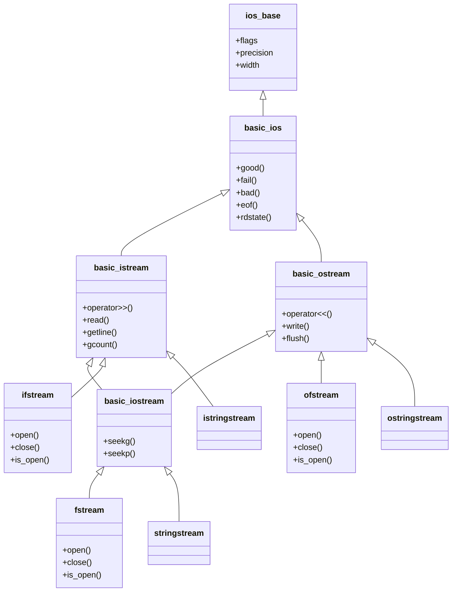
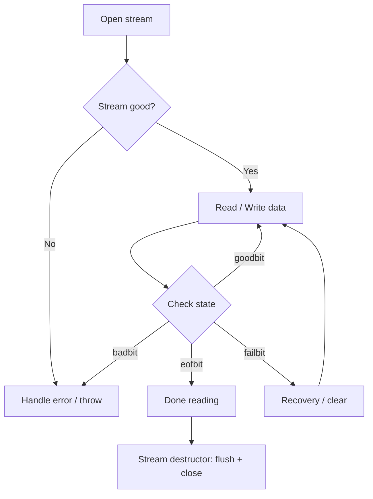

# Chapter 22 — File I/O & Serialization

## 1 · Theory

Every non-trivial program must persist data — configuration files, logs, caches, model
weights, telemetry.  C++ gives you layered control from high-level text streams down to
raw `mmap` pages.  This chapter covers the entire stack:

| Layer | Abstraction | Header |
|-------|------------|--------|
| Text streams | `ifstream`, `ofstream`, `fstream` | `<fstream>` |
| String streams | `std::stringstream` | `<sstream>` |
| Binary I/O | `.read()` / `.write()` on streams | `<fstream>` |
| Filesystem ops | `std::filesystem` (C++17) | `<filesystem>` |
| OS-level | `mmap`, `posix_fadvise` | `<sys/mman.h>` |

**Stream state flags** govern every I/O operation:

| Flag | Meaning |
|------|---------|
| `goodbit` | No errors |
| `eofbit` | End-of-file reached |
| `failbit` | Logical error (e.g., type mismatch) |
| `badbit` | Irrecoverable stream error |

Always check state after an I/O operation — silent failures are the #1 source of
file-handling bugs.

---

## 2 · What / Why / How

### What
C++ file I/O is built on the **iostream** hierarchy.  `ifstream` (input), `ofstream`
(output), and `fstream` (both) inherit from `std::ios_base` and carry an internal
`filebuf` that manages the OS file descriptor.  C++17 added `std::filesystem` for
portable path manipulation, directory traversal, and atomic file operations.

### Why
- **Portability** — stream abstractions hide OS differences.
- **Safety** — RAII-based streams close automatically; `std::filesystem::path` handles
  platform separators.
- **Performance** — buffered I/O by default; binary mode and `mmap` for hot paths.

### How
1. Open a stream (constructor or `.open()`).
2. Check that the stream is valid (`if (!file) { ... }`).
3. Read / write using `<<`, `>>`, `getline`, or `.read()` / `.write()`.
4. Stream destructor flushes and closes the file automatically.

---

## 3 · Code Examples

### 3.1 — Text File Read & Write

This program demonstrates the most basic file I/O pattern in C++: writing lines to a text file with `ofstream`, then reading them back with `ifstream` and `getline`. Notice how the write block is wrapped in braces — the `ofstream` destructor flushes and closes the file automatically (RAII), guaranteeing the data is on disk before the read block opens the same file.

```cpp
// text_io.cpp — compile: g++ -std=c++20 -o text_io text_io.cpp
#include <fstream>
#include <iostream>
#include <string>

int main() {
    // ── Write ──
    {
        std::ofstream out("greeting.txt");
        if (!out) { std::cerr << "Cannot open for writing\n"; return 1; }
        out << "Hello, C++ File I/O!\n";
        out << "Line two: " << 42 << '\n';
    } // file closed here by RAII

    // ── Read ──
    {
        std::ifstream in("greeting.txt");
        if (!in) { std::cerr << "Cannot open for reading\n"; return 1; }

        std::string line;
        while (std::getline(in, line)) {
            std::cout << ">> " << line << '\n';
        }
    }
}
```

### 3.2 — Binary I/O: Raw Byte Serialization

This example writes and reads a `std::vector` of `SensorReading` structs as raw bytes using `reinterpret_cast`. It first writes the element count as a `uint64_t` header, then dumps the entire vector's memory in one `write()` call. This is the fastest possible I/O — no formatting overhead — but the binary layout is platform-dependent (endianness and struct padding), so it's only suitable for same-machine storage.

```cpp
// binary_io.cpp — compile: g++ -std=c++20 -o binary_io binary_io.cpp
#include <cstdint>
#include <fstream>
#include <iostream>
#include <vector>

struct SensorReading {
    double    timestamp;
    float     value;
    uint32_t  sensor_id;
};

void write_readings(const std::string& path,
                    const std::vector<SensorReading>& data) {
    std::ofstream out(path, std::ios::binary);
    if (!out) throw std::runtime_error("Cannot open " + path);

    uint64_t count = data.size();
    out.write(reinterpret_cast<const char*>(&count), sizeof(count));
    out.write(reinterpret_cast<const char*>(data.data()),
              static_cast<std::streamsize>(count * sizeof(SensorReading)));
}

auto read_readings(const std::string& path) -> std::vector<SensorReading> {
    std::ifstream in(path, std::ios::binary);
    if (!in) throw std::runtime_error("Cannot open " + path);

    uint64_t count{};
    in.read(reinterpret_cast<char*>(&count), sizeof(count));

    std::vector<SensorReading> data(count);
    in.read(reinterpret_cast<char*>(data.data()),
            static_cast<std::streamsize>(count * sizeof(SensorReading)));

    if (!in) throw std::runtime_error("Read failed");
    return data;
}

int main() {
    std::vector<SensorReading> readings{
        {1.0, 23.5f, 1}, {2.0, 24.1f, 2}, {3.0, 22.8f, 1}
    };

    write_readings("sensors.bin", readings);
    auto loaded = read_readings("sensors.bin");

    for (const auto& r : loaded)
        std::cout << "t=" << r.timestamp
                  << " val=" << r.value
                  << " id="  << r.sensor_id << '\n';
}
```

> ⚠️ Binary layout depends on endianness and struct padding.  For cross-platform
> exchange, use an explicit serialization format (protobuf, FlatBuffers, MessagePack).

### 3.3 — std::filesystem (C++17)

This program showcases the `std::filesystem` library for portable file and directory operations. It builds paths with the `/` operator, creates nested directory trees in one call, iterates directories recursively, copies files, and queries available disk space — all without any platform-specific `#ifdef` blocks or POSIX system calls.

```cpp
// fs_demo.cpp — compile: g++ -std=c++20 -o fs_demo fs_demo.cpp
#include <filesystem>
#include <iostream>
#include <fstream>

namespace fs = std::filesystem;

int main() {
    // ── Path manipulation ──
    fs::path p = fs::current_path() / "data" / "output.csv";
    std::cout << "stem      : " << p.stem()            << '\n'
              << "extension : " << p.extension()        << '\n'
              << "parent    : " << p.parent_path()      << '\n';

    // ── Create directory tree ──
    fs::create_directories("data/logs/2025");

    // ── Write a temp file ──
    {
        std::ofstream out("data/logs/2025/app.log");
        out << "Boot complete\n";
    }

    // ── Recursive directory iteration ──
    for (const auto& entry : fs::recursive_directory_iterator("data")) {
        std::cout << (entry.is_directory() ? "[D] " : "[F] ")
                  << entry.path() << "  "
                  << (entry.is_regular_file()
                        ? std::to_string(entry.file_size()) + " bytes"
                        : "")
                  << '\n';
    }

    // ── File operations ──
    fs::copy_file("data/logs/2025/app.log",
                  "data/logs/2025/app.log.bak",
                  fs::copy_options::overwrite_existing);

    std::cout << "Space available: "
              << fs::space(".").available / (1024*1024) << " MiB\n";

    // Cleanup
    fs::remove_all("data");
}
```

### 3.4 — String Streams for Parsing

This example uses `std::istringstream` and `std::ostringstream` to parse and build strings in memory without touching the disk. The `split` function tokenizes a string by a delimiter (like Python's `str.split`), the main function parses `key=value` pairs from a configuration string, and an `ostringstream` assembles a SQL INSERT statement. String streams are ideal for lightweight parsing tasks where a full file isn't involved.

```cpp
// sstream_demo.cpp — compile: g++ -std=c++20 -o sstream_demo sstream_demo.cpp
#include <iostream>
#include <sstream>
#include <string>
#include <vector>

auto split(const std::string& s, char delim) -> std::vector<std::string> {
    std::vector<std::string> tokens;
    std::istringstream stream(s);
    std::string token;
    while (std::getline(stream, token, delim)) {
        tokens.push_back(token);
    }
    return tokens;
}

int main() {
    // Parse key=value pairs
    std::string config = "width=1920 height=1080 fps=60";
    std::istringstream iss(config);

    std::string key;
    int value;
    while (iss >> key) {
        // find '=' and parse
        auto pos = key.find('=');
        if (pos != std::string::npos) {
            std::string name = key.substr(0, pos);
            int val = std::stoi(key.substr(pos + 1));
            std::cout << name << " -> " << val << '\n';
        }
    }

    // Build formatted strings without allocations churn
    std::ostringstream oss;
    oss << "INSERT INTO readings VALUES(";
    for (int i = 0; i < 5; ++i) {
        if (i) oss << ',';
        oss << i * 1.1;
    }
    oss << ");";
    std::cout << oss.str() << '\n';
}
```

### 3.5 — CSV Parsing (Practical Example)

This program reads a comma-separated file by combining `std::getline` (to read each row) with `std::istringstream` (to split each row by commas). It skips the header line, parses each field into a `Record` struct, and converts strings to numbers with `std::stoi`/`std::stod`. This is a real-world pattern you'll encounter whenever you need to load tabular data without an external CSV library.

```cpp
// csv_parser.cpp — compile: g++ -std=c++20 -o csv_parser csv_parser.cpp
#include <fstream>
#include <iostream>
#include <sstream>
#include <string>
#include <vector>

struct Record {
    std::string name;
    int         age;
    double      score;
};

auto parse_csv(const std::string& path) -> std::vector<Record> {
    std::ifstream file(path);
    if (!file) throw std::runtime_error("Cannot open " + path);

    std::vector<Record> records;
    std::string line;

    // Skip header
    std::getline(file, line);

    while (std::getline(file, line)) {
        std::istringstream ss(line);
        std::string name, age_str, score_str;

        std::getline(ss, name, ',');
        std::getline(ss, age_str, ',');
        std::getline(ss, score_str, ',');

        records.push_back({
            name,
            std::stoi(age_str),
            std::stod(score_str)
        });
    }
    return records;
}

int main() {
    // Create sample CSV
    {
        std::ofstream out("students.csv");
        out << "name,age,score\n"
            << "Alice,22,95.5\n"
            << "Bob,21,88.0\n"
            << "Carol,23,92.3\n";
    }

    auto records = parse_csv("students.csv");
    for (const auto& r : records) {
        std::cout << r.name << " | age=" << r.age
                  << " | score=" << r.score << '\n';
    }

    std::remove("students.csv");
}
```

### 3.6 — Serialization Patterns: Text vs Binary vs JSON

This example implements three serialization methods for the same `Config` struct: text (human-readable, one field per line), binary (compact, length-prefixed string followed by raw fields), and a simple JSON renderer using `ostringstream`. Comparing all three in one file highlights the trade-offs: text is debuggable but slow to parse, binary is fast but not portable, and JSON is interoperable but requires careful escaping in production.

```cpp
// serialization.cpp — compile: g++ -std=c++20 -o serialization serialization.cpp
#include <cstdint>
#include <fstream>
#include <iostream>
#include <sstream>
#include <string>

struct Config {
    std::string name;
    int         epochs;
    double      learning_rate;

    // ── Text serialization ──
    void save_text(const std::string& path) const {
        std::ofstream out(path);
        out << name << '\n' << epochs << '\n' << learning_rate << '\n';
    }

    static Config load_text(const std::string& path) {
        std::ifstream in(path);
        Config c;
        std::getline(in, c.name);
        in >> c.epochs >> c.learning_rate;
        return c;
    }

    // ── Binary serialization ──
    void save_binary(const std::string& path) const {
        std::ofstream out(path, std::ios::binary);
        uint32_t len = static_cast<uint32_t>(name.size());
        out.write(reinterpret_cast<const char*>(&len), sizeof(len));
        out.write(name.data(), len);
        out.write(reinterpret_cast<const char*>(&epochs), sizeof(epochs));
        out.write(reinterpret_cast<const char*>(&learning_rate),
                  sizeof(learning_rate));
    }

    static Config load_binary(const std::string& path) {
        std::ifstream in(path, std::ios::binary);
        Config c;
        uint32_t len{};
        in.read(reinterpret_cast<char*>(&len), sizeof(len));
        c.name.resize(len);
        in.read(c.name.data(), len);
        in.read(reinterpret_cast<char*>(&c.epochs), sizeof(c.epochs));
        in.read(reinterpret_cast<char*>(&c.learning_rate),
                sizeof(c.learning_rate));
        return c;
    }

    // ── JSON-like serialization (no external library) ──
    auto to_json() const -> std::string {
        std::ostringstream oss;
        oss << "{\n"
            << "  \"name\": \"" << name << "\",\n"
            << "  \"epochs\": " << epochs << ",\n"
            << "  \"learning_rate\": " << learning_rate << "\n"
            << "}";
        return oss.str();
    }
};

int main() {
    Config cfg{"resnet50", 100, 0.001};

    cfg.save_text("config.txt");
    cfg.save_binary("config.bin");

    auto txt = Config::load_text("config.txt");
    auto bin = Config::load_binary("config.bin");

    std::cout << "Text  : " << txt.name << " ep=" << txt.epochs
              << " lr=" << txt.learning_rate << '\n';
    std::cout << "Binary: " << bin.name << " ep=" << bin.epochs
              << " lr=" << bin.learning_rate << '\n';
    std::cout << "JSON:\n" << cfg.to_json() << '\n';

    std::remove("config.txt");
    std::remove("config.bin");
}
```

### 3.7 — Error Handling in I/O

This code shows a defensive I/O pattern: first check if the file exists using `std::filesystem`, then verify the stream opened successfully, and finally enable exceptions for `badbit` so that irrecoverable errors (like a disk failure mid-read) are caught as C++ exceptions. It also demonstrates the no-throw `std::error_code` overload for filesystem queries in performance-sensitive contexts.

```cpp
// error_handling.cpp — compile: g++ -std=c++20 -o error_handling error_handling.cpp
#include <fstream>
#include <iostream>
#include <filesystem>
#include <system_error>

namespace fs = std::filesystem;

void safe_read(const fs::path& path) {
    // Pre-check with filesystem
    std::error_code ec;
    if (!fs::exists(path, ec)) {
        std::cerr << "File not found: " << path << '\n';
        return;
    }

    std::ifstream in(path);
    if (!in) {
        std::cerr << "Open failed (permissions?): " << path << '\n';
        return;
    }

    // Enable exceptions for subsequent operations
    in.exceptions(std::ios::badbit);
    try {
        std::string line;
        while (std::getline(in, line)) {
            std::cout << line << '\n';
        }
    } catch (const std::ios_base::failure& e) {
        std::cerr << "I/O error: " << e.what() << '\n';
    }
}

int main() {
    // Demonstrate error handling
    safe_read("nonexistent.txt");

    // Filesystem error handling with error_code (no-throw)
    std::error_code ec;
    auto sz = fs::file_size("/unlikely/path", ec);
    if (ec) {
        std::cerr << "file_size error: " << ec.message() << '\n';
    }
}
```

### 3.8 — Performance: Buffered I/O & mmap

This benchmark compares two approaches for reading a 10 MiB file: standard buffered `ifstream::read()` (which copies data from kernel space into a user-space buffer) versus `mmap` (which maps the file directly into the process's virtual address space for zero-copy access). The `mmap` approach lets the OS page cache serve the data directly, which can be significantly faster for large files with random access patterns.

```cpp
// perf_io.cpp — compile: g++ -std=c++20 -o perf_io perf_io.cpp
#include <chrono>
#include <cstring>
#include <fcntl.h>
#include <fstream>
#include <iostream>
#include <sys/mman.h>
#include <sys/stat.h>
#include <unistd.h>
#include <vector>

// Create a test file of ~10 MiB
void create_test_file(const char* path, size_t bytes) {
    std::ofstream out(path, std::ios::binary);
    std::vector<char> buf(4096, 'A');
    for (size_t written = 0; written < bytes; written += buf.size())
        out.write(buf.data(),
                  static_cast<std::streamsize>(
                      std::min(buf.size(), bytes - written)));
}

// Approach 1: Standard buffered read
size_t buffered_read(const char* path) {
    std::ifstream in(path, std::ios::binary);
    char buf[8192];
    size_t total = 0;
    while (in.read(buf, sizeof(buf)))
        total += static_cast<size_t>(in.gcount());
    total += static_cast<size_t>(in.gcount());
    return total;
}

// Approach 2: mmap for zero-copy access
size_t mmap_read(const char* path) {
    int fd = open(path, O_RDONLY);
    if (fd < 0) return 0;

    struct stat st{};
    fstat(fd, &st);
    auto len = static_cast<size_t>(st.st_size);

    void* addr = mmap(nullptr, len, PROT_READ, MAP_PRIVATE, fd, 0);
    close(fd);
    if (addr == MAP_FAILED) return 0;

    // Touch every page to simulate processing
    volatile size_t sum = 0;
    const auto* data = static_cast<const char*>(addr);
    for (size_t i = 0; i < len; i += 4096)
        sum += static_cast<size_t>(data[i]);

    munmap(addr, len);
    return len;
}

int main() {
    constexpr size_t FILE_SIZE = 10 * 1024 * 1024; // 10 MiB
    const char* path = "test_perf.bin";
    create_test_file(path, FILE_SIZE);

    using clk = std::chrono::high_resolution_clock;

    auto t0 = clk::now();
    auto n1 = buffered_read(path);
    auto t1 = clk::now();
    auto n2 = mmap_read(path);
    auto t2 = clk::now();

    auto ms = [](auto d) {
        return std::chrono::duration<double, std::milli>(d).count();
    };

    std::cout << "Buffered : " << n1 << " bytes in " << ms(t1-t0) << " ms\n";
    std::cout << "mmap     : " << n2 << " bytes in " << ms(t2-t1) << " ms\n";

    std::remove(path);
}
```

---

## 4 · Diagrams

### 4.1 — C++ I/O Stream Hierarchy



### 4.2 — File I/O Lifecycle



### 4.3 — Serialization Format Trade-offs


---

## 5 · Exercises

### 🟢 Easy

**E1 — Line counter.**
Write a program that reads a text file and prints the total number of lines, words,
and characters (similar to `wc`).

**E2 — File copy.**
Using `std::filesystem`, copy a file to a backup with `.bak` extension.  Print the
file size before and after.

### 🟡 Medium

**M1 — CSV statistics.**
Read a CSV with columns `name,score1,score2,score3`.  Compute and print the average
score per student and the overall class average.

**M2 — Binary log analyzer.**
Define a `LogEntry { uint64_t timestamp; uint8_t severity; char message[128]; }`.
Write 1000 entries to a binary file, then read them back and print entries where
`severity >= 3`.

### 🔴 Hard

**H1 — Indexed binary file.**
Build a file format with a header containing an offset table (index) followed by
variable-length records.  Support random access: given a record number, seek
directly to it.

**H2 — mmap-based word frequency.**
Memory-map a large text file, scan the mapped region to count word frequencies, and
write the top-20 words to an output file.  Compare wall-clock time against a
`std::ifstream` + `std::getline` approach.

---

## 6 · Solutions

### E1 — Line counter

This solution reads a file line by line, counting lines, words (by splitting each line with `istringstream`), and characters. It mimics the Unix `wc` command, adding 1 to the character count per line to account for the newline that `getline` strips.

```cpp
// wc_lite.cpp — g++ -std=c++20 -o wc_lite wc_lite.cpp
#include <fstream>
#include <iostream>
#include <sstream>
#include <string>

int main(int argc, char* argv[]) {
    if (argc < 2) { std::cerr << "Usage: wc_lite <file>\n"; return 1; }

    std::ifstream in(argv[1]);
    if (!in) { std::cerr << "Cannot open\n"; return 1; }

    int lines = 0, words = 0, chars = 0;
    std::string line;
    while (std::getline(in, line)) {
        ++lines;
        chars += static_cast<int>(line.size()) + 1; // +1 for newline
        std::istringstream iss(line);
        std::string word;
        while (iss >> word) ++words;
    }

    std::cout << lines << " lines, "
              << words << " words, "
              << chars << " chars\n";
}
```

### M1 — CSV statistics

This solution creates a sample CSV, then parses it by skipping the header and splitting each row by commas. It computes each student's average across three scores and tracks a running total for the class average, demonstrating the standard `getline` + `istringstream` CSV parsing pattern.

```cpp
// csv_stats.cpp — g++ -std=c++20 -o csv_stats csv_stats.cpp
#include <fstream>
#include <iostream>
#include <sstream>
#include <string>
#include <vector>

int main() {
    // Generate sample data
    {
        std::ofstream out("scores.csv");
        out << "name,score1,score2,score3\n"
            << "Alice,90,85,92\n"
            << "Bob,78,82,88\n"
            << "Carol,95,91,97\n";
    }

    std::ifstream in("scores.csv");
    std::string line;
    std::getline(in, line); // skip header

    double class_total = 0;
    int student_count = 0;

    while (std::getline(in, line)) {
        std::istringstream ss(line);
        std::string name, s1, s2, s3;
        std::getline(ss, name, ',');
        std::getline(ss, s1, ',');
        std::getline(ss, s2, ',');
        std::getline(ss, s3, ',');

        double avg = (std::stod(s1) + std::stod(s2) + std::stod(s3)) / 3.0;
        class_total += avg;
        ++student_count;
        std::cout << name << " avg = " << avg << '\n';
    }

    std::cout << "Class average = " << class_total / student_count << '\n';
    std::remove("scores.csv");
}
```

---

## 7 · Quiz

**Q1.** What mode flag do you pass to `ofstream` to open a file for binary writing
without truncating existing content?

a) `std::ios::binary`
b) `std::ios::binary | std::ios::app`
c) `std::ios::binary | std::ios::trunc`
d) `std::ios::out`

**Q2.** Which stream state flag indicates an irrecoverable low-level I/O error?

a) `eofbit`  
b) `failbit`  
c) `badbit`  
d) `goodbit`

**Q3.** What does `std::filesystem::create_directories("a/b/c")` do if `a/` already
exists but `b/` and `c/` do not?

a) Throws an exception  
b) Creates only `c`  
c) Creates `b` and `c` (all missing intermediaries)  
d) Returns `false` without creating anything

**Q4.** What is the return type of `std::getline(stream, str)`?

a) `bool`  
b) `std::string&`  
c) `std::istream&`  
d) `void`

**Q5.** In binary I/O, `reinterpret_cast<const char*>(&obj)` is safe for writing if
the object is:

a) Any class with virtual functions  
b) A trivially copyable type  
c) Any aggregate  
d) A type with a user-defined destructor

**Q6.** What does `mmap` return on failure?

a) `nullptr`  
b) `MAP_FAILED` (i.e., `(void*)-1`)  
c) `0`  
d) Throws `std::bad_alloc`

**Q7.** Which `std::filesystem` function retrieves available disk space?

a) `fs::disk_size()`  
b) `fs::space()`  
c) `fs::capacity()`  
d) `fs::available()`

### Answers

| Q | Answer | Explanation |
|---|--------|-------------|
| 1 | **b** | `binary | app` opens in binary mode and appends without truncating. |
| 2 | **c** | `badbit` signals a loss of stream integrity (e.g., hardware failure). |
| 3 | **c** | `create_directories` creates every missing component in the path. |
| 4 | **c** | Returns `std::istream&`; contextually converts to `bool` for loop checks. |
| 5 | **b** | Only trivially copyable types have a well-defined byte representation. |
| 6 | **b** | POSIX `mmap` returns `MAP_FAILED`, not `nullptr`. |
| 7 | **b** | `fs::space()` returns a `space_info` struct with `capacity`, `free`, `available`. |

---

## 8 · Key Takeaways

1. **Always check stream state** — `if (!stream)` after open *and* after each
   read/write.
2. **RAII closes files** — let the destructor handle it; never rely on manual `.close()`.
3. **Binary ≠ portable** — struct padding and endianness differ across platforms; use
   explicit serialization for interchange formats.
4. **`std::filesystem`** replaces fragile `stat()` / `mkdir()` / `opendir()` calls
   with type-safe, cross-platform C++.
5. **`std::stringstream`** is your best friend for in-memory parsing and string
   formatting.
6. **`mmap`** shines for large, read-mostly files — the OS page cache does the heavy
   lifting.
7. **Exceptions vs error codes** — use `std::error_code` overloads of `<filesystem>`
   functions in performance-critical loops; use exceptions for rare, fatal failures.

---

## 9 · Chapter Summary

This chapter walked through every layer of C++ file I/O:

- **Text streams** (`ifstream` / `ofstream`) for line-oriented human-readable data.
- **Binary streams** (`.read()` / `.write()`) for compact, high-throughput storage of
  trivially copyable types.
- **`std::filesystem`** for portable path manipulation, directory traversal, copying,
  renaming, and querying disk space.
- **String streams** for parsing structured text (CSV, configs, log lines) without
  touching the disk.
- **Serialization patterns** — text-based, binary, and JSON-style — with clear
  trade-offs in size, speed, and portability.
- **Error handling** via stream state checks, exceptions, and `std::error_code`.
- **Performance techniques** — large buffer reads and `mmap` for zero-copy access to
  large files.

---

## 10 · Real-World Insight

**ML Model Checkpointing** — In production ML pipelines (PyTorch C++ frontend,
TensorRT), model weights are stored as raw binary blobs.  A typical checkpoint file
has:

1. A small JSON or text header with metadata (epoch, loss, architecture name).
2. A binary payload of float32/float16 tensors written with `write()`.
3. A CRC32 footer for integrity checking.

Reading uses `mmap` so the OS can page in only the layers that are actually needed
during inference, keeping RSS low on memory-constrained edge devices.  This is exactly
the pattern GGUF (used by llama.cpp) follows.

---

## 11 · Common Mistakes

| # | Mistake | Fix |
|---|---------|-----|
| 1 | Not checking if a file opened successfully | Always test `if (!stream)` immediately after construction |
| 2 | Using `eof()` as a loop condition: `while (!in.eof())` | Use `while (std::getline(in, line))` or `while (in >> val)` instead |
| 3 | Writing structs with pointers to binary files | Pointers are addresses, not data — serialize the pointed-to content |
| 4 | Forgetting `std::ios::binary` on Windows | Text mode converts `\n` ↔ `\r\n`, corrupting binary data |
| 5 | Ignoring locale effects on `<<` / `>>` with floats | A European locale may write `3,14` instead of `3.14`; use `std::locale::classic()` for interchange |
| 6 | Catching `std::exception` around I/O without enabling exceptions first | Streams do *not* throw by default; call `.exceptions(badbit)` if you want throws |
| 7 | Using `std::filesystem::remove_all` on user-supplied paths without validation | Path traversal attacks — always canonicalize and validate first |

---

## 12 · Interview Questions

### IQ1 — What is the difference between `failbit` and `badbit`?

**Answer:**
`failbit` is set on a *logical* failure — for example, reading an integer but
encountering non-numeric characters.  The stream is still usable after clearing the
flag with `stream.clear()`.  `badbit` indicates an *irrecoverable* I/O error such as
a broken pipe or a hardware fault.  Once `badbit` is set, further operations on the
stream are unreliable.  A common idiom is:

```cpp
in.exceptions(std::ios::badbit); // throw on irrecoverable errors
// failbit is handled by checking return values
```

### IQ2 — Why should you avoid `while (!file.eof())` for reading?

**Answer:**
`eof()` is only set *after* a read attempt fails due to end-of-file.  If you check
it *before* attempting the read, you will process the last successful read twice (or
attempt one extra failed read).  The idiomatic pattern is:

```cpp
std::string line;
while (std::getline(file, line)) { /* process line */ }
```

Here, `std::getline` returns a reference to the stream, which converts to `false`
when `eofbit` or `failbit` is set, so the loop terminates at exactly the right time.

### IQ3 — When would you use `mmap` instead of `std::ifstream::read()`?

**Answer:**
`mmap` is preferred when:
- The file is large (hundreds of MiB to GiB) and you need random access.
- Multiple processes read the same file — `mmap` shares physical pages via the OS
  page cache.
- You want zero-copy semantics — no `memcpy` from kernel buffer to user buffer.

`std::ifstream::read()` is better when:
- The file is small or accessed sequentially once.
- Portability matters (mmap is POSIX, not standard C++).
- You need deterministic error handling (mmap errors manifest as `SIGBUS` signals,
  which are harder to handle than stream error flags).

### IQ4 — How does `std::filesystem::path` handle platform differences?

**Answer:**
`std::filesystem::path` stores a native string internally.  On Windows it uses
`wchar_t` with backslash separators; on POSIX it uses `char` with forward slashes.
The `/` operator is overloaded to append path components using the platform's
preferred separator.  This means code like:

```cpp
fs::path p = fs::path("/data") / "models" / "v2" / "weights.bin";
```

produces `/data/models/v2/weights.bin` on Linux and `\data\models\v2\weights.bin`
on Windows, without any `#ifdef` blocks.

### IQ5 — Describe a safe pattern for writing files atomically.

**Answer:**
The standard pattern is **write-to-temp-then-rename**:

1. Write the full content to a temporary file in the *same directory* as the target
   (same filesystem is required for atomic rename).
2. Call `std::filesystem::rename(temp_path, final_path)`.

On POSIX, `rename()` is atomic — readers see either the old file or the new file,
never a partial write.  This protects against crashes or power loss during the write:

```cpp
fs::path target = "config.json";
fs::path tmp    = "config.json.tmp";
{
    std::ofstream out(tmp);
    out << new_content;
} // flush + close
fs::rename(tmp, target); // atomic swap
```

---

*Next chapter → Chapter 23: Templates & Generic Programming*
