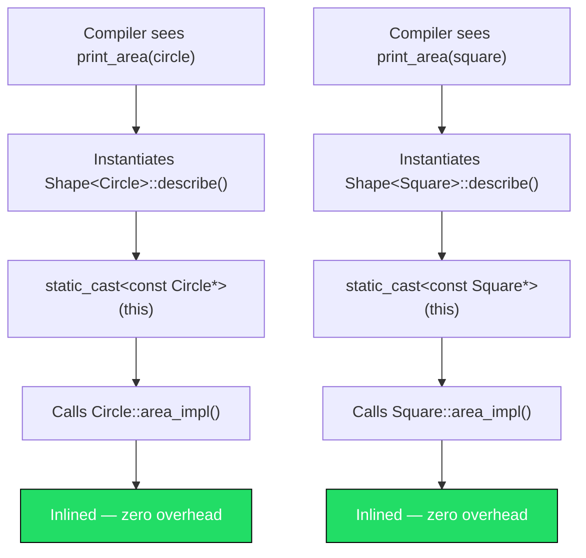
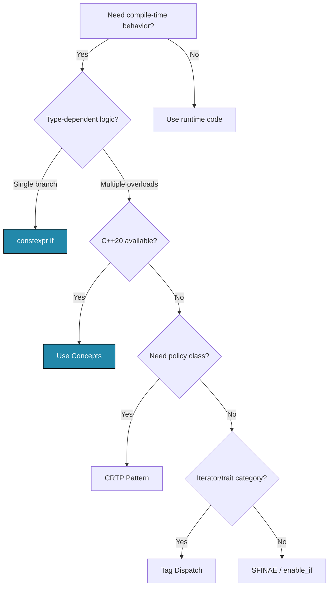

# Chapter 23: Template Metaprogramming

**Tags:** `#cpp` `#templates` `#metaprogramming` `#variadic` `#constexpr` `#CRTP` `#compile-time` `#advanced`

---

## Theory

Template metaprogramming (TMP) is the practice of using C++ templates to perform computation at **compile time** rather than runtime. The compiler essentially becomes an interpreter executing a functional program written in template syntax. While powerful, TMP produces code that runs faster (zero runtime overhead) at the cost of longer compilation and more complex source.

Modern C++ (17/20) has dramatically improved TMP ergonomics with `constexpr if`, fold expressions, and concepts—replacing much of the arcane SFINAE machinery from earlier standards.

---

## What — Why — How

| Aspect | Detail |
|--------|--------|
| **What** | Techniques that shift computation, type selection, and code generation from runtime to compile time |
| **Why** | Zero-cost abstractions, static polymorphism, policy-based design, expression optimization |
| **How** | Variadic templates, `constexpr if`, CRTP, tag dispatch, fold expressions, template template parameters |

---

## 1. Variadic Templates — Parameter Packs

A variadic template accepts an arbitrary number of template arguments via a **parameter pack**.

```cpp
#include <iostream>
#include <string>

// Base case — terminates recursion
void print() {
    std::cout << '\n';
}

// Recursive case — peel off the first argument
template <typename T, typename... Rest>
void print(const T& first, const Rest&... rest) {
    std::cout << first;
    if constexpr (sizeof...(rest) > 0)
        std::cout << ", ";
    print(rest...);          // expand remaining pack
}

int main() {
    print(1, 3.14, "hello", std::string("world"));
    // Output: 1, 3.14, hello, world
}
```

### Fold Expressions (C++17)

Fold expressions collapse a parameter pack with a binary operator **without recursion**.

```cpp
#include <iostream>

// Unary left fold: (... op pack) → ((p1 op p2) op p3) ...
template <typename... Args>
auto sum(Args... args) {
    return (... + args);   // left fold over +
}

// Binary right fold with init: (pack op ... op init)
template <typename... Args>
bool all_true(Args... args) {
    return (args && ... && true);  // right fold over &&
}

// Comma-fold to call a function on every element
template <typename Fn, typename... Args>
void for_each_arg(Fn fn, Args&&... args) {
    (fn(std::forward<Args>(args)), ...);  // comma fold
}

int main() {
    std::cout << sum(1, 2, 3, 4, 5) << '\n';          // 15
    std::cout << std::boolalpha << all_true(1, 1, 0) << '\n';  // false

    for_each_arg([](auto x){ std::cout << x << ' '; }, 10, 20, 30);
    std::cout << '\n';  // 10 20 30
}
```

---

## 2. `constexpr if` — Compile-Time Branching (C++17)

`if constexpr` evaluates the condition at compile time; the discarded branch is **not instantiated**.

```cpp
#include <iostream>
#include <type_traits>
#include <string>

template <typename T>
std::string to_string_smart(const T& val) {
    if constexpr (std::is_arithmetic_v<T>) {
        return std::to_string(val);
    } else if constexpr (std::is_same_v<T, std::string>) {
        return val;
    } else {
        // Fallback — requires T to have .to_string()
        return val.to_string();
    }
}

int main() {
    std::cout << to_string_smart(42) << '\n';             // "42"
    std::cout << to_string_smart(std::string("hi")) << '\n'; // "hi"
}
```

Without `if constexpr`, each branch would need a separate overload or SFINAE guard.

---

## 3. Template Template Parameters

A **template template parameter** accepts a template (not a type) as an argument.

```cpp
#include <iostream>
#include <vector>
#include <deque>
#include <list>
#include <string>

// Container is a template template parameter
template <template <typename, typename> class Container, typename T>
class DataStore {
    Container<T, std::allocator<T>> data_;
public:
    void add(const T& val) { data_.push_back(val); }
    void show() const {
        for (const auto& v : data_) std::cout << v << ' ';
        std::cout << '\n';
    }
};

int main() {
    DataStore<std::vector, int> v_store;
    v_store.add(1); v_store.add(2); v_store.add(3);
    v_store.show();  // 1 2 3

    DataStore<std::deque, std::string> d_store;
    d_store.add("alpha"); d_store.add("beta");
    d_store.show();  // alpha beta
}
```

---

## 4. CRTP — Curiously Recurring Template Pattern

CRTP enables **static (compile-time) polymorphism** by having a derived class pass itself as a template argument to its base.

```cpp
#include <iostream>
#include <cmath>

// CRTP base — no virtual functions, no vtable overhead
template <typename Derived>
class Shape {
public:
    double area() const {
        return static_cast<const Derived*>(this)->area_impl();
    }
    void describe() const {
        std::cout << "Area = " << area() << '\n';
    }
};

class Circle : public Shape<Circle> {
    double r_;
public:
    explicit Circle(double r) : r_(r) {}
    double area_impl() const { return M_PI * r_ * r_; }
};

class Square : public Shape<Square> {
    double s_;
public:
    explicit Square(double s) : s_(s) {}
    double area_impl() const { return s_ * s_; }
};

// Works at compile time — no virtual dispatch
template <typename S>
void print_area(const Shape<S>& shape) {
    shape.describe();
}

int main() {
    Circle c(5.0);
    Square s(4.0);
    print_area(c);  // Area = 78.5398
    print_area(s);  // Area = 16
}
```

### CRTP vs Virtual Polymorphism

| Feature | CRTP | Virtual |
|---------|------|---------|
| Dispatch | Compile-time | Runtime |
| vtable overhead | None | Per-class vtable pointer |
| Heterogeneous containers | No (different types) | Yes (base pointer) |
| Extensibility | Closed set | Open set |
| Inline-ability | Full | Limited (devirtualization) |

---

## 5. Tag Dispatch Pattern

Tag dispatch selects an overload at compile time using empty **tag types** that represent traits.

```cpp
#include <iostream>
#include <iterator>
#include <vector>
#include <list>

namespace detail {

// Overload for random-access iterators — O(1)
template <typename Iter>
void advance_impl(Iter& it, int n, std::random_access_iterator_tag) {
    it += n;
    std::cout << "[random access advance]\n";
}

// Overload for bidirectional iterators — O(n)
template <typename Iter>
void advance_impl(Iter& it, int n, std::bidirectional_iterator_tag) {
    while (n > 0) { ++it; --n; }
    while (n < 0) { --it; ++n; }
    std::cout << "[bidirectional advance]\n";
}

} // namespace detail

template <typename Iter>
void my_advance(Iter& it, int n) {
    // Tag dispatch: iterator_category selects the overload
    detail::advance_impl(it, n,
        typename std::iterator_traits<Iter>::iterator_category{});
}

int main() {
    std::vector<int> v{10, 20, 30, 40, 50};
    auto vit = v.begin();
    my_advance(vit, 3);
    std::cout << *vit << '\n';  // 40

    std::list<int> l{10, 20, 30, 40, 50};
    auto lit = l.begin();
    my_advance(lit, 2);
    std::cout << *lit << '\n';  // 30
}
```

---

## 6. Compile-Time Computation

### Factorial & Fibonacci

```cpp
#include <iostream>
#include <array>

// Modern constexpr approach (C++14+)
constexpr long long factorial(int n) {
    long long result = 1;
    for (int i = 2; i <= n; ++i)
        result *= i;
    return result;
}

constexpr long long fibonacci(int n) {
    if (n <= 1) return n;
    long long a = 0, b = 1;
    for (int i = 2; i <= n; ++i) {
        long long tmp = a + b;
        a = b;
        b = tmp;
    }
    return b;
}

// Generate a compile-time lookup table
template <std::size_t... Is>
constexpr auto make_fib_table(std::index_sequence<Is...>) {
    return std::array<long long, sizeof...(Is)>{{ fibonacci(Is)... }};
}

int main() {
    // All computed at compile time
    static_assert(factorial(10) == 3628800);
    static_assert(fibonacci(20) == 6765);

    constexpr auto fib_table = make_fib_table(std::make_index_sequence<20>{});

    for (std::size_t i = 0; i < fib_table.size(); ++i)
        std::cout << "fib(" << i << ") = " << fib_table[i] << '\n';
}
```

---

## 7. Expression Templates (Concept)

Expression templates defer evaluation to avoid temporary objects—critical in linear algebra libraries.

```cpp
#include <iostream>
#include <vector>
#include <cassert>
#include <cstddef>

// Simplified expression template for vector addition
template <typename E>
class VecExpr {
public:
    double operator[](std::size_t i) const {
        return static_cast<const E&>(*this)[i];
    }
    std::size_t size() const {
        return static_cast<const E&>(*this).size();
    }
};

class Vec : public VecExpr<Vec> {
    std::vector<double> data_;
public:
    explicit Vec(std::size_t n) : data_(n, 0.0) {}

    // Evaluate any expression template into a concrete vector
    template <typename E>
    Vec(const VecExpr<E>& expr) : data_(expr.size()) {
        for (std::size_t i = 0; i < data_.size(); ++i)
            data_[i] = expr[i];
    }

    double  operator[](std::size_t i) const { return data_[i]; }
    double& operator[](std::size_t i)       { return data_[i]; }
    std::size_t size() const { return data_.size(); }
};

template <typename L, typename R>
class VecSum : public VecExpr<VecSum<L, R>> {
    const L& lhs_;
    const R& rhs_;
public:
    VecSum(const L& l, const R& r) : lhs_(l), rhs_(r) {}
    double operator[](std::size_t i) const { return lhs_[i] + rhs_[i]; }
    std::size_t size() const { return lhs_.size(); }
};

template <typename L, typename R>
VecSum<L, R> operator+(const VecExpr<L>& l, const VecExpr<R>& r) {
    return VecSum<L, R>(static_cast<const L&>(l), static_cast<const R&>(r));
}

int main() {
    Vec a(3), b(3), c(3);
    a[0]=1; a[1]=2; a[2]=3;
    b[0]=4; b[1]=5; b[2]=6;
    c[0]=7; c[1]=8; c[2]=9;

    // a + b + c produces NO temporaries — single traversal
    Vec result = a + b + c;
    for (std::size_t i = 0; i < result.size(); ++i)
        std::cout << result[i] << ' ';  // 12 15 18
    std::cout << '\n';
}
```

---

## Mermaid Diagram: CRTP Static Dispatch



## Mermaid Diagram: Metaprogramming Decision Tree



---

## When Is Metaprogramming Worth the Complexity?

| ✅ Worth It | ❌ Overkill |
|------------|-------------|
| Library interfaces used by many teams | One-off application logic |
| Performance-critical inner loops | Code that runs once at startup |
| Replacing virtual dispatch in hot paths | Small hierarchies with few types |
| Compile-time validation of invariants | Checks easily done at runtime |
| Expression templates in math libraries | Simple arithmetic |

---

## Exercises

### 🟢 Beginner
1. Write a variadic `max_of(args...)` that returns the maximum using a fold expression.
2. Use `constexpr` to compute the sum of the first N natural numbers at compile time.

### 🟡 Intermediate
3. Implement a CRTP-based `Printable<Derived>` mixin that provides `print()` calling `Derived::format()`.
4. Write a tag-dispatch function `serialize(T)` that selects JSON output for strings and binary for arithmetic types.

### 🔴 Advanced
5. Build an expression template system for vector subtraction and scalar multiplication.
6. Create a compile-time type list (`TypeList<int, double, char>`) with `size`, `front`, and `contains<T>` operations.

---

## Solutions

### Solution 1 — `max_of` with fold expression

```cpp
#include <iostream>

template <typename T>
T max_of(T val) { return val; }

template <typename T, typename... Rest>
T max_of(T first, Rest... rest) {
    auto tail_max = max_of(rest...);
    return first > tail_max ? first : tail_max;
}

// Alternative using fold with std::max
#include <algorithm>
template <typename... Args>
auto max_fold(Args... args) {
    return (std::max({args...}));
}

int main() {
    std::cout << max_of(3, 7, 2, 9, 4) << '\n';    // 9
    std::cout << max_fold(3, 7, 2, 9, 4) << '\n';   // 9
}
```

### Solution 3 — CRTP `Printable` Mixin

```cpp
#include <iostream>
#include <string>

template <typename Derived>
class Printable {
public:
    void print() const {
        std::cout << static_cast<const Derived*>(this)->format() << '\n';
    }
};

class Point : public Printable<Point> {
    double x_, y_;
public:
    Point(double x, double y) : x_(x), y_(y) {}
    std::string format() const {
        return "(" + std::to_string(x_) + ", " + std::to_string(y_) + ")";
    }
};

int main() {
    Point p(3.0, 4.0);
    p.print();  // (3.000000, 4.000000)
}
```

---

## Quiz

**Q1.** What does `sizeof...(pack)` return?
a) The total byte size of all pack elements
b) The number of elements in the parameter pack ✅
c) The size of the first element
d) A compile error

**Q2.** In a fold expression `(... + args)`, what is the associativity?
a) Right-to-left
b) Left-to-right ✅
c) Unspecified
d) Depends on the operator

**Q3.** What happens to the discarded branch of `if constexpr`?
a) It is evaluated but not executed
b) It is not instantiated at all ✅
c) It causes a warning
d) It is compiled but optimized away

**Q4.** In CRTP, how does the base class call derived methods?
a) Virtual function dispatch
b) `dynamic_cast` to derived type
c) `static_cast<Derived*>(this)` ✅
d) Template specialization

**Q5.** What problem do expression templates solve?
a) Type safety in templates
b) Eliminating temporary objects in chained operations ✅
c) Reducing template instantiation depth
d) Enabling runtime polymorphism

**Q6.** Tag dispatch selects overloads based on:
a) Runtime type information
b) Virtual function tables
c) Empty tag types derived from traits ✅
d) Exception types

**Q7.** Which C++ standard introduced fold expressions?
a) C++11
b) C++14
c) C++17 ✅
d) C++20

---

## Key Takeaways

- **Variadic templates** + fold expressions eliminate recursive boilerplate
- **`constexpr if`** replaces most SFINAE for compile-time branching
- **CRTP** provides static polymorphism with zero runtime overhead
- **Tag dispatch** selects optimal algorithms based on type traits
- **Expression templates** eliminate temporaries in chained math operations
- Modern C++ (17/20) makes metaprogramming far more readable than classic TMP

---

## Chapter Summary

Template metaprogramming shifts work from runtime to compile time. Parameter packs and fold expressions handle variadic arguments cleanly. `constexpr if` enables type-dependent branching without SFINAE. CRTP replaces virtual dispatch when the type set is closed. Tag dispatch maps traits to algorithm overloads. Expression templates optimize chained operations in domain-specific libraries. The key decision is always: does the compile-time complexity justify the runtime benefit?

---

## Real-World Insight

> **Eigen** (linear algebra library) and **Blaze** use expression templates extensively—a single line like `d = a + b * c` compiles to a single fused loop with no temporaries. The STL itself uses tag dispatch for `std::advance` and `std::distance`. Game engines use CRTP for component systems where virtual call overhead in the hot loop is unacceptable. Modern codebases increasingly prefer `constexpr if` + concepts over the old SFINAE + `enable_if` style.

---

## Common Mistakes

| Mistake | Why It's Wrong | Fix |
|---------|---------------|-----|
| Forgetting base case in variadic recursion | Infinite instantiation → compiler error | Add empty-pack overload or use `if constexpr` |
| Using `if` instead of `if constexpr` | Both branches are instantiated → possible compile error | Use `if constexpr` for type-dependent code |
| CRTP without `static_cast` | UB if you use `reinterpret_cast` or C-style cast | Always `static_cast<const Derived*>(this)` |
| Overusing TMP for simple logic | Unreadable code, slow compilation | Prefer runtime code unless perf-critical |
| Mixing up fold associativity | `(... - args)` ≠ `(args - ...)` for non-commutative ops | Test with 3+ args to verify semantics |

---

## Interview Questions

**Q1. Explain CRTP and give a use case where it outperforms virtual polymorphism.**

> CRTP has a derived class inherit from a base parameterized by itself: `class D : public Base<D>`. The base calls derived methods via `static_cast`. It outperforms virtual dispatch in tight loops (e.g., a rendering pipeline calling `draw()` millions of times per frame) because the compiler inlines the call completely—no vtable indirection.

**Q2. What is a fold expression and how does it differ from recursive variadic expansion?**

> A fold expression (C++17) collapses a parameter pack with a binary operator in a single expression: `(... + args)`. Recursive expansion peels one argument at a time with a base case. Folds are more concise, compile faster (less template depth), and avoid the need for a termination overload.

**Q3. When should you choose `constexpr if` over SFINAE?**

> Use `constexpr if` when you have a single function that needs different behavior based on type traits—it's readable and doesn't require separate overloads. Use SFINAE (or concepts) when you need to control overload resolution across multiple functions or when you need to completely remove a function from the candidate set.

**Q4. What are expression templates and why do linear algebra libraries use them?**

> Expression templates represent an arithmetic expression as a tree of lightweight proxy objects. Evaluation is deferred until assignment, enabling the compiler to fuse multiple operations into a single loop without allocating temporaries. Libraries like Eigen use this to make `d = a + b * c` as fast as a hand-written loop.

**Q5. What is the ABI impact of template metaprogramming?**

> Each unique template instantiation generates a separate function/class in the binary. Excessive instantiation leads to code bloat. CRTP-based designs generate one instantiation per derived type, while expression templates can create deeply nested types that stress debuggers and increase symbol table size.
