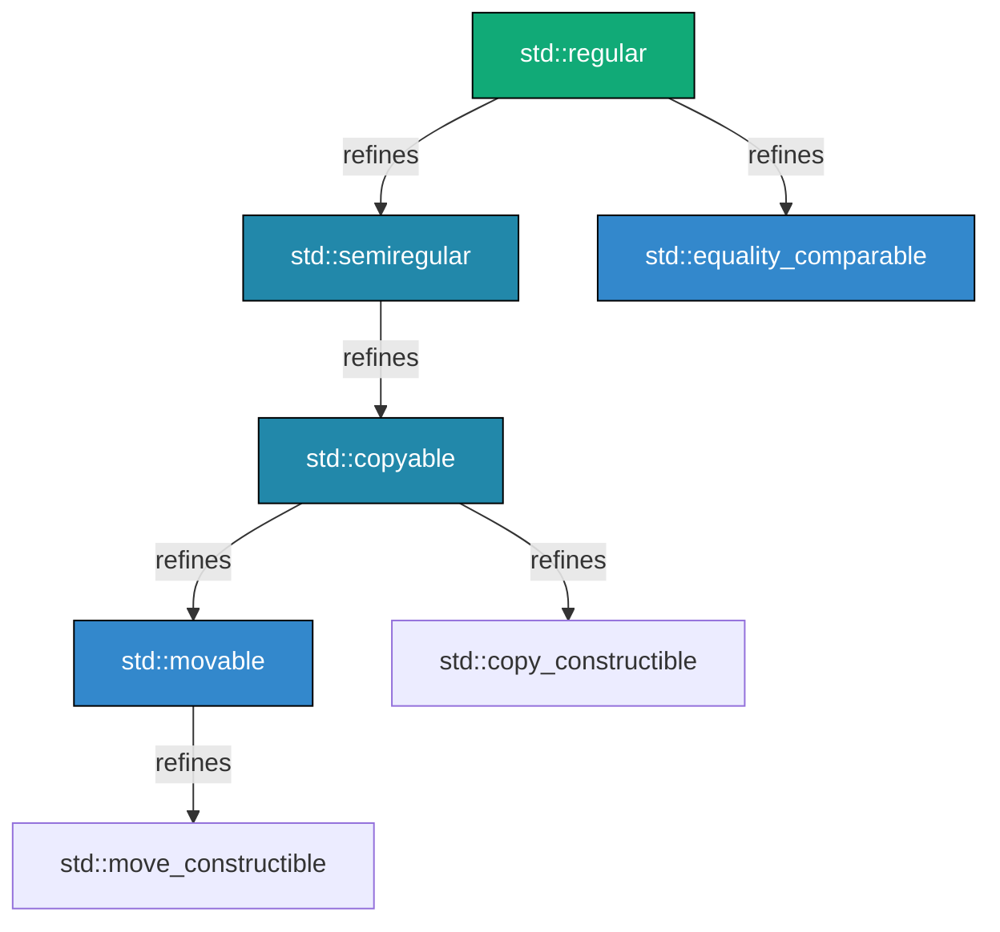
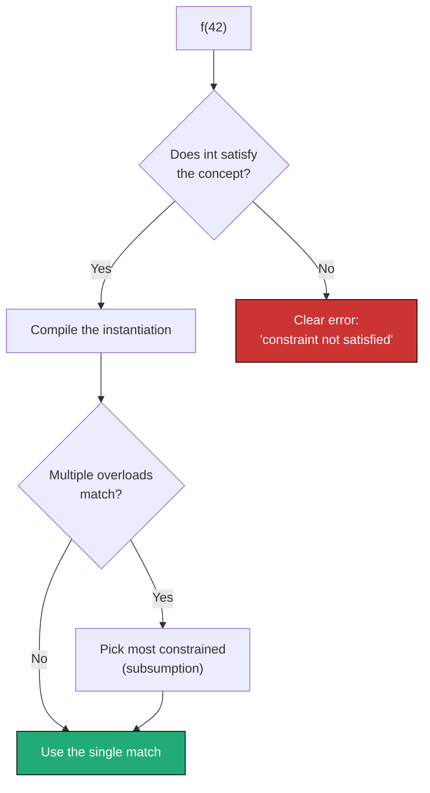

# Chapter 24: Concepts & Constraints (C++20)

**Tags:** `#cpp20` `#concepts` `#constraints` `#requires` `#SFINAE` `#templates` `#type-safety`

---

## Theory

C++20 **concepts** are named Boolean predicates on template parameters evaluated at compile time. They replace SFINAE hacks with a first-class language feature that produces **clear error messages**, enables **overload resolution by specificity** (subsumption), and makes template interfaces **self-documenting**. A concept constrains what types are valid for a template, and the compiler reports exactly which requirement failed.

---

## What — Why — How

| Aspect | Detail |
|--------|--------|
| **What** | Named compile-time predicates that constrain template arguments |
| **Why** | Readable template errors, cleaner interfaces, subsumption-based overload ordering |
| **How** | `concept` keyword, `requires` clauses, `requires` expressions, standard library concepts |

---

## 1. Why Concepts?

### The SFINAE Problem

Before concepts, constraining templates meant SFINAE—Substitution Failure Is Not An Error:

```cpp
// C++17 SFINAE — hard to read, terrible error messages
#include <type_traits>
#include <iostream>

template <typename T,
          std::enable_if_t<std::is_integral_v<T>, int> = 0>
T double_it(T val) {
    return val * 2;
}

// Error message when called with std::string:
// "no matching function for call to 'double_it(std::string)'"
// ...followed by 50 lines of template substitution failures
```

### The Concepts Solution

Here is the same `double_it` function rewritten with C++20 concepts. Instead of the verbose `enable_if` machinery, we simply write `std::integral T` in the template parameter — the compiler immediately understands the constraint and produces a clear, one-line error if you pass the wrong type.

```cpp
// C++20 Concepts — clean, readable, great error messages
#include <concepts>
#include <iostream>

template <std::integral T>
T double_it(T val) {
    return val * 2;
}

// Error message when called with std::string:
// "constraints not satisfied: std::string does not satisfy std::integral"
```

---

## 2. `requires` Clauses and `requires` Expressions

### `requires` Clause — Constrains a Template

A `requires` clause attaches a constraint to a template so that the function only exists for types that satisfy the condition. This example shows two syntax styles: a trailing `requires` clause that restricts `reciprocal` to floating-point types, and the abbreviated `std::integral auto` syntax that constrains a parameter inline. If you pass the wrong type, the compiler immediately rejects the call with a clear message.

```cpp
#include <iostream>
#include <concepts>

// Trailing requires clause
template <typename T>
    requires std::floating_point<T>
T reciprocal(T val) {
    return T(1) / val;
}

// Abbreviated function template with concept
void print_integral(std::integral auto val) {
    std::cout << "Integer: " << val << '\n';
}

int main() {
    std::cout << reciprocal(4.0) << '\n';   // 0.25
    // reciprocal(4);  // Error: int does not satisfy floating_point
    print_integral(42);     // OK
    // print_integral(3.14); // Error: double does not satisfy integral
}
```

### `requires` Expression — Tests Validity of Expressions

A `requires` expression is a compile-time test that checks whether certain operations are valid for a given type. This example defines three custom concepts: `Printable` checks that `std::cout << t` compiles, `Hashable` checks that `std::hash` works and returns something convertible to `size_t` (a compound requirement), and `SignedNumber` embeds a nested predicate to verify the type is signed and supports basic arithmetic. The `static_assert` lines verify each concept at compile time.

```cpp
#include <iostream>
#include <string>
#include <concepts>

// Simple requirement: expression must be valid
template <typename T>
concept Printable = requires(T t) {
    std::cout << t;            // simple requirement
};

// Compound requirement: expression valid + return type constrained
template <typename T>
concept Hashable = requires(T t) {
    { std::hash<T>{}(t) } -> std::convertible_to<std::size_t>;
};

// Nested requirement: embedded predicate
template <typename T>
concept SignedNumber = requires(T t) {
    requires std::is_signed_v<T>;
    { t + t } -> std::same_as<T>;
    { t - t } -> std::same_as<T>;
    { -t } -> std::same_as<T>;
};

static_assert(Printable<int>);
static_assert(Printable<std::string>);
static_assert(Hashable<int>);
static_assert(SignedNumber<int>);
static_assert(!SignedNumber<unsigned int>);
```

---

## 3. Writing Custom Concepts

This example shows how to define your own concepts for domain-specific constraints. The `Container` concept requires a type to have `value_type`, `iterator`, `begin()`, `end()`, `size()`, and `empty()` — everything you'd expect from a standard container. The `Numeric` concept requires arithmetic operators. Functions constrained with these concepts will only accept types that truly support the operations used inside.

```cpp
#include <concepts>
#include <iostream>
#include <vector>
#include <string>
#include <cstddef>

// Concept: type must support container-like operations
template <typename C>
concept Container = requires(C c) {
    typename C::value_type;
    typename C::iterator;
    { c.begin() } -> std::same_as<typename C::iterator>;
    { c.end() }   -> std::same_as<typename C::iterator>;
    { c.size() }  -> std::convertible_to<std::size_t>;
    { c.empty() } -> std::convertible_to<bool>;
};

// Concept: type must be a numeric type supporting arithmetic
template <typename T>
concept Numeric = requires(T a, T b) {
    { a + b } -> std::convertible_to<T>;
    { a - b } -> std::convertible_to<T>;
    { a * b } -> std::convertible_to<T>;
    { a / b } -> std::convertible_to<T>;
    requires std::is_arithmetic_v<T> || requires { T{0}; };
};

// Use the concepts
template <Container C>
void print_container(const C& c) {
    std::cout << "[";
    bool first = true;
    for (const auto& elem : c) {
        if (!first) std::cout << ", ";
        std::cout << elem;
        first = false;
    }
    std::cout << "]\n";
}

template <Numeric T>
T average(T a, T b) {
    return (a + b) / T(2);
}

int main() {
    std::vector<int> v{1, 2, 3, 4, 5};
    print_container(v);                          // [1, 2, 3, 4, 5]
    std::cout << average(10.0, 20.0) << '\n';    // 15
}
```

---

## 4. Standard Library Concepts

C++20 provides concepts in `<concepts>` and `<iterator>`:

| Header | Concept | Meaning |
|--------|---------|---------|
| `<concepts>` | `std::integral` | Integer types (int, long, char...) |
| `<concepts>` | `std::floating_point` | float, double, long double |
| `<concepts>` | `std::same_as<T, U>` | T and U are the same type |
| `<concepts>` | `std::convertible_to<From, To>` | Implicit + explicit conversion |
| `<concepts>` | `std::copyable` | Copy-constructible + copy-assignable |
| `<concepts>` | `std::movable` | Move-constructible + move-assignable |
| `<concepts>` | `std::regular` | Copyable + default-init + equality-comparable |
| `<concepts>` | `std::invocable<F, Args...>` | F callable with Args |
| `<concepts>` | `std::predicate<F, Args...>` | Invocable returning bool |
| `<iterator>` | `std::input_iterator` | Supports single-pass read |
| `<iterator>` | `std::random_access_iterator` | Supports O(1) indexing |
| `<ranges>` | `std::ranges::range` | Has begin() and end() |

This code demonstrates using standard library concepts in practice. The `my_sort` function combines `std::ranges::range` with `std::totally_ordered` to ensure the range's elements are sortable. The `apply_filter` function uses `std::predicate` to guarantee the callback returns a `bool`. These constraints catch type mismatches at the call site rather than deep inside the implementation.

```cpp
#include <concepts>
#include <iostream>
#include <vector>
#include <ranges>

// Constrain a sort function using standard concepts
template <std::ranges::range R>
    requires std::totally_ordered<std::ranges::range_value_t<R>>
void my_sort(R& range) {
    std::ranges::sort(range);
}

// Constrain a callback
template <typename F, typename T>
    requires std::predicate<F, T>
bool apply_filter(F fn, const T& val) {
    return fn(val);
}

int main() {
    std::vector<int> v{5, 3, 1, 4, 2};
    my_sort(v);
    for (int x : v) std::cout << x << ' ';  // 1 2 3 4 5
    std::cout << '\n';

    auto is_even = [](int x) { return x % 2 == 0; };
    std::cout << std::boolalpha << apply_filter(is_even, 4) << '\n'; // true
}
```

---

## 5. Constraining Class Templates

Concepts can constrain entire class templates and even individual member functions within them. This `Matrix` class only allows arithmetic types (int, float, double, etc.) via a `requires` clause on the class. The `invert()` method adds a further constraint — it only exists when `T` is a floating-point type, since matrix inversion doesn't make sense for integers. This means `Matrix<int>` compiles fine but calling `invert()` on it produces a clear error.

```cpp
#include <concepts>
#include <iostream>
#include <stdexcept>
#include <type_traits>

// Only allow arithmetic types for Matrix
template <typename T>
    requires std::is_arithmetic_v<T>
class Matrix {
    T data_[4][4]{};
    int rows_, cols_;
public:
    Matrix(int r, int c) : rows_(r), cols_(c) {
        if (r > 4 || c > 4) throw std::out_of_range("max 4x4");
    }
    T& at(int r, int c) { return data_[r][c]; }
    const T& at(int r, int c) const { return data_[r][c]; }

    // Constrain individual methods
    void invert() requires std::floating_point<T> {
        // Only available when T is a floating-point type
        // (placeholder for actual inversion logic)
    }

    friend std::ostream& operator<<(std::ostream& os, const Matrix& m) {
        for (int r = 0; r < m.rows_; ++r) {
            for (int c = 0; c < m.cols_; ++c)
                os << m.data_[r][c] << '\t';
            os << '\n';
        }
        return os;
    }
};

int main() {
    Matrix<double> m(2, 2);
    m.at(0,0) = 1.0; m.at(0,1) = 2.0;
    m.at(1,0) = 3.0; m.at(1,1) = 4.0;
    m.invert();  // OK: double is floating_point
    std::cout << m;

    Matrix<int> mi(2, 2);
    mi.at(0,0) = 1;
    // mi.invert();  // Error: int does not satisfy floating_point
}
```

---

## 6. Concept Refinement (Subsumption)

When multiple overloads satisfy a call, the compiler picks the **most constrained** one.

```cpp
#include <concepts>
#include <iostream>

// Base concept
template <typename T>
concept Number = requires(T a, T b) {
    { a + b } -> std::convertible_to<T>;
};

// Refined concept — subsumes Number
template <typename T>
concept Integer = Number<T> && std::integral<T>;

// Less constrained overload
void process(Number auto val) {
    std::cout << "Number: " << val << '\n';
}

// More constrained overload — preferred for integers
void process(Integer auto val) {
    std::cout << "Integer: " << val << '\n';
}

int main() {
    process(3.14);  // Number: 3.14  (only Number matches)
    process(42);    // Integer: 42   (Integer is more constrained)
}
```

The compiler knows `Integer` **subsumes** `Number` because Integer's constraint includes Number's. No ambiguity.

---

## 7. Concepts vs SFINAE — Side-by-Side

This side-by-side comparison shows the same `to_string` overloads written with C++17 SFINAE and C++20 concepts. The SFINAE version requires verbose `enable_if_t` boilerplate in the template parameters, while the concepts version uses concise `std::integral auto` and `std::floating_point auto` syntax. The concepts approach is more readable, compiles faster, and produces much clearer error messages.

```cpp
// ============ SFINAE (C++17) ============
#include <type_traits>
#include <iostream>

template <typename T,
          std::enable_if_t<std::is_integral_v<T>, int> = 0>
auto to_string_sfinae(T val) {
    return std::to_string(val);
}

template <typename T,
          std::enable_if_t<std::is_floating_point_v<T>, int> = 0>
auto to_string_sfinae(T val) {
    return std::to_string(val);
}

// ============ Concepts (C++20) ============
#include <concepts>

auto to_string_concept(std::integral auto val) {
    return std::to_string(val);
}

auto to_string_concept(std::floating_point auto val) {
    return std::to_string(val);
}
```

| Aspect | SFINAE | Concepts |
|--------|--------|----------|
| Readability | 🔴 Opaque `enable_if` | 🟢 Declarative |
| Error messages | 🔴 Pages of substitution failures | 🟢 "constraint not satisfied" |
| Overload ordering | 🔴 Manual priority with `void_t` tricks | 🟢 Automatic subsumption |
| Composability | 🟡 Possible but verbose | 🟢 `&&`, `||` on concepts |
| Compile speed | 🔴 Slower (more instantiation) | 🟢 Faster (early rejection) |

---

## 8. Real-World: Constraining a Container Interface

This example builds a complete `FlatBuffer` container class constrained by a custom `Storable` concept (requiring types to be copyable and default-initializable). It demonstrates real-world usage: the container manages its own dynamic memory with a growth strategy, exposes iterators so it works with `std::sort`, and a `print_all` function uses an inline `requires` expression to accept any type with the right interface. This pattern is how production libraries combine concepts with data structures.

```cpp
#include <concepts>
#include <iterator>
#include <memory>
#include <iostream>
#include <cstddef>
#include <algorithm>
#include <stdexcept>

template <typename T>
concept Storable = std::copyable<T> && std::default_initializable<T>;

template <Storable T>
class FlatBuffer {
    std::unique_ptr<T[]> data_;
    std::size_t size_ = 0;
    std::size_t capacity_ = 0;

public:
    using value_type = T;
    using iterator = T*;

    FlatBuffer() = default;
    explicit FlatBuffer(std::size_t cap)
        : data_(std::make_unique<T[]>(cap)), capacity_(cap) {}

    void push_back(const T& val) {
        if (size_ >= capacity_) grow();
        data_[size_++] = val;
    }

    T& operator[](std::size_t i) { return data_[i]; }
    const T& operator[](std::size_t i) const { return data_[i]; }

    iterator begin() { return data_.get(); }
    iterator end()   { return data_.get() + size_; }
    std::size_t size() const { return size_; }
    bool empty() const { return size_ == 0; }

private:
    void grow() {
        std::size_t new_cap = capacity_ == 0 ? 8 : capacity_ * 2;
        auto new_data = std::make_unique<T[]>(new_cap);
        std::copy(data_.get(), data_.get() + size_, new_data.get());
        data_ = std::move(new_data);
        capacity_ = new_cap;
    }
};

// Constrain algorithms that work on our buffer
template <typename C>
    requires requires(C c) {
        typename C::value_type;
        { c.begin() } -> std::input_or_output_iterator;
        { c.size() }  -> std::convertible_to<std::size_t>;
    }
void print_all(const C& container) {
    for (std::size_t i = 0; i < container.size(); ++i)
        std::cout << container[i] << ' ';
    std::cout << '\n';
}

int main() {
    FlatBuffer<int> buf;
    for (int i = 1; i <= 10; ++i) buf.push_back(i * i);
    print_all(buf);  // 1 4 9 16 25 36 49 64 81 100

    std::sort(buf.begin(), buf.end(), std::greater<int>{});
    print_all(buf);  // 100 81 64 49 36 25 16 9 4 1
}
```

---

## Mermaid Diagram: Concept Subsumption



## Mermaid Diagram: Concept Check Flow



---

## Exercises

### 🟢 Beginner
1. Write a concept `Addable<T>` that requires `T` supports `operator+` returning `T`.
2. Constrain a function `negate(T val)` so it only accepts signed types.

### 🟡 Intermediate
3. Create a `Serializable` concept requiring `.serialize()` → `std::string` and a static `deserialize(std::string)` → `T`.
4. Write two overloads of `stringify()` using concepts: one for integral types (returns hex string) and one for floating-point (returns fixed-point string).

### 🔴 Advanced
5. Implement a concept `Graph<G>` that requires `G` to have `node_type`, `edge_type`, `adjacent_nodes(node_type)` returning a range, and `edge_weight(node_type, node_type)`.
6. Create a concept hierarchy: `Iterator` → `ForwardIterator` → `BidirectionalIterator` → `RandomAccessIterator`, each adding the appropriate requirements.

---

## Solutions

### Solution 1 — `Addable` Concept

This solution defines a simple `Addable` concept that checks whether two values of type `T` can be added together with the result convertible back to `T`. The `add` function is then constrained with this concept, so it works with any addable type — integers, floats, strings, or any custom type with `operator+`.

```cpp
#include <concepts>
#include <iostream>
#include <string>

template <typename T>
concept Addable = requires(T a, T b) {
    { a + b } -> std::convertible_to<T>;
};

template <Addable T>
T add(T a, T b) { return a + b; }

int main() {
    std::cout << add(3, 4) << '\n';                         // 7
    std::cout << add(std::string("hi"), std::string(" there")) << '\n'; // hi there
}
```

### Solution 4 — Overloaded `stringify()`

This solution uses concepts to create two overloads of `stringify()` that behave differently based on the type. The `std::integral` overload formats integers as hexadecimal strings (e.g., 255 → "0xff"), while the `std::floating_point` overload formats decimals with fixed precision. The compiler automatically selects the correct overload based on which concept the argument satisfies — no SFINAE needed.

```cpp
#include <concepts>
#include <iostream>
#include <sstream>
#include <iomanip>
#include <string>

std::string stringify(std::integral auto val) {
    std::ostringstream oss;
    oss << "0x" << std::hex << val;
    return oss.str();
}

std::string stringify(std::floating_point auto val) {
    std::ostringstream oss;
    oss << std::fixed << std::setprecision(4) << val;
    return oss.str();
}

int main() {
    std::cout << stringify(255) << '\n';    // 0xff
    std::cout << stringify(3.14159) << '\n'; // 3.1416
}
```

---

## Quiz

**Q1.** Which keyword introduces a named constraint in C++20?
a) `constexpr`
b) `concept` ✅
c) `constraint`
d) `requires`

**Q2.** What does `requires std::integral<T>` in a template do?
a) Defines a new concept
b) Restricts T to integer types ✅
c) Creates a runtime assertion
d) Enables SFINAE

**Q3.** In concept subsumption, which overload wins?
a) The least constrained
b) The most constrained ✅
c) The first declared
d) It's always ambiguous

**Q4.** What is the abbreviated syntax for a constrained template parameter?
a) `template <concept T>`
b) `template <std::integral T>` ✅
c) `template <requires T>`
d) `template <auto T>`

**Q5.** A `requires` expression that contains `{ expr } -> std::same_as<T>` is called:
a) Simple requirement
b) Type requirement
c) Compound requirement ✅
d) Nested requirement

**Q6.** What replaces `std::enable_if` in modern C++20 code?
a) `constexpr if`
b) Concepts and `requires` clauses ✅
c) `static_assert`
d) `decltype`

**Q7.** Which of these is a standard library concept?
a) `std::printable`
b) `std::copyable` ✅
c) `std::sortable_type`
d) `std::numeric`

**Q8.** Can you use `||` to combine concepts?
a) Yes, with `||` directly in requires clauses ✅
b) No, only `&&` is allowed
c) Only via disjunction trait
d) Only in concept definitions, not requires clauses

---

## Key Takeaways

- Concepts replace SFINAE with **readable, maintainable** template constraints
- `requires` clauses constrain templates; `requires` expressions test expression validity
- The compiler auto-selects the **most constrained** overload via subsumption
- Standard library concepts (`<concepts>`, `<iterator>`, `<ranges>`) cover common patterns
- Individual member functions can be independently constrained
- Concepts compose naturally with `&&` and `||`

---

## Chapter Summary

C++20 concepts are the most significant improvement to C++ templates since their introduction. They provide named, composable, first-class constraints that produce clear error messages and enable automatic overload ordering through subsumption. The `requires` keyword serves double duty—as a clause constraining templates and as an expression testing type capabilities. Standard library concepts cover the most common patterns, while custom concepts let you express domain-specific requirements. Concepts don't just replace SFINAE—they make template-heavy code accessible to a much wider audience of C++ developers.

---

## Real-World Insight

> The C++20 ranges library is built entirely on concepts—`std::ranges::range`, `std::ranges::view`, `std::input_iterator`, etc. When you write `auto result = v | std::views::filter(pred) | std::views::transform(fn)`, concepts verify at each pipe stage that the types are compatible. Libraries like **{fmt}** use concepts to constrain formatting operations. In production codebases, adopting concepts often cuts template error messages from hundreds of lines to a single clear constraint failure.

---

## Common Mistakes

| Mistake | Why It's Wrong | Fix |
|---------|---------------|-----|
| Using `requires requires` unnecessarily | Looks confusing; often an inline concept definition is cleaner | Extract into a named concept |
| Forgetting return type constraint syntax | `{ expr } -> concept` not `{ expr } : concept` | Use `->` arrow syntax |
| Over-constraining | Rejecting types that would work fine | Constrain only what the implementation actually uses |
| Under-constraining | Error appears deep in implementation | Add requirements that match your actual usage of T |
| Not using subsumption | Writing manual priority tags | Let the compiler pick via concept refinement |

---

## Interview Questions

**Q1. What problem do C++20 concepts solve compared to SFINAE?**

> Concepts solve three problems: (1) error messages—SFINAE produces pages of substitution failures while concepts produce one-line "constraint not satisfied" messages, (2) readability—`template <std::integral T>` is immediately understandable vs. `enable_if_t<is_integral_v<T>>`, and (3) overload ordering—subsumption automatically selects the most constrained overload without manual priority tricks.

**Q2. Explain concept subsumption with an example.**

> If concept B's definition includes concept A (e.g., `concept B = A<T> && extra_requirement`), then B **subsumes** A. When both `f(A auto)` and `f(B auto)` match a call, the compiler selects B's overload because it is more specific. This replaces the old pattern of using inheritance hierarchies of tag types to order overloads.

**Q3. What is the difference between a `requires` clause and a `requires` expression?**

> A `requires` clause (after template parameters or before the function body) gates whether a template participates in overload resolution. A `requires` expression (the `requires(T t) { ... }` syntax) is a compile-time predicate that tests whether certain expressions are valid for type T. A clause can contain a requires expression: `requires requires(T t) { t + t; }`.

**Q4. How do concepts interact with `auto` parameters?**

> In abbreviated function templates, `std::integral auto x` constrains the deduced type of `x` to satisfy `std::integral`. This is shorthand for `template <std::integral T> void f(T x)`. Multiple `auto` parameters each get independent type deduction.
