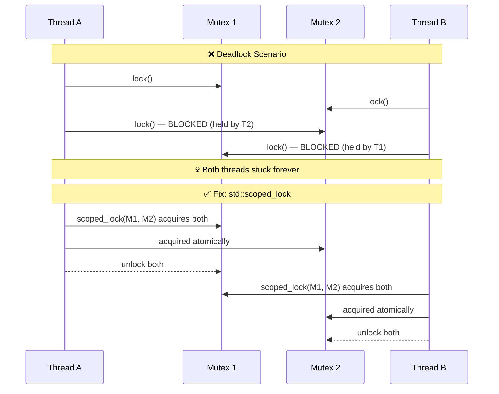
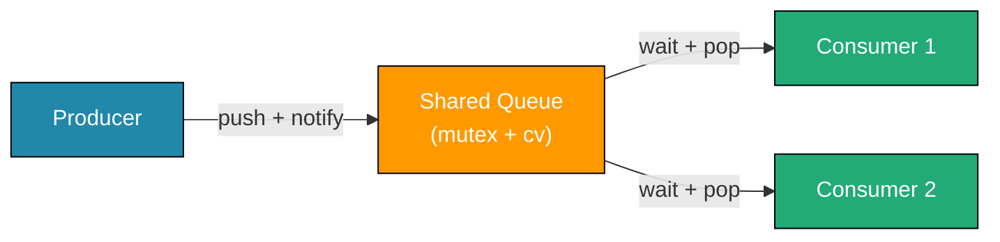

# Chapter 25: Concurrency & Multithreading

**Tags:** `#cpp` `#concurrency` `#multithreading` `#mutex` `#atomic` `#thread` `#jthread` `#synchronization`

---

## Theory

The C++11 standard introduced a portable threading model directly into the language and standard library. Before this, multithreading required platform-specific APIs (pthreads, Win32 threads). The C++ threading model provides `std::thread` for execution, mutexes for mutual exclusion, condition variables for signaling, and atomics for lock-free operations. C++20 added `std::jthread` with cooperative cancellation. Understanding these primitives is essential for writing correct, performant concurrent code.

---

## What — Why — How

| Aspect | Detail |
|--------|--------|
| **What** | Language-level primitives for concurrent execution and synchronization |
| **Why** | Exploit multi-core CPUs, handle I/O overlap, build responsive applications |
| **How** | `std::thread`/`std::jthread`, mutexes, condition variables, atomics, `thread_local` |

---

## 1. `std::thread` — Creating, Joining, Detaching

This example shows the three basic thread operations: creating a thread with a function and arguments, joining it (blocking until it finishes), and detaching it (letting it run independently). Arguments are copied into the thread by default, so passing by reference requires `std::ref`. Always call `join()` or `detach()` before the thread object is destroyed, or the program will terminate.

```cpp
#include <iostream>
#include <thread>
#include <string>

void greet(const std::string& name, int count) {
    for (int i = 0; i < count; ++i)
        std::cout << "Hello, " << name << "! (" << i << ")\n";
}

int main() {
    // Launch a thread — passes arguments by value (copies)
    std::thread t1(greet, "Alice", 3);
    std::thread t2(greet, "Bob", 2);

    // Join: block until thread completes
    t1.join();
    t2.join();

    // Hardware concurrency hint
    std::cout << "Hardware threads: "
              << std::thread::hardware_concurrency() << '\n';

    // Detach example (thread runs independently)
    std::thread t3([]{ /* background work */ });
    t3.detach();  // Caution: no way to join or check completion
    // t3 continues even after main() — must not reference local data
}
```

### Thread with Move Semantics

Since `std::thread` is move-only (it cannot be copied), you can store threads in a `std::vector` by using `emplace_back` or `std::move`. This pattern is useful when you need to launch a dynamic number of worker threads and join them all later.

```cpp
#include <thread>
#include <iostream>
#include <vector>

int main() {
    std::vector<std::thread> workers;
    for (int i = 0; i < 4; ++i) {
        workers.emplace_back([i]{
            std::cout << "Worker " << i << " on thread "
                      << std::this_thread::get_id() << '\n';
        });
    }
    for (auto& w : workers) w.join();
}
```

---

## 2. Mutexes and Locks

### `std::mutex` and `std::lock_guard`

This demonstrates protecting shared data with a mutex. `std::lock_guard` is an RAII wrapper that locks the mutex on construction and automatically unlocks it when the scope ends, even if an exception is thrown. Without this protection, multiple threads incrementing the same counter would cause a data race and unpredictable results.

```cpp
#include <iostream>
#include <thread>
#include <mutex>
#include <vector>

int counter = 0;
std::mutex mtx;

void increment(int times) {
    for (int i = 0; i < times; ++i) {
        std::lock_guard<std::mutex> lock(mtx); // RAII lock
        ++counter;
    } // lock released here
}

int main() {
    std::vector<std::thread> threads;
    for (int i = 0; i < 4; ++i)
        threads.emplace_back(increment, 100000);
    for (auto& t : threads) t.join();

    std::cout << "Counter: " << counter << '\n'; // Always 400000
}
```

### `std::unique_lock` — Flexible Locking

Unlike `lock_guard`, `unique_lock` lets you manually unlock and re-lock the mutex within the same scope. This is essential when you need to release the lock during a non-critical section (to reduce contention) and re-acquire it later. It is also the only lock type accepted by `std::condition_variable::wait()`.

```cpp
#include <mutex>
#include <thread>
#include <iostream>

std::mutex mtx;

void flexible_work() {
    std::unique_lock<std::mutex> lock(mtx);
    // ... critical section ...
    lock.unlock();  // Can unlock early
    // ... non-critical work ...
    lock.lock();    // Re-acquire
    // ... another critical section ...
} // auto-released on destruction
```

### `std::scoped_lock` (C++17) — Deadlock-Free Multi-Lock

When you need to lock two or more mutexes at once, `std::scoped_lock` acquires them all atomically using a deadlock-avoidance algorithm. This eliminates the classic deadlock caused by different threads locking the same mutexes in different orders.

```cpp
#include <mutex>
#include <thread>
#include <iostream>

std::mutex mtx_a, mtx_b;

void transfer() {
    // Locks both mutexes atomically — no deadlock risk
    std::scoped_lock lock(mtx_a, mtx_b);
    // ... safe to access resources guarded by both mutexes ...
    std::cout << "Transfer complete\n";
}
```

---

## 3. `std::condition_variable` — Producer-Consumer

This implements the classic producer-consumer pattern. The producer pushes tasks into a shared queue and calls `notify_one()` to wake a sleeping consumer. Consumers use `cv.wait(lock, predicate)` to efficiently sleep until data is available, which also guards against spurious wakeups. A `done` flag signals consumers to exit when the producer is finished.

```cpp
#include <iostream>
#include <thread>
#include <mutex>
#include <condition_variable>
#include <queue>
#include <string>

std::mutex mtx;
std::condition_variable cv;
std::queue<std::string> task_queue;
bool done = false;

void producer() {
    for (int i = 0; i < 5; ++i) {
        {
            std::lock_guard<std::mutex> lock(mtx);
            task_queue.push("Task-" + std::to_string(i));
            std::cout << "[Producer] Enqueued Task-" << i << '\n';
        }
        cv.notify_one(); // Wake one waiting consumer
        std::this_thread::sleep_for(std::chrono::milliseconds(100));
    }
    {
        std::lock_guard<std::mutex> lock(mtx);
        done = true;
    }
    cv.notify_all(); // Wake all consumers to check done flag
}

void consumer(int id) {
    while (true) {
        std::unique_lock<std::mutex> lock(mtx);
        cv.wait(lock, []{ return !task_queue.empty() || done; });

        if (task_queue.empty() && done) break;

        std::string task = task_queue.front();
        task_queue.pop();
        lock.unlock();

        std::cout << "[Consumer " << id << "] Processing " << task << '\n';
    }
}

int main() {
    std::thread prod(producer);
    std::thread con1(consumer, 1);
    std::thread con2(consumer, 2);

    prod.join();
    con1.join();
    con2.join();
}
```

---

## 4. `std::atomic` — Lock-Free Operations

`std::atomic` provides thread-safe operations on simple types without needing a mutex, making it faster for things like counters and flags. The `fetch_add` operation is a single hardware instruction that atomically reads, increments, and writes. This example also shows `std::atomic_flag` used as a simple spinlock — the most basic synchronization primitive.

```cpp
#include <iostream>
#include <thread>
#include <atomic>
#include <vector>

std::atomic<int> atomic_counter{0};

void atomic_increment(int times) {
    for (int i = 0; i < times; ++i) {
        atomic_counter.fetch_add(1, std::memory_order_relaxed);
    }
}

int main() {
    std::vector<std::thread> threads;
    for (int i = 0; i < 4; ++i)
        threads.emplace_back(atomic_increment, 100000);
    for (auto& t : threads) t.join();

    std::cout << "Atomic counter: " << atomic_counter.load() << '\n';
    // Always 400000 — no mutex needed

    // Atomic flag as a simple spinlock
    std::atomic_flag spin = ATOMIC_FLAG_INIT;

    auto try_lock = [&]{
        while (spin.test_and_set(std::memory_order_acquire))
            ; // spin
        // critical section
        std::cout << "Thread " << std::this_thread::get_id() << " in CS\n";
        spin.clear(std::memory_order_release);
    };

    std::thread t1(try_lock);
    std::thread t2(try_lock);
    t1.join();
    t2.join();
}
```

---

## 5. Thread Safety: Race Conditions & Deadlocks

### Race Condition Example

This code deliberately shows a data race: two threads increment the same unprotected variable. The `++shared` operation is actually three steps (read, add, write) that can interleave between threads, producing unpredictable results. In C++, this is not just a bug — it is **undefined behavior**.

```cpp
#include <thread>
#include <iostream>

int shared = 0; // NOT atomic, NOT protected

void unsafe_increment() {
    for (int i = 0; i < 100000; ++i)
        ++shared; // DATA RACE: read-modify-write is not atomic
}

int main() {
    std::thread t1(unsafe_increment);
    std::thread t2(unsafe_increment);
    t1.join(); t2.join();
    // Result is UNPREDICTABLE — undefined behavior
    std::cout << "shared = " << shared << '\n';
}
```

### Deadlock Example and Prevention

This shows how deadlock occurs when two threads lock the same pair of mutexes in opposite order — each holds one lock and waits forever for the other. The fix uses `std::scoped_lock`, which acquires both mutexes atomically regardless of call order, making deadlock impossible.

```cpp
#include <mutex>
#include <thread>
#include <iostream>

std::mutex m1, m2;

// DEADLOCK-PRONE: different lock ordering
void thread_a() {
    std::lock_guard<std::mutex> lock1(m1); // locks m1
    std::this_thread::sleep_for(std::chrono::milliseconds(1));
    std::lock_guard<std::mutex> lock2(m2); // waits for m2 — held by thread_b
}

void thread_b() {
    std::lock_guard<std::mutex> lock1(m2); // locks m2
    std::this_thread::sleep_for(std::chrono::milliseconds(1));
    std::lock_guard<std::mutex> lock2(m1); // waits for m1 — held by thread_a
}

// FIX: use std::scoped_lock
void thread_a_fixed() {
    std::scoped_lock lock(m1, m2); // atomic acquisition — no deadlock
    std::cout << "Thread A: got both locks\n";
}

void thread_b_fixed() {
    std::scoped_lock lock(m1, m2);
    std::cout << "Thread B: got both locks\n";
}
```

---

## 6. `std::jthread` (C++20) — Auto-Joining & Stop Tokens

`std::jthread` improves on `std::thread` in two ways: it automatically joins in its destructor (so you can never forget), and it passes a `std::stop_token` to the worker function for cooperative cancellation. The worker checks `stoken.stop_requested()` in its loop and exits cleanly when stop is requested — no need for a separate `done` flag.

```cpp
#include <iostream>
#include <thread>
#include <chrono>

void worker(std::stop_token stoken, int id) {
    while (!stoken.stop_requested()) {
        std::cout << "Worker " << id << " running...\n";
        std::this_thread::sleep_for(std::chrono::milliseconds(200));
    }
    std::cout << "Worker " << id << " stopped gracefully.\n";
}

int main() {
    std::jthread j1(worker, 1);
    std::jthread j2(worker, 2);

    std::this_thread::sleep_for(std::chrono::seconds(1));

    // Request stop — cooperative cancellation
    j1.request_stop();
    j2.request_stop();

    // No need to call join() — jthread destructor does it
    std::cout << "Main: requested stop, waiting for auto-join...\n";
}
```

### Stop Callback

A `std::stop_callback` registers a function that runs automatically when stop is requested on the associated token. This is useful for cleanup actions or logging. The callback fires on the thread that calls `request_stop()`, not the worker thread.

```cpp
#include <iostream>
#include <thread>
#include <chrono>

int main() {
    std::jthread jt([](std::stop_token st) {
        std::stop_callback cb(st, []{
            std::cout << "Stop callback fired!\n";
        });
        while (!st.stop_requested()) {
            std::this_thread::sleep_for(std::chrono::milliseconds(100));
        }
    });

    std::this_thread::sleep_for(std::chrono::milliseconds(500));
    jt.request_stop();  // Triggers the callback, then the loop exits
}
```

---

## 7. Thread-Local Storage

The `thread_local` keyword gives each thread its own independent copy of a variable, so no synchronization is needed. Each thread increments its own private counter to 1000, while the main thread's copy stays at 0. This is useful for per-thread caches, error codes, or scratch buffers.

```cpp
#include <iostream>
#include <thread>
#include <vector>

thread_local int tls_counter = 0;

void work(int id) {
    for (int i = 0; i < 1000; ++i)
        ++tls_counter; // Each thread has its own copy
    std::cout << "Thread " << id << " tls_counter = " << tls_counter << '\n';
}

int main() {
    std::vector<std::thread> threads;
    for (int i = 0; i < 4; ++i)
        threads.emplace_back(work, i);
    for (auto& t : threads) t.join();
    // Each thread prints 1000 — independent copies
    std::cout << "Main tls_counter = " << tls_counter << '\n'; // 0
}
```

---

## Mermaid Diagram: Thread Lifecycle

```mermaid
stateDiagram-v2
    [*] --> Created : std::thread(fn)
    Created --> Running : OS schedules
    Running --> Blocked : wait / lock / sleep
    Blocked --> Running : notify / unlock / timeout
    Running --> Completed : function returns
    Completed --> Joined : t.join()
    Completed --> Detached : t.detach()
    Joined --> [*]
    Detached --> [*]
```

## Mermaid Diagram: Lock Interactions & Deadlock



## Mermaid Diagram: Producer-Consumer Flow



---

## Exercises

### 🟢 Beginner
1. Create 4 threads that each print their thread ID. Join all of them.
2. Use `std::mutex` and `std::lock_guard` to protect a shared `std::vector` while 3 threads push elements.

### 🟡 Intermediate
3. Implement a thread-safe counter class using `std::atomic<int>` with `increment()`, `decrement()`, and `get()`.
4. Build a producer-consumer system with 1 producer and 3 consumers using `std::condition_variable`.

### 🔴 Advanced
5. Implement a reader-writer lock using `std::shared_mutex` that allows concurrent readers but exclusive writers.
6. Rewrite the producer-consumer using `std::jthread` with stop tokens for graceful shutdown.

---

## Solutions

### Solution 1 — Thread IDs

This solution creates 4 threads using a loop, stores them in a vector, and has each one print its index and unique thread ID. All threads are joined at the end to ensure they complete before the program exits.

```cpp
#include <iostream>
#include <thread>
#include <vector>

int main() {
    std::vector<std::thread> threads;
    for (int i = 0; i < 4; ++i) {
        threads.emplace_back([i]{
            std::cout << "Thread " << i << " id: "
                      << std::this_thread::get_id() << '\n';
        });
    }
    for (auto& t : threads) t.join();
}
```

### Solution 3 — Atomic Counter Class

This wraps `std::atomic<int>` in a class with `increment()`, `decrement()`, and `get()` methods. Using `memory_order_relaxed` is safe here because we only need atomicity for a single counter — no ordering guarantees between different variables are required. Eight threads each increment 10,000 times, and the final count is always exactly 80,000.

```cpp
#include <iostream>
#include <thread>
#include <atomic>
#include <vector>

class AtomicCounter {
    std::atomic<int> count_{0};
public:
    void increment() { count_.fetch_add(1, std::memory_order_relaxed); }
    void decrement() { count_.fetch_sub(1, std::memory_order_relaxed); }
    int get() const  { return count_.load(std::memory_order_relaxed); }
};

int main() {
    AtomicCounter counter;
    std::vector<std::thread> threads;
    for (int i = 0; i < 8; ++i)
        threads.emplace_back([&counter]{
            for (int j = 0; j < 10000; ++j) counter.increment();
        });
    for (auto& t : threads) t.join();
    std::cout << "Final count: " << counter.get() << '\n'; // 80000
}
```

---

## Quiz

**Q1.** What happens if you destroy a `std::thread` without joining or detaching?
a) The thread is cancelled
b) `std::terminate()` is called ✅
c) The thread continues running safely
d) A compile-time error

**Q2.** `std::scoped_lock` prevents deadlocks by:
a) Using a timeout
b) Locking mutexes in a deterministic order atomically ✅
c) Trying each mutex one at a time
d) Using spinlocks internally

**Q3.** What is a spurious wakeup?
a) A condition variable unblocks without notify being called ✅
b) A thread wakes up after the deadline
c) An atomic operation failing
d) A deadlock situation

**Q4.** `std::jthread` differs from `std::thread` in that it:
a) Is faster
b) Automatically joins on destruction and supports stop tokens ✅
c) Uses coroutines internally
d) Cannot be moved

**Q5.** `thread_local` variables are:
a) Shared between all threads
b) Each thread gets its own independent copy ✅
c) Only accessible from the main thread
d) Stored in atomic memory

**Q6.** Which memory order is the default for `std::atomic` operations?
a) `memory_order_relaxed`
b) `memory_order_acquire`
c) `memory_order_seq_cst` ✅
d) `memory_order_release`

**Q7.** A data race in C++ is:
a) A performance issue
b) Undefined behavior ✅
c) An exception that can be caught
d) A compile-time warning

---

## Key Takeaways

- **`std::thread`** creates OS threads; always join or detach before destruction
- **`std::lock_guard`** / **`std::scoped_lock`** provide RAII mutex management
- **`std::condition_variable`** enables efficient wait/notify patterns (always use with a predicate)
- **`std::atomic`** provides lock-free operations for simple shared state
- **`std::jthread`** (C++20) auto-joins and supports cooperative cancellation
- **`thread_local`** gives each thread independent variable copies
- Data races are **undefined behavior** — not just bugs, but UB

---

## Chapter Summary

C++ concurrency starts with `std::thread` for creating execution threads and mutexes for protecting shared state. `std::lock_guard` and `std::scoped_lock` provide RAII-based locking that prevents forgetting to unlock. Condition variables enable efficient producer-consumer patterns. Atomics allow lock-free updates for simple counters and flags. C++20's `std::jthread` eliminates the join-or-terminate footgun and adds cooperative cancellation via stop tokens. Thread-local storage gives each thread private state. The cardinal rule: every access to shared mutable state must be synchronized—either through mutexes, atomics, or by design.

---

## Real-World Insight

> Game engines typically use a job system built atop a thread pool—not raw `std::thread` per task. Database engines use reader-writer locks (`std::shared_mutex`) to allow concurrent reads. High-frequency trading systems use lock-free queues built on atomics. Web servers use thread pools with condition variables for request handling. The trend in modern C++ is toward higher-level abstractions (`std::async`, executors, coroutines) rather than raw thread management, but understanding the primitives remains essential for debugging and performance tuning.

---

## Common Mistakes

| Mistake | Why It's Wrong | Fix |
|---------|---------------|-----|
| Forgetting to `join()` or `detach()` | `std::terminate()` on thread destruction | Use `std::jthread` or always join |
| Locking mutexes in different orders | Deadlock | Use `std::scoped_lock` or enforce ordering |
| `cv.wait()` without a predicate | Spurious wakeup causes logic error | Always use `cv.wait(lock, predicate)` |
| Passing references to `std::thread` constructor | Copies by default — ref becomes dangling | Use `std::ref()` or capture in lambda |
| Using `std::atomic` for compound operations | `if (a.load()) a.store(...)` is not atomic | Use `compare_exchange` or a mutex |

---

## Interview Questions

**Q1. Explain the difference between `std::lock_guard`, `std::unique_lock`, and `std::scoped_lock`.**

> `lock_guard` is the simplest RAII wrapper—locks on construction, unlocks on destruction, non-movable. `unique_lock` adds flexibility: deferred locking, early unlock, re-lock, and is movable (needed for condition variables). `scoped_lock` (C++17) can lock multiple mutexes simultaneously using a deadlock-avoidance algorithm, replacing the `std::lock()` + `std::lock_guard(adopt_lock)` pattern.

**Q2. What is a data race and how does it differ from a race condition?**

> A data race is when two threads access the same memory location, at least one writes, and there is no synchronization—this is **undefined behavior** in C++. A race condition is a logical bug where the outcome depends on timing (e.g., check-then-act). A race condition may exist even with proper synchronization (no UB) if the logic is wrong.

**Q3. How does `std::jthread` improve upon `std::thread`?**

> `jthread` automatically joins in its destructor (no `std::terminate` risk), passes a `std::stop_token` as the first argument to the callable for cooperative cancellation, and provides `request_stop()` for clean shutdown. It eliminates the most common `std::thread` bugs.

**Q4. When would you use `std::atomic` vs a mutex?**

> Use atomics for simple types (counters, flags, pointers) where the operation is a single read-modify-write. Use mutexes when you need to protect a compound operation (multiple variables, a container, or a sequence of steps that must be atomic). Atomics are faster (no kernel transition) but limited in what they can protect.

**Q5. Describe the producer-consumer pattern and how condition variables enable it.**

> A producer adds items to a shared queue; consumers remove and process them. A condition variable lets consumers sleep efficiently until data is available. The producer locks the mutex, pushes data, unlocks, and calls `notify_one()`. Consumers call `cv.wait(lock, predicate)` which atomically unlocks and sleeps until notified, then re-locks and checks the predicate to handle spurious wakeups.
