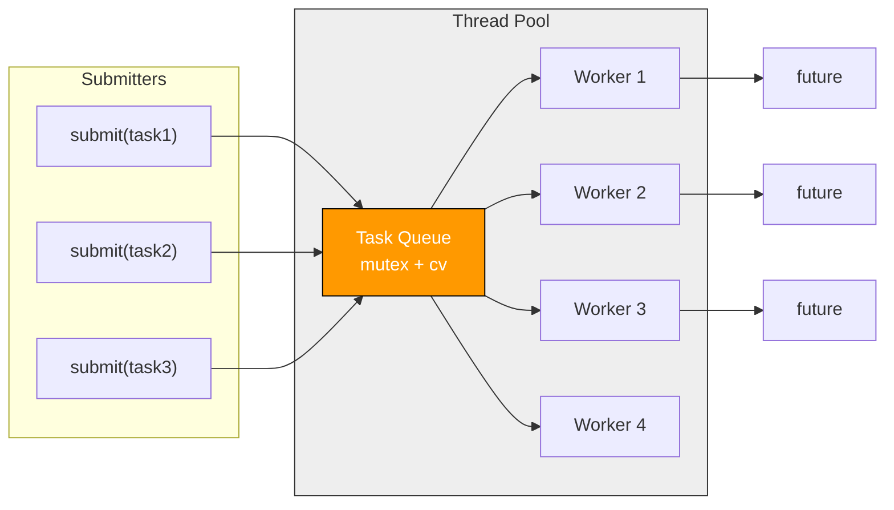
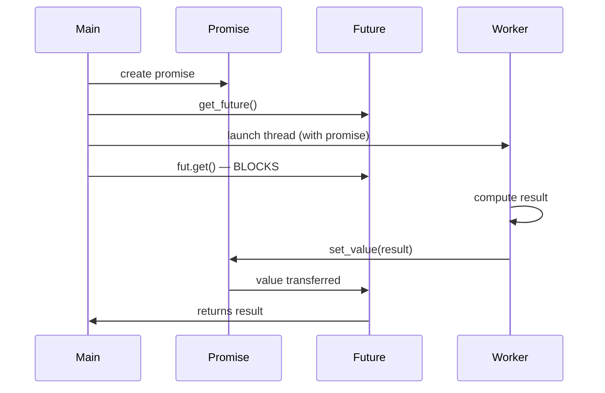

# Chapter 26: Async & Parallel Patterns

**Tags:** `#cpp` `#async` `#future` `#promise` `#threadpool` `#parallel-algorithms` `#coroutines` `#concurrency`

---

## Theory

While Chapter 25 covered raw thread management, real-world concurrent code uses **higher-level abstractions**: futures and promises for result propagation, async for fire-and-forget tasks, thread pools for amortizing thread creation cost, and parallel algorithms for data-parallel work. C++20 introduced coroutines as a language-level mechanism for asynchronous flows. These patterns compose into scalable architectures—from web servers to scientific computing.

---

## What — Why — How

| Aspect | Detail |
|--------|--------|
| **What** | High-level patterns for asynchronous and parallel execution |
| **Why** | Cleaner code than raw threads, automatic result propagation, scalable parallelism |
| **How** | `std::async`, `std::future`/`std::promise`, thread pools, parallel STL, coroutines |

---

## 1. `std::async` — Launch Policies

`std::async` is the simplest way to run a function concurrently and get its result back via a `std::future`. With `std::launch::async`, the function runs immediately on a new thread. With `std::launch::deferred`, it runs lazily only when you call `.get()`. The default policy lets the implementation decide. Calling `.get()` blocks until the result is ready and returns the value.

```cpp
#include <iostream>
#include <future>
#include <chrono>
#include <cmath>

double heavy_computation(double x) {
    std::this_thread::sleep_for(std::chrono::milliseconds(500));
    return std::sqrt(x * x + 1.0);
}

int main() {
    auto start = std::chrono::steady_clock::now();

    // std::launch::async — guaranteed new thread
    auto fut1 = std::async(std::launch::async, heavy_computation, 3.0);

    // std::launch::deferred — runs on .get() call (lazy)
    auto fut2 = std::async(std::launch::deferred, heavy_computation, 4.0);

    // Default — implementation chooses
    auto fut3 = std::async(heavy_computation, 5.0);

    // fut1 is running concurrently right now
    std::cout << "Doing other work...\n";

    // .get() blocks until result is ready
    double r1 = fut1.get();
    double r2 = fut2.get();  // Executes NOW (deferred)
    double r3 = fut3.get();

    auto elapsed = std::chrono::steady_clock::now() - start;
    auto ms = std::chrono::duration_cast<std::chrono::milliseconds>(elapsed);

    std::cout << "Results: " << r1 << ", " << r2 << ", " << r3 << '\n';
    std::cout << "Elapsed: " << ms.count() << " ms\n";
    // ~1000ms (not 1500ms) because fut1 and fut3 ran in parallel
}
```

### Exception Propagation

If an async task throws an exception, it is captured and re-thrown when you call `.get()` on the future. This lets the calling thread handle errors from worker threads using standard try-catch, without needing to pass error codes through shared state.

```cpp
#include <future>
#include <iostream>
#include <stdexcept>

int risky_task(int x) {
    if (x < 0) throw std::invalid_argument("negative input");
    return x * 2;
}

int main() {
    auto fut = std::async(std::launch::async, risky_task, -5);
    try {
        int result = fut.get(); // Re-throws the exception
    } catch (const std::invalid_argument& e) {
        std::cout << "Caught: " << e.what() << '\n';
    }
}
```

---

## 2. `std::future`, `std::promise`, `std::shared_future`

### Promise-Future Channel

A `std::promise` and `std::future` form a one-shot communication channel between threads. The producer thread calls `set_value()` on the promise, and the consumer thread calls `.get()` on the future to receive it. This decouples the threads — the consumer blocks until the value is ready, without polling or shared variables.

```cpp
#include <iostream>
#include <future>
#include <thread>
#include <string>

int main() {
    std::promise<std::string> prom;
    std::future<std::string> fut = prom.get_future();

    // Producer thread sets the value
    std::thread producer([&prom]{
        std::this_thread::sleep_for(std::chrono::milliseconds(300));
        prom.set_value("Hello from producer!");
    });

    // Consumer blocks until value is available
    std::cout << "Waiting for result...\n";
    std::string result = fut.get();
    std::cout << "Got: " << result << '\n';

    producer.join();
}
```

### `std::shared_future` — Multiple Consumers

Unlike `std::future` (which can only be read once), `std::shared_future` lets multiple threads each call `.get()` on the same result. Create it by calling `.share()` on a regular future. This is useful when several consumers need the same computed value — all of them block until the producer sets it, then all receive the same result.

```cpp
#include <iostream>
#include <future>
#include <thread>
#include <vector>

int main() {
    std::promise<int> prom;
    std::shared_future<int> sfut = prom.get_future().share();

    std::vector<std::thread> consumers;
    for (int i = 0; i < 3; ++i) {
        consumers.emplace_back([sfut, i]{
            int val = sfut.get(); // All three can call .get()
            std::cout << "Consumer " << i << " got: " << val << '\n';
        });
    }

    prom.set_value(42);
    for (auto& t : consumers) t.join();
}
```

---

## 3. `std::packaged_task`

Wraps a callable so its return value is captured in a `std::future`.

```cpp
#include <iostream>
#include <future>
#include <functional>
#include <thread>
#include <vector>
#include <numeric>

int sum_range(const std::vector<int>& v, int lo, int hi) {
    return std::accumulate(v.begin() + lo, v.begin() + hi, 0);
}

int main() {
    std::vector<int> data(1000);
    std::iota(data.begin(), data.end(), 1); // 1..1000

    // Package tasks
    std::packaged_task<int(const std::vector<int>&, int, int)>
        task1(sum_range), task2(sum_range);

    auto f1 = task1.get_future();
    auto f2 = task2.get_future();

    // Move tasks into threads
    std::thread t1(std::move(task1), std::cref(data), 0, 500);
    std::thread t2(std::move(task2), std::cref(data), 500, 1000);

    int total = f1.get() + f2.get();
    std::cout << "Total sum: " << total << '\n';  // 500500

    t1.join();
    t2.join();
}
```

---

## 4. Thread Pool Pattern

A thread pool creates a fixed number of worker threads upfront and reuses them for many tasks, avoiding the overhead of creating and destroying threads for each job. Tasks are submitted to a shared queue protected by a mutex and condition variable. Each worker sleeps until a task is available, executes it, then goes back to waiting. The `submit()` method returns a `std::future` so callers can retrieve results.

```cpp
#include <iostream>
#include <vector>
#include <queue>
#include <thread>
#include <mutex>
#include <condition_variable>
#include <functional>
#include <future>
#include <type_traits>

class ThreadPool {
    std::vector<std::thread> workers_;
    std::queue<std::function<void()>> tasks_;
    std::mutex mtx_;
    std::condition_variable cv_;
    bool stop_ = false;

public:
    explicit ThreadPool(size_t num_threads) {
        for (size_t i = 0; i < num_threads; ++i) {
            workers_.emplace_back([this]{
                while (true) {
                    std::function<void()> task;
                    {
                        std::unique_lock lock(mtx_);
                        cv_.wait(lock, [this]{ return stop_ || !tasks_.empty(); });
                        if (stop_ && tasks_.empty()) return;
                        task = std::move(tasks_.front());
                        tasks_.pop();
                    }
                    task();
                }
            });
        }
    }

    // Submit a task and get a future for the result
    template <typename F, typename... Args>
    auto submit(F&& f, Args&&... args) -> std::future<std::invoke_result_t<F, Args...>> {
        using ReturnType = std::invoke_result_t<F, Args...>;
        auto task = std::make_shared<std::packaged_task<ReturnType()>>(
            std::bind(std::forward<F>(f), std::forward<Args>(args)...)
        );
        auto fut = task->get_future();
        {
            std::lock_guard lock(mtx_);
            tasks_.push([task]{ (*task)(); });
        }
        cv_.notify_one();
        return fut;
    }

    ~ThreadPool() {
        {
            std::lock_guard lock(mtx_);
            stop_ = true;
        }
        cv_.notify_all();
        for (auto& w : workers_) w.join();
    }
};

int main() {
    ThreadPool pool(4);

    std::vector<std::future<int>> results;
    for (int i = 0; i < 8; ++i) {
        results.push_back(pool.submit([i]{
            std::this_thread::sleep_for(std::chrono::milliseconds(100));
            return i * i;
        }));
    }

    for (int i = 0; i < 8; ++i)
        std::cout << "Task " << i << " result: " << results[i].get() << '\n';
}
```

---

## 5. Producer-Consumer with Bounded Buffer

This implements a thread-safe bounded buffer (fixed-capacity queue) using two condition variables: `not_full_` blocks the producer when the buffer is at capacity, and `not_empty_` blocks consumers when the buffer is empty. The `close()` method signals all threads to stop. Using `std::optional` for the return type lets consumers distinguish between a valid item and a "no more data" signal.

```cpp
#include <iostream>
#include <thread>
#include <mutex>
#include <condition_variable>
#include <queue>
#include <vector>
#include <optional>

template <typename T, size_t MaxSize = 16>
class BoundedBuffer {
    std::queue<T> queue_;
    std::mutex mtx_;
    std::condition_variable not_full_;
    std::condition_variable not_empty_;
    bool closed_ = false;

public:
    void push(T item) {
        std::unique_lock lock(mtx_);
        not_full_.wait(lock, [this]{ return queue_.size() < MaxSize || closed_; });
        if (closed_) return;
        queue_.push(std::move(item));
        not_empty_.notify_one();
    }

    std::optional<T> pop() {
        std::unique_lock lock(mtx_);
        not_empty_.wait(lock, [this]{ return !queue_.empty() || closed_; });
        if (queue_.empty()) return std::nullopt;
        T item = std::move(queue_.front());
        queue_.pop();
        not_full_.notify_one();
        return item;
    }

    void close() {
        std::lock_guard lock(mtx_);
        closed_ = true;
        not_full_.notify_all();
        not_empty_.notify_all();
    }
};

int main() {
    BoundedBuffer<int, 4> buffer;

    std::thread producer([&]{
        for (int i = 0; i < 20; ++i) {
            buffer.push(i);
            std::cout << "Produced: " << i << '\n';
        }
        buffer.close();
    });

    std::vector<std::thread> consumers;
    for (int c = 0; c < 3; ++c) {
        consumers.emplace_back([&buffer, c]{
            while (auto item = buffer.pop()) {
                std::cout << "Consumer " << c << " got: " << *item << '\n';
            }
        });
    }

    producer.join();
    for (auto& t : consumers) t.join();
}
```

---

## 6. Fork-Join Parallelism

Fork-join divides a large task into halves recursively: the left half is "forked" to a new async thread while the right half runs on the current thread. When both finish, results are "joined" (combined). A threshold stops recursion for small inputs and uses sequential `std::accumulate` instead. This pattern maps naturally to divide-and-conquer algorithms like parallel reduce.

```cpp
#include <iostream>
#include <future>
#include <vector>
#include <numeric>
#include <cstddef>

// Parallel reduce using fork-join
template <typename Iter, typename T, typename BinOp>
T parallel_reduce(Iter begin, Iter end, T init, BinOp op, size_t threshold = 10000) {
    auto len = std::distance(begin, end);
    if (static_cast<size_t>(len) <= threshold)
        return std::accumulate(begin, end, init, op);

    auto mid = begin;
    std::advance(mid, len / 2);

    // Fork: launch left half asynchronously
    auto left_future = std::async(std::launch::async,
        parallel_reduce<Iter, T, BinOp>, begin, mid, init, op, threshold);

    // Process right half in current thread
    T right_result = parallel_reduce(mid, end, init, op, threshold);

    // Join: combine results
    return op(left_future.get(), right_result);
}

int main() {
    std::vector<long long> data(1'000'000);
    std::iota(data.begin(), data.end(), 1LL);

    long long result = parallel_reduce(
        data.begin(), data.end(), 0LL, std::plus<long long>{});

    std::cout << "Sum: " << result << '\n'; // 500000500000
}
```

---

## 7. Parallel Algorithms (C++17)

C++17 lets you parallelize standard algorithms just by adding an execution policy as the first argument. `std::execution::seq` runs sequentially, `par` runs across multiple threads, and `par_unseq` allows both threading and SIMD vectorization. This example compares sequential vs parallel sort on 10 million elements, and demonstrates `std::reduce` and `std::transform_reduce` for parallel aggregation.

```cpp
#include <iostream>
#include <vector>
#include <algorithm>
#include <execution>
#include <numeric>
#include <chrono>

int main() {
    const size_t N = 10'000'000;
    std::vector<double> data(N);
    std::iota(data.begin(), data.end(), 1.0);

    // Sequential
    auto t1 = std::chrono::steady_clock::now();
    std::sort(std::execution::seq, data.begin(), data.end(), std::greater{});
    auto t2 = std::chrono::steady_clock::now();

    // Re-shuffle
    std::iota(data.begin(), data.end(), 1.0);

    // Parallel
    auto t3 = std::chrono::steady_clock::now();
    std::sort(std::execution::par, data.begin(), data.end(), std::greater{});
    auto t4 = std::chrono::steady_clock::now();

    auto seq_ms = std::chrono::duration_cast<std::chrono::milliseconds>(t2 - t1);
    auto par_ms = std::chrono::duration_cast<std::chrono::milliseconds>(t4 - t3);

    std::cout << "Sequential: " << seq_ms.count() << " ms\n";
    std::cout << "Parallel:   " << par_ms.count() << " ms\n";

    // Parallel reduce
    double sum = std::reduce(std::execution::par_unseq,
                             data.begin(), data.end(), 0.0);
    std::cout << "Sum: " << sum << '\n';

    // Parallel transform-reduce (dot product)
    std::vector<double> a(N, 2.0), b(N, 3.0);
    double dot = std::transform_reduce(std::execution::par,
        a.begin(), a.end(), b.begin(), 0.0);
    std::cout << "Dot product: " << dot << '\n'; // 6e7
}
```

### Execution Policies

| Policy | Header | Behavior |
|--------|--------|----------|
| `std::execution::seq` | `<execution>` | Sequential — same as no policy |
| `std::execution::par` | `<execution>` | Parallel — multiple threads, no vectorization guarantee |
| `std::execution::par_unseq` | `<execution>` | Parallel + vectorized — no mutex, no allocation in body |
| `std::execution::unseq` (C++20) | `<execution>` | Vectorized only — SIMD within single thread |

---

## 8. Coroutines Preview (C++20)

### `co_yield` — Generator

This builds a lazy generator using C++20 coroutines. The `Generator<T>` type defines a `promise_type` that the compiler uses to manage coroutine state. Each `co_yield` suspends the coroutine and produces a value; calling `next()` resumes it to produce the next one. The Fibonacci example generates values on demand without computing the entire sequence upfront — ideal for potentially infinite sequences.

```cpp
#include <coroutine>
#include <iostream>
#include <cstdint>

template <typename T>
struct Generator {
    struct promise_type {
        T current_value;
        Generator get_return_object() {
            return Generator{std::coroutine_handle<promise_type>::from_promise(*this)};
        }
        std::suspend_always initial_suspend() { return {}; }
        std::suspend_always final_suspend() noexcept { return {}; }
        std::suspend_always yield_value(T value) {
            current_value = value;
            return {};
        }
        void return_void() {}
        void unhandled_exception() { std::terminate(); }
    };

    std::coroutine_handle<promise_type> handle_;

    explicit Generator(std::coroutine_handle<promise_type> h) : handle_(h) {}
    ~Generator() { if (handle_) handle_.destroy(); }

    // Move-only
    Generator(Generator&& o) noexcept : handle_(o.handle_) { o.handle_ = nullptr; }
    Generator& operator=(Generator&&) = delete;
    Generator(const Generator&) = delete;

    bool next() {
        handle_.resume();
        return !handle_.done();
    }
    T value() const { return handle_.promise().current_value; }
};

Generator<std::uint64_t> fibonacci() {
    std::uint64_t a = 0, b = 1;
    while (true) {
        co_yield a;
        auto tmp = a + b;
        a = b;
        b = tmp;
    }
}

int main() {
    auto gen = fibonacci();
    for (int i = 0; i < 15 && gen.next(); ++i) {
        std::cout << gen.value() << ' ';
    }
    std::cout << '\n';
    // 0 1 1 2 3 5 8 13 21 34 55 89 144 233 377
}
```

### Coroutine Keywords

| Keyword | Purpose |
|---------|---------|
| `co_await` | Suspend until an awaitable completes |
| `co_yield` | Suspend and produce a value (generator pattern) |
| `co_return` | Complete the coroutine, optionally with a value |

---

## Mermaid Diagram: Async Execution Timeline

```mermaid
gantt
    title Async Execution Timeline
    dateFormat X
    axisFormat %s

    section Main Thread
    Launch tasks       :a1, 0, 1
    Other work         :a2, 1, 3
    Collect results    :a3, 5, 6

    section Worker 1
    Task A (async)     :b1, 1, 4

    section Worker 2
    Task B (async)     :b2, 1, 5

    section Worker 3
    Task C (deferred)  :b3, 5, 6
```



## Mermaid Diagram: Thread Pool Architecture



## Mermaid Diagram: Promise-Future Channel



---

## Exercises

### 🟢 Beginner
1. Use `std::async` to compute `factorial(15)` and `fibonacci(30)` in parallel. Print both results.
2. Create a `std::promise<std::string>` and set its value from a separate thread.

### 🟡 Intermediate
3. Implement a parallel `map()` function that applies a transformation to each element of a vector using the thread pool.
4. Use `std::execution::par` to sort a vector of 1 million integers and compare against sequential sort.

### 🔴 Advanced
5. Extend the thread pool to support task priorities (high, medium, low) using a priority queue.
6. Write a coroutine-based generator that produces an infinite sequence of prime numbers.

---

## Solutions

### Solution 1 — Parallel Async Computation

This solution launches `factorial(15)` and `fibonacci(30)` on separate threads using `std::async`, so both computations run concurrently. Calling `.get()` on each future retrieves the result, blocking only if the computation hasn't finished yet.

```cpp
#include <iostream>
#include <future>

long long factorial(int n) {
    long long r = 1;
    for (int i = 2; i <= n; ++i) r *= i;
    return r;
}

long long fibonacci(int n) {
    if (n <= 1) return n;
    long long a = 0, b = 1;
    for (int i = 2; i <= n; ++i) { auto t = a + b; a = b; b = t; }
    return b;
}

int main() {
    auto f1 = std::async(std::launch::async, factorial, 15);
    auto f2 = std::async(std::launch::async, fibonacci, 30);
    std::cout << "15! = " << f1.get() << '\n';        // 1307674368000
    std::cout << "fib(30) = " << f2.get() << '\n';    // 832040
}
```

### Solution 2 — Promise from Thread

This creates a promise-future pair, moves the promise into a worker thread that sets a string value, and the main thread blocks on `fut.get()` until the value arrives. This demonstrates the simplest form of one-shot inter-thread communication.

```cpp
#include <iostream>
#include <future>
#include <thread>
#include <string>

int main() {
    std::promise<std::string> prom;
    auto fut = prom.get_future();

    std::thread t([&prom]{
        prom.set_value("Result from worker thread");
    });

    std::cout << fut.get() << '\n';
    t.join();
}
```

---

## Quiz

**Q1.** What happens if you call `.get()` on a `std::future` twice?
a) Returns the cached result
b) Throws `std::future_error` ✅
c) Blocks indefinitely
d) Returns a default value

**Q2.** `std::launch::deferred` means the task:
a) Runs immediately on a new thread
b) Runs when `.get()` or `.wait()` is called ✅
c) Is cancelled
d) Runs on a thread pool

**Q3.** `std::shared_future` differs from `std::future` in that:
a) It's faster
b) Multiple threads can call `.get()` on the same result ✅
c) It supports cancellation
d) It uses coroutines

**Q4.** `std::execution::par_unseq` requires the callable to:
a) Be a pure function with no locks or allocations ✅
b) Return void
c) Be a lambda
d) Take exactly one parameter

**Q5.** Which C++20 keyword turns a function into a coroutine?
a) `async`
b) `co_await`, `co_yield`, or `co_return` ✅
c) `coroutine`
d) `yield`

**Q6.** A thread pool's main advantage over `std::async` is:
a) Type safety
b) Amortizing thread creation/destruction cost ✅
c) Compile-time dispatch
d) No mutex needed

**Q7.** `std::packaged_task` is best described as:
a) A thread that packages its own stack
b) A callable wrapper that captures its result in a future ✅
c) A replacement for `std::function`
d) A coroutine primitive

---

## Key Takeaways

- **`std::async`** is the simplest way to run work concurrently and get a result back
- **`std::promise`/`std::future`** form a one-shot channel between threads
- **`std::shared_future`** allows multiple consumers of the same result
- **Thread pools** amortize thread creation cost for many short tasks
- **Parallel algorithms** (`std::execution::par`) parallelize STL with minimal code changes
- **Coroutines** enable lazy generators and async I/O without callback hell
- Futures propagate exceptions from worker threads automatically

---

## Chapter Summary

Async and parallel patterns in C++ build on the threading primitives from Chapter 25 to provide higher-level abstractions. `std::async` with `std::future` is the simplest model—fire off work, get a result. Promises provide explicit one-shot channels. Thread pools amortize creation cost for workloads with many small tasks. Bounded buffers add back-pressure to producer-consumer systems. C++17 parallel algorithms parallelize STL operations with a single policy argument. C++20 coroutines introduce stackless suspension points, enabling generators and cooperative async patterns. The right abstraction depends on your workload: use parallel algorithms for data parallelism, thread pools for task parallelism, and coroutines for I/O-bound flows.

---

## Real-World Insight

> Intel TBB, HPX, and Taskflow all implement sophisticated thread pool / task graph systems that go far beyond the simple pool shown here. Real thread pools use work-stealing deques for load balancing. Parallel algorithms in GCC use TBB as a backend. Game engines use `std::packaged_task`-like abstractions to schedule rendering, physics, and AI on separate worker threads. Coroutines are the foundation of asynchronous networking in libraries like `asio` (Boost.Asio / standalone) and are expected to replace callback-based I/O in future C++ networking standards.

---

## Common Mistakes

| Mistake | Why It's Wrong | Fix |
|---------|---------------|-----|
| Ignoring the `std::future` return from `std::async` | Destructor blocks until completion (synchronous!) | Always store the future |
| Calling `.get()` twice on `std::future` | Throws `std::future_error` | Move to `shared_future` or store result |
| Using `par_unseq` with mutexes in the body | Undefined behavior — may deadlock or corrupt | Use `par` or restructure to be lock-free |
| Creating one thread per task | Thousands of threads destroy performance | Use a thread pool |
| Forgetting `co_yield`/`co_await` makes a coroutine | One keyword anywhere turns it into a coroutine | Be intentional about coroutine functions |

---

## Interview Questions

**Q1. Explain the difference between `std::async` with `launch::async` vs `launch::deferred`.**

> `launch::async` starts execution on a new thread immediately. `launch::deferred` delays execution until `.get()` or `.wait()` is called on the future—it runs in the calling thread. The default policy lets the implementation choose. A critical subtlety: if you don't store the future from `std::async`, the destructor blocks immediately, making the call synchronous.

**Q2. How does a thread pool improve performance over per-task thread creation?**

> Thread creation involves kernel calls, stack allocation, and scheduler overhead. A pool creates N threads once and reuses them via a task queue. This amortizes creation cost, limits resource usage, and improves cache locality. For workloads with thousands of short tasks, pools can be orders of magnitude faster than spawning individual threads.

**Q3. What is a `std::packaged_task` and when would you use it over `std::async`?**

> A `packaged_task` wraps a callable and captures its return value in a `future`, but unlike `async`, it doesn't launch a thread. You explicitly run it when and where you choose—useful for thread pools, task schedulers, or deferred execution patterns where you need control over which thread runs the task.

**Q4. Explain C++20 coroutines in one paragraph.**

> A coroutine is a function that can suspend and resume execution at specific points (`co_await`, `co_yield`, `co_return`). The compiler transforms it into a state machine stored on the heap. Suspension is cooperative—the coroutine decides when to pause. This enables lazy generators (producing values on demand), async I/O (suspending while waiting for network data), and pipeline processing—all without threads or callbacks.

**Q5. When should you use parallel algorithms vs a thread pool?**

> Use parallel algorithms (`std::execution::par`) for data parallelism—applying the same operation to many elements (sort, transform, reduce). Use a thread pool for task parallelism—when you have heterogeneous, independently-schedulable work units. Parallel algorithms are simpler (one policy argument), while thread pools give you more control over scheduling, priorities, and resource limits.
