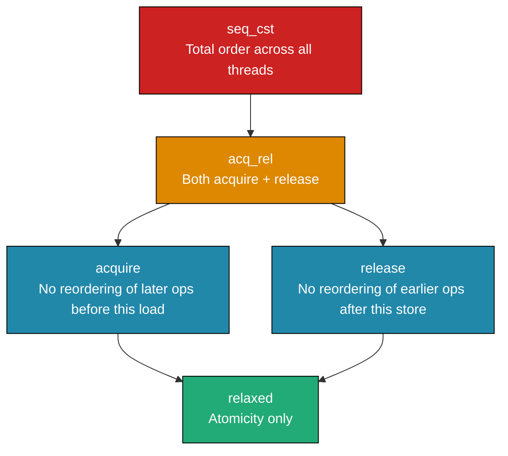
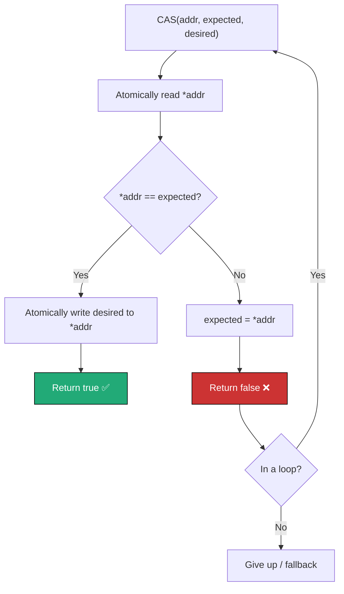
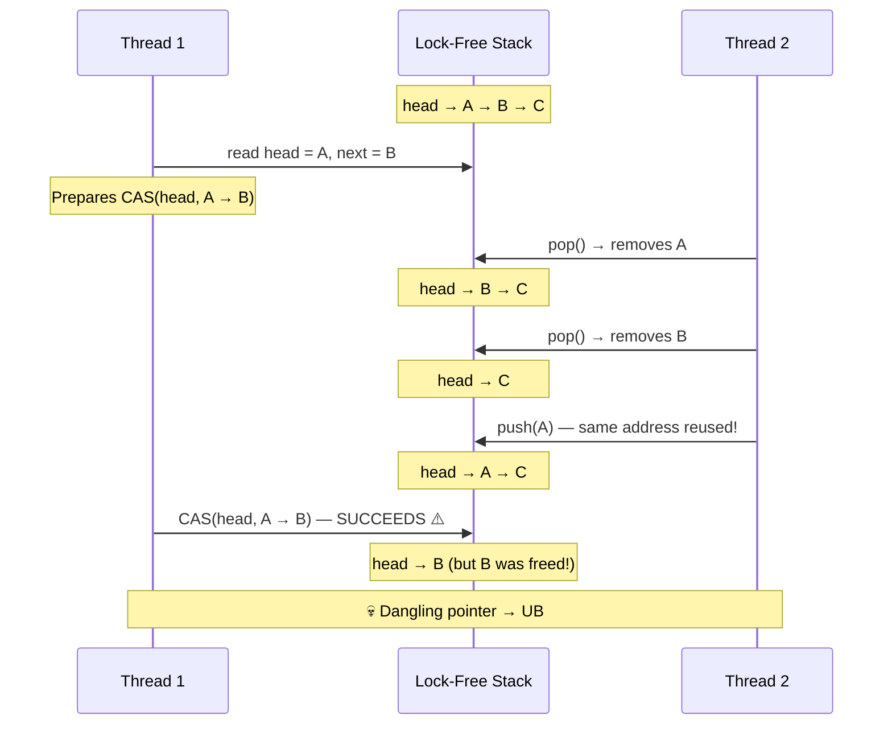

# Chapter 27: Memory Model & Lock-Free Programming

**Tags:** `#cpp` `#memory-model` `#lock-free` `#atomic` `#CAS` `#memory-ordering` `#concurrent` `#advanced`

---

## Theory

The C++ memory model (since C++11) defines the rules for how threads observe writes made by other threads. Without it, compilers and CPUs are free to reorder memory operations in ways that break multi-threaded code. The model introduces **happens-before** relationships and **memory orderings** that let programmers express their synchronization intent precisely. Lock-free programming builds on atomics and compare-and-swap (CAS) to create data structures that never block—critical for low-latency systems where mutex contention is unacceptable.

---

## What — Why — How

| Aspect | Detail |
|--------|--------|
| **What** | Formal rules governing memory visibility between threads; data structures without locks |
| **Why** | Correctness on weak memory architectures (ARM, POWER); ultra-low-latency requirements |
| **How** | `std::atomic` with explicit memory orderings, CAS loops, careful reasoning about happens-before |

---

## 1. The C++ Memory Model

### Happens-Before Relationship

If operation A **happens-before** operation B, then A's effects are visible to B. This is established by:

- **Sequenced-before**: within a single thread, statements execute in program order
- **Synchronizes-with**: an atomic store with release ordering synchronizes-with an atomic load with acquire ordering on the same variable
- **Transitivity**: if A happens-before B, and B happens-before C, then A happens-before C

This example demonstrates the happens-before guarantee using acquire-release ordering. The producer writes non-atomic data and then sets a flag with `release`; the consumer spins on the flag with `acquire`, which guarantees it sees the producer's earlier write to `data`.

```cpp
#include <atomic>
#include <thread>
#include <cassert>

std::atomic<bool> ready{false};
int data = 0;

void producer() {
    data = 42;                                      // (1)
    ready.store(true, std::memory_order_release);   // (2) — release
}

void consumer() {
    while (!ready.load(std::memory_order_acquire))  // (3) — acquire
        ;  // spin
    assert(data == 42);                             // (4) — guaranteed!
    // (2) synchronizes-with (3), so (1) happens-before (4)
}

int main() {
    std::thread t1(producer);
    std::thread t2(consumer);
    t1.join(); t2.join();
}
```

---

## 2. Memory Ordering Options

C++ provides six memory orderings, from weakest to strongest:

| Ordering | Guarantee | Use Case |
|----------|-----------|----------|
| `memory_order_relaxed` | Atomicity only — no ordering | Counters, statistics |
| `memory_order_consume` | Data-dependent ordering (rarely used) | Deprecated in practice |
| `memory_order_acquire` | No reads/writes after this can be reordered before it | Load side of synchronization |
| `memory_order_release` | No reads/writes before this can be reordered after it | Store side of synchronization |
| `memory_order_acq_rel` | Both acquire and release | Read-modify-write (CAS) |
| `memory_order_seq_cst` | Total order across all threads | Default; safest; slowest |

### Relaxed Ordering — Counters

This code uses `memory_order_relaxed` to atomically increment a shared counter from multiple threads. Relaxed ordering is the cheapest option — it guarantees atomicity but no ordering relative to other memory operations, which is perfectly fine for a simple counter where we only care about the final total.

```cpp
#include <atomic>
#include <thread>
#include <iostream>
#include <vector>

std::atomic<int> counter{0};

void count_events(int n) {
    for (int i = 0; i < n; ++i) {
        // No ordering needed — just need atomicity
        counter.fetch_add(1, std::memory_order_relaxed);
    }
}

int main() {
    std::vector<std::thread> threads;
    for (int i = 0; i < 8; ++i)
        threads.emplace_back(count_events, 100000);
    for (auto& t : threads) t.join();
    std::cout << "Count: " << counter.load() << '\n'; // 800000
}
```

### Acquire-Release — Flag Synchronization

This example shows how acquire-release ordering synchronizes a non-atomic write between threads. The writer stores data and then sets a flag with `release`; the reader spins on the flag with `acquire`. The release-acquire pair creates a happens-before edge, guaranteeing the reader sees the payload written before the flag was set.

```cpp
#include <atomic>
#include <thread>
#include <iostream>
#include <string>

std::atomic<bool> flag{false};
std::string payload;

void writer() {
    payload = "critical data";                       // non-atomic write
    flag.store(true, std::memory_order_release);     // release barrier
}

void reader() {
    while (!flag.load(std::memory_order_acquire))    // acquire barrier
        ;
    // Guaranteed to see "critical data"
    std::cout << payload << '\n';
}

int main() {
    std::thread t1(writer);
    std::thread t2(reader);
    t1.join(); t2.join();
}
```

### Sequential Consistency — Strongest Guarantee

This example demonstrates `memory_order_seq_cst`, the strongest (and default) ordering. Four threads write and read two atomic booleans; sequential consistency guarantees a single global order visible to all threads, so the variable `z` can never end up at zero. With weaker orderings like relaxed, `z` could be zero on architectures like ARM or POWER.

```cpp
#include <atomic>
#include <thread>
#include <iostream>

std::atomic<bool> x{false}, y{false};
std::atomic<int> z{0};

void write_x() { x.store(true, std::memory_order_seq_cst); }
void write_y() { y.store(true, std::memory_order_seq_cst); }

void read_x_then_y() {
    while (!x.load(std::memory_order_seq_cst)) ;
    if (y.load(std::memory_order_seq_cst)) ++z;
}

void read_y_then_x() {
    while (!y.load(std::memory_order_seq_cst)) ;
    if (x.load(std::memory_order_seq_cst)) ++z;
}

int main() {
    std::thread a(write_x);
    std::thread b(write_y);
    std::thread c(read_x_then_y);
    std::thread d(read_y_then_x);
    a.join(); b.join(); c.join(); d.join();
    // With seq_cst: z is NEVER 0
    // With relaxed: z COULD be 0 on ARM/POWER
    std::cout << "z = " << z.load() << '\n';
}
```

---

## 3. Why Ordering Matters

### Compiler Reordering

This short snippet illustrates that the compiler is free to reorder independent statements for optimization. In single-threaded code this is harmless, but in multi-threaded code another thread might observe the writes in the wrong order — which is why memory orderings and fences exist.

```cpp
// The compiler MAY reorder these if no dependency exists:
int a = 1;     // Could execute second
int b = 2;     // Could execute first
// This is fine in single-threaded code but breaks cross-thread assumptions
```

### CPU Reordering

| Architecture | Store-Store | Store-Load | Load-Load | Load-Store |
|-------------|-------------|------------|-----------|------------|
| x86-64 | Ordered | **Reordered** | Ordered | Ordered |
| ARM/AArch64 | **Reordered** | **Reordered** | **Reordered** | **Reordered** |
| POWER | **Reordered** | **Reordered** | **Reordered** | **Reordered** |

x86-64 has a relatively strong memory model (TSO), so bugs may hide there and only appear on ARM.

---

## 4. Lock-Free Stack (Treiber Stack)

This implements a classic Treiber stack — a lock-free, thread-safe stack that uses compare-and-swap (CAS) loops instead of mutexes. `push` atomically swings the head pointer to a new node, retrying if another thread modified head first. `pop` does the reverse. This approach gives excellent scalability under contention because threads never block — they just retry.

```cpp
#include <atomic>
#include <iostream>
#include <thread>
#include <vector>
#include <optional>

template <typename T>
class LockFreeStack {
    struct Node {
        T data;
        Node* next;
        Node(T val) : data(std::move(val)), next(nullptr) {}
    };

    std::atomic<Node*> head_{nullptr};

public:
    void push(T val) {
        Node* new_node = new Node(std::move(val));
        new_node->next = head_.load(std::memory_order_relaxed);

        // CAS loop: atomically replace head if it hasn't changed
        while (!head_.compare_exchange_weak(
            new_node->next,      // expected (updated on failure)
            new_node,            // desired
            std::memory_order_release,
            std::memory_order_relaxed))
        {
            // On failure, new_node->next is updated to current head
            // Loop retries with updated value
        }
    }

    std::optional<T> pop() {
        Node* old_head = head_.load(std::memory_order_acquire);

        while (old_head && !head_.compare_exchange_weak(
            old_head,            // expected
            old_head->next,      // desired
            std::memory_order_acq_rel,
            std::memory_order_acquire))
        {
            // old_head updated on failure; retry
        }

        if (!old_head) return std::nullopt;

        T val = std::move(old_head->data);
        delete old_head;  // WARNING: ABA problem (see section 6)
        return val;
    }

    ~LockFreeStack() {
        while (pop().has_value()) {}
    }
};

int main() {
    LockFreeStack<int> stack;

    // Concurrent pushes
    std::vector<std::thread> pushers;
    for (int i = 0; i < 4; ++i) {
        pushers.emplace_back([&stack, i]{
            for (int j = 0; j < 1000; ++j)
                stack.push(i * 1000 + j);
        });
    }
    for (auto& t : pushers) t.join();

    // Count all elements
    int count = 0;
    while (stack.pop().has_value()) ++count;
    std::cout << "Total popped: " << count << '\n'; // 4000
}
```

### Compare-And-Swap (CAS) Explained

This pseudocode shows the atomic compare-and-swap operation that is the foundation of all lock-free data structures. CAS reads the value at an address, checks whether it still matches what you expected, and only writes the new value if it does — all as a single indivisible step. If another thread changed the value first, CAS fails and lets you retry.

```
CAS(address, expected, desired):
    atomically {
        if (*address == expected) {
            *address = desired;
            return true;   // success
        } else {
            expected = *address;  // update expected
            return false;  // retry
        }
    }
```

- `compare_exchange_weak`: may spuriously fail (better in loops)
- `compare_exchange_strong`: no spurious failure (better for single-try)

---

## 5. Lock-Free Queue (Michael-Scott Concept)

The Michael-Scott queue uses a sentinel node and separate head/tail pointers.

```cpp
#include <atomic>
#include <memory>
#include <optional>
#include <iostream>
#include <thread>
#include <vector>

template <typename T>
class LockFreeQueue {
    struct Node {
        T data;
        std::atomic<Node*> next{nullptr};
        Node() = default;  // sentinel
        explicit Node(T val) : data(std::move(val)) {}
    };

    std::atomic<Node*> head_;
    std::atomic<Node*> tail_;

public:
    LockFreeQueue() {
        Node* sentinel = new Node();
        head_.store(sentinel, std::memory_order_relaxed);
        tail_.store(sentinel, std::memory_order_relaxed);
    }

    void enqueue(T val) {
        Node* new_node = new Node(std::move(val));
        Node* old_tail;
        while (true) {
            old_tail = tail_.load(std::memory_order_acquire);
            Node* next = old_tail->next.load(std::memory_order_acquire);
            if (next == nullptr) {
                // Try to link new node at end
                if (old_tail->next.compare_exchange_weak(
                        next, new_node,
                        std::memory_order_release,
                        std::memory_order_relaxed)) {
                    break;
                }
            } else {
                // Tail is behind; advance it
                tail_.compare_exchange_weak(old_tail, next,
                    std::memory_order_release,
                    std::memory_order_relaxed);
            }
        }
        // Advance tail to new node (best effort)
        tail_.compare_exchange_strong(old_tail, new_node,
            std::memory_order_release, std::memory_order_relaxed);
    }

    std::optional<T> dequeue() {
        Node* old_head;
        while (true) {
            old_head = head_.load(std::memory_order_acquire);
            Node* old_tail = tail_.load(std::memory_order_acquire);
            Node* next = old_head->next.load(std::memory_order_acquire);

            if (old_head == old_tail) {
                if (next == nullptr) return std::nullopt; // empty
                // Tail is behind; advance it
                tail_.compare_exchange_weak(old_tail, next,
                    std::memory_order_release, std::memory_order_relaxed);
            } else {
                T val = next->data;
                if (head_.compare_exchange_weak(old_head, next,
                        std::memory_order_acq_rel,
                        std::memory_order_acquire)) {
                    delete old_head; // free sentinel
                    return val;
                }
            }
        }
    }

    ~LockFreeQueue() {
        while (dequeue().has_value()) {}
        delete head_.load();  // final sentinel
    }
};

int main() {
    LockFreeQueue<int> queue;

    std::vector<std::thread> producers, consumers;
    std::atomic<int> total_consumed{0};

    for (int i = 0; i < 4; ++i) {
        producers.emplace_back([&queue, i]{
            for (int j = 0; j < 500; ++j)
                queue.enqueue(i * 500 + j);
        });
    }

    for (int i = 0; i < 4; ++i) {
        consumers.emplace_back([&queue, &total_consumed]{
            int count = 0;
            while (true) {
                auto val = queue.dequeue();
                if (val) ++count;
                else {
                    std::this_thread::yield();
                    val = queue.dequeue();
                    if (!val) break;
                    ++count;
                }
            }
            total_consumed.fetch_add(count, std::memory_order_relaxed);
        });
    }

    for (auto& t : producers) t.join();
    std::this_thread::sleep_for(std::chrono::milliseconds(100));
    for (auto& t : consumers) t.join();

    std::cout << "Total consumed: " << total_consumed.load() << '\n';
}
```

---

## 6. The ABA Problem

### What Is ABA?

The ABA problem is a subtle bug in lock-free algorithms that use CAS. It occurs when a value changes from A to B and back to A while a thread is paused — the CAS sees the original value A and wrongly assumes nothing changed, even though the underlying data structure may have been modified.

```
Thread 1: reads head = A, prepares to CAS(A → B)
Thread 2: pops A, pops B, pushes A back (same pointer!)
Thread 1: CAS succeeds (head is A again) but the stack state has changed
```

### Solutions

| Solution | Mechanism | Trade-off |
|----------|-----------|-----------|
| Hazard pointers | Publish "in-use" pointers; defer deletion | Complex; per-thread overhead |
| Epoch-based reclamation | Defer deletes until no thread is in old epoch | Batched; good throughput |
| Tagged pointers | Pack a counter into unused pointer bits | Limited counter range |
| `std::atomic<std::shared_ptr>` (C++20) | Reference counting handles lifetime | Higher overhead per operation |

### Tagged Pointer Example

This code packs a 48-bit pointer and a 16-bit ABA counter into a single 64-bit value using bit-fields. On x86-64 only 48 bits are used for virtual addresses, so the upper bits can store a monotonically increasing tag. Each time the pointer is updated the tag increments, preventing the ABA problem because stale CAS comparisons will fail on the changed tag.

```cpp
#include <atomic>
#include <cstdint>

struct TaggedPtr {
    uintptr_t ptr : 48;  // 48-bit pointer (x86-64)
    uintptr_t tag : 16;  // 16-bit ABA counter

    TaggedPtr() : ptr(0), tag(0) {}
    TaggedPtr(void* p, uint16_t t)
        : ptr(reinterpret_cast<uintptr_t>(p)), tag(t) {}

    void* get_ptr() const { return reinterpret_cast<void*>(ptr); }
};

// Use with std::atomic<TaggedPtr> — requires the type to be lock-free
// On x86-64, 64-bit atomic operations are lock-free
static_assert(sizeof(TaggedPtr) == sizeof(uint64_t));
```

---

## 7. Lock-Free vs Locked — Decision Guide

| Factor | Lock-Free | Mutex-Based |
|--------|-----------|-------------|
| Latency | Predictable (no blocking) | Can spike under contention |
| Throughput | Higher at low contention | Higher at high contention |
| Complexity | Very high | Low-medium |
| Debugging | Extremely difficult | Moderate |
| Progress guarantee | At least one thread always makes progress | Threads can be indefinitely blocked |
| Memory reclamation | Must use hazard ptrs / epochs | Automatic (scope-based) |
| Correct by inspection | Nearly impossible | Feasible with code review |

### When to Use Lock-Free

- Ultra-low-latency systems (HFT, audio, real-time)
- Signal handlers (mutexes are not signal-safe)
- Kernel code / interrupt handlers
- When you can use a **proven library** (e.g., folly, libcds, Boost.Lockfree)

### When NOT to Use Lock-Free

- General application code (mutex is fine)
- High contention (lock-free degrades to spinning)
- When correctness is more important than latency
- When the team lacks atomic/memory-model expertise

---

## Mermaid Diagram: Memory Ordering Relationships



## Mermaid Diagram: CAS Operation Flow



## Mermaid Diagram: ABA Problem Illustrated



---

## Exercises

### 🟢 Beginner
1. Write a program demonstrating `memory_order_relaxed` for a simple shared counter with 4 threads.
2. Implement a spinlock using `std::atomic_flag` with `test_and_set()` and `clear()`.

### 🟡 Intermediate
3. Modify the acquire-release example to use `seq_cst` and explain when the difference matters.
4. Implement a lock-free SPSC (Single Producer, Single Consumer) ring buffer.

### 🔴 Advanced
5. Add a tagged pointer ABA mitigation to the lock-free stack.
6. Implement epoch-based memory reclamation for the lock-free queue.

---

## Solutions

### Solution 1 — Relaxed Counter

This solution shows four threads each incrementing a shared atomic counter 250,000 times using `memory_order_relaxed`. Because we only need the final sum and no ordering between other variables, relaxed is the most efficient choice — the result is always exactly 1,000,000.

```cpp
#include <atomic>
#include <thread>
#include <iostream>
#include <vector>

std::atomic<int> counter{0};

void count(int n) {
    for (int i = 0; i < n; ++i)
        counter.fetch_add(1, std::memory_order_relaxed);
}

int main() {
    std::vector<std::thread> threads;
    for (int i = 0; i < 4; ++i)
        threads.emplace_back(count, 250000);
    for (auto& t : threads) t.join();
    std::cout << "Counter: " << counter.load() << '\n'; // 1000000
}
```

### Solution 2 — Spinlock

This builds a simple spinlock using `std::atomic_flag`. The `lock()` method spins in a loop calling `test_and_set` with acquire ordering until it succeeds; `unlock()` clears the flag with release ordering. The acquire-release pair ensures that all writes inside the critical section are visible to the next thread that acquires the lock.

```cpp
#include <atomic>
#include <thread>
#include <iostream>
#include <vector>

class Spinlock {
    std::atomic_flag flag_ = ATOMIC_FLAG_INIT;
public:
    void lock() {
        while (flag_.test_and_set(std::memory_order_acquire))
            ; // spin
    }
    void unlock() {
        flag_.clear(std::memory_order_release);
    }
};

int shared = 0;
Spinlock spin;

void work(int n) {
    for (int i = 0; i < n; ++i) {
        spin.lock();
        ++shared;
        spin.unlock();
    }
}

int main() {
    std::vector<std::thread> threads;
    for (int i = 0; i < 4; ++i)
        threads.emplace_back(work, 100000);
    for (auto& t : threads) t.join();
    std::cout << "Shared: " << shared << '\n'; // 400000
}
```

---

## Quiz

**Q1.** What is the default memory ordering for `std::atomic` operations?
a) `memory_order_relaxed`
b) `memory_order_acquire`
c) `memory_order_seq_cst` ✅
d) `memory_order_release`

**Q2.** An acquire load guarantees:
a) All prior writes by any thread are visible
b) No memory operations after the load can be reordered before it ✅
c) The store that wrote the value is visible
d) All atomic operations are totally ordered

**Q3.** The ABA problem occurs when:
a) A value is never modified
b) A CAS succeeds because the value was changed and changed back ✅
c) Two threads read the same value simultaneously
d) An atomic operation is not lock-free

**Q4.** `compare_exchange_weak` differs from `strong` in that:
a) It's weaker ordering
b) It may spuriously fail even when expected matches ✅
c) It doesn't update expected on failure
d) It's not atomic

**Q5.** On ARM, `memory_order_relaxed` atomic operations:
a) Provide the same guarantees as seq_cst
b) Provide atomicity but NO ordering guarantees ✅
c) Are not supported
d) Automatically use acquire-release

**Q6.** A lock-free data structure guarantees:
a) No thread ever waits
b) At least one thread makes progress in finite steps ✅
c) All threads complete simultaneously
d) No CAS failures occur

**Q7.** When should you NOT use lock-free programming?
a) In a high-frequency trading system
b) In a general-purpose application with moderate contention ✅
c) In a signal handler
d) In an OS kernel

**Q8.** Which mechanism solves the ABA problem?
a) Using stronger memory ordering
b) Tagged pointers / hazard pointers / epoch reclamation ✅
c) Using `compare_exchange_strong` instead of weak
d) Adding more CAS retries

---

## Key Takeaways

- The C++ memory model defines **happens-before** relationships through memory orderings
- **`seq_cst`** is safest but slowest; **`relaxed`** is fastest but provides no ordering
- **Acquire-release** pairs are the workhorse of synchronization
- **CAS** (compare-and-swap) is the foundation of lock-free programming
- The **ABA problem** is the primary correctness hazard in lock-free designs
- Lock-free code is for **experts** and **specific use cases** — prefer mutexes by default
- Bugs in lock-free code may only manifest on weak-memory architectures (ARM)

---

## Chapter Summary

The C++ memory model provides formal rules for cross-thread memory visibility. Memory orderings range from relaxed (atomicity only) to sequentially consistent (total order). Acquire-release pairs establish happens-before relationships that make non-atomic writes visible across threads. Lock-free data structures use CAS loops to avoid blocking, but introduce complexity: the ABA problem, memory reclamation challenges, and subtle ordering bugs. On x86 (TSO model), many ordering bugs are hidden—they surface on ARM/POWER. The decision to use lock-free programming should be driven by measured latency requirements, not premature optimization. For most applications, a well-designed mutex-based solution is correct, maintainable, and fast enough.

---

## Real-World Insight

> Facebook's Folly library provides production-quality lock-free data structures (MPMCQueue, AtomicHashMap) backed by years of battle-testing. The Linux kernel uses RCU (Read-Copy-Update)—a lock-free technique optimized for read-heavy workloads. High-frequency trading firms use lock-free SPSC queues for inter-thread message passing where nanoseconds matter. Java's `ConcurrentLinkedQueue` is based on the Michael-Scott queue. In practice, even experts use proven libraries rather than writing lock-free code from scratch.

---

## Common Mistakes

| Mistake | Why It's Wrong | Fix |
|---------|---------------|-----|
| Using `relaxed` everywhere for performance | No ordering = no cross-thread visibility | Use acquire-release for synchronization points |
| Testing only on x86 | x86 TSO hides ordering bugs | Test on ARM; use ThreadSanitizer (`-fsanitize=thread`) |
| Deleting nodes immediately in lock-free pop | Other threads may still hold pointers | Use hazard pointers or epoch reclamation |
| Using `compare_exchange_strong` in a loop | No benefit over `weak` in a CAS loop | Use `weak` in loops (may generate better code) |
| Rolling your own lock-free code | Extremely hard to get right | Use folly, Boost.Lockfree, or libcds |
| Assuming `volatile` provides atomicity | `volatile` ≠ `atomic`; it does not prevent tearing or reordering | Always use `std::atomic` |

---

## Interview Questions

**Q1. Explain the difference between `memory_order_acquire` and `memory_order_seq_cst`.**

> `acquire` prevents reordering of later memory operations before the load—it establishes a happens-before relationship with a corresponding release store. `seq_cst` does everything acquire does PLUS ensures a single total order of all `seq_cst` operations across all threads. The total order is expensive (full memory barrier on most architectures) but eliminates subtle ordering anomalies that can occur with acquire-release alone.

**Q2. What is the ABA problem and how would you solve it in production?**

> ABA occurs when a CAS sees the expected value because another thread changed it away and back (e.g., popped A, popped B, re-pushed A at the same address). The CAS succeeds but the data structure state has silently changed. Solutions: (1) tagged pointers—pack a monotonic counter alongside the pointer so A-with-tag-1 ≠ A-with-tag-2, (2) hazard pointers—threads publish which nodes they're accessing; deferred reclamation, (3) epoch-based reclamation—batch frees until no thread is in an old epoch.

**Q3. Why might lock-free code perform worse than mutex-based code under high contention?**

> Under high contention, CAS loops fail repeatedly, burning CPU cycles on retries (spinning). Each failed CAS invalidates cache lines on other cores, amplifying contention. A mutex puts blocked threads to sleep, freeing the CPU for productive work. Lock-free shines at LOW contention where CAS almost always succeeds on the first try.

**Q4. Explain happens-before and synchronizes-with using a code example.**

> When a thread stores to an atomic variable with `memory_order_release`, and another thread loads that variable with `memory_order_acquire`, the load **synchronizes-with** the store. By transitivity, all writes sequenced before the store **happen-before** all reads sequenced after the load. This guarantees that non-atomic writes (like `data = 42`) are visible to the consumer after it observes the flag.

**Q5. When should you use `memory_order_relaxed` vs stronger orderings?**

> Use `relaxed` for independent counters, statistics, or flags where you only need atomicity and no ordering relationship with other memory operations. Use `acquire`/`release` when one thread's write must be visible to another thread after synchronization. Use `seq_cst` when multiple atomic variables must be observed in a consistent total order across all threads, or when correctness is paramount and you cannot reason about weaker orderings.
