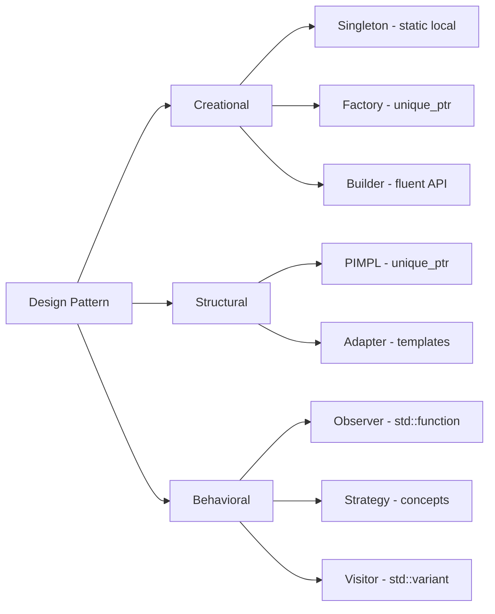
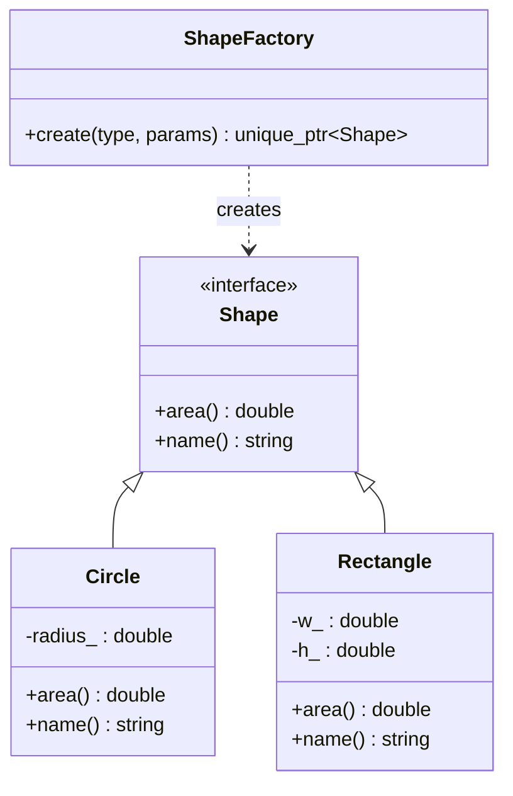
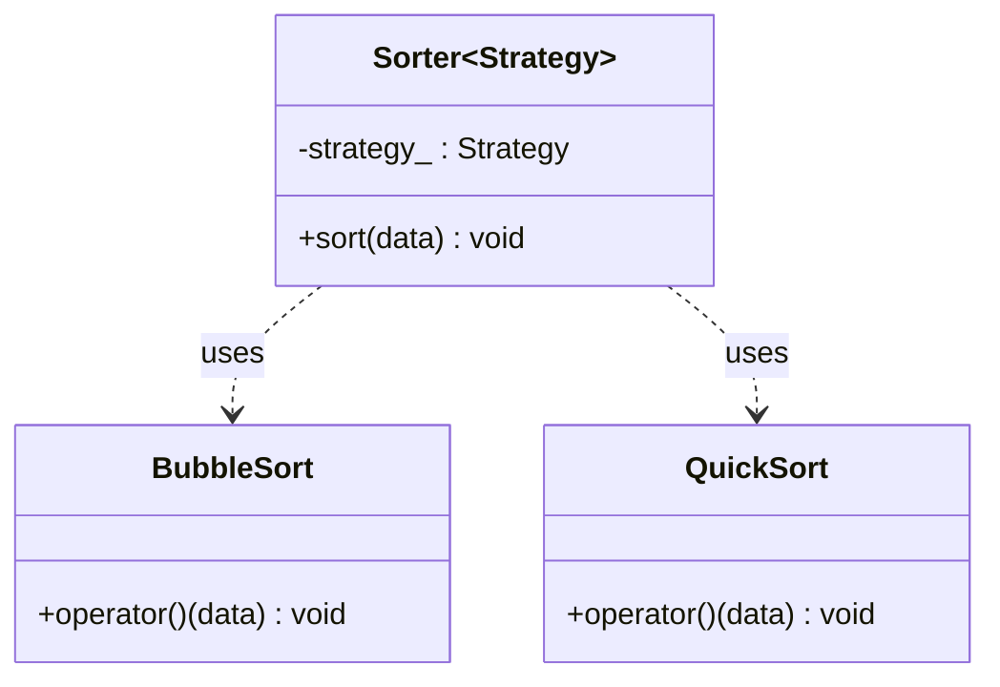
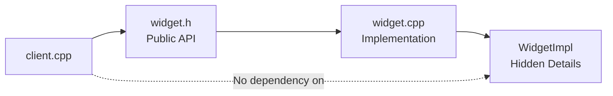

# Chapter 28: Design Patterns in Modern C++

**Tags:** `#design-patterns` `#modern-cpp` `#creational` `#structural` `#behavioral` `#cpp17` `#cpp20`

---

## Theory

Design patterns are reusable solutions to recurring software design problems. Originally catalogued by the "Gang of Four" (GoF) in 1994, these patterns have evolved dramatically with modern C++. Features like `std::unique_ptr`, `std::variant`, `std::function`, concepts, and CTAD eliminate much of the boilerplate that plagued classical implementations.

### What Are Design Patterns?

Design patterns are **named, proven solutions** to common problems in object-oriented and generic programming. They provide a shared vocabulary for developers and encode decades of collective experience.

### Why Modern C++ Changes Everything

| Classical C++ Pattern | Modern C++ Replacement |
|---|---|
| Raw pointer Singleton | Meyers' Singleton (static local) |
| Abstract Factory with `new` | Factory returning `std::unique_ptr` |
| Observer with raw callbacks | `std::function` + lambdas |
| Strategy with inheritance | Templates + Concepts |
| Builder with setters | Fluent interface + designated initializers |

### How Patterns Map to C++ Features



---

## Pattern 1: Singleton (Thread-Safe)

The Singleton pattern ensures a class has exactly one instance with a global access point.

### Meyers' Singleton (C++11 Guaranteed Thread-Safe)

```cpp
#include <iostream>
#include <string>

class Logger {
public:
    static Logger& instance() {
        static Logger logger;  // Thread-safe since C++11 (§6.7)
        return logger;
    }

    void log(const std::string& message) {
        std::cout << "[LOG] " << message << "\n";
    }

    // Delete copy and move
    Logger(const Logger&) = delete;
    Logger& operator=(const Logger&) = delete;
    Logger(Logger&&) = delete;
    Logger& operator=(Logger&&) = delete;

private:
    Logger() { std::cout << "Logger initialized\n"; }
    ~Logger() = default;
};

int main() {
    Logger::instance().log("Application started");
    Logger::instance().log("Processing request");
    // Both calls use the same Logger instance
}
```

### Alternative: `std::call_once` Singleton

```cpp
#include <mutex>
#include <memory>

class Database {
public:
    static Database& instance() {
        std::call_once(init_flag_, [] {
            instance_.reset(new Database());
        });
        return *instance_;
    }

    void query(const std::string& sql) { /* ... */ }

private:
    Database() = default;
    static std::once_flag init_flag_;
    static std::unique_ptr<Database> instance_;
};

std::once_flag Database::init_flag_;
std::unique_ptr<Database> Database::instance_;
```

> **Anti-pattern:** Never use double-checked locking with raw pointers — it was broken before C++11 memory model guarantees. Prefer Meyers' Singleton.

---

## Pattern 2: Factory Pattern

The Factory pattern encapsulates object creation, returning polymorphic types through a common interface.



### Modern Factory with `std::unique_ptr` and `std::variant`

```cpp
#include <iostream>
#include <memory>
#include <string>
#include <variant>
#include <cmath>
#include <numbers>
#include <unordered_map>
#include <functional>

class Shape {
public:
    virtual ~Shape() = default;
    virtual double area() const = 0;
    virtual std::string name() const = 0;
};

class Circle : public Shape {
    double radius_;
public:
    explicit Circle(double r) : radius_(r) {}
    double area() const override { return std::numbers::pi * radius_ * radius_; }
    std::string name() const override { return "Circle"; }
};

class Rectangle : public Shape {
    double w_, h_;
public:
    Rectangle(double w, double h) : w_(w), h_(h) {}
    double area() const override { return w_ * h_; }
    std::string name() const override { return "Rectangle"; }
};

// Self-registering factory
class ShapeFactory {
    using Creator = std::function<std::unique_ptr<Shape>(double, double)>;
    std::unordered_map<std::string, Creator> registry_;

public:
    static ShapeFactory& instance() {
        static ShapeFactory factory;
        return factory;
    }

    void register_shape(const std::string& name, Creator creator) {
        registry_[name] = std::move(creator);
    }

    std::unique_ptr<Shape> create(const std::string& name,
                                   double p1 = 0, double p2 = 0) const {
        auto it = registry_.find(name);
        if (it == registry_.end()) return nullptr;
        return it->second(p1, p2);
    }
};

// Registration
static bool registered = [] {
    auto& f = ShapeFactory::instance();
    f.register_shape("circle", [](double r, double) {
        return std::make_unique<Circle>(r);
    });
    f.register_shape("rectangle", [](double w, double h) {
        return std::make_unique<Rectangle>(w, h);
    });
    return true;
}();

int main() {
    auto& factory = ShapeFactory::instance();
    auto circle = factory.create("circle", 5.0);
    auto rect   = factory.create("rectangle", 3.0, 4.0);

    if (circle) std::cout << circle->name() << " area: " << circle->area() << "\n";
    if (rect)   std::cout << rect->name()   << " area: " << rect->area()   << "\n";
}
```

### Variant-Based Factory (No Inheritance)

```cpp
#include <variant>
#include <cmath>
#include <numbers>
#include <iostream>

struct Circle  { double radius; };
struct Rect    { double w, h; };
struct Triangle{ double base, height; };

using ShapeV = std::variant<Circle, Rect, Triangle>;

double area(const ShapeV& shape) {
    return std::visit([](const auto& s) -> double {
        using T = std::decay_t<decltype(s)>;
        if constexpr (std::is_same_v<T, Circle>)
            return std::numbers::pi * s.radius * s.radius;
        else if constexpr (std::is_same_v<T, Rect>)
            return s.w * s.h;
        else
            return 0.5 * s.base * s.height;
    }, shape);
}

int main() {
    ShapeV s1 = Circle{5.0};
    ShapeV s2 = Rect{3.0, 4.0};
    std::cout << "Circle area: " << area(s1) << "\n";
    std::cout << "Rect area: "   << area(s2) << "\n";
}
```

---

## Pattern 3: Observer Pattern

```cpp
#include <iostream>
#include <vector>
#include <functional>
#include <string>
#include <algorithm>

template <typename... Args>
class Event {
    using Callback = std::function<void(Args...)>;
    std::vector<std::pair<int, Callback>> listeners_;
    int next_id_ = 0;

public:
    int subscribe(Callback cb) {
        int id = next_id_++;
        listeners_.emplace_back(id, std::move(cb));
        return id;
    }

    void unsubscribe(int id) {
        std::erase_if(listeners_,
            [id](const auto& p) { return p.first == id; });
    }

    void emit(Args... args) const {
        for (const auto& [id, cb] : listeners_) {
            cb(args...);
        }
    }
};

class StockTicker {
public:
    Event<std::string, double> on_price_change;

    void set_price(const std::string& symbol, double price) {
        prices_[symbol] = price;
        on_price_change.emit(symbol, price);
    }

private:
    std::unordered_map<std::string, double> prices_;
};

int main() {
    StockTicker ticker;

    auto id1 = ticker.on_price_change.subscribe(
        [](const std::string& sym, double price) {
            std::cout << "Display: " << sym << " = $" << price << "\n";
        });

    auto id2 = ticker.on_price_change.subscribe(
        [](const std::string& sym, double price) {
            if (price > 150.0)
                std::cout << "ALERT: " << sym << " above $150!\n";
        });

    ticker.set_price("AAPL", 145.0);
    ticker.set_price("AAPL", 155.0);

    ticker.on_price_change.unsubscribe(id2);
    ticker.set_price("AAPL", 160.0);  // No alert
}
```

---

## Pattern 4: Strategy Pattern (Templates + Concepts)



```cpp
#include <iostream>
#include <vector>
#include <algorithm>
#include <concepts>

// Concept: a SortStrategy must be callable on a vector<T>&
template <typename S, typename T>
concept SortStrategy = requires(S s, std::vector<T>& v) {
    { s(v) } -> std::same_as<void>;
};

struct BubbleSort {
    template <typename T>
    void operator()(std::vector<T>& data) const {
        for (size_t i = 0; i < data.size(); ++i)
            for (size_t j = 0; j + 1 < data.size() - i; ++j)
                if (data[j] > data[j + 1])
                    std::swap(data[j], data[j + 1]);
    }
};

struct StdSort {
    template <typename T>
    void operator()(std::vector<T>& data) const {
        std::sort(data.begin(), data.end());
    }
};

template <typename T, SortStrategy<T> Strategy>
class Sorter {
    Strategy strategy_;
public:
    explicit Sorter(Strategy s = {}) : strategy_(std::move(s)) {}

    void sort(std::vector<T>& data) { strategy_(data); }
};

int main() {
    std::vector<int> data = {5, 2, 8, 1, 9, 3};

    Sorter<int, BubbleSort> bubble;
    bubble.sort(data);
    for (int x : data) std::cout << x << " ";
    std::cout << "\n";

    data = {5, 2, 8, 1, 9, 3};
    Sorter<int, StdSort> fast;
    fast.sort(data);
    for (int x : data) std::cout << x << " ";
    std::cout << "\n";
}
```

---

## Pattern 5: Builder Pattern (Fluent Interface)

```cpp
#include <iostream>
#include <string>
#include <optional>

class HttpRequest {
public:
    class Builder {
        std::string url_;
        std::string method_ = "GET";
        std::optional<std::string> body_;
        std::vector<std::pair<std::string, std::string>> headers_;

    public:
        Builder& url(std::string u)    { url_ = std::move(u); return *this; }
        Builder& method(std::string m) { method_ = std::move(m); return *this; }
        Builder& body(std::string b)   { body_ = std::move(b); return *this; }
        Builder& header(std::string k, std::string v) {
            headers_.emplace_back(std::move(k), std::move(v));
            return *this;
        }

        HttpRequest build() {
            if (url_.empty()) throw std::invalid_argument("URL required");
            return HttpRequest(std::move(url_), std::move(method_),
                               std::move(body_), std::move(headers_));
        }
    };

    void print() const {
        std::cout << method_ << " " << url_ << "\n";
        for (const auto& [k, v] : headers_)
            std::cout << k << ": " << v << "\n";
        if (body_) std::cout << "Body: " << *body_ << "\n";
    }

private:
    HttpRequest(std::string url, std::string method,
                std::optional<std::string> body,
                std::vector<std::pair<std::string, std::string>> headers)
        : url_(std::move(url)), method_(std::move(method)),
          body_(std::move(body)), headers_(std::move(headers)) {}

    std::string url_, method_;
    std::optional<std::string> body_;
    std::vector<std::pair<std::string, std::string>> headers_;
};

int main() {
    auto request = HttpRequest::Builder()
        .url("https://api.example.com/data")
        .method("POST")
        .header("Content-Type", "application/json")
        .header("Authorization", "Bearer token123")
        .body(R"({"key": "value"})")
        .build();

    request.print();
}
```

---

## Pattern 6: PIMPL Idiom (Compilation Firewall)



### Header: `widget.h`

```cpp
#pragma once
#include <memory>
#include <string>

class Widget {
public:
    explicit Widget(std::string name);
    ~Widget();                            // Must be declared for unique_ptr<Impl>

    Widget(Widget&&) noexcept;            // Move operations
    Widget& operator=(Widget&&) noexcept;

    void draw() const;
    std::string name() const;

private:
    struct Impl;                          // Forward declaration only
    std::unique_ptr<Impl> pimpl_;
};
```

### Source: `widget.cpp`

```cpp
#include "widget.h"
#include <iostream>

struct Widget::Impl {
    std::string name;
    int render_count = 0;

    void draw() {
        ++render_count;
        std::cout << "Drawing " << name << " (render #" << render_count << ")\n";
    }
};

Widget::Widget(std::string name)
    : pimpl_(std::make_unique<Impl>(Impl{std::move(name), 0})) {}

Widget::~Widget() = default;
Widget::Widget(Widget&&) noexcept = default;
Widget& Widget::operator=(Widget&&) noexcept = default;

void Widget::draw() const { pimpl_->draw(); }
std::string Widget::name() const { return pimpl_->name; }
```

> **Anti-pattern:** Putting implementation details in public headers causes cascading recompilation across every translation unit that includes the header.

---

## Anti-Patterns to Avoid

| Anti-Pattern | Problem | Modern Fix |
|---|---|---|
| God Object | One class does everything | Split into focused classes |
| Singleton Abuse | Hidden global state everywhere | Dependency injection |
| Deep Inheritance | Fragile base class problem | Composition over inheritance |
| Premature Optimization Pattern | Over-engineering before profiling | Measure first, optimize second |
| Raw `new`/`delete` in Factory | Memory leaks on exceptions | Return `std::unique_ptr` |

---

## Exercises

### 🟢 Beginner
1. Implement a Meyers' Singleton `ConfigManager` that reads key-value pairs from a map.
2. Write a simple Observer using `std::function` that tracks temperature changes.

### 🟡 Intermediate
3. Create a self-registering Factory for `LogHandler` types (ConsoleLog, FileLog, NetworkLog).
4. Implement a Builder for a `DatabaseConnection` with host, port, database, user, and SSL flag.

### 🔴 Advanced
5. Implement a Strategy pattern using C++20 concepts that selects a compression algorithm (Zlib, LZ4, None) at compile time.
6. Create a PIMPL-based library class that wraps a complex third-party dependency, ensuring zero header leakage.

---

## Solutions

### Solution 1: ConfigManager Singleton
```cpp
#include <iostream>
#include <unordered_map>
#include <string>

class ConfigManager {
public:
    static ConfigManager& instance() {
        static ConfigManager mgr;
        return mgr;
    }
    void set(const std::string& key, const std::string& val) { data_[key] = val; }
    std::string get(const std::string& key) const {
        auto it = data_.find(key);
        return it != data_.end() ? it->second : "";
    }
    ConfigManager(const ConfigManager&) = delete;
    ConfigManager& operator=(const ConfigManager&) = delete;
private:
    ConfigManager() = default;
    std::unordered_map<std::string, std::string> data_;
};

int main() {
    ConfigManager::instance().set("app.name", "MyApp");
    std::cout << ConfigManager::instance().get("app.name") << "\n";
}
```

### Solution 3: Self-Registering LogHandler Factory
```cpp
#include <iostream>
#include <memory>
#include <string>
#include <unordered_map>
#include <functional>

struct LogHandler {
    virtual ~LogHandler() = default;
    virtual void write(const std::string& msg) = 0;
};

struct ConsoleLog : LogHandler {
    void write(const std::string& msg) override {
        std::cout << "[Console] " << msg << "\n";
    }
};

struct FileLog : LogHandler {
    void write(const std::string& msg) override {
        std::cout << "[File] " << msg << "\n";
    }
};

class LogFactory {
    using Creator = std::function<std::unique_ptr<LogHandler>()>;
    std::unordered_map<std::string, Creator> reg_;
public:
    static LogFactory& instance() { static LogFactory f; return f; }
    void add(const std::string& n, Creator c) { reg_[n] = std::move(c); }
    std::unique_ptr<LogHandler> create(const std::string& n) {
        return reg_.count(n) ? reg_[n]() : nullptr;
    }
};

static auto _ = [] {
    LogFactory::instance().add("console", [] { return std::make_unique<ConsoleLog>(); });
    LogFactory::instance().add("file",    [] { return std::make_unique<FileLog>(); });
    return 0;
}();

int main() {
    auto logger = LogFactory::instance().create("console");
    if (logger) logger->write("Hello from factory!");
}
```

---

## Quiz

**Q1:** What makes Meyers' Singleton thread-safe in C++11?
**A:** The C++11 standard (§6.7) guarantees that initialization of function-local statics is thread-safe. The compiler inserts synchronization primitives.

**Q2:** Why should a Factory return `std::unique_ptr` instead of a raw pointer?
**A:** It clearly expresses ownership transfer, prevents memory leaks if exceptions occur, and the caller can convert to `std::shared_ptr` if needed.

**Q3:** What is the advantage of the Strategy pattern with concepts over virtual functions?
**A:** Compile-time dispatch eliminates vtable overhead, enables inlining, and provides better error messages at the point of use.

**Q4:** Why must the PIMPL destructor be defined in the `.cpp` file?
**A:** Because `std::unique_ptr` needs the complete type definition to call the destructor, which is only available in the implementation file.

**Q5:** When should you prefer `std::variant` over classical polymorphism?
**A:** When the set of types is closed (known at compile time), when you want value semantics, or when vtable overhead matters.

**Q6:** What problem does the Builder pattern solve?
**A:** It addresses the "telescoping constructor" anti-pattern where constructors have many parameters, making code unreadable and error-prone.

---

## Key Takeaways

- **Meyers' Singleton** is the simplest thread-safe Singleton in modern C++
- **Factory** should always return `std::unique_ptr` for clear ownership
- **Observer** with `std::function` is cleaner than classical interface-based callbacks
- **Strategy** with concepts gives compile-time polymorphism with zero overhead
- **PIMPL** hides implementation details and reduces compile-time coupling
- `std::variant` replaces many uses of classical inheritance hierarchies

---

## Chapter Summary

Modern C++ transforms classical design patterns from verbose, error-prone constructs into clean, safe, and efficient code. The language's type system, smart pointers, concepts, and standard library utilities make patterns easier to implement correctly. The key insight is that many patterns exist to work around language limitations — as C++ evolves, some patterns simplify dramatically or become unnecessary.

---

## Real-World Insight

In production GPU computing frameworks (CUDA, OpenCL), the Factory pattern is used extensively to create device-specific kernels based on GPU capabilities detected at runtime. The Strategy pattern selects algorithms (e.g., reduction strategies) based on hardware architecture. PIMPL is critical in SDK libraries where ABI stability across driver versions is essential.

---

## Common Mistakes

1. **Using Singleton for everything** — Creates hidden dependencies; prefer dependency injection
2. **Forgetting to delete copy ops on Singleton** — Allows accidental duplication
3. **Leaking implementation headers through PIMPL** — Defeats the purpose of the pattern
4. **Using virtual dispatch when compile-time dispatch suffices** — Unnecessary runtime overhead
5. **Builder without validation** — Always validate required fields in `build()`

---

## Interview Questions

**Q1: Explain how Meyers' Singleton is thread-safe without explicit locking.**
**A:** C++11 §6.7 mandates that if multiple threads attempt to initialize the same function-local static variable concurrently, exactly one thread performs the initialization while others block until it completes. The compiler generates the necessary synchronization code (typically a flag + mutex). This makes `static Logger instance;` inside a function inherently thread-safe.

**Q2: Compare the Factory pattern using inheritance vs `std::variant`. When would you choose each?**
**A:** Inheritance-based factories suit open type sets where new types are added without modifying existing code (Open/Closed Principle). `std::variant`-based factories suit closed type sets where all types are known at compile time — they provide value semantics, cache locality, and zero heap allocation. Choose inheritance for plugin architectures; choose variant for fixed, performance-critical type sets.

**Q3: What is the PIMPL idiom and what are its trade-offs?**
**A:** PIMPL (Pointer to IMPLementation) hides class internals behind a forward-declared struct accessed through `std::unique_ptr`. Benefits: reduced compilation dependencies, ABI stability, clean public headers. Costs: heap allocation for the impl, pointer indirection on every member access, and slightly more complex class definition (must declare destructor, move operations in the source file).

**Q4: How does the Strategy pattern with C++20 concepts differ from the classical virtual version?**
**A:** The classical version uses runtime polymorphism (vtable), requiring heap allocation and preventing inlining. The concepts version uses compile-time polymorphism — the strategy is a template parameter constrained by a concept. This enables full inlining, zero overhead abstraction, and better compiler diagnostics. The trade-off is that the strategy must be known at compile time (no runtime strategy switching without type erasure).

**Q5: Explain the Observer pattern's memory safety concerns and how modern C++ addresses them.**
**A:** Classical Observer has dangling pointer risks — if an observer is destroyed without unsubscribing, the subject holds a dangling pointer. Modern C++ solutions: (1) use `std::function` + integer IDs for explicit unsubscription, (2) use `std::weak_ptr` to detect destroyed observers, (3) RAII subscription objects that unsubscribe on destruction. The `std::function` approach avoids raw pointers entirely.
