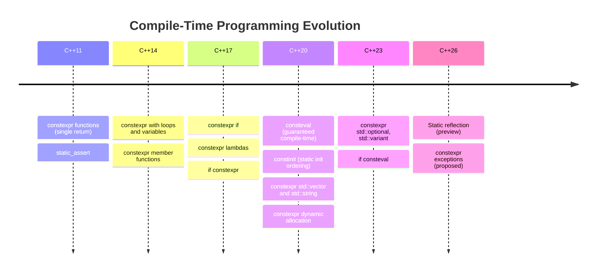
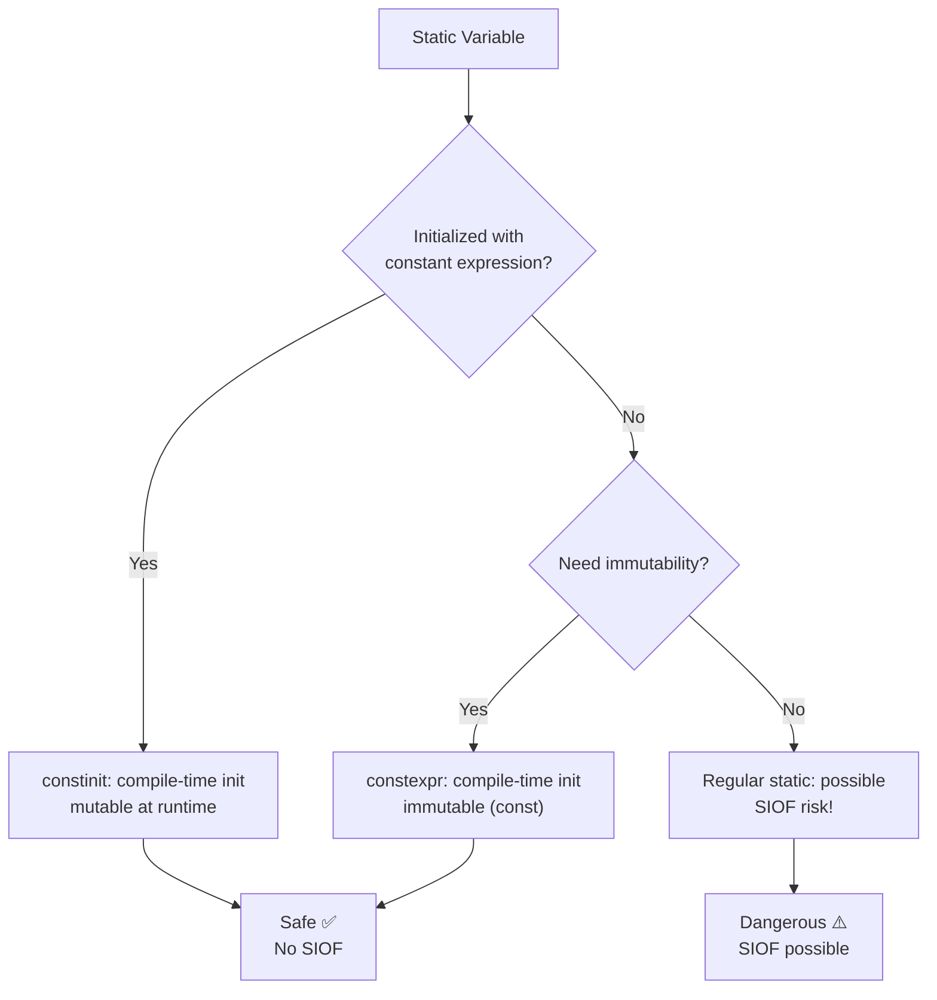

# Chapter 29: Compile-Time Programming

**Tags:** `#constexpr` `#consteval` `#constinit` `#cpp17` `#cpp20` `#cpp23` `#metaprogramming` `#compile-time`

---

## Theory

Compile-time programming shifts computation from runtime to compilation, producing faster binaries with stronger guarantees. Modern C++ has steadily expanded what can be computed at compile time — from simple constant expressions in C++11 to full compile-time containers in C++20 and static reflection previews in C++26.

### What Is Compile-Time Programming?

It is the practice of performing computations during compilation rather than at runtime. The compiler evaluates expressions, validates constraints, and generates optimized code before the program ever runs.

### Why Compile-Time Programming Matters

| Benefit | Explanation |
|---|---|
| **Zero runtime cost** | Precomputed values are embedded as constants in the binary |
| **Earlier error detection** | Logic errors caught at compile time, not in production |
| **Stronger guarantees** | `static_assert` validates invariants before shipping |
| **Optimization enabler** | Compiler can fold constant expressions into instructions |
| **Configuration validation** | Verify config parameters before deployment |

### How It Evolved Across Standards



---

## `constexpr` Functions — Rules and Evolution

### C++11: Single-Expression Functions

```cpp
// C++11: constexpr functions had severe restrictions
constexpr int square_11(int x) {
    return x * x;  // Only a single return statement allowed
}
```

### C++14: Loops, Variables, and Control Flow

```cpp
constexpr int factorial(int n) {
    int result = 1;
    for (int i = 2; i <= n; ++i)
        result *= i;
    return result;
}

static_assert(factorial(5) == 120, "factorial(5) must be 120");
static_assert(factorial(0) == 1,   "factorial(0) must be 1");
```

### C++17: `if constexpr` — Compile-Time Branching

```cpp
#include <type_traits>
#include <string>
#include <iostream>

template <typename T>
auto to_string_val(const T& val) {
    if constexpr (std::is_arithmetic_v<T>) {
        return std::to_string(val);
    } else if constexpr (std::is_same_v<T, std::string>) {
        return val;
    } else {
        return std::string("[unknown type]");
    }
}

int main() {
    std::cout << to_string_val(42) << "\n";       // "42"
    std::cout << to_string_val(3.14) << "\n";     // "3.140000"
    std::cout << to_string_val(std::string("hi")) << "\n"; // "hi"
}
```

### C++20: Expanded `constexpr` Capabilities

```cpp
#include <vector>
#include <algorithm>
#include <numeric>
#include <array>

// constexpr dynamic allocation — vector works at compile time!
constexpr auto compute_primes(int limit) {
    std::vector<bool> sieve(limit + 1, true);
    sieve[0] = sieve[1] = false;
    for (int i = 2; i * i <= limit; ++i)
        if (sieve[i])
            for (int j = i * i; j <= limit; j += i)
                sieve[j] = false;

    std::vector<int> primes;
    for (int i = 2; i <= limit; ++i)
        if (sieve[i])
            primes.push_back(i);
    return primes;
}

// Transfer compile-time vector to fixed-size array
constexpr auto make_prime_array() {
    constexpr auto primes = compute_primes(50);
    std::array<int, primes.size()> arr{};
    for (size_t i = 0; i < primes.size(); ++i)
        arr[i] = primes[i];
    return arr;
}

// All computed at compile time
constexpr auto prime_table = make_prime_array();

static_assert(prime_table[0] == 2);
static_assert(prime_table[4] == 11);
```

---

## `consteval` (C++20) — Guaranteed Compile-Time

`consteval` declares an **immediate function** — it *must* be evaluated at compile time. Unlike `constexpr` (which can run at runtime), `consteval` produces a compile error if called with runtime values.

```cpp
#include <iostream>
#include <cstdint>

consteval uint64_t compile_time_hash(const char* str) {
    uint64_t hash = 0xcbf29ce484222325ULL;
    while (*str) {
        hash ^= static_cast<uint64_t>(*str++);
        hash *= 0x100000001b3ULL;
    }
    return hash;
}

// This MUST be computed at compile time
constexpr auto route_hash = compile_time_hash("/api/users");

// Runtime call would fail:
// const char* runtime_str = get_input();
// auto h = compile_time_hash(runtime_str); // ERROR!

int main() {
    switch (compile_time_hash("/api/users")) {
        case compile_time_hash("/api/users"):
            std::cout << "Users route\n";
            break;
        case compile_time_hash("/api/posts"):
            std::cout << "Posts route\n";
            break;
    }
}
```

### `if consteval` (C++23)

```cpp
#include <cmath>
#include <iostream>

constexpr double fast_sqrt(double x) {
    if consteval {
        // Compile-time: use Newton's method
        double guess = x / 2.0;
        for (int i = 0; i < 20; ++i)
            guess = (guess + x / guess) / 2.0;
        return guess;
    } else {
        // Runtime: use hardware instruction
        return std::sqrt(x);
    }
}

int main() {
    constexpr double ct = fast_sqrt(144.0);  // Newton's method at compile time
    double rt = fast_sqrt(144.0);            // std::sqrt at runtime
    std::cout << "ct=" << ct << " rt=" << rt << "\n";
}
```

---

## `constinit` (C++20) — Static Initialization Order

`constinit` ensures a variable is initialized at compile time (constant initialization) but does **not** make it immutable — it can be modified at runtime.

```cpp
#include <iostream>

// Problem: Static Initialization Order Fiasco
// Without constinit, order of initialization across translation units is undefined

constinit int global_counter = 0;  // Guaranteed compile-time init
constinit thread_local int tls_id = 0;  // Per-thread, compile-time init

void increment() {
    ++global_counter;  // Mutable at runtime
    ++tls_id;
}

// This would FAIL — not a constant expression:
// constinit int bad = some_runtime_function(); // ERROR

int main() {
    std::cout << "Initial: " << global_counter << "\n";
    increment();
    increment();
    std::cout << "After: " << global_counter << "\n";
}
```



---

## Compile-Time String Processing

```cpp
#include <string_view>
#include <array>
#include <iostream>

// Compile-time string hashing
constexpr uint32_t fnv1a(std::string_view sv) {
    uint32_t hash = 2166136261u;
    for (char c : sv) {
        hash ^= static_cast<uint32_t>(c);
        hash *= 16777619u;
    }
    return hash;
}

// Compile-time string splitting
constexpr size_t count_tokens(std::string_view sv, char delim) {
    size_t count = 0;
    for (char c : sv)
        if (c == delim) ++count;
    return count + 1;
}

template <size_t N>
constexpr auto split(std::string_view sv, char delim) {
    std::array<std::string_view, N> result{};
    size_t idx = 0;
    size_t start = 0;
    for (size_t i = 0; i <= sv.size(); ++i) {
        if (i == sv.size() || sv[i] == delim) {
            result[idx++] = sv.substr(start, i - start);
            start = i + 1;
        }
    }
    return result;
}

int main() {
    constexpr auto hash = fnv1a("hello");
    static_assert(hash == fnv1a("hello"));
    static_assert(hash != fnv1a("world"));

    constexpr std::string_view csv = "name,age,city";
    constexpr auto tokens = split<count_tokens(csv, ',')>(csv, ',');
    static_assert(tokens[0] == "name");
    static_assert(tokens[1] == "age");
    static_assert(tokens[2] == "city");

    for (auto tok : tokens)
        std::cout << "[" << tok << "] ";
    std::cout << "\n";
}
```

---

## `std::source_location` for Debugging

```cpp
#include <iostream>
#include <string_view>
#include <source_location>

void log(std::string_view message,
         const std::source_location& loc = std::source_location::current()) {
    std::cout << loc.file_name() << ":"
              << loc.line() << " ("
              << loc.function_name() << "): "
              << message << "\n";
}

template <typename T>
void validate(T value, T min, T max,
              const std::source_location& loc = std::source_location::current()) {
    if (value < min || value > max) {
        std::cerr << "Validation failed at " << loc.file_name()
                  << ":" << loc.line() << " — "
                  << value << " not in [" << min << ", " << max << "]\n";
    }
}

int main() {
    log("Application starting");       // Prints file, line, function
    validate(42, 0, 100);              // OK
    validate(150, 0, 100);             // Prints validation failure with location
}
```

---

## Practical: Compile-Time Lookup Tables

```cpp
#include <array>
#include <cmath>
#include <iostream>
#include <numbers>

// Generate a sine lookup table entirely at compile time
template <size_t N>
constexpr auto generate_sine_table() {
    std::array<double, N> table{};
    for (size_t i = 0; i < N; ++i) {
        double angle = 2.0 * std::numbers::pi * static_cast<double>(i) / N;
        // Compile-time Taylor series approximation for sin
        double x = angle;
        // Normalize to [-pi, pi]
        while (x > std::numbers::pi) x -= 2.0 * std::numbers::pi;
        while (x < -std::numbers::pi) x += 2.0 * std::numbers::pi;
        double result = x;
        double term = x;
        for (int k = 1; k <= 12; ++k) {
            term *= -x * x / ((2.0 * k) * (2.0 * k + 1.0));
            result += term;
        }
        table[i] = result;
    }
    return table;
}

constexpr auto sine_lut = generate_sine_table<256>();

int main() {
    // Zero runtime computation — table is baked into the binary
    std::cout << "sin(0°)   ≈ " << sine_lut[0]   << "\n";   // ~0
    std::cout << "sin(90°)  ≈ " << sine_lut[64]  << "\n";   // ~1
    std::cout << "sin(180°) ≈ " << sine_lut[128] << "\n";   // ~0
    std::cout << "sin(270°) ≈ " << sine_lut[192] << "\n";   // ~-1
}
```

---

## Practical: Compile-Time Config Validation

```cpp
#include <string_view>
#include <stdexcept>

struct AppConfig {
    int port;
    int max_connections;
    int thread_pool_size;
    std::string_view log_level;
};

consteval AppConfig validate_config(AppConfig cfg) {
    if (cfg.port < 1 || cfg.port > 65535)
        throw "Invalid port number";
    if (cfg.max_connections < 1 || cfg.max_connections > 100000)
        throw "Invalid max_connections";
    if (cfg.thread_pool_size < 1 || cfg.thread_pool_size > 256)
        throw "Thread pool size out of range";
    if (cfg.log_level != "debug" && cfg.log_level != "info" &&
        cfg.log_level != "warn" && cfg.log_level != "error")
        throw "Invalid log level";
    return cfg;
}

// Validated at compile time — invalid config won't compile!
constexpr auto config = validate_config({
    .port = 8080,
    .max_connections = 1000,
    .thread_pool_size = 8,
    .log_level = "info"
});

// This would cause a compile error:
// constexpr auto bad = validate_config({.port = 99999, ...});

static_assert(config.port == 8080);
```

---

## Static Reflection Preview (C++26)

```cpp
// NOTE: C++26 proposal — not yet standardized. Syntax is illustrative.
// Based on P2996 and related proposals.

/*
// Future C++26 reflection — enumerate struct members at compile time:
struct Point { float x; float y; float z; };

template <typename T>
void print_members(const T& obj) {
    // Hypothetical reflection syntax:
    template for (constexpr auto member : std::meta::members_of(^T)) {
        std::cout << std::meta::name_of(member) << " = "
                  << obj.[:member:] << "\n";
    }
}

// Usage: print_members(Point{1.0f, 2.0f, 3.0f});
// Output:
//   x = 1.0
//   y = 2.0
//   z = 3.0

// This eliminates the need for manual serialization, ORM mapping,
// and many uses of macros in production code.
*/
```

---

## Exercises

### 🟢 Beginner
1. Write a `constexpr` function that computes Fibonacci numbers. Verify with `static_assert` for `fib(10) == 55`.
2. Use `std::source_location` to write a `debug_print` function that includes file and line.

### 🟡 Intermediate
3. Create a `consteval` function that validates email format at compile time (checks for `@` and `.`).
4. Build a compile-time CRC32 lookup table using a `constexpr` function.

### 🔴 Advanced
5. Implement a compile-time regular expression matcher for simple patterns (literal chars + `*` wildcard).
6. Create a `constexpr` sorted map (binary search on a sorted array) that works entirely at compile time.

---

## Solutions

### Solution 1: Compile-Time Fibonacci

```cpp
#include <cstdint>
#include <iostream>

constexpr uint64_t fib(int n) {
    if (n <= 1) return n;
    uint64_t a = 0, b = 1;
    for (int i = 2; i <= n; ++i) {
        uint64_t c = a + b;
        a = b;
        b = c;
    }
    return b;
}

static_assert(fib(0) == 0);
static_assert(fib(1) == 1);
static_assert(fib(10) == 55);
static_assert(fib(20) == 6765);

int main() {
    constexpr auto f50 = fib(50);
    std::cout << "fib(50) = " << f50 << "\n";
}
```

### Solution 3: Compile-Time Email Validation

```cpp
#include <string_view>
#include <iostream>

consteval bool validate_email(std::string_view email) {
    if (email.size() < 5) return false;
    auto at_pos = email.find('@');
    if (at_pos == std::string_view::npos || at_pos == 0) return false;
    auto dot_pos = email.find('.', at_pos);
    if (dot_pos == std::string_view::npos) return false;
    if (dot_pos == email.size() - 1) return false;
    if (dot_pos == at_pos + 1) return false;
    return true;
}

static_assert(validate_email("user@example.com"));
static_assert(!validate_email("invalid"));
static_assert(!validate_email("@no-user.com"));
static_assert(!validate_email("no-at-sign.com"));

int main() {
    std::cout << "All email validations passed at compile time!\n";
}
```

---

## Quiz

**Q1:** What is the difference between `constexpr` and `consteval`?
**A:** `constexpr` functions *can* be evaluated at compile time if all arguments are constant expressions, but they can also run at runtime. `consteval` functions *must* be evaluated at compile time — calling them with runtime values is a compile error.

**Q2:** What problem does `constinit` solve?
**A:** It prevents the Static Initialization Order Fiasco (SIOF) by guaranteeing a static variable is initialized at compile time (constant initialization), eliminating undefined initialization order across translation units.

**Q3:** Can you use `std::vector` in a `constexpr` function in C++20?
**A:** Yes, C++20 allows constexpr dynamic allocation. You can use `std::vector` and `std::string` in constexpr contexts, but the memory must be freed before the function returns (transient allocation).

**Q4:** What is `if constexpr` and how does it differ from regular `if`?
**A:** `if constexpr` evaluates the condition at compile time and discards the false branch entirely. The discarded branch doesn't need to be valid code for the given template instantiation, unlike a regular `if`.

**Q5:** What does `std::source_location::current()` return?
**A:** It returns a `source_location` object containing the file name, line number, column number, and function name of the call site. It's a modern, type-safe replacement for `__FILE__` and `__LINE__` macros.

**Q6:** Why is compile-time computation valuable for GPU programming?
**A:** Compile-time lookup tables (sin, cos, CRC) can be baked directly into device constant memory, compile-time validation prevents shipping invalid kernel configurations, and constexpr math avoids GPU cycles on precomputable values.

---

## Key Takeaways

- `constexpr` has grown dramatically: C++11 single-expression → C++20 dynamic allocation
- `consteval` guarantees compile-time evaluation — use for config validation and hashing
- `constinit` prevents the Static Initialization Order Fiasco for mutable static variables
- `if constexpr` enables compile-time branching, eliminating SFINAE complexity
- `std::source_location` replaces `__FILE__`/`__LINE__` macros with type-safe alternatives
- Compile-time lookup tables (sine, CRC) give zero-cost runtime performance

---

## Chapter Summary

Compile-time programming in modern C++ transforms the compiler from a simple translator into a powerful computation engine. From `constexpr` functions that compute lookup tables to `consteval` validators that catch configuration errors before deployment, these tools push work left — from runtime to compile time. The progression from C++11 to C++26 reflects a clear design philosophy: make compile-time programming as natural as runtime programming.

---

## Real-World Insight

High-frequency trading (HFT) systems use compile-time lookup tables for price tick conversions and protocol parsing. Game engines generate sine/cosine tables at compile time for physics simulations. Embedded systems use `consteval` to validate register configurations — catching bit-field errors at compile time rather than debugging on hardware. In CUDA, compile-time computed tables are stored in `__constant__` memory for fast GPU access.

---

## Common Mistakes

1. **Assuming `constexpr` always runs at compile time** — It only does when the result is used in a constant context
2. **Using `consteval` when `constexpr` suffices** — `consteval` prevents runtime use, which may be too restrictive
3. **Forgetting `constexpr` vector memory must be freed** — Transient allocation only; the vector can't escape
4. **Ignoring `constinit` for global state** — Leads to subtle SIOF bugs across translation units
5. **Overcomplicating with template metaprogramming** — Modern `constexpr` replaces most TMP

---

## Interview Questions

**Q1: Explain the difference between `constexpr`, `consteval`, and `constinit`.**
**A:** `constexpr` marks a function or variable as *potentially* compile-time evaluable — it runs at compile time when used in constant contexts, but can also execute at runtime. `consteval` marks an *immediate function* that *must* be evaluated at compile time; runtime calls are compilation errors. `constinit` applies to static/thread-local variables, guaranteeing they undergo constant initialization (no runtime init code), but they remain mutable at runtime. In short: `constexpr` = maybe compile-time, `consteval` = always compile-time, `constinit` = compile-time init but runtime mutable.

**Q2: How does `if constexpr` differ from SFINAE for compile-time branching?**
**A:** `if constexpr` discards the false branch at compile time within a single function template, making code readable and maintainable. SFINAE selectively enables/disables entire function overloads based on substitution failure, which is harder to read and debug. `if constexpr` (C++17) is preferred for type-dependent logic within a function; SFINAE (or concepts in C++20) is still needed for overload selection across separate function definitions.

**Q3: What is the Static Initialization Order Fiasco and how does `constinit` help?**
**A:** The SIOF occurs when static variables in different translation units depend on each other, but C++ doesn't define their initialization order. Variable A might be used before Variable B (which it depends on) is initialized, causing undefined behavior. `constinit` solves this by requiring the variable to be initialized with a constant expression at compile time, guaranteeing it's ready before any runtime code executes, regardless of translation unit ordering.

**Q4: Can you allocate heap memory in a `constexpr` function? What are the restrictions?**
**A:** Yes, since C++20. `constexpr` functions can use `new`/`delete` and standard containers like `std::vector` and `std::string`. The restriction is that all allocations must be *transient* — every `new` must have a matching `delete` before the function returns. You cannot leak compile-time allocated memory into a `constexpr` variable. This means you can build a `std::vector` internally, process it, and return a `std::array`, but you cannot return the vector as a constexpr variable directly.
