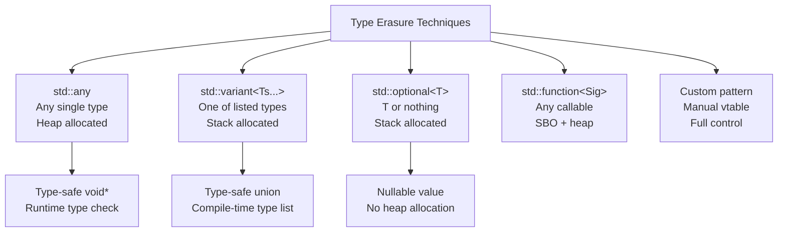
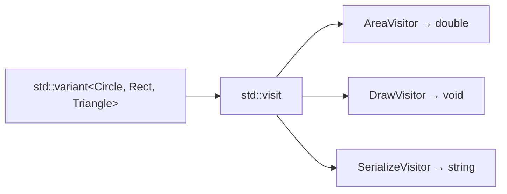
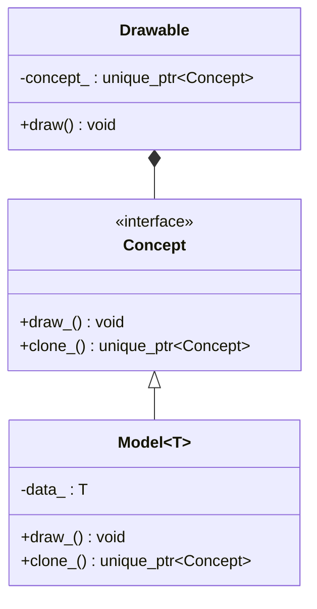
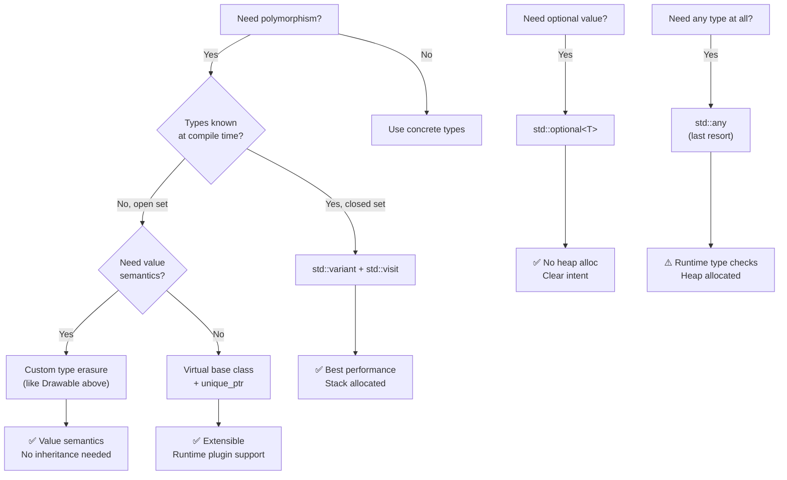

# Chapter 30: Type Erasure & Polymorphism Patterns

**Tags:** `#type-erasure` `#std-any` `#std-variant` `#std-optional` `#polymorphism` `#cpp17` `#cpp20` `#gpu-programming`

---

## Theory

Type erasure is a technique that hides concrete type information behind a uniform interface, enabling heterogeneous collections and flexible APIs without requiring inheritance hierarchies. Modern C++ provides three standard type-erased wrappers — `std::any`, `std::variant`, and `std::optional` — each solving different problems. Understanding when to use each, and how they compare to virtual dispatch, is essential for writing efficient, maintainable C++.

### What Is Type Erasure?

Type erasure allows storing objects of different types through a single interface without the user knowing the concrete type. The type information is "erased" from the public API but preserved internally for safe retrieval.

### Why Type Erasure Matters

| Problem | Type Erasure Solution |
|---|---|
| Need a heterogeneous collection | `std::variant` or `std::any` |
| Optional return values | `std::optional` |
| Callback storage without templates | `std::function` (type-erased callable) |
| Plugin architecture without vtables | Custom type erasure pattern |
| GPU kernel parameter passing | `std::variant` for heterogeneous params |

### How C++ Implements Type Erasure



---

## `std::any` — Type-Safe `void*`

`std::any` can hold a single value of any copy-constructible type. It's the type-safe replacement for `void*`.

```cpp
#include <any>
#include <iostream>
#include <string>
#include <vector>
#include <typeinfo>

int main() {
    std::any value;

    // Store different types
    value = 42;
    std::cout << "int: " << std::any_cast<int>(value) << "\n";

    value = std::string("hello");
    std::cout << "string: " << std::any_cast<std::string>(value) << "\n";

    value = 3.14;
    std::cout << "double: " << std::any_cast<double>(value) << "\n";

    // Type checking
    std::cout << "Type: " << value.type().name() << "\n";
    std::cout << "Has value: " << value.has_value() << "\n";

    // Safe cast (returns pointer, nullptr on mismatch)
    if (auto* p = std::any_cast<double>(&value))
        std::cout << "Got double: " << *p << "\n";

    if (auto* p = std::any_cast<int>(&value))
        std::cout << "Got int: " << *p << "\n";  // Not reached
    else
        std::cout << "Not an int\n";

    // Throws std::bad_any_cast on type mismatch
    try {
        auto s = std::any_cast<std::string>(value);
    } catch (const std::bad_any_cast& e) {
        std::cout << "Bad cast: " << e.what() << "\n";
    }

    // Heterogeneous container
    std::vector<std::any> bag = {42, 3.14, std::string("mixed"), true};
    for (const auto& item : bag) {
        if (item.type() == typeid(int))
            std::cout << "int: " << std::any_cast<int>(item) << "\n";
        else if (item.type() == typeid(double))
            std::cout << "double: " << std::any_cast<double>(item) << "\n";
        else if (item.type() == typeid(std::string))
            std::cout << "string: " << std::any_cast<std::string>(item) << "\n";
    }
}
```

### When to Use `std::any`

- Plugin systems where types are unknown at compile time
- Property bags / configuration stores
- Bridging C++ with dynamically-typed languages

### When NOT to Use `std::any`

- When the set of types is known → use `std::variant`
- When you need high performance → `std::any` involves heap allocation
- When you can use templates → direct typing is always faster

---

## `std::variant` — Type-Safe Union

`std::variant` holds exactly one value from a closed set of types. It's stack-allocated, cache-friendly, and supports the powerful `std::visit` pattern.

```cpp
#include <variant>
#include <string>
#include <iostream>
#include <vector>

using JsonValue = std::variant<
    std::nullptr_t,
    bool,
    int64_t,
    double,
    std::string
>;

// Overloaded pattern — essential for std::visit
template <class... Ts>
struct overloaded : Ts... { using Ts::operator()...; };

void print_json(const JsonValue& val) {
    std::visit(overloaded{
        [](std::nullptr_t)       { std::cout << "null"; },
        [](bool b)               { std::cout << (b ? "true" : "false"); },
        [](int64_t i)            { std::cout << i; },
        [](double d)             { std::cout << d; },
        [](const std::string& s) { std::cout << "\"" << s << "\""; }
    }, val);
    std::cout << "\n";
}

int main() {
    std::vector<JsonValue> json_array = {
        nullptr,
        true,
        int64_t{42},
        3.14,
        std::string("hello")
    };

    for (const auto& val : json_array)
        print_json(val);

    // Direct access
    JsonValue v = std::string("world");
    if (auto* s = std::get_if<std::string>(&v))
        std::cout << "String value: " << *s << "\n";

    // Index-based access
    std::cout << "Active index: " << v.index() << "\n";

    // Check type
    std::cout << "Holds string: " << std::holds_alternative<std::string>(v) << "\n";
}
```

---

## Visitor Pattern with `std::variant`



```cpp
#include <variant>
#include <cmath>
#include <numbers>
#include <iostream>
#include <string>
#include <vector>

struct Circle   { double radius; };
struct Rect     { double width, height; };
struct Triangle { double base, height; };

using Shape = std::variant<Circle, Rect, Triangle>;

template <class... Ts>
struct overloaded : Ts... { using Ts::operator()...; };

// Visitor 1: Compute area
double area(const Shape& s) {
    return std::visit(overloaded{
        [](const Circle& c)   { return std::numbers::pi * c.radius * c.radius; },
        [](const Rect& r)     { return r.width * r.height; },
        [](const Triangle& t) { return 0.5 * t.base * t.height; }
    }, s);
}

// Visitor 2: Serialize to string
std::string serialize(const Shape& s) {
    return std::visit(overloaded{
        [](const Circle& c)   { return "circle(r=" + std::to_string(c.radius) + ")"; },
        [](const Rect& r)     { return "rect(" + std::to_string(r.width) + "x" +
                                        std::to_string(r.height) + ")"; },
        [](const Triangle& t) { return "tri(b=" + std::to_string(t.base) + ",h=" +
                                        std::to_string(t.height) + ")"; }
    }, s);
}

// Visitor 3: Scale shape
Shape scale(const Shape& s, double factor) {
    return std::visit(overloaded{
        [factor](const Circle& c)   -> Shape { return Circle{c.radius * factor}; },
        [factor](const Rect& r)     -> Shape { return Rect{r.width * factor, r.height * factor}; },
        [factor](const Triangle& t) -> Shape { return Triangle{t.base * factor, t.height * factor}; }
    }, s);
}

int main() {
    std::vector<Shape> shapes = {
        Circle{5.0}, Rect{3.0, 4.0}, Triangle{6.0, 3.0}
    };

    for (const auto& s : shapes)
        std::cout << serialize(s) << " → area = " << area(s) << "\n";

    auto big = scale(shapes[0], 2.0);
    std::cout << "Scaled: " << serialize(big) << " → area = " << area(big) << "\n";
}
```

---

## `std::optional` — Nullable Value Types

```cpp
#include <optional>
#include <string>
#include <iostream>
#include <vector>
#include <algorithm>
#include <charconv>

// Return optional instead of using sentinel values or exceptions
std::optional<int> parse_int(std::string_view sv) {
    int result{};
    auto [ptr, ec] = std::from_chars(sv.data(), sv.data() + sv.size(), result);
    if (ec == std::errc{} && ptr == sv.data() + sv.size())
        return result;
    return std::nullopt;
}

// Chaining optionals (monadic operations in C++23)
std::optional<double> safe_divide(double a, double b) {
    if (b == 0.0) return std::nullopt;
    return a / b;
}

struct User {
    std::string name;
    std::optional<std::string> email;      // May not have email
    std::optional<int> age;                // May not have age
};

int main() {
    // Basic usage
    auto val = parse_int("42");
    if (val) std::cout << "Parsed: " << *val << "\n";

    auto bad = parse_int("abc");
    std::cout << "Has value: " << bad.has_value() << "\n";

    // value_or for defaults
    int x = parse_int("abc").value_or(-1);
    std::cout << "Default: " << x << "\n";

    // Optional struct fields
    User user{"Alice", "alice@example.com", 30};
    User anon{"Anonymous", std::nullopt, std::nullopt};

    auto print_user = [](const User& u) {
        std::cout << u.name;
        if (u.email) std::cout << " <" << *u.email << ">";
        if (u.age)   std::cout << " age " << *u.age;
        std::cout << "\n";
    };

    print_user(user);
    print_user(anon);

    // C++23 monadic operations
    // auto result = parse_int("42")
    //     .transform([](int x) { return x * 2; })
    //     .and_then([](int x) { return safe_divide(x, 3); })
    //     .or_else([] { return std::optional<double>{0.0}; });
}
```

---

## Virtual Dispatch vs Static Dispatch — Performance

```cpp
#include <chrono>
#include <vector>
#include <memory>
#include <variant>
#include <iostream>
#include <numeric>
#include <random>

// ============ Virtual Dispatch ============
struct ShapeVirtual {
    virtual ~ShapeVirtual() = default;
    virtual double area() const = 0;
};

struct CircleV : ShapeVirtual {
    double r;
    explicit CircleV(double r) : r(r) {}
    double area() const override { return 3.14159265 * r * r; }
};

struct RectV : ShapeVirtual {
    double w, h;
    RectV(double w, double h) : w(w), h(h) {}
    double area() const override { return w * h; }
};

// ============ Static Dispatch (variant) ============
struct CircleS { double r; };
struct RectS   { double w, h; };
using ShapeStatic = std::variant<CircleS, RectS>;

double area_static(const ShapeStatic& s) {
    return std::visit([](const auto& shape) -> double {
        using T = std::decay_t<decltype(shape)>;
        if constexpr (std::is_same_v<T, CircleS>)
            return 3.14159265 * shape.r * shape.r;
        else
            return shape.w * shape.h;
    }, s);
}

int main() {
    constexpr int N = 1'000'000;
    std::mt19937 rng(42);

    // Virtual dispatch benchmark
    std::vector<std::unique_ptr<ShapeVirtual>> virtual_shapes;
    for (int i = 0; i < N; ++i) {
        if (rng() % 2)
            virtual_shapes.push_back(std::make_unique<CircleV>(1.0 + (rng() % 100)));
        else
            virtual_shapes.push_back(std::make_unique<RectV>(1.0 + (rng() % 50), 1.0 + (rng() % 50)));
    }

    auto t1 = std::chrono::high_resolution_clock::now();
    double sum_v = 0;
    for (const auto& s : virtual_shapes) sum_v += s->area();
    auto t2 = std::chrono::high_resolution_clock::now();

    // Static dispatch benchmark
    rng.seed(42);
    std::vector<ShapeStatic> static_shapes;
    for (int i = 0; i < N; ++i) {
        if (rng() % 2)
            static_shapes.emplace_back(CircleS{1.0 + (rng() % 100)});
        else
            static_shapes.emplace_back(RectS{1.0 + (rng() % 50), 1.0 + (rng() % 50)});
    }

    auto t3 = std::chrono::high_resolution_clock::now();
    double sum_s = 0;
    for (const auto& s : static_shapes) sum_s += area_static(s);
    auto t4 = std::chrono::high_resolution_clock::now();

    auto ms = [](auto d) {
        return std::chrono::duration_cast<std::chrono::microseconds>(d).count();
    };

    std::cout << "Virtual dispatch: " << ms(t2 - t1) << " μs (sum=" << sum_v << ")\n";
    std::cout << "Static dispatch:  " << ms(t4 - t3) << " μs (sum=" << sum_s << ")\n";
    std::cout << "Variant is typically 2-5x faster due to cache locality\n";
}
```

---

## Type Erasure Pattern — `std::function` Internals

The type erasure pattern stores any type through a uniform interface using internal virtual dispatch:



```cpp
#include <iostream>
#include <memory>
#include <vector>
#include <string>

// Type-erased Drawable: stores ANY type that has a draw() method
class Drawable {
    // Internal interface
    struct Concept {
        virtual ~Concept() = default;
        virtual void draw_() const = 0;
        virtual std::unique_ptr<Concept> clone_() const = 0;
    };

    // Templated model wraps concrete types
    template <typename T>
    struct Model : Concept {
        T data_;
        explicit Model(T d) : data_(std::move(d)) {}
        void draw_() const override { data_.draw(); }
        std::unique_ptr<Concept> clone_() const override {
            return std::make_unique<Model>(data_);
        }
    };

    std::unique_ptr<Concept> self_;

public:
    template <typename T>
    Drawable(T x) : self_(std::make_unique<Model<T>>(std::move(x))) {}

    Drawable(const Drawable& other) : self_(other.self_->clone_()) {}
    Drawable(Drawable&&) noexcept = default;
    Drawable& operator=(const Drawable& other) {
        self_ = other.self_->clone_();
        return *this;
    }
    Drawable& operator=(Drawable&&) noexcept = default;

    void draw() const { self_->draw_(); }
};

// Concrete types — NO inheritance required!
struct Square {
    double side;
    void draw() const { std::cout << "Drawing square (" << side << ")\n"; }
};

struct TextLabel {
    std::string text;
    void draw() const { std::cout << "Drawing text: " << text << "\n"; }
};

struct Icon {
    std::string name;
    void draw() const { std::cout << "Drawing icon: " << name << "\n"; }
};

int main() {
    // Heterogeneous collection — no common base class needed!
    std::vector<Drawable> canvas;
    canvas.emplace_back(Square{5.0});
    canvas.emplace_back(TextLabel{"Hello"});
    canvas.emplace_back(Icon{"save"});

    for (const auto& d : canvas)
        d.draw();
}
```

---

## Decision Tree: When to Use Each



---

## Connection to GPU Programming

```cpp
#include <variant>
#include <vector>
#include <iostream>

// GPU kernel parameter types
struct MatMulParams   { int M, N, K; float alpha, beta; };
struct ConvParams     { int batch, channels, height, width, kernel_size; };
struct ReductionParams{ int size; int block_size; };

using KernelParams = std::variant<MatMulParams, ConvParams, ReductionParams>;

// Dispatch kernel based on parameter type
void launch_kernel(const KernelParams& params) {
    std::visit([](const auto& p) {
        using T = std::decay_t<decltype(p)>;
        if constexpr (std::is_same_v<T, MatMulParams>)
            std::cout << "Launching MatMul: " << p.M << "x" << p.N << "x" << p.K << "\n";
        else if constexpr (std::is_same_v<T, ConvParams>)
            std::cout << "Launching Conv: " << p.channels << "ch " << p.height << "x" << p.width << "\n";
        else
            std::cout << "Launching Reduction: " << p.size << " elements\n";
    }, params);
}

int main() {
    std::vector<KernelParams> work_queue = {
        MatMulParams{1024, 1024, 512, 1.0f, 0.0f},
        ConvParams{32, 64, 224, 224, 3},
        ReductionParams{1'000'000, 256}
    };

    for (const auto& params : work_queue)
        launch_kernel(params);
}
```

---

## Exercises

### 🟢 Beginner
1. Write a function returning `std::optional<double>` for safe square root (return `nullopt` for negative inputs).
2. Create a `std::vector<std::any>` holding five different types and print each with type checking.

### 🟡 Intermediate
3. Implement a JSON-like `Value` type using `std::variant` with null, bool, int, double, string, and `std::visit`-based serialization.
4. Create a simple event system using the type erasure pattern (not `std::function`) that accepts any callable.

### 🔴 Advanced
5. Implement a full type-erased `Printable` class that can store any type with an `operator<<` overload, using the Concept/Model pattern.
6. Benchmark virtual dispatch vs `std::variant` vs `std::any` for 10M operations and analyze cache behavior.

---

## Solutions

### Solution 1: Safe Square Root

```cpp
#include <optional>
#include <cmath>
#include <iostream>

std::optional<double> safe_sqrt(double x) {
    if (x < 0.0) return std::nullopt;
    return std::sqrt(x);
}

int main() {
    auto r1 = safe_sqrt(25.0);
    auto r2 = safe_sqrt(-1.0);

    if (r1) std::cout << "sqrt(25) = " << *r1 << "\n";
    std::cout << "sqrt(-1) = " << r2.value_or(-1.0) << " (default)\n";
}
```

### Solution 3: JSON-like Value Type

```cpp
#include <variant>
#include <string>
#include <iostream>

using JsonValue = std::variant<std::nullptr_t, bool, int, double, std::string>;

template <class... Ts> struct overloaded : Ts... { using Ts::operator()...; };

std::string to_json(const JsonValue& v) {
    return std::visit(overloaded{
        [](std::nullptr_t)       { return std::string("null"); },
        [](bool b)               { return std::string(b ? "true" : "false"); },
        [](int i)                { return std::to_string(i); },
        [](double d)             { return std::to_string(d); },
        [](const std::string& s) { return "\"" + s + "\""; }
    }, v);
}

int main() {
    JsonValue v1 = nullptr;
    JsonValue v2 = true;
    JsonValue v3 = 42;
    JsonValue v4 = 3.14;
    JsonValue v5 = std::string("hello");

    for (const auto& v : {v1, v2, v3, v4, v5})
        std::cout << to_json(v) << "\n";
}
```

---

## Quiz

**Q1:** What happens when you call `std::any_cast<int>` on an `std::any` holding a `double`?
**A:** It throws `std::bad_any_cast`. `std::any` uses exact type matching — no implicit conversions are performed.

**Q2:** What is the size of `std::variant<int, double, std::string>` approximately?
**A:** Approximately `sizeof(std::string) + alignment + discriminator` — the variant must be large enough to hold the largest alternative, plus a tag byte indicating which type is active. Typically 40-48 bytes.

**Q3:** Can `std::optional<T&>` hold a reference?
**A:** Not in C++17/20. `std::optional<T&>` is not supported because reference semantics conflict with optional's rebinding semantics. C++26 proposes `std::optional<T&>` support.

**Q4:** What is the "overloaded" pattern used with `std::visit`?
**A:** It's a utility that combines multiple lambdas into a single callable object by inheriting from all of them and using `using Ts::operator()...` to bring all call operators into scope. It enables multi-type visitation with clean syntax.

**Q5:** Why is `std::variant` typically faster than virtual dispatch?
**A:** Variant stores objects inline (stack-allocated), providing cache locality. Virtual dispatch requires heap-allocated objects accessed through pointers, causing cache misses. Additionally, `std::visit` can be optimized to a jump table rather than indirect function calls.

**Q6:** When would you choose custom type erasure over `std::variant`?
**A:** When the set of types is open-ended (unknown at compile time), when you need value semantics without inheritance, or when building a library API that shouldn't expose concrete types. `std::function` is itself a custom type erasure pattern.

---

## Key Takeaways

- `std::any` is a type-safe `void*` — use sparingly, prefer `std::variant` when possible
- `std::variant` provides compile-time type safety with zero heap allocation
- `std::optional` eliminates sentinel values and null pointer bugs
- The `overloaded` pattern + `std::visit` is the modern Visitor pattern
- Custom type erasure (Concept/Model) enables polymorphism without inheritance
- `std::variant` is typically 2-5x faster than virtual dispatch due to cache locality

---

## Chapter Summary

Type erasure in modern C++ offers a spectrum of solutions from `std::optional` (simplest) to custom type erasure patterns (most flexible). The key insight is matching the tool to the problem: closed type sets use `std::variant`, open type sets use virtual dispatch or custom type erasure, and truly unknown types use `std::any`. Understanding the performance implications — stack vs heap allocation, cache locality, and branch prediction — guides the right choice for each situation.

---

## Real-World Insight

In ML frameworks, `std::variant` is used to represent tensor data types (float16, float32, float64, int8, int32) without virtual dispatch overhead. PyTorch's internal `Scalar` type uses a similar pattern. For CUDA programming, variant-based kernel parameter dispatch avoids vtable lookups in host-side scheduling code, while `std::optional` represents optional kernel launch configurations (custom stream, optional graph capture).

---

## Common Mistakes

1. **Using `std::any` when types are known** — Always prefer `std::variant` for closed type sets
2. **Forgetting `std::get` throws `std::bad_variant_access`** — Use `std::get_if` for safe access
3. **Dereferencing empty `std::optional`** — Always check `has_value()` or use `value_or()`
4. **Not using the `overloaded` helper** — Writing visit lambdas without it is verbose and error-prone
5. **Assuming `std::any` is cheap** — It heap-allocates for types larger than the small buffer (typically 32 bytes)

---

## Interview Questions

**Q1: Compare `std::any`, `std::variant`, and `std::optional`. When would you use each?**
**A:** `std::optional<T>` represents "T or nothing" — use for nullable return values (e.g., lookup that might fail). `std::variant<Ts...>` represents "exactly one of these types" — use for closed type sets like JSON values or AST nodes. It's stack-allocated and type-safe. `std::any` represents "any copyable type" — use when types are truly unknown at compile time (plugin systems, property bags). It heap-allocates and requires runtime type checks. Preference order: `optional` > `variant` > `any`.

**Q2: Explain the type erasure pattern as used in `std::function`. Why is it useful?**
**A:** The pattern uses an internal abstract base class (Concept) and a templated derived class (Model) that wraps any concrete type. The outer class holds a `unique_ptr<Concept>` and delegates calls through it. This allows storing any type meeting an interface (e.g., any callable for `std::function`) without the stored type inheriting from anything. Benefits: value semantics, no intrusive base class requirement, and clean public API. Cost: heap allocation and virtual dispatch internally.

**Q3: Why is `std::variant` faster than a `vector<unique_ptr<Base>>` for polymorphism?**
**A:** Three reasons: (1) **Cache locality** — variant objects are stored inline in contiguous memory (no pointer chasing), (2) **No heap allocation** — variant is stack-allocated with the size of its largest alternative, (3) **Branch prediction** — `std::visit` typically compiles to a jump table or if-else chain on the discriminator, which is more predictable than indirect function calls through vtables. The trade-off is that variant requires a closed set of types known at compile time.

**Q4: How does `std::optional` relate to GPU programming patterns?**
**A:** In CUDA host code, `std::optional` represents optional kernel configuration: optional custom CUDA stream, optional launch bounds, optional graph capture context. It replaces the C-style pattern of using `nullptr` or `-1` as sentinel values. On the device side, while `std::optional` isn't available in device code, similar patterns are implemented with boolean flags + value pairs for optional kernel parameters.
