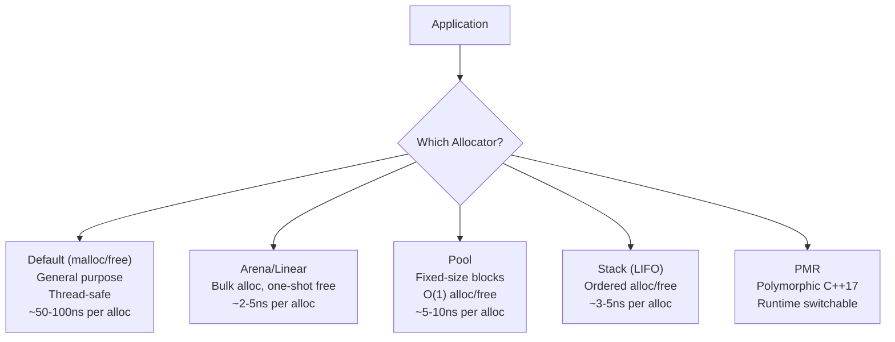
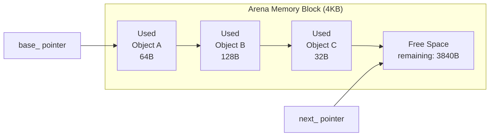
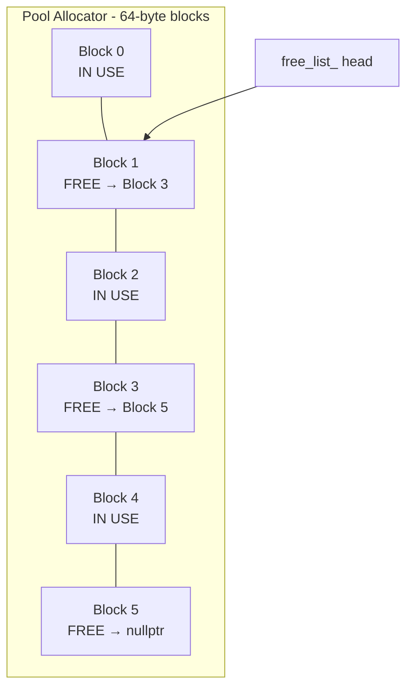
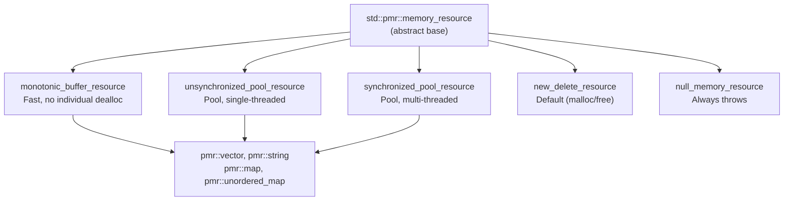

# Chapter 31: Custom Allocators & Memory Pools

**Tags:** `#allocators` `#memory-pools` `#pmr` `#cpp17` `#cpp20` `#game-engines` `#hft` `#embedded` `#performance`

---

## Theory

Custom allocators give programs explicit control over how and where memory is allocated. The default `new`/`delete` (backed by `malloc`/`free`) is a general-purpose allocator optimized for the average case — it handles any size, from any thread, with minimal fragmentation. But "general-purpose" means "optimal for nobody." Custom allocators exploit application-specific allocation patterns to achieve dramatically better performance, determinism, and memory efficiency.

### What Are Custom Allocators?

A custom allocator replaces the default memory allocation strategy with one tailored to a specific usage pattern. Instead of requesting memory from the OS for every allocation, allocators pre-allocate large blocks and subdivide them according to rules that match the application's behavior.

### Why Custom Allocators?

| Reason | Explanation |
|---|---|
| **Performance** | Arena allocators are 10-100x faster than `malloc` for bulk allocations |
| **Determinism** | Pool allocators have O(1) allocation time — critical for real-time systems |
| **Cache locality** | Allocating related objects from contiguous memory improves cache hit rates |
| **Debugging** | Custom allocators can track leaks, overwrites, and use-after-free |
| **Fragmentation** | Specialized allocators eliminate fragmentation for known patterns |
| **Memory budgets** | Game engines allocate fixed budgets per subsystem |

### How Allocators Work



---

## Allocator Interface

The C++ allocator interface has been simplified over the years. A minimal C++17 allocator requires:

```cpp
#include <cstddef>
#include <memory>
#include <iostream>
#include <vector>

template <typename T>
class SimpleAllocator {
public:
    using value_type = T;

    SimpleAllocator() noexcept = default;

    template <typename U>
    SimpleAllocator(const SimpleAllocator<U>&) noexcept {}

    T* allocate(std::size_t n) {
        std::cout << "Allocating " << n << " x " << sizeof(T) << " bytes\n";
        if (n > std::size_t(-1) / sizeof(T))
            throw std::bad_alloc();
        auto p = static_cast<T*>(::operator new(n * sizeof(T)));
        return p;
    }

    void deallocate(T* p, std::size_t n) noexcept {
        std::cout << "Deallocating " << n << " x " << sizeof(T) << " bytes\n";
        ::operator delete(p);
    }

    // C++17: these are optional (defaults provided by allocator_traits)
    // construct, destroy, max_size — all handled by std::allocator_traits
};

template <typename T, typename U>
bool operator==(const SimpleAllocator<T>&, const SimpleAllocator<U>&) noexcept {
    return true;
}

int main() {
    std::vector<int, SimpleAllocator<int>> v;
    v.push_back(1);
    v.push_back(2);
    v.push_back(3);
    // Observe allocation/deallocation pattern
}
```

---

## Arena / Linear Allocator

The simplest and fastest allocator. Allocations advance a pointer; individual `deallocate` is a no-op. All memory is freed at once by resetting the pointer.



```cpp
#include <cstddef>
#include <cstdlib>
#include <cassert>
#include <iostream>
#include <memory>
#include <new>
#include <vector>

class ArenaAllocator {
    char* base_;
    char* next_;
    char* end_;

public:
    explicit ArenaAllocator(std::size_t size)
        : base_(static_cast<char*>(std::malloc(size)))
        , next_(base_)
        , end_(base_ + size) {
        if (!base_) throw std::bad_alloc();
    }

    ~ArenaAllocator() { std::free(base_); }

    // Non-copyable, non-movable
    ArenaAllocator(const ArenaAllocator&) = delete;
    ArenaAllocator& operator=(const ArenaAllocator&) = delete;

    void* allocate(std::size_t size, std::size_t alignment = alignof(std::max_align_t)) {
        // Align the next pointer
        std::size_t space = static_cast<std::size_t>(end_ - next_);
        void* aligned = next_;
        if (!std::align(alignment, size, aligned, space))
            throw std::bad_alloc();

        next_ = static_cast<char*>(aligned) + size;
        return aligned;
    }

    void deallocate(void* /*ptr*/, std::size_t /*size*/) noexcept {
        // No-op: arena frees everything at once
    }

    void reset() noexcept { next_ = base_; }

    std::size_t used() const noexcept {
        return static_cast<std::size_t>(next_ - base_);
    }
    std::size_t capacity() const noexcept {
        return static_cast<std::size_t>(end_ - base_);
    }
};

// STL-compatible wrapper
template <typename T>
class ArenaSTLAllocator {
    ArenaAllocator* arena_;
public:
    using value_type = T;

    explicit ArenaSTLAllocator(ArenaAllocator& arena) noexcept : arena_(&arena) {}

    template <typename U>
    ArenaSTLAllocator(const ArenaSTLAllocator<U>& other) noexcept
        : arena_(other.arena()) {}

    ArenaAllocator* arena() const noexcept { return arena_; }

    T* allocate(std::size_t n) {
        return static_cast<T*>(arena_->allocate(n * sizeof(T), alignof(T)));
    }

    void deallocate(T* p, std::size_t n) noexcept {
        arena_->deallocate(p, n * sizeof(T));
    }
};

template <typename T, typename U>
bool operator==(const ArenaSTLAllocator<T>& a, const ArenaSTLAllocator<U>& b) noexcept {
    return a.arena() == b.arena();
}

int main() {
    ArenaAllocator arena(4096);

    // Manual allocation
    auto* data = static_cast<int*>(arena.allocate(sizeof(int) * 10, alignof(int)));
    for (int i = 0; i < 10; ++i)
        data[i] = i * i;

    std::cout << "Used: " << arena.used() << " / " << arena.capacity() << " bytes\n";

    // With STL container
    ArenaSTLAllocator<int> alloc(arena);
    std::vector<int, ArenaSTLAllocator<int>> vec(alloc);
    vec.reserve(100);
    for (int i = 0; i < 100; ++i)
        vec.push_back(i);

    std::cout << "After vector: " << arena.used() << " / " << arena.capacity() << " bytes\n";

    arena.reset();
    std::cout << "After reset: " << arena.used() << " / " << arena.capacity() << " bytes\n";
}
```

---

## Pool Allocator (Fixed-Size Blocks)

Allocates and frees fixed-size blocks in O(1) using a free list.



```cpp
#include <cstddef>
#include <cstdlib>
#include <cassert>
#include <iostream>
#include <vector>
#include <new>

class PoolAllocator {
    struct FreeBlock {
        FreeBlock* next;
    };

    char* memory_;
    FreeBlock* free_list_;
    std::size_t block_size_;
    std::size_t block_count_;

public:
    PoolAllocator(std::size_t block_size, std::size_t block_count)
        : block_size_(std::max(block_size, sizeof(FreeBlock)))
        , block_count_(block_count)
        , free_list_(nullptr) {
        memory_ = static_cast<char*>(std::malloc(block_size_ * block_count_));
        if (!memory_) throw std::bad_alloc();

        // Initialize free list
        free_list_ = reinterpret_cast<FreeBlock*>(memory_);
        auto* current = free_list_;
        for (std::size_t i = 0; i < block_count_ - 1; ++i) {
            auto* next_block = reinterpret_cast<FreeBlock*>(
                reinterpret_cast<char*>(current) + block_size_);
            current->next = next_block;
            current = next_block;
        }
        current->next = nullptr;
    }

    ~PoolAllocator() { std::free(memory_); }

    PoolAllocator(const PoolAllocator&) = delete;
    PoolAllocator& operator=(const PoolAllocator&) = delete;

    void* allocate() {
        if (!free_list_) throw std::bad_alloc();
        void* block = free_list_;
        free_list_ = free_list_->next;
        return block;
    }

    void deallocate(void* ptr) noexcept {
        auto* block = static_cast<FreeBlock*>(ptr);
        block->next = free_list_;
        free_list_ = block;
    }

    bool is_full() const noexcept { return free_list_ == nullptr; }
};

struct Particle {
    float x, y, z;
    float vx, vy, vz;
    float life;
    int type;
};

int main() {
    constexpr std::size_t MAX_PARTICLES = 10000;
    PoolAllocator pool(sizeof(Particle), MAX_PARTICLES);

    std::vector<Particle*> active;
    active.reserve(MAX_PARTICLES);

    // Allocate particles
    for (int i = 0; i < 1000; ++i) {
        auto* p = static_cast<Particle*>(pool.allocate());
        *p = Particle{
            static_cast<float>(i), 0.0f, 0.0f,
            1.0f, 2.0f, 0.0f,
            1.0f, i % 3
        };
        active.push_back(p);
    }

    std::cout << "Allocated " << active.size() << " particles\n";

    // Free half
    for (std::size_t i = 0; i < active.size(); i += 2)
        pool.deallocate(active[i]);

    // Reallocate — reuses freed blocks
    auto* p = static_cast<Particle*>(pool.allocate());
    std::cout << "Reallocated particle at: " << p << "\n";
}
```

---

## Stack Allocator (LIFO)

A stack allocator allows freeing in reverse order of allocation. It's faster than a pool for tree-structured lifetimes.

```cpp
#include <cstddef>
#include <cstdlib>
#include <cassert>
#include <iostream>
#include <new>

class StackAllocator {
    char* base_;
    char* top_;
    char* end_;

public:
    using Marker = char*;

    explicit StackAllocator(std::size_t size)
        : base_(static_cast<char*>(std::malloc(size)))
        , top_(base_)
        , end_(base_ + size) {
        if (!base_) throw std::bad_alloc();
    }

    ~StackAllocator() { std::free(base_); }

    void* allocate(std::size_t size, std::size_t alignment = alignof(std::max_align_t)) {
        std::size_t space = static_cast<std::size_t>(end_ - top_);
        void* aligned = top_;
        if (!std::align(alignment, size, aligned, space))
            throw std::bad_alloc();
        top_ = static_cast<char*>(aligned) + size;
        return aligned;
    }

    // Save current position
    Marker mark() const noexcept { return top_; }

    // Free everything allocated after the marker
    void free_to_marker(Marker marker) noexcept {
        assert(marker >= base_ && marker <= top_);
        top_ = marker;
    }

    void reset() noexcept { top_ = base_; }

    std::size_t used() const noexcept {
        return static_cast<std::size_t>(top_ - base_);
    }
};

int main() {
    StackAllocator stack(4096);

    // Frame-based allocation (game loop pattern)
    for (int frame = 0; frame < 3; ++frame) {
        auto frame_marker = stack.mark();

        // Allocate per-frame scratch data
        auto* positions = static_cast<float*>(
            stack.allocate(100 * sizeof(float), alignof(float)));
        auto* indices = static_cast<int*>(
            stack.allocate(50 * sizeof(int), alignof(int)));

        std::cout << "Frame " << frame << ": used " << stack.used() << " bytes\n";

        // End of frame — free all frame allocations
        stack.free_to_marker(frame_marker);
        std::cout << "After free: used " << stack.used() << " bytes\n";
    }
}
```

---

## PMR (Polymorphic Memory Resources) — C++17

PMR provides a standard, runtime-switchable allocator interface without infecting container types with allocator template parameters.



```cpp
#include <memory_resource>
#include <vector>
#include <string>
#include <iostream>
#include <array>

int main() {
    // Stack-allocated buffer for zero-heap PMR
    std::array<std::byte, 4096> buffer;
    std::pmr::monotonic_buffer_resource pool(
        buffer.data(), buffer.size(),
        std::pmr::null_memory_resource()  // Fail if buffer exhausted
    );

    // PMR vector uses our stack buffer — no heap allocation!
    std::pmr::vector<int> vec(&pool);
    for (int i = 0; i < 100; ++i)
        vec.push_back(i);

    std::cout << "Vector size: " << vec.size() << "\n";
    std::cout << "All allocated from stack buffer (4KB)\n";

    // PMR string also uses the same pool
    std::pmr::string str("Hello, PMR world!", &pool);
    std::cout << str << "\n";

    // Nested containers share the same resource
    std::pmr::vector<std::pmr::string> names(&pool);
    names.emplace_back("Alice");
    names.emplace_back("Bob");
    names.emplace_back("Charlie");

    for (const auto& name : names)
        std::cout << name << " ";
    std::cout << "\n";
}
```

### Pool Resource for Variable-Size Allocations

This example benchmarks a standard `std::list` against a `std::pmr::list` backed by an `unsynchronized_pool_resource`. The pool resource pre-allocates memory in chunks and recycles freed blocks, which dramatically reduces the cost of frequent small allocations that linked lists require. Running this benchmark shows how PMR can speed up node-based containers with zero code changes beyond swapping the allocator.

```cpp
#include <memory_resource>
#include <vector>
#include <list>
#include <iostream>
#include <chrono>

void benchmark_pmr() {
    constexpr int N = 100'000;

    // Default allocator
    auto t1 = std::chrono::high_resolution_clock::now();
    {
        std::list<int> lst;
        for (int i = 0; i < N; ++i)
            lst.push_back(i);
    }
    auto t2 = std::chrono::high_resolution_clock::now();

    // PMR with pool resource
    auto t3 = std::chrono::high_resolution_clock::now();
    {
        std::pmr::unsynchronized_pool_resource pool;
        std::pmr::list<int> lst(&pool);
        for (int i = 0; i < N; ++i)
            lst.push_back(i);
    }
    auto t4 = std::chrono::high_resolution_clock::now();

    auto ms = [](auto d) {
        return std::chrono::duration_cast<std::chrono::microseconds>(d).count();
    };

    std::cout << "std::list:      " << ms(t2 - t1) << " μs\n";
    std::cout << "pmr::list:      " << ms(t4 - t3) << " μs\n";
}

int main() {
    benchmark_pmr();
}
```

---

## Allocator-Aware Containers

This code builds a `TrackingResource`—a custom PMR memory resource that wraps any upstream allocator and records every allocation and deallocation. It then uses this resource with `pmr::vector`, `pmr::map`, and `pmr::string` to show exactly how many bytes each container requests. This pattern is invaluable for profiling real applications to understand where memory is going.

```cpp
#include <memory_resource>
#include <vector>
#include <map>
#include <string>
#include <iostream>

// Custom memory resource that tracks allocations
class TrackingResource : public std::pmr::memory_resource {
    std::pmr::memory_resource* upstream_;
    std::size_t allocated_ = 0;
    std::size_t deallocated_ = 0;
    int alloc_count_ = 0;

protected:
    void* do_allocate(std::size_t bytes, std::size_t alignment) override {
        allocated_ += bytes;
        ++alloc_count_;
        return upstream_->allocate(bytes, alignment);
    }

    void do_deallocate(void* p, std::size_t bytes, std::size_t alignment) override {
        deallocated_ += bytes;
        upstream_->deallocate(p, bytes, alignment);
    }

    bool do_is_equal(const std::pmr::memory_resource& other) const noexcept override {
        return this == &other;
    }

public:
    explicit TrackingResource(std::pmr::memory_resource* upstream =
                               std::pmr::get_default_resource())
        : upstream_(upstream) {}

    void report() const {
        std::cout << "Allocations: " << alloc_count_
                  << " | Allocated: " << allocated_
                  << " | Deallocated: " << deallocated_
                  << " | Net: " << (allocated_ - deallocated_) << " bytes\n";
    }
};

int main() {
    TrackingResource tracker;

    {
        std::pmr::vector<std::pmr::string> names(&tracker);
        names.emplace_back("Alice");
        names.emplace_back("Bob");
        names.emplace_back("Charlie");
        names.emplace_back("Diana");
        names.emplace_back("Eve");

        std::cout << "After adding 5 names:\n";
        tracker.report();

        std::pmr::map<std::pmr::string, int> scores(&tracker);
        scores["Alice"] = 95;
        scores["Bob"] = 87;

        std::cout << "After adding map entries:\n";
        tracker.report();
    }

    std::cout << "After cleanup:\n";
    tracker.report();
}
```

---

## Real-World Applications

### Game Engine Frame Allocator

This implements a frame allocator commonly used in game engines. It pre-allocates a large block of memory (1 MB here) and hands out pieces by bumping a pointer forward, just like an arena allocator. At the start of each frame, `begin_frame()` resets the pointer back to the beginning, instantly "freeing" all memory from the previous frame with zero overhead. This avoids calling `new`/`delete` thousands of times per frame for temporary objects like render commands.

```cpp
#include <cstddef>
#include <cstdlib>
#include <iostream>
#include <new>

class FrameAllocator {
    char* memory_;
    char* current_;
    std::size_t capacity_;

public:
    explicit FrameAllocator(std::size_t capacity)
        : memory_(static_cast<char*>(std::malloc(capacity)))
        , current_(memory_)
        , capacity_(capacity) {
        if (!memory_) throw std::bad_alloc();
    }

    ~FrameAllocator() { std::free(memory_); }

    template <typename T, typename... Args>
    T* create(Args&&... args) {
        void* ptr = allocate(sizeof(T), alignof(T));
        return new (ptr) T(std::forward<Args>(args)...);
    }

    void* allocate(std::size_t size, std::size_t align) {
        std::size_t space = capacity_ - static_cast<std::size_t>(current_ - memory_);
        void* ptr = current_;
        if (!std::align(align, size, ptr, space))
            throw std::bad_alloc();
        current_ = static_cast<char*>(ptr) + size;
        return ptr;
    }

    void begin_frame() { current_ = memory_; }

    std::size_t used() const {
        return static_cast<std::size_t>(current_ - memory_);
    }
};

struct RenderCommand {
    int mesh_id;
    float transform[16];
    int material_id;
};

int main() {
    FrameAllocator frame(1024 * 1024); // 1 MB per frame

    for (int f = 0; f < 3; ++f) {
        frame.begin_frame();

        for (int i = 0; i < 100; ++i) {
            auto* cmd = frame.create<RenderCommand>();
            cmd->mesh_id = i;
            cmd->material_id = i % 10;
        }

        std::cout << "Frame " << f << ": " << frame.used() << " bytes used\n";
    }
}
```

---

## Exercises

### 🟢 Beginner
1. Write a `SimpleAllocator<T>` that logs every allocation and deallocation with sizes. Use it with `std::vector`.
2. Use `std::pmr::monotonic_buffer_resource` with a stack buffer to allocate a `pmr::vector<int>` with zero heap usage.

### 🟡 Intermediate
3. Implement a `PoolAllocator` for `sizeof(double)` blocks. Benchmark it against `new`/`delete` for 1M allocations.
4. Create a `TrackingResource` (PMR) that detects memory leaks by comparing allocations and deallocations.

### 🔴 Advanced
5. Implement a thread-safe pool allocator using `std::atomic` for the free-list head (lock-free).
6. Build a slab allocator that manages multiple size classes (8, 16, 32, 64, 128 bytes) and routes allocations to the appropriate pool.

---

## Solutions

### Solution 1: Logging Allocator

This custom allocator wraps the global `operator new`/`operator delete` and prints a message every time memory is allocated or freed. When plugged into `std::vector`, it reveals the internal growth strategy—you can see the vector doubling its capacity and deallocating the old buffer as elements are added.

```cpp
#include <cstddef>
#include <iostream>
#include <vector>

template <typename T>
class LogAllocator {
public:
    using value_type = T;
    LogAllocator() noexcept = default;
    template <typename U>
    LogAllocator(const LogAllocator<U>&) noexcept {}

    T* allocate(std::size_t n) {
        std::cout << "[ALLOC] " << n * sizeof(T) << " bytes for "
                  << n << " x " << typeid(T).name() << "\n";
        return static_cast<T*>(::operator new(n * sizeof(T)));
    }
    void deallocate(T* p, std::size_t n) noexcept {
        std::cout << "[FREE]  " << n * sizeof(T) << " bytes\n";
        ::operator delete(p);
    }
};

template <typename T, typename U>
bool operator==(const LogAllocator<T>&, const LogAllocator<U>&) { return true; }

int main() {
    std::vector<int, LogAllocator<int>> v;
    for (int i = 0; i < 10; ++i)
        v.push_back(i);
}
```

### Solution 2: Zero-Heap PMR

This demonstrates how to use PMR with a stack-allocated buffer so that no heap allocation ever occurs. A 1024-byte `std::array` on the stack serves as the backing memory, and `null_memory_resource()` is set as the upstream—meaning if the buffer runs out, allocation throws instead of falling back to the heap. This technique is ideal for embedded systems or real-time code where heap usage is forbidden.

```cpp
#include <memory_resource>
#include <vector>
#include <array>
#include <iostream>

int main() {
    std::array<std::byte, 1024> buf;
    std::pmr::monotonic_buffer_resource pool(
        buf.data(), buf.size(), std::pmr::null_memory_resource());
    std::pmr::vector<int> v(&pool);
    for (int i = 0; i < 50; ++i) v.push_back(i);
    std::cout << "Size: " << v.size() << " (no heap used)\n";
}
```

---

## Quiz

**Q1:** What is the time complexity of allocation in an arena allocator?
**A:** O(1) — it simply advances a pointer (with alignment adjustment). This makes it the fastest possible allocator.

**Q2:** Why can't you free individual allocations in an arena allocator?
**A:** The arena doesn't track individual allocations — it only knows the current position of the next-allocation pointer. Freeing in the middle would create an unusable gap since there's no free-list mechanism.

**Q3:** What is the advantage of `std::pmr` over traditional C++ allocators?
**A:** PMR allocators are type-erased — `std::pmr::vector<int>` is always the same type regardless of which memory resource backs it. Traditional allocators are part of the container's type (`vector<int, MyAlloc<int>>`), making different-allocator containers incompatible.

**Q4:** When would you use a pool allocator vs an arena allocator?
**A:** Use a pool when you need to allocate AND free individual fixed-size objects frequently (e.g., game entity components). Use an arena when you allocate many objects and free them all at once (e.g., per-frame scratch data, request processing).

**Q5:** What does `std::pmr::null_memory_resource()` do?
**A:** It returns a memory resource that always throws `std::bad_alloc`. It's used as an upstream resource to ensure a pool never falls back to heap allocation — useful for debugging and embedded systems.

**Q6:** How do custom allocators improve cache performance?
**A:** By allocating related objects from contiguous memory, they ensure that iterating over those objects loads adjacent cache lines. Default `malloc` may scatter objects across the heap, causing cache misses during traversal.

---

## Key Takeaways

- Custom allocators exploit known allocation patterns for 10-100x speedups
- **Arena**: fastest, no individual free, ideal for batch-then-discard patterns
- **Pool**: O(1) alloc/free for fixed-size objects, ideal for game entities
- **Stack**: LIFO ordering, ideal for hierarchical/scoped allocations
- **PMR**: Standard C++17 type-erased allocator interface — prefer for new code
- `monotonic_buffer_resource` + stack buffer = zero-heap allocation
- Always benchmark: custom allocators only help when allocation is a real bottleneck

---

## Chapter Summary

Custom allocators replace the general-purpose `malloc`/`free` with strategies tailored to specific allocation patterns. Arena allocators give near-zero-cost allocation for batch workloads. Pool allocators provide O(1) fixed-size allocation/deallocation. Stack allocators handle hierarchical lifetimes. C++17's PMR provides a standardized, type-erased interface that makes switching allocators at runtime possible without changing container types. The choice of allocator depends on the allocation pattern: size uniformity, lifetime grouping, and free order.

---

## Real-World Insight

**Game Engines** (Unreal, Unity internals): Use frame allocators that reset every tick, pool allocators for entities/components, and stack allocators for temporary render data. **HFT Systems**: Use lock-free pool allocators for order book entries where deterministic O(1) allocation prevents latency spikes. **Embedded Systems**: Use arena allocators with fixed-size buffers to avoid heap fragmentation on devices with limited memory. **CUDA**: `cudaMallocAsync` with CUDA memory pools mirrors the pool allocator pattern on GPU, and `thrust`'s caching allocator reuses device memory.

---

## Common Mistakes

1. **Writing custom allocators without profiling first** — Default `malloc` is highly optimized; only customize when it's a proven bottleneck
2. **Forgetting alignment in arena allocators** — Misaligned access causes crashes on some platforms and performance penalties on all
3. **Not handling pool exhaustion** — Always have a fallback or error strategy when the pool runs out
4. **Making allocators stateful without proper equality semantics** — STL requires `a1 == a2` to mean memory from `a1` can be freed by `a2`
5. **Ignoring PMR** — Writing custom allocator templates when `std::pmr` already provides the abstraction

---

## Interview Questions

**Q1: What is a memory pool allocator and when would you use one?**
**A:** A pool allocator pre-allocates a large block and divides it into fixed-size chunks linked in a free list. Allocation pops from the free list (O(1)), deallocation pushes back (O(1)). Use it when you frequently allocate and free objects of the same size — game entity components, network packets, tree nodes. It eliminates fragmentation for uniform-size allocations and provides deterministic allocation time, critical for real-time systems.

**Q2: Explain the difference between arena (linear) and pool allocators.**
**A:** Arena: advances a pointer for each allocation, no individual free, reset frees everything. Best for "allocate many, free all at once" patterns (per-frame game data, request processing). Pool: maintains a free list of fixed-size blocks, supports individual alloc and free in O(1). Best for "allocate and free individual objects of the same size" patterns (entities, nodes). Arena is simpler and faster for allocation but cannot reclaim individual objects.

**Q3: What is PMR and how does it improve on traditional C++ allocators?**
**A:** Polymorphic Memory Resources (C++17) use runtime polymorphism (`std::pmr::memory_resource` base class) instead of template parameters for allocators. This means `std::pmr::vector<int>` is always the same type regardless of the backing resource. Benefits: containers with different allocators are the same type (can be passed to the same function), allocator can be changed at runtime, and nested containers automatically propagate the memory resource. The trade-off is one virtual function call per allocation.

**Q4: How do custom allocators relate to GPU memory management?**
**A:** CUDA's `cudaMallocAsync` and stream-ordered allocation APIs implement pool allocator semantics on the GPU — they pre-allocate device memory and recycle it without expensive OS calls. CUDA's caching allocator (used by PyTorch/cuDNN) is essentially a slab allocator with multiple size classes. Understanding CPU custom allocator patterns directly maps to GPU memory management strategies: pools for frequent same-size allocations, arenas for per-kernel scratch memory.
