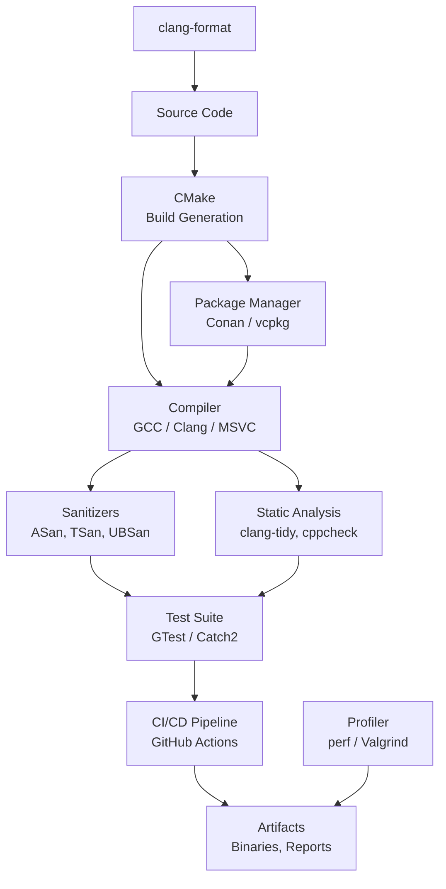
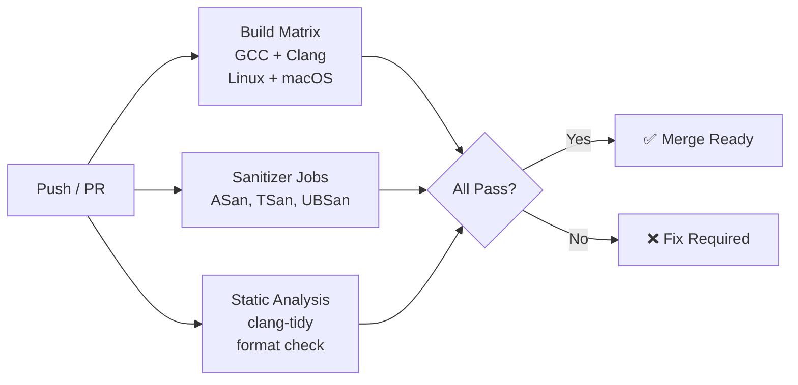

# Chapter 32: Build Systems & Tooling

**Tags:** `#cmake` `#conan` `#vcpkg` `#sanitizers` `#clang-tidy` `#profiling` `#ci-cd` `#cpp20` `#build-systems`

---

## Theory

A professional C++ project requires far more than just a compiler. Build systems manage compilation across platforms, package managers handle dependencies, sanitizers catch memory and threading bugs, static analyzers find defects before runtime, profilers identify performance bottlenecks, and CI/CD pipelines ensure every commit is validated. Mastering this toolchain is what separates hobby projects from production-grade software.

### What Is a Build System?

A build system automates the process of compiling source code, linking libraries, running tests, and packaging artifacts. It handles dependency tracking, incremental builds, and cross-platform configuration.

### Why Tooling Matters

| Tool Category | Without It | With It |
|---|---|---|
| Build System | Manual compilation, brittle scripts | Reproducible, incremental builds |
| Package Manager | Manual dependency download & version tracking | Automated dependency resolution |
| Sanitizers | Silent UB, hard-to-debug crashes | Runtime detection of memory/thread bugs |
| Static Analysis | Bugs found in production | Bugs caught at build time |
| Profiler | Guessing where bottlenecks are | Data-driven optimization |
| CI/CD | "Works on my machine" | Every commit validated automatically |

### How Modern C++ Tooling Fits Together



---

## CMake Deep-Dive

### Modern CMake: Targets and Properties

```cmake
cmake_minimum_required(VERSION 3.20)
project(MyProject VERSION 1.0.0 LANGUAGES CXX)

# Global settings
set(CMAKE_CXX_STANDARD 20)
set(CMAKE_CXX_STANDARD_REQUIRED ON)
set(CMAKE_CXX_EXTENSIONS OFF)
set(CMAKE_EXPORT_COMPILE_COMMANDS ON)  # For clang-tidy

# Library target
add_library(mylib
    src/core/engine.cpp
    src/core/parser.cpp
    src/utils/logger.cpp
)

# Modern CMake: use target properties, not global variables
target_include_directories(mylib
    PUBLIC  ${CMAKE_CURRENT_SOURCE_DIR}/include
    PRIVATE ${CMAKE_CURRENT_SOURCE_DIR}/src
)

target_compile_features(mylib PUBLIC cxx_std_20)

target_compile_options(mylib PRIVATE
    $<$<CXX_COMPILER_ID:GNU,Clang>:-Wall -Wextra -Wpedantic -Werror>
    $<$<CXX_COMPILER_ID:MSVC>:/W4 /WX>
)

# Executable target
add_executable(myapp src/main.cpp)
target_link_libraries(myapp PRIVATE mylib)

# Testing
enable_testing()
add_executable(tests
    tests/test_engine.cpp
    tests/test_parser.cpp
)
target_link_libraries(tests PRIVATE mylib)
add_test(NAME unit_tests COMMAND tests)
```

### CMake Presets (CMakePresets.json)

```json
{
    "version": 6,
    "cmakeMinimumRequired": { "major": 3, "minor": 25, "patch": 0 },
    "configurePresets": [
        {
            "name": "default",
            "displayName": "Default Release",
            "generator": "Ninja",
            "binaryDir": "${sourceDir}/build/${presetName}",
            "cacheVariables": {
                "CMAKE_BUILD_TYPE": "Release",
                "CMAKE_CXX_STANDARD": "20"
            }
        },
        {
            "name": "debug",
            "displayName": "Debug with Sanitizers",
            "inherits": "default",
            "cacheVariables": {
                "CMAKE_BUILD_TYPE": "Debug",
                "CMAKE_CXX_FLAGS": "-fsanitize=address,undefined -fno-omit-frame-pointer"
            }
        },
        {
            "name": "ci",
            "displayName": "CI Build",
            "inherits": "default",
            "cacheVariables": {
                "CMAKE_BUILD_TYPE": "RelWithDebInfo",
                "BUILD_TESTING": "ON"
            }
        }
    ],
    "buildPresets": [
        { "name": "default", "configurePreset": "default" },
        { "name": "debug",   "configurePreset": "debug" },
        { "name": "ci",      "configurePreset": "ci" }
    ],
    "testPresets": [
        {
            "name": "ci",
            "configurePreset": "ci",
            "output": { "outputOnFailure": true }
        }
    ]
}
```

```bash
# Using presets
cmake --preset=debug
cmake --build --preset=debug
ctest --preset=ci
```

### CMake for C++20 Modules

```cmake
cmake_minimum_required(VERSION 3.28)
project(ModulesDemo LANGUAGES CXX)

set(CMAKE_CXX_STANDARD 20)
set(CMAKE_CXX_STANDARD_REQUIRED ON)

# C++20 modules support (CMake 3.28+)
add_library(math_module)
target_sources(math_module
    PUBLIC FILE_SET CXX_MODULES FILES
        src/math.cppm         # Module interface unit
)

add_executable(app src/main.cpp)
target_link_libraries(app PRIVATE math_module)
```

Module interface file (`src/math.cppm`):

```cpp
// math.cppm — C++20 module interface
export module math;

export namespace math {
    constexpr double pi = 3.14159265358979323846;

    constexpr double square(double x) { return x * x; }

    constexpr double circle_area(double radius) {
        return pi * square(radius);
    }
}
```

Consumer (`src/main.cpp`):

```cpp
import math;
#include <iostream>

int main() {
    std::cout << "Area: " << math::circle_area(5.0) << "\n";
}
```

---

## Package Managers

### Conan

```bash
# Install Conan
pip install conan

# Create conanfile.txt
cat > conanfile.txt << 'EOF'
[requires]
fmt/10.1.1
spdlog/1.12.0
nlohmann_json/3.11.2
gtest/1.14.0

[generators]
CMakeDeps
CMakeToolchain

[layout]
cmake_layout
EOF

# Install dependencies
conan install . --build=missing -s build_type=Release

# Build with Conan-generated toolchain
cmake --preset conan-release
cmake --build --preset conan-release
```

### vcpkg

```bash
# Install vcpkg
git clone https://github.com/microsoft/vcpkg.git
./vcpkg/bootstrap-vcpkg.sh

# Install packages
./vcpkg/vcpkg install fmt spdlog nlohmann-json gtest

# Use with CMake
cmake -B build -DCMAKE_TOOLCHAIN_FILE=./vcpkg/scripts/buildsystems/vcpkg.cmake
```

### FetchContent (Built-in CMake)

```cmake
include(FetchContent)

FetchContent_Declare(
    fmt
    GIT_REPOSITORY https://github.com/fmtlib/fmt.git
    GIT_TAG        10.1.1
)

FetchContent_Declare(
    Catch2
    GIT_REPOSITORY https://github.com/catchorg/Catch2.git
    GIT_TAG        v3.4.0
)

FetchContent_MakeAvailable(fmt Catch2)

target_link_libraries(myapp PRIVATE fmt::fmt)
target_link_libraries(tests PRIVATE Catch2::Catch2WithMain)
```

---

## Sanitizers

### AddressSanitizer (ASan) — Memory Bugs

```cpp
// buggy.cpp — demonstrates bugs ASan catches
#include <vector>
#include <iostream>

int main() {
    // Bug 1: Heap buffer overflow
    int* arr = new int[10];
    arr[10] = 42;  // ASan: heap-buffer-overflow
    delete[] arr;

    // Bug 2: Use after free
    int* p = new int(5);
    delete p;
    std::cout << *p << "\n";  // ASan: heap-use-after-free

    // Bug 3: Stack buffer overflow
    int stack_arr[5];
    stack_arr[5] = 1;  // ASan: stack-buffer-overflow
}
```

```bash
# Compile with ASan
g++ -fsanitize=address -fno-omit-frame-pointer -g buggy.cpp -o buggy
./buggy
# Output: detailed report with stack trace showing exact location
```

### ThreadSanitizer (TSan) — Data Races

```cpp
// race.cpp — data race example
#include <thread>
#include <iostream>

int counter = 0;

void increment() {
    for (int i = 0; i < 100000; ++i)
        ++counter;  // TSan: data race on 'counter'
}

int main() {
    std::thread t1(increment);
    std::thread t2(increment);
    t1.join();
    t2.join();
    std::cout << counter << "\n";
}
```

```bash
# Compile with TSan
g++ -fsanitize=thread -g race.cpp -o race -pthread
./race
# Output: WARNING: ThreadSanitizer: data race
```

### UndefinedBehaviorSanitizer (UBSan)

```cpp
// ub.cpp — undefined behavior examples
#include <iostream>
#include <climits>

int main() {
    // Signed integer overflow
    int x = INT_MAX;
    int y = x + 1;  // UBSan: signed integer overflow
    std::cout << y << "\n";

    // Null pointer dereference
    int* p = nullptr;
    // std::cout << *p;  // UBSan: null pointer dereference

    // Shift overflow
    int z = 1 << 32;  // UBSan: shift exponent too large
    std::cout << z << "\n";
}
```

```bash
# Compile with UBSan
g++ -fsanitize=undefined -g ub.cpp -o ub
./ub
```

### CMake Integration for Sanitizers

```cmake
# Add sanitizer options as a CMake option
option(ENABLE_ASAN "Enable AddressSanitizer" OFF)
option(ENABLE_TSAN "Enable ThreadSanitizer" OFF)
option(ENABLE_UBSAN "Enable UBSan" OFF)

if(ENABLE_ASAN)
    add_compile_options(-fsanitize=address -fno-omit-frame-pointer)
    add_link_options(-fsanitize=address)
endif()

if(ENABLE_TSAN)
    add_compile_options(-fsanitize=thread)
    add_link_options(-fsanitize=thread)
endif()

if(ENABLE_UBSAN)
    add_compile_options(-fsanitize=undefined)
    add_link_options(-fsanitize=undefined)
endif()
```

---

## Static Analysis

### clang-tidy

```yaml
# .clang-tidy configuration file
---
Checks: >
  -*,
  bugprone-*,
  cppcoreguidelines-*,
  modernize-*,
  performance-*,
  readability-*,
  -modernize-use-trailing-return-type,
  -readability-magic-numbers,
  -cppcoreguidelines-avoid-magic-numbers

WarningsAsErrors: >
  bugprone-*,
  performance-move-const-arg

CheckOptions:
  - key: readability-identifier-naming.ClassCase
    value: CamelCase
  - key: readability-identifier-naming.FunctionCase
    value: camelCase
  - key: readability-identifier-naming.VariableCase
    value: lower_case
  - key: readability-identifier-naming.ConstantCase
    value: UPPER_CASE
  - key: modernize-use-auto.MinTypeNameLength
    value: '5'
  - key: performance-unnecessary-value-param.AllowedTypes
    value: 'std::shared_ptr;std::unique_ptr'
```

```bash
# Run clang-tidy
clang-tidy src/*.cpp -- -std=c++20 -Iinclude

# With compile_commands.json (generated by CMake)
clang-tidy -p build/ src/main.cpp

# Fix issues automatically
clang-tidy -fix -p build/ src/main.cpp

# Run on all files
find src -name '*.cpp' | xargs clang-tidy -p build/
```

### cppcheck

```bash
# Basic analysis
cppcheck --enable=all --std=c++20 --suppress=missingIncludeSystem src/

# With report
cppcheck --enable=all --xml --xml-version=2 src/ 2> report.xml

# Inline suppressions
// cppcheck-suppress uninitvar
int x;
```

---

## Profiling

### perf (Linux)

```bash
# Record performance profile
perf record -g ./myapp

# Display report
perf report

# Stat (hardware counters)
perf stat ./myapp
# Output: cycles, instructions, cache-misses, branch-misses

# Flamegraph
perf script | stackcollapse-perf.pl | flamegraph.pl > flame.svg
```

### Valgrind

```bash
# Memory leak detection
valgrind --leak-check=full --show-leak-kinds=all ./myapp

# Callgrind (function-level profiling)
valgrind --tool=callgrind ./myapp
callgrind_annotate callgrind.out.<pid>

# Cachegrind (cache simulation)
valgrind --tool=cachegrind ./myapp
cg_annotate cachegrind.out.<pid>

# Helgrind (thread error detection)
valgrind --tool=helgrind ./myapp
```

### Profiling Example Code

```cpp
#include <vector>
#include <algorithm>
#include <numeric>
#include <iostream>
#include <chrono>
#include <random>

void profile_target() {
    std::mt19937 rng(42);
    constexpr int N = 10'000'000;

    std::vector<int> data(N);
    std::generate(data.begin(), data.end(), rng);

    auto t1 = std::chrono::high_resolution_clock::now();
    std::sort(data.begin(), data.end());
    auto t2 = std::chrono::high_resolution_clock::now();

    auto ms = std::chrono::duration_cast<std::chrono::milliseconds>(t2 - t1);
    std::cout << "Sort: " << ms.count() << " ms\n";

    long long sum = std::accumulate(data.begin(), data.end(), 0LL);
    std::cout << "Sum: " << sum << "\n";
}

int main() {
    profile_target();
}
```

```bash
# Compile with debug info for profiling
g++ -O2 -g -std=c++20 profile.cpp -o profile

# Profile with perf
perf stat ./profile
perf record -g ./profile
perf report
```

---

## Code Formatting

### clang-format Configuration

```yaml
# .clang-format
---
Language: Cpp
BasedOnStyle: Google
IndentWidth: 4
ColumnLimit: 100
AllowShortFunctionsOnASingleLine: Inline
AllowShortIfStatementsOnASingleLine: Never
AllowShortLoopsOnASingleLine: false
AlwaysBreakTemplateDeclarations: Yes
BreakBeforeBraces: Attach
IncludeBlocks: Regroup
IncludeCategories:
  - Regex: '^<.*>'
    Priority: 1
  - Regex: '^".*"'
    Priority: 2
PointerAlignment: Left
SpaceAfterCStyleCast: false
SpaceBeforeParens: ControlStatements
Standard: c++20
AccessModifierOffset: -4
NamespaceIndentation: None
SortIncludes: CaseSensitive
...
```

```bash
# Format single file
clang-format -i src/main.cpp

# Format all files
find src include -name '*.cpp' -o -name '*.h' | xargs clang-format -i

# Check formatting (CI mode)
find src -name '*.cpp' | xargs clang-format --dry-run --Werror

# Dump default config
clang-format -dump-config -style=google > .clang-format
```

---

## CI/CD: GitHub Actions for C++

### Complete CI Workflow

```yaml
# .github/workflows/cpp-ci.yml
name: C++ CI

on:
  push:
    branches: [main, develop]
  pull_request:
    branches: [main]

env:
  BUILD_TYPE: Release

jobs:
  build-and-test:
    runs-on: ${{ matrix.os }}
    strategy:
      matrix:
        os: [ubuntu-latest, macos-latest]
        compiler: [gcc, clang]
        exclude:
          - os: macos-latest
            compiler: gcc

    steps:
      - uses: actions/checkout@v4

      - name: Install dependencies (Ubuntu)
        if: runner.os == 'Linux'
        run: |
          sudo apt-get update
          sudo apt-get install -y ninja-build

      - name: Set up compiler
        run: |
          if [ "${{ matrix.compiler }}" = "gcc" ]; then
            echo "CC=gcc-13" >> $GITHUB_ENV
            echo "CXX=g++-13" >> $GITHUB_ENV
          else
            echo "CC=clang-17" >> $GITHUB_ENV
            echo "CXX=clang++-17" >> $GITHUB_ENV
          fi

      - name: Configure
        run: cmake -B build -G Ninja -DCMAKE_BUILD_TYPE=${{ env.BUILD_TYPE }}

      - name: Build
        run: cmake --build build --parallel

      - name: Test
        run: ctest --test-dir build --output-on-failure --parallel 4

  sanitizers:
    runs-on: ubuntu-latest
    strategy:
      matrix:
        sanitizer: [address, thread, undefined]

    steps:
      - uses: actions/checkout@v4

      - name: Configure with sanitizer
        run: |
          cmake -B build -G Ninja \
            -DCMAKE_BUILD_TYPE=Debug \
            -DCMAKE_CXX_FLAGS="-fsanitize=${{ matrix.sanitizer }} -fno-omit-frame-pointer"

      - name: Build
        run: cmake --build build

      - name: Test with sanitizer
        run: ctest --test-dir build --output-on-failure

  static-analysis:
    runs-on: ubuntu-latest
    steps:
      - uses: actions/checkout@v4

      - name: Configure
        run: cmake -B build -DCMAKE_EXPORT_COMPILE_COMMANDS=ON

      - name: Run clang-tidy
        run: |
          find src -name '*.cpp' | xargs clang-tidy -p build/ --warnings-as-errors='*'

      - name: Check formatting
        run: |
          find src include -name '*.cpp' -o -name '*.h' | \
            xargs clang-format --dry-run --Werror
```



---

## Exercises

### 🟢 Beginner
1. Create a `CMakeLists.txt` for a project with one library and one executable. Add `-Wall -Wextra -Werror` flags.
2. Write a `.clang-format` file based on LLVM style with 4-space indentation and run it on a sample C++ file.

### 🟡 Intermediate
3. Set up a CMake project using FetchContent to pull in `fmt` and `Catch2`. Write a test that uses both.
4. Create a CMake preset file (`CMakePresets.json`) with `debug`, `release`, and `asan` configurations.

### 🔴 Advanced
5. Write a complete GitHub Actions workflow that builds with GCC and Clang, runs ASan/TSan/UBSan, and checks formatting.
6. Implement a CMake module that auto-detects available sanitizers and creates corresponding build targets.

---

## Solutions

### Solution 1: Basic CMakeLists.txt

```cmake
cmake_minimum_required(VERSION 3.20)
project(MyApp VERSION 1.0 LANGUAGES CXX)

set(CMAKE_CXX_STANDARD 20)
set(CMAKE_CXX_STANDARD_REQUIRED ON)

add_library(mylib src/lib.cpp)
target_include_directories(mylib PUBLIC include)
target_compile_options(mylib PRIVATE
    $<$<CXX_COMPILER_ID:GNU,Clang>:-Wall -Wextra -Werror>
)

add_executable(myapp src/main.cpp)
target_link_libraries(myapp PRIVATE mylib)
```

### Solution 3: FetchContent with fmt + Catch2

```cmake
cmake_minimum_required(VERSION 3.20)
project(FetchDemo LANGUAGES CXX)
set(CMAKE_CXX_STANDARD 20)

include(FetchContent)

FetchContent_Declare(fmt
    GIT_REPOSITORY https://github.com/fmtlib/fmt.git
    GIT_TAG 10.1.1)
FetchContent_Declare(Catch2
    GIT_REPOSITORY https://github.com/catchorg/Catch2.git
    GIT_TAG v3.4.0)

FetchContent_MakeAvailable(fmt Catch2)

add_library(mylib src/greeting.cpp)
target_include_directories(mylib PUBLIC include)
target_link_libraries(mylib PUBLIC fmt::fmt)

add_executable(tests tests/test_greeting.cpp)
target_link_libraries(tests PRIVATE mylib Catch2::Catch2WithMain)

enable_testing()
add_test(NAME unit COMMAND tests)
```

Test file (`tests/test_greeting.cpp`):

```cpp
#include <catch2/catch_test_macros.hpp>
#include <fmt/format.h>
#include <string>

std::string greet(const std::string& name) {
    return fmt::format("Hello, {}!", name);
}

TEST_CASE("Greeting works") {
    REQUIRE(greet("World") == "Hello, World!");
    REQUIRE(greet("C++")   == "Hello, C++!");
}
```

---

## Quiz

**Q1:** What is the difference between `target_include_directories(... PUBLIC ...)` and `PRIVATE`?
**A:** `PUBLIC` means the include directory is used both when compiling the target itself and by any target that links to it. `PRIVATE` means it's used only when compiling the target itself. Use `PUBLIC` for headers in your library's API; use `PRIVATE` for internal implementation headers.

**Q2:** Why is `CMAKE_EXPORT_COMPILE_COMMANDS` important?
**A:** It generates `compile_commands.json`, which tools like clang-tidy, clangd (LSP), and IDEs use to understand compiler flags, include paths, and defines for each source file. Without it, these tools may produce incorrect diagnostics.

**Q3:** Can you use ASan and TSan simultaneously?
**A:** No. ASan and TSan are mutually exclusive — they use different memory layout schemes that conflict. Run them as separate build configurations (which is why CI matrices test each separately).

**Q4:** What is the advantage of CMake presets over command-line flags?
**A:** Presets provide reproducible, shareable build configurations in a JSON file. Team members and CI can use `cmake --preset=release` instead of remembering complex flag combinations. They version-control build configurations alongside the code.

**Q5:** What does Valgrind's Callgrind tool measure?
**A:** Callgrind simulates CPU execution and counts instructions executed per function, including call graph information. It shows which functions consume the most CPU time and their call relationships. Use `kcachegrind` for visual analysis.

**Q6:** Why use `FetchContent` over Conan/vcpkg?
**A:** FetchContent is built into CMake (no external tool needed), fetches source directly from Git, and integrates seamlessly with CMake targets. However, it rebuilds dependencies from source each time (slower CI). Conan/vcpkg provide pre-built binaries and better dependency resolution for large dependency trees.

**Q7:** What is the purpose of `clang-format --dry-run --Werror` in CI?
**A:** It checks if code conforms to the formatting rules without modifying files. `--dry-run` means "don't change anything," and `--Werror` returns a non-zero exit code if any file would be reformatted. This enforces consistent formatting in pull requests.

---

## Key Takeaways

- **Modern CMake** uses targets and properties, not global variables
- **CMake presets** provide reproducible, shareable build configurations
- **Conan/vcpkg/FetchContent** each have trade-offs: convenience vs build speed vs flexibility
- **ASan, TSan, UBSan** catch different bug classes — run all three in CI
- **clang-tidy** catches hundreds of bug patterns and style violations at compile time
- **perf** is the go-to Linux profiler; **Valgrind** for memory and cache analysis
- **GitHub Actions** matrix builds validate across compilers and platforms automatically

---

## Chapter Summary

Professional C++ development requires a comprehensive toolchain beyond the compiler. CMake provides cross-platform build generation with modern target-based configuration. Package managers (Conan, vcpkg, FetchContent) handle dependencies. Sanitizers catch memory, threading, and undefined behavior bugs that testing alone misses. Static analyzers find bugs without running the code. Profilers guide performance optimization with data. CI/CD ties everything together, ensuring every commit is built, tested, analyzed, and formatted correctly across platforms and compilers.

---

## Real-World Insight

Large C++ projects (LLVM, Chromium, PyTorch) all use CMake with extensive preset configurations. Google's internal C++ style enforcement uses clang-tidy with custom checks. Game studios run ASan nightly builds to catch memory bugs that appear under specific gameplay scenarios. HFT firms use `perf` and custom profiling to shave nanoseconds from hot paths. CUDA projects use CMake's `CUDA` language support (`enable_language(CUDA)`) and sanitize host code with ASan while using `compute-sanitizer` for device code.

---

## Common Mistakes

1. **Using global `CMAKE_CXX_FLAGS` instead of `target_compile_options`** — Global flags affect all targets including dependencies
2. **Not enabling `compile_commands.json`** — Breaks clang-tidy and IDE integration
3. **Running ASan and TSan together** — They're mutually exclusive; use separate build configs
4. **Ignoring sanitizer findings as "false positives"** — They're almost always real bugs
5. **Not formatting code before committing** — Set up a pre-commit hook or CI check
6. **Building dependencies from source in CI without caching** — Use ccache or Conan/vcpkg binary caches

---

## Interview Questions

**Q1: Explain the difference between `PUBLIC`, `PRIVATE`, and `INTERFACE` in CMake's `target_link_libraries`.**
**A:** `PRIVATE` means the dependency is used only when building the target itself (implementation detail). `PUBLIC` means it's used both when building the target and when building anything that links to it (part of the API). `INTERFACE` means it's used only by consumers, not when building the target itself (pure dependency forwarding). Example: a library uses `fmt` internally (`PRIVATE`) and exposes `Eigen` types in its API (`PUBLIC`).

**Q2: How do AddressSanitizer, ThreadSanitizer, and UBSan differ? When would you use each?**
**A:** ASan detects memory errors: heap/stack buffer overflows, use-after-free, double-free, memory leaks. TSan detects data races and deadlocks in multi-threaded code. UBSan detects undefined behavior: signed integer overflow, null pointer dereference, misaligned access, invalid shifts. Use ASan for memory bug detection (most common), TSan when debugging concurrent code, and UBSan for catching subtle UB that compilers might exploit for surprising optimizations. Run all three in CI as separate jobs.

**Q3: What is `compile_commands.json` and why is it important?**
**A:** It's a JSON file containing the exact compiler command for every source file in the project — flags, include paths, defines, and the compiler used. CMake generates it with `CMAKE_EXPORT_COMPILE_COMMANDS=ON`. Tools like clang-tidy, clangd (LSP server), and IDEs read it to understand how each file should be compiled, enabling accurate diagnostics, code navigation, and refactoring. Without it, these tools must guess the compilation context, often incorrectly.

**Q4: Compare Conan, vcpkg, and CMake FetchContent for C++ dependency management.**
**A:** **FetchContent**: Built into CMake, downloads source from Git, always builds from source. Best for small dependency trees or header-only libraries. No external tool needed. **Conan**: Python-based package manager with pre-built binary cache, supports complex dependency graphs, version conflict resolution, and multiple configurations. Best for large projects with many dependencies. **vcpkg**: Microsoft's package manager, integrates via CMake toolchain file, maintains a curated registry. Best for Windows-centric projects or when using Microsoft libraries. FetchContent is simplest; Conan/vcpkg are better for CI performance (binary caches).

**Q5: How would you set up a CI pipeline for a C++ project from scratch?**
**A:** (1) Build matrix: test with GCC and Clang on Linux, optionally MSVC on Windows. (2) Sanitizer jobs: separate jobs for ASan, TSan, and UBSan with Debug builds. (3) Static analysis: run clang-tidy with compile_commands.json. (4) Formatting: clang-format --dry-run --Werror. (5) Testing: run CTest with --output-on-failure. (6) Caching: cache build artifacts (ccache) and dependencies (Conan/vcpkg cache). (7) Artifacts: upload test reports and build binaries. Use CMake presets for consistent configuration across local and CI environments.
