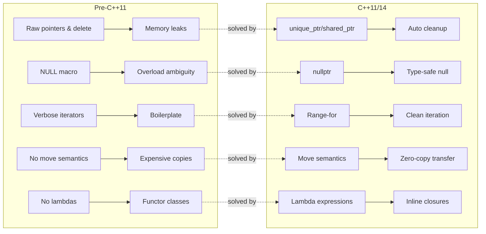

# Chapter 33 — C++11/14: The Modern Revolution

```yaml
tags: [cpp11, cpp14, move-semantics, smart-pointers, lambdas, constexpr,
       variadic-templates, auto, modern-cpp, type-deduction]
```

---

## Theory — Why C++11 Changed Everything

C++11 was not an incremental update — it was a paradigm shift. Between 1998 and 2011 the
language stagnated while Java, C#, and Python captured mindshare. C++11 answered with move
semantics that eliminated unnecessary copies, lambdas that enabled functional idioms, smart
pointers that made manual `delete` obsolete, and `auto` that silenced verbosity complaints —
all without sacrificing zero-overhead abstractions. C++14 polished rough edges: generic lambdas,
relaxed `constexpr`, return-type deduction, and `std::make_unique`.

---

## What / Why / How

| Feature | What | Why | How |
|---|---|---|---|
| `auto`/`decltype` | Compiler-deduced types | Reduces verbosity | `auto x = expr;` |
| Move semantics | Transfer resources instead of copying | Eliminates deep copies of temporaries | `T&&`, `std::move` |
| Lambdas | Anonymous function objects | In-place callbacks | `[captures](params){ body }` |
| Smart pointers | RAII heap management | Prevents leaks, clarifies ownership | `unique_ptr`, `shared_ptr` |
| `constexpr` | Compile-time evaluation | Shift work to compile time | `constexpr` functions |
| Variadic templates | Arbitrary parameter counts | Type-safe printf, forwarding | `template<typename... Ts>` |
| `std::chrono` | Type-safe time | Replaces C `time()` | `steady_clock`, `duration` |
| `nullptr` | Typed null pointer | Eliminates `NULL`/`0` ambiguity | `nullptr` keyword |
| `enum class` | Scoped enums | No implicit int conversion | `enum class Color { Red };` |
| Uniform init | Brace initialization | Prevents narrowing | `T obj{args};` |
| C++14 generics | Generic lambdas, deduced returns | Less boilerplate | `[](auto x){ return x; }` |

---

## Revolution Impact — Before vs After



---

## auto, decltype, and Type Deduction

```cpp
#include <vector>
#include <map>
#include <iostream>
int main() {
    auto count = 42;                        // int
    auto pi    = 3.14;                      // double
    auto name  = std::string{"C++11"};      // std::string

    std::map<std::string, std::vector<int>> data{{"scores", {90, 85}}};
    for (auto it = data.begin(); it != data.end(); ++it)
        std::cout << it->first << ": " << it->second.size() << " items\n";

    decltype(count) other = 10;             // int — mirrors expression type

    // C++14: return type deduction + generic lambda
    auto add = [](auto a, auto b) { return a + b; };
    std::cout << add(3, 4) << " " << add(1.5, 2.5) << "\n";
}
```

**Key rule**: `auto` drops top-level `const`/references. Use `const auto&` explicitly.

---

## Move Semantics and Rvalue References

**Value categories**: lvalue (persistent identity, e.g. `x`), prvalue (temporary, e.g. `x+1`),
xvalue (expiring — lvalue cast via `std::move`). `std::move(x)` is just
`static_cast<T&&>(x)` — it *casts*, it does not move. The move constructor does the real work.

```cpp
#include <iostream>
#include <utility>
#include <vector>
class Buffer {
    int* data_; size_t size_;
public:
    explicit Buffer(size_t n) : data_(new int[n]), size_(n) {
        std::cout << "Construct " << size_ << "\n";
    }
    Buffer(const Buffer& o) : data_(new int[o.size_]), size_(o.size_) {
        std::copy(o.data_, o.data_ + size_, data_);
        std::cout << "Copy " << size_ << "\n";
    }
    Buffer(Buffer&& o) noexcept : data_(o.data_), size_(o.size_) {
        o.data_ = nullptr; o.size_ = 0;       // steal, then nullify source
        std::cout << "Move " << size_ << "\n";
    }
    Buffer& operator=(Buffer&& o) noexcept {
        if (this != &o) { delete[] data_; data_ = o.data_; size_ = o.size_;
                          o.data_ = nullptr; o.size_ = 0; }
        return *this;
    }
    ~Buffer() { delete[] data_; }
};
int main() {
    Buffer a(1024);             // Construct
    Buffer b = std::move(a);    // Move — no allocation
    std::vector<Buffer> v;
    v.push_back(Buffer(512));   // Construct + Move (temp is rvalue)
}
```

---

## Lambda Expressions — C++11 to C++14

```cpp
#include <algorithm>
#include <iostream>
#include <vector>
#include <memory>
int main() {
    std::vector<int> v{5, 2, 8, 1, 9, 3};

    std::sort(v.begin(), v.end(), [](int a, int b) { return a > b; });

    int threshold = 4;
    auto n = std::count_if(v.begin(), v.end(),
        [threshold](int x) { return x > threshold; });
    std::cout << n << " elements above " << threshold << "\n";

    // Mutable: captured-by-value vars are const by default
    int calls = 0;
    auto counter = [calls]() mutable { return ++calls; };
    std::cout << counter() << " " << counter() << "\n"; // 1 2

    // C++14 init capture — move unique_ptr into lambda
    auto ptr = std::make_unique<int>(42);
    auto reader = [p = std::move(ptr)]() { return *p; };
    std::cout << "Captured: " << reader() << "\n";

    // C++14 generic lambda — auto parameters
    auto print = [](const auto& c) {
        for (const auto& e : c) std::cout << e << " ";
        std::cout << "\n";
    };
    print(v);
}
```

---

## Smart Pointers — Ownership Lifecycle

```mermaid
stateDiagram-v2
    [*] --> Created : make_unique / make_shared
    Created --> Owned : unique_ptr sole ownership
    Created --> Shared : shared_ptr ref_count=1
    Owned --> Transferred : std::move
    Owned --> Destroyed : scope ends
    Transferred --> Destroyed : new owner exits
    Shared --> Copied : copy (ref_count++)
    Copied --> Decremented : destructor (ref_count--)
    Decremented --> Destroyed : ref_count==0
    Decremented --> Copied : ref_count>0
    Shared --> WeakObs : weak_ptr created
    WeakObs --> Expired : ref_count==0
    Destroyed --> [*]
    Expired --> [*]
```

```cpp
#include <memory>
#include <iostream>
struct Sensor {
    std::string name;
    Sensor(std::string n) : name(std::move(n)) { std::cout << name << " created\n"; }
    ~Sensor() { std::cout << name << " destroyed\n"; }
};
int main() {
    auto temp = std::make_unique<Sensor>("Temp");
    auto moved = std::move(temp);              // temp is now nullptr

    auto pres = std::make_shared<Sensor>("Pressure");
    { auto alias = pres; std::cout << "refs=" << pres.use_count() << "\n"; }

    std::weak_ptr<Sensor> obs = pres;
    pres.reset();                               // ref_count → 0, destroyed
    std::cout << "expired=" << obs.expired() << "\n";
}
```

---

## constexpr — Compile-Time Computation

```cpp
#include <iostream>
#include <array>

// C++11: single return statement only
constexpr int fact_11(int n) { return n <= 1 ? 1 : n * fact_11(n - 1); }

// C++14: loops and local variables allowed
constexpr int fact_14(int n) {
    int r = 1;
    for (int i = 2; i <= n; ++i) r *= i;
    return r;
}

// C++14 variable template
template<typename T> constexpr T pi_v = T(3.14159265358979L);

int main() {
    static_assert(fact_11(5) == 120, "");
    static_assert(fact_14(6) == 720, "C++14 constexpr with loops");

    std::array<int, fact_14(4)> arr{};          // compile-time size = 24
    std::cout << "pi<float>=" << pi_v<float> << "  pi<double>=" << pi_v<double> << "\n";
}
```

---

## Variadic Templates and Parameter Packs

```cpp
#include <iostream>
#include <sstream>

void print() { std::cout << "\n"; }       // base case

template<typename T, typename... Rest>
void print(const T& first, const Rest&... rest) {
    std::cout << first;
    if (sizeof...(rest) > 0) std::cout << ", ";
    print(rest...);                        // recursive expansion
}

// Type-safe concat via comma-operator expansion
template<typename... Args>
std::string concat(const Args&... args) {
    std::ostringstream oss;
    using expand = int[];
    (void)expand{0, (oss << args, 0)...};
    return oss.str();
}

int main() {
    print("Hello", 42, 3.14, std::string("world"));
    std::cout << concat("Error ", 404, ": Not Found") << "\n";
    std::cout << "pack size = " << sizeof...(int, double, char) << "\n"; // 3
}
```

---

## std::chrono, nullptr, enum class, override/final, Range-for, Uniform Init

```cpp
#include <chrono>
#include <iostream>
#include <vector>
#include <algorithm>
#include <numeric>

// --- nullptr eliminates overload ambiguity ---
void process(int x)    { std::cout << "int\n"; }
void process(int* p)   { std::cout << "ptr\n"; }

// --- enum class: scoped, no implicit int ---
enum class LogLevel : uint8_t { Debug, Info, Warn, Error };

// --- override / final ---
struct Base {
    virtual void run() { std::cout << "Base\n"; }
    virtual ~Base() = default;
};
struct Derived final : Base {
    void run() override { std::cout << "Derived\n"; }
};

int main() {
    process(nullptr);                          // calls ptr overload

    LogLevel lvl = LogLevel::Warn;
    // int x = lvl;  // ERROR — no implicit conversion

    std::unique_ptr<Base> obj = std::make_unique<Derived>();
    obj->run();

    // --- Uniform init prevents narrowing ---
    int a{42};
    // int b{3.14};  // ERROR: narrowing

    // --- Range-based for ---
    std::vector<int> v{5, 3, 8, 1};
    for (const auto& x : v) std::cout << x << " ";
    std::cout << "\n";

    // --- std::chrono benchmark ---
    std::vector<int> data(100'000);
    std::iota(data.begin(), data.end(), 0);
    std::reverse(data.begin(), data.end());
    auto t0 = std::chrono::steady_clock::now();
    std::sort(data.begin(), data.end());
    auto us = std::chrono::duration_cast<std::chrono::microseconds>(
        std::chrono::steady_clock::now() - t0);
    std::cout << "Sort: " << us.count() << " µs\n";
}
```

---

## C++14 Additions Roundup

```cpp
#include <iostream>
#include <memory>

// Return type deduction
auto multiply(double a, double b) { return a * b; }

// Generic lambda factory
auto make_adder(int off) { return [off](auto x) { return x + off; }; }

// Variable template
template<typename T> constexpr T golden = T(1.618033988L);

// Digit separators + binary literals
constexpr long pop = 7'900'000'000L;
constexpr int flags = 0b1010'0011;

struct Node {
    int val; std::unique_ptr<Node> left, right;
    Node(int v) : val(v) {}
};

int main() {
    std::cout << multiply(3.0, 4.5) << "\n";
    auto add5 = make_adder(5);
    std::cout << add5(10) << " " << add5(3.14) << "\n";

    auto root = std::make_unique<Node>(1);     // C++14 make_unique
    root->left = std::make_unique<Node>(2);

    std::cout << "golden<float>=" << golden<float> << "\n";
    std::cout << "pop=" << pop << " flags=" << flags << "\n";
}
```

---

## Exercises

### 🟢 Exercise 1 — Smart Pointer Chain
Build a singly-linked list of `n` nodes with `unique_ptr`. Print head → tail.

### 🟢 Exercise 2 — Lambda Sorter
Sort `vector<string>` by length (shortest first), breaking ties alphabetically.

### 🟡 Exercise 3 — Move-Aware Container
Implement `DynamicArray<T>` with move ctor, move assign, and rvalue `push_back`.

### 🟡 Exercise 4 — constexpr Fibonacci
Generate a compile-time table of the first 16 Fibonacci numbers; verify with `static_assert`.

### 🔴 Exercise 5 — Variadic Logger
Type-safe `log(LogLevel, args...)` with timestamps via `std::chrono`.

---

## Solutions

### Solution 1
```cpp
#include <memory>
#include <iostream>
struct Node { int val; std::unique_ptr<Node> next; Node(int v):val(v){} };

std::unique_ptr<Node> make_chain(int n) {
    std::unique_ptr<Node> head;
    for (int i = n-1; i >= 0; --i) {
        auto nd = std::make_unique<Node>(i);
        nd->next = std::move(head);
        head = std::move(nd);
    }
    return head;
}
int main() {
    for (auto* p = make_chain(5).get(); p; p = p->next.get())
        std::cout << p->val << " -> ";
    std::cout << "null\n";
}
```

### Solution 2
```cpp
#include <algorithm>
#include <iostream>
#include <vector>
#include <string>
int main() {
    std::vector<std::string> w{"banana","fig","apple","kiwi","date"};
    std::sort(w.begin(), w.end(), [](const auto& a, const auto& b) {
        return a.size() != b.size() ? a.size() < b.size() : a < b;
    });
    for (const auto& s : w) std::cout << s << " ";
}
```

### Solution 3
```cpp
#include <iostream>
#include <utility>
template<typename T>
class DynamicArray {
    T* d_=nullptr; size_t sz_=0, cap_=0;
    void grow() {
        size_t nc = cap_?cap_*2:4; T* nd = new T[nc];
        for (size_t i=0;i<sz_;++i) nd[i]=std::move(d_[i]);
        delete[] d_; d_=nd; cap_=nc;
    }
public:
    DynamicArray()=default;
    DynamicArray(DynamicArray&& o) noexcept:d_(o.d_),sz_(o.sz_),cap_(o.cap_)
        { o.d_=nullptr; o.sz_=o.cap_=0; }
    DynamicArray& operator=(DynamicArray&& o) noexcept {
        if(this!=&o){delete[] d_;d_=o.d_;sz_=o.sz_;cap_=o.cap_;
                     o.d_=nullptr;o.sz_=o.cap_=0;} return *this; }
    void push_back(T&& v){if(sz_==cap_)grow();d_[sz_++]=std::move(v);}
    size_t size()const{return sz_;} const T& operator[](size_t i)const{return d_[i];}
    ~DynamicArray(){delete[] d_;}
};
int main(){
    DynamicArray<std::string> a;
    a.push_back(std::string("hello")); a.push_back(std::string("world"));
    std::cout<<a.size()<<" "<<a[0]<<"\n";
    auto b=std::move(a); std::cout<<"moved: "<<b.size()<<"\n";
}
```

### Solution 4
```cpp
#include <array>
#include <iostream>
constexpr std::array<int,16> make_fib() {
    std::array<int,16> t{}; t[0]=0; t[1]=1;
    for(int i=2;i<16;++i) t[i]=t[i-1]+t[i-2]; return t;
}
constexpr auto fib = make_fib();
static_assert(fib[10]==55,""); static_assert(fib[15]==610,"");
int main(){ for(int i=0;i<16;++i) std::cout<<"fib("<<i<<")="<<fib[i]<<"\n"; }
```

### Solution 5
```cpp
#include <iostream>
#include <sstream>
#include <chrono>
#include <iomanip>
enum class LogLevel{DEBUG,INFO,WARN,ERROR};
const char* str(LogLevel l){const char* n[]={"DBG","INF","WRN","ERR"};return n[(int)l];}

template<typename... Args>
void log(LogLevel lv, const Args&... args){
    auto t=std::chrono::system_clock::to_time_t(std::chrono::system_clock::now());
    std::ostringstream o;
    o<<std::put_time(std::localtime(&t),"%H:%M:%S")<<" ["<<str(lv)<<"] ";
    using X=int[];(void)X{0,(o<<args<<' ',0)...};
    std::cout<<o.str()<<"\n";
}
int main(){
    auto t0=std::chrono::steady_clock::now();
    log(LogLevel::INFO,"Server on port",8080);
    log(LogLevel::ERROR,"Retry failed after",3,"attempts");
    auto us=std::chrono::duration_cast<std::chrono::microseconds>(
        std::chrono::steady_clock::now()-t0);
    std::cout<<"Logging took "<<us.count()<<" µs\n";
}
```

---

## Quiz

**Q1.** What does `std::move(x)` do at runtime?
A) Calls the move constructor  B) Transfers memory  C) Casts to rvalue reference  D) Deletes x
**Answer:** C — it is `static_cast<T&&>`. The move ctor/assignment does the actual work.

**Q2.** Output of `auto f=[x=0]()mutable{return ++x;}; cout<<f()<<f()<<f();`?
A) 000  B) 111  C) 123  D) Compile error
**Answer:** C — `mutable` allows modification; the lambda maintains state.

**Q3.** Which prevents narrowing? A) `int x=3.14;` B) `int x(3.14);` C) `int x{3.14};`
**Answer:** C — brace init rejects narrowing conversions.

**Q4.** What happens when a `shared_ptr` is copied?
A) Deep copy  B) Atomic ref_count increment  C) Ownership transfer  D) weak_ptr created
**Answer:** B.

**Q5.** `sizeof...(args)` in a variadic template returns?
A) Total byte size  B) Pack element count  C) First element size  D) Error
**Answer:** B — compile-time count of parameter pack elements.

**Q6.** `[](auto x){return x*2;}` uses which C++14 feature?
A) Init captures  B) Generic lambdas  C) Variable templates  D) Return type deduction
**Answer:** B.

**Q7.** Why is `nullptr` preferred over `NULL`?
A) Faster  B) Has its own type `std::nullptr_t`, no overload ambiguity  C) `NULL` removed  D) Works with non-pointers
**Answer:** B.

---

## Key Takeaways

- **`auto`** cuts verbosity but drops top-level qualifiers — use `const auto&` deliberately.
- **Move semantics** transfer resources in O(1) instead of O(n) copies.
- **`std::move` is a cast**, not an operation.
- **Lambdas** replaced functor classes; C++14 generic lambdas add template-like power.
- **Smart pointers** encode ownership in the type system — default to `unique_ptr`.
- **`constexpr`** shifts work to compile time; C++14 removes the single-statement limit.
- **Variadic templates** enable type-safe variadic functions.
- **`enum class`** scopes names and blocks implicit int conversion.
- **Brace init** catches narrowing bugs the compiler used to accept silently.

---

## Chapter Summary

C++11/14 transformed C++ from verbose and error-prone into a modern systems powerhouse. Move
semantics eliminated costly deep copies. Smart pointers made manual memory management the
exception. Lambdas brought functional programming to STL algorithms. `auto`/`decltype` cut
noise while preserving type safety. C++14 polished the edges — generic lambdas, relaxed
`constexpr`, `make_unique`, and return-type deduction — establishing the foundation for
C++17, C++20, and beyond.

---

## Real-World Insight

Migrating a trading firm's pipeline from C++03 to C++11 yielded **23% throughput gains** by
adding move constructors — eliminating millions of `std::string` deep copies per second. Game
engines adopted smart pointers to eliminate use-after-free crashes. `std::chrono` replaced
`gettimeofday()` with type-safe duration arithmetic, preventing unit-mismatch production bugs.
Generic lambdas reduced each async handler from a 20-line functor class to a single line.

---

## Common Mistakes

1. **`std::move` on `const` objects** — returns `const T&&`, silently falls back to copying.
2. **Accessing moved-from objects** — valid but unspecified state; reading values is meaningless.
3. **Capturing `this` with `[=]`** — captures the pointer, not a copy; dangling if lambda outlives object.
4. **Forgetting `noexcept` on moves** — `vector` falls back to copying during reallocation.
5. **`auto x = {1,2,3}` creates `initializer_list`**, not a container.
6. **Using `shared_ptr` when `unique_ptr` suffices** — adds unnecessary atomic ref-counting overhead.
7. **`return std::move(local)`** — defeats NRVO; just write `return local;`.

---

## Interview Questions

**Q1: Explain lvalue, prvalue, and xvalue with examples.**
An **lvalue** persists and has identity (`int x`). A **prvalue** is a temporary (`x + 3`).
An **xvalue** is an lvalue cast to rvalue via `std::move(x)`, signaling resources may be stolen.
Overload resolution uses these categories to choose copy (`const T&`) vs move (`T&&`) overloads.

**Q2: Why mark move constructors `noexcept`?**
`std::vector` provides a strong exception-safety guarantee during reallocation. If the move
constructor can throw, `vector` uses `std::move_if_noexcept` and falls back to copies. Omitting
`noexcept` silently kills move performance in every STL container.

**Q3: When use `weak_ptr` over `shared_ptr`?**
To break **cyclic references** (e.g., parent ↔ child trees) that prevent deallocation, and for
**caches** where you observe resource lifetime via `lock()` without extending it.

**Q4: `constexpr` in C++11 vs C++14?**
C++11 restricted `constexpr` to a single return statement (ternary only). C++14 allows local
variables, loops, `if`/`else`, and multiple statements — making compile-time lookup tables and
hashing practical.

**Q5: What problem do C++14 generic lambdas solve?**
C++11 lambdas require explicit parameter types. Generic lambdas accept `auto` parameters,
generating a templated `operator()`, so one lambda works across all types supporting the
required operations — eliminating code duplication in algorithm callbacks.