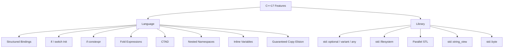
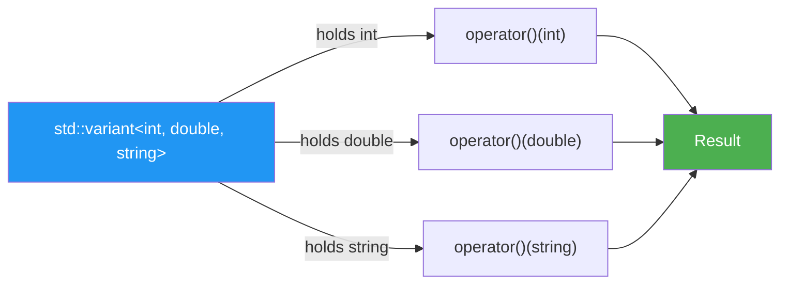

# Chapter 34 — C++17: Practical Enhancements

```yaml
tags: [cpp17, structured-bindings, optional, variant, filesystem, parallel-stl,
       fold-expressions, ctad, string-view, if-constexpr, modern-cpp]
```

---

## Theory

C++17 is a pragmatic release that transformed everyday coding. While C++11 introduced
move semantics and lambdas, and C++14 polished them, C++17 delivers the "quality of
life" features that eliminate boilerplate and make intent clearer. Structured bindings
replace verbose `std::tie` unpacking, `std::optional` kills sentinel-value hacks,
`if constexpr` removes SFINAE gymnastics, and the Parallel STL turns sequential loops
into multi-core workloads with a single policy argument. Together, these features
close the gap between what programmers *think* and what they *write*.

---

## What / Why / How

| Feature | What | Why | How |
|---|---|---|---|
| Structured bindings | Decompose aggregates into named variables | Eliminates `std::get<>` / `.first` noise | `auto [k, v] = pair;` |
| `if`/`switch` init | Declare variables inside condition scope | Tightens scope, prevents leaks | `if (auto it = m.find(k); it != m.end())` |
| `std::optional` | Nullable value wrapper | Replaces `nullptr`/sentinel patterns | `std::optional<int> maybe = 42;` |
| `std::variant` | Type-safe tagged union | Replaces raw `union` + tag field | `std::variant<int,string> v = "hi";` |
| `std::any` | Type-erased container | Holds any copyable type | `std::any a = 3.14;` |
| `if constexpr` | Compile-time branch elimination | Replaces SFINAE / tag dispatch | `if constexpr (std::is_integral_v<T>)` |
| `std::filesystem` | Cross-platform file/dir API | Replaces POSIX / Win32 calls | `fs::exists(path)` |
| Parallel STL | Execution policies for algorithms | Instant parallelism | `std::sort(std::execution::par, ...)` |
| Fold expressions | Reduce parameter packs inline | Eliminates recursive templates | `(args + ...)` |
| CTAD | Deduce class template args | Less typing, clearer code | `std::pair p{1, 2.0};` |
| `std::string_view` | Non-owning string reference | Zero-copy string passing | `void f(std::string_view sv)` |
| Nested namespaces | `namespace A::B::C {}` | Less indentation | Direct syntax |
| Inline variables | `inline` on variable declarations | Header-only ODR-safe globals | `inline constexpr int N = 42;` |
| Guaranteed copy elision | Prvalues never copied/moved | Enables non-movable returns | Mandatory by standard |
| `std::byte` | Distinct byte type | Type-safe raw memory access | `std::byte b{0xFF};` |

---

## Code Examples

### 1 — Structured Bindings

```cpp
#include <iostream>
#include <map>
#include <tuple>

struct Point { double x, y, z; };

int main() {
    Point p{1.0, 2.0, 3.0};
    auto [x, y, z] = p;
    std::cout << "x=" << x << " y=" << y << " z=" << z << "\n";

    std::map<std::string, int> scores{{"Alice", 95}, {"Bob", 87}};
    for (const auto& [name, score] : scores)
        std::cout << name << ": " << score << "\n";

    auto [id, label, active] = std::tuple{42, std::string("sensor"), true};
    std::cout << id << " " << label << " " << active << "\n";
}
```

### 2 — if / switch with Initializers

```cpp
#include <iostream>
#include <map>
#include <mutex>

std::map<int, std::string> registry{{1, "engine"}, {2, "brake"}};
std::mutex mtx;

void lookup(int key) {
    if (auto it = registry.find(key); it != registry.end())
        std::cout << "Found: " << it->second << "\n";
    else
        std::cout << "Key " << key << " not found\n";

    if (std::lock_guard lk(mtx); registry.count(key))
        std::cout << "Thread-safe access: " << registry[key] << "\n";
}

int main() { lookup(1); lookup(99); }
```

### 3 — std::optional / std::variant / std::any

```cpp
#include <any>
#include <iostream>
#include <optional>
#include <string>
#include <variant>

// optional: express "might not have a value"
std::optional<int> parse_int(const std::string& s) {
    try { return std::stoi(s); }
    catch (...) { return std::nullopt; }
}

// variant: type-safe union with visitor pattern
using JsonValue = std::variant<int, double, std::string>;

struct JsonPrinter {
    void operator()(int i)              const { std::cout << "int: " << i << "\n"; }
    void operator()(double d)           const { std::cout << "dbl: " << d << "\n"; }
    void operator()(const std::string& s) const { std::cout << "str: " << s << "\n"; }
};

int main() {
    auto result = parse_int("42");
    std::cout << result.value_or(-1) << "\n";           // 42
    std::cout << parse_int("abc").value_or(-1) << "\n"; // -1

    JsonValue jv = std::string("hello");
    std::visit(JsonPrinter{}, jv);

    std::any a = 3.14;
    std::cout << std::any_cast<double>(a) << "\n";
    a = std::string("now a string");
    std::cout << std::any_cast<std::string>(a) << "\n";
}
```

### 4 — if constexpr — Compile-Time Branching

```cpp
#include <iostream>
#include <string>
#include <type_traits>

template <typename T>
std::string stringify(const T& val) {
    if constexpr (std::is_arithmetic_v<T>)
        return std::to_string(val);
    else if constexpr (std::is_same_v<T, std::string>)
        return val;
    else
        static_assert(sizeof(T) == 0, "Unsupported type");
}

int main() {
    std::cout << stringify(42) << "\n";
    std::cout << stringify(3.14) << "\n";
    std::cout << stringify(std::string("hi")) << "\n";
    // stringify(std::vector<int>{}); // would trigger static_assert
}
```

### 5 — std::filesystem

```cpp
#include <filesystem>
#include <fstream>
#include <iostream>

namespace fs = std::filesystem;

void demo_filesystem() {
    fs::path dir = "demo_output";
    fs::create_directories(dir / "sub");
    std::ofstream{dir / "sub" / "data.txt"} << "C++17 filesystem\n";

    for (const auto& entry : fs::recursive_directory_iterator(dir)) {
        std::cout << (entry.is_directory() ? "[DIR] " : "[FILE] ")
                  << entry.path().string() << "\n";
    }

    auto p = dir / "sub" / "data.txt";
    std::cout << "stem: " << p.stem() << "  ext: " << p.extension() << "\n";
    fs::remove_all(dir);
}

int main() { demo_filesystem(); }
```

### 6 — Parallel STL Algorithms

```cpp
#include <algorithm>
#include <execution>
#include <iostream>
#include <numeric>
#include <vector>

int main() {
    std::vector<int> data(10'000'000);
    std::iota(data.begin(), data.end(), 1);

    auto a = data;
    std::sort(std::execution::seq, a.begin(), a.end(), std::greater<>{});

    auto b = data;
    std::sort(std::execution::par, b.begin(), b.end(), std::greater<>{});

    long long sum = std::reduce(std::execution::par_unseq,
                                data.begin(), data.end(), 0LL);
    std::cout << "Sum: " << sum << "\n";

    // Parallel transform-reduce (map-reduce pattern)
    double norm = std::transform_reduce(std::execution::par,
        data.begin(), data.end(), 0.0, std::plus<>{},
        [](int x) { return x * x; });
    std::cout << "L2-squared norm: " << norm << "\n";
}
```

### 7 — Fold Expressions

```cpp
#include <iostream>
#include <string>

// Unary right fold: (args op ...)  →  a1 op (a2 op (a3 op ...))
template <typename... Args>
auto sum(Args... args) {
    return (args + ...);
}

// Unary left fold with comma operator — variadic print
template <typename... Args>
void print_all(Args&&... args) {
    ((std::cout << args << " "), ...);
    std::cout << "\n";
}

// Binary left fold with init: (init op ... op args)
template <typename... Args>
bool all_true(Args... args) {
    return (true && ... && args);
}

int main() {
    std::cout << sum(1, 2, 3, 4, 5) << "\n";      // 15
    print_all("hello", 42, 3.14, 'X');             // hello 42 3.14 X
    std::cout << std::boolalpha
              << all_true(true, true, true) << "\n"  // true
              << all_true(true, false, true) << "\n"; // false
}
```

### 8 — CTAD, string_view, Nested Namespaces, Inline Variables, std::byte

```cpp
#include <cstddef>
#include <iostream>
#include <string_view>
#include <tuple>
#include <vector>

// Nested namespace (C++17 shorthand)
namespace project::config::v2 {
    // Inline variable — safe in headers, one definition across TUs
    inline constexpr int MAX_RETRIES = 5;
}

// string_view: zero-copy, non-owning reference
std::size_t count_words(std::string_view sv) {
    std::size_t count = 0;  bool in_word = false;
    for (char c : sv) {
        if (c == ' ' || c == '\t' || c == '\n') in_word = false;
        else if (!in_word) { ++count; in_word = true; }
    }
    return count;
}

int main() {
    // CTAD — no need to write template arguments
    std::pair   p{1, 3.14};          // pair<int, double>
    std::tuple  t{1, "hi", 2.0};     // tuple<int, const char*, double>
    std::vector v{1, 2, 3, 4};       // vector<int>

    std::cout << "pair: " << p.first << ", " << p.second << "\n";
    std::cout << "retries: " << project::config::v2::MAX_RETRIES << "\n";
    std::cout << "words: " << count_words("the quick brown fox") << "\n";

    // std::byte — type-safe raw memory
    std::byte b{0xAF};
    b |= std::byte{0x10};
    std::cout << "byte: 0x" << std::hex << std::to_integer<int>(b) << "\n";
}
```

### 9 — Guaranteed Copy Elision

```cpp
#include <iostream>

struct Heavy {
    Heavy()  { std::cout << "constructed\n"; }
    Heavy(const Heavy&) = delete;  // non-copyable
    Heavy(Heavy&&) = delete;       // non-movable
};

// C++17: prvalue returned directly — no copy/move needed
Heavy make_heavy() {
    return Heavy{};   // OK in C++17; would fail in C++14
}

int main() {
    Heavy h = make_heavy();  // exactly one "constructed" printed
    (void)h;
}
```

---

## Diagrams

### C++17 Feature Taxonomy



### std::variant Visit Dispatch Flow



---

## Exercises

### 🟢 Easy — E1: Structured Bindings Practice

Write a function `min_max(const std::vector<int>&)` that returns a
`std::pair<int,int>` of the minimum and maximum values. In `main`, use
structured bindings to capture the result and print both values.

### 🟢 Easy — E2: string_view Word Extraction

Write `first_word(std::string_view sv)` that returns a `std::string_view`
of the first whitespace-delimited word. Do not allocate any memory.

### 🟡 Medium — E3: Config Parser with optional and variant

Define `using ConfigValue = std::variant<int, double, std::string>;`.
Write `parse_config_line(std::string_view line) -> std::optional<std::pair<std::string, ConfigValue>>`
that parses `"key = value"` strings, returning `nullopt` for malformed lines.

### 🟡 Medium — E4: Parallel Statistics

Given a `std::vector<double>` of 1 million random values, compute the mean
and standard deviation using `std::reduce` and `std::transform_reduce` with
`std::execution::par`. Compare wall-clock times against the sequential policy.

### 🔴 Hard — E5: Type-Safe Event System

Build an event bus where events are `std::variant<ClickEvent, KeyEvent, ResizeEvent>`.
Use `std::visit` with a lambda overload set. Listeners register via
`bus.on<ClickEvent>(callback)`. Use fold expressions internally to dispatch
to multiple handlers in a single call.

---

## Solutions

### S1 — min_max

```cpp
#include <algorithm>
#include <iostream>
#include <vector>

std::pair<int,int> min_max(const std::vector<int>& v) {
    auto [lo, hi] = std::minmax_element(v.begin(), v.end());
    return {*lo, *hi};
}

int main() {
    std::vector data{3, 7, 1, 9, 4};
    auto [mn, mx] = min_max(data);
    std::cout << "min=" << mn << " max=" << mx << "\n"; // 1, 9
}
```

### S2 — first_word

```cpp
#include <iostream>
#include <string_view>

std::string_view first_word(std::string_view sv) {
    auto start = sv.find_first_not_of(" \t\n");
    if (start == std::string_view::npos) return {};
    auto end = sv.find_first_of(" \t\n", start);
    return sv.substr(start, end - start);
}

int main() {
    std::cout << "[" << first_word("  hello world  ") << "]\n"; // [hello]
}
```

### S3 — Config Parser

```cpp
#include <iostream>
#include <optional>
#include <string>
#include <string_view>
#include <variant>

using ConfigValue = std::variant<int, double, std::string>;

std::optional<std::pair<std::string, ConfigValue>>
parse_config_line(std::string_view line) {
    auto eq = line.find('=');
    if (eq == std::string_view::npos) return std::nullopt;
    auto key = std::string(line.substr(0, eq));
    auto val = line.substr(eq + 1);
    if (auto p = val.find_first_not_of(' '); p != std::string_view::npos)
        val = val.substr(p);
    try { return std::pair{key, ConfigValue{std::stoi(std::string(val))}}; } catch (...) {}
    try { return std::pair{key, ConfigValue{std::stod(std::string(val))}}; } catch (...) {}
    return std::pair{key, ConfigValue{std::string(val)}};
}

int main() {
    if (auto r = parse_config_line("port = 8080"); r)
        std::visit([](auto& v){ std::cout << v << "\n"; }, r->second);
    std::cout << std::boolalpha << parse_config_line("bad").has_value() << "\n";
}
```

---

## Quiz

**Q1.** What does `auto [a, b] = std::pair{1, 2.0};` deduce `b` as?
- A) `int`
- B) `float`
- C) `double` ✅
- D) `auto`

**Q2.** Which header provides `std::optional`?
- A) `<utility>`
- B) `<optional>` ✅
- C) `<variant>`
- D) `<functional>`

**Q3.** What happens if you `std::get<int>()` on a `variant` currently holding a `string`?
- A) Returns 0
- B) Undefined behavior
- C) Throws `std::bad_variant_access` ✅
- D) Compilation error

**Q4.** `if constexpr` discards the false branch at:
- A) Runtime
- B) Link time
- C) Compile time ✅
- D) Preprocessing

**Q5.** Which execution policy allows SIMD vectorization?
- A) `std::execution::seq`
- B) `std::execution::par`
- C) `std::execution::par_unseq` ✅
- D) `std::execution::vec`

**Q6.** The fold expression `(args + ...)` is a:
- A) Binary left fold
- B) Binary right fold
- C) Unary left fold
- D) Unary right fold ✅

**Q7.** `std::string_view` owns the underlying character data.
- A) True
- B) False ✅

**Q8.** Guaranteed copy elision in C++17 applies to:
- A) All return statements
- B) Named local variables (NRVO)
- C) Prvalue expressions ✅
- D) `std::move`'d objects

---

## Key Takeaways

- **Structured bindings** replace `.first`/`.second` and `std::get<N>` with named decomposition.
- **`if`/`switch` initializers** scope variables exactly where they're used.
- **`std::optional`** is the standard way to express "maybe no value" — replaces sentinels.
- **`std::variant`** provides type-safe unions with `std::visit` dispatch.
- **`if constexpr`** replaces SFINAE and tag dispatch for compile-time branching.
- **`std::filesystem`** is a portable, cross-platform file/directory API.
- **Parallel STL** adds multi-core execution via a single policy argument.
- **Fold expressions** collapse variadic pack recursion into one expression.
- **CTAD** lets the compiler deduce class template arguments automatically.
- **`std::string_view`** enables zero-copy string passing — never store past source lifetime.
- **Inline variables** make header-only constants ODR-safe.
- **Guaranteed copy elision** for prvalues — types need not be movable to be returned.

---

## Chapter Summary

C++17 is the "developer experience" release of modern C++. It tackles the most
common boilerplate — verbose unpacking, sentinel-based optionality, unsafe unions,
platform-specific I/O, and manual parallelization — with first-class features.
Structured bindings and `if` initializers make code read like pseudocode.
`std::optional` and `std::variant` formalize patterns that previously relied on
convention. `if constexpr` simplifies metaprogramming. The Parallel STL and
`std::filesystem` bring capabilities that once required external libraries into
the standard. Every feature is backward-compatible and composable.

---

## Real-World Insight

**Production config lookup (before vs. after C++17):**

*Before:*
```cpp
auto it = config.find("timeout");
if (it != config.end()) {
    int val;
    try { val = std::stoi(it->second); }
    catch (...) { val = 30; }
    set_timeout(val);
}
```
*After (C++17):*
```cpp
if (auto it = config.find("timeout"); it != config.end()) {
    set_timeout(parse_int(it->second).value_or(30));
}
```
The C++17 version scopes `it` correctly and uses `std::optional` for clean fallback,
eliminating scope-leak and sentinel-value bugs across thousands of config keys.

---

## Common Mistakes

1. **Dangling `string_view`.** The view is a raw pointer+length — it does not extend the source string's lifetime. Never store a view that outlives its source.
2. **Accessing `optional` without checking.** `.value()` on a disengaged optional throws `std::bad_optional_access`. Always use `.value_or()` or check first.
3. **Ignoring `variant` valueless state.** A failed type-changing assignment can leave a variant `valueless_by_exception()`. Handle this in robust code.
4. **Using `if constexpr` at namespace scope.** It works only inside function/method bodies.
5. **Assuming Parallel STL is always faster.** Thread-spawn overhead dominates for small inputs. Always benchmark.
6. **Confusing CTAD with `auto`.** CTAD deduces *template parameters*; `auto` deduces the *variable type*. They are complementary, not interchangeable.
7. **Using `std::any` when `variant` suffices.** Prefer `variant` when the set of types is known at compile time.
8. **Forgetting `-lstdc++fs`.** Older GCC/Clang requires linking the filesystem library separately.

---

## Interview Questions

### IQ1: When would you choose `std::optional` over `std::variant`?

**Answer:** `std::optional<T>` models "T or nothing" — use it for fallible returns like `find()` or `parse()`. `std::variant<T, U, V>` models "always a value, but one of several types" — use it for AST nodes or protocol messages. `optional` has a simpler API and expresses nullable intent more clearly; `variant` is for heterogeneous value sets.

### IQ2: Explain guaranteed copy elision and its impact on class design.

**Answer:** C++17 mandates that prvalues (e.g., `Widget{}`) are materialized directly in place — no copy or move constructor is called. This enables returning non-copyable, non-movable types from factory functions. Before C++17, such code was ill-formed even if the compiler would have elided the copy in practice.

### IQ3: Why is `std::string_view` dangerous to store as a data member?

**Answer:** `string_view` is non-owning (pointer + length). If the source string is destroyed, the view dangles — UB on read. Use `string_view` for parameters where the caller guarantees lifetime; convert to `std::string` when the class must own the data.

### IQ4: How do fold expressions improve on C++11/14 variadic template idioms?

**Answer:** Pre-C++17 required recursive template instantiation (base + recursive case) generating O(N) instantiations. Fold expressions collapse this into one expression: `(args + ...)` produces `a1 + (a2 + (...))` without recursion, reducing compile times and improving readability. Four forms exist: unary/binary × left/right.

### IQ5: Describe the three Parallel STL execution policies.

**Answer:** `seq` — single-threaded, ordered; safe baseline. `par` — multi-threaded; each element operation must be data-race-free. `par_unseq` — multi-threaded + SIMD; the functor must not acquire locks. Always benchmark: for small N (< ~10K), thread overhead makes `seq` faster.
