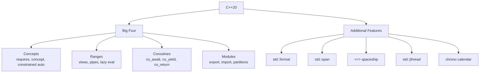
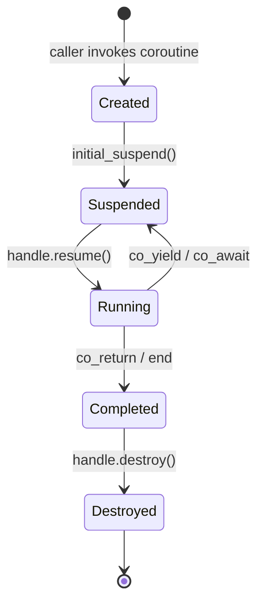

# Chapter 35 — C++20: The Big Four

The following tags categorize the major C++20 features covered in this chapter, from concepts and ranges to coroutines and modules.

```yaml
tags: [cpp20, concepts, ranges, coroutines, modules, std-format, std-span, spaceship-operator, jthread, chrono]
```

---

## Theory

C++20 is the most transformative standard since C++11. Its four headline features — **Concepts**, **Ranges**, **Coroutines**, and **Modules** — reshape how we write, compose, and ship C++ code. Concepts replace SFINAE with readable constraints. Ranges turn iterator-pair algorithms into composable pipelines. Coroutines give the language first-class suspend/resume semantics. Modules eliminate the textual `#include` model that has plagued build times for decades. Beyond the Big Four, C++20 delivers `std::format`, `std::span`, the spaceship operator, `std::jthread`, and a full calendar/timezone library.

## What / Why / How

| Feature | What | Why | How |
|---|---|---|---|
| **Concepts** | Named compile-time predicates | Replace SFINAE; clear errors | `requires`, `concept` keyword |
| **Ranges** | Lazy composable sequences | Eliminate iterator boilerplate | Views, adaptors, `\|` pipe |
| **Coroutines** | Suspendable functions | Async I/O, generators | `co_await`, `co_yield`, `co_return` |
| **Modules** | Compiled interface units | Faster builds, no macro leaks | `export module`, `import` |
| `std::format` | Type-safe formatting | Safety of streams + readability of printf | `std::format("{}", val)` |
| `std::span` | Non-owning contiguous view | Unify array/vector interfaces | `std::span<int>` |
| `<=>` | Three-way comparison | Auto-generate all 6 relational ops | `auto operator<=>() = default;` |
| `std::jthread` | Joining thread + cancellation | Prevent forgotten `.join()` | `std::jthread`, `stop_token` |
| Chrono additions | Calendars, time zones | Replace C-style date code | `year_month_day`, `zoned_time` |

---

## 1 — Concepts

C++20 Concepts let you declare named constraints on template parameters using the `concept` keyword and `requires` expressions. Instead of relying on cryptic SFINAE tricks that produce pages of error messages, concepts give you clean, readable compile-time predicates — the compiler tells you exactly which constraint failed and why. This example defines a custom `Numeric` concept, uses it to constrain a function template, and shows the terse `auto` shorthand syntax.

```cpp
#include <concepts>
#include <iostream>

// Custom concept
template <typename T>
concept Numeric = std::integral<T> || std::floating_point<T>;

// Constrained function template
template <Numeric T>
T add(T a, T b) { return a + b; }

// Constrained auto shorthand
void print_value(const Numeric auto& val) { std::cout << val << '\n'; }

// Compound constraints with requires-expression
template <typename T>
concept Addable = requires(T a, T b) {
    { a + b } -> std::convertible_to<T>;
};

int main() {
    std::cout << add(3, 4) << '\n';       // OK: int is Numeric
    std::cout << add(1.5, 2.5) << '\n';   // OK: double is Numeric
    // add(std::string{"a"}, std::string{"b"});  // Compile error
    print_value(42);
}
```

### Subsumption — More-Constrained Overload Wins

When multiple constrained overloads match a call, C++20 uses *subsumption* to pick the most specific one. Here `Pet` refines `Animal` by adding an extra requirement, so when a type satisfies both, the compiler automatically selects the `Pet` overload — no manual disambiguation needed. This replaces error-prone SFINAE priority tricks with a simple "more-constrained wins" rule.

```cpp
#include <concepts>
#include <iostream>

template <typename T>
concept Animal = requires(T t) { t.speak(); };

template <typename T>
concept Pet = Animal<T> && requires(T t) { t.name(); };

void greet(const Animal auto& a) { std::cout << "Hello, animal\n"; }
void greet(const Pet auto& p)    { std::cout << "Hello, " << p.name() << "!\n"; }

struct Dog {
    void speak() const {}
    std::string name() const { return "Rex"; }
};

int main() { Dog d; greet(d); }  // Calls Pet overload
```

---

## 2 — Ranges

C++20 Ranges replace verbose iterator-pair algorithms with composable, lazy view pipelines using the `|` (pipe) operator. Each view adaptor — `filter`, `transform`, `take` — processes elements on demand without creating intermediate containers, so a pipeline over a million elements only touches what is actually consumed. This is a major ergonomic and performance improvement over the old `std::begin`/`std::end` style.

```cpp
#include <ranges>
#include <vector>
#include <iostream>

int main() {
    std::vector<int> data{1, 2, 3, 4, 5, 6, 7, 8, 9, 10};

    // Pipeline: filter evens → square → take 3
    auto result = data
        | std::views::filter([](int n) { return n % 2 == 0; })
        | std::views::transform([](int n) { return n * n; })
        | std::views::take(3);

    for (int v : result) std::cout << v << ' ';  // 4 16 36
    std::cout << '\n';

    // Range factory
    for (int v : std::views::iota(1, 6))
        std::cout << v << ' ';  // 1 2 3 4 5
}
```

### Projections

Range algorithms accept an optional *projection* — a callable that extracts the key to operate on — so you can sort or search by a struct member without writing a custom comparator. Here `std::ranges::sort` sorts employees by salary using `&Employee::salary` as the projection, which is cleaner and less error-prone than a lambda comparator.

```cpp
#include <ranges>
#include <algorithm>
#include <vector>
#include <iostream>

struct Employee { std::string name; int salary; };

int main() {
    std::vector<Employee> team{{"Alice", 90000}, {"Bob", 75000}, {"Carol", 120000}};
    // Sort by salary using projection — no custom comparator needed
    std::ranges::sort(team, std::ranges::less{}, &Employee::salary);
    for (const auto& e : team) std::cout << e.name << ": $" << e.salary << '\n';
}
```

Views are **lazy**: a pipeline over a million elements that `take(5)` only touches elements needed to produce those 5 results.

---

## 3 — Coroutines

C++20 coroutines are compiler-generated state machines that can suspend and resume execution using `co_await`, `co_yield`, and `co_return`. You provide a `promise_type` that defines how values are produced and how suspension works; the compiler handles the rest. This example builds a `Generator<T>` template from scratch and uses it to lazily yield an infinite Fibonacci sequence — each call to `next()` resumes the coroutine just long enough to produce one value, with no thread overhead.

```cpp
#include <coroutine>
#include <iostream>
#include <optional>

template <typename T>
struct Generator {
    struct promise_type {
        T current_value;
        Generator get_return_object() {
            return Generator{std::coroutine_handle<promise_type>::from_promise(*this)};
        }
        std::suspend_always initial_suspend() { return {}; }
        std::suspend_always final_suspend() noexcept { return {}; }
        std::suspend_always yield_value(T value) { current_value = value; return {}; }
        void return_void() {}
        void unhandled_exception() { std::terminate(); }
    };

    std::coroutine_handle<promise_type> handle;
    explicit Generator(std::coroutine_handle<promise_type> h) : handle(h) {}
    ~Generator() { if (handle) handle.destroy(); }
    Generator(Generator&& o) noexcept : handle(o.handle) { o.handle = nullptr; }
    Generator(const Generator&) = delete;

    std::optional<T> next() {
        if (!handle || handle.done()) return std::nullopt;
        handle.resume();
        if (handle.done()) return std::nullopt;
        return handle.promise().current_value;
    }
};

Generator<long long> fibonacci() {
    long long a = 0, b = 1;
    while (true) {
        co_yield a;
        auto t = a + b; a = b; b = t;
    }
}

int main() {
    auto fib = fibonacci();
    for (int i = 0; i < 10; ++i)
        if (auto v = fib.next()) std::cout << *v << ' ';
    // 0 1 1 2 3 5 8 13 21 34
}
```

| Keyword | Purpose |
|---|---|
| `co_await expr` | Suspend until `expr` is ready |
| `co_yield val` | Suspend and produce a value |
| `co_return val` | Complete coroutine, optionally return a value |

---

## 4 — Modules

C++20 Modules replace the `#include` preprocessor model with a compiled interface system. A module interface unit declares what symbols are `export`ed; everything else stays private. Modules are parsed and compiled once (producing a Binary Module Interface), so builds scale as O(N + M) instead of O(N × M), and macros never leak between translation units. This example shows a simple module that exports two functions while keeping a helper internal.

```cpp
// math_utils.cppm — module interface unit
export module math_utils;

export int square(int x) { return x * x; }
export int cube(int x)   { return x * x * x; }
int helper() { return 42; }  // not exported
```

The consumer simply writes `import math_utils;` instead of `#include` — only exported symbols are visible, and no header guards or include-order issues arise.

```cpp
// main.cpp — consumer
import math_utils;
#include <iostream>
int main() {
    std::cout << square(5) << '\n';  // 25
    // helper();  // Error: not exported
}
```

### Module Partitions

Module partitions let you split a large module into separate files while keeping a single module name. A public partition (declared with `export module M:part`) can be re-exported to consumers, while a private partition hides implementation details. This enables parallel compilation of partition files and clean internal organization without exposing internals.

```cpp
// geometry.cppm — primary interface
export module geometry;
export import :shapes;     // re-export partition
import :internals;         // private partition

// geometry-shapes.cppm
export module geometry:shapes;
export struct Circle { double radius; };

// geometry-internals.cppm
module geometry:internals;
double pi_approx() { return 3.14159265; }
```

### CMake Support (≥ 3.28)

This CMake configuration shows how to enable C++20 module support in your build system. You need CMake 3.28 or later, and the `CXX_SCAN_FOR_MODULES` property tells CMake to automatically scan source files for module declarations and build them in the correct order.

```cmake
cmake_minimum_required(VERSION 3.28)
project(ModulesDemo CXX)
set(CMAKE_CXX_STANDARD 20)
add_library(math_mod)
target_sources(math_mod PUBLIC FILE_SET CXX_MODULES FILES math_utils.cppm)
add_executable(app main.cpp)
target_link_libraries(app PRIVATE math_mod)
```

| Aspect | Headers (`#include`) | Modules (`import`) |
|---|---|---|
| Parsing | Re-parsed every TU | Compiled once (BMI cached) |
| Macros | Leak across TUs | Isolated |
| Build speed | O(N × M) | O(N + M) |
| Encapsulation | Everything visible | Only exported symbols |

---

## 5 — std::format, std::span, Spaceship, jthread, Chrono

### std::format

`std::format` brings Python/Rust-style format strings to C++, combining the type safety of `iostream` with the readability of `printf`. Format specifiers like `{:.4f}` and `{:#x}` control alignment, precision, and base — all checked at compile time in C++23. This eliminates the classic `printf` pitfall of mismatched format specifiers and argument types.

```cpp
#include <format>
#include <iostream>

int main() {
    std::cout << std::format("Name: {}, Age: {}\n", "Alice", 30);
    std::cout << std::format("{:*^20}\n", "centered");
    std::cout << std::format("Hex: {:#x}, Pi: {:.4f}\n", 255, 3.14159);
}
```

### std::span

`std::span<T>` is a lightweight, non-owning view over contiguous memory — it works with C arrays, `std::array`, and `std::vector` through a single function signature. This replaces the old pattern of passing a pointer plus a size, giving you bounds-aware iteration and sub-range access via `subspan()` without copying data.

```cpp
#include <span>
#include <vector>
#include <iostream>

void print_sum(std::span<const int> data) {
    int total = 0;
    for (int v : data) total += v;
    std::cout << "Sum: " << total << '\n';
}

int main() {
    int arr[] = {1, 2, 3, 4, 5};
    std::vector<int> vec{10, 20, 30};
    print_sum(arr);   // 15 — works with C arrays
    print_sum(vec);   // 60 — works with vectors

    std::span<int> s(arr);
    for (int v : s.subspan(1, 3)) std::cout << v << ' ';  // 2 3 4
}
```

### Three-Way Comparison (<=>)

The spaceship operator `<=>` lets you default all six comparison operators (`<`, `>`, `<=`, `>=`, `==`, `!=`) in a single line. The compiler performs member-wise three-way comparison and returns a `strong_ordering`, `weak_ordering`, or `partial_ordering` category. This eliminates the tedious boilerplate of writing each relational operator by hand.

```cpp
#include <compare>
#include <iostream>

struct Version {
    int major, minor, patch;
    auto operator<=>(const Version&) const = default;  // generates all 6 ops
};

int main() {
    Version v1{2, 0, 1}, v2{2, 1, 0};
    std::cout << std::boolalpha << (v1 < v2) << '\n';  // true
    if (auto cmp = v1 <=> v2; cmp < 0) std::cout << "v1 is older\n";
}
```

| Category | Meaning | Example |
|---|---|---|
| `strong_ordering` | Substitutability: `a==b` → interchangeable | `int`, `string` |
| `weak_ordering` | Equivalence without substitutability | Case-insensitive string |
| `partial_ordering` | May be unordered (NaN) | `double`, `float` |

### std::jthread

`std::jthread` is a safer replacement for `std::thread` that automatically joins on destruction — no more crashes from a forgotten `.join()` call. It also provides built-in cooperative cancellation via `std::stop_token`: the worker checks `stop_requested()` in its loop, and the caller signals `request_stop()` to gracefully shut it down without killing the thread.

```cpp
#include <thread>
#include <iostream>
#include <chrono>

void worker(std::stop_token stoken, int id) {
    while (!stoken.stop_requested()) {
        std::cout << "Worker " << id << " running\n";
        std::this_thread::sleep_for(std::chrono::milliseconds(200));
    }
    std::cout << "Worker " << id << " stopped\n";
}

int main() {
    std::jthread t1(worker, 1);
    std::this_thread::sleep_for(std::chrono::seconds(1));
    t1.request_stop();  // cooperative cancellation
    // destructor auto-joins — no manual .join()
}
```

### Chrono Calendar & Timezone

C++20 extends `<chrono>` with type-safe calendar types (`year_month_day`) and timezone support (`zoned_time`). You can construct dates using the literal syntax `2025y / March / 15d`, perform date arithmetic with `days{1}`, and convert between timezones — all without the error-prone C-era `tm`/`mktime` functions.

```cpp
#include <chrono>
#include <iostream>

int main() {
    using namespace std::chrono;
    auto date = 2025y / March / 15d;
    std::cout << "Date: " << date << ", valid: " << date.ok() << '\n';

    year_month_day tomorrow = sys_days{date} + days{1};
    std::cout << "Tomorrow: " << tomorrow << '\n';

    zoned_time zt{"America/New_York", system_clock::now()};
    std::cout << "NYC: " << zt << '\n';
}
```

---

## Mermaid Diagrams

### C++20 Feature Map



### Coroutine Lifecycle



---

## Exercises

### 🟢 Easy — Concept Constraint
Write a concept `Printable<T>` that requires `T` to be streamable to `std::ostream`. Write a `println` function constrained by it.

### 🟡 Medium — Range Pipeline
Given `vector<string>` words, build a pipeline that filters words > 3 chars, transforms to uppercase, takes first 5. Print them.

### 🟡 Medium — Spaceship Operator
Create a `Fraction{num, den}` struct. Implement `operator<=>` via cross-multiplication. Verify all six comparison operators work.

### 🔴 Hard — Coroutine Prime Fibonacci
Using the `Generator<T>` template, write a coroutine that yields Fibonacci numbers, then filter for primes and print the first 8.

## Solutions

### 🟢 Solution

This solution defines a `Printable` concept using a `requires`-expression that checks whether a type can be streamed to `std::ostream` with `<<`. The `println` function is constrained by this concept, so passing a non-streamable type produces a clear compile-time error at the call site.

```cpp
#include <concepts>
#include <iostream>

template <typename T>
concept Printable = requires(std::ostream& os, const T& v) {
    { os << v } -> std::same_as<std::ostream&>;
};

void println(const Printable auto& val) { std::cout << val << '\n'; }

int main() { println(42); println(3.14); println("hello"); }
```

### 🟡 Range Solution

This solution builds a lazy range pipeline that filters words longer than 3 characters, transforms each to uppercase using `std::ranges::transform`, and takes the first 5 results. No intermediate `std::vector` is allocated — the pipe chain processes elements on demand during the final `for` loop.

```cpp
#include <ranges>
#include <vector>
#include <string>
#include <algorithm>
#include <iostream>
#include <cctype>

int main() {
    std::vector<std::string> words{"the","quick","brown","fox","jumps","over","a","lazy","dog"};
    auto to_upper = [](std::string s) {
        std::ranges::transform(s, s.begin(), ::toupper); return s;
    };
    auto result = words
        | std::views::filter([](const std::string& w) { return w.size() > 3; })
        | std::views::transform(to_upper)
        | std::views::take(5);
    for (const auto& w : result) std::cout << w << ' ';  // QUICK BROWN JUMPS OVER LAZY
}
```

### 🟡 Spaceship Solution

This solution implements a custom `operator<=>` for `Fraction` using cross-multiplication (`a/b` vs `c/d` becomes `a*d` vs `c*b`) to avoid floating-point division. The result is `strong_ordering`, and a separate `operator==` is provided because `<=>` alone doesn't auto-generate equality when the operator is user-defined rather than defaulted.

```cpp
#include <compare>
#include <iostream>

struct Fraction {
    int num, den;
    std::strong_ordering operator<=>(const Fraction& o) const {
        return static_cast<long long>(num) * o.den <=> static_cast<long long>(o.num) * den;
    }
    bool operator==(const Fraction& o) const { return (*this <=> o) == 0; }
};

int main() {
    Fraction a{1,3}, b{2,6}, c{1,2};
    std::cout << std::boolalpha;
    std::cout << (a == b) << '\n';  // true
    std::cout << (a < c) << '\n';   // true
}
```

### 🔴 Coroutine Solution

This solution reuses the `Generator<T>` coroutine template from Section 3 to lazily produce Fibonacci numbers, then filters them through an `is_prime` function to collect the first 8 prime Fibonacci numbers. The coroutine suspends after each `co_yield`, so only the values actually needed are ever computed.

```cpp
#include <coroutine>
#include <iostream>
#include <optional>

template <typename T>
struct Generator { /* same as Section 3 above */ };

Generator<long long> fibonacci() {
    long long a = 0, b = 1;
    while (true) { co_yield a; auto t = a + b; a = b; b = t; }
}

bool is_prime(long long n) {
    if (n < 2) return false;
    for (long long i = 2; i * i <= n; ++i) if (n % i == 0) return false;
    return true;
}

int main() {
    auto fib = fibonacci();
    int count = 0;
    while (count < 8)
        if (auto v = fib.next(); v && is_prime(*v)) { std::cout << *v << ' '; ++count; }
    // 2 3 5 13 89 233 1597 28657
}
```

---

## Quiz

**Q1.** What does a `concept` evaluate to at compile time?
A) A type  B) A constexpr int  **C) A Boolean**  D) A string

**Q2.** What does `|` do with range views?
A) Bitwise OR  **B) Pipes one adaptor into the next**  C) Merges ranges  D) Filters elements

**Q3.** Which keyword suspends a coroutine and produces a value?
A) co_return  B) co_await  **C) co_yield**  D) yield

**Q4.** What ordering category does `double` produce with `<=>`?
A) strong_ordering  B) weak_ordering  **C) partial_ordering**  D) total_ordering

**Q5.** Primary build-time advantage of modules over headers?
A) Less disk space  **B) Module interface compiled once, not re-parsed per TU**  C) Parallel-only  D) No linking

**Q6.** How does `jthread` differ from `thread`?
A) Faster  **B) Auto-joins on destruction + cooperative cancellation**  C) Uses coroutines  D) No lambdas

**Q7.** What does `std::span<const int>` own?
A) A copy  B) A ref-counted pointer  **C) Nothing — non-owning view**  D) A unique_ptr

---

## Key Takeaways

- **Concepts** produce clear error messages at the call site, replacing deep SFINAE instantiation failures.
- **Ranges** eliminate iterator pairs; the pipe `|` enables functional-style lazy data processing.
- **Coroutines** are compiler-generated state machines — you provide `promise_type`, the compiler does the rest.
- **Modules** end the `#include` era: no include guards, no macro leakage, no redundant parsing.
- **`std::format`** merges iostream safety with printf readability.
- **`std::span`** unifies C arrays, `std::array`, and `std::vector` under one function signature.
- **`<=>`** lets you default all six comparison operators in one line.
- **`std::jthread`** prevents the destructor-calls-`std::terminate` trap of `std::thread`.
- **Chrono calendar/timezone** replaces brittle `tm`/`mktime` with type-safe date/time handling.

## Chapter Summary

C++20 represents a generational leap. Concepts bring clarity to generic programming by replacing cryptic SFINAE with named, composable constraints. Ranges transform algorithm usage from verbose iterator gymnastics to declarative lazy pipelines. Coroutines introduce first-class suspend/resume without thread overhead, enabling generators and async I/O. Modules retire the 40-year-old textual inclusion model, delivering faster builds and true encapsulation. Supporting features — `std::format`, `std::span`, spaceship comparisons, `std::jthread`, and chrono calendars — fill long-standing gaps. Together, these make C++20 code shorter, safer, and faster to compile than any prior standard.

## Real-World Insight

**Game engines** use Concepts to constrain ECS archetypes at compile time, replacing pages of `enable_if`. **Trading systems** use Ranges for composable tick-stream pipelines with zero heap allocation. **Networking frameworks** leverage coroutines for scalable async I/O — one coroutine per connection, no callback nesting. **Large codebases** (Chromium, LLVM) migrate to Modules to cut incremental builds by 30–60%. In production, `std::jthread` eliminates shutdown bugs where a forgotten `.join()` triggered `std::terminate`.

## Common Mistakes

1. **Concepts too broad** — `requires(T t) { t.foo(); }` doesn't constrain the return type. Always use `-> std::convertible_to<X>`.
2. **Dangling views** — Range views are lazy references. If the source container is destroyed, the view dangles. Never outlive the source.
3. **Wrong `final_suspend`** — If `final_suspend()` returns `suspend_never`, the frame is destroyed before the caller reads the final value.
4. **Mixing `#include`/`import` order** — Place `#include` before `import` during migration, or use `import <header>` to avoid ODR issues.
5. **`std::span` with temporaries** — `std::span<int>(std::vector<int>{1,2,3})` creates a dangling span; the vector dies immediately.
6. **Defaulting `<=>` with mixed ordering** — If one member yields `partial_ordering`, the defaulted result silently narrows to `partial_ordering`.
7. **Ignoring `stop_token`** — If the worker never checks `stop_requested()`, `request_stop()` has no effect.

## Interview Questions

**Q1: What problem do Concepts solve vs SFINAE?**
Concepts move constraint checking to the call site with human-readable diagnostics ("T does not satisfy Numeric") instead of pages of failed substitution traces deep inside template instantiation. They also support subsumption — the compiler ranks overloads by constraint specificity, which SFINAE cannot express cleanly.

**Q2: Explain strong vs weak vs partial ordering.**
`strong_ordering`: `a==b` implies substitutability (e.g., `int`). `weak_ordering`: equivalence without substitutability (e.g., case-insensitive strings). `partial_ordering`: some pairs are unordered — `NaN` is neither less than, greater than, nor equal to any value.

**Q3: Why are C++20 coroutines "stackless"?**
They don't preserve a separate call stack when suspended. The compiler heap-allocates a frame storing only locals and the suspension index. This is lightweight but means suspension only occurs at explicit `co_await`/`co_yield` points, not inside nested non-coroutine calls. Stackful alternatives (Boost.Context) suspend from any depth but use more memory.

**Q4: How do Ranges achieve lazy evaluation?**
View iterators delegate `operator++` and `operator*` through the adaptor chain. No intermediate containers are allocated. A `filter | transform | take(5)` pipeline only advances through the source until 5 results are produced. Elements failing the filter are never transformed.

**Q5: What is a module partition?**
A partition splits a module into files under one module name. `export module M:part` is public (re-exported via `export import :part`); `module M:internal` is private. Use partitions to organize large modules — e.g., `geometry:shapes`, `geometry:transforms` — without exposing internals to consumers, while enabling parallel compilation.
