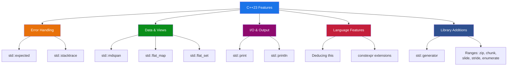
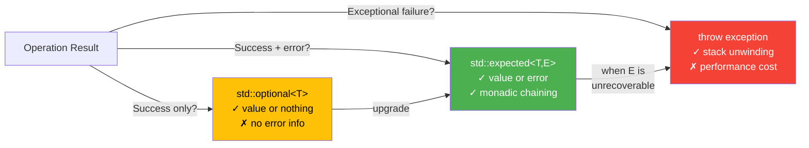

# Chapter 36 — C++23: Refinements and Additions

The following tags list the C++23 features explored in this chapter, from `std::expected` for error handling to `std::mdspan` for multidimensional array views.

```yaml
tags:
  - cpp23
  - expected
  - mdspan
  - print
  - deducing-this
  - flat_map
  - generator
  - ranges
  - constexpr
  - stacktrace
```
> **Prerequisites:** Solid grasp of C++20 (concepts, ranges, coroutines, modules)
> **Estimated Time:** 4–6 hours

---

## 1. Theory

C++23 is not a "revolution release" — it is the **refinement cycle** that follows C++20's massive feature set. Where C++20 introduced concepts, coroutines, ranges, and modules, C++23 polishes those foundations and fills critical gaps. The result is a language that is more ergonomic, safer, and more expressive without adding conceptual weight.
The philosophy behind C++23 can be summarized as **"make the right thing easy."** Error handling gets `std::expected` so you stop abusing exceptions for control flow. Multi-dimensional data gets `std::mdspan` so you stop raw-pointer arithmetic in scientific and GPU code. Output gets `std::print` so you stop choosing between type-unsafe `printf` and verbose `iostream`. Associative lookups get `flat_map`/`flat_set` so you stop paying cache-miss penalties for small collections.

These are not academic additions — every feature here solves a pain point that C++ programmers have endured for decades.

---

## 2. What / Why / How

### What?
C++23 delivers nine major feature groups: monadic error handling (`expected`), multi-dimensional views (`mdspan`), formatted I/O (`print`), explicit object parameters (deducing `this`), cache-friendly containers (`flat_map`, `flat_set`), lazy generators (`std::generator`), expanded ranges algorithms, deeper `constexpr` support, and programmatic stack traces.

### Why?
- **Safety:** `std::expected` eliminates the need for error codes *and* exception abuse.
- **Performance:** `std::flat_map` and `std::mdspan` are designed around cache locality.
- **Ergonomics:** `std::print` and deducing `this` dramatically reduce boilerplate.
- **GPU interop:** `std::mdspan` maps directly to CUDA's multi-dimensional memory model.

### How?
Compile with `-std=c++23` (GCC 13+, Clang 17+, MSVC 17.7+). Library features require updated standard library headers (`<expected>`, `<mdspan>`, `<print>`, `<flat_map>`, `<generator>`, `<stacktrace>`).

---

## 3. Code Examples

### 3.1 — std::expected: Error Handling Without Exceptions

`std::expected<T, E>` holds either a success value of type `T` or an error of type `E`. Unlike `std::optional`, it carries *why* something failed.

```cpp
// expected_demo.cpp — Parse an integer safely
#include <expected>
#include <string>
#include <charconv>
#include <print>

enum class ParseError { empty_input, invalid_format, out_of_range };

std::expected<int, ParseError> parse_int(std::string_view sv) {
    if (sv.empty())
        return std::unexpected(ParseError::empty_input);

    int value{};
    auto [ptr, ec] = std::from_chars(sv.data(), sv.data() + sv.size(), value);

    if (ec == std::errc::invalid_argument)
        return std::unexpected(ParseError::invalid_format);
    if (ec == std::errc::result_out_of_range)
        return std::unexpected(ParseError::out_of_range);

    return value;  // implicit conversion to expected<int, ParseError>
}

int main() {
    // Monadic chaining with and_then / transform / or_else
    auto result = parse_int("42")
        .transform([](int v) { return v * 2; })          // 84
        .transform([](int v) { return std::to_string(v); }); // "84"

    if (result)
        std::println("Parsed and doubled: {}", *result);
    else
        std::println("Error occurred");
}
```

### 3.2 — std::mdspan: Multi-Dimensional Array Views

`std::mdspan` provides a non-owning, multi-dimensional view over contiguous memory — essential for scientific computing and GPU kernels.

```cpp
// mdspan_demo.cpp — 2D matrix operations with mdspan
#include <mdspan>
#include <vector>
#include <print>

void multiply_matrices(
    std::mdspan<const float, std::dextents<size_t, 2>> A,
    std::mdspan<const float, std::dextents<size_t, 2>> B,
    std::mdspan<float, std::dextents<size_t, 2>>       C)
{
    for (size_t i = 0; i < C.extent(0); ++i)
        for (size_t j = 0; j < C.extent(1); ++j) {
            float sum = 0.0f;
            for (size_t k = 0; k < A.extent(1); ++k)
                sum += A[i, k] * B[k, j];  // C++23 multi-subscript
            C[i, j] = sum;
        }
}

int main() {
    std::vector<float> a_data(4, 1.0f);  // 2x2, all ones
    std::vector<float> b_data(4, 2.0f);  // 2x2, all twos
    std::vector<float> c_data(4, 0.0f);  // 2x2, result

    std::mdspan A(a_data.data(), 2, 2);
    std::mdspan B(b_data.data(), 2, 2);
    std::mdspan C(c_data.data(), 2, 2);

    multiply_matrices(A, B, C);
    std::println("C[0,0] = {}", C[0, 0]);  // 2.0
}
```

**CUDA Connection:** `std::mdspan` layout policies (`layout_left`, `layout_right`, `layout_stride`) directly correspond to column-major (Fortran/cuBLAS) and row-major memory layouts. You can wrap device memory pointers in `mdspan` for host-side dimension bookkeeping before launching kernels.

### 3.3 — std::print / std::println: Modern Output

`std::print` and `std::println` bring `std::format`-style formatting directly to output, combining the type safety of `iostream` with the concise syntax of `printf`. They support all `std::format` specifiers — alignment, width, base, precision — and can write to any output stream including `stderr`. This eliminates both the verbose `<<` chaining of `iostream` and the type-mismatch bugs of `printf`.

```cpp
// print_demo.cpp — Replacing iostream and printf
#include <print>

int main() {
    int x = 42;
    double pi = 3.14159;

    // Type-safe, no << chains, no format-string mismatches
    std::println("x = {}, pi = {:.2f}", x, pi);
    std::println(stderr, "Warning: value {} exceeds threshold", x);

    // All std::format specifiers work
    std::println("{:>10}", "right");   // right-aligned
    std::println("{:#x}", 255);        // 0xff
    std::println("{:b}", 42);          // 101010
}
```

### 3.4 — Deducing this: Explicit Object Parameter

Deducing `this` lets a member function receive its own object as an explicit parameter, enabling CRTP without templates and recursive lambdas.

```cpp
// deducing_this_demo.cpp
#include <print>

struct Widget {
    int value = 10;

    // Deduce const/non-const and value category from the caller
    void inspect(this const auto& self) {
        std::println("Value: {}", self.value);
    }

    // Replaces the CRTP pattern for chaining
    auto& set_value(this auto& self, int v) {
        self.value = v;
        return self;
    }
};

int main() {
    Widget w;
    w.set_value(42).inspect();  // "Value: 42"

    // Recursive lambda — no std::function overhead
    auto fibonacci = [](this auto self, int n) -> int {
        if (n <= 1) return n;
        return self(n - 1) + self(n - 2);
    };
    std::println("fib(10) = {}", fibonacci(10));  // 55
}
```

### 3.5 — std::flat_map / std::flat_set: Cache-Friendly Containers

`std::flat_map` stores keys and values in sorted, contiguous vectors instead of a node-based tree like `std::map`. This gives dramatically better cache locality for small-to-medium collections, since elements sit side-by-side in memory rather than scattered across heap-allocated nodes. The API is identical to `std::map`, so switching is a one-line change.

```cpp
// flat_map_demo.cpp — Sorted vectors behind a map interface
#include <flat_map>
#include <print>

int main() {
    std::flat_map<std::string, int> scores;
    scores["Alice"] = 95;
    scores["Bob"]   = 87;
    scores["Carol"] = 92;

    for (const auto& [name, score] : scores)  // contiguous, cache-friendly
        std::println("{}: {}", name, score);
}
```

### 3.6 — std::generator: Coroutine-Based Lazy Sequences

`std::generator<T>` is C++23's standard coroutine return type for lazy sequences, replacing the boilerplate `promise_type` you had to write by hand in C++20. You simply `co_yield` values from a coroutine function and iterate over the result with a range-based `for` loop or pipe it into range adaptors. Elements are produced on demand, so even infinite sequences like Fibonacci use constant memory.

```cpp
// generator_demo.cpp — Lazy infinite sequences
#include <generator>
#include <print>
#include <ranges>

std::generator<int> fibonacci() {
    int a = 0, b = 1;
    while (true) {
        co_yield a;
        auto next = a + b;
        a = b;
        b = next;
    }
}

int main() {
    for (int v : fibonacci() | std::views::take(10))
        std::print("{} ", v);
    std::println("");
}
```

### 3.7 — Ranges Improvements

C++23 adds several powerful range adaptors that were missing from C++20: `enumerate` gives you index-value pairs, `zip` combines multiple ranges element-wise, `chunk` and `slide` split ranges into fixed-size groups or sliding windows, `stride` takes every Nth element, and `cartesian_product` generates all combinations. These eliminate common manual loop patterns and compose naturally with the pipe `|` operator.

```cpp
// ranges_demo.cpp — New C++23 range adaptors
#include <ranges>
#include <vector>
#include <print>
#include <string>

int main() {
    std::vector<int> v{1, 2, 3, 4, 5, 6, 7, 8};

    // enumerate — index + value pairs
    for (auto [i, val] : v | std::views::enumerate)
        std::println("[{}] = {}", i, val);

    // zip — combine multiple ranges element-wise
    std::vector<std::string> names{"A", "B", "C"};
    std::vector<int> ages{25, 30, 35};
    for (auto [name, age] : std::views::zip(names, ages))
        std::println("{} is {}", name, age);

    // chunk — split into groups of N
    for (auto chunk : v | std::views::chunk(3))
        std::print("[{}] ", chunk.size());

    // slide — sliding window of size N
    for (auto window : v | std::views::slide(3))
        std::println("[{}, {}, {}]", window[0], window[1], window[2]);

    // stride — take every Nth element
    for (int val : v | std::views::stride(2))
        std::print("{} ", val);  // 1 3 5 7

    // cartesian_product — all combinations
    std::vector<char> suits{'H', 'D'};
    std::vector<int>  ranks{1, 2};
    for (auto [suit, rank] : std::views::cartesian_product(suits, ranks))
        std::println("{}{}", suit, rank);
}
```

### 3.8 — constexpr Enhancements

C++23 extends `constexpr` to support `std::unique_ptr` and virtual function calls at compile time. This means you can allocate heap memory, use polymorphism, and run complex object-oriented logic entirely during compilation — the result is baked into the binary as a constant. Previously, compile-time computation was limited to simple arithmetic and non-virtual calls.

```cpp
// constexpr_demo.cpp — constexpr unique_ptr and virtual functions
#include <memory>
#include <print>

struct Shape {
    constexpr virtual ~Shape() = default;
    constexpr virtual double area() const = 0;  // constexpr virtual!
};

struct Circle : Shape {
    double radius;
    constexpr Circle(double r) : radius(r) {}
    constexpr double area() const override { return 3.14159 * radius * radius; }
};

constexpr double compute_area() {
    // constexpr unique_ptr — allocation at compile time
    auto shape = std::make_unique<Circle>(5.0);
    return shape->area();  // evaluated at compile time
}

int main() {
    constexpr double a = compute_area();
    static_assert(a > 78.0 && a < 79.0);
    std::println("Circle area (compile-time): {:.4f}", a);
}
```

### 3.9 — std::stacktrace: Programmatic Stack Traces

`std::stacktrace` lets you capture and inspect the call stack at runtime from within your C++ code — no debugger needed. Each entry provides the function name, source file, and line number. This is invaluable for logging, crash reporting, and diagnostic assertions in production, replacing platform-specific hacks like `backtrace()` on Linux or `CaptureStackBackTrace()` on Windows.

```cpp
// stacktrace_demo.cpp — Capture and print stack traces
#include <stacktrace>
#include <print>

void inner() {
    auto trace = std::stacktrace::current();
    for (const auto& entry : trace)
        std::println("  {} at {}:{}", entry.description(),
                     entry.source_file(), entry.source_line());
}
void outer() { inner(); }

int main() { outer(); }
```

---

## 4. Diagrams

### C++23 Feature Taxonomy


### std::expected vs std::optional vs Exceptions



---

## 5. Exercises

### 🟢 Easy — E1: Print Formatting
Write a program using `std::println` that prints a table of the first 10 squares, with each number right-aligned in a 4-character field and each square right-aligned in a 6-character field.

### 🟢 Easy — E2: Expected Basics
Write a function `safe_divide(double a, double b) -> std::expected<double, std::string>` that returns an error string on division by zero.

### 🟡 Medium — E3: Generator Pipeline
Create a `std::generator<int>` that yields all multiples of 3 *or* 5 below a given limit. Pipe it through `std::views::take(20)` and print the results.

### 🟡 Medium — E4: mdspan Matrix Transpose
Write a function that takes a `std::mdspan<int, std::dextents<size_t, 2>>` and returns a transposed copy in a `std::vector<int>`.

### 🔴 Hard — E5: Deducing this Builder
Create a `QueryBuilder` class using deducing `this` for method chaining with `.select()`, `.from()`, `.where()`, and `.build()`. Ensure it works with both lvalue and rvalue builders.

---

## 6. Solutions

### S1: Print Formatting

This solution uses `std::println` with format specifiers `{:>4}` and `{:>6}` to right-align numbers in fixed-width columns, producing a clean table of squares. The format string approach is more readable than chaining `std::setw` with `iostream`.

```cpp
#include <print>
int main() {
    std::println("{:>4} {:>6}", "N", "N²");
    std::println("{:-<4} {:-<6}", "", "");
    for (int i = 1; i <= 10; ++i)
        std::println("{:>4} {:>6}", i, i * i);
}
```

### S2: Expected Division

This solution returns `std::expected<double, std::string>` from `safe_divide`, using `std::unexpected` to signal division-by-zero with a descriptive error string. The caller checks the result with a simple `if` — no try/catch needed, and the error reason is preserved unlike `std::optional`.

```cpp
#include <expected>
#include <string>
#include <print>

std::expected<double, std::string> safe_divide(double a, double b) {
    if (b == 0.0) return std::unexpected("division by zero");
    return a / b;
}

int main() {
    auto r = safe_divide(10.0, 3.0);
    if (r) std::println("Result: {:.4f}", *r);
    auto e = safe_divide(1.0, 0.0);
    if (!e) std::println("Error: {}", e.error());
}
```

### S3: Generator Pipeline

This solution uses `std::generator<int>` to lazily yield all FizzBuzz numbers (multiples of 3 or 5) below a limit via `co_yield`, then pipes the generator through `std::views::take(20)` to collect only the first 20 results. The generator produces values on demand, so even a large limit doesn't allocate a container.

```cpp
#include <generator>
#include <ranges>
#include <print>

std::generator<int> fizzbuzz_numbers(int limit) {
    for (int i = 1; i < limit; ++i)
        if (i % 3 == 0 || i % 5 == 0)
            co_yield i;
}

int main() {
    for (int v : fizzbuzz_numbers(1000) | std::views::take(20))
        std::print("{} ", v);
}
```

### S4: mdspan Transpose

This solution wraps a flat `std::vector<int>` in two `std::mdspan` views — one for the source matrix and one for the transposed result — then swaps row and column indices during the copy. The C++23 multi-subscript syntax `dst[j, i] = src[i, j]` makes the transpose logic clear and concise without manual index arithmetic.

```cpp
#include <mdspan>
#include <vector>
#include <print>

std::vector<int> transpose(std::mdspan<const int, std::dextents<size_t, 2>> src) {
    auto rows = src.extent(0), cols = src.extent(1);
    std::vector<int> result(rows * cols);
    std::mdspan dst(result.data(), cols, rows);
    for (size_t i = 0; i < rows; ++i)
        for (size_t j = 0; j < cols; ++j)
            dst[j, i] = src[i, j];
    return result;
}

int main() {
    std::vector<int> data{1, 2, 3, 4, 5, 6};
    auto t = transpose(std::mdspan(data.data(), 2, 3));
    std::mdspan mt(t.data(), 3, 2);
    std::println("Transposed [0,1] = {}", mt[0, 1]);  // 4
}
```

### S5: Deducing this Builder

This solution uses the C++23 "deducing this" feature (`this auto& self`) so each builder method works with both lvalue and rvalue objects without writing separate const/non-const overloads. The explicit object parameter replaces the traditional CRTP pattern for method chaining, making the code simpler and avoiding template inheritance boilerplate.

```cpp
#include <string>
#include <print>

class QueryBuilder {
    std::string cols_ = "*", table_, cond_;
public:
    auto& select(this auto& self, std::string c) { self.cols_ = std::move(c); return self; }
    auto& from(this auto& self, std::string t)   { self.table_ = std::move(t); return self; }
    auto& where(this auto& self, std::string w)   { self.cond_ = std::move(w); return self; }
    std::string build(this const auto& self) {
        auto sql = "SELECT " + self.cols_ + " FROM " + self.table_;
        if (!self.cond_.empty()) sql += " WHERE " + self.cond_;
        return sql + ";";
    }
};

int main() {
    QueryBuilder qb;
    std::println("{}", qb.select("name, age").from("users").where("age > 21").build());
    std::println("{}", QueryBuilder{}.select("*").from("orders").build());
}
```

---

## 7. Quiz

**Q1.** What does `std::expected<T, E>` hold?
- A) Always a value of type T
- B) Either a value of type T or an error of type E ✅
- C) A pair of T and E
- D) An optional T with an exception pointer

**Q2.** Which layout policy does `std::mdspan` default to?
- A) `layout_left` (column-major)
- B) `layout_right` (row-major) ✅
- C) `layout_stride`
- D) No default — must always be specified

**Q3.** What is the key advantage of `std::flat_map` over `std::map`?
- A) O(1) lookup instead of O(log n)
- B) Contiguous memory storage for better cache performance ✅
- C) Thread safety
- D) Automatic rebalancing

**Q4.** What does "deducing this" allow that was previously impossible without CRTP?
- A) Virtual dispatch
- B) Deducing the const/ref-qualification of the calling object in non-template code ✅
- C) Multiple inheritance
- D) Operator overloading

**Q5.** Which new range adaptor pairs each element with its index?
- A) `std::views::zip_with_index`
- B) `std::views::enumerate` ✅
- C) `std::views::indexed`
- D) `std::views::count`

**Q6.** What does `std::println` add over `std::print`?
- A) Color support
- B) An automatic trailing newline ✅
- C) Thread safety
- D) Unicode normalization

**Q7.** What can `constexpr` do in C++23 that it couldn't in C++20?
- A) Use `goto` statements
- B) Allocate with `std::make_unique` and call virtual functions ✅
- C) Perform I/O
- D) Launch threads

---

## 8. Key Takeaways

- **`std::expected<T, E>`** is the modern answer to error handling — it carries success *or* error, supports monadic chaining, and avoids exception overhead.
- **`std::mdspan`** gives zero-overhead multi-dimensional views over flat memory, bridging host C++ and GPU kernel data layouts.
- **`std::print` / `std::println`** combine printf's format strings with iostream's type safety — the best of both worlds.
- **Deducing `this`** eliminates CRTP boilerplate and enables recursive lambdas without `std::function`.
- **`std::flat_map` / `std::flat_set`** use sorted vectors internally, trading O(log n) insertion for dramatically better cache locality on iteration and lookup.
- **`std::generator`** makes lazy sequences trivial — just `co_yield` values.
- **New range adaptors** (`zip`, `chunk`, `slide`, `stride`, `enumerate`, `cartesian_product`) fill the gaps that made C++20 ranges feel incomplete.
- **`constexpr` unique_ptr and virtual functions** push more computation to compile time.
- **`std::stacktrace`** gives you programmatic stack traces for logging and diagnostics without platform-specific hacks.

---

## 9. Chapter Summary

C++23 completes the promise of C++20 by delivering ergonomic and library improvements that programmers needed to fully leverage concepts, coroutines, and ranges. `std::expected` standardizes "Result type" error handling. `std::mdspan` gives scientific and GPU computing a vocabulary type for multi-dimensional data. `std::print` ends the printf-vs-iostream debate. Deducing `this` simplifies CRTP patterns. Together, these features make C++23 the most immediately practical standard release in years — each feature pays for itself from day one.

---

## 10. Real-World Insight
**GPU Computing with mdspan:** In CUDA workflows, flat device memory from `cudaMalloc` requires manual index arithmetic (`row * width + col`). `std::mdspan` eliminates this on the host side — you reason about dimensions through the type system, then pass the raw pointer and extents to your kernel. Layout policies (`layout_right` for row-major, `layout_left` for column-major cuBLAS) catch transposition bugs at compile time rather than producing silent wrong results.

**Error Handling in Production:** Major codebases (Chromium, LLVM, game engines) have long maintained custom `Result<T, E>` types. `std::expected` standardizes this, enabling monadic chaining (`and_then`, `transform`, `or_else`) for Railway-Oriented Programming — no nested if-else pyramids.

---

## 11. Common Mistakes

1. **Confusing `std::expected` with `std::optional`.** `optional<T>` means "maybe a value" — it cannot carry error information. Use `expected<T, E>` when callers need to know *why* something failed.
2. **Assuming `std::flat_map` is always faster than `std::map`.** Flat maps excel for small-to-medium read-heavy workloads. For large collections with frequent insertions, `std::map`'s O(log n) beats flat_map's O(n) shifting.
3. **Forgetting that `std::mdspan` is non-owning.** The underlying data must outlive the mdspan. Don't create an mdspan over a temporary vector.
4. **Using `std::print` without `<print>` header.** It is *not* in `<iostream>` or `<format>`.
5. **Writing deducing `this` without naming the parameter.** The explicit object parameter must be named — you cannot use `this` as both keyword and parameter.
6. **Expecting `std::generator` to be eager.** Generators are lazy — they compute values only when iterated.
7. **Mixing up `layout_left` and `layout_right`.** `layout_right` (row-major) is the default. CUDA/Fortran libraries expect `layout_left` (column-major). Getting this wrong silently transposes data.

---

## 12. Interview Questions

### Q1: Compare `std::expected` with exceptions and error codes.

**Answer:** Error codes are fastest but require manual checking — easy to ignore. Exceptions provide automatic propagation but impose stack-unwinding overhead and are disabled in many embedded/game/GPU codebases. `std::expected<T, E>` sits in the middle: zero overhead on the happy path, forces callers to handle errors (value is wrapped), and supports monadic chaining. Choose exceptions for truly unrecoverable conditions, `expected` for anticipated failures in hot paths, and error codes only for C API interop.

### Q2: How does `std::mdspan` relate to GPU programming?

**Answer:** GPU kernels operate on flat memory. `std::mdspan` maps multi-dimensional indices to offsets using layout policies. `layout_right` (default) is row-major; `layout_left` is column-major (what cuBLAS expects). On the host, mdspan provides type-safe dimension tracking; you pass the raw pointer and extents to the kernel, eliminating manual `row * cols + col` arithmetic and catching dimension mismatches at compile time.

### Q3: Explain deducing `this` and give two use cases.

**Answer:** Deducing `this` (P0847) lets a member function declare its object parameter explicitly: `void foo(this const auto& self)`. The compiler deduces the exact type including const/ref qualification. **Use case 1: CRTP replacement** — a `clone()` method returns the derived type without template inheritance. **Use case 2: Recursive lambdas** — `[](this auto self, int n) -> int { return self(n-1); }` calls itself directly without `std::function` overhead.

### Q4: When should you prefer `std::flat_map` over `std::map`?

**Answer:** Use `flat_map` for small-to-medium collections where lookups and iteration dominate insertions. It stores keys and values in sorted contiguous vectors, so iteration has excellent cache locality. `std::map` uses a red-black tree with scattered heap nodes — each access risks a cache miss. For large datasets with frequent mutations, `std::map` wins because `flat_map`'s insertion requires element shifting (O(n)).
