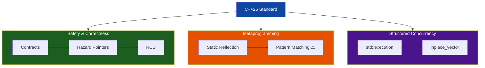
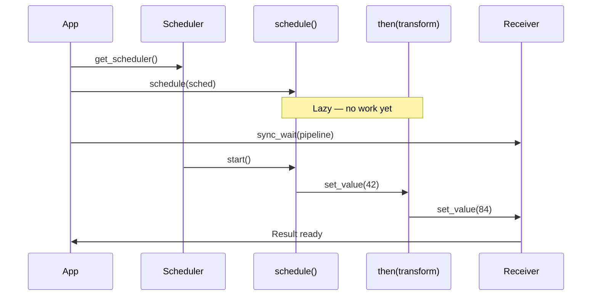

# Chapter 37 — C++26: The Bleeding Edge

```yaml
tags: [cpp26, contracts, static-reflection, pattern-matching, std-execution, hazard-pointers, rcu, inplace-vector]
```

---

## Theory

C++26 targets the *foundational gaps* that have plagued C++ for decades: no way to express function contracts in code, no compile-time reflection, and no structured concurrency in the standard library. The committee's work spans three pillars:

1. **Safety** — Contracts (`pre`, `post`, `contract_assert`) give compilers machine-checkable invariants.
2. **Metaprogramming** — Static reflection (`^T`, `meta::info`) replaces template gymnastics with direct type introspection.
3. **Structured concurrency** — `std::execution` (senders/receivers) supersedes the broken `std::async`/`std::future` model.

Additional features — `std::inplace_vector`, hazard pointers, RCU, and pattern matching — round out a release touching every level of the stack.

> **Note:** C++26 is not yet finalized. Each feature below is marked **Accepted** or **Proposed**.

---

## What / Why / How

| Aspect | Details |
|--------|---------|
| **What** | The next major C++ standard, targeting ratification in late 2026. |
| **Why** | Closes gaps in safety, metaprogramming, and concurrency. Addresses Rust/Swift competitive pressure. |
| **How** | ISO WG21 papers, committee votes, staged compiler implementations. |

---

## Feature Status Table

| Feature | Paper(s) | Status (mid-2025) |
|---------|----------|-------------------|
| Contracts (MVP) | P2900 | ✅ Accepted |
| Static reflection | P2996, P3394 | ✅ Accepted |
| `std::execution` | P2300 | ✅ Accepted |
| `std::inplace_vector` | P0843 | ✅ Accepted |
| Hazard pointers | P2530 | ✅ Accepted |
| RCU (read-copy-update) | P2545 | ✅ Accepted |
| Pattern matching | P2688 | 🔶 Proposed |
| Pack indexing | P2662 | ✅ Accepted |
| `#embed` | P1967 | ✅ Accepted |

---

## 1. Contracts — pre / post / contract_assert

```cpp
// STATUS: Accepted (P2900) — C++26

#include <vector>
#include <cstddef>

// Precondition: valid index. Postcondition: non-negative result.
int safe_access(const std::vector<int>& v, std::size_t idx)
    pre(idx < v.size())
    post(r: r >= 0)
{
    return v[idx];
}

// contract_assert replaces assert() inside function bodies
double safe_sqrt(double x)
    pre(x >= 0.0)
{
    contract_assert(x >= 0.0);
    return x; // placeholder
}

// Contracts on member functions
class CircularBuffer {
    int* data_;
    std::size_t capacity_, size_ = 0;
public:
    void push(int value) pre(size_ < capacity_) post(size_ > 0) {
        data_[size_++] = value;
    }
    int pop() pre(size_ > 0) { return data_[--size_]; }
};
```

**Violation semantics:** build modes (`observe`, `enforce`, `ignore`) control runtime behavior without source changes.

---

## 2. Static Reflection — ^T, meta::info

```cpp
// STATUS: Accepted (P2996/P3394) — C++26

#include <meta>
#include <string>

enum class Color { Red, Green, Blue };

// Enum-to-string — no macros needed
template <typename E>
consteval std::string enum_to_string(E value) {
    std::string result;
    [:expand(enumerators_of(^E)):] >> [&]<auto e> {
        if (value == [:e:])
            result = std::string(identifier_of(e));
    };
    return result;
}

// Auto struct-to-JSON serialization
template <typename T>
std::string to_json(const T& obj) {
    std::string out = "{";
    bool first = true;
    [:expand(nonstatic_data_members_of(^T)):] >> [&]<auto dm> {
        if (!first) out += ", ";
        first = false;
        out += "\"" + std::string(identifier_of(dm)) + "\": " + std::to_string(obj.[:dm:]);
    };
    return out + "}";
}

struct Point { double x; double y; double z; };
// to_json(Point{1,2,3}) -> {"x": 1.0, "y": 2.0, "z": 3.0}
```

---

## 3. Pattern Matching — inspect (Proposed)

```cpp
// STATUS: Proposed (P2688) — NOT yet accepted. Syntax may change.

#include <variant>
#include <string>

/* PROPOSED SYNTAX — may not compile with any current compiler
std::string describe(int x) {
    return inspect(x) {
        0        => "zero",
        1 | 2    => "one or two",
        int i if (i > 100) => "large",
        __       => "other"
    };
}
*/

// What you can do TODAY with std::visit (C++17):
struct Circle    { double radius; };
struct Rectangle { double width, height; };
using Shape = std::variant<Circle, Rectangle>;

double area_today(const Shape& s) {
    return std::visit([](auto&& shape) -> double {
        using T = std::decay_t<decltype(shape)>;
        if constexpr (std::is_same_v<T, Circle>)
            return 3.14159 * shape.radius * shape.radius;
        else
            return shape.width * shape.height;
    }, s);
}
```

---

## 4. std::execution — Senders and Receivers

```cpp
// STATUS: Accepted (P2300) — C++26
// Use NVIDIA's stdexec library to compile today.

#include <execution>
#include <cstdio>

namespace ex = std::execution;

void sender_example() {
    ex::static_thread_pool pool(4);
    auto sched = pool.get_scheduler();

    // Lazy pipeline — nothing runs until sync_wait
    auto work = ex::schedule(sched)
              | ex::then([] { return 42; })
              | ex::then([](int v) { return v * 2; })
              | ex::then([](int v) { std::printf("Result: %d\n", v); });

    ex::sync_wait(std::move(work));  // prints 84
}

void parallel_work() {
    ex::static_thread_pool pool(4);
    auto sched = pool.get_scheduler();

    auto a = ex::schedule(sched) | ex::then([] { return 10; });
    auto b = ex::schedule(sched) | ex::then([] { return 20; });

    auto combined = ex::when_all(std::move(a), std::move(b))
                  | ex::then([](int x, int y) { std::printf("Sum: %d\n", x + y); });

    ex::sync_wait(std::move(combined));  // prints 30
}
```

---

## 5. Hazard Pointers and RCU

```cpp
// STATUS: Both Accepted — C++26  (Hazard: P2530 | RCU: P2545)

#include <hazard_pointer>
#include <rcu>
#include <atomic>

// --- Hazard Pointers: protect temporarily accessed pointers ---
struct Node { int value; Node* next; };
std::atomic<Node*> head{nullptr};

int read_head_value() {
    auto hp = std::hazard_pointer<Node>();
    Node* p = hp.protect(head);  // "I'm reading this"
    return p ? p->value : -1;
}

void remove_head() {
    Node* old = head.exchange(nullptr);
    if (old) old->retire();  // freed once no hazard pointer guards it
}

// --- RCU: optimized for read-heavy workloads ---
struct Config : std::rcu_obj_base<Config> {
    std::string server_name;
    int port;
};

std::atomic<Config*> global_config;

void reader() {
    std::scoped_lock lk(std::rcu_default_domain());
    Config* cfg = global_config.load(std::memory_order_acquire);
    // use cfg freely — zero-cost read-side lock
}

void writer(const std::string& name, int port) {
    auto* nc = new Config{name, port};
    Config* old = global_config.exchange(nc, std::memory_order_release);
    if (old) old->retire();
}
```

---

## 6. std::inplace_vector

```cpp
// STATUS: Accepted (P0843) — C++26

#include <inplace_vector>
#include <algorithm>

void demo() {
    std::inplace_vector<int, 8> buf;  // stack-only, capacity 8
    buf.push_back(10);
    buf.push_back(20);
    std::sort(buf.begin(), buf.end());

    // try_push_back: no-throw alternative (returns false when full)
    for (int i = 0; i < 10; ++i) {
        if (!buf.try_push_back(i)) break;
    }
}

// GPU use case: no heap needed in device code
struct Particle { float x, y, z, mass; };

void simulate() {
    std::inplace_vector<Particle, 16> neighbors;
    // populate from spatial hash — zero allocation
    float total = 0.f;
    for (auto& p : neighbors) total += p.mass;
}
```

---

## Mermaid Diagrams

### Diagram 1 — C++26 Feature Pillars



### Diagram 2 — Sender/Receiver Pipeline



---

## Impact on GPU and Systems Programming

- **`std::inplace_vector`** — usable in GPU device code where heap allocation is unavailable.
- **`std::execution`** — GPU runtimes (CUDA, SYCL) can plug in as schedulers. NVIDIA's stdexec demonstrates this.
- **Contracts** — enable kernel precondition checking in debug builds.
- **Static reflection** — can auto-generate AoS ↔ SoA layout transformers at compile time.

---

## Compiler Support Predictions

| Feature | GCC | Clang | MSVC |
|---------|-----|-------|------|
| Contracts | 15+ (partial) | 20+ (partial) | 2027+ |
| Static reflection | 16+ | 20+ (experimental) | 2028+ |
| `std::execution` | TBD | 20+ | 2027+ |
| `std::inplace_vector` | 15+ | 19+ | 2026+ |
| Hazard ptrs / RCU | 15+ | 19+ | 2027+ |
| Pattern matching | — | — | — |

---

## Exercises

### 🟢 Exercise 1 — Contract Basics
Write `int divide(int a, int b)` with a precondition that `b != 0` and a postcondition binding `r` asserting `r * b <= a`.

### 🟡 Exercise 2 — Inplace Vector Histogram
Using `std::inplace_vector<int, 256>`, write a function returning ASCII character frequency counts from a `string_view`. No heap allocation allowed.

### 🟡 Exercise 3 — Sender Pipeline
Build a sender pipeline that schedules on a thread pool, produces integers 1–5 with `just`, squares each, and prints results.

### 🔴 Exercise 4 — Reflection Equality
Using P2996 reflection, write `constexpr bool struct_equal(const T& a, const T& b)` comparing all non-static data members generically.

### 🔴 Exercise 5 — Hazard Pointer Stack
Implement a lock-free stack with `std::hazard_pointer` providing `push()` and `try_pop()`.

---

## Solutions

### Solution 1
```cpp
int divide(int a, int b)
    pre(b != 0)
    post(r: r * b <= a)
{ return a / b; }
```

### Solution 2
```cpp
#include <inplace_vector>
#include <string_view>

std::inplace_vector<int, 256> histogram(std::string_view text) {
    std::inplace_vector<int, 256> h;
    h.resize(256, 0);
    for (unsigned char c : text) h[c]++;
    return h;
}
```

### Solution 3
```cpp
namespace ex = std::execution;
void run() {
    ex::static_thread_pool pool(4);
    auto work = ex::just(1,2,3,4,5)
              | ex::then([](int a,int b,int c,int d,int e) {
                    std::printf("%d %d %d %d %d\n", a*a,b*b,c*c,d*d,e*e);
                });
    ex::sync_wait(ex::on(pool.get_scheduler(), std::move(work)));
}
```

### Solution 4
```cpp
template <typename T>
constexpr bool struct_equal(const T& a, const T& b) {
    bool eq = true;
    [:expand(nonstatic_data_members_of(^T)):] >> [&]<auto dm> {
        if (a.[:dm:] != b.[:dm:]) eq = false;
    };
    return eq;
}
// static_assert(struct_equal(Point{1,2}, Point{1,2}));
```

### Solution 5
```cpp
template <typename T>
class LockFreeStack {
    struct Node { T value; Node* next; };
    std::atomic<Node*> top_{nullptr};
public:
    void push(T val) {
        auto* n = new Node{std::move(val), top_.load(std::memory_order_relaxed)};
        while (!top_.compare_exchange_weak(n->next, n,
                   std::memory_order_release, std::memory_order_relaxed));
    }
    std::optional<T> try_pop() {
        auto hp = std::hazard_pointer<Node>();
        Node* old = hp.protect(top_);
        while (old) {
            if (top_.compare_exchange_weak(old, old->next,
                    std::memory_order_acquire, std::memory_order_relaxed)) {
                T val = std::move(old->value);
                old->retire();
                return val;
            }
            old = hp.protect(top_);
        }
        return std::nullopt;
    }
};
```

---

## Quiz

**Q1.** What keyword introduces a precondition in C++26?
A) `requires`  B) `expects`  C) `pre`  D) `assume`
**Answer:** C — `pre(condition)` after the parameter list.

**Q2.** What does `^T` produce in static reflection?
A) A pointer to T  B) A `meta::info` object  C) A `type_info` ref  D) A compile error
**Answer:** B — The `^` operator yields a `meta::info` for compile-time introspection.

**Q3.** In `std::execution`, what is a sender?
A) A thread  B) A lazy description of async work  C) A callback  D) A mutex wrapper
**Answer:** B — Senders describe work graphs, executed only when connected and started.

**Q4.** What happens when a full `inplace_vector` receives `push_back()`?
A) UB  B) Silent drop  C) Throws `std::bad_alloc`  D) Reallocates
**Answer:** C — Use `try_push_back()` for a non-throwing alternative.

**Q5.** Which is optimized for read-heavy, write-rare workloads?
A) `std::mutex`  B) `std::shared_mutex`  C) RCU  D) `std::atomic_flag`
**Answer:** C — Readers pay near-zero cost; only writers synchronize.

**Q6.** What is the status of pattern matching (`inspect`) for C++26?
A) Shipped  B) Accepted  C) Proposed, not accepted  D) Rejected
**Answer:** C — P2688 remains under active proposal.

**Q7.** Hazard pointers solve which problem?
A) Deadlock detection  B) Safe memory reclamation in lock-free code  C) Priority inversion  D) Cache coherence
**Answer:** B — Prevents freeing memory another thread is reading.

---

## Key Takeaways

- **Contracts** (`pre`, `post`, `contract_assert`) are machine-checkable, build-mode configurable, and superior to `assert()`.
- **Static reflection** enables auto-serialization, ORM mapping, and enum-to-string without macros or code generators.
- **`std::execution`** replaces `std::async`/`std::future` with composable, lazy sender/receiver pipelines.
- **`std::inplace_vector`** fills the gap between `std::array` and `std::vector` — critical for embedded, real-time, and GPU code.
- **Hazard pointers and RCU** bring kernel-level lock-free primitives into the standard library.
- **Pattern matching** (`inspect`) is the most-requested feature not yet accepted; may target C++26 or C++29.
- Experiment now with stdexec and clang-p2996 to stay ahead of compiler releases.

---

## Chapter Summary

C++26 represents a generational leap. Contracts close the safety gap with Rust's invariant checking. Static reflection eliminates the metaprogramming gymnastics that made template code unreadable. `std::execution` provides structured concurrency the standard has lacked since C++11 introduced threads. Practical additions like `std::inplace_vector`, hazard pointers, and RCU strengthen C++ in domains from embedded to HFT. While pattern matching may slip to a later standard, the accepted features make C++26 the most significant release in over a decade.

---

## Real-World Insight

**Trading systems** are early adopters: lock-free order books use hazard pointers replacing fragile epoch reclamation; `std::inplace_vector` replaces `boost::static_vector` in hot-path parsing where heap allocation causes jitter; contracts express exchange protocol invariants (`pre(price > 0)`) enforced in test and compiled away in production; sender pipelines model market-data → strategy → order flows as composable, testable graphs. In GPU computing, NVIDIA's stdexec already lets CUDA kernels participate in sender/receiver pipelines without manual `cudaStreamSynchronize`.

---

## Common Mistakes

1. **Side effects in contracts.** Conditions may run zero or multiple times. Never write `pre(validate(x))` if `validate` mutates state.
2. **Assuming pattern matching is accepted.** `inspect` is proposed, not in the working draft. Don't depend on it.
3. **`push_back()` on full `inplace_vector`.** It throws — there is no reallocation. Use `try_push_back()`.
4. **Confusing hazard pointers with `shared_ptr`.** Hazard pointers protect *temporarily accessed* lock-free pointers, not ownership.
5. **Treating senders as eager.** They are lazy — nothing executes until `sync_wait` or equivalent.
6. **Runtime splice of `meta::info`.** The `[:expr:]` syntax is compile-time only; you cannot store and splice later at runtime.
7. **Relying on contracts for control flow.** Contracts are checks, not guards. Code must be correct even with contracts disabled.

---

## Interview Questions

**Q1: Why does C++26 add contracts when `assert()` exists?**
`assert()` is a preprocessor macro — binary (on/off via `NDEBUG`), invisible to compilers and analyzers. Contracts are language-level: they distinguish pre/post/assert, support multiple build modes (observe/enforce/ignore), enable static analysis, and allow custom violation handlers instead of hard `abort()`.

**Q2: How does `std::execution` improve upon `std::async`/`std::future`?**
`std::async` eagerly launches work; `future`'s destructor may block; there's no scheduler concept; errors use exceptions. `std::execution` senders are lazy, compose via `|`, target explicit schedulers, and propagate errors through `set_error` — no exceptions required.

**Q3: Why is `std::inplace_vector` critical for GPU programming?**
GPU device code cannot use `malloc`/`new`. `inplace_vector<T,N>` provides dynamic-size semantics (push, pop, iterate) with all storage inline at compile-time-known capacity — safe for kernels, ISRs, and real-time loops.

**Q4: How does RCU achieve near-zero reader overhead?**
Readers enter a lightweight critical section (flag/counter), access data without locks or atomics on the data itself, and exit. Writers publish new versions and defer old-version deletion until all current readers finish — trading higher peak memory for zero reader contention.

**Q5: What is `meta::info` vs `std::type_info`?**
`type_info` (RTTI) provides only a mangled name and equality at runtime. `meta::info` is compile-time: it carries full structural information (members, enumerators, signatures) and can be spliced back into code with `[:expr:]` — enabling auto-serialization, ORM, and enum-to-string with zero runtime cost.
