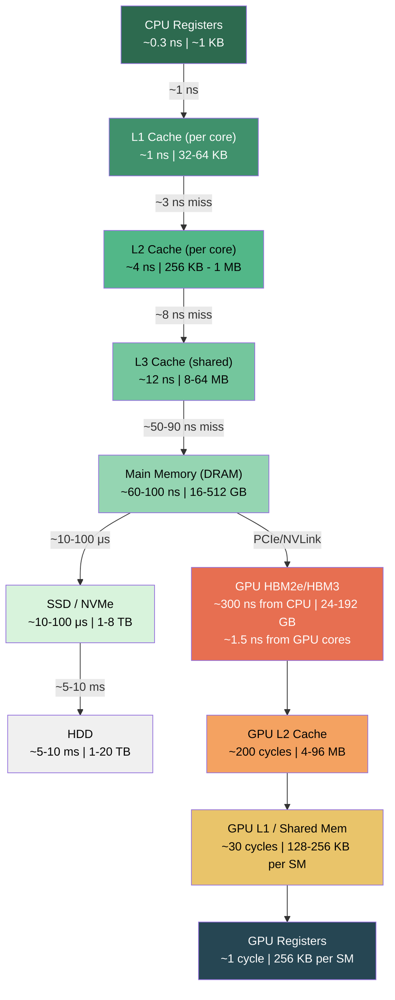

# Chapter 39 — Memory Architecture Deep-Dive

**Tags:** `memory-hierarchy`, `virtual-memory`, `cache`, `NUMA`, `false-sharing`, `mmap`, `systems-programming`

---

## Theory

Every instruction a CPU executes ultimately reads or writes memory. Modern hardware
bridges the gap between fast cores (~0.3 ns/cycle) and slow DRAM (~60-100 ns) through
multi-level caches, virtual memory translation, and non-uniform topologies.

### The Memory Wall

Processor speeds have outpaced memory bandwidth by orders of magnitude since the 1980s.
Caches, prefetchers, and TLBs exist solely to hide this latency.

---

## What / Why / How

### What Is Virtual Memory?

Virtual memory gives each process a private address space. The OS and MMU translate
virtual addresses to physical addresses on every access.

| Component | Role |
|-----------|------|
| **Page** | Fixed-size block (typically 4 KB) of virtual memory |
| **Page Table** | Per-process mapping: virtual page → physical frame |
| **TLB** | Hardware cache of recent page-table entries (~64-1536 entries) |
| **Page Fault** | Interrupt when a page is not resident in RAM |

### Why Do We Need Caches?

DRAM latency is ~100× slower than a CPU cycle. Caches exploit **temporal locality**
(recent data reused) and **spatial locality** (nearby data needed soon) to serve most
accesses in 1-12 ns.

### How Does Cache Associativity Work?

A cache line is 64 bytes on x86. Loading a single byte fetches the full 64-byte line.
Lines are placed into **sets** based on address bits:

- **Direct-mapped:** one set per address — fast but collision-prone.
- **N-way set-associative:** N candidate lines per set — balances speed and hit rate.
- **Fully associative:** any line can go anywhere — best hit rate, expensive hardware.

Most L1 caches are 8-way; L2 is 4-16 way; L3 is 12-20 way.

---

## Memory Hierarchy Diagram



---

## Cache-Friendly vs Cache-Unfriendly Code

Row-major traversal exploits spatial locality; column-major causes constant cache misses.

```cpp
// file: cache_benchmark.cpp
// compile: g++ -O2 -std=c++17 -o cache_benchmark cache_benchmark.cpp
#include <iostream>
#include <chrono>
#include <vector>

constexpr int N = 4096;

int main() {
    // Allocate N x N matrix as flat array (row-major)
    std::vector<int> matrix(N * N, 1);

    // --- Row-major traversal (cache-friendly) ---
    auto t0 = std::chrono::high_resolution_clock::now();
    long long sum_row = 0;
    for (int i = 0; i < N; ++i)
        for (int j = 0; j < N; ++j)
            sum_row += matrix[i * N + j];
    auto t1 = std::chrono::high_resolution_clock::now();

    // --- Column-major traversal (cache-unfriendly) ---
    auto t2 = std::chrono::high_resolution_clock::now();
    long long sum_col = 0;
    for (int j = 0; j < N; ++j)
        for (int i = 0; i < N; ++i)
            sum_col += matrix[i * N + j];
    auto t3 = std::chrono::high_resolution_clock::now();

    auto row_ms = std::chrono::duration<double, std::milli>(t1 - t0).count();
    auto col_ms = std::chrono::duration<double, std::milli>(t3 - t2).count();

    std::cout << "Row-major:    " << row_ms << " ms  (sum=" << sum_row << ")\n";
    std::cout << "Column-major: " << col_ms << " ms  (sum=" << sum_col << ")\n";
    std::cout << "Ratio:        " << col_ms / row_ms << "x slower\n";
    return 0;
}
```

Typical output: Row-major ~12 ms, Column-major ~69 ms (5.6× slower).

---

## False Sharing — Detection and Fix

False sharing occurs when two threads write to different variables on the same 64-byte
cache line. The coherence protocol (MESI) forces the line to bounce between cores.

```cpp
// file: false_sharing.cpp
// compile: g++ -O2 -std=c++17 -pthread -o false_sharing false_sharing.cpp
#include <iostream>
#include <thread>
#include <chrono>
#include <vector>

constexpr long long ITERS = 100'000'000LL;

// BAD: counters on the same cache line
struct SharedCounters {
    long long a;  // offset 0
    long long b;  // offset 8 — same 64-byte line as 'a'
};

// GOOD: each counter on its own cache line
struct alignas(64) PaddedCounter {
    long long value;
};

void increment(long long* ptr) {
    for (long long i = 0; i < ITERS; ++i)
        ++(*ptr);
}

int main() {
    // --- False-sharing version ---
    SharedCounters shared{};
    auto t0 = std::chrono::high_resolution_clock::now();
    std::thread t1(increment, &shared.a);
    std::thread t2(increment, &shared.b);
    t1.join(); t2.join();
    auto t1_end = std::chrono::high_resolution_clock::now();

    // --- Padded version ---
    PaddedCounter padA{}, padB{};
    auto t2_start = std::chrono::high_resolution_clock::now();
    std::thread t3(increment, &padA.value);
    std::thread t4(increment, &padB.value);
    t3.join(); t4.join();
    auto t2_end = std::chrono::high_resolution_clock::now();

    auto bad_ms  = std::chrono::duration<double, std::milli>(t1_end - t0).count();
    auto good_ms = std::chrono::duration<double, std::milli>(t2_end - t2_start).count();

    std::cout << "False sharing:  " << bad_ms  << " ms\n";
    std::cout << "Padded:         " << good_ms << " ms\n";
    std::cout << "Speedup:        " << bad_ms / good_ms << "x\n";
    return 0;
}
```

Detection tools: `perf c2c` on Linux reveals cache-line contention directly.

---

## Virtual Memory and mmap

`mmap` maps files or anonymous memory directly into the process address space — reads
trigger page faults that pull data from disk on demand.

```cpp
// file: mmap_example.cpp
// compile: g++ -O2 -std=c++17 -o mmap_example mmap_example.cpp
#include <iostream>
#include <sys/mman.h>
#include <sys/stat.h>
#include <fcntl.h>
#include <unistd.h>
#include <cstring>

int main() {
    const char* path = "testfile.bin";

    // Create a test file
    int fd = open(path, O_RDWR | O_CREAT | O_TRUNC, 0644);
    if (fd < 0) { perror("open"); return 1; }

    constexpr size_t FILE_SIZE = 4096 * 10;  // 10 pages
    if (ftruncate(fd, FILE_SIZE) != 0) { perror("ftruncate"); return 1; }

    // Memory-map the file
    void* addr = mmap(nullptr, FILE_SIZE, PROT_READ | PROT_WRITE,
                       MAP_SHARED, fd, 0);
    if (addr == MAP_FAILED) { perror("mmap"); return 1; }

    // Write through the mapping — goes directly to file
    char* data = static_cast<char*>(addr);
    std::memcpy(data, "Hello from mmap!", 16);
    std::cout << "Read: " << std::string(data, 16) << "\n";
    std::cout << "Mapped " << FILE_SIZE << " bytes (" 
              << FILE_SIZE / 4096 << " pages) at " << addr << "\n";
    munmap(addr, FILE_SIZE);
    close(fd);
    unlink(path);
    return 0;
}
```

### When to Use mmap

| Use Case | Benefit |
|----------|---------|
| Large read-only files | Kernel manages paging; no explicit read() calls |
| Shared memory between processes | `MAP_SHARED` with a named file or `shm_open` |
| Memory-mapped databases | Random access without seek/read overhead |
| **Avoid for** | Small files, write-heavy workloads, real-time guarantees |

---

## NUMA — Non-Uniform Memory Access

On multi-socket servers, each CPU has local DRAM. Accessing another socket's memory
crosses an interconnect (UPI / Infinity Fabric) costing 1.5-2× more latency.

```cpp
// file: numa_demo.cpp
// compile: g++ -O2 -std=c++17 -o numa_demo numa_demo.cpp -lnuma
// requires: libnuma-dev
#include <iostream>
#include <chrono>
#include <cstring>
#include <numa.h>

int main() {
    if (numa_available() < 0) {
        std::cout << "NUMA not available on this system\n";
        return 1;
    }

    int num_nodes = numa_max_node() + 1;
    std::cout << "NUMA nodes: " << num_nodes << "\n";

    constexpr size_t SIZE = 64 * 1024 * 1024;  // 64 MB

    for (int node = 0; node < num_nodes; ++node) {
        void* mem = numa_alloc_onnode(SIZE, node);
        if (!mem) { std::cerr << "alloc failed on node " << node << "\n"; continue; }

        // Touch every page to force allocation
        std::memset(mem, 0, SIZE);

        auto t0 = std::chrono::high_resolution_clock::now();
        volatile long long sum = 0;
        const long long* arr = static_cast<long long*>(mem);
        for (size_t i = 0; i < SIZE / sizeof(long long); ++i)
            sum += arr[i];
        auto t1 = std::chrono::high_resolution_clock::now();

        double ms = std::chrono::duration<double, std::milli>(t1 - t0).count();
        std::cout << "Node " << node << ": " << ms << " ms"
                  << (node == numa_node_of_cpu(sched_getcpu()) ? " (local)" : " (remote)")
                  << "\n";

        numa_free(mem, SIZE);
    }
    return 0;
}
```

**NUMA best practices:** pin threads near their data (`numactl --cpunodebind=0`),
allocate with `numa_alloc_onnode()`, and avoid allocating on one node then processing
on another.

---

## GPU Memory Comparison

| Feature | CPU | GPU (NVIDIA A100) |
|---------|-----|-------------------|
| Register file | ~1 KB/core | 256 KB/SM (×108 SMs) |
| L1 cache | 32-64 KB/core | 192 KB/SM (configurable L1+shared) |
| L2 cache | 256 KB - 1 MB/core | 40 MB (shared across all SMs) |
| Main memory | DDR5 ~50 GB/s | HBM2e 2 TB/s |
| Latency (main) | ~60-100 ns | ~300 ns (from GPU core) |
| Cache line | 64 bytes | 128 bytes (L1) / 32-byte sectors |

GPU code is **bandwidth-bound** — thousands of warps hide latency through parallelism,
unlike CPU code which relies on caches and prefetching.

---

## Exercises

### 🟢 Easy — Cache Line Size

Write a program that determines effective cache line size by measuring access times
with varying strides through a large array.

### 🟡 Medium — Detect False Sharing with `perf`

Modify the false-sharing example to use 4 threads. Compare `perf stat -e
cache-misses,cache-references` output for padded vs unpadded versions.

### 🔴 Hard — NUMA-Aware Allocator

Implement a C++ allocator (`NUMAAllocator<T>`) that takes a NUMA node ID and allocates
on that node using `numa_alloc_onnode`. Use with `std::vector`.

---

## Solutions

### 🟢 Cache Line Size Detection

```cpp
// file: cache_line_detect.cpp
// compile: g++ -O2 -std=c++17 -o cache_line_detect cache_line_detect.cpp
#include <iostream>
#include <chrono>
#include <vector>

int main() {
    constexpr size_t ARRAY_SIZE = 64 * 1024 * 1024;  // 64 MB
    std::vector<char> data(ARRAY_SIZE, 0);

    std::cout << "Stride(B)  Time(ms)\n";
    for (int stride = 1; stride <= 256; stride *= 2) {
        auto t0 = std::chrono::high_resolution_clock::now();
        for (int rep = 0; rep < 10; ++rep) {
            for (size_t i = 0; i < ARRAY_SIZE; i += stride)
                data[i] += 1;
        }
        auto t1 = std::chrono::high_resolution_clock::now();
        double ms = std::chrono::duration<double, std::milli>(t1 - t0).count();
        std::cout << stride << "\t   " << ms << "\n";
    }
    // Time stays roughly constant for stride <= 64 (one access per line),
    // then drops for stride > 64 (skipping entire lines).
    return 0;
}
```

### 🟡 4-Thread False Sharing with perf

```cpp
// file: false_sharing_4t.cpp
// compile: g++ -O2 -std=c++17 -pthread -o false_sharing_4t false_sharing_4t.cpp
// run: perf stat -e cache-misses,cache-references ./false_sharing_4t
#include <iostream>
#include <thread>
#include <chrono>
#include <array>

constexpr long long ITERS = 50'000'000LL;

// Toggle this to compare
#ifdef PADDED
struct alignas(64) Counter { long long value = 0; };
#else
struct Counter { long long value = 0; };
#endif

void work(Counter* c) {
    for (long long i = 0; i < ITERS; ++i)
        ++(c->value);
}

int main() {
    std::array<Counter, 4> counters{};
    auto t0 = std::chrono::high_resolution_clock::now();
    std::thread threads[4];
    for (int i = 0; i < 4; ++i)
        threads[i] = std::thread(work, &counters[i]);
    for (auto& t : threads) t.join();
    auto t1 = std::chrono::high_resolution_clock::now();

    double ms = std::chrono::duration<double, std::milli>(t1 - t0).count();
    std::cout << "Time: " << ms << " ms\n";
    return 0;
}
```

Compile twice: without `-DPADDED` and with `-DPADDED`, then compare `perf stat` output.

### 🔴 NUMA-Aware Allocator

```cpp
// file: numa_allocator.cpp
// compile: g++ -O2 -std=c++17 -o numa_allocator numa_allocator.cpp -lnuma
#include <iostream>
#include <vector>
#include <numa.h>
#include <cstring>

template <typename T>
class NUMAAllocator {
public:
    using value_type = T;

    explicit NUMAAllocator(int node = 0) : node_(node) {}
    template <typename U>
    NUMAAllocator(const NUMAAllocator<U>& other) : node_(other.node()) {}

    T* allocate(std::size_t n) {
        void* p = numa_alloc_onnode(n * sizeof(T), node_);
        if (!p) throw std::bad_alloc();
        return static_cast<T*>(p);
    }

    void deallocate(T* p, std::size_t n) {
        numa_free(p, n * sizeof(T));
    }

    int node() const { return node_; }

    template <typename U>
    bool operator==(const NUMAAllocator<U>& other) const { return node_ == other.node(); }
    template <typename U>
    bool operator!=(const NUMAAllocator<U>& other) const { return node_ != other.node(); }

private:
    int node_;
};

int main() {
    if (numa_available() < 0) {
        std::cout << "NUMA not supported\n";
        return 1;
    }
    NUMAAllocator<int> alloc(0);
    std::vector<int, NUMAAllocator<int>> vec(alloc);
    vec.resize(1024, 42);
    std::cout << "Allocated " << vec.size()
              << " ints on NUMA node 0, first = " << vec[0] << "\n";
    return 0;
}
```

---

## Quiz

**Q1.** What is the typical size of a cache line on x86 processors?
- A) 32 bytes
- B) 64 bytes ✅
- C) 128 bytes
- D) 256 bytes

**Q2.** What does the TLB cache?
- A) Instruction opcodes
- B) Branch predictions
- C) Page-table entries (virtual → physical translations) ✅
- D) Cache-line tags

**Q3.** False sharing occurs when:
- A) Two threads read the same variable
- B) Two threads write the same variable
- C) Two threads write to different variables on the same cache line ✅
- D) Two threads use the same TLB entry

**Q4.** On a NUMA system, remote memory access is typically how much slower?
- A) Same speed
- B) 1.5-2× slower ✅
- C) 10× slower
- D) 100× slower

**Q5.** Which traversal order is cache-friendly for a row-major C++ 2D array?
- A) Column-major (iterating over rows in inner loop)
- B) Row-major (iterating over columns in inner loop) ✅
- C) Random order
- D) Diagonal order

**Q6.** What is the approximate latency of an L3 cache hit?
- A) 0.3 ns
- B) 1 ns
- C) 12 ns ✅
- D) 60 ns

**Q7.** GPU HBM provides higher bandwidth than DDR5 primarily because:
- A) Higher clock speed
- B) Wider memory bus (1024-bit+) with stacked DRAM dies ✅
- C) Lower latency
- D) Larger caches

**Q8.** `mmap` with `MAP_SHARED` is useful for:
- A) Allocating stack memory
- B) Inter-process shared memory and file-backed I/O ✅
- C) Allocating GPU memory
- D) Creating thread-local storage

---

## Key Takeaways

- **Cache lines are 64 bytes** — every load fetches a full line; structure layout matters.
- **Spatial locality** is king: sequential access outperforms random 5-10×.
- **False sharing** silently destroys multi-threaded performance; use `alignas(64)`.
- **TLB misses** dominate with large working sets; huge pages (2 MB) help.
- **NUMA topology** makes memory placement critical on multi-socket systems.
- **GPU HBM** trades latency for bandwidth — hide latency with thread parallelism.
- **mmap** enables zero-copy file access but page-fault timing is unpredictable.
- **Measure first** with `perf stat`, `perf c2c`, or `cachegrind` before optimizing.

---

## Chapter Summary

This chapter covered the full memory hierarchy from registers to disk: virtual memory
(pages, page tables, TLB), cache mechanics (L1/L2/L3, associativity, cache lines),
false sharing, NUMA topology, and memory-mapped I/O. We compared CPU and GPU memory
architectures and showed that cache-friendly traversal delivers 5-10× speedups.

---

## Real-World Insight

At large-scale systems — database engines (RocksDB), game engines (Unreal), and ML
frameworks (PyTorch) — memory layout dominates performance. Facebook's Folly pads
atomic counters to cache lines. NVIDIA's cuDNN stages data through shared memory to
maximize HBM utilization. **Architects think in cache lines, not just Big-O.**

---

## Common Mistakes

| Mistake | Consequence | Fix |
|---------|-------------|-----|
| Array-of-structs with large unused fields | Wastes cache lines, lower hit rate | Use struct-of-arrays (SoA) layout |
| Ignoring false sharing | 3-10× slowdown | `alignas(64)` or per-thread arrays |
| Allocating on wrong NUMA node | 1.5-2× latency penalty | First-touch or `numa_alloc_onnode` |
| Skipping huge pages for big allocs | TLB thrashing | `mmap` with `MAP_HUGETLB` |
| Column-major traversal of row-major arrays | 5-10× cache miss increase | Match traversal order to storage layout |
| Assuming GPU has same cache behavior as CPU | Suboptimal memory coalescing | Learn GPU coalescing rules (128-byte aligned warps) |

---

## Interview Questions

### 1. Explain the full path of a memory access from virtual address to data.

**Answer:** The CPU issues a virtual address. The TLB is checked first; on a miss, the
page-table walker traverses the 4-level page table (x86-64). If the page is absent, a
page fault loads it from disk. With the physical address resolved, L1 (~1 ns), L2
(~4 ns), L3 (~12 ns) are checked. On a full miss, DRAM serves the request (~60-100 ns)
and the 64-byte cache line is installed in the hierarchy.

### 2. How would you detect and fix false sharing in production code?

**Answer:** Detection: `perf c2c record/report` on Linux identifies contested cache
lines and maps them to source variables. Fix: `alignas(64)` on each frequently-written
variable. For counters, use per-thread accumulation with a final reduction.

### 3. Compare CPU and GPU memory hierarchies. Why does GPU software tolerate higher latency?

**Answer:** CPU caches optimize for low latency with deep hierarchies and prefetchers.
GPU HBM has higher latency (~300 ns) but vastly higher bandwidth (2+ TB/s vs ~50 GB/s
DDR5). GPUs tolerate latency by maintaining thousands of active warps — while one stalls,
others execute. CPU hides latency through caches; GPU hides it through occupancy.

### 4. When should you prefer mmap over read()/write() for file I/O?

**Answer:** `mmap` excels for large files with random access (databases, indices) — it
avoids explicit syscalls and enables zero-copy sharing via `MAP_SHARED`. Prefer
`read()`/`write()` for sequential streaming, write-heavy workloads, and when
deterministic latency is required (page faults introduce jitter).

### 5. What is NUMA-aware programming and when does it matter?

**Answer:** NUMA-aware programming ensures threads access local memory. Remote access
adds 40-80 ns. It matters for bandwidth-intensive workloads (databases, ML inference).
Techniques: pin threads with `pthread_setaffinity_np`, allocate with
`numa_alloc_onnode`, use first-touch policy, and avoid cross-node page migration.
