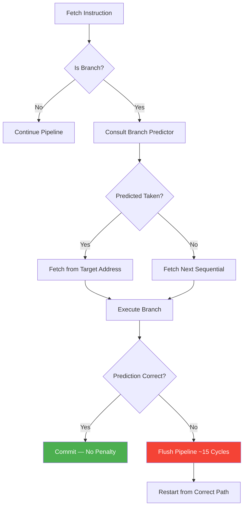

# Chapter 40 — Performance Engineering

**Tags:** `profiling` `cache-optimization` `SIMD` `branch-prediction` `data-oriented-design` `benchmarking` `compiler-optimizations` `HFT`

---

## Theory

Performance engineering is the discipline of making software run as fast as the hardware allows. Unlike premature optimization, it is a systematic process: **measure**, **identify bottlenecks**, **optimize**, and **verify**. Modern CPUs are deeply pipelined, superscalar, and speculative—understanding their micro-architecture is essential to writing code that fully utilizes available throughput.

The three pillars of CPU performance are:
1. **Instruction-level parallelism** — keeping the pipeline full via branch prediction and out-of-order execution.
2. **Data locality** — ensuring the cache hierarchy serves data without stalls.
3. **Data parallelism** — using SIMD to process multiple elements per instruction.

---

## What / Why / How

### What is Performance Engineering?

It is the practice of analyzing, measuring, and systematically improving software performance by understanding hardware behavior—CPU pipelines, caches, branch predictors, and vector units—and writing code that cooperates with them.

### Why does it matter?

- A single cache miss costs ~100 CPU cycles; a branch mispredict costs ~15 cycles.
- Poorly laid-out data can reduce effective throughput by 10–50×.
- In domains like HFT, game engines, and scientific computing, nanoseconds translate directly into revenue or fidelity.

### How do we approach it?

1. **Profile first** — never guess; use `perf`, Valgrind, VTune, or flame graphs.
2. **Fix the algorithm** — no amount of micro-optimization saves a bad algorithm.
3. **Improve data layout** — cache-friendly structures yield the biggest gains.
4. **Eliminate branches** — branchless techniques reduce mispredict penalties.
5. **Vectorize** — use SIMD intrinsics or guide the compiler to auto-vectorize.
6. **Benchmark rigorously** — use Google Benchmark to avoid measurement pitfalls.

---

## Profiling Tools

### perf (Linux)

```bash
perf stat ./my_program           # Summary counters
perf record -g ./my_program      # Sample call stacks
perf report                      # Interactive report
```

### Valgrind / Callgrind

```bash
valgrind --tool=callgrind ./my_program
kcachegrind callgrind.out.*
```

### Flame Graphs

```bash
perf script | stackcollapse-perf.pl | flamegraph.pl > flame.svg
```

### Intel VTune

VTune provides hardware-event sampling (cache misses, branch mispredicts, port utilization) with a GUI—the gold standard for Intel micro-architecture analysis.

---

## Mermaid Diagrams

### CPU Pipeline Diagram


### Branch Prediction Flow



---

## Code Examples

### 1. Cache-Friendly Programming: AoS vs SoA

```cpp
#include <vector>
#include <chrono>
#include <cstdio>
#include <cmath>

// Array of Structs — poor cache utilization for position-only queries
struct ParticleAoS {
    float x, y, z;
    float vx, vy, vz;
    float mass;
    int   id;
    char  padding[28]; // 64 bytes total — fills a cache line
};

// Struct of Arrays — optimal for iterating one field at a time
struct ParticlesSoA {
    std::vector<float> x, y, z;
    std::vector<float> vx, vy, vz;
    std::vector<float> mass;
    std::vector<int>   id;

    void resize(size_t n) {
        x.resize(n); y.resize(n); z.resize(n);
        vx.resize(n); vy.resize(n); vz.resize(n);
        mass.resize(n); id.resize(n);
    }
};

void update_positions_aos(std::vector<ParticleAoS>& p, float dt) {
    for (auto& pt : p) {
        pt.x += pt.vx * dt;
        pt.y += pt.vy * dt;
        pt.z += pt.vz * dt;
    }
}

void update_positions_soa(ParticlesSoA& p, float dt, size_t n) {
    for (size_t i = 0; i < n; ++i) {
        p.x[i] += p.vx[i] * dt;
        p.y[i] += p.vy[i] * dt;
        p.z[i] += p.vz[i] * dt;
    }
}

int main() {
    constexpr size_t N = 1'000'000;
    constexpr float dt = 0.016f;

    std::vector<ParticleAoS> aos(N);
    ParticlesSoA soa;
    soa.resize(N);

    auto t0 = std::chrono::high_resolution_clock::now();
    for (int i = 0; i < 100; ++i) update_positions_aos(aos, dt);
    auto t1 = std::chrono::high_resolution_clock::now();
    for (int i = 0; i < 100; ++i) update_positions_soa(soa, dt, N);
    auto t2 = std::chrono::high_resolution_clock::now();

    auto aos_ms = std::chrono::duration<double, std::milli>(t1 - t0).count();
    auto soa_ms = std::chrono::duration<double, std::milli>(t2 - t1).count();

    std::printf("AoS: %.2f ms | SoA: %.2f ms | Speedup: %.2fx\n",
                aos_ms, soa_ms, aos_ms / soa_ms);
}
```

### 2. Branch Prediction and Branchless Programming

```cpp
#include <algorithm>
#include <cstdio>
#include <cstdlib>
#include <chrono>
#include <vector>

int sum_branchy(const std::vector<int>& data) {
    int sum = 0;
    for (int v : data) {
        if (v >= 128) sum += v;   // branch — mispredict-heavy on random data
    }
    return sum;
}

int sum_branchless(const std::vector<int>& data) {
    int sum = 0;
    for (int v : data) {
        int mask = -(v >= 128);   // 0 or -1 (all bits set)
        sum += (v & mask);        // branchless conditional add
    }
    return sum;
}

int main() {
    constexpr size_t N = 10'000'000;
    std::vector<int> data(N);
    for (auto& v : data) v = std::rand() % 256;

    auto bench = [&](auto fn, const char* label) {
        auto t0 = std::chrono::high_resolution_clock::now();
        volatile int result = fn(data);
        auto t1 = std::chrono::high_resolution_clock::now();
        double ms = std::chrono::duration<double, std::milli>(t1 - t0).count();
        std::printf("%s: %d in %.2f ms\n", label, result, ms);
    };

    bench(sum_branchy,    "Branchy   ");
    bench(sum_branchless, "Branchless");

    // Now sort — branch predictor can learn the pattern
    std::sort(data.begin(), data.end());
    bench(sum_branchy,    "Sorted branchy");
}
```

### 3. SIMD Vectorization with AVX2 Intrinsics

```cpp
#include <immintrin.h>
#include <cstdio>
#include <chrono>
#include <vector>
#include <cstdlib>

// Scalar dot product
float dot_scalar(const float* a, const float* b, size_t n) {
    float sum = 0.0f;
    for (size_t i = 0; i < n; ++i) {
        sum += a[i] * b[i];
    }
    return sum;
}

// AVX2 dot product — processes 8 floats per iteration
float dot_avx2(const float* a, const float* b, size_t n) {
    __m256 vsum = _mm256_setzero_ps();

    size_t i = 0;
    for (; i + 8 <= n; i += 8) {
        __m256 va = _mm256_loadu_ps(a + i);
        __m256 vb = _mm256_loadu_ps(b + i);
        vsum = _mm256_fmadd_ps(va, vb, vsum);
    }

    // Horizontal reduction
    __m128 hi = _mm256_extractf128_ps(vsum, 1);
    __m128 lo = _mm256_castps256_ps128(vsum);
    __m128 sum128 = _mm_add_ps(lo, hi);
    sum128 = _mm_hadd_ps(sum128, sum128);
    sum128 = _mm_hadd_ps(sum128, sum128);
    float result = _mm_cvtss_f32(sum128);

    // Handle remainder
    for (; i < n; ++i) result += a[i] * b[i];
    return result;
}

int main() {
    constexpr size_t N = 16'000'000;
    std::vector<float> a(N), b(N);
    for (size_t i = 0; i < N; ++i) {
        a[i] = static_cast<float>(rand()) / RAND_MAX;
        b[i] = static_cast<float>(rand()) / RAND_MAX;
    }

    auto t0 = std::chrono::high_resolution_clock::now();
    volatile float r1 = dot_scalar(a.data(), b.data(), N);
    auto t1 = std::chrono::high_resolution_clock::now();
    volatile float r2 = dot_avx2(a.data(), b.data(), N);
    auto t2 = std::chrono::high_resolution_clock::now();

    double scalar_ms = std::chrono::duration<double, std::milli>(t1 - t0).count();
    double avx_ms    = std::chrono::duration<double, std::milli>(t2 - t1).count();

    std::printf("Scalar: %.4f in %.2f ms\n", r1, scalar_ms);
    std::printf("AVX2:   %.4f in %.2f ms\n", r2, avx_ms);
    std::printf("Speedup: %.2fx\n", scalar_ms / avx_ms);
}
```

### 4. Data-Oriented Design — ECS Pattern

```cpp
#include <vector>
#include <cstdio>

struct Positions { std::vector<float> x, y; };   // SoA components
struct Velocities { std::vector<float> vx, vy; };

void movement_system(Positions& p, const Velocities& v, float dt, size_t n) {
    for (size_t i = 0; i < n; ++i) {
        p.x[i] += v.vx[i] * dt;
        p.y[i] += v.vy[i] * dt;
    }
}

int main() {
    constexpr size_t N = 100'000;
    Positions pos{std::vector<float>(N, 0.f), std::vector<float>(N, 0.f)};
    Velocities vel{std::vector<float>(N, 1.f), std::vector<float>(N, 0.5f)};

    for (int frame = 0; frame < 1000; ++frame)
        movement_system(pos, vel, 0.016f, N);

    std::printf("Entity 0 pos: (%.2f, %.2f)\n", pos.x[0], pos.y[0]);
}
```

### 5. Google Benchmark — Micro-Benchmarking

```cpp
// Compile: g++ -O2 -std=c++17 bench.cpp -lbenchmark -lpthread -o bench
#include <benchmark/benchmark.h>
#include <vector>
#include <numeric>

static void BM_VectorSum_ForLoop(benchmark::State& state) {
    std::vector<int> v(state.range(0), 1);
    for (auto _ : state) {
        int sum = 0;
        for (int x : v) sum += x;
        benchmark::DoNotOptimize(sum);
    }
    state.SetItemsProcessed(state.iterations() * state.range(0));
}
BENCHMARK(BM_VectorSum_ForLoop)->Range(1 << 10, 1 << 20);

static void BM_VectorSum_Accumulate(benchmark::State& state) {
    std::vector<int> v(state.range(0), 1);
    for (auto _ : state) {
        int sum = std::accumulate(v.begin(), v.end(), 0);
        benchmark::DoNotOptimize(sum);
    }
    state.SetItemsProcessed(state.iterations() * state.range(0));
}
BENCHMARK(BM_VectorSum_Accumulate)->Range(1 << 10, 1 << 20);

BENCHMARK_MAIN();
```

---

## Compiler Optimizations

| Flag | Effect |
|------|--------|
| `-O0` | No optimization — fastest compile, debug-friendly |
| `-O2` | Standard optimizations — inlining, loop unrolling, scheduling |
| `-O3` | Aggressive — auto-vectorization, function cloning |
| `-Ofast` | `-O3` + `-ffast-math` — breaks IEEE 754 compliance |
| `-flto` | Link-Time Optimization — cross-TU inlining |
| `-fprofile-generate` / `-fprofile-use` | Profile-Guided Optimization (PGO) |
| `-march=native` | Targets the host CPU's instruction set |

### PGO Workflow

```bash
# Step 1: Instrument
g++ -O2 -fprofile-generate -o app_instr main.cpp

# Step 2: Run representative workload
./app_instr < typical_input.txt

# Step 3: Rebuild with profile data
g++ -O2 -fprofile-use -o app_pgo main.cpp
```

PGO typically yields 10–20% improvement by optimizing branch layout and inlining based on real execution data.

---

## Exercises

### 🟢 Easy — Cache Line Measurement
Write a program that measures access latency for arrays of sizes 1 KB to 64 MB using pointer chasing. Plot results to identify L1/L2/L3 cache boundaries.

### 🟡 Medium — Branchless Min/Max
Implement branchless `min` and `max` for integers without ternary operators. Benchmark against `std::min`/`std::max`.

### 🟡 Medium — Auto-Vectorization Investigation
Write an array-addition loop and compile with `g++ -O2 -ftree-vectorize -fopt-info-vec-all`. Add `__restrict__` and alignment hints to enable vectorization on skipped loops.

### 🔴 Hard — SIMD Matrix Multiply
Implement a 4×4 float matrix multiply using SSE intrinsics. Compare against a naive triple-loop and auto-vectorized version.

### 🔴 Hard — ECS with Archetype Storage
Extend the ECS example with archetype-based storage (entities with identical components share contiguous arrays). Benchmark against `unordered_map<Entity, Component>`.

---

## Solutions

### 🟢 Cache Line Measurement

```cpp
#include <cstdio>
#include <chrono>
#include <vector>
#include <numeric>
#include <random>

int main() {
    for (size_t size = 1024; size <= 64 * 1024 * 1024; size *= 2) {
        size_t count = size / sizeof(size_t);
        std::vector<size_t> arr(count);
        std::iota(arr.begin(), arr.end(), 0);
        std::mt19937 rng(42);
        for (size_t i = count - 1; i > 0; --i)
            std::swap(arr[i], arr[std::uniform_int_distribution<size_t>(0, i)(rng)]);

        constexpr int ITERS = 10'000'000;
        size_t idx = 0;
        auto t0 = std::chrono::high_resolution_clock::now();
        for (int i = 0; i < ITERS; ++i) idx = arr[idx];
        auto t1 = std::chrono::high_resolution_clock::now();
        double ns = std::chrono::duration<double, std::nano>(t1 - t0).count() / ITERS;
        std::printf("Size: %8zu KB | Latency: %6.1f ns | (idx=%zu)\n",
                    size / 1024, ns, idx);
    }
}
```

### 🟡 Branchless Min/Max

```cpp
#include <cstdio>
#include <cstdint>

int branchless_min(int a, int b) {
    int diff = a - b;
    int mask = diff >> 31;   // arithmetic shift: -1 if a < b, else 0
    return b + (diff & mask); // b + (a-b) if a<b, else b + 0
}

int branchless_max(int a, int b) {
    int diff = a - b;
    int mask = diff >> 31;
    return a - (diff & mask); // a - (a-b) if a<b (= b), else a - 0
}

int main() {
    std::printf("min(3,7)=%d  max(3,7)=%d\n",
                branchless_min(3, 7), branchless_max(3, 7));
    std::printf("min(-5,2)=%d max(-5,2)=%d\n",
                branchless_min(-5, 2), branchless_max(-5, 2));
}
```

---

## Quiz

**Q1.** What is the typical penalty for a branch misprediction on a modern x86 CPU?

a) 1–2 cycles  
b) 5–7 cycles  
c) 12–20 cycles ✅  
d) 50+ cycles  

**Q2.** In SoA layout, which scenario benefits most?

a) Random access to all fields of one element  
b) Sequential iteration over a single field across all elements ✅  
c) Frequent insertion/deletion in the middle  
d) Polymorphic dispatch per element  

**Q3.** What does `benchmark::DoNotOptimize(x)` do?

a) Disables compiler optimizations globally  
b) Forces the compiler to materialize `x` so the computation isn't eliminated ✅  
c) Inserts a memory fence  
d) Disables SIMD  

**Q4.** Which AVX2 intrinsic performs fused multiply-add on 8 floats?

a) `_mm256_mul_ps`  
b) `_mm256_add_ps`  
c) `_mm256_fmadd_ps` ✅  
d) `_mm256_hadd_ps`  

**Q5.** What does `-fprofile-use` rely on?

a) Static analysis of the source code  
b) Runtime profile data collected from an instrumented build ✅  
c) Hardware performance counters  
d) User-supplied annotations  

**Q6.** Which tool generates flame graphs from Linux perf data?

a) VTune  
b) `stackcollapse-perf.pl` + `flamegraph.pl` ✅  
c) `perf annotate`  
d) Valgrind  

**Q7.** What is the primary advantage of Data-Oriented Design (ECS)?

a) Easier polymorphism  
b) Cache-friendly iteration over components ✅  
c) Simpler inheritance hierarchies  
d) Reduced code size  

**Q8.** `-O3` differs from `-O2` primarily by enabling:

a) Debug symbols  
b) Auto-vectorization and aggressive inlining ✅  
c) Address sanitizer  
d) Link-time optimization  

---

## Key Takeaways

- **Always profile before optimizing** — intuition about hotspots is often wrong.
- **Data layout dominates performance** — SoA beats AoS for sequential field access by 2–5×.
- **Branch mispredictions are expensive** — branchless techniques eliminate 15-cycle penalties.
- **SIMD delivers 4–8× throughput** on data-parallel workloads with proper alignment.
- **ECS / Data-Oriented Design** transforms cache-hostile OOP into cache-optimal iteration.
- **Google Benchmark + `DoNotOptimize`** prevents the compiler from defeating your measurements.
- **PGO is free performance** — 10–20% gains for production builds with representative workloads.
- **Compiler flags matter** — `-O2 -march=native -flto` is a strong baseline.

---

## Chapter Summary

Performance engineering is a systematic discipline that combines profiling, micro-architectural understanding, and disciplined benchmarking. We covered the full stack: from profiling tools (perf, Valgrind, VTune, flame graphs) to data layout (AoS vs SoA), branch prediction and branchless techniques, SIMD vectorization with AVX2 intrinsics, Data-Oriented Design via the ECS pattern, rigorous micro-benchmarking with Google Benchmark, and compiler optimization flags including LTO and PGO. The key insight is that modern CPUs are throughput machines—they reward predictable, sequential, vectorizable data access and punish pointer chasing, random branching, and cache-hostile layouts.

---

## Real-World Insight: HFT Latency Optimization

In High-Frequency Trading, every nanosecond matters. Production HFT systems apply every technique in this chapter simultaneously:

- **Kernel bypass** (DPDK/RDMA) eliminates OS network overhead.
- **Busy-spin loops** replace blocking I/O to avoid context-switch latency.
- **Lock-free structures** with `std::atomic` avoid mutex contention.
- **SoA order books** ensure cache-optimal price-level iteration.
- **Branchless matching** eliminates mispredicts in the critical path.
- **`-O3 -march=native -flto -fprofile-use`** squeezes the last 10–15%.
- **NUMA-pinning + huge pages** reduce TLB misses and ensure memory locality.
- **Isolated CPU cores** (`isolcpus=`) prevent OS scheduling jitter.

A typical HFT "tick-to-trade" latency budget is 1–5 microseconds. At this scale, a single cache miss (100 ns) or branch mispredict (15 ns) is a measurable fraction of the total budget.

---

## Common Mistakes

| Mistake | Why It's Wrong | Fix |
|---------|---------------|-----|
| Optimizing without profiling | You fix the wrong thing | Always run `perf stat` first |
| Benchmarking with `-O0` | Results are meaningless | Benchmark at `-O2` or `-O3` |
| Forgetting `DoNotOptimize` | Compiler eliminates computation | Use `benchmark::DoNotOptimize` |
| AoS layout for bulk iteration | Wastes cache on unused fields | Prefer SoA for hot loops |
| Ignoring alignment for SIMD | `_mm256_load_ps` segfaults | Use `alignas(32)` or `_loadu` variant |
| Manual SIMD without benchmarking | Auto-vectorization may suffice | Check with `-fopt-info-vec` first |

---

## Interview Questions

### Q1: Explain AoS vs SoA. When would you choose each?

**Answer:** Array-of-Structs stores all fields of one element contiguously; Struct-of-Arrays stores each field in its own contiguous array. SoA is superior when iterating over a single field across many elements because every byte loaded is relevant—maximizing cache utilization. AoS is better when you access all fields of one element together (e.g., serializing). Game particle systems use SoA; database row buffers use AoS.

### Q2: How does branch prediction work, and how do you mitigate misprediction penalties?

**Answer:** Modern CPUs use a two-level adaptive predictor (or TAGE) that records branch history patterns, achieving >95% accuracy on predictable branches. On misprediction, the pipeline flushes—costing 12–20 cycles. Mitigation: (1) sort data so outcomes are grouped, (2) branchless arithmetic with bitwise masks, (3) conditional move instructions (`cmov`), (4) `[[likely]]`/`[[unlikely]]` to guide code layout.

### Q3: What is PGO and when is it worth the effort?

**Answer:** Profile-Guided Optimization is a two-pass compilation. First, compile with `-fprofile-generate` to instrument the binary. Run it with a representative workload to collect branch frequencies and call counts. Recompile with `-fprofile-use` so the compiler optimizes branch layout and inlining decisions. PGO typically yields 10–20% improvement and is worth the effort for long-running production services (databases, compilers, trading systems).

### Q4: Describe three measurement pitfalls in micro-benchmarking.

**Answer:** (1) **Dead code elimination** — compiler removes computation whose result is unused; fix with `DoNotOptimize`. (2) **Cold cache** — first iteration is slower; Google Benchmark runs warmup automatically. (3) **Frequency scaling** — CPUs boost dynamically; set governor to `performance` or use cycle counts. Also: hyperthreading interference, NUMA effects, and timer overhead itself.

### Q5: When should you use SIMD intrinsics vs. relying on auto-vectorization?

**Answer:** Prefer auto-vectorization first—it is maintainable and portable. Check compiler output with `-fopt-info-vec` to verify. Use intrinsics when: (1) the compiler fails to vectorize a critical loop, (2) you need a specific instruction like `_mm256_fmadd_ps`, (3) the algorithm requires shuffles/permutes, or (4) you need guaranteed cross-compiler performance. Always benchmark both—manual SIMD that fights the register allocator can be slower.
