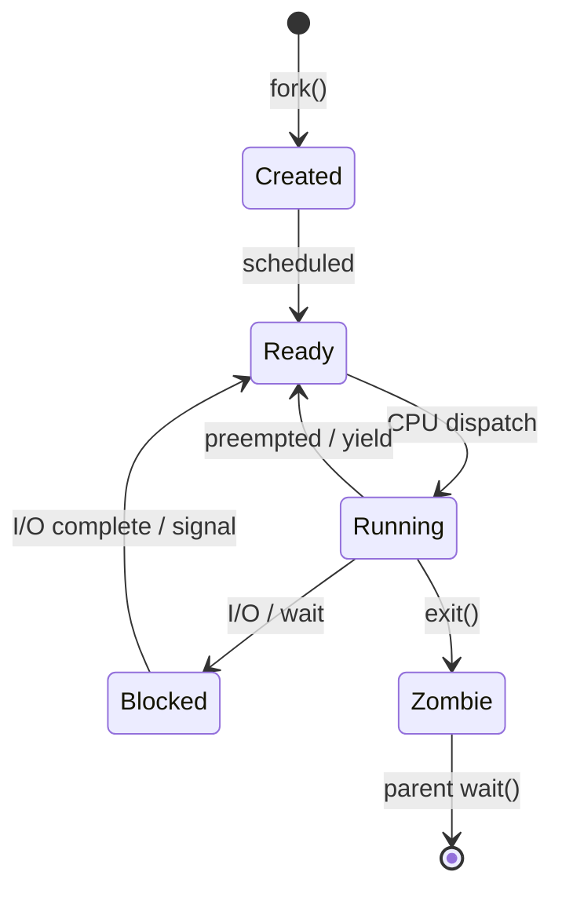

# Chapter 41 — OS Interaction & System Calls

**Tags:** `systems-programming` `linux` `posix` `ipc` `syscalls` `io_uring` `abi`

---

## Theory

Every C++ program runs as a **process** managed by the operating system kernel. User-space code cannot directly access hardware, file systems, or other processes — it must request services through **system calls**, the narrow gate between user mode and kernel mode.

A system call (syscall) triggers a context switch: the CPU saves user-state registers, elevates privilege to ring 0, executes the kernel routine, then returns to user space. On x86-64 Linux the `syscall` instruction places the call number in `rax` and arguments in `rdi`, `rsi`, `rdx`, `r10`, `r8`, `r9`. The C library (`glibc`, `musl`) wraps these raw calls with POSIX functions like `read()`, `write()`, and `fork()`.

Understanding this boundary is essential for systems programmers because:
- **Performance**: each syscall costs ~100–1000 ns of overhead; batching (e.g., `io_uring`) amortises it.
- **Correctness**: signals can interrupt blocking calls, returning `EINTR`.
- **Security**: the syscall interface is the kernel's attack surface (`seccomp` filters restrict it).
- **Portability**: POSIX provides a common API, but extensions like `epoll` and `io_uring` are Linux-specific.

---

## What / Why / How

| Question | Answer |
|----------|--------|
| **What** | System calls are the programmatic interface between user processes and the OS kernel. |
| **Why** | Processes need controlled access to hardware, memory, files, and other processes. |
| **How** | The CPU traps into kernel mode via a software interrupt or dedicated instruction (`syscall`/`sysenter`). The kernel validates arguments, performs the operation, and returns a result. |

---

## 1 — Process Model

### Process States

A Linux process transitions through: **Created → Ready → Running → Blocked → Terminated**.



### fork, exec, wait

```cpp
#include <unistd.h>
#include <sys/wait.h>
#include <cstdio>
#include <cstdlib>

int main() {
    pid_t pid = fork();           // duplicate this process
    if (pid < 0) {
        perror("fork");
        return 1;
    }
    if (pid == 0) {
        // Child: replace image with "ls"
        execlp("ls", "ls", "-l", nullptr);
        perror("exec");           // only reached on failure
        _exit(127);
    }
    // Parent: wait for child
    int status;
    waitpid(pid, &status, 0);
    if (WIFEXITED(status))
        printf("Child exited with code %d\n", WEXITSTATUS(status));
    return 0;
}
```

**Key points:**
- `fork()` returns **twice** — 0 in child, child PID in parent.
- `exec*` replaces the process image; it never returns on success.
- `wait`/`waitpid` reaps zombie processes and retrieves exit status.

---

## 2 — Core System Calls

### read / write / open / close

```cpp
#include <fcntl.h>
#include <unistd.h>
#include <cstdio>
int main() {
    int fd = open("data.txt", O_RDONLY);
    if (fd < 0) { perror("open"); return 1; }

    char buf[256];
    ssize_t n = read(fd, buf, sizeof(buf) - 1);
    if (n > 0) {
        buf[n] = '\0';
        write(STDOUT_FILENO, buf, n);  // fd 1 = stdout
    }
    close(fd);
    return 0;
}
```

### ioctl — Device Control

```cpp
#include <sys/ioctl.h>
#include <unistd.h>
#include <cstdio>
int main() {
    struct winsize ws;
    if (ioctl(STDOUT_FILENO, TIOCGWINSZ, &ws) == 0)
        printf("Terminal: %d rows × %d cols\n", ws.ws_row, ws.ws_col);
    return 0;
}
```

`ioctl` is the catch-all syscall for device-specific operations that don't fit the read/write model.

---

## 3 — Signals

Signals are asynchronous notifications delivered to a process. The kernel interrupts the current execution and jumps to a registered handler.

| Signal | Default | Typical Use |
|--------|---------|-------------|
| `SIGINT` (2) | Terminate | Ctrl-C from terminal |
| `SIGSEGV` (11) | Core dump | Invalid memory access |
| `SIGTERM` (15) | Terminate | Graceful shutdown request |
| `SIGCHLD` (17) | Ignore | Child process state change |
| `SIGUSR1` (10) | Terminate | Application-defined |

### Signal Handler Example

```cpp
#include <csignal>
#include <cstdio>
#include <unistd.h>
#include <atomic>

std::atomic<bool> running{true};

void handler(int sig) {
    // Only async-signal-safe functions here
    running.store(false, std::memory_order_relaxed);
}

int main() {
    struct sigaction sa{};
    sa.sa_handler = handler;
    sigemptyset(&sa.sa_mask);
    sa.sa_flags = 0;
    sigaction(SIGINT, &sa, nullptr);

    printf("PID %d — press Ctrl-C to stop\n", getpid());
    while (running.load(std::memory_order_relaxed)) {
        pause();  // sleep until signal
    }
    printf("\nCaught SIGINT, shutting down.\n");
    return 0;
}
```

> **Rule:** Signal handlers must only call async-signal-safe functions. Use `sigaction` over the legacy `signal()` function — its behaviour is well-defined across platforms.

---

## 4 — Shared Memory (IPC via mmap)

POSIX shared memory lets unrelated processes map the same physical pages into their address spaces — the fastest IPC mechanism since no kernel copy occurs.

```cpp
// writer.cpp
#include <fcntl.h>
#include <sys/mman.h>
#include <unistd.h>
#include <cstring>
#include <cstdio>

int main() {
    const char* name = "/my_shm";
    int fd = shm_open(name, O_CREAT | O_RDWR, 0666);
    ftruncate(fd, 4096);

    void* ptr = mmap(nullptr, 4096, PROT_WRITE, MAP_SHARED, fd, 0);
    close(fd);

    const char* msg = "Hello from writer";
    memcpy(ptr, msg, strlen(msg) + 1);
    printf("Written: %s\n", msg);

    munmap(ptr, 4096);
    return 0;
}
// Compile: g++ -o writer writer.cpp -lrt
```

```cpp
// reader.cpp
#include <fcntl.h>
#include <sys/mman.h>
#include <unistd.h>
#include <cstdio>

int main() {
    int fd = shm_open("/my_shm", O_RDONLY, 0);
    void* ptr = mmap(nullptr, 4096, PROT_READ, MAP_SHARED, fd, 0);
    close(fd);

    printf("Read: %s\n", static_cast<char*>(ptr));

    munmap(ptr, 4096);
    shm_unlink("/my_shm");
    return 0;
}
// Compile: g++ -o reader reader.cpp -lrt
```

---

## 5 — File Descriptors, Pipes & epoll

### Pipes

A pipe is a unidirectional byte stream between related processes.

```cpp
#include <unistd.h>
#include <cstdio>
#include <cstring>
#include <sys/wait.h>
int main() {
    int pipefd[2];  // [0]=read end, [1]=write end
    pipe(pipefd);

    if (fork() == 0) {
        close(pipefd[0]);
        const char* msg = "pipe payload";
        write(pipefd[1], msg, strlen(msg));
        close(pipefd[1]);
        _exit(0);
    }
    close(pipefd[1]);
    char buf[64];
    ssize_t n = read(pipefd[0], buf, sizeof(buf) - 1);
    buf[n] = '\0';
    printf("Parent received: %s\n", buf);
    close(pipefd[0]);
    wait(nullptr);
    return 0;
}
```

### epoll — Scalable I/O Multiplexing

```cpp
#include <sys/epoll.h>
#include <unistd.h>
#include <cstdio>

int main() {
    int epfd = epoll_create1(0);

    struct epoll_event ev{};
    ev.events = EPOLLIN;
    ev.data.fd = STDIN_FILENO;
    epoll_ctl(epfd, EPOLL_CTL_ADD, STDIN_FILENO, &ev);

    struct epoll_event events[10];
    printf("Waiting for stdin (type something)...\n");
    int n = epoll_wait(epfd, events, 10, 5000);  // 5s timeout

    if (n > 0) {
        char buf[128];
        ssize_t r = read(STDIN_FILENO, buf, sizeof(buf) - 1);
        buf[r] = '\0';
        printf("Got: %s", buf);
    } else {
        printf("Timeout.\n");
    }
    close(epfd);
    return 0;
}
```

`epoll` uses an internal red-black tree — adding/removing fds is O(log n) and readiness notification is O(1) per ready fd, unlike `select`/`poll` which are O(n).

---

## 6 — io_uring (Modern Async I/O)

`io_uring` (Linux 5.1+) eliminates per-operation syscall overhead by using two lock-free ring buffers shared between user and kernel space.


```cpp
// Requires: liburing-dev  |  g++ -o io_demo io_demo.cpp -luring
#include <liburing.h>
#include <fcntl.h>
#include <cstdio>
#include <cstring>
#include <unistd.h>

int main() {
    struct io_uring ring;
    io_uring_queue_init(8, &ring, 0);

    int fd = open("data.txt", O_RDONLY);
    if (fd < 0) { perror("open"); return 1; }

    char buf[256]{};
    struct io_uring_sqe* sqe = io_uring_get_sqe(&ring);
    io_uring_prep_read(sqe, fd, buf, sizeof(buf) - 1, 0);
    io_uring_sqe_set_data(sqe, buf);

    io_uring_submit(&ring);           // single syscall for batch

    struct io_uring_cqe* cqe;
    io_uring_wait_cqe(&ring, &cqe);  // wait for completion
    if (cqe->res > 0)
        printf("Read %d bytes: %.64s...\n", cqe->res, buf);
    io_uring_cqe_seen(&ring, cqe);

    close(fd);
    io_uring_queue_exit(&ring);
    return 0;
}
```

**Advantages over `aio` / `epoll`:** zero-copy submission, batched syscalls, supports files + sockets + timers in one interface.

---

## 7 — ABI: Calling Conventions & Name Mangling

### Calling Conventions (x86-64 System V)

| Item | Register |
|------|----------|
| Args 1–6 (int/ptr) | `rdi`, `rsi`, `rdx`, `rcx`, `r8`, `r9` |
| Float args 1–8 | `xmm0`–`xmm7` |
| Return value | `rax` (int), `xmm0` (float) |
| Caller-saved | `rax`, `rcx`, `rdx`, `rsi`, `rdi`, `r8`–`r11` |
| Callee-saved | `rbx`, `rbp`, `r12`–`r15` |

### Name Mangling

```cpp
// Compile with: g++ -c mangling.cpp && nm mangling.o | grep compute
int compute(int a, double b) { return a + static_cast<int>(b); }
// Mangled symbol: _Z7computeid
// Demangled:      compute(int, double)
```

Use `extern "C"` to suppress mangling when interfacing with C libraries or writing plugin APIs:

```cpp
extern "C" {
    int plugin_init(void* ctx);   // symbol: plugin_init
}
```

---

## IPC Mechanism Decision Table

| Mechanism | Scope | Speed | Complexity | Best For |
|-----------|-------|-------|------------|----------|
| **Pipe** | Parent↔Child | Medium | Low | Simple streaming |
| **Named pipe (FIFO)** | Any local | Medium | Low | Unrelated processes, simple |
| **Shared memory** | Any local | Fastest | Medium | Large data, low latency |
| **Unix domain socket** | Any local | Fast | Medium | Bidirectional, structured |
| **TCP socket** | Network | Slow | High | Distributed systems |
| **Message queue** | Any local | Medium | Medium | Decoupled producers/consumers |
| **Signal** | Any local | Instant | Low | Notifications only (no data) |

---

## Exercises

### 🟢 Easy — Safe Shutdown

Write a program that prints a counter every second. On `SIGINT`, it prints the final count and exits cleanly instead of crashing. Use `sigaction`.

### 🟡 Medium — Pipe Calculator

Create two processes connected by a pipe. The parent writes arithmetic expressions (e.g., `"3+5"`) to the pipe. The child reads, evaluates, and prints the result to stdout.

### 🔴 Hard — Shared-Memory Ring Buffer

Implement a lock-free single-producer single-consumer ring buffer in POSIX shared memory. The producer writes timestamped messages; the consumer reads and prints them. Use `std::atomic` for head/tail indices.

---

## Solutions

### 🟢 Solution — Safe Shutdown

```cpp
#include <csignal>
#include <cstdio>
#include <unistd.h>
#include <atomic>

std::atomic<bool> run{true};
void on_sigint(int) { run.store(false, std::memory_order_relaxed); }

int main() {
    struct sigaction sa{};
    sa.sa_handler = on_sigint;
    sigaction(SIGINT, &sa, nullptr);

    int count = 0;
    while (run.load(std::memory_order_relaxed)) {
        printf("Count: %d\n", ++count);
        sleep(1);
    }
    printf("Final count: %d\n", count);
    return 0;
}
```

### 🟡 Solution — Pipe Calculator

```cpp
#include <unistd.h>
#include <sys/wait.h>
#include <cstdio>
#include <cstring>
#include <cstdlib>

int main() {
    int pfd[2];
    pipe(pfd);

    if (fork() == 0) {
        close(pfd[1]);
        char buf[64];
        ssize_t n = read(pfd[0], buf, sizeof(buf) - 1);
        buf[n] = '\0';
        int a, b; char op;
        sscanf(buf, "%d%c%d", &a, &op, &b);
        int res = (op == '+') ? a + b : (op == '-') ? a - b :
                  (op == '*') ? a * b : a / b;
        printf("Result: %d\n", res);
        close(pfd[0]);
        _exit(0);
    }
    close(pfd[0]);
    const char* expr = "12+7";
    write(pfd[1], expr, strlen(expr));
    close(pfd[1]);
    wait(nullptr);
    return 0;
}
```

### 🔴 Solution — Shared-Memory Ring Buffer (Producer)

```cpp
#include <fcntl.h>
#include <sys/mman.h>
#include <unistd.h>
#include <atomic>
#include <cstdio>
#include <cstring>
#include <ctime>

struct RingBuf {
    static constexpr int CAP = 16;
    static constexpr int MSG_SZ = 64;
    std::atomic<uint32_t> head{0};
    std::atomic<uint32_t> tail{0};
    char slots[CAP][MSG_SZ];
};

int main() {
    int fd = shm_open("/ringbuf", O_CREAT | O_RDWR, 0666);
    ftruncate(fd, sizeof(RingBuf));
    auto* rb = static_cast<RingBuf*>(
        mmap(nullptr, sizeof(RingBuf), PROT_READ | PROT_WRITE, MAP_SHARED, fd, 0));
    close(fd);
    new (rb) RingBuf();  // placement-new to init atomics

    for (int i = 0; i < 10; ++i) {
        uint32_t h = rb->head.load(std::memory_order_relaxed);
        uint32_t next = (h + 1) % RingBuf::CAP;
        while (next == rb->tail.load(std::memory_order_acquire))
            usleep(100);  // full — spin
        snprintf(rb->slots[h], RingBuf::MSG_SZ, "msg-%d t=%ld", i, time(nullptr));
        rb->head.store(next, std::memory_order_release);
        usleep(200000);
    }
    munmap(rb, sizeof(RingBuf));
    return 0;
}
// Compile: g++ -std=c++17 -o producer producer.cpp -lrt -lpthread
```

---

## Quiz

**Q1.** What does `fork()` return in the child process?
a) Parent PID  b) 0  c) -1  d) Child PID
**Answer:** b) 0

**Q2.** Which function replaces the current process image with a new program?
a) `fork`  b) `wait`  c) `exec`  d) `clone`
**Answer:** c) `exec`

**Q3.** Why should signal handlers avoid calling `printf`?
a) It's too slow  b) `printf` is not async-signal-safe  c) It segfaults  d) Signals can't access stdout
**Answer:** b) `printf` is not async-signal-safe — it may hold locks that cause deadlock.

**Q4.** What advantage does `epoll` have over `select`?
a) Works on macOS  b) O(1) per ready fd instead of O(n) scan  c) Simpler API  d) Supports UDP only
**Answer:** b) O(1) per ready fd instead of O(n) scan.

**Q5.** What does `extern "C"` do in C++?
a) Enables C++20  b) Disables exceptions  c) Suppresses name mangling  d) Links statically
**Answer:** c) Suppresses name mangling so C code can find the symbol.

**Q6.** In `io_uring`, what are the two ring buffers called?
a) Input/Output  b) Send/Recv  c) Submission Queue / Completion Queue  d) Read Ring / Write Ring
**Answer:** c) Submission Queue (SQ) and Completion Queue (CQ).

**Q7.** Which IPC mechanism avoids kernel-space copies entirely?
a) Pipe  b) TCP socket  c) Shared memory  d) Message queue
**Answer:** c) Shared memory — both processes map the same physical pages.

---

## Key Takeaways

- Every kernel interaction goes through a **syscall**; minimise crossings for performance.
- `fork` + `exec` is the Unix process creation model; always `wait` to avoid zombies.
- Use `sigaction` (not `signal`) and restrict handlers to **async-signal-safe** operations.
- **Shared memory** is the fastest IPC but requires explicit synchronisation.
- `epoll` scales to millions of fds; `io_uring` goes further by batching submissions.
- `extern "C"` is mandatory when exposing C++ functions to C callers or plugin systems.
- Choose the IPC mechanism that matches your **scope, throughput, and complexity** budget.

---

## Chapter Summary

This chapter bridges user-space C++ and the Linux kernel. We traced the lifecycle of a process from `fork` through `exec` to `wait`, explored how file descriptors unify I/O across files, pipes, and sockets, and examined `epoll` and `io_uring` as scalable event engines. Signals provide asynchronous control flow with strict safety rules. Shared memory offers zero-copy IPC at the cost of manual synchronisation. Finally, understanding the ABI — calling conventions and name mangling — is critical for writing interoperable libraries and debugging at the assembly level.

---

## Real-World Insight

**NGINX** uses `epoll` (Linux) and `kqueue` (BSD) to handle tens of thousands of concurrent connections in a single worker process. Its master process `fork`s worker children and communicates via shared memory for caching and via signals (`SIGHUP` for reload, `SIGQUIT` for graceful shutdown). Modern storage engines like **RocksDB** are adopting `io_uring` for async reads, reporting 2–3× throughput gains over `pread` under heavy load because submission batching eliminates per-call syscall overhead.

---

## Common Mistakes

| Mistake | Consequence | Fix |
|---------|-------------|-----|
| Not checking `fork()` return value | Code runs twice unintentionally | Always branch on `pid == 0` vs `> 0` vs `< 0` |
| Forgetting `waitpid` after `fork` | Zombie processes accumulate | Always reap children or use `SIGCHLD` handler |
| Calling `printf` in a signal handler | Deadlock or corrupted output | Use `write()` or set an `atomic` flag |
| Shared memory without synchronisation | Data races, torn reads | Use `std::atomic` or POSIX semaphores |
| Leaking file descriptors | fd exhaustion (`EMFILE`) | Close fds in error paths; use RAII wrappers |
| Using `signal()` instead of `sigaction()` | Undefined reset behaviour on some systems | Always prefer `sigaction` |

---

## Interview Questions

### Q1: Explain the fork-exec-wait pattern and why Unix separates process creation from program loading.

**Answer:** `fork()` creates a copy of the calling process. `exec()` replaces that copy's image with a new program. `wait()` lets the parent block until the child exits. Separating creation from loading allows the parent to set up the child's environment between `fork` and `exec` — redirecting file descriptors, setting environment variables, or changing the working directory. This composability is the foundation of Unix shell pipelines: `fork`, rewire `stdin`/`stdout` via `dup2`, then `exec` the next command.

### Q2: How does `io_uring` reduce syscall overhead compared to traditional I/O?

**Answer:** Traditional I/O requires one syscall per operation (`read`, `write`). `io_uring` uses two memory-mapped ring buffers shared between user and kernel space. The application pushes Submission Queue Entries (SQEs) into the submission ring without a syscall, then issues a single `io_uring_enter` to submit an entire batch. Completions appear in the Completion Queue (CQ), which the application polls without a syscall. In `SQPOLL` mode, a kernel thread continuously polls the SQ, eliminating syscalls entirely for sustained workloads.

### Q3: What makes a function async-signal-safe, and why does it matter?

**Answer:** An async-signal-safe function can be called from within a signal handler without risking deadlock or corruption. Signals can arrive at any point — including while the process holds a lock inside `malloc` or `printf`. If the handler calls the same function, it re-enters the locked critical section, causing deadlock. POSIX defines a list of safe functions (e.g., `write`, `_exit`, `signal`). In practice, handlers should only set a flag (`volatile sig_atomic_t` or `std::atomic<bool>`) and let the main loop act on it.

### Q4: Compare pipes and shared memory for IPC. When would you choose each?

**Answer:** **Pipes** provide a unidirectional byte stream with built-in flow control — data is copied twice (user→kernel→user). They're ideal for streaming between parent and child. **Shared memory** maps the same physical pages into both processes — zero copies, fastest IPC, but requires explicit synchronisation. Choose pipes for simplicity; choose shared memory when throughput or latency is critical.
