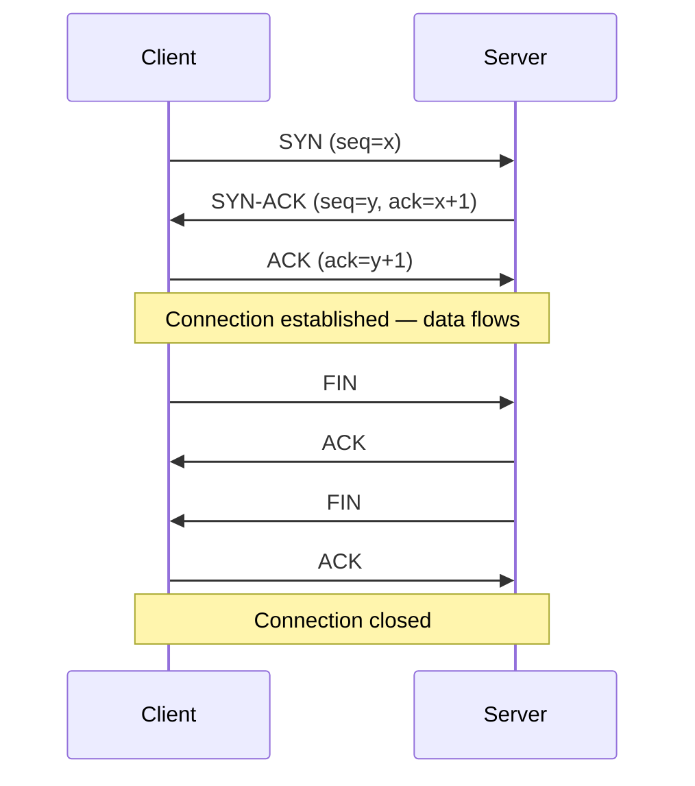
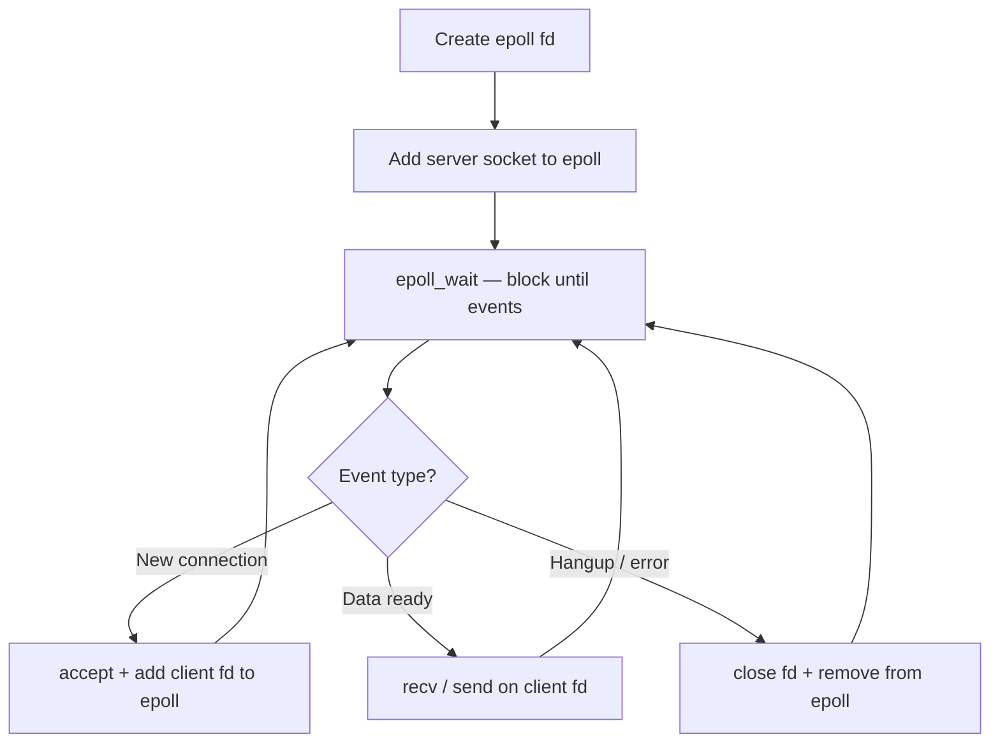

# Chapter 42 — Networking in C++

**Tags:** `networking` `sockets` `tcp` `udp` `epoll` `io_uring` `asio` `systems-programming`

---

## Theory

Network programming in C++ sits at the boundary between user-space applications and the
kernel's TCP/IP stack. The BSD sockets API, standardized across POSIX systems, provides the
foundational primitives: `socket`, `bind`, `listen`, `accept`, `connect`, `send`, and `recv`.
Every higher-level networking library — from Boost.Asio to gRPC — ultimately calls these
system calls.

**The layered model matters for C++ developers:**

| Layer | Concern | C++ Touch Point |
|-------|---------|-----------------|
| Application | Protocol logic, serialization | Your code, protobuf, JSON |
| Transport | TCP reliability / UDP speed | `SOCK_STREAM` vs `SOCK_DGRAM` |
| Network | IP routing, addressing | `sockaddr_in`, `getaddrinfo` |
| Link | Frames, MAC addresses | Rarely touched directly |

Understanding these layers helps you debug `ECONNREFUSED`, reason about Nagle's algorithm,
and decide between TCP and UDP for your use case.

---

## What / Why / How

### What Are Sockets?

A socket is a file descriptor that represents one endpoint of a network connection. The kernel
manages the underlying buffers, retransmissions (TCP), and routing.

### Why BSD Sockets in 2025?

Despite modern abstractions, raw sockets remain essential for: (1) writing high-performance
servers where every syscall matters, (2) implementing custom protocols, and (3) understanding
what libraries like Asio do under the hood.

### How Does a TCP Connection Work?



The three-way handshake establishes sequence numbers and window sizes. `connect()` on the
client triggers SYN; `accept()` on the server completes when the handshake finishes.

---

## Code Examples

### 1. TCP Echo Server (Blocking)

```cpp
#include <iostream>
#include <cstring>
#include <unistd.h>
#include <sys/socket.h>
#include <netinet/in.h>
#include <arpa/inet.h>

int main() {
    int server_fd = socket(AF_INET, SOCK_STREAM, 0);
    if (server_fd < 0) { perror("socket"); return 1; }

    int opt = 1;
    setsockopt(server_fd, SOL_SOCKET, SO_REUSEADDR, &opt, sizeof(opt));

    sockaddr_in addr{};
    addr.sin_family = AF_INET;
    addr.sin_addr.s_addr = INADDR_ANY;
    addr.sin_port = htons(8080);

    if (bind(server_fd, (sockaddr*)&addr, sizeof(addr)) < 0) {
        perror("bind"); return 1;
    }
    listen(server_fd, 128);
    std::cout << "Listening on :8080\n";

    while (true) {
        sockaddr_in client_addr{};
        socklen_t len = sizeof(client_addr);
        int client_fd = accept(server_fd, (sockaddr*)&client_addr, &len);
        if (client_fd < 0) { perror("accept"); continue; }

        char buf[1024];
        ssize_t n = recv(client_fd, buf, sizeof(buf), 0);
        if (n > 0) {
            send(client_fd, buf, n, 0);  // Echo back
        }
        close(client_fd);
    }
    close(server_fd);
}
```

### 2. TCP Client

```cpp
#include <iostream>
#include <cstring>
#include <unistd.h>
#include <sys/socket.h>
#include <netinet/in.h>
#include <arpa/inet.h>

int main() {
    int fd = socket(AF_INET, SOCK_STREAM, 0);
    if (fd < 0) { perror("socket"); return 1; }

    sockaddr_in addr{};
    addr.sin_family = AF_INET;
    addr.sin_port = htons(8080);
    inet_pton(AF_INET, "127.0.0.1", &addr.sin_addr);

    if (connect(fd, (sockaddr*)&addr, sizeof(addr)) < 0) {
        perror("connect"); return 1;
    }

    const char* msg = "Hello, server!";
    send(fd, msg, strlen(msg), 0);

    char buf[1024];
    ssize_t n = recv(fd, buf, sizeof(buf) - 1, 0);
    if (n > 0) {
        buf[n] = '\0';
        std::cout << "Server replied: " << buf << "\n";
    }
    close(fd);
}
```

### 3. UDP Sender and Receiver

UDP trades reliability for low latency — ideal for games, DNS, and streaming.

```cpp
// UDP Receiver
#include <iostream>
#include <cstring>
#include <unistd.h>
#include <sys/socket.h>
#include <netinet/in.h>

int main() {
    int fd = socket(AF_INET, SOCK_DGRAM, 0);
    sockaddr_in addr{};
    addr.sin_family = AF_INET;
    addr.sin_addr.s_addr = INADDR_ANY;
    addr.sin_port = htons(9000);
    bind(fd, (sockaddr*)&addr, sizeof(addr));

    char buf[512];
    sockaddr_in sender{};
    socklen_t slen = sizeof(sender);
    ssize_t n = recvfrom(fd, buf, sizeof(buf) - 1, 0,
                         (sockaddr*)&sender, &slen);
    if (n > 0) {
        buf[n] = '\0';
        std::cout << "Got: " << buf << "\n";
        sendto(fd, buf, n, 0, (sockaddr*)&sender, slen);
    }
    close(fd);
}
```

```cpp
// UDP Sender
#include <iostream>
#include <cstring>
#include <unistd.h>
#include <sys/socket.h>
#include <netinet/in.h>
#include <arpa/inet.h>

int main() {
    int fd = socket(AF_INET, SOCK_DGRAM, 0);
    sockaddr_in dest{};
    dest.sin_family = AF_INET;
    dest.sin_port = htons(9000);
    inet_pton(AF_INET, "127.0.0.1", &dest.sin_addr);

    const char* msg = "ping";
    sendto(fd, msg, strlen(msg), 0, (sockaddr*)&dest, sizeof(dest));

    char buf[512];
    ssize_t n = recv(fd, buf, sizeof(buf) - 1, 0);
    if (n > 0) { buf[n] = '\0'; std::cout << "Reply: " << buf << "\n"; }
    close(fd);
}
```

### 4. epoll-Based Event Loop

`epoll` is the Linux mechanism for scalable I/O multiplexing, handling tens of thousands
of connections efficiently where `select` and `poll` degrade.



```cpp
#include <iostream>
#include <cstring>
#include <unistd.h>
#include <fcntl.h>
#include <sys/socket.h>
#include <sys/epoll.h>
#include <netinet/in.h>

void set_nonblocking(int fd) {
    int flags = fcntl(fd, F_GETFL, 0);
    fcntl(fd, F_SETFL, flags | O_NONBLOCK);
}

int main() {
    int srv = socket(AF_INET, SOCK_STREAM, 0);
    int opt = 1;
    setsockopt(srv, SOL_SOCKET, SO_REUSEADDR, &opt, sizeof(opt));

    sockaddr_in addr{};
    addr.sin_family = AF_INET;
    addr.sin_addr.s_addr = INADDR_ANY;
    addr.sin_port = htons(8080);
    bind(srv, (sockaddr*)&addr, sizeof(addr));
    listen(srv, 128);
    set_nonblocking(srv);

    int epfd = epoll_create1(0);
    epoll_event ev{};
    ev.events = EPOLLIN;
    ev.data.fd = srv;
    epoll_ctl(epfd, EPOLL_CTL_ADD, srv, &ev);

    constexpr int MAX_EVENTS = 64;
    epoll_event events[MAX_EVENTS];

    while (true) {
        int n = epoll_wait(epfd, events, MAX_EVENTS, -1);
        for (int i = 0; i < n; ++i) {
            if (events[i].data.fd == srv) {
                // Accept all pending connections
                while (true) {
                    int cfd = accept(srv, nullptr, nullptr);
                    if (cfd < 0) break;
                    set_nonblocking(cfd);
                    ev.events = EPOLLIN | EPOLLET;
                    ev.data.fd = cfd;
                    epoll_ctl(epfd, EPOLL_CTL_ADD, cfd, &ev);
                }
            } else {
                char buf[1024];
                ssize_t bytes = recv(events[i].data.fd, buf, sizeof(buf), 0);
                if (bytes <= 0) {
                    close(events[i].data.fd);
                } else {
                    send(events[i].data.fd, buf, bytes, 0);
                }
            }
        }
    }
    close(epfd);
    close(srv);
}
```

### 5. io_uring for Networking (Linux 5.6+)

`io_uring` provides true asynchronous I/O by sharing ring buffers between user-space and
kernel, avoiding syscall overhead on the hot path.

```cpp
#include <liburing.h>
#include <sys/socket.h>
#include <netinet/in.h>
#include <cstring>
#include <iostream>
#include <unistd.h>

enum EventType : uint8_t { ACCEPT, READ, WRITE };

struct ConnInfo {
    int fd;
    EventType type;
    char buf[1024];
};

int main() {
    int srv = socket(AF_INET, SOCK_STREAM, 0);
    int opt = 1;
    setsockopt(srv, SOL_SOCKET, SO_REUSEADDR, &opt, sizeof(opt));

    sockaddr_in addr{};
    addr.sin_family = AF_INET;
    addr.sin_addr.s_addr = INADDR_ANY;
    addr.sin_port = htons(8080);
    bind(srv, (sockaddr*)&addr, sizeof(addr));
    listen(srv, 128);

    io_uring ring;
    io_uring_queue_init(256, &ring, 0);

    // Submit initial accept
    auto* info = new ConnInfo{srv, ACCEPT, {}};
    sockaddr_in client_addr{};
    socklen_t client_len = sizeof(client_addr);
    io_uring_sqe* sqe = io_uring_get_sqe(&ring);
    io_uring_prep_accept(sqe, srv, (sockaddr*)&client_addr,
                         &client_len, 0);
    io_uring_sqe_set_data(sqe, info);
    io_uring_submit(&ring);

    while (true) {
        io_uring_cqe* cqe;
        io_uring_wait_cqe(&ring, &cqe);
        auto* ci = (ConnInfo*)io_uring_cqe_get_data(cqe);

        if (ci->type == ACCEPT && cqe->res >= 0) {
            int cfd = cqe->res;
            // Queue a read on the new connection
            auto* ri = new ConnInfo{cfd, READ, {}};
            sqe = io_uring_get_sqe(&ring);
            io_uring_prep_recv(sqe, cfd, ri->buf, sizeof(ri->buf), 0);
            io_uring_sqe_set_data(sqe, ri);
            // Re-arm accept
            sqe = io_uring_get_sqe(&ring);
            io_uring_prep_accept(sqe, srv, nullptr, nullptr, 0);
            io_uring_sqe_set_data(sqe, ci);
        } else if (ci->type == READ && cqe->res > 0) {
            ci->type = WRITE;
            sqe = io_uring_get_sqe(&ring);
            io_uring_prep_send(sqe, ci->fd, ci->buf, cqe->res, 0);
            io_uring_sqe_set_data(sqe, ci);
        } else {
            if (ci->fd != srv) close(ci->fd);
            delete ci;
        }
        io_uring_cqe_seen(&ring, cqe);
        io_uring_submit(&ring);
    }
    io_uring_queue_exit(&ring);
}
```

### 6. Boost.Asio Async TCP Echo Server

```cpp
#include <boost/asio.hpp>
#include <iostream>
#include <memory>

using boost::asio::ip::tcp;

class Session : public std::enable_shared_from_this<Session> {
    tcp::socket socket_;
    char buf_[1024];
public:
    explicit Session(tcp::socket s) : socket_(std::move(s)) {}
    void start() { do_read(); }
private:
    void do_read() {
        auto self = shared_from_this();
        socket_.async_read_some(boost::asio::buffer(buf_),
            [this, self](auto ec, std::size_t len) {
                if (!ec) do_write(len);
            });
    }
    void do_write(std::size_t len) {
        auto self = shared_from_this();
        boost::asio::async_write(socket_, boost::asio::buffer(buf_, len),
            [this, self](auto ec, std::size_t) {
                if (!ec) do_read();
            });
    }
};

class Server {
    tcp::acceptor acceptor_;
public:
    Server(boost::asio::io_context& io, short port)
        : acceptor_(io, tcp::endpoint(tcp::v4(), port)) { do_accept(); }
private:
    void do_accept() {
        acceptor_.async_accept([this](auto ec, tcp::socket s) {
            if (!ec)
                std::make_shared<Session>(std::move(s))->start();
            do_accept();
        });
    }
};

int main() {
    boost::asio::io_context io;
    Server srv(io, 8080);
    std::cout << "Asio server on :8080\n";
    io.run();
}
```

### 7. Protocol Framing — Length-Prefixed Messages

Raw TCP is a byte stream with no message boundaries. You must implement framing.

```cpp
#include <cstdint>
#include <cstring>
#include <vector>
#include <sys/socket.h>
#include <arpa/inet.h>

// Send a length-prefixed message
bool send_message(int fd, const void* data, uint32_t len) {
    uint32_t net_len = htonl(len);
    if (send(fd, &net_len, 4, 0) != 4) return false;
    return send(fd, data, len, 0) == (ssize_t)len;
}

// Receive exactly n bytes (handles partial reads)
bool recv_exact(int fd, void* buf, size_t n) {
    size_t total = 0;
    while (total < n) {
        ssize_t r = recv(fd, (char*)buf + total, n - total, 0);
        if (r <= 0) return false;
        total += r;
    }
    return true;
}

// Receive a length-prefixed message
std::vector<char> recv_message(int fd) {
    uint32_t net_len;
    if (!recv_exact(fd, &net_len, 4)) return {};
    uint32_t len = ntohl(net_len);
    std::vector<char> buf(len);
    if (!recv_exact(fd, buf.data(), len)) return {};
    return buf;
}
```

### 8. Connection Pooling Pattern

```cpp
#include <queue>
#include <mutex>
#include <condition_variable>
#include <functional>

class ConnectionPool {
    std::queue<int> pool_;
    std::mutex mtx_;
    std::condition_variable cv_;
    size_t max_size_;
    std::function<int()> factory_;
public:
    ConnectionPool(size_t max, std::function<int()> factory)
        : max_size_(max), factory_(std::move(factory)) {
        for (size_t i = 0; i < max; ++i)
            pool_.push(factory_());
    }

    int acquire() {
        std::unique_lock lk(mtx_);
        cv_.wait(lk, [this]{ return !pool_.empty(); });
        int fd = pool_.front();
        pool_.pop();
        return fd;
    }

    void release(int fd) {
        std::lock_guard lk(mtx_);
        pool_.push(fd);
        cv_.notify_one();
    }
};
```

---

## TCP vs UDP — Decision Guide

| Criteria | TCP | UDP |
|----------|-----|-----|
| Reliability | Guaranteed delivery, ordering | Best-effort, no ordering |
| Latency | Higher (handshake, retransmits) | Lower (fire-and-forget) |
| Use cases | HTTP, databases, file transfer | DNS, gaming, video streaming |
| Flow control | Built-in windowing | Application must handle |
| Connection | Stateful (3-way handshake) | Connectionless |

---

## select vs poll vs epoll

| Feature | `select` | `poll` | `epoll` |
|---------|----------|--------|---------|
| Max FDs | 1024 (FD_SETSIZE) | Unlimited | Unlimited |
| Complexity | O(n) per call | O(n) per call | O(1) per event |
| Portability | POSIX + Windows | POSIX | Linux only |
| Edge-triggered | No | No | Yes (EPOLLET) |

---

## Exercises

### 🟢 Easy — TCP Time Server

Write a TCP server that sends the current date/time string to every connecting client,
then closes the connection. Test with `nc localhost <port>`.

### 🟡 Medium — Chat Room with epoll

Build a multi-client chat server using `epoll`. When any client sends a message,
broadcast it to all other connected clients. Handle client disconnections gracefully.

### 🔴 Hard — HTTP/1.1 Subset Server

Implement a server that parses `GET` requests, serves files from a directory, and returns
proper HTTP headers (`Content-Length`, `Content-Type`, `Connection: keep-alive`). Support
persistent connections with a 5-second idle timeout.

---

## Solutions

### 🟢 TCP Time Server

```cpp
#include <iostream>
#include <cstring>
#include <ctime>
#include <unistd.h>
#include <sys/socket.h>
#include <netinet/in.h>

int main() {
    int srv = socket(AF_INET, SOCK_STREAM, 0);
    int opt = 1;
    setsockopt(srv, SOL_SOCKET, SO_REUSEADDR, &opt, sizeof(opt));
    sockaddr_in addr{};
    addr.sin_family = AF_INET;
    addr.sin_addr.s_addr = INADDR_ANY;
    addr.sin_port = htons(1300);
    bind(srv, (sockaddr*)&addr, sizeof(addr));
    listen(srv, 8);

    while (true) {
        int cfd = accept(srv, nullptr, nullptr);
        if (cfd < 0) continue;
        time_t now = time(nullptr);
        char* ts = ctime(&now);
        send(cfd, ts, strlen(ts), 0);
        close(cfd);
    }
}
```

### 🟡 Chat Room (Sketch)

```cpp
// Key additions to the epoll example (Section 4):
// - Maintain a std::vector<int> of client fds
// - On EPOLLIN from a client: recv(), then loop over all other fds and send()
// - On disconnect: erase fd from vector, close(fd)
// Full implementation follows the same epoll_wait loop structure.
```

### 🔴 HTTP Server (Core Parse Logic)

```cpp
#include <string>
#include <sstream>
#include <fstream>

struct HttpRequest {
    std::string method, path, version;
};

HttpRequest parse_request(const char* raw) {
    std::istringstream ss(raw);
    HttpRequest req;
    ss >> req.method >> req.path >> req.version;
    return req;
}

std::string build_response(const HttpRequest& req,
                           const std::string& root) {
    std::string filepath = root + req.path;
    std::ifstream file(filepath, std::ios::binary);
    if (!file) return "HTTP/1.1 404 Not Found\r\nContent-Length: 0\r\n\r\n";

    std::ostringstream body;
    body << file.rdbuf();
    std::string content = body.str();
    return "HTTP/1.1 200 OK\r\nContent-Length: "
         + std::to_string(content.size())
         + "\r\nConnection: keep-alive\r\n\r\n" + content;
}
```

---

## Quiz

**Q1.** What system call completes the server side of a TCP three-way handshake?
<details><summary>Answer</summary>
<code>accept()</code> — it blocks (or returns via epoll) once the handshake completes.
</details>

**Q2.** Why must you call `htons()` when setting a port number in `sockaddr_in`?
<details><summary>Answer</summary>
Network byte order is big-endian. <code>htons()</code> converts the host's native byte
order (often little-endian on x86) to network byte order.
</details>

**Q3.** What is the key advantage of `epoll` over `select`?
<details><summary>Answer</summary>
<code>epoll</code> returns only the file descriptors that are ready, achieving O(1) per
event instead of O(n) scanning of the entire fd set.
</details>

**Q4.** What problem does length-prefixed framing solve in TCP?
<details><summary>Answer</summary>
TCP is a byte stream with no message boundaries. Length-prefixed framing lets the receiver
know exactly how many bytes to read for each logical message.
</details>

**Q5.** How does `io_uring` reduce syscall overhead compared to `epoll`?
<details><summary>Answer</summary>
<code>io_uring</code> uses shared ring buffers between user-space and kernel. Submissions
and completions happen via memory writes, avoiding syscalls on the hot path.
</details>

**Q6.** When should you prefer UDP over TCP?
<details><summary>Answer</summary>
When low latency matters more than reliability: real-time games, live video/audio
streaming, DNS lookups, and telemetry where occasional packet loss is acceptable.
</details>

**Q7.** What does `EPOLLET` (edge-triggered) mode require from application code?
<details><summary>Answer</summary>
The application must drain the fd completely (read until <code>EAGAIN</code>) on each
notification, because epoll will not re-notify for data already in the buffer.
</details>

---

## Key Takeaways

- **BSD sockets** are the universal low-level API; every networking library builds on them.
- **TCP guarantees ordering and delivery**; UDP trades those for lower latency.
- **`epoll` scales** to hundreds of thousands of connections on Linux; use `select`/`poll` only for portability or small fd counts.
- **`io_uring`** is the future of Linux async I/O — zero-copy, batched submission, kernel-side polling.
- **Protocol framing is mandatory** for TCP; the byte stream has no inherent message boundaries.
- **Connection pooling** amortizes the cost of TCP handshakes and TLS negotiations.
- **Boost.Asio** provides a portable, production-grade async networking model with proactor pattern.

---

## Chapter Summary

This chapter covered the full spectrum of C++ networking: from raw BSD socket calls for TCP
and UDP, through scalable event loops with `epoll` and `io_uring`, to high-level frameworks
like Boost.Asio. We implemented framing for reliable message delivery over TCP's byte stream,
explored connection pooling for performance, and compared the multiplexing APIs (`select`,
`poll`, `epoll`) that underpin every high-performance server. The exercises progress from a
simple time server to a partial HTTP/1.1 implementation, reflecting the real-world journey
from toy examples to production systems.

---

## Real-World Insight

**Netflix and epoll:** Netflix's Open Connect CDN servers handle tens of gigabits per second
using custom FreeBSD (`kqueue`, the BSD equivalent of `epoll`) tuned kernels. The principle
is identical — edge-triggered event notification with non-blocking I/O. Their TLS termination
alone would saturate naive thread-per-connection models.

**Game servers and UDP:** Multiplayer game backends (e.g., Valorant, Fortnite) use UDP with
custom reliability layers. They send redundant state snapshots and implement their own
sequence numbering, because TCP's head-of-line blocking would cause unacceptable latency
spikes during packet loss.

**io_uring in databases:** Modern databases like TigerBeetle and ScyllaDB use `io_uring`
for both disk and network I/O, achieving millions of operations per second per core by
eliminating syscall transitions on the data path.

---

## Common Mistakes

1. **Ignoring partial `send`/`recv`:** These calls may transfer fewer bytes than requested.
   Always loop until the full message is sent or received.

2. **Forgetting `SO_REUSEADDR`:** Without it, restarting a server fails with `EADDRINUSE`
   for up to 60 seconds (TIME_WAIT).

3. **Blocking `accept` in an event loop:** If the server socket is not set to non-blocking,
   a spurious wakeup can block the entire event loop.

4. **Not draining in edge-triggered epoll:** With `EPOLLET`, you must read until `EAGAIN`.
   Otherwise, data sits unread in the kernel buffer with no further notification.

5. **Assuming message boundaries in TCP:** TCP is a byte stream. Two `send()` calls may
   arrive as one `recv()`, or one `send()` may arrive as two `recv()` calls.

6. **Leaking file descriptors:** Every `accept()` returns a new fd. If you forget `close()`
   on error paths, the process hits `EMFILE` and stops accepting connections.

---

## Interview Questions

### Q1. Explain the difference between level-triggered and edge-triggered epoll.

**Answer:** Level-triggered (default) notifies you whenever a fd is ready — if data remains
in the buffer after your read, `epoll_wait` will fire again immediately. Edge-triggered
(`EPOLLET`) notifies you only when the state *changes* (e.g., new data arrives). This means
you must drain the fd completely (read until `EAGAIN`), but it reduces the number of
`epoll_wait` wakeups, improving throughput in high-connection-count scenarios. Edge-triggered
is preferred in high-performance servers (nginx uses it) but is harder to program correctly.

### Q2. How would you design a protocol for a request-response service over TCP?

**Answer:** Use length-prefixed framing: each message starts with a 4-byte big-endian
length header followed by the payload. This solves TCP's byte-stream nature. For
multiplexing (multiple in-flight requests), add a request ID field. For extensibility, use
a type/version byte. Consider using protobuf or flatbuffers for the payload to handle
serialization and schema evolution. Always handle partial reads with a recv loop.

### Q3. Why might a server using `select()` fail at scale, and what would you replace it with?

**Answer:** `select()` has a hard limit of `FD_SETSIZE` (typically 1024) file descriptors.
Even below that limit, it copies the entire fd_set to/from kernel on every call and scans
all fds linearly — O(n). Replace with `epoll` on Linux (O(1) per ready fd, no fd limit),
`kqueue` on BSD/macOS, or `io_uring` for even lower overhead. For cross-platform code,
use Boost.Asio, which abstracts over the platform-optimal mechanism.

### Q4. What is the Thundering Herd problem and how do you mitigate it?

**Answer:** When multiple threads or processes block on `accept()` for the same listening
socket, a new connection wakes all of them, but only one succeeds — the rest waste CPU
returning to sleep. Mitigations: (1) `EPOLLEXCLUSIVE` flag ensures only one thread is
woken, (2) `SO_REUSEPORT` gives each thread its own accept queue, distributing connections
via kernel hashing, (3) use a single acceptor thread that dispatches to worker threads.

### Q5. Compare `io_uring` and `epoll` for a networking workload.

**Answer:** `epoll` is a readiness notification mechanism — it tells you a fd is ready, then
you issue `recv`/`send` syscalls. `io_uring` is a completion-based model — you submit
`recv`/`send` operations and get notified when they finish. `io_uring` wins by: (1) batching
multiple operations per submission, (2) avoiding syscalls via shared ring buffers, (3)
supporting kernel-side polling (`IORING_SETUP_SQPOLL`) for zero-syscall operation. The
trade-off is complexity and a minimum kernel version requirement (5.6+).
