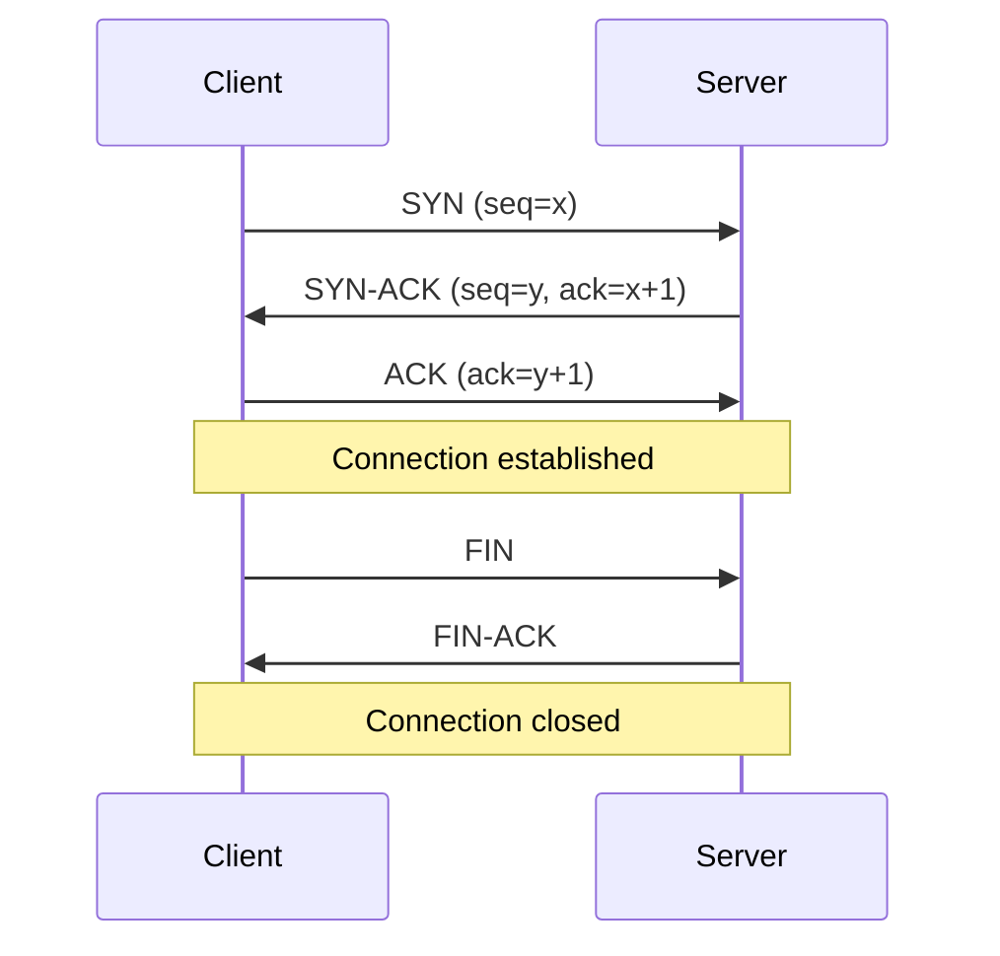
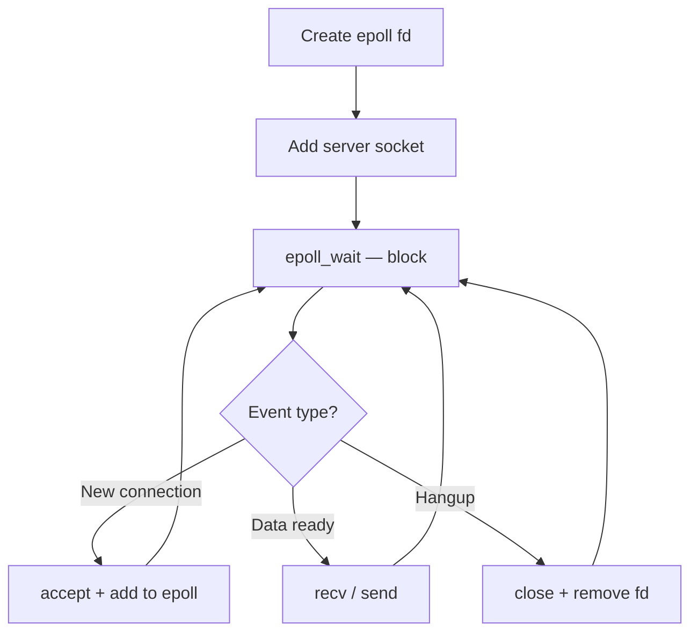

# Chapter 42 — Networking in C++

**Tags:** `networking` `sockets` `tcp` `udp` `epoll` `io_uring` `asio` `systems-programming`

---

## Theory

Network programming in C++ operates at the boundary between user-space and the kernel's
TCP/IP stack. The BSD sockets API — `socket`, `bind`, `listen`, `accept`, `connect`, `send`,
`recv` — provides the universal primitives. Every higher-level library ultimately calls these.

| Layer | Concern | C++ Touch Point |
|-------|---------|-----------------|
| Application | Protocol logic, serialization | Your code, protobuf, JSON |
| Transport | TCP reliability / UDP speed | `SOCK_STREAM` vs `SOCK_DGRAM` |
| Network | IP routing, addressing | `sockaddr_in`, `getaddrinfo` |

---

## What / Why / How

**What:** A socket is a file descriptor representing one endpoint of a network connection.
**Why:** Raw sockets remain essential for high-performance servers, custom protocols, and
understanding what Asio/gRPC do under the hood.
**How:** The TCP three-way handshake establishes the connection:



---

## Code Examples

### 1. TCP Echo Server (Blocking)

```cpp
#include <iostream>
#include <cstring>
#include <unistd.h>
#include <sys/socket.h>
#include <netinet/in.h>

int main() {
    int server_fd = socket(AF_INET, SOCK_STREAM, 0);
    if (server_fd < 0) { perror("socket"); return 1; }
    int opt = 1;
    setsockopt(server_fd, SOL_SOCKET, SO_REUSEADDR, &opt, sizeof(opt));

    sockaddr_in addr{};
    addr.sin_family = AF_INET;
    addr.sin_addr.s_addr = INADDR_ANY;
    addr.sin_port = htons(8080);
    bind(server_fd, (sockaddr*)&addr, sizeof(addr));
    listen(server_fd, 128);

    while (true) {
        int cfd = accept(server_fd, nullptr, nullptr);
        if (cfd < 0) continue;
        char buf[1024];
        ssize_t n = recv(cfd, buf, sizeof(buf), 0);
        if (n > 0) send(cfd, buf, n, 0);
        close(cfd);
    }
}
```

### 2. TCP Client

```cpp
#include <iostream>
#include <cstring>
#include <unistd.h>
#include <sys/socket.h>
#include <netinet/in.h>
#include <arpa/inet.h>

int main() {
    int fd = socket(AF_INET, SOCK_STREAM, 0);
    sockaddr_in addr{};
    addr.sin_family = AF_INET;
    addr.sin_port = htons(8080);
    inet_pton(AF_INET, "127.0.0.1", &addr.sin_addr);
    if (connect(fd, (sockaddr*)&addr, sizeof(addr)) < 0) {
        perror("connect"); return 1;
    }
    const char* msg = "Hello, server!";
    send(fd, msg, strlen(msg), 0);
    char buf[1024];
    ssize_t n = recv(fd, buf, sizeof(buf) - 1, 0);
    if (n > 0) { buf[n] = '\0'; std::cout << "Reply: " << buf << "\n"; }
    close(fd);
}
```

### 3. UDP Echo (Receiver + Sender)

```cpp
// --- UDP Receiver ---
#include <iostream>
#include <unistd.h>
#include <sys/socket.h>
#include <netinet/in.h>

int main() {
    int fd = socket(AF_INET, SOCK_DGRAM, 0);
    sockaddr_in addr{.sin_family = AF_INET, .sin_port = htons(9000)};
    addr.sin_addr.s_addr = INADDR_ANY;
    bind(fd, (sockaddr*)&addr, sizeof(addr));
    char buf[512];
    sockaddr_in sender{};
    socklen_t slen = sizeof(sender);
    ssize_t n = recvfrom(fd, buf, sizeof(buf)-1, 0, (sockaddr*)&sender, &slen);
    if (n > 0) { buf[n]='\0'; std::cout << buf << "\n";
        sendto(fd, buf, n, 0, (sockaddr*)&sender, slen); }
    close(fd);
}
```

```cpp
// --- UDP Sender ---
#include <iostream>
#include <cstring>
#include <unistd.h>
#include <sys/socket.h>
#include <netinet/in.h>
#include <arpa/inet.h>

int main() {
    int fd = socket(AF_INET, SOCK_DGRAM, 0);
    sockaddr_in dest{.sin_family = AF_INET, .sin_port = htons(9000)};
    inet_pton(AF_INET, "127.0.0.1", &dest.sin_addr);
    sendto(fd, "ping", 4, 0, (sockaddr*)&dest, sizeof(dest));
    char buf[512];
    ssize_t n = recv(fd, buf, sizeof(buf)-1, 0);
    if (n > 0) { buf[n]='\0'; std::cout << "Reply: " << buf << "\n"; }
    close(fd);
}
```

### 4. epoll Event Loop



```cpp
#include <iostream>
#include <unistd.h>
#include <fcntl.h>
#include <sys/socket.h>
#include <sys/epoll.h>
#include <netinet/in.h>

void set_nonblocking(int fd) {
    fcntl(fd, F_SETFL, fcntl(fd, F_GETFL, 0) | O_NONBLOCK);
}

int main() {
    int srv = socket(AF_INET, SOCK_STREAM, 0);
    int opt = 1;
    setsockopt(srv, SOL_SOCKET, SO_REUSEADDR, &opt, sizeof(opt));
    sockaddr_in addr{.sin_family=AF_INET, .sin_port=htons(8080)};
    addr.sin_addr.s_addr = INADDR_ANY;
    bind(srv, (sockaddr*)&addr, sizeof(addr));
    listen(srv, 128);
    set_nonblocking(srv);

    int epfd = epoll_create1(0);
    epoll_event ev{.events = EPOLLIN, .data = {.fd = srv}};
    epoll_ctl(epfd, EPOLL_CTL_ADD, srv, &ev);
    epoll_event events[64];

    while (true) {
        int n = epoll_wait(epfd, events, 64, -1);
        for (int i = 0; i < n; ++i) {
            if (events[i].data.fd == srv) {
                while (true) {
                    int cfd = accept(srv, nullptr, nullptr);
                    if (cfd < 0) break;
                    set_nonblocking(cfd);
                    ev = {.events = EPOLLIN | EPOLLET, .data = {.fd = cfd}};
                    epoll_ctl(epfd, EPOLL_CTL_ADD, cfd, &ev);
                }
            } else {
                char buf[1024];
                ssize_t bytes = recv(events[i].data.fd, buf, sizeof(buf), 0);
                if (bytes <= 0) close(events[i].data.fd);
                else send(events[i].data.fd, buf, bytes, 0);
            }
        }
    }
}
```

### 5. io_uring Echo Server (Linux 5.6+)

```cpp
#include <liburing.h>
#include <sys/socket.h>
#include <netinet/in.h>
#include <cstring>
#include <unistd.h>

enum EvType : uint8_t { ACCEPT, READ, WRITE };
struct ConnInfo { int fd; EvType type; char buf[1024]; };

int main() {
    int srv = socket(AF_INET, SOCK_STREAM, 0);
    int opt = 1;
    setsockopt(srv, SOL_SOCKET, SO_REUSEADDR, &opt, sizeof(opt));
    sockaddr_in addr{.sin_family=AF_INET, .sin_port=htons(8080)};
    addr.sin_addr.s_addr = INADDR_ANY;
    bind(srv, (sockaddr*)&addr, sizeof(addr));
    listen(srv, 128);

    io_uring ring;
    io_uring_queue_init(256, &ring, 0);
    auto* info = new ConnInfo{srv, ACCEPT, {}};
    auto* sqe = io_uring_get_sqe(&ring);
    io_uring_prep_accept(sqe, srv, nullptr, nullptr, 0);
    io_uring_sqe_set_data(sqe, info);
    io_uring_submit(&ring);

    while (true) {
        io_uring_cqe* cqe;
        io_uring_wait_cqe(&ring, &cqe);
        auto* ci = (ConnInfo*)io_uring_cqe_get_data(cqe);
        if (ci->type == ACCEPT && cqe->res >= 0) {
            auto* ri = new ConnInfo{cqe->res, READ, {}};
            sqe = io_uring_get_sqe(&ring);
            io_uring_prep_recv(sqe, cqe->res, ri->buf, sizeof(ri->buf), 0);
            io_uring_sqe_set_data(sqe, ri);
            sqe = io_uring_get_sqe(&ring);
            io_uring_prep_accept(sqe, srv, nullptr, nullptr, 0);
            io_uring_sqe_set_data(sqe, ci);
        } else if (ci->type == READ && cqe->res > 0) {
            ci->type = WRITE;
            sqe = io_uring_get_sqe(&ring);
            io_uring_prep_send(sqe, ci->fd, ci->buf, cqe->res, 0);
            io_uring_sqe_set_data(sqe, ci);
        } else { if (ci->fd != srv) close(ci->fd); delete ci; }
        io_uring_cqe_seen(&ring, cqe);
        io_uring_submit(&ring);
    }
}
```

### 6. Boost.Asio Async Echo Server

```cpp
#include <boost/asio.hpp>
#include <iostream>
#include <memory>
using boost::asio::ip::tcp;

class Session : public std::enable_shared_from_this<Session> {
    tcp::socket sock_; char buf_[1024];
public:
    explicit Session(tcp::socket s) : sock_(std::move(s)) {}
    void start() { do_read(); }
private:
    void do_read() {
        auto self = shared_from_this();
        sock_.async_read_some(boost::asio::buffer(buf_),
            [this, self](auto ec, size_t len) { if (!ec) do_write(len); });
    }
    void do_write(size_t len) {
        auto self = shared_from_this();
        boost::asio::async_write(sock_, boost::asio::buffer(buf_, len),
            [this, self](auto ec, size_t) { if (!ec) do_read(); });
    }
};

class Server {
    tcp::acceptor acc_;
public:
    Server(boost::asio::io_context& io, short port)
        : acc_(io, tcp::endpoint(tcp::v4(), port)) { do_accept(); }
private:
    void do_accept() {
        acc_.async_accept([this](auto ec, tcp::socket s) {
            if (!ec) std::make_shared<Session>(std::move(s))->start();
            do_accept();
        });
    }
};

int main() {
    boost::asio::io_context io;
    Server srv(io, 8080);
    io.run();
}
```

### 7. Protocol Framing — Length-Prefixed Messages

```cpp
#include <cstdint>
#include <vector>
#include <sys/socket.h>
#include <arpa/inet.h>

bool recv_exact(int fd, void* buf, size_t n) {
    size_t done = 0;
    while (done < n) {
        ssize_t r = recv(fd, (char*)buf + done, n - done, 0);
        if (r <= 0) return false;
        done += r;
    }
    return true;
}

bool send_message(int fd, const void* data, uint32_t len) {
    uint32_t net_len = htonl(len);
    if (send(fd, &net_len, 4, 0) != 4) return false;
    return send(fd, data, len, 0) == (ssize_t)len;
}

std::vector<char> recv_message(int fd) {
    uint32_t net_len;
    if (!recv_exact(fd, &net_len, 4)) return {};
    uint32_t len = ntohl(net_len);
    std::vector<char> buf(len);
    if (!recv_exact(fd, buf.data(), len)) return {};
    return buf;
}
```

### 8. Connection Pool

```cpp
#include <queue>
#include <mutex>
#include <condition_variable>
#include <functional>

class ConnectionPool {
    std::queue<int> pool_;
    std::mutex mtx_;
    std::condition_variable cv_;
    std::function<int()> factory_;
public:
    ConnectionPool(size_t n, std::function<int()> f) : factory_(std::move(f)) {
        for (size_t i = 0; i < n; ++i) pool_.push(factory_());
    }
    int acquire() {
        std::unique_lock lk(mtx_);
        cv_.wait(lk, [this]{ return !pool_.empty(); });
        int fd = pool_.front(); pool_.pop(); return fd;
    }
    void release(int fd) {
        std::lock_guard lk(mtx_);
        pool_.push(fd); cv_.notify_one();
    }
};
```

---

## TCP vs UDP

| Criteria | TCP | UDP |
|----------|-----|-----|
| Reliability | Guaranteed delivery + ordering | Best-effort |
| Latency | Higher (handshake, retransmits) | Lower |
| Use cases | HTTP, databases, files | DNS, gaming, streaming |
| Connection | Stateful | Connectionless |

## select vs poll vs epoll

| Feature | `select` | `poll` | `epoll` |
|---------|----------|--------|---------|
| Max FDs | 1024 | Unlimited | Unlimited |
| Complexity | O(n) | O(n) | O(1)/event |
| Edge-triggered | No | No | Yes |

---

## Exercises

### 🟢 Easy — TCP Time Server
Write a server that sends the current time to each connecting client, then closes.

### 🟡 Medium — Chat Room with epoll
Build a multi-client chat: broadcast each message to all other connected clients.

### 🔴 Hard — HTTP/1.1 Subset Server
Parse `GET` requests, serve files, return proper headers, support keep-alive with timeout.

---

## Solutions

### 🟢 TCP Time Server

```cpp
#include <iostream>
#include <cstring>
#include <ctime>
#include <unistd.h>
#include <sys/socket.h>
#include <netinet/in.h>

int main() {
    int srv = socket(AF_INET, SOCK_STREAM, 0);
    int opt = 1;
    setsockopt(srv, SOL_SOCKET, SO_REUSEADDR, &opt, sizeof(opt));
    sockaddr_in addr{.sin_family=AF_INET, .sin_port=htons(1300)};
    addr.sin_addr.s_addr = INADDR_ANY;
    bind(srv, (sockaddr*)&addr, sizeof(addr));
    listen(srv, 8);
    while (true) {
        int cfd = accept(srv, nullptr, nullptr);
        if (cfd < 0) continue;
        time_t now = time(nullptr);
        char* ts = ctime(&now);
        send(cfd, ts, strlen(ts), 0);
        close(cfd);
    }
}
```

### 🟡 Chat Room — Key Logic

```cpp
// Extend the epoll example: maintain std::vector<int> clients.
// On recv from client i: for each other client j, send(j, buf, n, 0).
// On disconnect: erase from vector, epoll_ctl EPOLL_CTL_DEL, close(fd).
```

### 🔴 HTTP Server — Core Parsing

```cpp
#include <string>
#include <sstream>
#include <fstream>

struct HttpReq { std::string method, path, version; };

HttpReq parse(const char* raw) {
    std::istringstream ss(raw);
    HttpReq r; ss >> r.method >> r.path >> r.version; return r;
}

std::string respond(const HttpReq& req, const std::string& root) {
    std::ifstream f(root + req.path, std::ios::binary);
    if (!f) return "HTTP/1.1 404 Not Found\r\nContent-Length: 0\r\n\r\n";
    std::ostringstream body; body << f.rdbuf();
    auto c = body.str();
    return "HTTP/1.1 200 OK\r\nContent-Length: " + std::to_string(c.size())
         + "\r\nConnection: keep-alive\r\n\r\n" + c;
}
```

---

## Quiz

**Q1.** What system call completes the server side of a TCP handshake?
<details><summary>Answer</summary><code>accept()</code></details>

**Q2.** Why call `htons()` when setting a port in `sockaddr_in`?
<details><summary>Answer</summary>Converts host byte order to network byte order (big-endian).</details>

**Q3.** Key advantage of `epoll` over `select`?
<details><summary>Answer</summary>O(1) per ready fd vs O(n) scanning; no fd count limit.</details>

**Q4.** What does length-prefixed framing solve?
<details><summary>Answer</summary>TCP's lack of message boundaries — tells receiver exact byte count.</details>

**Q5.** How does `io_uring` reduce overhead vs `epoll`?
<details><summary>Answer</summary>Shared ring buffers avoid syscalls; submissions via memory writes.</details>

**Q6.** When prefer UDP over TCP?
<details><summary>Answer</summary>Low-latency scenarios: games, streaming, DNS — where loss is tolerable.</details>

**Q7.** What does `EPOLLET` require from application code?
<details><summary>Answer</summary>Must drain fd completely (read until EAGAIN) on each notification.</details>

---

## Key Takeaways

- **BSD sockets** are the universal networking API; all libraries build on them
- **TCP guarantees ordering/delivery**; UDP trades those for lower latency
- **`epoll`** scales to hundreds of thousands of connections; use `select`/`poll` only for portability
- **`io_uring`** eliminates syscall overhead with shared ring buffers
- **Framing is mandatory** for TCP — the byte stream has no message boundaries
- **Connection pooling** amortizes handshake and TLS negotiation costs
- **Boost.Asio** provides portable, production-grade async networking

---

## Chapter Summary

This chapter covered C++ networking end-to-end: BSD sockets for TCP and UDP, scalable event
loops with `epoll` and `io_uring`, high-level Asio, protocol framing, and connection pooling.
The exercises progress from a time server to a partial HTTP/1.1 implementation.

---

## Real-World Insight

**Netflix** CDN servers handle tens of Gbps using event-driven I/O (`kqueue`/`epoll`) with
non-blocking sockets — thread-per-connection would collapse under TLS termination alone.
**Game servers** (Valorant, Fortnite) use UDP with custom reliability layers to avoid TCP's
head-of-line blocking. **Modern databases** (ScyllaDB, TigerBeetle) use `io_uring` for
both disk and network I/O, achieving millions of ops/sec/core.

---

## Common Mistakes

1. **Ignoring partial `send`/`recv`** — always loop until full transfer
2. **Forgetting `SO_REUSEADDR`** — causes `EADDRINUSE` for ~60s on restart
3. **Blocking `accept` in event loop** — set listen socket non-blocking
4. **Not draining in `EPOLLET`** — must read until `EAGAIN`
5. **Assuming TCP message boundaries** — two sends can arrive as one recv
6. **Leaking fds** — every `accept` needs a matching `close` on all paths

---

## Interview Questions

### Q1. Level-triggered vs edge-triggered epoll?

**Answer:** Level-triggered re-notifies while data remains; edge-triggered fires only on
state change (new data). Edge-triggered requires draining the fd (read until `EAGAIN`) but
reduces wakeups. nginx uses edge-triggered for throughput at scale.

### Q2. How would you design a TCP request-response protocol?

**Answer:** Length-prefixed framing (4-byte big-endian header + payload). Add a request ID
for multiplexing. Use protobuf/flatbuffers for serialization. Always loop on `recv` to
handle partial reads.

### Q3. Why does `select()` fail at scale?

**Answer:** Hard `FD_SETSIZE` limit (1024), O(n) scan per call, and fd_set copy overhead.
Replace with `epoll` (Linux), `kqueue` (BSD), or Boost.Asio for portability.

### Q4. What is the Thundering Herd problem?

**Answer:** Multiple threads blocking on `accept()` all wake for one connection; only one
succeeds. Fix with `EPOLLEXCLUSIVE`, `SO_REUSEPORT`, or single-acceptor design.

### Q5. `io_uring` vs `epoll` for networking?

**Answer:** `epoll` is readiness-based (notifies, then you syscall). `io_uring` is
completion-based (submit ops, get results) with shared ring buffers — fewer syscalls,
batched submissions, optional kernel-side polling. Requires Linux 5.6+.
