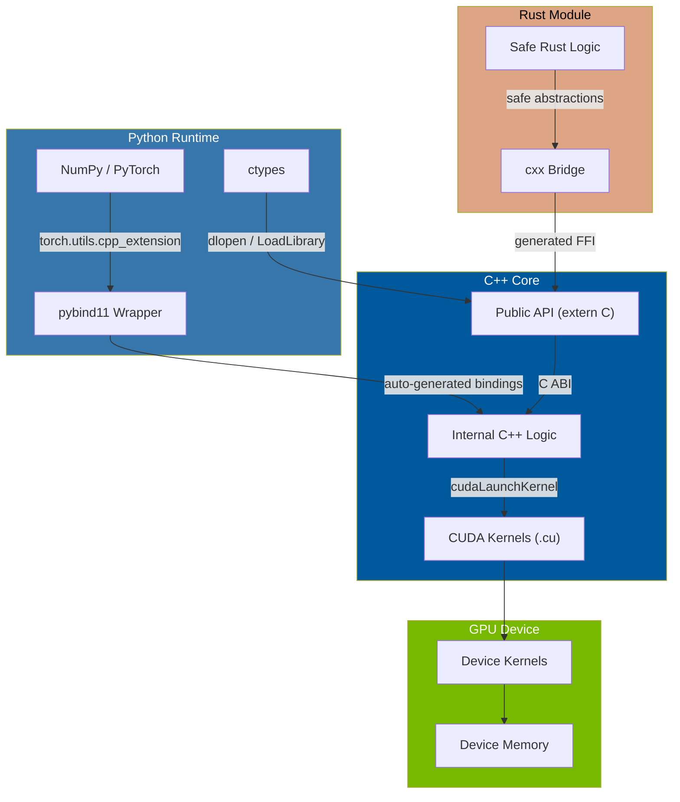

# Chapter 43 — Interop: C, Python, Rust

> **Tags:** `interop`, `ffi`, `pybind11`, `extern-c`, `rust-cxx`, `cuda-python`, `shared-libraries`

---

## Theory

Modern software rarely lives in a single language. C++ and CUDA kernels must be callable
from Python scripts, legacy C libraries, and Rust safety-critical components.
*Interoperability* is the set of techniques — ABIs, binding generators, and FFIs — that
let these worlds coexist.

The core challenge is **ABI compatibility**. C++ name-mangling, exception models, and
object layouts differ across compilers. Bridging these gaps requires well-defined
boundaries: the C ABI (the *lingua franca*), or code-generation tools like pybind11 and
the Rust `cxx` crate.

---

## What / Why / How

| Question | Answer |
|----------|--------|
| **What** | Techniques for calling code across language boundaries (C ↔ C++ ↔ Python ↔ Rust ↔ CUDA). |
| **Why**  | Leverage Python's ecosystem for prototyping, C's ubiquitous libraries, Rust's safety guarantees, and C++/CUDA's raw performance — all in one system. |
| **How**  | Use `extern "C"` for C ABI, pybind11/ctypes for Python, the `cxx` crate for Rust, and CUDA C++ extensions for GPU acceleration from Python. |

---

## 1 — C Interop: `extern "C"` and the C ABI

The C ABI is the only stable binary interface shared across virtually every platform.
Exposing a function with C linkage disables C++ name mangling, making the symbol callable
from any language.

### 1.1 Header Compatibility

This header file is designed to work from both C and C++ code. The `#ifdef __cplusplus` guard wraps the function declarations in `extern "C"` only when compiled by a C++ compiler — this disables name mangling so the symbols match what a C linker expects. A C compiler ignores the guard entirely. This pattern is the standard way to write headers for libraries that need to be callable from both languages.

```cpp
// mathlib.h — usable from both C and C++
#ifndef MATHLIB_H
#define MATHLIB_H

#ifdef __cplusplus
extern "C" {
#endif

// Exported functions use C linkage
double vec_dot(const double* a, const double* b, int n);
int    mat_inv(double* out, const double* in, int n);

#ifdef __cplusplus
}
#endif

#endif // MATHLIB_H
```

### 1.2 Implementation and Linking

This is the implementation of the C-ABI function declared in the header above. The `extern "C"` on the definition ensures the compiled symbol name is simply `vec_dot` (not a mangled C++ name like `_Z7vec_dotPKdS0_i`). The build commands show how to compile it into a shared library (`.so`) with `-shared -fPIC`, and how another program links against it with `-L. -lmathlib`.

```cpp
// mathlib.cpp
#include "mathlib.h"

extern "C" double vec_dot(const double* a, const double* b, int n) {
    double sum = 0.0;
    for (int i = 0; i < n; ++i)
        sum += a[i] * b[i];
    return sum;
}
// Build: g++ -shared -fPIC mathlib.cpp -o libmathlib.so
// Link:  g++ main.cpp -L. -lmathlib -o demo
```

---

## 2 — Python Interop

### 2.1 pybind11 — Full Tutorial

pybind11 is a header-only library that exposes C++ to Python with minimal boilerplate,
handling reference counting, exception translation, and NumPy buffers.

```cpp
// py_math.cpp — pybind11 module
#include <pybind11/pybind11.h>
#include <pybind11/numpy.h>
#include <cmath>

namespace py = pybind11;

double dot_product(py::array_t<double> a, py::array_t<double> b) {
    auto buf_a = a.request();
    auto buf_b = b.request();
    if (buf_a.ndim != 1 || buf_b.ndim != 1)
        throw std::runtime_error("Expected 1-D arrays");
    if (buf_a.size != buf_b.size)
        throw std::runtime_error("Array sizes must match");

    const double* pa = static_cast<const double*>(buf_a.ptr);
    const double* pb = static_cast<const double*>(buf_b.ptr);
    double sum = 0.0;
    for (ssize_t i = 0; i < buf_a.size; ++i)
        sum += pa[i] * pb[i];
    return sum;
}

struct Matrix {
    int rows, cols;
    std::vector<double> data;

    Matrix(int r, int c) : rows(r), cols(c), data(r * c, 0.0) {}
    double get(int r, int c) const { return data[r * cols + c]; }
    void   set(int r, int c, double v) { data[r * cols + c] = v; }
};

PYBIND11_MODULE(py_math, m) {
    m.doc() = "C++ math library exposed to Python via pybind11";

    m.def("dot_product", &dot_product, "Dot product of two NumPy arrays",
          py::arg("a"), py::arg("b"));

    py::class_<Matrix>(m, "Matrix")
        .def(py::init<int, int>())
        .def("get", &Matrix::get)
        .def("set", &Matrix::set)
        .def("__repr__", [](const Matrix& m) {
            return "Matrix(" + std::to_string(m.rows) + "x" +
                   std::to_string(m.cols) + ")";
        });
}
// Build: c++ -O2 -shared -std=c++17 -fPIC $(python3 -m pybind11 --includes) \
//        py_math.cpp -o py_math$(python3-config --extension-suffix)
```

### 2.2 ctypes — Quick FFI Without Compilation Deps

This C++ file exposes a single function (`norm_l2`) with C linkage and compiles it into a shared library. Unlike pybind11, the Python side doesn't need any C++ compilation step — it uses `ctypes` to load the `.so` file at runtime and call the function directly. You manually declare the argument and return types in Python, which is error-prone but requires zero build dependencies.

```cpp
// fastops.cpp — compiled to shared library
#include <cmath>

extern "C" {
    double norm_l2(const double* v, int n) {
        double s = 0.0;
        for (int i = 0; i < n; ++i) s += v[i] * v[i];
        return std::sqrt(s);
    }
}
// Build: g++ -shared -fPIC -o libfastops.so fastops.cpp
```

This Python script loads the shared library at runtime using `ctypes.CDLL` and calls the C function. The `restype` and `argtypes` declarations tell Python how to convert between Python objects and C types. The NumPy array's underlying memory is passed directly to C via `ctypes.data_as` — no copy is made, so this is efficient for large arrays.

```python
import ctypes, numpy as np

lib = ctypes.CDLL("./libfastops.so")
lib.norm_l2.restype  = ctypes.c_double
lib.norm_l2.argtypes = [ctypes.POINTER(ctypes.c_double), ctypes.c_int]

v = np.array([3.0, 4.0], dtype=np.float64)
result = lib.norm_l2(v.ctypes.data_as(ctypes.POINTER(ctypes.c_double)), len(v))
print(f"L2 norm = {result}")  # 5.0
```

### 2.3 Cython Overview

Cython compiles Python-like syntax to C extensions, bridging ctypes and pybind11:

```cython
# fastops.pyx — wraps the C function directly
cdef extern from "mathlib.h":
    double vec_dot(const double* a, const double* b, int n)

def py_dot(double[:] a, double[:] b):
    return vec_dot(&a[0], &b[0], a.shape[0])
```

---

## 3 — Rust Interop

### 3.1 Rust FFI via `extern "C"`

This shows the simplest way to call between Rust and C++. The Rust function uses `#[no_mangle]` to prevent Rust's own name mangling and `extern "C"` to use the C calling convention. The C++ side declares the same function as `extern "C"` and calls it like any C function. At link time, the Rust-compiled library provides the symbol. This approach works but is "unsafe" in Rust terms — there are no compile-time checks that the types match across the boundary.

```rust
// lib.rs
#[no_mangle]
pub extern "C" fn rust_add(a: f64, b: f64) -> f64 { a + b }
```

This C++ program calls the Rust function declared above. It simply declares the function signature with `extern "C"` and links against the Rust-compiled static library. The Cargo build command compiles the Rust code, and the `g++` command links the result.

```cpp
// call_rust.cpp
#include <cstdio>
extern "C" double rust_add(double a, double b);
int main() {
    std::printf("rust_add = %.2f\n", rust_add(2.5, 3.7)); // 6.20
}
// cargo build --release && g++ call_rust.cpp -Ltarget/release -lmylib -o call_rust
```

### 3.2 The `cxx` Crate — Safe Bidirectional Bindings

The `cxx` crate generates safe Rust ↔ C++ bindings with compile-time checking.

```rust
// src/lib.rs — using cxx
#[cxx::bridge]
mod ffi {
    // Types/functions defined in C++ that Rust can call
    unsafe extern "C++" {
        include!("myproject/engine.h");
        type Engine;
        fn create_engine(threads: i32) -> UniquePtr<Engine>;
        fn compute(self: &Engine, input: &[f64]) -> Vec<f64>;
    }

    // Rust functions callable from C++
    extern "Rust" {
        fn validate_input(data: &[f64]) -> bool;
    }
}

fn validate_input(data: &[f64]) -> bool {
    data.iter().all(|x| x.is_finite())
}
```

---

## 4 — CUDA + Python Extensions

### 4.1 PyTorch Custom CUDA Extension

This is a complete PyTorch CUDA extension that runs a vector addition on the GPU. The `__global__` function is a CUDA kernel — it runs on thousands of GPU threads simultaneously, each handling one element. The C++ wrapper function validates that tensors are on CUDA, calculates the grid dimensions, and launches the kernel. The `PYBIND11_MODULE` macro exposes the function to Python. This is the same pattern PyTorch itself uses internally for its GPU operations.

```cpp
// vector_add_kernel.cu
#include <torch/extension.h>
#include <cuda_runtime.h>

__global__ void vec_add_kernel(const float* a, const float* b, float* c, int n) {
    int idx = blockIdx.x * blockDim.x + threadIdx.x;
    if (idx < n) c[idx] = a[idx] + b[idx];
}

torch::Tensor vector_add_cuda(torch::Tensor a, torch::Tensor b) {
    TORCH_CHECK(a.device().is_cuda(), "a must be on CUDA");
    TORCH_CHECK(b.device().is_cuda(), "b must be on CUDA");
    auto c = torch::empty_like(a);
    int n = a.numel();
    int threads = 256;
    int blocks = (n + threads - 1) / threads;

    vec_add_kernel<<<blocks, threads>>>(
        a.data_ptr<float>(), b.data_ptr<float>(),
        c.data_ptr<float>(), n);

    return c;
}

PYBIND11_MODULE(TORCH_EXTENSION_NAME, m) {
    m.def("vector_add", &vector_add_cuda, "CUDA vector add");
}
```

This `setup.py` file tells PyTorch's build system how to compile the CUDA extension. `CUDAExtension` handles finding the CUDA toolkit, setting the right compiler flags, and producing a Python-importable `.so` file. You can also skip this file entirely and use `torch.utils.cpp_extension.load()` for JIT (just-in-time) compilation during development.

```python
from setuptools import setup
from torch.utils.cpp_extension import BuildExtension, CUDAExtension

setup(
    name="vector_add_cuda",
    ext_modules=[
        CUDAExtension("vector_add_cuda", ["vector_add_kernel.cu"]),
    ],
    cmdclass={"build_ext": BuildExtension},
)
```

### 4.2 Using CuPy for Lightweight CUDA-Python Interop

### 4.2 Using CuPy for Lightweight CUDA-Python Interop

CuPy provides a simpler alternative to PyTorch extensions for running custom CUDA kernels from Python. The `RawKernel` class compiles CUDA C++ code at runtime (JIT) and lets you launch it with Python syntax. This SAXPY kernel (`y = a*x + y`) is a classic GPU benchmark — each thread computes one element independently. CuPy handles GPU memory management and data transfers automatically, making it ideal for quick prototyping.

```python

kernel = cp.RawKernel(r'''
extern "C" __global__
void saxpy(float a, const float* x, float* y, int n) {
    int i = blockIdx.x * blockDim.x + threadIdx.x;
    if (i < n) y[i] = a * x[i] + y[i];
}
''', 'saxpy')

n = 1 << 20
x, y = cp.ones(n, dtype=cp.float32), cp.zeros(n, dtype=cp.float32)
kernel((n // 256,), (256,), (2.0, x, y, n))  # y[0] = 2.0
```

---

## 5 — Shared Libraries: .so / .dll

### 5.1 Symbol Visibility

This header defines macros that control which functions are visible outside a shared library. On Linux, `-fvisibility=hidden` hides all symbols by default, and `__attribute__((visibility("default")))` explicitly exports the ones you want. On Windows, the equivalent is `__declspec(dllexport/dllimport)`. The `BUILDING_MYLIB` guard switches between export (when compiling the library) and import (when using it). Hiding symbols reduces binary size, speeds up loading, and prevents accidental ABI breakage.

```cpp
// visibility.h — controlling exported symbols
#if defined(_WIN32)
  #define API_EXPORT __declspec(dllexport)
  #define API_IMPORT __declspec(dllimport)
#else
  #define API_EXPORT __attribute__((visibility("default")))
  #define API_IMPORT
#endif

#ifdef BUILDING_MYLIB
  #define MYLIB_API API_EXPORT
#else
  #define MYLIB_API API_IMPORT
#endif
```

### 5.2 Runtime Loading with `dlopen`

This demonstrates loading a shared library at runtime instead of at compile time. `dlopen` opens the `.so` file, and `dlsym` looks up a function by its string name — this is how plugin systems work (e.g., loading game mods or database extensions). The function pointer is cast to the correct type and called normally. Error checking with `dlerror()` is essential because misspelled symbol names fail silently otherwise. This decoupling means the main program can run even if the plugin library doesn't exist.

```cpp
// dlopen_demo.cpp
#include <cstdio>
#include <dlfcn.h>

int main() {
    void* handle = dlopen("./libfastops.so", RTLD_LAZY);
    if (!handle) { std::fprintf(stderr, "%s\n", dlerror()); return 1; }

    using norm_fn = double (*)(const double*, int);
    auto fn = reinterpret_cast<norm_fn>(dlsym(handle, "norm_l2"));
    if (!fn) { std::fprintf(stderr, "%s\n", dlerror()); dlclose(handle); return 1; }

    double v[] = {3.0, 4.0};
    std::printf("norm = %.1f\n", fn(v, 2)); // 5.0
    dlclose(handle);
}
// Build: g++ dlopen_demo.cpp -ldl -o dlopen_demo
```

---

## Interop Architecture Diagram



---

## Exercises

### 🟢 Easy — E1: C-ABI Wrapper

Write a C++ function `extern "C" int factorial(int n)` and a `main()` that calls it.
Verify the symbol with `nm -D` after compiling as a shared library.

### 🟢 Easy — E2: ctypes Caller

Compile the `factorial` function into `libfact.so`, then write a Python script using
`ctypes` to call it and print `factorial(10)`.

### 🟡 Medium — E3: pybind11 Class Binding

Expose a `Vector3` class (x, y, z fields, `length()` method, `__repr__`) to Python
using pybind11. Write a Python test that creates a vector and checks `length()`.

### 🟡 Medium — E4: CUDA Extension

Write a PyTorch CUDA extension that computes element-wise ReLU: `y[i] = max(0, x[i])`.
Include the kernel, binding code, and a Python test with JIT compilation.

### 🔴 Hard — E5: Rust ↔ C++ Pipeline

Design a pipeline where Rust validates input data (NaN/Inf checks), passes it via
`extern "C"` to a C++ function that normalizes the array, and returns the result. Write
build scripts for both sides.

---

## Solutions

### S1: C-ABI Wrapper

This solution defines a simple factorial function with `extern "C"` to ensure the compiled symbol is unmangled. After building as a shared library, `nm -D` confirms that the symbol name is plain `factorial` — not something like `_Z9factoriali`. This is the foundation for making C++ code callable from any other language.

```cpp
extern "C" int factorial(int n) {
    int r = 1;
    for (int i = 2; i <= n; ++i) r *= i;
    return r;
}
// g++ -shared -fPIC factorial.cpp -o libfact.so
// nm -D libfact.so | grep factorial  → shows unmangled symbol
```

### S2: ctypes Caller

This Python script loads the compiled shared library and calls the `factorial` function using `ctypes`. The `restype` and `argtypes` declarations are mandatory to ensure correct type conversion between Python integers and C `int` values — without them, ctypes defaults to `int` returns but may mishandle other types.

```python
import ctypes
lib = ctypes.CDLL("./libfact.so")
lib.factorial.restype = ctypes.c_int
lib.factorial.argtypes = [ctypes.c_int]
print(f"10! = {lib.factorial(10)}")  # 3628800
```

### S3: pybind11 Vector3

This uses pybind11 to expose a C++ `Vector3` struct to Python as a fully usable class. `py::init<double, double, double>()` generates a constructor, `.def("length", ...)` exposes the method, and `__repr__` provides a readable string representation for debugging. pybind11 handles all the reference counting and type conversion automatically — Python users can create `Vector3` objects and call `.length()` as if it were pure Python.

```cpp
#include <pybind11/pybind11.h>
#include <cmath>
namespace py = pybind11;

struct Vector3 {
    double x, y, z;
    Vector3(double x, double y, double z) : x(x), y(y), z(z) {}
    double length() const { return std::sqrt(x*x + y*y + z*z); }
};

PYBIND11_MODULE(vec3, m) {
    py::class_<Vector3>(m, "Vector3")
        .def(py::init<double, double, double>())
        .def("length", &Vector3::length)
        .def("__repr__", [](const Vector3& v) {
            return "Vector3(" + std::to_string(v.x) + ", " +
                   std::to_string(v.y) + ", " + std::to_string(v.z) + ")";
        });
}
```

### S4: CUDA ReLU Extension

This CUDA kernel implements element-wise ReLU (Rectified Linear Unit) — the most common activation function in neural networks. Each GPU thread processes one element, outputting `max(0, x[i])`. The pybind11 binding exposes it as a Python function that accepts and returns PyTorch tensors. The grid size calculation `(n+255)/256` ensures enough threads are launched to cover all elements, even when the array size isn't a multiple of the block size (256).

```cpp
// relu_ext.cu
#include <torch/extension.h>

__global__ void relu_k(const float* x, float* y, int n) {
    int i = blockIdx.x * blockDim.x + threadIdx.x;
    if (i < n) y[i] = x[i] > 0.f ? x[i] : 0.f;
}

torch::Tensor relu_cuda(torch::Tensor x) {
    auto y = torch::empty_like(x);
    int n = x.numel();
    relu_k<<<(n+255)/256, 256>>>(x.data_ptr<float>(), y.data_ptr<float>(), n);
    return y;
}
PYBIND11_MODULE(TORCH_EXTENSION_NAME, m) { m.def("relu", &relu_cuda); }
```

This Python test uses PyTorch's JIT compilation (`load`) to compile the CUDA extension on the fly, then verifies that all output values are non-negative — confirming that ReLU correctly zeroed out the negative inputs.

```python
import torch
ext = load(name="relu_ext", sources=["relu_ext.cu"])
x = torch.randn(1024, device="cuda")
assert (ext.relu(x) >= 0).all()
```

---

## Quiz

**Q1.** What does `extern "C"` do in C++?
**A1.** It disables C++ name mangling so the function uses C linkage, making it callable
from C, Python (ctypes), Rust, and other languages.

**Q2.** Which pybind11 function exposes a C++ class to Python?
**A2.** `py::class_<T>(module, "Name")` followed by `.def()` calls for methods.

**Q3.** What is the main advantage of the `cxx` crate over raw `extern "C"` for Rust ↔ C++?
**A3.** `cxx` provides compile-time safety checks and can pass rich types (strings,
vectors, unique_ptr) without manual marshalling.

**Q4.** Why must you use `-fPIC` when building a shared library on Linux?
**A4.** Position-Independent Code allows the library to be loaded at any memory address,
which is required for shared objects (`.so` files) on x86-64.

**Q5.** How does `dlopen` differ from compile-time linking?
**A5.** `dlopen` loads a shared library at runtime, allowing optional or plugin-based
dependencies, whereas compile-time linking resolves symbols during the link step.

**Q6.** What Python module is used for JIT-compiling PyTorch CUDA extensions?
**A6.** `torch.utils.cpp_extension.load()` compiles and loads `.cu` files at runtime.

**Q7.** What flag controls symbol visibility in GCC/Clang shared libraries?
**A7.** `-fvisibility=hidden` hides all symbols by default; individual symbols are
exported with `__attribute__((visibility("default")))`.

---

## Key Takeaways

- The **C ABI** is the universal bridge — every language can call `extern "C"` functions.
- **pybind11** provides zero-copy NumPy integration and automatic type conversion.
- **ctypes** requires no compilation but is fragile for complex types.
- The **`cxx` crate** enforces type safety across Rust ↔ C++ at compile time.
- **CUDA Python extensions** bring GPU acceleration to Python with minimal overhead.
- **Symbol visibility** (`-fvisibility=hidden`) reduces binary size and prevents ABI breakage.
- **`dlopen`** enables plugin architectures with on-demand library loading.

---

## Chapter Summary

This chapter covered C++ interoperability across languages. We started with the C ABI,
built upward through Python bindings (pybind11, ctypes, Cython) and Rust integration
(raw FFI, `cxx` crate), explored CUDA+Python extensions powering frameworks like PyTorch,
and closed with shared-library mechanics. Key insight: **design your interop boundary as a
narrow, C-ABI-compatible surface**, then layer type-safe wrappers on top.

---

## Real-World Insight

**PyTorch's architecture** is the canonical multi-language interop example. Python calls
`libtorch` (C++14) via pybind11. `libtorch` dispatches to CUDA kernels for GPU ops and
CPU-optimized libraries (MKL, oneDNN) for CPU ops. Custom ops use the same
`torch.utils.cpp_extension` pattern shown here. Meta also bridges Rust for memory-safe
data loading. This layered design — Python for UX, C++ for performance, CUDA for GPU,
Rust for safety — is the standard for production ML systems.

---

## Common Mistakes

| Mistake | Why It Fails | Fix |
|---------|-------------|-----|
| Forgetting `extern "C"` | C++ mangles names; other languages can't find the symbol | Always wrap exported functions in `extern "C"` |
| Passing `std::string` across FFI | ABI differs between compilers and languages | Use `const char*` at the boundary |
| Ignoring `-fPIC` | Linker rejects non-PIC code in shared objects | Always compile with `-fPIC` for `.so` targets |
| Throwing C++ exceptions across FFI | Undefined behavior in C/Rust callers | Catch exceptions at the boundary and return error codes |
| Not checking `dlsym` return | NULL dereference if symbol is missing | Always check for NULL and call `dlerror()` |
| Mixing allocators across boundaries | Heap corruption when one language frees memory allocated by another | Provide explicit `create`/`destroy` functions from the owning library |

---

## Interview Questions

### IQ1: How would you expose a C++ library to both Python and Rust?

**Answer:** Define a narrow C-ABI layer with `extern "C"` functions and opaque handles.
Wrap it with pybind11 for Python (preferred for classes and NumPy) or ctypes for quick
use. For Rust, use the `cxx` crate for bidirectional calls or raw `extern "C"` in an
`unsafe` block. The C-ABI layer is the single source of truth.

### IQ2: Explain how PyTorch's extension mechanism works.

**Answer:** `torch.utils.cpp_extension.load()` invokes system compilers to build a `.so`
from `.cpp`/`.cu` sources. The module uses pybind11 to register functions. At runtime,
Python loads the `.so` and pybind11 translates `torch::Tensor` objects with zero-copy.
CUDA kernels access tensor data via `data_ptr<T>()`.

### IQ3: What are the trade-offs between ctypes and pybind11?

**Answer:** **ctypes** needs no build step but type declarations are manual and error-prone.
**pybind11** generates type-safe bindings at compile time with automatic conversion for STL
types, NumPy, and exceptions, but requires a C++ compilation step. For production APIs,
pybind11 is preferred; for quick scripting against a simple C library, ctypes suffices.

### IQ4: Why is passing exceptions across FFI boundaries dangerous?

**Answer:** C++ exceptions use a runtime-specific unwinding mechanism. When one propagates
into a C or Rust caller, the unwinder can't find the catch frame, causing `std::terminate()`
or UB. Fix: catch at the boundary and return error codes. pybind11 and `cxx` do this
automatically.
