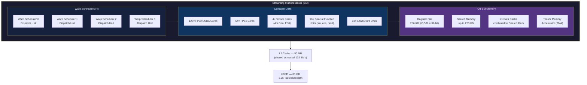
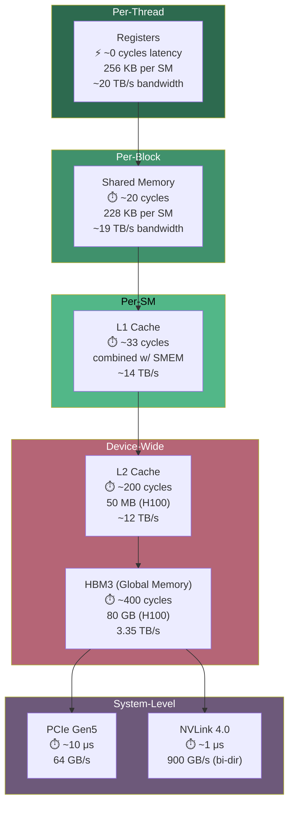

# Chapter 44: GPU Architecture — From Transistors to Tensor Cores

**Tags:** #gpu-architecture #cuda #simt #tensor-cores #memory-hierarchy #streaming-multiprocessor #hpc #ai-hardware

---

## 1. Theory: The Fundamental Design Split

Modern processors split into two philosophies born from radically different workloads. CPUs evolved to minimize **latency** — the time for a single task to complete. GPUs evolved to maximize **throughput** — the total work done per unit time. Understanding this divergence is the foundation of all GPU programming.

A CPU dedicates most of its transistor budget to control logic: branch predictors, out-of-order execution engines, speculative execution, and enormous caches. This makes a single thread blazing fast. A GPU invests those same transistors in **thousands of arithmetic units** with minimal control logic per unit, relying on massive parallelism to hide latency.

### Transistor Budget Allocation

| Component | CPU (% Transistors) | GPU (% Transistors) |
|-----------|--------------------|--------------------|
| ALUs / Compute | ~10% | ~60% |
| Caches | ~50% | ~15% |
| Control Logic | ~30% | ~10% |
| Other (I/O, etc.) | ~10% | ~15% |

> **Key Insight**: A GPU achieves 10–100× the arithmetic throughput of a CPU by simply having more ALUs, at the cost of per-thread performance.

---

## 2. What, Why, How

### What Is a GPU?

A GPU (Graphics Processing Unit) is a massively parallel processor containing **thousands of cores** organized into **Streaming Multiprocessors (SMs)**. Originally designed for rendering pixels independently, GPUs became general-purpose compute engines (GPGPU) when NVIDIA introduced CUDA in 2007.

### Why Do GPUs Dominate AI/ML?

Neural network training is dominated by **matrix multiplications** (GEMM). A single training step of a transformer model performs billions of multiply-accumulate operations. These operations are:
- **Independent** — each output element can be computed separately
- **Regular** — the same operation repeated across all elements
- **Data-parallel** — thousands of elements processed identically

This maps perfectly to GPU architecture. A single H100 GPU delivers **989 TFLOPS** of FP16 Tensor Core performance — roughly 200× what a high-end CPU achieves.

### How Does a GPU Execute Work?

1. The CPU (host) launches a **kernel** — a function that runs on the GPU
2. The GPU creates thousands of lightweight **threads** organized in a hierarchy
3. Threads are grouped into **warps** of 32, the fundamental execution unit
4. Warps are scheduled onto **Streaming Multiprocessors (SMs)**
5. Each SM contains the execution units (CUDA cores, Tensor Cores) that do the math
6. Results are written to GPU memory, then optionally copied back to the CPU

---

## 3. CPU vs GPU Design Philosophy

### Latency-Oriented Design (CPU)

```
CPU Core:
┌──────────────────────────────────────────┐
│  Branch Predictor  │  Speculation Engine │
│  ──────────────────┼──────────────────── │
│  Instruction Fetch │  Decode (4-wide)    │
│  ──────────────────┼──────────────────── │
│  Reorder Buffer    │  Reservation Station│
│  (512 entries)     │  (complex OoO logic)│
│  ──────────────────┼──────────────────── │
│  Execution Units   │  L1D Cache (48 KB)  │
│  (few, fast)       │  L1I Cache (32 KB)  │
│  ──────────────────┼──────────────────── │
│         L2 Cache (1.25 MB per core)      │
│         L3 Cache (shared, up to 96 MB)   │
└──────────────────────────────────────────┘
   Total cores: 16–128 (high-end server)
```

### Throughput-Oriented Design (GPU)

```
GPU Streaming Multiprocessor (SM):
┌──────────────────────────────────────────┐
│  Warp Scheduler 0  │  Warp Scheduler 1  │
│  Warp Scheduler 2  │  Warp Scheduler 3  │
│  ──────────────────┼──────────────────── │
│  128 FP32 CUDA Cores (simple ALUs)      │
│  4 Tensor Cores (matrix engines)        │
│  ──────────────────┼──────────────────── │
│  Register File (256 KB — larger than    │
│    entire CPU L1 cache!)                │
│  ──────────────────┼──────────────────── │
│  Shared Memory / L1 (228 KB combined)   │
└──────────────────────────────────────────┘
   Total SMs: 132 (H100) = 16,896 CUDA cores
```

---

## 4. SIMT Execution Model

SIMT (Single Instruction, Multiple Threads) is NVIDIA's execution model. It differs from classical SIMD:

| Feature | SIMD (CPU AVX-512) | SIMT (GPU) |
|---------|--------------------|--------------------|
| Width | Fixed (e.g., 16 floats) | Warp of 32 threads |
| Programming | Explicit vector intrinsics | Scalar code per thread |
| Branching | Masked lanes | Warp divergence |
| Memory access | Contiguous required | Can be irregular |
| Stack/context | Shared | Per-thread |

In SIMT, you write **scalar code** for a single thread. The hardware executes it across 32 threads simultaneously in a warp. If threads diverge at a branch, both paths execute serially with inactive threads masked — but the programmer writes simple if/else.

```cpp
// SIMT: Write scalar code, hardware parallelizes across 32 threads
__global__ void simt_example(float* out, float* in, int n) {
    int tid = blockIdx.x * blockDim.x + threadIdx.x;
    if (tid < n) {
        // Each thread executes this independently
        // but 32 threads run in lockstep (one warp)
        out[tid] = sinf(in[tid]) * 2.0f;
    }
}
```

---

## 5. Streaming Multiprocessor (SM) Internals

The SM is the fundamental compute building block of a GPU. Every GPU generation refines it.

### SM Block Diagram (NVIDIA Hopper H100)



### Component Details

| Component | Count per SM | Purpose |
|-----------|-------------|---------|
| Warp Schedulers | 4 | Select warps ready to execute, issue instructions |
| FP32 CUDA Cores | 128 | Single-precision floating-point arithmetic |
| FP64 Cores | 64 | Double-precision (scientific computing) |
| Tensor Cores | 4 (4th gen) | Matrix multiply-accumulate (MMA) operations |
| SFUs | 16 | Transcendental functions (sin, cos, exp, rsqrt) |
| Load/Store Units | 32 | Memory address generation and data movement |
| Register File | 256 KB | Per-thread fast storage (65,536 × 32-bit regs) |
| Shared Memory | 228 KB max | Programmer-managed per-block scratchpad |

---

## 6. Memory Hierarchy — Bandwidth & Latency at Every Level



### Summary Table

| Memory Level | Scope | Capacity (H100) | Latency | Bandwidth |
|-------------|-------|-----------------|---------|-----------|
| Registers | Per-thread | 256 KB / SM | ~0 cycles | ~20 TB/s |
| Shared Memory | Per-block | 228 KB / SM | ~20 cycles | ~19 TB/s |
| L1 Cache | Per-SM | Combined w/ SMEM | ~33 cycles | ~14 TB/s |
| L2 Cache | All SMs | 50 MB | ~200 cycles | ~12 TB/s |
| HBM3 (Global) | Device | 80 GB | ~400 cycles | 3.35 TB/s |
| PCIe 5.0 | Host↔Device | N/A | ~10 µs | 64 GB/s |
| NVLink 4.0 | GPU↔GPU | N/A | ~1 µs | 900 GB/s |

> **1000× bandwidth difference** between registers and global memory. This is why memory optimization dominates GPU programming.

---

## 7. Core Types

### CUDA Cores (Streaming Processors)
- Execute standard FP32/FP64/INT32 instructions
- One operation per core per clock cycle
- H100 has 16,896 FP32 CUDA cores (128 × 132 SMs)
- Also called "shader cores" in graphics context

### Tensor Cores (Matrix Engines)
- Perform **matrix multiply-accumulate** (MMA) on small tiles
- `D = A × B + C` where A, B, C, D are matrices (e.g., 16×16)
- Support FP64, TF32, FP16, BF16, FP8, INT8 precisions
- 4th-gen in Hopper: 989 TFLOPS FP16 (with sparsity)
- Essential for deep learning training and inference

### RT Cores (Ray Tracing Cores)
- Hardware-accelerated BVH traversal and ray-triangle intersection
- 3rd-gen in Hopper
- Used in rendering, not typically for ML workloads

```cpp
// Tensor Core usage via WMMA API (simplified)
#include <mma.h>
using namespace nvcuda::wmma;

__global__ void tensor_core_gemm() {
    // Declare fragments for 16x16x16 matrix operation
    fragment<matrix_a, 16, 16, 16, half, row_major> a_frag;
    fragment<matrix_b, 16, 16, 16, half, col_major> b_frag;
    fragment<accumulator, 16, 16, 16, float> c_frag;

    // Initialize accumulator to zero
    fill_fragment(c_frag, 0.0f);

    // Load matrices from shared memory
    load_matrix_sync(a_frag, shared_a, 16);
    load_matrix_sync(b_frag, shared_b, 16);

    // Perform D = A * B + C using Tensor Cores
    mma_sync(c_frag, a_frag, b_frag, c_frag);

    // Store result
    store_matrix_sync(shared_c, c_frag, 16, mem_row_major);
}
```

---

## 8. Architecture Generations

| Generation | Year | Key Innovation | SM Count (Top SKU) | Notable GPU |
|-----------|------|---------------|-------------------|-------------|
| **Kepler** | 2012 | Dynamic Parallelism, Hyper-Q | 15 | K80 (dual-GPU) |
| **Maxwell** | 2014 | Energy efficiency, improved SM | 24 | GTX 980 |
| **Pascal** | 2016 | HBM2, NVLink 1.0, FP16 | 60 | P100, GTX 1080 |
| **Volta** | 2017 | **Tensor Cores** (1st gen), independent thread scheduling | 80 | V100 |
| **Turing** | 2018 | RT Cores, INT8 Tensor Cores | 72 | RTX 2080, T4 |
| **Ampere** | 2020 | TF32, FP64 Tensor, 3rd-gen NVLink, MIG | 108 | A100 |
| **Hopper** | 2022 | FP8, Transformer Engine, DPX, NVLink 4.0 | 132 | H100, H200 |
| **Blackwell** | 2024 | 2nd-gen Transformer Engine, FP4, NVLink 5.0, 192 GB HBM3e | 192 | B200, GB200 |

---

## 9. GPU Specifications Comparison

| Specification | A100 | H100 (SXM) | H200 | B200 |
|--------------|------|------------|------|------|
| Architecture | Ampere | Hopper | Hopper | Blackwell |
| Process Node | 7nm | 4nm | 4nm | 4nm |
| Transistors | 54.2B | 80B | 80B | 208B |
| SMs | 108 | 132 | 132 | 192 |
| FP32 CUDA Cores | 6,912 | 16,896 | 16,896 | 24,576 |
| Tensor Cores | 432 (3rd gen) | 528 (4th gen) | 528 (4th gen) | 768 (5th gen) |
| FP16 Tensor TFLOPS | 312 | 989 | 989 | 2,250 |
| FP8 Tensor TFLOPS | N/A | 1,979 | 1,979 | 4,500 |
| Memory | 80 GB HBM2e | 80 GB HBM3 | 141 GB HBM3e | 192 GB HBM3e |
| Memory BW | 2.0 TB/s | 3.35 TB/s | 4.8 TB/s | 8.0 TB/s |
| TDP | 400W | 700W | 700W | 1000W |
| NVLink BW | 600 GB/s | 900 GB/s | 900 GB/s | 1,800 GB/s |
| Interconnect | NVLink 3.0 | NVLink 4.0 | NVLink 4.0 | NVLink 5.0 |

---

## 10. Code Example: Query GPU Properties

```cuda
// File: gpu_query.cu
// Compile: nvcc -o gpu_query gpu_query.cu
// Run: ./gpu_query

#include <stdio.h>
#include <cuda_runtime.h>

#define CUDA_CHECK(call) do {                                  \
    cudaError_t err = call;                                    \
    if (err != cudaSuccess) {                                  \
        printf("CUDA Error: %s at %s:%d\n",                   \
               cudaGetErrorString(err), __FILE__, __LINE__);   \
        exit(EXIT_FAILURE);                                    \
    }                                                          \
} while(0)

void printDeviceProperties(int device) {
    cudaDeviceProp prop;
    CUDA_CHECK(cudaGetDeviceProperties(&prop, device));

    printf("=== Device %d: %s ===\n", device, prop.name);
    printf("Compute Capability:      %d.%d\n", prop.major, prop.minor);
    printf("SM Count:                %d\n", prop.multiProcessorCount);
    printf("Max Threads per SM:      %d\n", prop.maxThreadsPerMultiProcessor);
    printf("Max Threads per Block:   %d\n", prop.maxThreadsPerBlock);
    printf("Warp Size:               %d\n", prop.warpSize);
    printf("Max Block Dimensions:    (%d, %d, %d)\n",
           prop.maxThreadsDim[0], prop.maxThreadsDim[1], prop.maxThreadsDim[2]);
    printf("Max Grid Dimensions:     (%d, %d, %d)\n",
           prop.maxGridSize[0], prop.maxGridSize[1], prop.maxGridSize[2]);
    printf("\n--- Memory ---\n");
    printf("Global Memory:           %.2f GB\n",
           prop.totalGlobalMem / (1024.0 * 1024.0 * 1024.0));
    printf("Shared Memory per Block: %zu KB\n", prop.sharedMemPerBlock / 1024);
    printf("Shared Memory per SM:    %zu KB\n", prop.sharedMemPerMultiprocessor / 1024);
    printf("Registers per Block:     %d\n", prop.regsPerBlock);
    printf("Registers per SM:        %d\n", prop.regsPerMultiprocessor);
    printf("L2 Cache Size:           %d KB\n", prop.l2CacheSize / 1024);
    printf("Memory Bus Width:        %d bits\n", prop.memoryBusWidth);
    printf("Memory Clock Rate:       %.2f GHz\n", prop.memoryClockRate / 1e6);
    printf("Peak Memory BW:          %.2f GB/s\n",
           2.0 * prop.memoryClockRate * 1e3 * (prop.memoryBusWidth / 8) / 1e9);
    printf("\n--- Execution ---\n");
    printf("Clock Rate:              %.2f GHz\n", prop.clockRate / 1e6);
    printf("Concurrent Kernels:      %s\n",
           prop.concurrentKernels ? "Yes" : "No");
    printf("Async Engines:           %d\n", prop.asyncEngineCount);
    printf("Unified Addressing:      %s\n",
           prop.unifiedAddressing ? "Yes" : "No");
}

int main() {
    int deviceCount = 0;
    CUDA_CHECK(cudaGetDeviceCount(&deviceCount));

    if (deviceCount == 0) {
        printf("No CUDA-capable devices found.\n");
        return 1;
    }

    printf("Found %d CUDA device(s)\n\n", deviceCount);
    for (int i = 0; i < deviceCount; i++) {
        printDeviceProperties(i);
        printf("\n");
    }

    // Calculate theoretical peak TFLOPS
    cudaDeviceProp prop;
    CUDA_CHECK(cudaGetDeviceProperties(&prop, 0));
    int cudaCoresPerSM;
    switch (prop.major) {
        case 7: cudaCoresPerSM = 64;  break; // Volta/Turing
        case 8: cudaCoresPerSM = (prop.minor == 0) ? 64 : 128; break; // Ampere
        case 9: cudaCoresPerSM = 128; break; // Hopper
        default: cudaCoresPerSM = 64;
    }
    double peakTFLOPS = 2.0 * cudaCoresPerSM * prop.multiProcessorCount
                        * (prop.clockRate / 1e6) / 1e3;
    printf("Estimated Peak FP32: %.2f TFLOPS\n", peakTFLOPS);

    return 0;
}
```

---

## 11. Exercises

### 🟢 Beginner
1. **GPU Inventory**: Compile and run the `gpu_query.cu` program above. Record the SM count, CUDA cores per SM, and memory bandwidth of your GPU.
2. **Generation Lookup**: Given a compute capability of 8.6, identify the architecture generation, GPU model, and whether it has Tensor Cores.
3. **Memory Math**: If an H100 has 3.35 TB/s memory bandwidth and you need to read a 1 GB tensor, what is the theoretical minimum transfer time?

### 🟡 Intermediate
4. **Bandwidth Calculation**: Write a program that measures achieved global memory bandwidth by reading a large array. Compare against the theoretical peak.
5. **SM Utilization**: If your kernel uses 64 registers per thread, 48 KB shared memory, and 256 threads per block — how many blocks can reside on one H100 SM simultaneously?

### 🔴 Advanced
6. **Roofline Model**: Construct a roofline model for the H100. Plot arithmetic intensity (FLOP/Byte) on x-axis and achievable TFLOPS on y-axis. Mark where GEMM and elementwise operations fall.
7. **Architecture Comparison**: Write a detailed analysis comparing A100 and H100 for a transformer training workload. Account for Tensor Core improvements, memory bandwidth, and FP8 support.

---

## 12. Solutions

### Solution 1 (GPU Inventory)
Compile: `nvcc -o gpu_query gpu_query.cu && ./gpu_query`  
Record the values printed. For a T4: 40 SMs, 64 CUDA cores/SM = 2560 total, 320 GB/s bandwidth.

### Solution 3 (Memory Math)
```
Time = Data Size / Bandwidth
Time = 1 GB / 3,350 GB/s = 0.000298 seconds ≈ 0.3 ms
```
In practice, achieved bandwidth is ~80% of theoretical, so ~0.37 ms.

### Solution 5 (SM Utilization)
H100 SM resources: 65,536 registers, 228 KB shared memory, 2048 max threads.
- Registers: 256 threads × 64 regs = 16,384 regs/block → 65,536 / 16,384 = 4 blocks
- Shared memory: 48 KB/block → 228 / 48 = 4 blocks (4.75, rounded down)
- Threads: 256/block → 2048 / 256 = 8 blocks
- **Bottleneck**: Registers and shared memory both limit to **4 blocks per SM**.

---

## 13. Quiz

**Q1**: What is the primary difference between CPU and GPU design philosophy?  
**A**: CPUs are latency-oriented (fast single-thread), GPUs are throughput-oriented (many slower threads).

**Q2**: How many threads are in a CUDA warp?  
**A**: 32 threads.

**Q3**: What are Tensor Cores used for?  
**A**: Matrix multiply-accumulate (MMA) operations, essential for deep learning.

**Q4**: What is the approximate latency difference between register access and HBM access?  
**A**: Registers are ~0 cycles; HBM is ~400 cycles — roughly 400× slower.

**Q5**: What was the key innovation introduced in the Volta architecture?  
**A**: First-generation Tensor Cores and independent thread scheduling.

**Q6**: How much HBM3 memory does the H100 SXM have?  
**A**: 80 GB with 3.35 TB/s bandwidth.

**Q7**: What does SIMT stand for, and how does it differ from SIMD?  
**A**: Single Instruction, Multiple Threads. Unlike SIMD, SIMT allows each thread to have its own program counter and stack, enabling natural branching in scalar code.

**Q8**: What is the role of a warp scheduler?  
**A**: It selects eligible warps (not stalled on memory or dependencies) and issues their next instruction(s) to execution units.

---

## 14. Key Takeaways

- GPUs trade single-thread performance for **massive parallelism** (thousands of cores)
- The **SM** is the fundamental building block: warp schedulers + CUDA cores + Tensor Cores + memory
- **SIMT** lets you write scalar code; hardware handles 32-wide parallel execution
- Memory hierarchy spans **1000×** in bandwidth — optimizing data movement is everything
- **Tensor Cores** deliver 10–20× throughput over CUDA cores for matrix operations
- Each GPU generation brings ~2× performance improvements, primarily through Tensor Core advances

---

## 15. Chapter Summary

This chapter established the hardware foundation for all CUDA programming. We examined the CPU vs GPU design philosophy, understanding that GPUs dedicate transistors to ALUs rather than control logic. We explored the Streaming Multiprocessor (SM) architecture in detail — its warp schedulers, CUDA cores, Tensor Cores, and memory subsystems. The memory hierarchy from registers (~0 cycles) through HBM (~400 cycles) to PCIe (~10µs) reveals why memory optimization dominates GPU programming. We traced GPU evolution from Kepler through Blackwell, noting that Tensor Cores (introduced in Volta) fundamentally changed the performance landscape for AI workloads.

---

## 16. Real-World Insight: Why GPUs Dominate ML Training

Training a large language model like GPT-4 requires approximately **10²⁵ FLOPs**. A top-end CPU delivers ~5 TFLOPS FP16. An H100 delivers ~989 TFLOPS via Tensor Cores — **200× more**. Training on CPUs alone would take decades rather than months.

The match is architectural: matrix multiplication (`C = A × B`) decomposes into independent dot products. Each output element `C[i][j]` is the sum of element-wise products of row `i` of A and column `j` of B. These computations are entirely independent — perfect for GPU parallelism. Tensor Cores accelerate this further by computing entire 16×16 matrix tiles in a single instruction.

This is why every major AI lab (OpenAI, Google DeepMind, Meta FAIR, Anthropic) trains on clusters of thousands of GPUs connected via NVLink and InfiniBand.

---

## 17. Common Mistakes

| Mistake | Why It's Wrong | Correct Approach |
|---------|---------------|-----------------|
| Assuming GPU is always faster | Small problems don't saturate GPU parallelism | Profile first; GPU needs 10K+ threads to be efficient |
| Ignoring memory bandwidth | Compute is rarely the bottleneck | Most kernels are memory-bound; optimize data access |
| Using FP64 without need | FP64 throughput is 1/2 to 1/64 of FP32 | Use FP32, TF32, or FP16/BF16 where precision allows |
| Not checking compute capability | Features vary by generation | Query `cudaDeviceProp` and compile for correct `sm_XX` |
| Comparing raw TFLOPS across vendors | TFLOPS without memory BW context is misleading | Use roofline model for realistic comparison |

---

## 18. Interview Questions

**Q1: Explain the difference between SIMT and SIMD execution models.**

**A**: SIMD (Single Instruction, Multiple Data) operates on fixed-width vectors using explicit vector instructions (e.g., AVX-512 processes 16 floats). SIMT (Single Instruction, Multiple Threads) executes scalar code across 32 threads in a warp. Key differences: (1) SIMT threads have independent program counters and can diverge at branches (with performance cost), while SIMD lanes cannot branch independently; (2) SIMT memory accesses can be irregular (gathered), while SIMD expects contiguous data; (3) SIMT is programmed with scalar code per thread, while SIMD requires explicit vector intrinsics or compiler auto-vectorization.

**Q2: What is a Streaming Multiprocessor and what are its main components?**

**A**: An SM is the fundamental compute unit of a GPU. In Hopper (H100), each SM contains: 4 warp schedulers (each can issue an instruction per cycle), 128 FP32 CUDA cores, 64 FP64 cores, 4 fourth-generation Tensor Cores, 16 special function units, 32 load/store units, 256 KB register file, and up to 228 KB configurable shared memory/L1 cache. The H100 has 132 SMs, giving 16,896 total CUDA cores. The SM schedules warps independently — when one warp stalls on memory, another warp executes, hiding latency.

**Q3: Why does the GPU memory hierarchy matter so much for performance?**

**A**: There is a 1000× bandwidth gap between registers (~20 TB/s) and global memory (3.35 TB/s). Most GPU kernels are memory-bound, meaning their performance is limited by how fast they can feed data to the compute units. Understanding the hierarchy is critical: (1) maximize data reuse in registers and shared memory, (2) ensure coalesced global memory accesses (128-byte aligned), (3) use the L2 cache effectively, (4) minimize host-device PCIe transfers. A well-optimized kernel can achieve 80-90% of peak memory bandwidth; a naive one might achieve 10%.

**Q4: Compare the A100 and H100 for training a transformer model.**

**A**: The H100 offers several advantages over A100 for transformer training: (1) 3.2× higher FP16 Tensor Core TFLOPS (989 vs 312), (2) 1.7× higher memory bandwidth (3.35 vs 2.0 TB/s), (3) FP8 support (1,979 TFLOPS with Transformer Engine), which A100 lacks, (4) 1.5× NVLink bandwidth (900 vs 600 GB/s) for multi-GPU scaling, (5) Hopper's Transformer Engine automatically manages FP8/FP16 mixed precision. In practice, H100 delivers roughly 3× the training throughput of A100 for LLMs.

**Q5: What is the roofline model and how does it apply to GPU kernels?**

**A**: The roofline model plots achievable performance (FLOPS) against arithmetic intensity (FLOP/Byte). A kernel is either compute-bound (right of the ridge point, limited by peak FLOPS) or memory-bound (left, limited by memory bandwidth). For H100: peak = 989 TFLOPS FP16, BW = 3.35 TB/s, ridge point = 989/3.35 ≈ 295 FLOP/Byte. GEMM has high arithmetic intensity (~O(N) FLOP/Byte) and is compute-bound. Elementwise operations (ReLU, add) have intensity ~0.25 FLOP/Byte and are heavily memory-bound. This guides optimization: for memory-bound kernels, improve data access patterns; for compute-bound kernels, use Tensor Cores.
